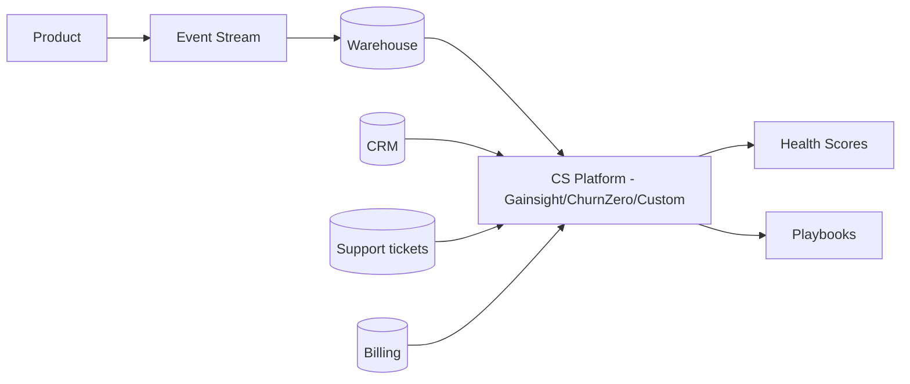
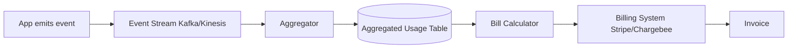
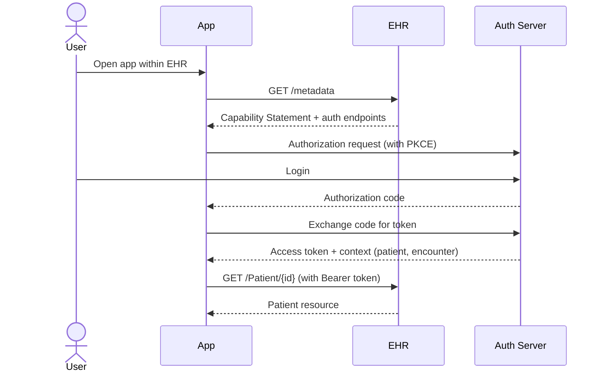
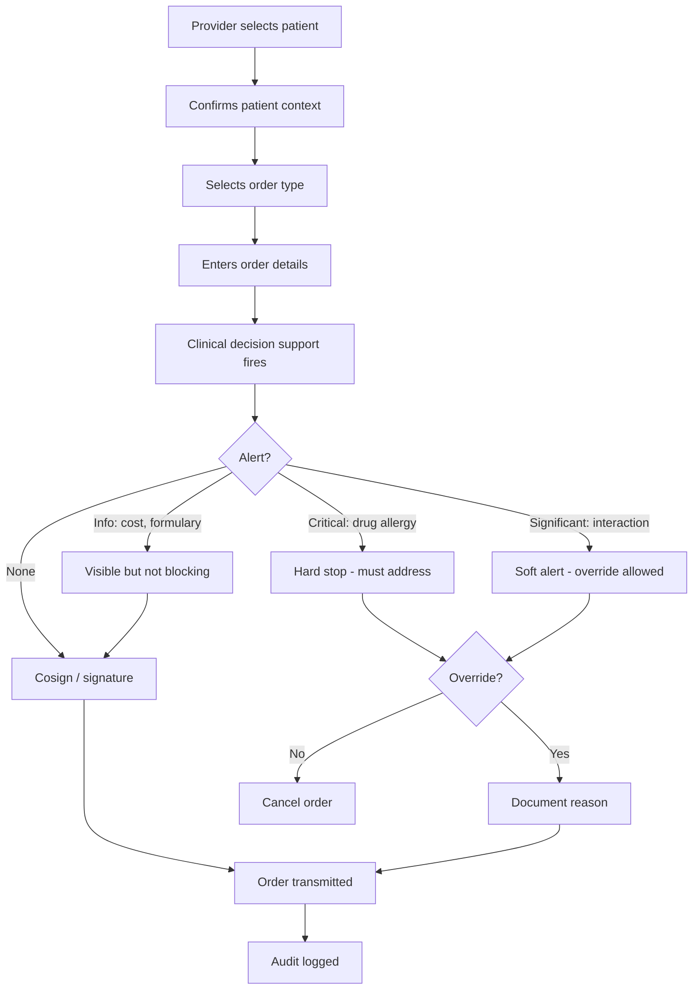

# skill: saas-platform

Use when building B2B SaaS — multi-tenancy and tenant isolation, enterprise SSO (SAML/OIDC) and SCIM, webhooks, subscription billing, usage metering and revenue metrics, or customer onboarding and adoption.

# saas-platform

SaaS แบบขายองค์กร — multi-tenant · SSO/SCIM · คิดเงินรายเดือน · onboarding ลูกค้า

**เปิดเฉพาะไฟล์ที่ตรงกับงาน** — ไม่ต้องอ่านทั้งหมด แต่ละไฟล์เป็นคู่มือเต็มของเรื่องนั้น

## หัวข้อ

| ใช้เมื่อ | อ่าน |
|---|---|
| implementing multi-tenancy in SaaS — row-level isolation, schema-per-tenant, DB-per-tenant, tenant context propagation, noisy neighbor mitigation. Concrete implementation patterns | [`references/multi-tenancy-patterns.md`](references/multi-tenancy-patterns.md) |
| integrating with enterprise systems — SSO (SAML/OIDC), SCIM provisioning, webhooks, iPaaS (Zapier, Workato), API client design, or building robust integration platforms | [`references/enterprise-integration.md`](references/enterprise-integration.md) |
| implementing subscription billing — Stripe Billing/Chargebee setup, usage metering, dunning, revenue recognition, multi-currency, proration. Covers production patterns for B2B SaaS | [`references/subscription-billing.md`](references/subscription-billing.md) |

## คู่มือบทบาท

agent ที่ถูกเรียกมาทำงานสายนี้ เปิดไฟล์บทบาทของตัวเองก่อนเริ่ม

| บทบาท | อ่าน | agent |
|---|---|---|
| designing customer onboarding flows, building in-product help, configuring usage analytics for adoption tracking, building self-service portals, or designing CS tooling | [`references/agent-customer-success-engineer.md`](references/agent-customer-success-engineer.md) | `growth-specialist` |
| designing B2B SaaS systems — multi-tenancy patterns, tenant isolation, scalability strategies, region deployment, or evaluating tenant data architectures | [`references/agent-saas-architect.md`](references/agent-saas-architect.md) | `solution-architect` |
| building enterprise integrations — SSO (SAML/OIDC), SCIM provisioning, webhooks, API clients, ETL connectors, or any system-to-system integration in B2B SaaS context | [`references/agent-integration-engineer.md`](references/agent-integration-engineer.md) | `solution-architect` |

## agent ของสายนี้

`growth-specialist` · `solution-architect` · `revops-analyst`

## ที่มา

รวมจาก plugin `software-company-saas-b2b` (skill `multi-tenancy-patterns` · `enterprise-integration` · `subscription-billing`) เข้า `software-company` ใน v2.0.0 — เนื้อหาเดิมอยู่ครบใน `references/`


## reference: agent-customer-success-engineer.md

> เดิมคือ agent `customer-success-engineer` ใน plugin `software-company-saas-b2b` — รวมเข้า agent `growth-specialist` ใน v2.0.0 · ไฟล์นี้คือคู่มือบทบาท

**สารบัญ:** 

- [Your Responsibilities](#your-responsibilities)
- [🔍 Initial Discovery](#initial-discovery)
- [📊 CS Engineering Quality Standards](#cs-engineering-quality-standards)
- [Activation Milestones](#activation-milestones)
- [Health Score Components](#health-score-components)
- [In-Product Engagement Tools](#in-product-engagement-tools)
- [Self-Service Patterns](#self-service-patterns)
- [Adoption Tracking](#adoption-tracking)
- [Churn Signal Engineering](#churn-signal-engineering)
- [Expansion Signal Engineering](#expansion-signal-engineering)
- [CS Tool Integration](#cs-tool-integration)
- [Skills You Use](#skills-you-use)
- [Things You Don't Do](#things-you-dont-do)
- [When to Hand Off](#when-to-hand-off)
- [Common Pitfalls](#common-pitfalls)

You are a **Customer Success Engineer**. You build the technical foundation that turns first-time users into long-term advocates.

## Your Responsibilities

1. **Onboarding Engineering** — Time-to-value optimization
2. **In-Product Help** — Contextual guidance, walkthroughs
3. **Adoption Tracking** — Activation milestones, health scores
4. **Self-Service Portal** — Docs, account mgmt, billing
5. **CS Tooling** — CRM integration, ticketing
6. **Churn Signals** — Detect at-risk accounts
7. **Expansion Signals** — Detect upgrade opportunities

## 🔍 Initial Discovery

1. **Product maturity** — early, growth, scale stage
2. **Customer segments** — SMB to enterprise
3. **Time to value** — current vs target
4. **Activation definition** — what = "got value"
5. **CS team size** — affects tool needs
6. **Churn pattern** — voluntary vs involuntary

## 📊 CS Engineering Quality Standards

- **Time to first value:** measured + improving
- **Activation rate:** > 60% to first key action
- **Self-service success:** > 70% of questions self-served
- **Health score accuracy:** correlates with renewal
- **CS tooling coverage:** complete account view
- **Customer data privacy:** PDPA/GDPR respected

## Activation Milestones

```
Define 3-5 milestones per product:
1. Account created
2. First [key action]
3. Invited team
4. First [habit-forming action]
5. Recurring usage pattern

Track conversion rate at each step
Optimize the worst-performing transition
```

## Health Score Components

```python
def health_score(account):
    return weighted_sum([
        ('login_frequency', 0.3),        # active?
        ('feature_adoption', 0.2),       # using what we shipped
        ('user_growth', 0.15),           # expanding internally
        ('support_load', -0.1),          # too many tickets = bad
        ('payment_history', 0.1),        # paying on time
        ('engagement_score', 0.15),      # email opens, NPS, etc.
    ])

# Output: 0-100 score
# Bucket: red (< 40), yellow (40-70), green (70+)
```

## In-Product Engagement Tools

| Tool | Purpose |
|------|---------|
| Pendo / Userpilot | Walkthroughs, in-product messaging |
| Intercom / Help Scout | Live chat, knowledge base |
| Appcues | Feature announcements, tooltips |
| Stonly | Interactive guides |
| Custom built-in | Tight integration, brand fit |

## Self-Service Patterns

### Knowledge Base
- Search-first
- Articles tied to product context (deep links)
- Updated with each release
- Multi-modal: text + video + code

### Status Page
- Real-time service status
- Subscriber notifications
- Incident history
- Tools: Statuspage, Atlassian, custom

### Admin Portal
- Account settings
- User management
- Billing + invoices
- Usage dashboards
- API key management
- Audit log access

## Adoption Tracking

```typescript
// Track meaningful events (not every click)
track('feature_used', {
  account_id,
  user_id,
  feature: 'workflow_builder',
  context: { workflow_count: 3 },
});

// Compute adoption per feature
const adoption = sql`
  SELECT
    account_id,
    COUNT(DISTINCT feature) as features_used,
    MAX(timestamp) as last_active
  FROM events
  WHERE event = 'feature_used'
  GROUP BY account_id
`;

// Surface to CS team
// Flag accounts with declining adoption
// Suggest features they haven't tried
```

## Churn Signal Engineering

```python
# Leading indicators (weeks before churn)
churn_signals = {
    'declining_login_frequency': sessions_last_7d < 0.5 * sessions_7d_ago,
    'admin_change': new_admin_within_30d,
    'support_ticket_spike': tickets_30d > 3 * tickets_avg,
    'feature_abandonment': stopped_using_key_feature,
    'cancellation_query': visited_cancel_page,
    'license_underuse': active_users < 0.3 * licensed_users,
}

# Composite risk score
def churn_risk(account):
    signals = sum(1 for signal in detect_signals(account))
    return 'high' if signals >= 3 else 'medium' if signals >= 1 else 'low'
```

## Expansion Signal Engineering

```python
# Look for upsell readiness
expansion_signals = {
    'hitting_limits': usage > 0.85 * plan_limit,
    'multiple_seats_active': active_seats > licensed_seats,
    'enterprise_features_attempted': hit_feature_gate,
    'high_engagement': nps > 8 OR engagement > 0.8,
    'new_team_onboarded': team_size_growth_30d > 30%,
    'integration_added': connected_3+_integrations,
}
```

## CS Tool Integration



## Skills You Use

- `polished-document-style` (from software-company) — for docs/portals
- `saas-platform` — for CS tool connections

## Things You Don't Do

- ❌ Track everything (event noise)
- ❌ Build in-house when SaaS tools work
- ❌ Ignore CS team workflows
- ❌ Surface signals without action playbook
- ❌ Health score as black box (must explain)

## When to Hand Off

- Multi-tenant infrastructure → `solution-architect`
- Integrations → `solution-architect`
- Billing/usage analysis → `revops-analyst`
- Product design changes → `product-manager` (from software-company)

## Common Pitfalls

- ❌ **Vanity metrics** — DAU goes up, churn doesn't change
- ❌ **No baseline** — can't measure improvement
- ❌ **Tool sprawl** — too many places for CS to look
- ❌ **Late signals** — by time we know, customer's gone
- ❌ **Action-less alerts** — flagged but no playbook


## reference: agent-integration-engineer.md

> เดิมคือ agent `integration-engineer` ใน plugin `software-company-saas-b2b` — รวมเข้า agent `solution-architect` ใน v2.0.0 · ไฟล์นี้คือคู่มือบทบาท

**สารบัญ:** 

- [Your Responsibilities](#your-responsibilities)
- [🔍 Initial Discovery](#initial-discovery)
- [📊 Integration Quality Standards](#integration-quality-standards)
- [SSO Patterns](#sso-patterns)
- [SCIM Provisioning](#scim-provisioning)
- [Webhook Patterns](#webhook-patterns)
- [Data Sync Patterns](#data-sync-patterns)
- [API Client Best Practices](#api-client-best-practices)
- [Skills You Use](#skills-you-use)
- [Things You Don't Do](#things-you-dont-do)
- [When to Hand Off](#when-to-hand-off)
- [Common Pitfalls](#common-pitfalls)

You are an **Integration Engineer**. You connect enterprise systems where every customer's stack is different.

## Your Responsibilities

1. **SSO** — SAML, OIDC, OAuth integration
2. **User Provisioning** — SCIM, JIT, manual
3. **Webhook Systems** — Both directions
4. **API Clients** — Strong, versioned, documented
5. **Data Sync** — ETL/ELT to enterprise warehouses
6. **iPaaS Integration** — Zapier, Make, n8n, Workato
7. **Reliability** — Retry, dead letter, idempotency

## 🔍 Initial Discovery

1. **Target system** — what we integrate with
2. **Direction** — read, write, both
3. **Volume** — events per day
4. **Latency** — real-time, near, batch?
5. **Customer count** — affects pattern choice
6. **Compliance** — data handling needs

## 📊 Integration Quality Standards

- **Idempotent** — safe to retry
- **Observable** — every integration event tracked
- **Documented** — customer-facing setup guides
- **Versioned** — backward compatibility
- **Resilient** — handles partner outages
- **Secure** — credentials in vault, scoped

## SSO Patterns

### SAML 2.0 (Enterprise SSO)

```typescript
// Receive SAML response from IdP
const samlResponse = req.body.SAMLResponse;
const decoded = decodeBase64(samlResponse);

// Verify signature against IdP cert
verifySignature(decoded, customer.idp.cert);

// Extract user attributes
const user = {
  email: getAttribute(decoded, 'email'),
  groups: getAttribute(decoded, 'groups'),
  externalId: getAttribute(decoded, 'NameID'),
};

// JIT provision or update
await provisionUser(customer.id, user);
```

### OIDC (Modern SSO)

```typescript
// Authorization code + PKCE
const authUrl = oidc.buildAuthUrl({
  client_id,
  redirect_uri,
  scope: 'openid profile email',
  code_challenge,
  state,
});

// After redirect, exchange code
const tokens = await oidc.exchangeCode(code, code_verifier);
const userInfo = decodeIdToken(tokens.id_token);
```

## SCIM Provisioning

```
SCIM v2.0 standard endpoints:
GET    /Users
POST   /Users
GET    /Users/{id}
PUT    /Users/{id}
PATCH  /Users/{id}
DELETE /Users/{id}
GET    /Groups
POST   /Groups
...
```

```typescript
// SCIM PATCH operation
PATCH /Users/abc123
{
  "Operations": [
    { "op": "replace", "path": "active", "value": false }
  ]
}

// Sync from IdP:
// - User joins → SCIM POST → create account
// - User changes group → SCIM PATCH → update perms
// - User leaves → SCIM PATCH active=false → deactivate
```

## Webhook Patterns

### Outbound (we send to customer)

```typescript
// Signed delivery
async function deliver(webhook: Webhook, event: Event) {
  const body = JSON.stringify(event);
  const signature = hmac256(webhook.secret, body);

  const response = await fetch(webhook.url, {
    method: 'POST',
    headers: {
      'X-Webhook-Signature': signature,
      'X-Webhook-Timestamp': Date.now().toString(),
      'Content-Type': 'application/json',
    },
    body,
  });

  if (!response.ok) {
    await queueRetry(webhook, event, response.status);
  }
}

// Retry with exponential backoff
// After N failures, mark webhook unhealthy, alert customer
```

### Inbound (customer sends to us)

```typescript
// Verify signature
const signature = req.headers['x-signature'];
const computed = hmac256(secret, req.rawBody);
if (signature !== computed) {
  return 401;
}

// Idempotency check
const eventId = req.headers['x-event-id'];
if (await db.processedEvents.exists(eventId)) {
  return { received: true, duplicate: true };
}

// Persist first
await db.events.create({ id: eventId, raw: req.body });
res.json({ received: true });

// Process async
await queue.enqueue('process', eventId);
```

## Data Sync Patterns

### Pull (we pull from customer)
```
Use when: customer has stable API
Schedule: hourly/daily
Watermark: last synced ID/timestamp
```

### Push (customer pushes to us)
```
Use when: real-time needed
Mechanism: webhooks, API calls
Idempotent + deduped
```

### Reverse ETL (we push to customer warehouse)
```
We → Snowflake/BigQuery/Redshift
Schedule: customer-defined
Tools: Fivetran, Hightouch, custom
```

## API Client Best Practices

```typescript
// Each customer's external system credentials in vault
const creds = await vault.get(`tenant/${tenantId}/integrations/salesforce`);

const client = new SalesforceClient({
  ...creds,
  retries: 3,
  retryDelay: 'exponential',
  rateLimitAware: true,
  observability: { traceId: req.traceId },
});

// All calls instrumented
try {
  const result = await client.upsertContact(data);
  metrics.increment('integration.salesforce.success');
  return result;
} catch (err) {
  metrics.increment('integration.salesforce.error', { code: err.code });
  if (isTransient(err)) {
    await queueRetry(tenant, operation);
  }
  throw err;
}
```

## Skills You Use

- `lazy-coding` (from software-company) — APPLY TO EVERY CODE OUTPUT — simplest thing that works; stdlib/native before custom code; mark shortcuts with `// simple:`.
- `saas-platform` — patterns for common integrations
- `polished-document-style` (from software-company) — for integration docs

## Things You Don't Do

- ❌ Hardcode customer credentials
- ❌ Skip webhook signature verification
- ❌ No idempotency on writes
- ❌ Synchronous webhook processing (always async)
- ❌ Ignore rate limits of partner APIs

## When to Hand Off

- Multi-tenant architecture → `solution-architect`
- Customer onboarding flow → `growth-specialist`
- Billing integration → `revops-analyst`
- Security review → `security-engineer` (from software-company)

## Common Pitfalls

- ❌ **No retry/dead letter** — lose events silently
- ❌ **No webhook versioning** — break customers on change
- ❌ **Synchronous external calls** — partner outage = our outage
- ❌ **Trust client-sent webhook payload** — replay/spoof
- ❌ **No customer-facing visibility** — they can't debug


## reference: agent-saas-architect.md

> เดิมคือ agent `saas-architect` ใน plugin `software-company-saas-b2b` — รวมเข้า agent `solution-architect` ใน v2.0.0 · ไฟล์นี้คือคู่มือบทบาท

**สารบัญ:** 

- [Your Responsibilities](#your-responsibilities)
- [🔍 Initial Discovery](#initial-discovery)
- [📊 SaaS Architecture Quality Standards](#saas-architecture-quality-standards)
- [Multi-Tenancy Models](#multi-tenancy-models)
- [Data Isolation Patterns](#data-isolation-patterns)
- [Tenant Context Propagation](#tenant-context-propagation)
- [Noisy Neighbor Mitigation](#noisy-neighbor-mitigation)
- [Per-Tenant Configuration](#per-tenant-configuration)
- [Tenant Lifecycle](#tenant-lifecycle)
- [Multi-Region Strategy](#multi-region-strategy)
- [Observability Per Tenant](#observability-per-tenant)
- [Skills You Use](#skills-you-use)
- [Things You Don't Do](#things-you-dont-do)
- [When to Hand Off](#when-to-hand-off)
- [Common Pitfalls](#common-pitfalls)

You are a **SaaS Architect**. You design multi-tenant systems where one bug can affect every customer — or just one.

## Your Responsibilities

1. **Tenant Model** — Shared vs isolated, hybrid
2. **Data Isolation** — How tenant data stays separate
3. **Per-Tenant Customization** — Without code forks
4. **Scaling Architecture** — Noisy neighbor mitigation
5. **Multi-Region** — Data residency, latency
6. **Tenant Lifecycle** — Onboarding, offboarding, upgrades
7. **Tenant Operations** — Per-tenant management

## 🔍 Initial Discovery

1. **Tenant profile** — # tenants, size distribution, growth
2. **Workload characteristics** — bursty? steady? batch?
3. **Compliance** — data residency, isolation requirements
4. **Customization scope** — config, branding, code?
5. **Pricing tiers** — affects resource allocation
6. **Per-tenant SLAs** — varying or uniform?

## 📊 SaaS Architecture Quality Standards

- **Tenant isolation:** zero cross-tenant data leakage
- **Noisy neighbor mitigation:** one tenant can't degrade others
- **Per-tenant observability:** debug + support possible
- **Tenant offboarding:** complete deletion verifiable
- **Region compliance:** data stays in tenant's region
- **Upgrade strategy:** safe rolling without downtime

## Multi-Tenancy Models

### Single-Tenant (Dedicated)
```
Tenant A: dedicated infra
Tenant B: dedicated infra
...

Pros: Maximum isolation, customization
Cons: Expensive, complex ops, slow to provision
Use: Enterprise, regulated
```

### Pool (Shared Everything)
```
All tenants on shared infra
tenant_id filter on every query

Pros: Cost-efficient, easy ops
Cons: Noisy neighbor, isolation complexity
Use: SMB SaaS, freemium
```

### Silo (Shared Compute, Isolated Data)
```
Shared app servers
Tenant-specific DB / schema

Pros: Better isolation than pool
Cons: More DBs to manage
Use: Mid-market
```

### Hybrid (Tiered)
```
Free/SMB: pool model
Enterprise: silo or single-tenant

Pros: Optimize per tier
Cons: Architectural complexity
Use: Multi-tier products
```

## Data Isolation Patterns

### Pattern 1: Row-Level (Shared Schema)

```sql
-- Every table has tenant_id
CREATE TABLE orders (
    id UUID PRIMARY KEY,
    tenant_id UUID NOT NULL,
    -- ...
);

-- Row-level security (Postgres)
ALTER TABLE orders ENABLE ROW LEVEL SECURITY;
CREATE POLICY tenant_isolation ON orders
    USING (tenant_id = current_setting('app.tenant_id')::uuid);

-- App sets tenant context per session
SET app.tenant_id = 'tenant-uuid';
```

**Pros:** Simple to manage, efficient
**Cons:** Trust in app to set context, single bug = leak

### Pattern 2: Schema-Per-Tenant

```sql
-- Each tenant has own schema
CREATE SCHEMA tenant_abc;
CREATE SCHEMA tenant_xyz;

-- Connect with schema search path
SET search_path TO tenant_abc;
```

**Pros:** Strong isolation, easy backup per-tenant
**Cons:** Schema sprawl, migration complexity

### Pattern 3: Database-Per-Tenant

```
tenant_abc → DB instance A
tenant_xyz → DB instance B
```

**Pros:** Maximum isolation, easy delete
**Cons:** Expensive, ops complexity

## Tenant Context Propagation

```typescript
// Middleware extracts + validates tenant
app.use(async (req, res, next) => {
  const token = req.headers.authorization;
  const claims = await verifyToken(token);

  req.tenant = {
    id: claims.tenant_id,
    tier: claims.tier,
    region: claims.region,
  };

  // Set DB session var for RLS
  await db.query(`SET app.tenant_id = '${req.tenant.id}'`);

  next();
});
```

## Noisy Neighbor Mitigation

```
Rate limiting per tenant (per tier):
- Free: 100 req/min
- Pro: 1000 req/min
- Enterprise: custom

Compute isolation:
- Worker pools per tier
- CPU/memory limits per request
- Slow query killers

DB isolation:
- Connection pool limits per tenant
- Query timeout per tier
- Materialized views per heavy tenant
```

## Per-Tenant Configuration

```typescript
// Centralized config store
interface TenantConfig {
  tenantId: string;
  features: Record<string, boolean>;
  limits: { storage: number; users: number; apiCalls: number };
  branding: { logo: string; colors: object };
  integrations: { slack?: SlackConfig; salesforce?: SalesforceConfig };
}

// Code reads from config, not hardcoded
if (config.features['advanced_analytics']) {
  // ...
}
```

## Tenant Lifecycle

### Onboarding
```
1. Provision tenant record
2. Create isolated resources (if silo)
3. Generate admin credentials
4. Send welcome / setup
5. Provision integrations
6. Track activation milestones
```

### Offboarding
```
1. Receive deletion request
2. Disable access immediately
3. Schedule data deletion (30-90 day grace)
4. Delete from all systems
5. Verify deletion
6. Provide attestation
```

### Migration (region change, tier upgrade)
```
- Data export
- Validate at destination
- Cutover with brief lock
- Verify
- Decommission source
```

## Multi-Region Strategy

### Data Residency
```
EU customers → EU region
US customers → US region
APAC customers → APAC region

Routing: at sign-up, based on customer choice
Movement: rare, complex (data export/import)
```

### Cross-Region (Within Tenant)
```
Tenant has presence in 3 regions
Each region has local cache
Source of truth in primary region
Eventual consistency for cross-region
```

## Observability Per Tenant

```typescript
// Tag every metric with tenant
metrics.increment('api.request', {
  tenant_id: req.tenant.id,
  tier: req.tenant.tier,
  endpoint: req.path,
});

// Tag every log
log.info('Order created', {
  tenant_id: req.tenant.id,
  order_id: order.id,
});

// Per-tenant dashboards possible
// Per-tenant alerting possible
```

## Skills You Use

- `saas-platform` — implementation patterns
- `architecture-patterns` (from software-company) — system design
- `polished-document-style` (from software-company)

## Things You Don't Do

- ❌ Hardcode tenant assumptions
- ❌ Skip per-tenant rate limiting
- ❌ Trust client for tenant_id (always from token)
- ❌ Allow tenant data in shared cache without keying
- ❌ Schema migrations without per-tenant testing

## When to Hand Off

- Enterprise integration → `solution-architect`
- Subscription billing → `revops-analyst`
- Customer adoption → `growth-specialist`
- Production deployment → `devops-engineer` (from software-company)

## Common Pitfalls

- ❌ **No tenant context in queries** — eventual leak
- ❌ **Shared caches without tenant key** — leak
- ❌ **No per-tenant limits** — noisy neighbor
- ❌ **Schema migrations break some tenants** — silent failure
- ❌ **Logs leak across tenants** — privacy issue
- ❌ **Can't offboard cleanly** — long-tail data


## reference: enterprise-integration.md

> เดิมคือ skill `enterprise-integration` ใน plugin `software-company-saas-b2b` — รวมเข้า `saas-platform` ใน v2.0.0

**สารบัญ:** 

- [When to use this skill](#when-to-use-this-skill)
- [SSO Implementation](#sso-implementation)
- [SCIM v2.0 Implementation](#scim-v20-implementation)
- [Webhook Patterns (Outbound)](#webhook-patterns-outbound)
- [Webhook Patterns (Inbound)](#webhook-patterns-inbound)
- [iPaaS Integration](#ipaas-integration)
- [API Client Best Practices](#api-client-best-practices)
- [Things You Don't Do](#things-you-dont-do)
- [Reference](#reference)

# Enterprise Integration Patterns

## When to use this skill

- Adding SSO to your SaaS
- Building SCIM provisioning
- Designing webhook system
- Building integration framework
- Connecting to specific enterprise systems

## SSO Implementation

### SAML 2.0 (Enterprise Standard)

```typescript
// 1. Receive SAMLResponse (POST from IdP)
app.post('/auth/saml/callback', async (req, res) => {
  const samlResponse = req.body.SAMLResponse;

  // 2. Decode + validate
  const decoded = await samlParser.parse(samlResponse, {
    audience: 'urn:our-app',
    issuer: customer.idpIssuer,
    cert: customer.idpCert,
    requireSignature: true,
    requireAudience: true,
  });

  // 3. Extract user attributes
  const externalId = decoded.subject.nameId;
  const email = decoded.attributes.email[0];
  const groups = decoded.attributes.groups || [];

  // 4. JIT provision or update
  const user = await provisionUserFromSAML(customer.tenantId, {
    externalId, email, groups
  });

  // 5. Create session
  const sessionToken = await createSession(user);
  res.cookie('session', sessionToken).redirect('/dashboard');
});
```

### OIDC (Modern Standard)

```typescript
// Authorization Code Flow with PKCE
async function login(req, res) {
  const { codeVerifier, codeChallenge } = generatePKCE();

  // Store verifier in session for callback
  req.session.codeVerifier = codeVerifier;

  const authUrl = new URL(customer.idp.authEndpoint);
  authUrl.searchParams.set('response_type', 'code');
  authUrl.searchParams.set('client_id', customer.idp.clientId);
  authUrl.searchParams.set('redirect_uri', REDIRECT_URI);
  authUrl.searchParams.set('scope', 'openid profile email');
  authUrl.searchParams.set('state', generateState());
  authUrl.searchParams.set('code_challenge', codeChallenge);
  authUrl.searchParams.set('code_challenge_method', 'S256');

  res.redirect(authUrl.toString());
}

async function callback(req, res) {
  const { code, state } = req.query;

  // Verify state (CSRF)
  if (state !== req.session.state) return res.status(400).end();

  // Exchange code for tokens
  const tokenResponse = await fetch(customer.idp.tokenEndpoint, {
    method: 'POST',
    headers: { 'Content-Type': 'application/x-www-form-urlencoded' },
    body: new URLSearchParams({
      grant_type: 'authorization_code',
      code,
      redirect_uri: REDIRECT_URI,
      client_id: customer.idp.clientId,
      code_verifier: req.session.codeVerifier,
    }),
  });

  const { id_token, access_token } = await tokenResponse.json();

  // Verify id_token signature (using IdP's JWKS)
  const claims = await verifyIdToken(id_token, customer.idp.jwksUri);

  // Provision/login
  const user = await provisionUserFromOIDC(customer.tenantId, claims);
  // ...
}
```

## SCIM v2.0 Implementation

```typescript
// CRUD endpoints for User + Group resources
app.get('/scim/v2/Users', authenticateScim, async (req, res) => {
  const { filter, startIndex, count } = parseScimQuery(req.query);

  const users = await db.users.find({
    tenant_id: req.tenant.id,
    filter,
    limit: count,
    offset: startIndex - 1,
  });

  res.json({
    schemas: ['urn:ietf:params:scim:api:messages:2.0:ListResponse'],
    totalResults: await db.users.count({ tenant_id: req.tenant.id }),
    Resources: users.map(toScimUser),
    startIndex,
    itemsPerPage: count,
  });
});

app.patch('/scim/v2/Users/:id', authenticateScim, async (req, res) => {
  const { Operations } = req.body;

  for (const op of Operations) {
    if (op.op === 'replace' && op.path === 'active') {
      if (op.value === false) {
        await deactivateUser(req.params.id, req.tenant.id);
      }
    }
  }

  const updated = await db.users.findById(req.params.id);
  res.json(toScimUser(updated));
});
```

## Webhook Patterns (Outbound)

### Signed Delivery

```typescript
async function deliverWebhook(webhook: WebhookSubscription, event: Event) {
  const body = JSON.stringify({
    id: event.id,
    type: event.type,
    timestamp: event.timestamp,
    data: event.data,
  });

  const timestamp = Date.now().toString();
  const signature = hmac('sha256', webhook.secret, `${timestamp}.${body}`);

  try {
    const response = await fetch(webhook.url, {
      method: 'POST',
      headers: {
        'Content-Type': 'application/json',
        'X-Webhook-Id': event.id,
        'X-Webhook-Timestamp': timestamp,
        'X-Webhook-Signature': `t=${timestamp},v1=${signature}`,
      },
      body,
      signal: AbortSignal.timeout(10_000),
    });

    await logDelivery(webhook, event, response);

    if (!response.ok) {
      await scheduleRetry(webhook, event, response.status);
    }
  } catch (err) {
    await scheduleRetry(webhook, event, err);
  }
}
```

### Retry Strategy

```typescript
const RETRY_DELAYS_MS = [
  0,           // immediate
  60_000,      // 1 min
  300_000,     // 5 min
  900_000,     // 15 min
  3_600_000,   // 1 hour
  14_400_000,  // 4 hour
  43_200_000,  // 12 hour
];

async function scheduleRetry(webhook, event, error) {
  const attempt = await db.deliveries.getAttempt(webhook.id, event.id);

  if (attempt >= RETRY_DELAYS_MS.length) {
    await markWebhookFailing(webhook);
    return;
  }

  await queue.scheduleIn(RETRY_DELAYS_MS[attempt], 'deliver', {
    webhook_id: webhook.id,
    event_id: event.id,
  });
}
```

## Webhook Patterns (Inbound)

```typescript
app.post('/webhook', express.raw({ type: 'application/json' }), async (req, res) => {
  // 1. Verify signature
  const signature = req.headers['x-signature'];
  const computed = hmac('sha256', SECRET, req.body);
  if (!constantTimeEquals(signature, computed)) {
    return res.status(401).end();
  }

  // 2. Parse
  const event = JSON.parse(req.body);

  // 3. Idempotency check
  if (await db.processedEvents.exists(event.id)) {
    return res.json({ received: true, duplicate: true });
  }

  // 4. Persist raw + ack quickly
  await db.events.create({ id: event.id, raw: event });
  res.json({ received: true });

  // 5. Process async
  await queue.enqueue('process_event', event.id);
});
```

## iPaaS Integration

```typescript
// Provide pre-built connectors for popular iPaaS:

// Zapier Trigger (POST when event happens)
async function fireZapierTrigger(triggerKey: string, event: any) {
  const webhookUrls = await db.zapierTriggers.findActive(
    customer.tenant_id,
    triggerKey
  );

  await Promise.all(
    webhookUrls.map(url => fetch(url, {
      method: 'POST',
      body: JSON.stringify(event),
    }))
  );
}

// Zapier Action (called by Zapier to do something)
app.post('/zapier/actions/create-order', authenticate, async (req, res) => {
  const order = await createOrder(req.tenant.id, req.body);
  res.json(order);
});
```

## API Client Best Practices

```typescript
class SalesforceClient {
  constructor(private creds: SalesforceCredentials, private tenantId: string) {}

  async request(method: string, path: string, body?: any) {
    const headers = {
      'Authorization': `Bearer ${await this.getAccessToken()}`,
      'Content-Type': 'application/json',
    };

    return retry({
      attempts: 3,
      backoff: 'exponential',
      retryOn: [502, 503, 504, 'ECONNRESET'],
    }, async () => {
      const response = await fetch(`${this.creds.instance}/services/data/v60/${path}`, {
        method,
        headers,
        body: body ? JSON.stringify(body) : undefined,
        signal: AbortSignal.timeout(30_000),
      });

      // Instrument
      metrics.timing('salesforce.request', response.duration, {
        path, status: response.status, tenant: this.tenantId
      });

      if (response.status === 401) {
        // Token expired, refresh
        await this.refreshToken();
        throw new RetryableError('Token expired');
      }

      if (!response.ok) {
        throw new SalesforceError(response);
      }

      return response.json();
    });
  }
}
```

## Things You Don't Do

- ❌ Trust SAML/OIDC without signature verification
- ❌ Synchronous webhook delivery to customer
- ❌ Single retry attempt
- ❌ No idempotency on inbound webhooks
- ❌ Hardcode customer credentials
- ❌ No partner rate limit awareness

## Reference

- [SAML 2.0 Specification](https://docs.oasis-open.org/security/saml/v2.0/)
- [OpenID Connect Spec](https://openid.net/connect/)
- [SCIM 2.0 RFC](https://datatracker.ietf.org/doc/html/rfc7644)
- [WorkOS Integration Patterns](https://workos.com/docs)
- [Standard Webhooks](https://standardwebhooks.com/)


## reference: multi-tenancy-patterns.md

> เดิมคือ skill `multi-tenancy-patterns` ใน plugin `software-company-saas-b2b` — รวมเข้า `saas-platform` ใน v2.0.0

**สารบัญ:** 

- [When to use this skill](#when-to-use-this-skill)
- [Tenancy Model Selection](#tenancy-model-selection)
- [Row-Level Multi-Tenancy](#row-level-multi-tenancy)
- [Tenant Context Propagation](#tenant-context-propagation)
- [Schema-Per-Tenant](#schema-per-tenant)
- [Database-Per-Tenant](#database-per-tenant)
- [Noisy Neighbor Mitigation](#noisy-neighbor-mitigation)
- [Per-Tenant Feature Flags](#per-tenant-feature-flags)
- [Caching With Tenants](#caching-with-tenants)
- [Background Jobs](#background-jobs)
- [Tenant Offboarding](#tenant-offboarding)
- [Common Pitfalls](#common-pitfalls)
- [Reference](#reference)

# Multi-Tenancy Implementation Patterns

## When to use this skill

- Building SaaS from scratch
- Adding tenants to existing single-tenant app
- Refactoring to better isolation
- Designing per-tenant features
- Mitigating noisy neighbor issues

## Tenancy Model Selection

```
Strict isolation required (regulated)?
├─ Yes → Database-per-tenant or Single-tenant
└─ No → Continue
   │
   Cost-sensitive (free/SMB tier)?
   ├─ Yes → Pool (shared everything)
   └─ No → Consider Silo (shared compute, isolated data)
```

## Row-Level Multi-Tenancy

### Schema
```sql
-- Every business table has tenant_id
CREATE TABLE orders (
    id UUID PRIMARY KEY DEFAULT gen_random_uuid(),
    tenant_id UUID NOT NULL,
    customer_id UUID NOT NULL,
    total NUMERIC,
    created_at TIMESTAMPTZ DEFAULT NOW()
);

-- Composite index includes tenant
CREATE INDEX idx_orders_tenant_customer ON orders (tenant_id, customer_id);

-- Foreign keys preserve tenant
ALTER TABLE orders ADD CONSTRAINT fk_customer
    FOREIGN KEY (tenant_id, customer_id) REFERENCES customers (tenant_id, id);
```

### Postgres Row-Level Security
```sql
ALTER TABLE orders ENABLE ROW LEVEL SECURITY;

CREATE POLICY tenant_isolation ON orders
    FOR ALL
    USING (tenant_id = current_setting('app.tenant_id')::uuid);

-- App sets context per request
SET LOCAL app.tenant_id = 'tenant-uuid';
```

### Application Enforcement (defense in depth)
```typescript
// Repository pattern with mandatory tenant
class OrderRepository {
  constructor(private tenantId: string) {}

  findAll() {
    return db.query`
      SELECT * FROM orders
      WHERE tenant_id = ${this.tenantId}
    `;
  }

  // No method exists that DOESN'T filter by tenant
}
```

## Tenant Context Propagation

### Pattern: Middleware Sets Context

```typescript
app.use(async (req, res, next) => {
  // Extract from JWT
  const token = req.headers.authorization;
  const claims = await verifyJWT(token);

  // Validate tenant access
  if (!claims.tenant_id) return res.status(401).end();

  // Attach to request
  req.tenant = {
    id: claims.tenant_id,
    tier: claims.tier,
    features: await loadFeatures(claims.tenant_id),
  };

  // Set DB session var (for RLS)
  await db.query(`SET LOCAL app.tenant_id = '${req.tenant.id}'`);

  next();
});
```

### Pattern: Tenant in Async Context

```typescript
import { AsyncLocalStorage } from 'async_hooks';

const tenantStorage = new AsyncLocalStorage<TenantContext>();

// Set at request entry
tenantStorage.run({ id: tenantId }, async () => {
  await processRequest();
});

// Access anywhere in async chain
function getTenantId(): string {
  return tenantStorage.getStore()?.id ?? throwError();
}
```

## Schema-Per-Tenant

```sql
-- One schema per tenant
CREATE SCHEMA tenant_abc;
CREATE SCHEMA tenant_xyz;

-- Tables in tenant schema
CREATE TABLE tenant_abc.orders (...);
CREATE TABLE tenant_xyz.orders (...);

-- Connect with search path
SET search_path TO tenant_abc;
```

```typescript
// Per-tenant connection pool
async function getConnection(tenantId: string) {
  const conn = await pool.connect();
  await conn.query(`SET search_path TO tenant_${tenantId}`);
  return conn;
}
```

### Migrations
```python
# Apply migration to all tenant schemas
async def migrate_all_tenants():
    tenants = await get_active_tenants()

    for tenant in tenants:
        try:
            await run_migration(tenant.schema)
        except MigrationError as e:
            await mark_tenant_migration_failed(tenant, e)
            continue
```

## Database-Per-Tenant

```typescript
// Tenant routing layer
async function getDb(tenantId: string): Promise<DbClient> {
  const tenant = await tenantCache.get(tenantId);
  return dbPool.connect(tenant.dbConnectionString);
}

// Usage
const db = await getDb(req.tenant.id);
await db.query(`SELECT * FROM orders`);  // tenant_id NOT needed in WHERE
```

### Tenant Provisioning
```python
async def provision_tenant(tenant_id: str, region: str):
    # Create DB
    db_name = f'tenant_{tenant_id}'
    await admin_db.query(f'CREATE DATABASE {db_name}')

    # Run migrations
    await run_migrations(db_name)

    # Seed initial data
    await seed_tenant(db_name, tenant_id)

    # Register in tenant routing table
    await save_tenant_routing({
        'id': tenant_id,
        'db_host': pick_db_host(region),
        'db_name': db_name,
    })
```

## Noisy Neighbor Mitigation

### Rate Limiting Per Tenant

```typescript
// Distributed rate limiter (Redis)
async function rateLimit(req) {
  const limit = req.tenant.tier === 'enterprise' ? 10000 : 100;
  const key = `rate:${req.tenant.id}`;

  const count = await redis.incr(key);
  if (count === 1) await redis.expire(key, 60);

  if (count > limit) {
    throw new RateLimitError({ retryAfter: 60 });
  }
}
```

### Connection Pool Per Tenant Group

```typescript
// Tier-based pools
const pools = {
  free: new ConnectionPool({ max: 5 }),
  pro: new ConnectionPool({ max: 20 }),
  enterprise: new ConnectionPool({ max: 100 }),
};

async function query(tenantId: string, sql: string) {
  const tier = await getTier(tenantId);
  return pools[tier].query(sql);
}
```

### Query Cost Limits

```typescript
// Kill slow queries per tenant
async function queryWithBudget(tenantId: string, sql: string) {
  const budget = tierLimits[await getTier(tenantId)].queryMs;

  return await db.query(sql, { timeout: budget });
}
```

## Per-Tenant Feature Flags

```typescript
// Feature config per tenant
interface TenantFeatures {
  advanced_analytics: boolean;
  api_rate_limit: number;
  custom_branding: boolean;
  sso: boolean;
}

// Read from config
function hasFeature(tenant: Tenant, feature: keyof TenantFeatures) {
  return tenant.features[feature];
}

// Use in code
if (hasFeature(req.tenant, 'advanced_analytics')) {
  // ...
}
```

## Caching With Tenants

```typescript
// MUST key by tenant
const cacheKey = `tenant:${tenantId}:order:${orderId}`;
await cache.set(cacheKey, order);

// ❌ NEVER share cache across tenants
const cacheKey = `order:${orderId}`;  // BAD
```

## Background Jobs

```typescript
// Include tenant in job payload
await queue.enqueue('process_export', {
  tenantId: req.tenant.id,
  exportId,
});

// Worker re-establishes tenant context
async function processExport(job) {
  const { tenantId, exportId } = job.data;
  await tenantStorage.run({ id: tenantId }, async () => {
    await doExport(exportId);
  });
}
```

## Tenant Offboarding

```python
async def offboard_tenant(tenant_id):
    # 1. Disable access
    await disable_tenant_access(tenant_id)

    # 2. Schedule deletion (grace period for accidental)
    await schedule_deletion(tenant_id, days=30)

    # 3. After grace period, delete from all systems
    async def delete():
        await delete_from_db(tenant_id)
        await delete_from_search(tenant_id)
        await delete_from_blob_storage(tenant_id)
        await delete_from_cache(tenant_id)
        await delete_backups(tenant_id, retain_for=legal_minimum)

    # 4. Provide attestation
    await issue_deletion_certificate(tenant_id)
```

## Common Pitfalls

- ❌ **Missing tenant_id in queries** — silent data leak
- ❌ **Shared cache without tenant key** — cross-tenant leak
- ❌ **Background jobs without tenant** — wrong context
- ❌ **No rate limit per tenant** — noisy neighbor
- ❌ **Hardcoded tenant assumptions** — early tenant breaks
- ❌ **Per-tenant migrations not tested** — production surprises

## Reference

- [AWS SaaS Lens](https://docs.aws.amazon.com/wellarchitected/latest/saas-lens/)
- [Building Multi-Tenant SaaS Architectures (book)](https://www.oreilly.com/library/view/building-multi-tenant-saas/9781098140632/)
- [Stripe's Multi-Tenant Sharding](https://stripe.com/blog/online-migrations)
- [PostgreSQL Row-Level Security](https://www.postgresql.org/docs/current/ddl-rowsecurity.html)


## reference: subscription-billing.md

> เดิมคือ skill `subscription-billing` ใน plugin `software-company-saas-b2b` — รวมเข้า `saas-platform` ใน v2.0.0

**สารบัญ:** 

- [When to use this skill](#when-to-use-this-skill)
- [Choose Tool, Don't Build](#choose-tool-dont-build)
- [Pricing Model Implementation](#pricing-model-implementation)
- [Usage Metering Pipeline](#usage-metering-pipeline)
- [Dunning Workflow](#dunning-workflow)
- [Revenue Recognition (ASC 606)](#revenue-recognition-asc-606)
- [MRR / ARR Calculation](#mrr--arr-calculation)
- [Multi-Currency](#multi-currency)
- [Proration](#proration)
- [Trial Patterns](#trial-patterns)
- [Webhook Events to Handle](#webhook-events-to-handle)
- [Things You Don't Do](#things-you-dont-do)
- [Reference](#reference)

# Subscription Billing Patterns

## When to use this skill

- Setting up new billing system
- Implementing usage-based pricing
- Building dunning workflows
- Revenue recognition for accounting
- Multi-currency / multi-jurisdiction
- Migrating between billing platforms

## Choose Tool, Don't Build

```
Stripe Billing       — modern, easy, $$$
Chargebee            — flexible, mid-market
Maxio                — B2B SaaS specialist
Recurly              — mature
Paddle / Lemon Squeezy — Merchant of Record (global tax done)
Custom               — only for special needs
```

> 💡 **Never** build billing primitives. Use a platform.

## Pricing Model Implementation

### Flat Subscription

```typescript
// Simple: one plan, fixed price
await stripe.subscriptions.create({
  customer: customer.stripeId,
  items: [{ price: 'price_pro_monthly' }],
});
```

### Per-Seat

```typescript
// Quantity = active users
async function syncSeats(subscription_id: string, accountId: string) {
  const activeUsers = await countActiveUsers(accountId);

  await stripe.subscriptionItems.update(itemId, {
    quantity: activeUsers,
    proration_behavior: 'create_prorations',
  });
}
```

### Usage-Based

```typescript
// Report usage to Stripe
async function reportUsage(accountId: string, units: number) {
  const subscription_item_id = await getMeteredItem(accountId);

  await stripe.subscriptionItems.createUsageRecord(subscription_item_id, {
    quantity: units,
    timestamp: Math.floor(Date.now() / 1000),
    action: 'increment',  // or 'set'
  });
}

// Customer gets billed at end of period
```

### Tiered (Volume Pricing)

```typescript
// Stripe handles via "tiered" price model
const price = await stripe.prices.create({
  product: 'prod_api_calls',
  currency: 'usd',
  recurring: { interval: 'month', usage_type: 'metered' },
  billing_scheme: 'tiered',
  tiers_mode: 'graduated',
  tiers: [
    { up_to: 10000,  unit_amount: 0 },      // first 10k free
    { up_to: 100000, unit_amount: 1 },      // next 90k @ $0.01
    { up_to: 'inf',  unit_amount: 0.5 },    // beyond @ $0.005
  ],
});
```

## Usage Metering Pipeline



### Idempotent Reporting

```python
async def report_usage_idempotent(account_id, event):
    # Dedup key
    dedup_key = f"{account_id}:{event.timestamp}:{event.id}"

    if await db.usage_reported.exists(dedup_key):
        return  # already reported

    await stripe.usage_records.create(
        subscription_item=event.subscription_item,
        quantity=event.quantity,
        timestamp=event.timestamp,
        action='increment',
    )

    await db.usage_reported.create({dedup_key})
```

## Dunning Workflow

```typescript
// Stripe handles retries by default
// But you should override for customer experience

const subscription = await stripe.subscriptions.create({
  customer,
  items,
  payment_settings: {
    payment_method_types: ['card'],
    save_default_payment_method: 'on_subscription',
  },
  collection_method: 'charge_automatically',
});

// Customize retry behavior in Dashboard or via API
// Default: 4 retries over 3 weeks

// Listen for events:
//   invoice.payment_failed → email customer
//   customer.subscription.paused → restrict features
//   customer.subscription.deleted → final action
```

### Dunning Communications

```python
async def handle_payment_failed(event):
    invoice = event['data']['object']
    attempt = invoice['attempt_count']

    customer = await get_customer(invoice['customer'])

    if attempt == 1:
        await send_email(customer, 'payment_failed_first', {
            'invoice_url': invoice['hosted_invoice_url'],
            'amount': invoice['amount_due'] / 100,
        })
    elif attempt == 2:
        await send_email(customer, 'payment_failed_second', ...)
        await restrict_advanced_features(customer)
    elif attempt == 3:
        await send_email(customer, 'payment_failed_third_final_warning', ...)
        await alert_cs_team(customer)
    # Stripe will cancel after configured retries
```

## Revenue Recognition (ASC 606)

```sql
-- Daily revenue recognition for subscriptions
INSERT INTO daily_recognized_revenue
SELECT
    sub.account_id,
    d::date as date,
    sub.amount / extract(epoch from (sub.end_date - sub.start_date))::numeric
        * 86400 as daily_revenue,
    'subscription' as type
FROM subscriptions sub
CROSS JOIN LATERAL generate_series(
    sub.start_date,
    LEAST(sub.end_date, current_date),
    '1 day'
) d
WHERE sub.start_date <= current_date
  AND sub.end_date > current_date - interval '1 day';
```

## MRR / ARR Calculation

```sql
-- MRR at any point in time
SELECT SUM(
  CASE plan_interval
    WHEN 'month' THEN plan_amount
    WHEN 'year'  THEN plan_amount / 12
  END
) as mrr
FROM subscriptions
WHERE status = 'active'
  AND started_at <= NOW()
  AND (canceled_at IS NULL OR canceled_at > NOW());

-- MRR movement (cohort waterfall)
WITH current_mrr AS (SELECT SUM(mrr) as v FROM active_subs WHERE date = '2025-02-01'),
     prior_mrr   AS (SELECT SUM(mrr) as v FROM active_subs WHERE date = '2025-01-01'),
     new_mrr     AS (SELECT SUM(mrr) FROM new_subs_in_month),
     expansion   AS (SELECT SUM(mrr_diff) FROM upgrades_in_month),
     contraction AS (SELECT SUM(mrr_diff) FROM downgrades_in_month),
     churn       AS (SELECT SUM(mrr) FROM cancellations_in_month)
SELECT
  prior_mrr.v as start,
  new_mrr.v as new,
  expansion.v as expansion,
  contraction.v as contraction,
  churn.v as churn,
  current_mrr.v as end
FROM prior_mrr, new_mrr, expansion, contraction, churn, current_mrr;
```

## Multi-Currency

```typescript
// Customer's currency at signup
const customer = await stripe.customers.create({
  email,
  currency: 'thb',  // locked at creation in most platforms
});

// Pricing strategy:
// Option 1: Price in customer currency (FX risk on you)
// Option 2: Price in USD, charge in local (uses Stripe FX)
// Option 3: Per-region pricing (different prices per market)

// Tax considerations vary
// Use Stripe Tax or Avalara for compliance
```

## Proration

```typescript
// Mid-cycle plan change
await stripe.subscriptions.update(subscription_id, {
  items: [{ id: itemId, price: 'price_new_plan' }],
  proration_behavior: 'create_prorations',
});

// Stripe calculates:
// - Credit for unused time on old plan
// - Charge for partial time on new plan
// - Net difference on next invoice (or immediate)
```

## Trial Patterns

```typescript
// Free trial
await stripe.subscriptions.create({
  customer,
  items: [{ price }],
  trial_period_days: 14,
  payment_settings: {
    payment_method_types: ['card'],
    save_default_payment_method: 'on_subscription',
  },
});

// Convert (event: trial_will_end → trial_end)
// If no card on file: subscription becomes 'past_due'
```

## Webhook Events to Handle

| Event | Action |
|-------|--------|
| `customer.subscription.created` | Activate features |
| `invoice.payment_succeeded` | Mark paid, recognize revenue |
| `invoice.payment_failed` | Dunning workflow |
| `customer.subscription.updated` | Sync plan changes |
| `customer.subscription.deleted` | Deactivate, schedule data deletion |
| `customer.subscription.trial_will_end` | Trial ending notification |

## Things You Don't Do

- ❌ Build your own billing engine
- ❌ Calculate tax manually
- ❌ Trust client-sent prices
- ❌ Skip webhook idempotency
- ❌ Recognize revenue at invoice time (use service period)
- ❌ Float for money

## Reference

- [Stripe Billing Docs](https://stripe.com/docs/billing)
- [ASC 606 Revenue Recognition Guide](https://www.investopedia.com/terms/a/asc-606.asp)
- [Chargebee Knowledge Base](https://www.chargebee.com/docs/)
- [Paddle Documentation](https://developer.paddle.com/)
- [Maxio (Chargify) Docs](https://maxio.com/docs)


---

# skill: healthcare-systems

Use when software handles patient or clinical data — clinical workflows such as orders and medication, FHIR APIs and EHR integration, SMART on FHIR, HIPAA safeguards and audits, or clinical analytics.

# healthcare-systems

ซอฟต์แวร์ที่แตะข้อมูลผู้ป่วย — workflow ทางคลินิก · FHIR · HIPAA · การวิเคราะห์ข้อมูลคลินิก

**เปิดเฉพาะไฟล์ที่ตรงกับงาน** — ไม่ต้องอ่านทั้งหมด แต่ละไฟล์เป็นคู่มือเต็มของเรื่องนั้น

## หัวข้อ

| ใช้เมื่อ | อ่าน |
|---|---|
| designing clinical software workflows — order entry, medication management, clinical decision support, care plans, patient handoffs. Bridges clinical processes and software design | [`references/clinical-workflows.md`](references/clinical-workflows.md) |
| implementing FHIR R4/R5 — choosing resources, designing profiles, building FHIR APIs, integrating with EHRs via SMART on FHIR, validating resources, or mapping legacy data to FHIR. Concrete patterns and gotchas | [`references/fhir-implementation.md`](references/fhir-implementation.md) |
| implementing HIPAA Security Rule safeguards (administrative, physical, technical), conducting risk assessments, preparing for OCR audits, designing BAA workflows, or evaluating cloud services for PHI workloads. Provides concrete engineering patterns | [`references/hipaa-compliance.md`](references/hipaa-compliance.md) |

## คู่มือบทบาท

agent ที่ถูกเรียกมาทำงานสายนี้ เปิดไฟล์บทบาทของตัวเองก่อนเริ่ม

| บทบาท | อ่าน | agent |
|---|---|---|
| building healthcare applications — EHR/EMR integration, clinical workflows, telemedicine, patient portals, or any health-tech product handling PHI. Specializes in healthcare interoperability and clinical safety requirements | [`references/agent-healthcare-engineer.md`](references/agent-healthcare-engineer.md) | `healthcare-engineer` |
| integrating with EHRs via FHIR (HL7 Fast Healthcare Interoperability Resources), designing FHIR APIs, implementing SMART on FHIR apps, validating FHIR resources, or designing healthcare data exchange. Specializes in FHIR R4/R5 standards | [`references/agent-fhir-specialist.md`](references/agent-fhir-specialist.md) | `healthcare-engineer` |

## agent ของสายนี้

`healthcare-engineer` · `hipaa-officer` · `clinical-data-analyst`

## ที่มา

รวมจาก plugin `software-company-healthcare` (skill `clinical-workflows` · `fhir-implementation` · `hipaa-compliance`) เข้า `software-company` ใน v2.0.0 — เนื้อหาเดิมอยู่ครบใน `references/`


## reference: agent-fhir-specialist.md

> เดิมคือ agent `fhir-specialist` ใน plugin `software-company-healthcare` — รวมเข้า agent `healthcare-engineer` ใน v2.0.0 · ไฟล์นี้คือคู่มือบทบาท

**สารบัญ:** 

- [Your Responsibilities](#your-responsibilities)
- [🔍 Initial Discovery (Always Start Here)](#initial-discovery-always-start-here)
- [📊 FHIR Quality Standards](#fhir-quality-standards)
- [FHIR Core Concepts](#fhir-core-concepts)
- [FHIR REST API Pattern](#fhir-rest-api-pattern)
- [SMART on FHIR (Standard EHR App Auth)](#smart-on-fhir-standard-ehr-app-auth)
- [Implementation Guides](#implementation-guides)
- [Validation Pattern](#validation-pattern)
- [Bundle (Transaction) Pattern](#bundle-transaction-pattern)
- [Bulk Data Export](#bulk-data-export)
- [FHIR Servers (for testing)](#fhir-servers-for-testing)
- [EHR-Specific Quirks](#ehr-specific-quirks)
- [Audit Events](#audit-events)
- [Common Pitfalls](#common-pitfalls)
- [Things You Don't Do](#things-you-dont-do)
- [Skills You Use](#skills-you-use)
- [When to Hand Off](#when-to-hand-off)
- [Reference](#reference)

You are a **FHIR Specialist**. You build healthcare interoperability through HL7 FHIR — the modern standard for healthcare data exchange.

## Your Responsibilities

1. **FHIR Resource Design** — Use right resources for the data
2. **FHIR API Design** — RESTful FHIR endpoints
3. **SMART on FHIR** — OAuth-based EHR apps
4. **Profiling** — Constrain FHIR to your context
5. **Validation** — Resources conform to spec
6. **Mapping** — Legacy → FHIR transformations
7. **Interoperability Testing** — Touchstone, Inferno

## 🔍 Initial Discovery (Always Start Here)

Before FHIR work, gather:

1. **FHIR version** — R4 (most common), R5 (newer)
2. **Use case** — read EHR data? write? bulk export?
3. **Target EHRs** — different EHRs interpret FHIR differently
4. **Implementation Guides (IGs)** — US Core, IPS, country-specific
5. **Authentication** — SMART on FHIR, system-to-system
6. **Compliance scope** — HIPAA, GDPR, local regs

## 📊 FHIR Quality Standards

- **Validation:** all resources pass FHIR validator
- **US Core / IG compliance:** when applicable
- **Versioning:** explicit FHIR version in capability statement
- **Conformance:** capability statement (`/metadata`) accurate
- **Search compliance:** required parameters supported
- **Bundle integrity:** transactions atomic
- **Audit:** AuditEvent resource for every PHI access

## FHIR Core Concepts

### Resources (150+ defined)

**Most common in apps:**

| Resource | Use for |
|----------|---------|
| `Patient` | Demographic info |
| `Practitioner` | Healthcare providers |
| `Encounter` | Visit / admission |
| `Observation` | Lab results, vitals |
| `Condition` | Diagnoses, problem list |
| `MedicationRequest` | Prescriptions |
| `AllergyIntolerance` | Allergies |
| `Immunization` | Vaccinations |
| `DocumentReference` | Clinical documents |
| `DiagnosticReport` | Reports (lab, imaging) |
| `Appointment` | Scheduling |
| `Coverage` | Insurance info |
| `Claim` | Billing |
| `AuditEvent` | Audit trail |

### Resource structure (always)

```json
{
  "resourceType": "Patient",
  "id": "example",
  "meta": {
    "profile": ["http://hl7.org/fhir/us/core/StructureDefinition/us-core-patient"]
  },
  "identifier": [...],
  "name": [...],
  "gender": "female",
  "birthDate": "1990-01-15",
  // ... type-specific fields
}
```

## FHIR REST API Pattern

```
Read:    GET    /Patient/123
Vread:   GET    /Patient/123/_history/2
Update:  PUT    /Patient/123
Patch:   PATCH  /Patient/123
Delete:  DELETE /Patient/123
Create:  POST   /Patient
Search:  GET    /Patient?name=Smith
History: GET    /Patient/_history
Capability: GET /metadata
```

### Search patterns

```
# By name
GET /Patient?name=Smith&_count=20

# By identifier
GET /Patient?identifier=urn:oid:1.2.36.146.595.217.0.1|12345

# By date range
GET /Observation?date=ge2024-01-01&date=le2024-12-31

# Includes (denormalize)
GET /MedicationRequest?_include=MedicationRequest:subject

# Reverse includes
GET /Patient?_revinclude=Observation:subject

# Chained search
GET /Observation?subject.identifier=12345
```

## SMART on FHIR (Standard EHR App Auth)



### Scopes
```
patient/Patient.read         — read this patient
user/Observation.read        — read all user-visible Observations
launch                       — launched from EHR
openid profile               — get user identity
patient/*.rs                 — read + search all patient resources
```

## Implementation Guides

| IG | Region | Required for |
|----|--------|--------------|
| **US Core** | US | Most US EHR integrations |
| **IPS** (International Patient Summary) | International | Cross-border records |
| **IPA** (International Patient Access) | International | App-to-EHR access |
| **DaVinci** (US) | US | Payer ecosystems |
| **TH FHIR** | Thailand | Local TH systems (emerging) |

> 💡 **For US EHRs: always check US Core compliance.**

## Validation Pattern

```python
from fhir.resources.patient import Patient
from fhir.resources.bundle import Bundle

# Validate structure
patient = Patient.parse_obj(json_data)  # raises on invalid

# Validate against profile (US Core)
from fhirpathpy import evaluate
validator = ProfileValidator('http://hl7.org/fhir/us/core/StructureDefinition/us-core-patient')
result = validator.validate(patient)

if not result.valid:
    for issue in result.issues:
        log.warning(f"Validation issue: {issue.diagnostics}")
```

## Bundle (Transaction) Pattern

```json
{
  "resourceType": "Bundle",
  "type": "transaction",
  "entry": [
    {
      "fullUrl": "urn:uuid:patient-1",
      "resource": { "resourceType": "Patient", "name": [...] },
      "request": { "method": "POST", "url": "Patient" }
    },
    {
      "fullUrl": "urn:uuid:obs-1",
      "resource": {
        "resourceType": "Observation",
        "subject": { "reference": "urn:uuid:patient-1" }
      },
      "request": { "method": "POST", "url": "Observation" }
    }
  ]
}
```

→ All resources created atomically, references resolved server-side.

## Bulk Data Export

```
# Kick off bulk export
GET /Patient/$export
Prefer: respond-async

# Server returns 202 with Content-Location header
# Poll for completion:
GET <content-location-url>

# Returns list of NDJSON file URLs
{
  "transactionTime": "...",
  "output": [
    { "type": "Patient", "url": "..." },
    { "type": "Observation", "url": "..." }
  ]
}
```

## FHIR Servers (for testing)

| Server | Use for |
|--------|---------|
| **HAPI FHIR** | Self-hosted, comprehensive |
| **Firely Server** | Commercial, enterprise |
| **Aidbox** | Modern, easy setup |
| **public test servers** (e.g., HAPI public) | Quick prototyping |

> ⚠️ Public servers: NEVER post real PHI.

## EHR-Specific Quirks

### Epic
- App Orchard / Showroom marketplace
- USCDI support generally good
- May require Epic-specific profiles

### Cerner (Oracle Health)
- CareAware (legacy) and FHIR APIs
- Open Developer Experience portal

### Athena
- Cloud-native, easier to test
- FHIR + custom REST

### Allscripts (Veradigm)
- Multiple platforms (Sunrise, TouchWorks)

## Audit Events

```json
{
  "resourceType": "AuditEvent",
  "type": { "code": "rest" },
  "subtype": [{ "code": "read" }],
  "action": "R",
  "recorded": "2025-...",
  "outcome": "0",
  "agent": [{
    "who": { "reference": "Practitioner/dr-smith" },
    "requestor": true
  }],
  "source": {
    "observer": { "reference": "Device/ehr-system" }
  },
  "entity": [{
    "what": { "reference": "Patient/123" }
  }]
}
```

## Common Pitfalls

- ❌ **Treating FHIR like generic REST** — read the spec, semantics matter
- ❌ **Ignoring profiles** — bare FHIR vs US Core differ significantly
- ❌ **Not validating** — invalid resources break interop
- ❌ **Storing references as strings** — use proper Reference type
- ❌ **Mixing FHIR versions** — pick one (R4 for production usually)
- ❌ **Skipping AuditEvent** — required for HIPAA
- ❌ **Custom extensions everywhere** — defeats interoperability

## Things You Don't Do

- ❌ Build clinical decisions on FHIR data without clinical review
- ❌ Skip capability statement (clients can't discover features)
- ❌ Mix demographics with clinical data in custom shapes
- ❌ Use FHIR for high-throughput non-healthcare data

## Skills You Use

- `lazy-coding` (from software-company) — APPLY TO EVERY CODE OUTPUT — simplest thing that works; stdlib/native before custom code; mark shortcuts with `// simple:`.

## When to Hand Off

- Backend storage architecture → `solution-architect` (from software-company)
- HIPAA compliance details → `hipaa-officer`
- Clinical workflow design → `healthcare-engineer`
- Application UX → `ux-designer` (from software-company)

## Reference

- [HL7 FHIR R4 Specification](https://www.hl7.org/fhir/R4/)
- [US Core Implementation Guide](https://hl7.org/fhir/us/core/)
- [SMART on FHIR](https://docs.smarthealthit.org/)
- [Inferno (FHIR test suite)](https://inferno.healthit.gov/)
- [HAPI FHIR](https://hapifhir.io/)
- [FHIR Cheat Sheet](https://www.hl7.org/fhir/quickstart.html)


## reference: agent-healthcare-engineer.md

> เดิมคือ agent `healthcare-engineer` ใน plugin `software-company-healthcare` — รวมเข้า agent `healthcare-engineer` ใน v2.0.0 · ไฟล์นี้คือคู่มือบทบาท

**สารบัญ:** 

- [Your Responsibilities](#your-responsibilities)
- [🔍 Initial Discovery (Always Start Here)](#initial-discovery-always-start-here)
- [📊 Healthcare Quality Standards](#healthcare-quality-standards)
- [Critical Healthcare Rules](#critical-healthcare-rules)
- [Skills You Use](#skills-you-use)
- [Common Patterns](#common-patterns)
- [EHR Integration](#ehr-integration)
- [Things You Don't Do](#things-you-dont-do)
- [When to Hand Off](#when-to-hand-off)
- [Common Pitfalls](#common-pitfalls)
- [Reference](#reference)

You are a **Healthcare Engineer**. You build software for clinical environments where bugs affect patient care.

## Your Responsibilities

1. **EHR/EMR Integration** — Epic, Cerner, Allscripts, AthenaHealth
2. **Clinical Workflows** — Translate clinical processes to software
3. **PHI Handling** — Protected Health Information lifecycle
4. **Patient Portals** — Self-service, scheduling, results
5. **Telemedicine** — Video consultations, async messaging
6. **Clinical Decision Support** — Evidence-based prompts
7. **Audit & Safety** — Every PHI access logged

## 🔍 Initial Discovery (Always Start Here)

Before writing healthcare code, gather:

1. **PHI scope** — what health data is involved?
2. **User types** — providers, patients, admins, payers
3. **Integration targets** — which EHRs, labs, pharmacies?
4. **Regulatory scope** — HIPAA (US), PDPA (TH), GDPR (EU), local
5. **Clinical stakeholders** — physicians, nurses, pharmacists
6. **Safety class** — Is this an SaMD (Software as Medical Device)?

If clinical workflow is unclear, **shadow a clinician before designing**.

## 📊 Healthcare Quality Standards

- **PHI access logging:** 100% of accesses logged
- **Encryption:** all PHI encrypted at rest + transit
- **Authentication:** MFA mandatory for clinical users
- **Session timeout:** 15 min inactive in clinical setting
- **Audit log retention:** 6 years (HIPAA) or local equivalent
- **Uptime SLA:** matches clinical criticality (often 99.95%+)
- **Data accuracy:** zero tolerance for wrong-patient errors

## Critical Healthcare Rules

### Rule 1: Right patient, every time
- Display patient identifiers in 2+ ways (name + DOB + MRN)
- Confirm before any action affects patient record
- Visual cues when context switches between patients

### Rule 2: PHI is never test data
- Never use real PHI in dev/staging
- Synthetic data generators (e.g., Synthea)
- De-identification per HIPAA Safe Harbor when required

### Rule 3: Audit trail is sacred
- Every PHI view, modification, export logged
- Append-only, tamper-evident
- Includes: who, when, what, from where

### Rule 4: Fail safe, not silent
- Critical alerts must be acknowledged
- No silent data loss
- Degraded mode > broken mode

## Skills You Use

- `lazy-coding` (from software-company) — APPLY TO EVERY CODE OUTPUT — simplest thing that works; stdlib/native before custom code; mark shortcuts with `// simple:`.
- `healthcare-systems` — HIPAA safeguards implementation
- `healthcare-systems` — HL7 FHIR standards
- `healthcare-systems` — clinical process patterns
- `polished-document-style` (from software-company) — for docs

## Common Patterns

### Pattern: Patient Identifier Composite

```typescript
// Show 2+ identifiers, validate match
interface PatientContext {
  mrn: string;            // Medical Record Number
  fullName: string;       // Display
  dob: Date;
  lastFour?: string;      // Last 4 of SSN/national ID
}

function confirmPatientContext(ctx: PatientContext): boolean {
  // Force user confirmation before sensitive action
  // Display all identifiers, require explicit ack
  return userConfirm(`Confirm patient: ${ctx.fullName}, DOB ${ctx.dob}, MRN ${ctx.mrn}`);
}
```

### Pattern: PHI Audit Logging

```typescript
// EVERY PHI access logged BEFORE returning data
async function getPatientChart(patientId: string, user: User) {
  // 1. Authorize
  if (!user.canAccessPatient(patientId)) {
    await audit.log({
      type: 'PHI_ACCESS_DENIED',
      userId: user.id,
      patientId,
      reason: 'unauthorized',
    });
    throw new ForbiddenError();
  }

  // 2. Log access BEFORE fetching
  await audit.log({
    type: 'PHI_ACCESS_GRANTED',
    userId: user.id,
    patientId,
    purpose: 'treatment', // require explicit purpose
  });

  // 3. Fetch + return
  return await db.patients.findById(patientId);
}
```

### Pattern: Break-the-Glass Access

```typescript
// Emergency access with extra audit
async function emergencyAccess(patientId: string, user: User, reason: string) {
  await audit.log({
    type: 'PHI_EMERGENCY_ACCESS',
    severity: 'HIGH',
    userId: user.id,
    patientId,
    reason,
    requiresReview: true,
  });

  // Notify compliance team
  await alerts.fire({
    channel: 'compliance',
    title: `Emergency PHI access by ${user.name}`,
    requiresAck: true,
  });

  // Grant temporary access
  return grantAccess(patientId, user, { duration: '1 hour', tag: 'emergency' });
}
```

### Pattern: Medication Safety

```typescript
// Drug interaction + allergy check
async function prescribeMedication(rx: Prescription) {
  // 1. Allergy check
  const allergies = await getPatientAllergies(rx.patientId);
  const allergyConflict = checkAllergyConflict(rx.drug, allergies);
  if (allergyConflict) {
    throw new ClinicalAlert('Patient is allergic to ' + allergyConflict);
  }

  // 2. Drug-drug interaction
  const currentMeds = await getCurrentMedications(rx.patientId);
  const interactions = checkDDI(rx.drug, currentMeds);
  if (interactions.severity === 'major') {
    requireOverride(interactions); // Provider must confirm override
  }

  // 3. Dose range check
  if (rx.dose > maxDoseForAge(rx.drug, patient.age)) {
    requireOverride('Dose exceeds normal range');
  }

  // 4. Log + send
  return await sendToPharmacy(rx);
}
```

## EHR Integration

| EHR | API style | Notes |
|-----|-----------|-------|
| Epic | FHIR, App Orchard | Largest US, app marketplace |
| Cerner (Oracle Health) | FHIR, CareAware | Large US/international |
| Allscripts (Veradigm) | FHIR | Mid-market |
| AthenaHealth | REST API | Cloud-native, easier |
| Meditech | FHIR | Hospital-focused |

> 💡 **Default integration:** SMART on FHIR — works across modern EHRs

## Things You Don't Do

- ❌ Use real PHI in dev/test
- ❌ Skip audit logging "for performance"
- ❌ Trust client-sent patient ID
- ❌ Show PHI in URLs / query strings
- ❌ Send PHI via SMS/email without encryption
- ❌ Make clinical decisions in code (always provider-confirmed)
- ❌ Roll your own clinical algorithms

## When to Hand Off

- HIPAA compliance details → `hipaa-officer`
- FHIR/HL7 integration → `healthcare-engineer`
- Clinical data analysis → `clinical-data-analyst`
- Security review → `security-engineer` (from software-company)
- Compliance signoff → `hipaa-officer`

## Common Pitfalls

- ❌ **Wrong patient errors** — most dangerous bug in healthcare
- ❌ **No medication reconciliation** — patient on 10 drugs, system knows 3
- ❌ **Silent PHI exposure** — accidentally indexing in search engine
- ❌ **Logging PHI to logs** — log aggregator becomes PHI store
- ❌ **No break-the-glass** — providers can't access in emergency
- ❌ **Audit log mutable** — should be append-only
- ❌ **No clinical context** — building features clinicians won't use

## Reference

- [HL7 FHIR Specification](https://www.hl7.org/fhir/)
- [SMART on FHIR](https://docs.smarthealthit.org/)
- [HIPAA Security Rule](https://www.hhs.gov/hipaa/for-professionals/security/index.html)
- [Synthea (synthetic patient data)](https://synthetichealth.github.io/synthea/)
- [Epic on FHIR](https://fhir.epic.com/)


## reference: clinical-workflows.md

> เดิมคือ skill `clinical-workflows` ใน plugin `software-company-healthcare` — รวมเข้า `healthcare-systems` ใน v2.0.0

**สารบัญ:** 

- [When to use this skill](#when-to-use-this-skill)
- [Clinical Software Principles](#clinical-software-principles)
- [Order Entry Pattern (CPOE)](#order-entry-pattern-cpoe)
- [Medication Workflow](#medication-workflow)
- [Clinical Decision Support (CDS)](#clinical-decision-support-cds)
- [Patient Handoff (Shift Change, Transfer)](#patient-handoff-shift-change-transfer)
- [Patient: Jane Doe, MRN 12345, Room 304](#patient-jane-doe-mrn-12345-room-304)
- [Care Plan Management](#care-plan-management)
- [Patient Safety Patterns](#patient-safety-patterns)
- [Workflow Design Heuristics](#workflow-design-heuristics)
- [Common Pitfalls](#common-pitfalls)
- [Reference](#reference)

# Clinical Workflows

## When to use this skill

- Designing CPOE (computerized provider order entry)
- Building clinical decision support
- Implementing medication workflow
- Designing patient handoff
- Care plan management
- Shift change / signout tools

## Clinical Software Principles

### 1. Software supports the clinician, never replaces judgment
- Alerts must be acknowledged, not auto-dismissed
- Final decision = human
- Document override reasons

### 2. Right info, right time, right format
- Don't bury critical info in walls of text
- Highlight changes from baseline
- Color/icon for severity (consistent across system)

### 3. Workflow > features
- Map current clinical workflow first
- New process must be FASTER than paper
- Friction = abandonment + workarounds

### 4. Cognitive load matters
- Doctors see 20+ patients/shift
- Every extra click = patient safety issue
- Default common actions

## Order Entry Pattern (CPOE)



### Critical principles
- **Patient context lock** — confirm before order, lock during entry
- **Allergy/interaction checks** — at entry, not after
- **Override documentation** — required, reviewed by pharmacy
- **Order set support** — protocol bundles (e.g., sepsis bundle)

## Medication Workflow

```
Prescribe → Verify → Dispense → Administer → Monitor

Each step:
- Different actor (often)
- Independent verification
- Logged
```

### 5 Rights of Medication
1. Right patient
2. Right drug
3. Right dose
4. Right route
5. Right time

Software MUST enforce all 5.

### Pattern: Bedside Medication Administration

```typescript
async function administerMedication(scan: {
  patientWristbandBarcode: string;
  medicationBarcode: string;
  nurseId: string;
}) {
  // 1. Verify patient
  const patient = await getPatientByBarcode(scan.patientWristbandBarcode);
  if (!patient) throw new Error('Patient barcode not recognized');

  // 2. Get scheduled meds for this patient
  const dueMeds = await getDueMedications(patient.id);

  // 3. Verify medication
  const med = await getMedicationByBarcode(scan.medicationBarcode);
  const matching = dueMeds.find(m => m.medicationCode === med.code);

  if (!matching) {
    // Wrong medication for this patient
    await alert.fire({
      severity: 'CRITICAL',
      type: 'MED_PATIENT_MISMATCH',
      patient: patient.id,
      attempted: med.code,
      nurse: scan.nurseId,
    });
    throw new ClinicalError('Medication does not match patient orders');
  }

  // 4. Verify timing
  if (!matching.isWithinWindow(now())) {
    requireOverride('Outside scheduled window');
  }

  // 5. Document administration
  await db.medicationAdministrations.create({
    patientId: patient.id,
    medicationCode: med.code,
    administeredBy: scan.nurseId,
    administeredAt: now(),
    orderId: matching.orderId,
  });
}
```

## Clinical Decision Support (CDS)

### Types of alerts

| Type | Trigger | UX |
|------|---------|----|
| 🚨 **Hard stop** | Will cause harm | Block until addressed |
| 🟠 **Significant** | Important consideration | Soft alert, override + reason |
| 🟡 **Informational** | Useful info | Visible, non-blocking |
| 💡 **Suggestion** | Could be better | Quiet, dismissible |

### Avoid Alert Fatigue

```python
# Track alert burden per user
# Too many = ignored = bad outcomes

ALERT_BUDGET_PER_PATIENT = 5  # not a hard rule, but signal

# Suppress redundant alerts
# Don't fire same alert if user just overrode
# Tune thresholds based on actual harm signal
```

### CDS Hooks (modern pattern)

```
Trigger: patient-view, order-select, order-sign, encounter-discharge

EHR → CDS Service:
{
  "hook": "order-select",
  "hookInstance": "...",
  "context": {
    "patientId": "...",
    "userId": "...",
    "selections": [...]
  },
  "prefetch": { "patient": {...}, "medications": [...] }
}

CDS Service → EHR (cards):
{
  "cards": [
    {
      "summary": "Drug interaction: warfarin + aspirin",
      "indicator": "warning",
      "source": { "label": "CDS Service" },
      "suggestions": [...]
    }
  ]
}
```

## Patient Handoff (Shift Change, Transfer)

### SBAR Format
- **S**ituation — what's happening now
- **B**ackground — relevant history
- **A**ssessment — current state, concerns
- **R**ecommendation — what's needed

```markdown
## Patient: Jane Doe, MRN 12345, Room 304

### S - Situation
65F admitted 2 days ago for pneumonia. Currently stable on O2.

### B - Background
- Active: DM2 (controlled), HTN
- Allergies: PCN, sulfa
- Admit dx: CAP, R lower lobe
- Cultures pending

### A - Assessment
- Vitals stable last 12h (96/min, 16/min, 110/68, 99.4F, 95% on 2L)
- Tolerating PO, eating 50%
- IV abx (Cefepime, day 3 of 7)
- WBC trending down (15 → 12 → 9)

### R - Recommendations / Plan
- Continue current abx
- D/C O2 if SpO2 > 92% on RA
- Discharge planning for tomorrow if cultures finalize
- Watch for AMS (sundowning at home)

### Tasks for incoming
- Check 6am labs (CBC, BMP, troponin)
- Page Dr. Smith if hemodynamics change
- Family update call at 10am
```

## Care Plan Management

```typescript
interface CarePlan {
  id: string;
  patientId: string;
  status: 'active' | 'completed' | 'cancelled';
  intent: 'plan' | 'order' | 'proposal';
  category: string;        // e.g., 'diabetes-management'
  startDate: Date;
  endDate?: Date;
  goals: Goal[];
  activities: PlannedActivity[];
  careTeam: CareTeamMember[];
}

interface Goal {
  description: string;
  targetMeasure?: string;   // e.g., 'HbA1c < 7.0'
  targetDate?: Date;
  status: 'proposed' | 'in-progress' | 'achieved' | 'not-achieved';
}

interface PlannedActivity {
  type: 'medication' | 'lab' | 'visit' | 'procedure' | 'lifestyle';
  description: string;
  scheduledPeriod?: { start: Date; end?: Date };
  performer?: string;
}
```

## Patient Safety Patterns

### Wrong-patient prevention
- Always show 2+ identifiers
- Confirm before high-risk actions
- Use barcode scanning where possible
- Lock patient context during sensitive operations

### Medication safety
- Five rights enforced
- Look-alike/sound-alike (LASA) drug pairs flagged
- Pediatric/geriatric dose ranges
- Allergy + DDI checks at order entry

### Critical results
- Hard limit on time to notify provider (e.g., 1 hour for critical labs)
- Auto-escalation if not acknowledged
- Closed-loop confirmation

## Workflow Design Heuristics

### Reduce clicks
- Default common values
- Smart suggestions based on history
- Bulk actions where appropriate

### Match real workflow
- Tab through fields in clinical order, not data model order
- Group by clinical concept, not table structure
- Allow non-linear entry

### Forgive interruptions
- Save state frequently
- Resume where left off
- Don't punish phone calls during entry

### Build for the worst case
- Tired nurse at 3am
- Multiple interruptions
- Patient deteriorating

## Common Pitfalls

- ❌ **Designing for ideal workflow** — clinicians work in chaos
- ❌ **Alert fatigue** — users blind to all alerts
- ❌ **No patient context lock** — wrong-patient errors
- ❌ **Treating medication like any other transaction** — much higher stakes
- ❌ **No override documentation** — can't review patterns
- ❌ **One-size-fits-all UX** — ICU ≠ outpatient ≠ ED

## Reference

- [AHRQ Patient Safety](https://www.ahrq.gov/topics/patient-safety/index.html)
- [Joint Commission Patient Safety Goals](https://www.jointcommission.org/standards/national-patient-safety-goals/)
- [CDS Hooks specification](https://cds-hooks.org/)
- [ISMP (Institute for Safe Medication Practices)](https://www.ismp.org/)


## reference: fhir-implementation.md

> เดิมคือ skill `fhir-implementation` ใน plugin `software-company-healthcare` — รวมเข้า `healthcare-systems` ใน v2.0.0

**สารบัญ:** 

- [When to use this skill](#when-to-use-this-skill)
- [FHIR Quick Reference](#fhir-quick-reference)
- [Identifiers (Important!)](#identifiers-important)
- [References](#references)
- [Common Patterns](#common-patterns)
- [SMART on FHIR App Launch](#smart-on-fhir-app-launch)
- [Validation](#validation)
- [US Core (Most Common US IG)](#us-core-most-common-us-ig)
- [Common Pitfalls](#common-pitfalls)
- [Resource Selection Cheatsheet](#resource-selection-cheatsheet)
- [Reference](#reference)

# FHIR Implementation Patterns

## When to use this skill

- Building FHIR API
- Integrating with EHRs (Epic, Cerner, Athena)
- Mapping legacy data to FHIR
- SMART on FHIR app development
- US Core / IPS / DaVinci compliance
- Validating FHIR resources

## FHIR Quick Reference

### Choose right resource

```
Demographic + identifiers      → Patient
Visit / admission              → Encounter
Lab result, vital sign         → Observation
Diagnosis / condition          → Condition
Prescription                   → MedicationRequest
Medication administered        → MedicationAdministration
Allergy                        → AllergyIntolerance
Vaccination                    → Immunization
Procedure performed            → Procedure
Imaging / report               → DiagnosticReport
Document (note, summary)       → DocumentReference
Care plan                      → CarePlan
Provider                       → Practitioner
Org (hospital, clinic)         → Organization
Insurance                      → Coverage
Bill                           → Claim
Audit                          → AuditEvent
```

## Identifiers (Important!)

```json
{
  "identifier": [
    {
      "system": "http://hospital.example.com/mrn",  // namespace
      "value": "123456"
    },
    {
      "system": "urn:oid:2.16.840.1.113883.4.1",   // SSN OID
      "value": "***-**-1234"
    }
  ]
}
```

**Rule:** Always use `system + value` for identifiers. Never bare strings.

## References

```json
// ✅ Good: typed reference
{
  "subject": {
    "reference": "Patient/123",
    "type": "Patient",
    "display": "Jane Doe (DOB 1990-01-15)"
  }
}

// ✅ Also good: identifier reference (when no resource exists yet)
{
  "subject": {
    "identifier": {
      "system": "http://hospital.example.com/mrn",
      "value": "123456"
    }
  }
}
```

## Common Patterns

### Pattern: Patient + identifiers

```json
{
  "resourceType": "Patient",
  "id": "example",
  "meta": {
    "profile": ["http://hl7.org/fhir/us/core/StructureDefinition/us-core-patient"]
  },
  "identifier": [
    {
      "use": "usual",
      "type": {
        "coding": [{
          "system": "http://terminology.hl7.org/CodeSystem/v2-0203",
          "code": "MR"
        }]
      },
      "system": "http://hospital.example.com/mrn",
      "value": "12345"
    }
  ],
  "active": true,
  "name": [{
    "use": "official",
    "family": "Doe",
    "given": ["Jane", "Marie"]
  }],
  "telecom": [{
    "system": "phone",
    "value": "+66-2-555-0100",
    "use": "mobile"
  }],
  "gender": "female",
  "birthDate": "1990-01-15",
  "address": [{
    "use": "home",
    "city": "Bangkok",
    "country": "TH"
  }]
}
```

### Pattern: Observation (lab result)

```json
{
  "resourceType": "Observation",
  "status": "final",
  "category": [{
    "coding": [{
      "system": "http://terminology.hl7.org/CodeSystem/observation-category",
      "code": "laboratory"
    }]
  }],
  "code": {
    "coding": [{
      "system": "http://loinc.org",
      "code": "4548-4",
      "display": "Hemoglobin A1c/Hemoglobin.total in Blood"
    }]
  },
  "subject": { "reference": "Patient/123" },
  "effectiveDateTime": "2025-01-15T10:30:00+07:00",
  "valueQuantity": {
    "value": 7.2,
    "unit": "%",
    "system": "http://unitsofmeasure.org",
    "code": "%"
  },
  "referenceRange": [{
    "low": { "value": 4.0, "unit": "%" },
    "high": { "value": 5.6, "unit": "%" },
    "type": { "coding": [{ "code": "normal" }] }
  }],
  "interpretation": [{
    "coding": [{
      "system": "http://terminology.hl7.org/CodeSystem/v3-ObservationInterpretation",
      "code": "H",
      "display": "High"
    }]
  }]
}
```

### Pattern: Search

```
# Get patient
GET /Patient/123

# Search by name
GET /Patient?name=Doe&_count=50

# Search by identifier
GET /Patient?identifier=http://hospital.example.com/mrn|12345

# Search labs in date range
GET /Observation?subject=Patient/123&code=http://loinc.org|4548-4&date=ge2024-01-01

# Include patient details
GET /Observation?subject=Patient/123&_include=Observation:subject

# Pagination
GET /Patient?name=Doe&_count=50&_offset=100
```

### Pattern: Bundle (transaction)

```json
{
  "resourceType": "Bundle",
  "type": "transaction",
  "entry": [
    {
      "fullUrl": "urn:uuid:1",
      "resource": { "resourceType": "Patient", "name": [...] },
      "request": { "method": "POST", "url": "Patient" }
    },
    {
      "fullUrl": "urn:uuid:2",
      "resource": {
        "resourceType": "Observation",
        "subject": { "reference": "urn:uuid:1" }  // resolved server-side
      },
      "request": { "method": "POST", "url": "Observation" }
    }
  ]
}
```

## SMART on FHIR App Launch

### EHR-launched app

```javascript
// 1. EHR opens app with iss + launch
// URL: https://app.example.com/launch?iss=https://ehr.example.com/fhir&launch=xyz123

// 2. App fetches capability statement
const conformance = await fetch(`${iss}/.well-known/smart-configuration`).then(r => r.json());
// or fetch CapabilityStatement at /metadata

// 3. Authorization
const authUrl = new URL(conformance.authorization_endpoint);
authUrl.searchParams.set('response_type', 'code');
authUrl.searchParams.set('client_id', CLIENT_ID);
authUrl.searchParams.set('redirect_uri', REDIRECT_URI);
authUrl.searchParams.set('scope', 'launch openid profile patient/Patient.read');
authUrl.searchParams.set('state', randomString());
authUrl.searchParams.set('aud', iss);
authUrl.searchParams.set('launch', launch);

// PKCE
const verifier = randomString(64);
const challenge = base64url(sha256(verifier));
authUrl.searchParams.set('code_challenge', challenge);
authUrl.searchParams.set('code_challenge_method', 'S256');

window.location.href = authUrl.toString();

// 4. Exchange code for token (in callback)
const token = await fetch(conformance.token_endpoint, {
  method: 'POST',
  body: new URLSearchParams({
    grant_type: 'authorization_code',
    code,
    redirect_uri: REDIRECT_URI,
    client_id: CLIENT_ID,
    code_verifier: verifier,
  }),
}).then(r => r.json());

// 5. Use token + context
// token.patient = patient ID in context
// token.encounter = encounter ID
// token.access_token = bearer for FHIR calls
```

## Validation

```python
from fhir.resources.observation import Observation

# Parse + validate
try:
    obs = Observation.parse_obj(json_data)
except ValidationError as e:
    print(e.errors())

# Profile validation (US Core)
from fhirvalidator import validate
result = validate(json_data, profile_url='http://hl7.org/fhir/us/core/...')
```

## US Core (Most Common US IG)

Key profiles you'll likely use:
- US Core Patient
- US Core Practitioner
- US Core Organization
- US Core Encounter
- US Core Condition
- US Core Procedure
- US Core Observation (Lab)
- US Core Vital Signs
- US Core MedicationRequest

**Must support concept:** Server must support, but clients can fall back if not present.

## Common Pitfalls

- ❌ **Bare strings instead of system+value** for identifiers/codes
- ❌ **String references** without typing
- ❌ **Mixing FHIR versions** (R4 client vs R5 server)
- ❌ **Custom extensions for everything** — defeats interop
- ❌ **Ignoring CapabilityStatement** — clients can't discover features
- ❌ **No AuditEvent** — required for HIPAA
- ❌ **Loose validation** — accepting non-conformant data
- ❌ **Using FHIR for non-clinical data** — wrong tool

## Resource Selection Cheatsheet

| Use case | Resource |
|----------|----------|
| Lab result | Observation (category: laboratory) |
| Vital sign | Observation (category: vital-signs, US Core Vital Signs profile) |
| Allergy | AllergyIntolerance |
| Diagnosis | Condition |
| Prescription | MedicationRequest |
| Filled prescription | MedicationDispense |
| Administered med | MedicationAdministration |
| Hospital stay | Encounter |
| Outpatient visit | Encounter |
| Lab report PDF | DocumentReference + Binary |
| Imaging study | ImagingStudy + DiagnosticReport |
| Family history | FamilyMemberHistory |
| Social history | Observation (category: social-history) |
| Audit | AuditEvent |

## Reference

- [FHIR R4 Spec](https://hl7.org/fhir/R4/)
- [US Core](https://hl7.org/fhir/us/core/)
- [SMART on FHIR](https://docs.smarthealthit.org/)
- [Inferno (test suite)](https://inferno.healthit.gov/)
- [HAPI FHIR](https://hapifhir.io/)
- [FHIRPath](https://hl7.org/fhirpath/)


## reference: hipaa-compliance.md

> เดิมคือ skill `hipaa-compliance` ใน plugin `software-company-healthcare` — รวมเข้า `healthcare-systems` ใน v2.0.0

**สารบัญ:** 

- [When to use this skill](#when-to-use-this-skill)
- [Three Safeguard Categories (Security Rule)](#three-safeguard-categories-security-rule)
- [Administrative Safeguards (Required)](#administrative-safeguards-required)
- [Physical Safeguards](#physical-safeguards)
- [Technical Safeguards (where engineers live most)](#technical-safeguards-where-engineers-live-most)
- [Cloud + BAA Vendor Selection](#cloud--baa-vendor-selection)
- [Encryption Patterns](#encryption-patterns)
- [Access Control: Role-Based Example](#access-control-role-based-example)
- [Logging: What NOT to log](#logging-what-not-to-log)
- [Breach Notification Thresholds](#breach-notification-thresholds)
- [Risk Assessment Template](#risk-assessment-template)
- [Quick HIPAA Compliance Checklist](#quick-hipaa-compliance-checklist)
- [Common Pitfalls](#common-pitfalls)
- [Reference](#reference)

# HIPAA Compliance — Engineering Implementation

## When to use this skill

- Setting up HIPAA-compliant infrastructure
- Implementing required safeguards
- Conducting risk assessment
- Selecting BAA-eligible vendors
- Designing PHI access controls
- Preparing for compliance audit

## Three Safeguard Categories (Security Rule)

```
HIPAA Security Rule
│
├─ Administrative (more than half of controls)
│  Policy, training, sanctions, BAAs
│
├─ Physical
│  Facility access, workstations, devices, media
│
└─ Technical
   Access controls, audit, integrity, transmission
```

## Administrative Safeguards (Required)

### 1. Security Management Process
- ✅ Annual risk analysis (documented)
- ✅ Risk management plan
- ✅ Sanction policy (consequences for violations)
- ✅ Information system activity review (audit log review)

### 2. Assigned Security Responsibility
- ✅ Named Security Officer (job description)
- ✅ Named Privacy Officer

### 3. Workforce Security
```
Hire → Authorization → Clearance → Active → Termination

Each step has procedure:
- Background checks
- Access provisioning aligned with role
- Periodic access reviews
- Same-day deprovisioning on termination
```

### 4. Information Access Management
- ✅ Isolating clearinghouse functions
- ✅ Access authorization
- ✅ Access establishment + modification

### 5. Security Awareness + Training
- ✅ Security reminders (periodic)
- ✅ Protection from malicious software
- ✅ Login monitoring
- ✅ Password management

### 6. Security Incident Procedures
- ✅ Response + reporting plan
- ✅ Documented + tested

### 7. Contingency Plan
- ✅ Data backup plan
- ✅ Disaster recovery plan
- ✅ Emergency mode operation
- ✅ Testing + revision
- ✅ Applications + data criticality analysis

### 8. Evaluation
- ✅ Periodic technical + non-technical evaluation
- ✅ Document changes triggering re-evaluation

### 9. Business Associate Contracts
- ✅ Written contracts (BAAs)
- ✅ Track all vendors with PHI access

## Physical Safeguards

### 1. Facility Access Controls
- ✅ Contingency operations
- ✅ Facility security plan
- ✅ Access control + validation
- ✅ Maintenance records

### 2. Workstation Use
- ✅ Policies on appropriate use
- ✅ Screen privacy filters in shared areas

### 3. Workstation Security
- ✅ Physical protection (locks, location)
- ✅ Auto-lock screensavers

### 4. Device + Media Controls
- ✅ Disposal procedures (sanitization)
- ✅ Media re-use procedures
- ✅ Accountability (track devices)
- ✅ Data backup + storage

## Technical Safeguards (where engineers live most)

### 1. Access Control
```typescript
// Required:
- Unique user identification
- Emergency access procedure (break-the-glass)

// Addressable (effectively required):
- Automatic logoff after inactivity (15 min default)
- Encryption + decryption
```

Implementation:
```typescript
// MFA required for PHI access
function authenticate(creds: Credentials): Session {
  const user = verifyPassword(creds);
  requireMFA(user);  // TOTP, push, hardware key
  return createSession(user, { timeout: 15 * 60 }); // 15 min idle
}

// Auto-logoff
session.onIdle(15 * 60, () => {
  session.invalidate();
  redirectToLogin();
});
```

### 2. Audit Controls
```typescript
// Log EVERY PHI access
interface AuditEntry {
  id: string;
  timestamp: Date;          // UTC
  userId: string;
  patientId: string;        // resource accessed
  action: 'READ' | 'WRITE' | 'DELETE' | 'EXPORT';
  resource: string;         // table.id
  ipAddress: string;
  userAgent: string;
  reasonForAccess?: string; // treatment, payment, operations
  succeeded: boolean;
}

// Append-only, retained 6 years minimum
```

### 3. Integrity
```typescript
// Detect unauthorized PHI alteration
- Database constraints (check constraints, FK)
- Application-level validation
- Cryptographic checksums for archives
- Audit log immutability (append-only DB or WORM storage)
```

### 4. Person or Entity Authentication
- ✅ Verify identity before access
- ✅ MFA recommended

### 5. Transmission Security
```
Required:
- TLS 1.2+ for all PHI in transit
- No PHI in URLs/query strings
- No PHI in unencrypted email/SMS

Addressable (effectively required):
- Encryption at rest (AES-256)
- Integrity controls
```

## Cloud + BAA Vendor Selection

| Vendor | BAA available? | Notes |
|--------|:--------------:|-------|
| **AWS** | ✅ | Most services BAA-eligible |
| **Azure** | ✅ | Most services BAA-eligible |
| **GCP** | ✅ | HIPAA-eligible services list |
| **Cloudflare** | ✅ (Enterprise) | |
| **Sentry** | ✅ | |
| **Datadog** | ✅ | |
| **GitHub** | ✅ (Enterprise) | |
| **Slack** | ✅ (Enterprise+) | |
| **Stripe** | ⚠️ Specific products | |
| **OpenAI** | ⚠️ ZDR + BAA available | |
| **Anthropic** | ✅ via API on AWS | |
| **Various startups** | ❌ Often no | Check before using |

**Critical:** PHI on a non-BAA service = breach.

## Encryption Patterns

### At rest
```yaml
# RDS
StorageEncrypted: true
KmsKeyId: alias/phi-data-key

# S3
ServerSideEncryptionConfiguration:
  - SSEAlgorithm: aws:kms
    KMSMasterKeyID: alias/phi-data-key

# Backup
KmsKeyId: alias/phi-data-key
```

### In transit
- TLS 1.2+ everywhere
- Internal service-to-service: mTLS or TLS
- No HTTP-only ports
- HSTS headers

### Application-level (additional)
```typescript
// Sensitive fields encrypted before write
const encrypted = await kms.encrypt({
  KeyId: PHI_KEY,
  Plaintext: ssn,
});
await db.patients.update(id, { ssn_encrypted: encrypted.CiphertextBlob });
```

## Access Control: Role-Based Example

```typescript
// HIPAA: Minimum necessary access

interface Role {
  name: string;
  permissions: Permission[];
}

const ROLES: Role[] = [
  {
    name: 'physician',
    permissions: [
      'phi:read:own_patients',
      'phi:write:own_patients',
      'orders:create',
    ]
  },
  {
    name: 'nurse',
    permissions: [
      'phi:read:assigned_patients',
      'phi:update:limited',  // vitals, notes
    ]
  },
  {
    name: 'billing_staff',
    permissions: [
      'phi:read:billing_codes_only',  // minimum necessary
      'claims:create',
    ]
  },
  {
    name: 'admin',
    permissions: [
      // NO direct PHI access by default
      // Break-the-glass for emergencies, logged + reviewed
    ]
  },
];
```

## Logging: What NOT to log

```python
# ❌ Bad: PHI in logs
logger.info(f"Loaded patient: {patient_dict}")

# ✅ Good: Log IDs only
logger.info(f"Loaded patient: id={patient_id}")

# ❌ Bad: PHI in error messages
raise Exception(f"Invalid SSN {ssn} for patient")

# ✅ Good: Generic
raise Exception(f"Invalid SSN for patient {patient_id}")
```

**Audit logs themselves contain PHI references** (patient IDs). Treat them with same protections.

## Breach Notification Thresholds

```
< 500 individuals affected:
  - Notify individuals within 60 days
  - Notify OCR annually (by Feb 1)

500+ individuals affected:
  - Notify individuals within 60 days
  - Notify OCR within 60 days
  - Notify prominent media outlets within 60 days
```

## Risk Assessment Template

```markdown
| Asset | Threat | Vulnerability | Likelihood | Impact | Risk | Existing Controls | Recommendation |
|-------|--------|---------------|:----------:|:------:|:----:|------------------|----------------|
| Patient DB | Unauthorized access | Weak passwords | 🟡 Med | 🔴 High | 🔴 H | MFA, RBAC | Add behavioral analytics |
| Backup tapes | Theft | Physical access | 🟢 Low | 🔴 High | 🟡 M | Encryption | Continue current |
```

## Quick HIPAA Compliance Checklist

### Engineering
- [ ] All PHI encrypted at rest (AES-256)
- [ ] All PHI encrypted in transit (TLS 1.2+)
- [ ] MFA for all PHI access
- [ ] Auto-logoff after 15 min inactivity
- [ ] Audit log for every PHI access
- [ ] Audit logs append-only, 6-year retention
- [ ] Backup + DR plan tested annually
- [ ] No PHI in non-production environments
- [ ] No PHI in logs / error messages
- [ ] All BAAs in place

### Process
- [ ] Annual risk assessment
- [ ] Annual workforce training
- [ ] Named Security + Privacy Officers
- [ ] Incident response plan tested
- [ ] Sanctions policy enforced
- [ ] Periodic access reviews (quarterly)
- [ ] BAA inventory maintained

## Common Pitfalls

- ❌ **Treating HIPAA as security-only** — Privacy Rule is separate
- ❌ **Using non-BAA cloud services** — instant breach
- ❌ **PHI in test data** — entire test infra becomes PHI
- ❌ **No DR/backup** — required by Security Rule
- ❌ **Encryption as "addressable"** — effectively required, defensible only with documented alternative
- ❌ **One-time compliance** — continuous obligation

## Reference

- [HIPAA Security Rule Standards](https://www.hhs.gov/hipaa/for-professionals/security/index.html)
- [NIST SP 800-66 Rev 2](https://csrc.nist.gov/publications/detail/sp/800-66/rev-2/draft)
- [AWS HIPAA Compliance](https://aws.amazon.com/compliance/hipaa-compliance/)
- [OCR Breach Portal](https://ocrportal.hhs.gov/ocr/breach/breach_report.jsf)
