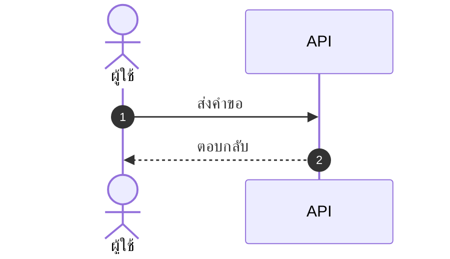

# skill: polished-document-style

Use when producing stakeholder-facing documents (BRD, FSD, ADR, status reports, audits, postmortems) that need polished formatting. Rich Markdown and Mermaid conventions that render well in GitHub, Notion, VS Code and Obsidian.

# Polished Document Style

## When to use this skill

- Output is meant for **non-developers** to read (PMs, executives, clients)
- Document needs **sign-off** or formal review
- Output will be **shared widely** or converted to PDF/Word later
- Any doc with 3+ sections or 500+ words

## When NOT to use

- Internal developer-only specs (keep them concise)
- Quick scratch notes
- Code comments / inline docs

> ℹ️ **Note:** This skill governs the *markdown source*. When the deliverable is a
> rendered **.docx / .pptx / .pdf** that a stakeholder will open, use
> `branded-document-design` on top of it — that skill carries the design tokens,
> the typography scale, Thai typography rules, and the `brandkit.py` builder.

---

## Document Header (Always)

Every polished doc MUST start with:

```markdown
# 📋 <Document Title>

> **Version:** 1.0 · **Date:** YYYY-MM-DD · **Status:** 🟡 Draft
> **Authors:** <names> · **Reviewers:** <names>
> **Tags:** `<area>` `<topic>`

---
```

Status values:
- 🟡 **Draft** — work in progress
- 🔵 **Review** — under stakeholder review
- 🟢 **Approved** — signed off
- ⚪ **Archived** — historical reference

---

## Section Hierarchy

- **H1** — Document title (exactly one)
- **H2** — Numbered sections (`## 1. Section`)
- **H3** — Sub-sections (`### 1.1 Sub-topic`)
- **H4** — Rare, use only if needed

**Always add Table of Contents** for docs with 5+ sections:

```markdown
## 📑 Table of Contents

1. [Executive Summary](#1-executive-summary)
2. [Scope](#2-scope)
3. [Details](#3-details)
```

---

## ธีมของเอกสาร — ตัดสินใจครั้งเดียว ใช้ทุกที่ในเอกสารนั้น

เอกสารหนึ่งฉบับผ่านมือหลาย skill — markdown ตัวนี้ · รูปจาก `software-diagrams` ·
ไฟล์ .docx จาก `branded-document-design` · สไลด์จาก `presentation-design`
ถ้าแต่ละตัวเลือกสีเอง ผู้อ่านจะได้เอกสารที่รูปสีหนึ่ง หัวข้อสีหนึ่ง และสไลด์อีกสีหนึ่ง

**markdown คือ source of truth ธีมจึงประกาศไว้ที่นี่** — ใส่ไว้ท้ายส่วนหัวของเอกสารหรือในไฟล์ข้างกัน:

```markdown
<!-- doc-theme: accent=<สีหลัก> · ที่มา=<แบรนด์ลูกค้า / เสนอจากเนื้องาน> · ยืนยันเมื่อ=YYYY-MM-DD -->
```

**สีหลักมาจากเนื้องาน ไม่ใช่จากค่าเริ่มต้นของเครื่องมือ**
มีสีแบรนด์อยู่แล้วใช้สีนั้น · ยังไม่มีให้เสนอโทนจากเนื้องานแล้วรอผู้ใช้ยืนยัน
(ตารางเนื้องาน → โทน อยู่ใน `svg-diagram-system` ข้อ 0)

| ส่วนของเอกสาร | ใครคุมสี | อ่านค่าจาก |
|---|---|---|
| หัวข้อ ตาราง กล่องข้อความใน markdown | markdown ไม่มีสี ใช้อิโมจิและน้ำหนักตัวอักษรแทน | — |
| ไดอะแกรม Mermaid | `software-diagrams` ข้อ 2 | `doc-theme` |
| รูปที่เป็นไฟล์ภาพ | `svg-diagram-system` · `diagram-figures` | `doc-theme` |
| ไฟล์ .docx / .pdf ที่ส่งออก | `branded-document-design` ข้อ 0–1 | `doc-theme` |
| สไลด์ | `presentation-design` | `doc-theme` |

**สีสถานะไม่นับรวม** — 🔴 วิกฤต 🟢 ผ่าน ต้องคงความหมายเดิมไม่ว่าธีมจะเป็นสีอะไร

### ค่าตั้งต้นประจำบ้าน (house default)

ถ้า `doc-theme` ยังไม่ประกาศ accent เฉพาะงาน ทุก skill ใช้ชุดนี้เป็นค่าตั้งต้น เพื่อให้รูป เอกสาร และสไลด์เป็นชุดสีเดียวกันตั้งแต่แรก ชุดนี้คือชุดเดียวกับ `presentation-design` และ `branded-document-design`:

| token | ค่า | ใช้กับ |
|---|---|---|
| brand | `#2A78D6` | สีหลัก · หัวข้อ · เส้น accent |
| brand-deep | `#2A4C86` | หัวตาราง · H2 · ชื่อระบบ |
| brand-2 | `#6A5CD6` | accent รอง (ม่วง) |
| tint | `#EDF1FB` | พื้นหัวตาราง · พื้นกล่องเน้น |
| ink / body | `#333B4A` / `#414957` | หัวข้อ / เนื้อความ |
| muted / faint | `#7D8492` / `#A9AEB9` | คำบรรยาย / หมายเหตุ |
| line | `#E4E7EE` | เส้นขอบ · เส้นเชื่อม |
| exception | `#C77A11` | ทาง/โซนที่ไม่ใช่เส้นทางหลัก (ต่างจาก brand เสมอ) |
| ฟอนต์ | Tahoma (เอกสาร/สไลด์) · Noto Sans Thai → Tahoma (ภาพ) | ทั้งไทยและอังกฤษ |

ประกาศ accent เฉพาะงานเมื่อไร ให้ค่านั้นทับ brand ส่วนที่เหลือคำนวณจาก accent เดียว

---

## Emoji Vocabulary

ใช้ให้**คงที่ทั้งเอกสาร** และใช้เพื่อ**หาของเจอเร็วขึ้น** ไม่ใช่เพื่อความน่ารัก

| ใช้ทำอะไร | ชุดที่ใช้ |
|---|---|
| ระดับความสำคัญ | 🔴 วิกฤต · 🟠 สูง · 🟡 กลาง · 🟢 ต่ำ |
| สถานะ | ✅ เสร็จ · 🚧 กำลังทำ · ⏳ รอ · ❌ ไม่ผ่าน · ⚠️ ต้องระวัง |
| ชนิดกล่องข้อความ | 💡 ข้อแนะนำ · 📌 ข้อควรจำ · 🚨 อันตราย · 📋 รายการตรวจ |
| หมวดเนื้อหา | 🎯 เป้าหมาย · 🏗️ สถาปัตยกรรม · 🔐 ความปลอดภัย · 📊 ตัวเลข · 🧪 การทดสอบ |

**หนึ่งอิโมจิต่อหัวข้อ ไม่ใช่ต่อบรรทัด** — เอกสารที่ทุกบรรทัดมีอิโมจิอ่านยากกว่าเอกสารที่ไม่มีเลย

---

## Callout Boxes

Use blockquotes with emoji prefix:

```markdown
> 💡 **Tip:** Brief actionable insight.

> ⚠️ **Warning:** Important caveat or limitation.

> 🚨 **Critical:** Must-read before proceeding.

> ℹ️ **Note:** Additional context or background.

> ❓ **Open Question:** Needs decision/clarification.
```

**Rules:**
- Keep callouts to 1-3 sentences
- One callout per topic — don't stack
- Don't overuse — max 3-5 per page

---

## Tables — When and How

### When to use tables instead of bullets

Use tables when items have **2+ attributes**:

❌ Don't use bullets:
```markdown
- email: string, required, unique
- age: number, optional
- role: enum, required, default "user"
```

✅ Use a table:
```markdown
| Field | Type   | Required | Default | Description       |
|-------|--------|:--------:|:-------:|-------------------|
| email | string | ✅       | —       | Unique login email|
| age   | number | ❌       | —       | Optional          |
| role  | enum   | ✅       | `user`  | Access level      |
```

### Table formatting tips

- Left-align text, center checkmarks/numbers, right-align money
- Use `—` (em dash) for "not applicable", not `-` or blank
- Keep cells short — long content goes in body paragraphs
- Bold key columns: `**email**`

---

## Mermaid Diagrams

**ตัวเลือกชนิดไดอะแกรม กติกาความอ่านง่าย ธีม และการจัดการป้ายภาษาไทย อยู่ใน `software-diagrams`**
skill นี้คุมเฉพาะเรื่องการวางไดอะแกรมลงในเอกสาร markdown

- วางไว้**หลังย่อหน้าที่อธิบายว่ารูปนี้ตอบคำถามอะไร** ไม่ใช่ลอยขึ้นมาเฉย ๆ
- ทุกรูปมีคำบรรยายใต้รูปหนึ่งบรรทัด ขึ้นต้นด้วย **รูปที่ N —**
- รูปเดียวกันอย่าใส่ซ้ำหลายที่ในเอกสาร ให้อ้างถึงเลขรูปแทน
- รูปที่ต้องส่งให้คนนอกทีมหรือใส่สไลด์ ใช้ `svg-diagram-system` แล้วฝังเป็นไฟล์ภาพ

````markdown

````

*รูปที่ 3 — ลำดับการเรียกเมื่อผู้ใช้กดบันทึก*

---

## Status Badges (Inline)

For key fields in headers/tables:

```markdown
**Status:** 🟢 Approved
**Priority:** 🔴 High
**Risk Level:** 🟡 Medium
**SLA:** ⚡ < 200ms
```

Multiple badges in a header:

```markdown
> 🟢 **Approved** · 🔴 **High Priority** · 👤 @alice · 🗓️ Due 2025-03-15
```

---

## Cover Block Pattern

For formal documents (BRD, FSD, ADR, postmortem):

```markdown
# 📋 <Title>

| | |
|--|--|
| **Document Type** | BRD \| FSD \| ADR \| Postmortem |
| **Version** | 1.2 |
| **Status** | 🟢 Approved |
| **Date** | 2025-01-15 |
| **Author(s)** | @alice, @bob |
| **Reviewer(s)** | @charlie |
| **Related** | [BRD-001](link), [FSD-005](link) |

---
```

---

## Comparison / Decision Tables

For trade-off analysis (architect, PM, SEO recommendations):

```markdown
| Option | Cost | Effort | Risk | Time-to-Value | Recommendation |
|--------|:----:|:------:|:----:|:-------------:|:--------------:|
| **A**  | 💰💰 | 🟡 Med | 🟢 Low | 🟢 Fast | ✅ Recommended |
| B      | 💰   | 🟢 Low | 🔴 High | 🟡 Med | ❌ Not recommended |
| C      | 💰💰💰| 🔴 High| 🟢 Low | 🔴 Slow | ⚪ Future consideration |
```

---

## Lists — When to nest, when to flatten

### ✅ Good list
```markdown
- Email is unique across all users
- Passwords must be 8+ characters with mixed case
- Sessions expire after 30 days of inactivity
```

### ❌ Bad list (over-nested)
```markdown
- Users
  - Email
    - Must be unique
    - Required
  - Password
    - 8+ chars
    - Mixed case
```

→ Should be a table instead.

**Rule:** Max 2 levels of nesting. More nesting = use a table.

---

## Code Blocks

Always specify language:

````markdown
```typescript
const user: User = { id: 1, email: 'a@b.com' };
```

```bash
npm install
```

```sql
SELECT * FROM users WHERE id = $1;
```
````

For long blocks, add file name as comment on first line:

```typescript
// src/services/auth.ts
export async function login(email: string, password: string) {
  // ...
}
```

---

## Approval/Sign-off Section (End of Doc)

For documents needing formal approval:

```markdown
## ✍️ Sign-off

| Role | Name | Status | Date |
|------|------|:------:|------|
| Product Owner | @alice | 🟢 Approved | 2025-01-15 |
| Tech Lead | @bob | 🔵 Reviewing | — |
| QA Lead | @charlie | ⚪ Not started | — |
| Security | @dave | ❌ Rejected | 2025-01-14 |
```

---

## Glossary Section

For docs with 5+ technical terms:

```markdown
## 📖 Glossary

| Term | Definition |
|------|------------|
| **API** | Application Programming Interface |
| **JWT** | JSON Web Token, used for stateless auth |
| **SLA** | Service Level Agreement |
```

Define acronyms on first use, then add to glossary.

---

## Quality Checklist

Before delivering any polished doc:

- [ ] H1 title with emoji marker
- [ ] Cover block with version, date, status, authors
- [ ] TOC if 5+ sections
- [ ] All sections numbered consistently
- [ ] Anchor links in TOC actually work
- [ ] Status badges where applicable
- [ ] Tables used (not bullets) where data has 2+ attributes
- [ ] At least one Mermaid diagram for any flow/relationship
- [ ] Callout boxes for tips/warnings (not just paragraphs)
- [ ] Code blocks have language hints
- [ ] Glossary for docs with 5+ acronyms
- [ ] No placeholder text (TBD, TODO, Lorem ipsum)
- [ ] Tested rendering in GitHub preview

---

> ไดอะแกรมในเอกสาร: ชนิดไหนตอบคำถามไหน และธีม Mermaid ชุดเดียวกันทั้งโปรเจกต์
> อยู่ใน `software-diagrams` · เอกสาร SRS โดยเฉพาะอยู่ใน `srs-writing`

## Anti-patterns


- ❌ **Emoji spam** — emoji in every heading just for decoration
- ❌ **All emoji, no labels** — `🔴 High` reads better than `🔴` alone
- ❌ **Deep nesting** — bullets 4+ levels deep, use tables instead
- ❌ **Walls of text** — paragraphs longer than 5 lines
- ❌ **Inconsistent terminology** — "user" in one section, "customer" in next
- ❌ **Diagrams that duplicate text** — diagram should add insight, not repeat
- ❌ **Tables of paragraphs** — if cells are >2 sentences, use headings instead
- ❌ **Skipping the cover block** — readers need version/status/date

---

## ตัวย่อ

เขียนตัวย่อเต็มครั้งแรกเสมอ แล้ววงเล็บตัวย่อไว้ — เช่น Model Context Protocol (MCP)
หลังจากนั้นใช้ตัวย่อได้ · รายละเอียดใน skill `spell-out-abbreviations`


---

# skill: architecture-patterns

Use when choosing system architecture (monolith, microservices, serverless), sync vs event-driven communication, or patterns like CQRS, Event Sourcing and Saga. Reference with concrete decision guidance.

# Architecture Patterns

## When to use this skill

- Greenfield architecture decisions
- Choosing communication patterns between services
- Refactoring monolith → modular or microservices
- Designing event-driven systems
- Implementing CQRS, Event Sourcing, Saga
- Reviewing existing architecture
- Making ADR-level decisions

---

## High-Level Architecture Choice

### Decision tree

```
How many engineers? Team count? Domain complexity?
│
├─ <10 engineers, 1 team
│  └─ ✅ Monolith (modular monolith)
│
├─ 10-50 engineers, 2-5 teams
│  └─ ✅ Modular monolith OR few services
│
├─ 50+ engineers, 5+ teams
│  └─ Consider microservices (only if needed)
│
└─ Any size + spiky/event-driven workload
   └─ Add serverless for that piece
```

---

## Pattern 1: Modular Monolith

**The 2026 default for most teams.**

```
┌─────────────────────────────────────┐
│   Single deployable application     │
│ ┌───────┐ ┌───────┐ ┌───────────┐  │
│ │Module │ │Module │ │  Module   │  │
│ │  A    │ │  B    │ │     C     │  │
│ └───────┘ └───────┘ └───────────┘  │
│   ▲           ▲           ▲         │
│   └── Strict module boundaries ──┘  │
└─────────────────────────────────────┘
         │
         ▼
    Single DB (or per-module schemas)
```

**When to use:**
- ✅ Small/medium team (< 30 engineers)
- ✅ Need fast iteration
- ✅ Simple ops requirements
- ✅ Can deploy together

**When NOT to use:**
- ❌ Multiple teams needing independent deploys
- ❌ Wildly different scaling needs per feature
- ❌ Different tech stacks needed

**Implementation tips:**
- Enforce module boundaries (e.g., NestJS modules, Java packages, Go internal/)
- Each module exposes a public interface
- Avoid cross-module DB access
- One DB but logical schema separation

---

## Pattern 2: Microservices

**When you've outgrown the monolith.**

```
┌──────┐  ┌──────┐  ┌──────┐
│ Svc A│  │ Svc B│  │ Svc C│
└──┬───┘  └──┬───┘  └──┬───┘
   │ ▲      │ ▲      │ ▲
   │ │      │ │      │ │     ← Each owns its DB
   ▼ │      ▼ │      ▼ │
  ┌──┴┐    ┌──┴┐    ┌──┴┐
  │DB │    │DB │    │DB │
  └───┘    └───┘    └───┘
```

**When to use:**
- ✅ Independent teams (Conway's Law)
- ✅ Different scaling needs per service
- ✅ Need polyglot tech stacks
- ✅ Mature CI/CD + observability

**When NOT to use (most projects):**
- ❌ Small team — overhead kills velocity
- ❌ No K8s/IaC expertise
- ❌ Can't afford distributed tracing
- ❌ Don't have strong domain boundaries yet

**Hidden costs:**
- 💸 Operational complexity (5x ops effort)
- 💸 Network latency between services
- 💸 Distributed transactions hard
- 💸 Debug-ability suffers
- 💸 Need service mesh, observability stack

> 🚨 **Microservices are an organizational scaling pattern**, not a tech pattern. Adopt only when team coordination is the bottleneck.

---

## Pattern 3: Serverless / Functions

**For spiky, event-driven workloads.**

```
Event ──► Function ──► Service / DB / Queue
```

**Sweet spots:**
- ✅ Async background processing
- ✅ Scheduled tasks (cron)
- ✅ Glue code between services
- ✅ Spiky / unpredictable traffic
- ✅ Image/video processing pipelines

**Bad fits:**
- ❌ Long-running processes (15 min limit usually)
- ❌ Stateful processing
- ❌ High-frequency low-latency (cold starts)
- ❌ Massive sustained traffic (cost spikes)

---

## Communication Patterns

### Synchronous (Request-Response)

```
Client ──HTTP/gRPC──► Server
       ◄──Response───
```

| Protocol | When |
|----------|------|
| REST | Public APIs, simple CRUD |
| GraphQL | Mobile clients, multiple read patterns |
| gRPC | Internal service-to-service |
| WebSocket | Real-time bidirectional |

**Pros:** Simple mental model, easy debugging
**Cons:** Coupling, cascading failures, hard to scale independently

### Asynchronous (Event-Driven)

```
Producer ──► Topic/Queue ──► Consumer(s)
         (publish)         (subscribe)
```

| Tech | When |
|------|------|
| Kafka | High throughput, event sourcing, replay needed |
| RabbitMQ | Traditional queuing, work distribution |
| SQS/SNS | AWS-native, simpler than Kafka |
| NATS | Lightweight, low-latency |
| Redis Pub/Sub | Simple, ephemeral |

**Pros:** Decoupling, resilience, scalability
**Cons:** Eventual consistency, harder debugging, ordering challenges

### When to choose which

```
Need immediate response? ─Yes─► Sync
                         └─No──► Async

Is producer impacted by consumer? ─Yes─► Sync
                                  └─No──► Async

Multiple consumers? ─Yes─► Async (pub/sub)
                   └─No──► Either
```

---

## Patterns 4–8: CQRS, Event Sourcing, Saga, API Gateway, Strangler Fig

Full detail for each is in [references/advanced-patterns.md](references/advanced-patterns.md). Load it when the decision involves one of these:

- Pattern 4: CQRS (Command Query Responsibility Segregation)
- Pattern 5: Event Sourcing
- Pattern 6: Saga (Distributed Transactions)
- Pattern 7: API Gateway
- Pattern 8: Strangler Fig (Migration)

---

## Cross-Cutting Decisions

### Database per service vs Shared DB

| | Shared DB | DB per service |
|---|-----------|----------------|
| Coupling | 🔴 High | 🟢 Low |
| Consistency | 🟢 ACID | 🟡 Eventual |
| Schema changes | 🔴 Coordinate | 🟢 Independent |
| Performance | 🟢 Easy joins | 🔴 Network calls |
| Use when | Monolith | Microservices |

### Caching tiers

```
Browser cache ──► CDN ──► Reverse Proxy ──► App Cache (Redis) ──► DB
       1                  2                       3                4
       ▲                                                           ▲
       Closest to user (fastest)              Furthest (last resort)
```

Each tier ~10x faster than the next.

### Idempotency

**Always design APIs to handle duplicate requests:**
```
Client retries → Server detects duplicate → Same result, no side effect
```

Methods:
- Idempotency key header (Stripe pattern)
- Deduplication window
- Natural idempotency (PUT vs POST)

---

## Decision Matrix Template

When proposing architecture, compare options:

```markdown
| Factor | Weight | Option A | Option B | Option C |
|--------|:------:|:--------:|:--------:|:--------:|
| Performance | 30% | 8 | 9 | 7 |
| Cost | 20% | 9 | 6 | 8 |
| Team skill | 20% | 9 | 5 | 7 |
| Operations | 15% | 8 | 5 | 7 |
| Future-proof | 15% | 6 | 9 | 7 |
| **Total** | 100% | **7.95** | 7.10 | 7.20 |
```

---

## Anti-patterns

- ❌ **Microservices premature** — monolith first
- ❌ **Distributed monolith** — services that must deploy together
- ❌ **God service** — one service that does everything
- ❌ **Chatty interfaces** — N+1 service calls
- ❌ **Shared database across microservices** — coupling without isolation
- ❌ **Synchronous calls in critical path** — cascading failures
- ❌ **No bulkheading** — one slow service kills everything
- ❌ **Resume-driven architecture** — using K8s/microservices to look fancy

---

## Quick Reference: When to Use What

| Need | Pattern |
|------|---------|
| Small team, fast iteration | Modular monolith |
| Independent team deploys | Microservices |
| Spiky background jobs | Serverless |
| High write throughput, complex reads | CQRS |
| Full audit trail, time-travel | Event Sourcing |
| Multi-service transaction | Saga |
| Reduce service-to-service complexity | Service mesh |
| Multiple external clients | API Gateway |
| Migrate legacy system | Strangler Fig |

---

## Always Reference

When you make a decision, document it with **adr-writer** skill. Architecture decisions are about trade-offs, and future-you (or your replacement) needs to understand why.


## reference: advanced-patterns.md

# Architecture Patterns — Advanced Pattern Catalogue

Detailed patterns moved from [SKILL.md](../SKILL.md). Load when the decision involves one of these patterns.

## Contents

- [Pattern 4: CQRS (Command Query Responsibility Segregation)](#pattern-4-cqrs-command-query-responsibility-segregation)
- [Pattern 5: Event Sourcing](#pattern-5-event-sourcing)
- [Pattern 6: Saga (Distributed Transactions)](#pattern-6-saga-distributed-transactions)
- [Pattern 7: API Gateway](#pattern-7-api-gateway)
- [Pattern 8: Strangler Fig (Migration)](#pattern-8-strangler-fig-migration)

---

## Pattern 4: CQRS (Command Query Responsibility Segregation)

**Split write model from read model.**

```
Commands ──► Write Model ──► Event Store
                              │
                              ▼
                          Projector
                              │
                              ▼
Queries ◄── Read Models (denormalized for query)
```

**When to use:**
- ✅ Vastly different read vs write loads
- ✅ Complex reporting / dashboards
- ✅ Multiple read views from same data

**When NOT to use:**
- ❌ Simple CRUD (massive overkill)
- ❌ Strong consistency required for reads

---

## Pattern 5: Event Sourcing

**Store events, not state.**

```
Instead of:           Store:
Account                Events:
  balance: $100        ├─ AccountOpened
                       ├─ Deposit($50)
                       ├─ Deposit($75)
                       └─ Withdraw($25)

State is computed from events
```

**When to use:**
- ✅ Strong audit/compliance requirements
- ✅ Need to replay history
- ✅ Temporal queries ("balance at date X")
- ✅ Complex business logic with many state transitions

**When NOT to use:**
- ❌ Simple state apps (overkill)
- ❌ No team experience with it
- ❌ Don't need history/audit
- ❌ Hard to delete data (GDPR considerations)

> ⚠️ **Both CQRS and Event Sourcing add MASSIVE complexity. Use sparingly.**

---

## Pattern 6: Saga (Distributed Transactions)

**When you need atomicity across services.**

### Orchestration (centralized)
```
Orchestrator
   │
   ├──► Service A (do step 1)
   │    [if fail → Orchestrator triggers compensations]
   ├──► Service B (do step 2)
   └──► Service C (do step 3)
```

### Choreography (decentralized)
```
Service A ──Event──► Service B ──Event──► Service C
   ▲                                            │
   └──────────── Compensation Event ────────────┘
```

| | Orchestration | Choreography |
|---|--------------|--------------|
| Visibility | 🟢 Central | 🔴 Distributed |
| Coupling | 🟡 Coupled to orchestrator | 🟢 Loosely coupled |
| Debugging | 🟢 Easier | 🔴 Hard |
| Adding services | 🟡 Update orchestrator | 🟢 Add subscriber |

**Choose orchestration** when: complex flow, need clear visibility
**Choose choreography** when: simple flow, many independent teams

---

## Pattern 7: API Gateway

```
Clients ──► API Gateway ──► Multiple Services
              │
              ├─ Routing
              ├─ Auth
              ├─ Rate limit
              ├─ Logging
              └─ Aggregation
```

**Tools:** Kong, AWS API Gateway, Envoy, Tyk, NGINX

**Use when:** External clients, multiple services, need cross-cutting concerns

---

## Pattern 8: Strangler Fig (Migration)

**Migrate monolith → modular gradually.**

```
Phase 1:    Phase 2:           Phase 3:
[Monolith]  [Mono] [NewSvc]    [NewSvc1] [NewSvc2]
                ▲    │              ▲
                └────┘ Proxy routes  └── Old Monolith deprecated
                  selective traffic
```

**Steps:**
1. Identify bounded context to extract
2. Build new service for that context
3. Add proxy/feature flag to route portion of traffic
4. Gradually shift traffic to new service
5. Delete old code when fully migrated

> 💡 **Beats big-bang rewrites every time.**
