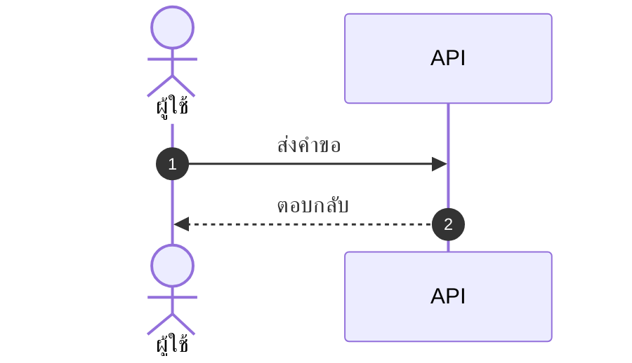

# skill: postmortem-template

Use when writing a post-incident review or blameless postmortem of a production outage. Timeline, impact, systemic causes, action items.

# Blameless Postmortem Template

> **ภาษา:** ถ้อยคำทุกบรรทัดเขียนตาม [`human-writing`](../human-writing/SKILL.md) — skill นี้บอกรูปแบบและโครง ส่วน human-writing บอกวิธีเขียนให้คนอ่านรู้เรื่อง

## When to use this skill

- After any incident affecting production (SEV1-SEV3)
- After a near-miss that could have been a major incident
- After significant bugs that reached production
- After a security incident

## Core Principles

1. **Blameless** — focus on systems and processes, not individuals
2. **Honest** — don't soften facts to protect feelings
3. **Actionable** — every postmortem produces concrete action items
4. **Educational** — others should learn from this

## Severity Levels

| Level | Definition | Response Time |
|-------|-----------|---------------|
| **SEV1** | Total outage, data loss, security breach | Immediate, 24/7 |
| **SEV2** | Major feature down, significant user impact | Within 1 hour |
| **SEV3** | Degraded service, partial impact | Within business hours |
| **SEV4** | Minor issue, no user impact | Next business day |

## Output Template

```markdown
# Postmortem: <Short Incident Title>

**Date of Incident:** YYYY-MM-DD
**Date of Postmortem:** YYYY-MM-DD
**Severity:** SEV1 | SEV2 | SEV3 | SEV4
**Duration:** XX hours XX minutes
**Authors:** <names>
**Status:** Draft | Final

---

## 1. Summary

<3-5 sentences for executives: what happened, impact, what we did, what we learned>

## 2. Impact

- **User-facing:** Yes | No
- **Users affected:** ~XX,XXX (X%)
- **Duration:** XX min
- **Revenue impact:** $XXX (if known)
- **Data loss:** None | Minor | Significant
- **SLA breached:** Yes | No
- **Regulatory implications:** None | <describe>

## 3. Timeline

All times in UTC.

| Time | Event |
|------|-------|
| HH:MM | First customer complaint |
| HH:MM | On-call paged by alert |
| HH:MM | Investigation started |
| HH:MM | Root cause identified |
| HH:MM | Mitigation deployed |
| HH:MM | Service restored |
| HH:MM | All clear confirmed |

## 4. What Happened (Detailed)

### Detection
How was the incident detected? Was it automated alerting or customer report?
- Time to detect (TTD): XX minutes
- Could we have detected faster? How?

### Investigation
What did we look at? What did we rule out?
- Tools used: ...
- Wrong turns / red herrings: ...

### Mitigation
What stopped the bleeding? (Not necessarily the fix)
- Time to mitigate (TTM): XX minutes

### Resolution
What was the permanent fix?
- Time to resolve (TTR): XX minutes

## 5. Root Cause Analysis

Use **5 Whys** technique:

- Why did the service go down? → Database queries timed out
- Why did queries time out? → Connection pool exhausted
- Why was the pool exhausted? → A new endpoint didn't release connections
- Why didn't it release connections? → Missing `finally` block
- Why wasn't this caught? → No load tests for that endpoint

**Root cause:** <one-sentence statement>

**Contributing factors:**
- ...
- ...

## 6. What Went Well

- Monitoring alerted within X minutes
- Rollback completed quickly thanks to ...
- Team collaboration on Slack was effective
- ...

## 7. What Went Wrong

- Took X minutes longer than needed because ...
- Runbook was outdated
- Required engineer was offline; no backup
- ...

## 8. Where We Got Lucky

- Issue happened during business hours; would have been worse at night
- Customer X didn't notice because they were also having maintenance
- ...

## 9. Action Items

| # | Action | Owner | Type | Priority | Due Date |
|---|--------|-------|------|----------|----------|
| 1 | Add monitoring for X | @alice | Prevent | P1 | YYYY-MM-DD |
| 2 | Update runbook | @bob | Mitigate | P2 | YYYY-MM-DD |
| 3 | Add load test for endpoint | @charlie | Prevent | P1 | YYYY-MM-DD |

**Action types:**
- **Prevent:** stops this from happening again
- **Detect:** catches it sooner if it happens
- **Mitigate:** reduces impact when it happens
- **Process:** improves how we respond

## 10. Lessons Learned

What can other teams learn from this?
- Lesson 1: ...
- Lesson 2: ...

## 11. Supporting Information

- Incident channel: #inc-XXX
- Status page updates: <link>
- Customer communications: <link>
- Graphs / dashboards: <link>
- Related PRs: <links>
```

## Blameless Language Guide

| ❌ Blameful | ✅ Blameless |
|------------|--------------|
| "Alice deployed the bug" | "A bug was deployed in PR #123" |
| "Bob should have caught this in review" | "The review process didn't catch this; we should add automated checks" |
| "QA missed this case" | "Our test coverage didn't include this scenario" |
| "Someone forgot to..." | "The process doesn't ensure that..." |
| "Human error" | "The system allowed the mistake to happen" |

## Quality Checklist

- [ ] Timeline includes specific times (not vague "morning of")
- [ ] Root cause goes deep enough (not just "bug in code")
- [ ] Action items have owners AND due dates
- [ ] Action items are tracked in actual ticket system
- [ ] Blameless language throughout
- [ ] Reviewed by someone NOT involved in incident
- [ ] Shared with broader team for learning

## Common Mistakes

- ❌ "Lessons learned: be more careful" — not actionable
- ❌ Single root cause when there are usually multiple factors
- ❌ Action items without owners → never done
- ❌ Skipping postmortem because "minor" — near-misses teach us most
- ❌ Hiding postmortems — share widely for org learning
- ❌ Blame language even when "talking about systems"

## When to Skip Postmortem

Almost never. Even for SEV4, a short writeup helps. Always do one for:
- Any SEV1 / SEV2
- Repeated SEV3+ from same root cause
- Security incidents
- Customer-facing incidents
- Data integrity issues

---

## Document Look

This skill decides **what goes in** the document. It does not decide **how it looks** —
load the matching skill before writing, not after:

| What is being handed over | Load |
|---|---|
| Markdown someone reads (repo, wiki, issue tracker) | `polished-document-style` |
| A rendered `.docx` / `.pptx` / PDF a stakeholder signs off on | `branded-document-design` |
| The point needs a picture to land | `markdown-visuals`, then `software-diagrams` |

Default formatting is not neutral — it reads as unfinished work.


---

# skill: polished-document-style

Use when a stakeholder Markdown document (BRD, FSD, ADR, status report, audit, postmortem) needs polished formatting for GitHub, Notion or Obsidian.

# Polished Document Style

> **ภาษา:** ถ้อยคำทุกบรรทัดเขียนตาม [`human-writing`](../human-writing/SKILL.md) — skill นี้บอกรูปแบบและโครง ส่วน human-writing บอกวิธีเขียนให้คนอ่านรู้เรื่อง

## When to use this skill

- Output is meant for **non-developers** to read (PMs, executives, clients)
- Document needs **sign-off** or formal review
- Output will be **shared widely** or converted to PDF/Word later
- Any doc with 3+ sections or 500+ words

## When NOT to use

- Internal developer-only specs (keep them concise)
- Quick scratch notes
- Code comments / inline docs

> ℹ️ **Note:** This skill governs the *markdown source*. When the deliverable is a
> rendered **.docx / .pptx / .pdf** that a stakeholder will open, use
> `branded-document-design` on top of it — that skill carries the design tokens,
> the typography scale, Thai typography rules, and the `brandkit.py` builder.

## อ่านเพิ่มเมื่อ

| ไฟล์ | เปิดเมื่อ |
|---|---|
| [references/markdown-patterns.md](references/markdown-patterns.md) | ถ้าจะเขียนส่วนหัว สารบัญ กล่องข้อความ ตาราง ป้ายสถานะ cover block ตารางเทียบตัวเลือก ส่วนเซ็นรับ หรืออภิธานศัพท์ ให้เปิดดูตัวอย่าง markdown แล้วลอกไปใช้ |
| [references/theme-colors.md](references/theme-colors.md) | ถ้าต้องใส่สีจริงลงรูป ไฟล์ .docx หรือสไลด์ ให้เปิดดูว่าใครคุมสีส่วนไหน และค่าสีตั้งต้นประจำบ้านคืออะไร |

## Document Header (Always)

Every polished doc MUST start with ส่วนหัวชุดเดียวกัน คือ H1 ที่มีอิโมจิกำกับ ตามด้วยกล่อง quote ที่บอกเวอร์ชัน วันที่ สถานะ ผู้เขียน ผู้รีวิว และแท็ก แล้วปิดด้วย `---` ตัวอย่างเต็มอยู่ใน [references/markdown-patterns.md](references/markdown-patterns.md)

Status values:
- 🟡 **Draft** — work in progress
- 🔵 **Review** — under stakeholder review
- 🟢 **Approved** — signed off
- ⚪ **Archived** — historical reference

## Section Hierarchy

- **H1** — Document title (exactly one)
- **H2** — Numbered sections (`## 1. Section`)
- **H3** — Sub-sections (`### 1.1 Sub-topic`)
- **H4** — Rare, use only if needed

**Always add Table of Contents** for docs with 5+ sections และต้องกดลิงก์ในสารบัญแล้วไปถึงหัวข้อจริง ตัวอย่างอยู่ใน [references/markdown-patterns.md](references/markdown-patterns.md)

## ธีมของเอกสาร — ตัดสินใจครั้งเดียว ใช้ทุกที่ในเอกสารนั้น

เอกสาร 1 ฉบับผ่านหลาย skill: markdown (skill นี้) · รูปจาก `software-diagrams` ·
ไฟล์ .docx จาก `branded-document-design` · สไลด์จาก `presentation-design`
ถ้าแต่ละตัวเลือกสีเอง ผู้อ่านจะได้เอกสารที่รูปสีหนึ่ง หัวข้อสีหนึ่ง และสไลด์อีกสีหนึ่ง

**markdown เป็นต้นฉบับหลัก (source of truth) จึงประกาศธีมไว้ที่นี่** — ใส่ไว้ท้ายส่วนหัวของเอกสารหรือในไฟล์ข้างกัน:

```markdown
<!-- doc-theme: accent=<สีหลัก> · ที่มา=<แบรนด์ลูกค้า / เสนอจากเนื้องาน> · ยืนยันเมื่อ=YYYY-MM-DD -->
```

**สีหลักมาจากเนื้องาน ไม่ใช่จากค่าเริ่มต้นของเครื่องมือ**
ถ้ามีสีแบรนด์อยู่แล้วให้ใช้สีนั้น ถ้ายังไม่มีให้เสนอโทนที่เข้ากับเนื้องาน แล้วรอผู้ใช้ยืนยัน
(ตารางจับคู่เนื้องานกับโทนสีอยู่ใน [`colour-by-domain`](../diagram-figures/references/colour-by-domain.md))

markdown เองไม่มีสี จึงใช้อิโมจิและน้ำหนักตัวอักษรแทน ส่วนไดอะแกรม รูป ไฟล์ .docx และสไลด์อ่านค่าจาก `doc-theme` ถ้า `doc-theme` ยังไม่ประกาศ accent เฉพาะงาน ให้ใช้ค่าตั้งต้นประจำบ้าน ตารางทั้งสองอยู่ใน [references/theme-colors.md](references/theme-colors.md)

**สีสถานะไม่ขึ้นกับธีม** — 🔴 วิกฤต · 🟢 ผ่าน ต้องคงความหมายเดิมไม่ว่าธีมจะเป็นสีอะไร

## Emoji Vocabulary

ใช้ให้**คงที่ทั้งเอกสาร** และใช้เพื่อ**หาของเจอเร็วขึ้น** ไม่ใช่เพื่อความน่ารัก

| ใช้ทำอะไร | ชุดที่ใช้ |
|---|---|
| ระดับความสำคัญ | 🔴 วิกฤต · 🟠 สูง · 🟡 กลาง · 🟢 ต่ำ |
| สถานะ | ✅ เสร็จ · 🚧 กำลังทำ · ⏳ รอ · ❌ ไม่ผ่าน · ⚠️ ต้องระวัง |
| ชนิดกล่องข้อความ | 💡 ข้อแนะนำ · 📌 ข้อควรจำ · 🚨 อันตราย · 📋 รายการตรวจ |
| หมวดเนื้อหา | 🎯 เป้าหมาย · 🏗️ สถาปัตยกรรม · 🔐 ความปลอดภัย · 📊 ตัวเลข · 🧪 การทดสอบ |

**1 อิโมจิต่อหัวข้อ ไม่ใช่ต่อบรรทัด** — เอกสารที่ทุกบรรทัดมีอิโมจิอ่านยากกว่าเอกสารที่ไม่มีเลย

## Callout Boxes

Use blockquotes with emoji prefix มี 5 ชนิด คือ 💡 **Tip** · ⚠️ **Warning** · 🚨 **Critical** · ℹ️ **Note** · ❓ **Open Question** ตัวอย่างอยู่ใน [references/markdown-patterns.md](references/markdown-patterns.md)

**Rules:**
- Keep callouts to 1-3 sentences
- One callout per topic — don't stack
- Don't overuse — max 3-5 per page

## Tables — When and How

Use tables when items have **2+ attributes** ถ้าเขียนเป็น bullet แล้วแต่ละบรรทัดมีหลายค่าคั่นด้วยจุลภาค ให้เปลี่ยนเป็นตาราง ตัวอย่างเทียบกันอยู่ใน [references/markdown-patterns.md](references/markdown-patterns.md)

- Left-align text, center checkmarks/numbers, right-align money
- Use `—` (em dash) for "not applicable", not `-` or blank
- Keep cells short — long content goes in body paragraphs
- Bold key columns: `**email**`

ถ้าเอกสารต้องเทียบตัวเลือกหรือชั่งข้อดีข้อเสีย (architect, PM, SEO recommendations) ให้ใช้ตารางเทียบที่มีคอลัมน์ Recommendation ส่วนเอกสารที่ต้องอนุมัติให้ปิดท้ายด้วยตาราง Sign-off และเอกสารที่มีศัพท์เทคนิค 5 คำขึ้นไปให้มีอภิธานศัพท์ ตัวอย่างทั้งสามแบบอยู่ใน [references/markdown-patterns.md](references/markdown-patterns.md)

## Mermaid Diagrams

**ตัวเลือกชนิดไดอะแกรม กติกาความอ่านง่าย ธีม และการจัดการป้ายภาษาไทย อยู่ใน `software-diagrams`**
skill นี้คุมเฉพาะเรื่องการวางไดอะแกรมลงในเอกสาร markdown

- วางไว้**หลังย่อหน้าที่อธิบายว่ารูปนี้ตอบคำถามอะไร** ไม่ใช่ลอยขึ้นมาเฉย ๆ
- ทุกรูปมีคำบรรยายใต้รูป 1 บรรทัด ขึ้นต้นด้วย **รูปที่ N —**
- รูปเดียวกันอย่าใส่ซ้ำหลายที่ในเอกสาร ให้อ้างถึงเลขรูปแทน
- รูปที่ต้องส่งให้คนนอกทีมหรือใส่สไลด์ ใช้ `diagram-figures` แล้วฝังเป็นไฟล์ภาพ

## Status Badges and Cover Block

ช่องสำคัญในส่วนหัวหรือในตารางให้ใช้ป้ายสถานะแบบอิโมจิพร้อมคำกำกับ เช่น `**Status:** 🟢 Approved` ส่วนเอกสารทางการ (BRD, FSD, ADR, postmortem) ให้เปิดด้วย cover block ที่บอกชนิดเอกสาร เวอร์ชัน สถานะ วันที่ ผู้เขียน ผู้รีวิว และเอกสารที่เกี่ยวข้อง ตัวอย่างอยู่ใน [references/markdown-patterns.md](references/markdown-patterns.md)

## Lists and Code Blocks

**Rule:** Max 2 levels of nesting. More nesting = use a table.
ตัวอย่างรายการที่ดีและรายการที่ซ้อนเกินอยู่ใน [references/markdown-patterns.md](references/markdown-patterns.md)

Code blocks ต้องระบุภาษาทุกครั้ง (Always specify language) และถ้าโค้ดยาว ให้ใส่ชื่อไฟล์เป็นคอมเมนต์ในบรรทัดแรก ตัวอย่างอยู่ใน [references/markdown-patterns.md](references/markdown-patterns.md)

## Quality Checklist

Before delivering any polished doc:

- [ ] H1 title with emoji marker
- [ ] Cover block with version, date, status, authors
- [ ] TOC if 5+ sections
- [ ] All sections numbered consistently
- [ ] Anchor links in TOC actually work
- [ ] Status badges where applicable
- [ ] Tables used (not bullets) where data has 2+ attributes
- [ ] At least one Mermaid diagram for any flow/relationship
- [ ] Callout boxes for tips/warnings (not just paragraphs)
- [ ] Code blocks have language hints
- [ ] Glossary for docs with 5+ acronyms
- [ ] No placeholder text (TBD, TODO, Lorem ipsum)
- [ ] Tested rendering in GitHub preview

> ไดอะแกรมในเอกสาร: ชนิดไหนตอบคำถามไหน และธีม Mermaid ชุดเดียวกันทั้งโปรเจกต์
> อยู่ใน `software-diagrams` ส่วนเรื่องเอกสาร SRS โดยเฉพาะอยู่ใน `srs-writing`

## Anti-patterns

- ❌ **Emoji spam** — emoji in every heading just for decoration
- ❌ **All emoji, no labels** — `🔴 High` reads better than `🔴` alone
- ❌ **Deep nesting** — bullets 4+ levels deep, use tables instead
- ❌ **Walls of text** — paragraphs longer than 5 lines
- ❌ **Inconsistent terminology** — "user" in one section, "customer" in next
- ❌ **Diagrams that duplicate text** — diagram should add insight, not repeat
- ❌ **Tables of paragraphs** — if cells are >2 sentences, use headings instead
- ❌ **Skipping the cover block** — readers need version/status/date

## ตัวย่อ

เขียนตัวย่อเต็มครั้งแรกเสมอ แล้ววงเล็บตัวย่อไว้ — เช่น Model Context Protocol (MCP)
หลังจากนั้นใช้ตัวย่อได้เลย ดูรายละเอียดใน skill `spell-out-abbreviations`


## reference: markdown-patterns.md

# รูปแบบ markdown พร้อมตัวอย่าง

ตัวอย่างโค้ด markdown ของทุกรูปแบบที่ `SKILL.md` อ้างถึง ให้ลอกไปใช้ได้ทันที ส่วนกฎว่าใช้เมื่อไหร่อยู่ใน `SKILL.md`

## Document Header (Always)

Every polished doc MUST start with:

```markdown
# 📋 <Document Title>

> **Version:** 1.0 · **Date:** YYYY-MM-DD · **Status:** 🟡 Draft
> **Authors:** <names> · **Reviewers:** <names>
> **Tags:** `<area>` `<topic>`

---
```

Status values:
- 🟡 **Draft** — work in progress
- 🔵 **Review** — under stakeholder review
- 🟢 **Approved** — signed off
- ⚪ **Archived** — historical reference

## Table of Contents

**Always add Table of Contents** for docs with 5+ sections:

```markdown
## 📑 Table of Contents

1. [Executive Summary](#1-executive-summary)
2. [Scope](#2-scope)
3. [Details](#3-details)
```

## Callout Boxes

Use blockquotes with emoji prefix:

```markdown
> 💡 **Tip:** Brief actionable insight.

> ⚠️ **Warning:** Important caveat or limitation.

> 🚨 **Critical:** Must-read before proceeding.

> ℹ️ **Note:** Additional context or background.

> ❓ **Open Question:** Needs decision/clarification.
```

## Tables — When and How

### When to use tables instead of bullets

Use tables when items have **2+ attributes**:

❌ Don't use bullets:
```markdown
- email: string, required, unique
- age: number, optional
- role: enum, required, default "user"
```

✅ Use a table:
```markdown
| Field | Type   | Required | Default | Description       |
|-------|--------|:--------:|:-------:|-------------------|
| email | string | ✅       | —       | Unique login email|
| age   | number | ❌       | —       | Optional          |
| role  | enum   | ✅       | `user`  | Access level      |
```

## Mermaid Diagrams

````markdown

````

*รูปที่ 3 — ลำดับการเรียกเมื่อผู้ใช้กดบันทึก*

## Status Badges (Inline)

For key fields in headers/tables:

```markdown
**Status:** 🟢 Approved
**Priority:** 🔴 High
**Risk Level:** 🟡 Medium
**SLA:** ⚡ < 200ms
```

Multiple badges in a header:

```markdown
> 🟢 **Approved** · 🔴 **High Priority** · 👤 @alice · 🗓️ Due 2025-03-15
```

## Cover Block Pattern

For formal documents (BRD, FSD, ADR, postmortem):

```markdown
# 📋 <Title>

| | |
|--|--|
| **Document Type** | BRD \| FSD \| ADR \| Postmortem |
| **Version** | 1.2 |
| **Status** | 🟢 Approved |
| **Date** | 2025-01-15 |
| **Author(s)** | @alice, @bob |
| **Reviewer(s)** | @charlie |
| **Related** | [BRD-001](link), [FSD-005](link) |

---
```

## Comparison / Decision Tables

For trade-off analysis (architect, PM, SEO recommendations):

```markdown
| Option | Cost | Effort | Risk | Time-to-Value | Recommendation |
|--------|:----:|:------:|:----:|:-------------:|:--------------:|
| **A**  | 💰💰 | 🟡 Med | 🟢 Low | 🟢 Fast | ✅ Recommended |
| B      | 💰   | 🟢 Low | 🔴 High | 🟡 Med | ❌ Not recommended |
| C      | 💰💰💰| 🔴 High| 🟢 Low | 🔴 Slow | ⚪ Future consideration |
```

## Lists — When to nest, when to flatten

### ✅ Good list
```markdown
- Email is unique across all users
- Passwords must be 8+ characters with mixed case
- Sessions expire after 30 days of inactivity
```

### ❌ Bad list (over-nested)
```markdown
- Users
  - Email
    - Must be unique
    - Required
  - Password
    - 8+ chars
    - Mixed case
```

→ Should be a table instead.

## Code Blocks

Always specify language:

````markdown
```typescript
const user: User = { id: 1, email: 'a@b.com' };
```

```bash
npm install
```

```sql
SELECT * FROM users WHERE id = $1;
```
````

For long blocks, put the file name in a comment on the first line:

```typescript
// src/services/auth.ts
export async function login(email: string, password: string) {
  // ...
}
```

## Approval/Sign-off Section (End of Doc)

For documents needing formal approval:

```markdown
## ✍️ Sign-off

| Role | Name | Status | Date |
|------|------|:------:|------|
| Product Owner | @alice | 🟢 Approved | 2025-01-15 |
| Tech Lead | @bob | 🔵 Reviewing | — |
| QA Lead | @charlie | ⚪ Not started | — |
| Security | @dave | ❌ Rejected | 2025-01-14 |
```

## Glossary Section

For docs with 5+ technical terms:

```markdown
## 📖 Glossary

| Term | Definition |
|------|------------|
| **API** | Application Programming Interface |
| **JWT** | JSON Web Token, used for stateless auth |
| **SLA** | Service Level Agreement |
```

Define acronyms on first use, then add to glossary.


## reference: theme-colors.md

# ตารางสีของธีมเอกสาร

ไฟล์นี้บอกว่าส่วนไหนของเอกสารใครเป็นคนคุมสี และค่าสีตั้งต้นประจำบ้านคืออะไร ใช้ตอนต้องใส่สีจริงลงรูป ไฟล์ .docx หรือสไลด์

## ใครคุมสีส่วนไหน

| ส่วนของเอกสาร | ใครคุมสี | อ่านค่าจาก |
|---|---|---|
| หัวข้อ ตาราง กล่องข้อความใน markdown | markdown ไม่มีสี ใช้อิโมจิและน้ำหนักตัวอักษรแทน | — |
| ไดอะแกรม Mermaid | `software-diagrams` ข้อ 2 | `doc-theme` |
| รูปที่เป็นไฟล์ภาพ | `diagram-figures` | `doc-theme` |
| ไฟล์ .docx / .pdf ที่ส่งออก | `branded-document-design` ข้อ 0–1 | `doc-theme` |
| สไลด์ | `presentation-design` | `doc-theme` |

## ค่าตั้งต้นประจำบ้าน (house default)

ถ้า `doc-theme` ยังไม่ประกาศ accent เฉพาะงาน ทุก skill ใช้ชุดนี้เป็นค่าตั้งต้น เพื่อให้รูป เอกสาร และสไลด์เป็นชุดสีเดียวกันตั้งแต่แรก ชุดนี้คือชุดเดียวกับ `presentation-design` และ `branded-document-design`:

| token | ค่า | ใช้กับ |
|---|---|---|
| brand | `#2A78D6` | สีหลัก · หัวข้อ · เส้น accent |
| brand-deep | `#2A4C86` | หัวตาราง · H2 · ชื่อระบบ |
| brand-2 | `#6A5CD6` | accent รอง (ม่วง) |
| tint | `#EDF1FB` | พื้นหัวตาราง · พื้นกล่องเน้น |
| ink / body | `#333B4A` / `#414957` | หัวข้อ / เนื้อความ |
| muted / faint | `#7D8492` / `#A9AEB9` | คำบรรยาย / หมายเหตุ |
| line | `#E4E7EE` | เส้นขอบ · เส้นเชื่อม |
| exception | `#C77A11` | ทาง/โซนที่ไม่ใช่เส้นทางหลัก (ต่างจาก brand เสมอ) |
| ฟอนต์ | Tahoma (เอกสาร/สไลด์) · Noto Sans Thai → Tahoma (ภาพ) | ทั้งไทยและอังกฤษ |

เมื่อประกาศ accent เฉพาะงานแล้ว ให้ใช้ค่านั้นแทน brand ส่วนสีอื่นคำนวณจาก accent ตัวนั้น


---

# skill: markdown-visuals

Use when a markdown doc needs a picture (wireframe, UI state, flow, architecture). Picks inline SVG, image, ASCII or Mermaid so it renders everywhere.

# Markdown Visuals

> **ภาษา:** ถ้อยคำทุกบรรทัดเขียนตาม [`human-writing`](../human-writing/SKILL.md) — skill นี้บอกรูปแบบและโครง ส่วน human-writing บอกวิธีเขียนให้คนอ่านรู้เรื่อง

> **Scope:** this skill decides *how a picture goes into a markdown file* (inline SVG · image file · ASCII · Mermaid) and how to embed it. What a diagram should show lives in `software-diagrams` (Mermaid in the house theme) and `diagram-figures` (designed figures). Document formatting around the picture lives in `polished-document-style`.

> **Rule:** Every design, mockup, spec, or architecture doc must show — not just tell. If you wrote "the button sits top-right," you owe the reader a picture.

## When to use this skill

- Producing **any** design mockup, wireframe, or UI spec
- Writing FSD, BRD, ADR, or architecture docs that describe layout, flow, or relationships
- Explaining state transitions, user journeys, or system interactions
- Comparing 2+ visual options for the user
- The user said "make a mockup," "show me how it looks," or "design X"

**If the doc has zero visuals and is about anything visual or structural — stop and add one.**

## Decision tree: which format?

```
What are you showing?
│
├─ UI mockup / component state / icon       →  Inline SVG
├─ Layout sketch / box diagram / state map  →  ASCII art (boxes & arrows)
├─ Flow / sequence / decision tree          →  Mermaid (software-diagrams)
├─ Architecture / ER / class                →  Mermaid (software-diagrams)
├─ Designed figure (proposal, slide, print) →  diagram-figures → embed the PNG as an image file (§2)
├─ Data viz (chart, pie, quadrant)          →  Mermaid pie/quadrant OR inline SVG
├─ Photo, screenshot, complex illustration  →  External file → 
└─ Quick concept in chat reply              →  Inline SVG or ASCII (no external file)
```

**Default to inline SVG**, except for flows and sequences (use Mermaid for those). Inline SVG renders everywhere and versions cleanly in git. It adds no binary files to the repo, and the user can read and edit the markup.

## 1 · Inline SVG (primary technique)

### Boilerplate

```markdown
<p align="center">
<svg xmlns="http://www.w3.org/2000/svg" viewBox="0 0 640 280" role="img" aria-label="<what this shows>">
  <!-- background -->
  <rect width="640" height="280" rx="14" fill="#1c2230"/>

  <!-- content goes here -->
</svg>
</p>
```

**Required attributes:**
- `xmlns="http://www.w3.org/2000/svg"` — without this, GitHub may not render
- `viewBox` — sets the coordinate space; lets the SVG scale responsively
- `role="img"` + `aria-label` — accessibility, screen readers
- `<p align="center">` wrapper — centers in the rendered page

**Sizing:** Use `viewBox` (not width/height) so it scales. Common sizes:
- Mockup of a UI bar: `viewBox="0 0 640 200"` (wide, short)
- Component state: `viewBox="0 0 400 300"` (squarer)
- Icon / chip: `viewBox="0 0 64 64"`
- Full screen layout: `viewBox="0 0 800 500"`

### สี

ถ้าเอกสารหรือโปรเจกต์มีชุดสีอยู่แล้ว ให้ใช้ชุดนั้น ส่วนถ้ายังไม่มี ให้เสนอโทนจาก [`diagram-figures/references/colour-by-domain.md`](../diagram-figures/references/colour-by-domain.md) แล้วรอผู้ใช้ยืนยัน ส่วน token ตามหน้าที่ (`bg-canvas` · `accent-primary` · `state-*` …) ดูได้ใน [references/svg-snippets.md](references/svg-snippets.md) และ **1 เอกสารใช้ชุดสีเดียว**

### Reusable snippets

Window chrome, phone frame, button, card, status badge, running dot and tooltip snippets, plus the UI-state worked example, are in [references/svg-snippets.md](references/svg-snippets.md). Copy the structure and swap in the agreed colour tokens.

## 2 · External image files

Use when:
- Photo or screenshot
- Illustration too complex to author as SVG by hand (50+ shapes)
- Reusing the same image across many docs
- Generated by a design tool (Figma export, etc.)

### Folder convention

```
docs/
  figures/
    01-hover-state.svg
    02-empty-state.png
    architecture-overview.svg
    src/                      editable sources (.mmd · .drawio · .html)
```

- Put figures in `docs/figures/` (editable sources in `docs/figures/src/`) — relative to the doc · brand files (logo, icons) live in the project-root `assets/`, not here
- Name files `<doc-section-number>-<short-slug>.<ext>` so they sort with the doc
- Prefer `.svg` over `.png` when possible (scales, smaller, diff-friendly)

### Reference syntax

```markdown

```

- **Alt text** describes what the image shows, for accessibility — not "screenshot.png"
- Path is **relative to the markdown file**, not absolute
- For centered + sized images, wrap in HTML:

```markdown
<p align="center">
  
</p>
```

### Creating SVG files

When the visual is too big to inline (>50 lines of SVG markup), save it as a file instead. Use the `Write` tool to create the SVG file alongside the doc.

## 3 · ASCII art

For quick layouts, state diagrams, and structural sketches that don't need pixel-perfect visuals. Renders identically in every viewer and in terminal/diff output.

Box-drawing characters plus worked layout sketch, state machine and curve examples are in [references/ascii-patterns.md](references/ascii-patterns.md).

Always wrap ASCII in a fenced code block (` ``` `) so spacing is preserved.

## 4 · Mermaid

**การเลือกชนิดไดอะแกรม ธีม กติกาความอ่านง่าย และป้ายภาษาไทย อยู่ใน `software-diagrams`**
ที่นี่บอกแค่ว่า *เมื่อไหร่ควรเลือก Mermaid แทนรูปแบบอื่น*

| เลือก Mermaid เมื่อ | เลือกอย่างอื่นเมื่อ |
|---|---|
| เป็นกล่องกับลูกศรที่เครื่องจัดวางให้ได้ | ถ้าต้องคุมตำแหน่งเองให้ใช้ inline SVG ส่วนรูปที่ต้องดูออกแบบมาให้ใช้ `diagram-figures` (HTML layout หรือ engine-svg-python) แล้วฝังเป็นไฟล์ภาพ |
| อยู่ในไฟล์ที่ต้อง diff ใน git | เป็นภาพหน้าจอจริง ให้ใช้ไฟล์ภาพ |
| ผู้อ่านเปิดใน GitHub หรือ Notion | ผู้อ่านเปิดในเอกสาร Word หรือสไลด์ ให้ใช้ไฟล์ภาพ |

## Combining formats in one doc

A full design spec usually mixes formats (SVG mockup, reference table, ASCII sketch, Mermaid state diagram, acceptance table). The 6-part pattern is in [references/combining-formats.md](references/combining-formats.md). Don't force everything into one format.

## Accessibility checklist

For every visual:

- [ ] **Inline SVG** has `role="img"` and `aria-label="<description>"`
- [ ] **Image file** has descriptive alt text (not "image.png")
- [ ] **Mermaid** diagrams have a 1-sentence caption above or below
- [ ] **ASCII art** has a prose summary nearby — screen readers will read the characters literally
- [ ] **Colour** is not the only signal — pair red badges with `!`, green dots with a label
- [ ] **Contrast** for text in SVG ≥ 4.5:1 against its background

## Anti-patterns

- ❌ **Text-only design docs** — "the icon is in the top-right" with no picture
- ❌ **Linking to Figma / external design tools as the only source** — visuals must render in the repo
- ❌ **PNG screenshots of text** — use the text, in a code block
- ❌ **SVG without `xmlns`** — GitHub silently fails to render
- ❌ **Inline SVG with 200+ lines** — extract to `assets/x.svg` and reference it
- ❌ **ASCII art outside a code fence** — proportional fonts will mangle alignment
- ❌ **Mixing Mermaid syntax versions** — stick to v10 syntax so GitHub renders it
- ❌ **Generated images checked in without source** — commit the `.svg` source, not just the `.png` export
- ❌ **Decorative emoji as visuals** — emoji ≠ a mockup; pair them with real diagrams

## Quick-start recipe

When the user asks for a design / mockup:

1. **Identify what kinds of visuals are needed** (UI state? flow? architecture?)
2. **Pick the format(s)** using the decision tree above
3. **For each visual:**
   - State a one-line caption
   - Emit the SVG/Mermaid/ASCII
   - Add `role="img"` + `aria-label` (SVG) or alt text (file)
4. **Add a feature reference table** below the visuals — what each element means
5. **Cross-check accessibility checklist** before delivery

Not sure a visual will render? Tell the user to preview it in GitHub or Notion.

## Related skills

- [[polished-document-style]] — overall doc formatting, Mermaid catalogue, callout boxes
- [[simplicity-first]] — don't over-design the diagram; show what's needed
- [[software-diagrams]] — which diagram type answers which question, plus the shared Mermaid theme
- [[diagram-figures]] — designed figures for proposals, slides and print (HTML layouts or engine-svg-python)
- [[ui-craft]] — spacing, hierarchy and states when the picture is a screen

## ตัวย่อ

เขียนตัวย่อเต็มครั้งแรกเสมอ แล้ววงเล็บตัวย่อไว้ — เช่น Model Context Protocol (MCP)
หลังจากนั้นใช้ตัวย่อได้เลย ดูรายละเอียดใน skill `spell-out-abbreviations`


## reference: ascii-patterns.md

# ASCII patterns

Worked ASCII examples for markdown docs · used by [SKILL.md](../SKILL.md) §3 · always wrap ASCII in a fenced code block so spacing is preserved

## Box-drawing characters

```
┌─────┐  ┏━━━━━┓  ╭─────╮  ┌╌╌╌╌╌┐
│     │  ┃     ┃  │     │  ╎     ╎
└─────┘  ┗━━━━━┛  ╰─────╯  └╌╌╌╌╌┘
 light    heavy   rounded   dashed
```

Corners: `┌ ┐ └ ┘` ‧ `┏ ┓ ┗ ┛` ‧ `╭ ╮ ╰ ╯`
Lines:   `─ │` ‧ `━ ┃` ‧ `═ ║`
Joins:   `├ ┤ ┬ ┴ ┼`
Arrows:  `→ ← ↑ ↓ ▲ ▼ ▶ ◀ ↔ ↕ ⇒ ⇐`
Dots:    `• · ◦ ● ○ ▪ ▫`

## Common patterns

**Layout sketch:**
```
┌─────────────────────────────────────┐
│ Header        [Search]      [👤]    │
├──────────┬──────────────────────────┤
│ Sidebar  │ Main content             │
│  • Item  │                          │
│  • Item  │  ┌────────────────────┐  │
│          │  │  Primary CTA       │  │
│          │  └────────────────────┘  │
└──────────┴──────────────────────────┘
```

**State machine:**
```
┌─────────┐  hover  ┌──────────┐  click  ┌─────────┐
│  REST   │────────►│ MAGNIFIED│────────►│ LAUNCH  │
└─────────┘◄────────└──────────┘◄────────└─────────┘
            exit               done
```

**Curve / chart:**
```
scale
 ↑
1.7│         ╱╲
1.4│       ╱    ╲
1.2│     ╱        ╲
1.0│___╱            ╲___
   └──────────┬──────────→ cursor X
         tile.Center
```


## reference: combining-formats.md

# Combining formats in one doc

Used by [SKILL.md](../SKILL.md) · a full design spec usually mixes formats.

Pattern from `DockXI/docs/12-design-mockup.md`:

```
1. Inline SVG mockup of each UI state              ← "what it looks like"
2. Feature reference table                          ← "what it does"
3. ASCII layout sketch with measurements           ← "how it's positioned"
4. Mermaid state diagram                            ← "how it transitions"
5. ASCII / inline-SVG zoom curve                    ← "the math"
6. Acceptance criteria table                        ← "how we verify"
```

Don't force everything into one format. Each format is best at something different.


## reference: svg-snippets.md

# Inline SVG snippets

Reusable building blocks for inline SVG mockups in markdown docs · used by [SKILL.md](../SKILL.md) §1

## สี — มาจากเนื้องาน ไม่ใช่จากตารางสำเร็จรูป

**อย่าเลือกสีเอง** ถ้าเอกสารหรือโปรเจกต์มีชุดสีอยู่แล้ว ให้ใช้ชุดนั้น
ถ้ายังไม่มี ให้เสนอโทนจากเนื้องานแล้วรอผู้ใช้ยืนยัน — การแพทย์เขียว · การเงินน้ำเงินเข้ม ·
อุตสาหกรรมเหลืองอำพัน · ราชการกรมท่า · ซอฟต์แวร์ทั่วไปน้ำเงิน (ตารางเต็มอยู่ใน [`diagram-figures/references/colour-by-domain.md`](../../diagram-figures/references/colour-by-domain.md))

กำหนดเป็น **token ตามหน้าที่** ไว้บนสุดของเอกสาร แล้วใช้ค่าเดียวกันทุกรูปในเอกสารนั้น:

| Token | หน้าที่ | ได้มาจาก |
|---|---|---|
| `bg-canvas` | พื้นหลังของรูป | เฉดเข้มสุด (โหมดมืด) หรืออ่อนสุด (โหมดสว่าง) |
| `bg-surface` | แผ่น พาเนล การ์ด | ต่างจาก canvas พอให้เห็นขอบโดยไม่ต้องตีเส้น |
| `bg-elevated` | ไทล์ที่ลอยขึ้นมาอีกชั้น | |
| `accent-primary` | จุดเน้น สถานะที่กำลังทำงาน | **สีหลักที่ผู้ใช้เลือก** |
| `text-primary` | ข้อความหลัก | contrast ≥ 4.5:1 กับพื้นที่มันวางอยู่ |
| `text-muted` | ข้อความรอง placeholder | `rgba(...,0.55)` ของ `text-primary` |
| `state-success` · `state-warning` · `state-danger` | สถานะ | **ไม่เปลี่ยนตามแบรนด์** — เขียวคือผ่าน แดงคือไม่ผ่านเสมอ |

**1 เอกสารใช้ชุดสีเดียว** — รูป 10 รูปในเอกสารเดียวที่สีไม่ตรงกัน อ่านยากกว่ารูปไม่สวยแต่สีตรงกัน

## Snippets

> ตัวอย่างข้างล่างใช้ชุดสีโหมดมืดชุดหนึ่งเป็นตัวแทนเท่านั้น
> **เปลี่ยนค่าสีให้ตรงกับชุดที่ตกลงไว้ก่อนใช้** โครงสร้างคือสิ่งที่ต้องคัดลอก ไม่ใช่ค่าสี

**Window chrome (desktop app mockup):**
```xml
<rect x="20" y="20" width="600" height="360" rx="10" fill="#2a3245"/>
<circle cx="42" cy="42" r="6" fill="#ff5f57"/>
<circle cx="62" cy="42" r="6" fill="#febc2e"/>
<circle cx="82" cy="42" r="6" fill="#28c940"/>
<text x="320" y="46" text-anchor="middle" fill="#fff" font-family="system-ui" font-size="12">Window title</text>
<line x1="20" y1="64" x2="620" y2="64" stroke="rgba(255,255,255,0.08)"/>
```

**Phone frame (mobile mockup):**
```xml
<rect x="100" y="20" width="200" height="400" rx="28" fill="#0a0d14" stroke="#2a3245" stroke-width="2"/>
<rect x="120" y="50" width="160" height="340" rx="6" fill="#1c2230"/>
<rect x="170" y="28" width="60" height="14" rx="7" fill="#0a0d14"/>
```

**Button:**
```xml
<rect x="40" y="100" width="120" height="40" rx="8" fill="#0078d4"/>
<text x="100" y="125" text-anchor="middle" fill="#fff" font-family="system-ui" font-size="14" font-weight="500">Click me</text>
```

**Card with title and body:**
```xml
<rect x="40" y="40" width="240" height="120" rx="12" fill="#2a3245"/>
<text x="60" y="72" fill="#fff" font-family="system-ui" font-size="14" font-weight="600">Card title</text>
<text x="60" y="96" fill="rgba(255,255,255,0.7)" font-family="system-ui" font-size="12">Supporting body text goes here.</text>
<rect x="60" y="116" width="80" height="28" rx="6" fill="#0078d4"/>
<text x="100" y="134" text-anchor="middle" fill="#fff" font-family="system-ui" font-size="12">Action</text>
```

**Status badge (top-right of tile):**
```xml
<circle cx="<tile-right-x>" cy="<tile-top-y>" r="9" fill="#e24b4a"/>
<text x="<tile-right-x>" y="<tile-top-y + 4>" text-anchor="middle" fill="#fff" font-family="system-ui" font-size="13" font-weight="500">!</text>
```

**Running dot (indicator below tile):**
```xml
<circle cx="<tile-center-x>" cy="<tile-bottom-y + 12>" r="4" fill="#4cc2ff"/>
```

**Tooltip text (no balloon — plain floating text):**
```xml
<text x="<tile-center-x>" y="<tile-top-y - 12>" text-anchor="middle" fill="#fff" font-family="system-ui" font-size="12" font-weight="500">Tooltip label</text>
```

## Worked example — UI state mockup

This is the pattern used in `DockXI/docs/12-design-mockup.md` and should be the default for showing UI feature states.
