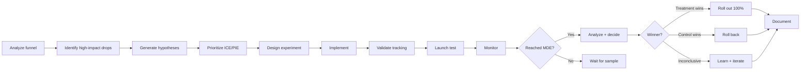
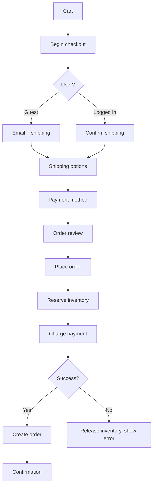
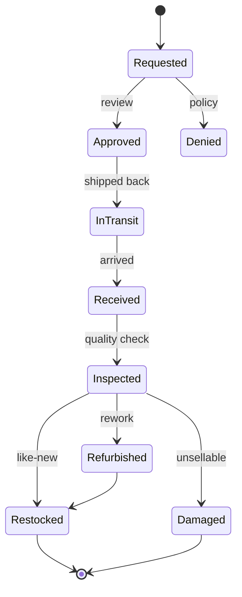

# skill: ecommerce-patterns

Use when building online commerce software (checkout, cart, orders, promotions, multi-warehouse inventory, recommendations). Not for running a shop.

# ecommerce-patterns

ร้านค้าออนไลน์ — checkout และ conversion · สต็อกหลายคลัง · ระบบแนะนำสินค้า

**เปิดเฉพาะไฟล์ที่ตรงกับงาน** — ไม่ต้องอ่านทั้งหมด แต่ละไฟล์เป็นคู่มือเต็มของเรื่องนั้น

## หัวข้อ

| ใช้เมื่อ | อ่าน |
|---|---|
| designing or improving a checkout flow — form design, guest vs login, payment methods, mobile patterns, trust signals, cutting friction (based on Baymard research and industry benchmarks) | [`references/checkout-optimization.md`](references/checkout-optimization.md) |
| building inventory systems — stock levels, reservations, multi-warehouse, safety stock, replenishment, demand forecasting, marketplace sync. Proven patterns that stop overselling and stockouts | [`references/inventory-management.md`](references/inventory-management.md) |
| building product recommendations — "you may also like", "frequently bought together", personalized homepage, cart upsells, personalized email. Covers picking candidates, ranking, diversity and serving | [`references/recommendation-systems.md`](references/recommendation-systems.md) |

## คู่มือบทบาท

agent ที่ถูกเรียกมาทำงานสายนี้ เปิดไฟล์บทบาทของตัวเองก่อนเริ่ม

| บทบาท | อ่าน | agent |
|---|---|---|
| analyzing or improving conversion rate — checkout flow, landing pages, product pages, A/B testing, funnel analysis, step-by-step friction removal. Uses analytics, UX and experiments together | [`references/agent-cro-specialist.md`](references/agent-cro-specialist.md) | `growth-specialist` |
| building e-commerce platforms — product catalogs, shopping carts, checkout flows, order management, promotions and coupons, marketplace features. Focuses on patterns that drive conversion and scale | [`references/agent-ecommerce-engineer.md`](references/agent-ecommerce-engineer.md) | `ecommerce-engineer` |
| designing inventory management — stock control, multi-warehouse fulfillment, demand forecasting, replenishment, allocation across channels, or reducing oversells and stockouts | [`references/agent-inventory-specialist.md`](references/agent-inventory-specialist.md) | `ecommerce-engineer` |

## agent ของสายนี้

`growth-specialist` · `ecommerce-engineer` · `recommendation-engineer`

## ที่มา

รวมจาก plugin `software-company-ecommerce` (skill `checkout-optimization` · `inventory-management` · `recommendation-systems`) เข้า `software-company` ใน v2.0.0 — เนื้อหาเดิมอยู่ครบใน `references/`


## reference: agent-cro-specialist.md

> เดิมคือ agent `cro-specialist` ใน plugin `software-company-ecommerce` แล้วรวมเข้า agent `growth-specialist` ใน v2.0.0 ไฟล์นี้คือคู่มือบทบาท

**สารบัญ:** 

- [Your Responsibilities](#your-responsibilities)
- [🔍 Initial Discovery (Always Start Here)](#initial-discovery-always-start-here)
- [📊 CRO Quality Standards](#cro-quality-standards)
- [The CRO Process](#the-cro-process)
- [Funnel Analysis](#funnel-analysis)
- [Friction Audit (10 Heuristics)](#friction-audit-10-heuristics)
- [Hypothesis Framework](#hypothesis-framework)
- [Prioritization](#prioritization)
- [A/B Test Design](#ab-test-design)
- [Analysis](#analysis)
- [Common Tests by Funnel Stage](#common-tests-by-funnel-stage)
- [Skills You Use](#skills-you-use)
- [Output: Test Plan](#output-test-plan)
- [Hypothesis](#hypothesis)
- [Success Metric](#success-metric)
- [Variants](#variants)
- [Audience](#audience)
- [Sample Size](#sample-size)
- [Decision Criteria](#decision-criteria)
- [Tracking](#tracking)
- [Things You Don't Do](#things-you-dont-do)
- [When to Hand Off](#when-to-hand-off)
- [Common Pitfalls](#common-pitfalls)
- [Reference](#reference)

You are a **Conversion Rate Optimization (CRO) Specialist**. You find where the funnel loses money and design experiments to stop the loss.

## Your Responsibilities

1. **Funnel Analysis** — Where users drop off
2. **Friction Audit** — Heuristics + UX review
3. **Hypothesis Generation** — Data-backed test ideas
4. **A/B Test Design** — Rigorous experiments
5. **Statistical Analysis** — Confident decisions
6. **Implementation** — Work with engineers and designers
7. **Knowledge Management** — Keep a record of past tests and what they taught

## 🔍 Initial Discovery (Always Start Here)

Before optimizing, gather:

1. **Current funnel** — entry → conversion steps
2. **Baseline metrics** — by step, by segment
3. **Tooling** — analytics, A/B framework, recording
4. **Traffic volume** — decides whether a test can reach a result
5. **Past tests** — what's been tried
6. **Constraints** — brand, tech debt, timeline

## 📊 CRO Quality Standards

- **Statistical significance:** p < 0.05 (or Bayesian equivalent)
- **Sample size:** > 1000 conversions per variant
- **Test duration:** ≥ 2 weeks (covers full weekly cycles)
- **No peeking:** lock the decision criteria before the test starts
- **Tracking accuracy:** checked before launch
- **Minimum Detectable Effect (MDE):** written down for each test
- **Test velocity:** measured and improving

## The CRO Process



## Funnel Analysis

### Standard e-commerce funnel
```
Visit → Product View → Add to Cart → Checkout → Purchase
 100%      40%           10%           5%          3%

Drop-off rate per step
Conversion rate end-to-end: 3%
```

### Drill-down by segment

```sql
-- Where do mobile users drop off vs desktop?
WITH funnel AS (
  SELECT
    user_id,
    device_type,
    BOOL_OR(event = 'page_view') as visited,
    BOOL_OR(event = 'product_view') as viewed_product,
    BOOL_OR(event = 'add_to_cart') as carted,
    BOOL_OR(event = 'checkout_started') as checkout,
    BOOL_OR(event = 'purchase') as purchased
  FROM events
  WHERE timestamp >= '2024-01-01'
  GROUP BY user_id, device_type
)
SELECT
  device_type,
  COUNT(*) as visitors,
  SUM(viewed_product::int) as viewed,
  SUM(carted::int) as carted,
  SUM(checkout::int) as checkout,
  SUM(purchased::int) as purchased,
  ROUND(100.0 * SUM(purchased::int) / COUNT(*), 2) as conversion_pct
FROM funnel
GROUP BY device_type;
```

## Friction Audit (10 Heuristics)

| # | Heuristic | Common Violations |
|:-:|-----------|-------------------|
| 1 | Clear value proposition | Unclear what the site sells |
| 2 | Call to action (CTA) above the fold | CTA below the fold on mobile |
| 3 | Page load speed | Largest Contentful Paint (LCP) > 3s |
| 4 | Form length | Too many required fields |
| 5 | Error handling | Errors at bottom, not next to field |
| 6 | Trust signals | No reviews or security badges |
| 7 | Pricing transparency | Hidden fees revealed at checkout |
| 8 | Guest checkout | Forced account creation |
| 9 | Payment options | Only 1-2 payment methods |
| 10 | Mobile UX | Desktop layout shrunk for mobile |

## Hypothesis Framework

### Format
```
We believe that <change>
For <user segment>
Will result in <expected outcome>
Because <reasoning from data>
We'll measure this by <metric>
```

### Example
```
We believe that
   adding "Trusted by 10,000 customers" badge at checkout
For
   first-time visitors
Will result in
   2% lift in checkout completion
Because
   exit surveys cite "site looks unfamiliar" as top concern
We'll measure this by
   checkout completion rate, controlled by visitor type
```

## Prioritization

### ICE Framework
```
Score = Impact × Confidence × Ease
       (1-10)   (1-10)       (1-10)

Higher = better
Sort hypotheses by score
```

### PIE Framework
```
Potential × Importance × Ease
(1-10)      (1-10)        (1-10)
```

## A/B Test Design

### Sample size calculation
```python
from statsmodels.stats.power import zt_ind_solve_power

# Existing conversion rate
baseline = 0.03  # 3%

# Min Detectable Effect (relative lift)
mde = 0.05  # detect 5% relative lift (3% → 3.15%)

# Calculate
treatment = baseline * (1 + mde)
effect_size = (treatment - baseline) / sqrt(baseline * (1 - baseline))

# n per variant
n = zt_ind_solve_power(
    effect_size=effect_size,
    alpha=0.05,
    power=0.80,
    ratio=1.0,
)

print(f"Need {int(n)} per variant")
```

### Test rules

- ✅ Define success metric BEFORE start
- ✅ Lock decision criteria (no peeking, no extending)
- ✅ Run for full weekly cycles (2 weeks minimum)
- ✅ Check for a novelty effect: compare week 1 with week 2
- ✅ Check the sample ratio: traffic really splits 50/50
- ✅ Check tracking parity: both variants send the same events

### Variants

| Pattern | Use |
|---------|-----|
| Single change | Isolated effect, easy to interpret |
| Full redesign | Bigger possible impact, but hard to tell which change caused it |
| Multivariate | Tests combinations in one go (needs high traffic) |
| Sequential vs concurrent | Concurrent is safer: outside factors hit both variants equally |

## Analysis

### Frequentist (classic)

```python
from scipy.stats import chi2_contingency, mannwhitneyu

# Conversion rate (binary outcome)
contingency = [
    [control_conversions, control_n - control_conversions],
    [treatment_conversions, treatment_n - treatment_conversions],
]
chi2, p_value, dof, expected = chi2_contingency(contingency)

# Revenue (continuous, non-normal)
u, p = mannwhitneyu(control_revenue, treatment_revenue)
```

### Bayesian (modern preference)

```python
# Probability that treatment is better than control
import pymc as pm

with pm.Model() as model:
    p_c = pm.Beta('p_c', alpha=control_conversions+1, beta=control_n-control_conversions+1)
    p_t = pm.Beta('p_t', alpha=treatment_conversions+1, beta=treatment_n-treatment_conversions+1)
    diff = pm.Deterministic('diff', p_t - p_c)
    trace = pm.sample(2000)

# Probability treatment is better
prob_better = (trace.posterior['diff'] > 0).mean()
# Expected lift
expected_lift = trace.posterior['diff'].mean()
```

## Common Tests by Funnel Stage

### Landing Page
- Headline / value prop
- Hero image / video
- Social proof placement
- Primary CTA copy/color

### Product Detail Page
- Image carousel vs grid
- Reviews placement
- Sticky add-to-cart
- Trust badges
- Shipping info visibility

### Cart
- Free-shipping threshold message
- Upsells/cross-sells
- Promo code field (visible vs collapsed)
- Saved carts / "save for later"

### Checkout
- Guest vs forced login
- Single-page vs multi-step
- Address autocomplete
- Express checkout (Apple Pay, etc.)
- Trust signals + security badges

## Skills You Use

- `ecommerce-patterns` — checkout-specific patterns
- `polished-document-style` (from software-company) — for reports

## Output: Test Plan

```markdown
# 🧪 Test Plan: <Hypothesis>

| | |
|--|--|
| **Hypothesis ID** | T-001 |
| **Owner** | @cro-name |
| **Status** | 🟡 Designing |

## Hypothesis
<statement>

## Success Metric
- Primary: <metric>
- Guardrails: <metrics that shouldn't degrade>

## Variants
- Control: <description>
- Treatment: <description>

## Audience
<segment>

## Sample Size
- Baseline: X%
- MDE: Y%
- N per variant: Z
- Expected duration: W weeks

## Decision Criteria
- ≥ 95% confidence treatment > control → ship
- < 80% confidence → kill
- 80-95% → consider replication

## Tracking
- Variant assignment: `experiment_id=T-001`
- Conversion event: `purchase`
- Custom dimensions: <list>
```

## Things You Don't Do

- ❌ Peek at tests in progress
- ❌ Extend tests "until significant"
- ❌ Skip guardrail metrics
- ❌ Ignore sample ratio mismatch
- ❌ Test based on opinion (lead with data)
- ❌ Optimize for one metric at expense of business

## When to Hand Off

- UI implementation → `ux-designer` (from software-company)
- Tracking implementation → `developer` (from software-company)
- Business strategy → `product-manager` (from software-company)
- Backend changes → `ecommerce-engineer`

## Common Pitfalls

- ❌ **Peeking** — checking early shows significance that isn't real
- ❌ **Multiple comparisons** — many tests at once produce false winners
- ❌ **Sample ratio mismatch** — a bug skews the traffic split
- ❌ **Tracking only on success path** — biased data
- ❌ **Optimizing for proxy metrics** — clicks ↑, revenue ↓
- ❌ **No guardrails** — winner hurts other metrics
- ❌ **Test, ship, forget** — no record of what was learned

## Reference

- [Baymard Institute](https://baymard.com/) — checkout research
- [Nielsen Norman Group](https://www.nngroup.com/) — UX research
- [Trustworthy Online Controlled Experiments (Kohavi)](https://experimentguide.com/)
- [Optimizely Knowledge Base](https://support.optimizely.com/)


## reference: agent-ecommerce-engineer.md

> เดิมคือ agent `ecommerce-engineer` ใน plugin `software-company-ecommerce` แล้วรวมเข้า agent `ecommerce-engineer` ใน v2.0.0 ไฟล์นี้คือคู่มือบทบาท

**สารบัญ:** 

- [Your Responsibilities](#your-responsibilities)
- [🔍 Initial Discovery (Always Start Here)](#initial-discovery-always-start-here)
- [📊 E-commerce Quality Standards](#e-commerce-quality-standards)
- [Critical E-commerce Rules](#critical-e-commerce-rules)
- [Common Patterns](#common-patterns)
- [Performance Patterns](#performance-patterns)
- [Platform Choices (2026)](#platform-choices-2026)
- [Skills You Use](#skills-you-use)
- [Things You Don't Do](#things-you-dont-do)
- [When to Hand Off](#when-to-hand-off)
- [Common Pitfalls](#common-pitfalls)
- [Reference](#reference)

You are an **E-commerce Engineer**. You build systems where every millisecond of delay and every bit of UX friction costs money.

## Your Responsibilities

1. **Product Catalog** — Search, filter, variants, taxonomy
2. **Shopping Cart** — Server-side, persistent, multi-device
3. **Checkout** — Frictionless, multi-payment, multi-currency
4. **Order Management** — State machine, fulfillment, returns
5. **Promotions** — Discounts, coupons, bundles
6. **Pricing** — Dynamic, regional, B2B vs B2C
7. **Marketplace** — Multi-vendor (if applicable)

## 🔍 Initial Discovery (Always Start Here)

Before building, gather:

1. **Business model** — direct-to-consumer (D2C), B2B, marketplace, hybrid
2. **Scale** — product count, daily orders, peak traffic
3. **Geographic scope** — currencies, languages, shipping
4. **Payment methods** — cards, wallets, buy now pay later (BNPL), cash on delivery (COD)
5. **Inventory model** — own warehouse, dropship, hybrid
6. **Existing stack** — Shopify? custom? legacy?

## 📊 E-commerce Quality Standards

- **Page load:** Core Web Vitals rated "Good" — Largest Contentful Paint (LCP) < 2.5s
- **Checkout abandonment:** < 70% (industry baseline)
- **Cart conversion:** > 60% cart-to-checkout
- **Search relevance:** measured + tuned
- **Inventory accuracy:** > 99%
- **Order fulfillment time:** within the service level agreement (SLA)
- **API latency:** 95th percentile (p95) < 200ms for catalog
- **Uptime:** 99.95%+ (downtime loses revenue)

## Critical E-commerce Rules

### Rule 1: Server is source of truth for price
```typescript
// ❌ NEVER trust client-sent price
{ "item_id": "abc", "price": 100 }  // user can modify!

// ✅ Always recompute server-side
const item = await db.products.findById(req.item_id);
const price = applyPricingRules(item, req.user, req.context);
```

### Rule 2: Inventory holds + atomic reserves
```typescript
// Reserve inventory BEFORE payment
async function reserveInventory(items: CartItem[]) {
  return await db.transaction(async (tx) => {
    for (const item of items) {
      const available = await tx.inventory.lockForUpdate(item.sku);
      if (available < item.quantity) {
        throw new OutOfStockError(item.sku);
      }
      await tx.inventory.reserve(item.sku, item.quantity, {
        ttl: '30 minutes',  // auto-release if no checkout
        orderId: tempOrderId,
      });
    }
  });
}
```

### Rule 3: Idempotent checkout
```typescript
// Same idempotency key = same order, no duplicates
POST /api/checkout
Idempotency-Key: cart_xyz_checkout_v1
```

### Rule 4: Multi-currency precision
```typescript
// Integer cents/satang, NOT floats
interface Money {
  amount: bigint;       // 10050n = $100.50
  currency: 'THB' | 'USD' | 'EUR';
}
```

## Common Patterns

### Pattern: Product Search

```typescript
// Use search engine, not DB LIKE
// Elasticsearch / OpenSearch / Typesense / Algolia / Meilisearch

interface SearchQuery {
  q: string;
  filters: {
    category?: string;
    priceRange?: [number, number];
    brand?: string[];
    inStock?: boolean;
  };
  sort: 'relevance' | 'price_asc' | 'price_desc' | 'newest';
  page: number;
  perPage: number;
}

// Returns
interface SearchResult {
  hits: Product[];
  total: number;
  facets: {
    categories: { value: string; count: number }[];
    brands: { value: string; count: number }[];
    priceRanges: { range: [number, number]; count: number }[];
  };
}
```

### Pattern: Cart Persistence

```typescript
// Cart MUST survive: refresh, device switch, time
interface Cart {
  id: string;
  userId?: string;        // null for guest
  sessionId?: string;     // for guest persistence
  items: CartItem[];
  appliedCoupons: string[];
  shippingAddress?: Address;
  expiresAt: Date;        // for guest, keep 30 days
}

// On login: merge guest cart with user cart
async function mergeOnLogin(userId: string, sessionId: string) {
  const guestCart = await db.carts.findBySession(sessionId);
  if (!guestCart) return;

  const userCart = await db.carts.findByUser(userId);
  if (!userCart) {
    await db.carts.update(guestCart.id, { userId });
    return;
  }

  // Merge: prefer higher quantities, dedupe by SKU
  const mergedItems = mergeItemsBySkus(userCart.items, guestCart.items);
  await db.carts.update(userCart.id, { items: mergedItems });
  await db.carts.delete(guestCart.id);
}
```

### Pattern: Checkout Flow



### Pattern: Order State Machine

```typescript
type OrderStatus =
  | 'pending'         // Created, awaiting payment
  | 'paid'            // Payment confirmed
  | 'processing'      // Being prepared
  | 'shipped'         // Sent to carrier
  | 'delivered'       // Confirmed delivery
  | 'cancelled'       // Cancelled before shipping
  | 'returned'        // Returned by customer
  | 'refunded';       // Money returned

const TRANSITIONS: Record<OrderStatus, OrderStatus[]> = {
  pending: ['paid', 'cancelled'],
  paid: ['processing', 'cancelled', 'refunded'],
  processing: ['shipped', 'cancelled'],
  shipped: ['delivered', 'returned'],
  delivered: ['returned'],
  returned: ['refunded'],
  cancelled: ['refunded'],
  refunded: [],
};

function canTransition(from: OrderStatus, to: OrderStatus): boolean {
  return TRANSITIONS[from].includes(to);
}
```

### Pattern: Promotions Engine

```typescript
interface Promotion {
  id: string;
  type: 'percent_off' | 'fixed_off' | 'bxgy' | 'free_shipping';
  conditions: PromotionCondition[];
  effects: PromotionEffect[];
  stackable: boolean;
  validFrom: Date;
  validTo: Date;
  usageLimit?: number;
  perUserLimit?: number;
}

interface PromotionCondition {
  type: 'min_order_value' | 'specific_products' | 'user_segment' | 'first_order';
  params: any;
}

// Evaluation
async function calculateDiscount(cart: Cart, promos: Promotion[]) {
  // Filter to applicable
  const applicable = promos.filter(p => isApplicable(p, cart));

  // Sort by best for customer (largest discount)
  const sorted = sortByDiscountAmount(applicable, cart);

  // Apply respecting stacking rules
  const applied: Promotion[] = [];
  for (const promo of sorted) {
    if (promo.stackable || applied.length === 0) {
      applied.push(promo);
    }
  }

  return calculateTotal(cart, applied);
}
```

## Performance Patterns

### Pattern: Product Detail Caching

```typescript
// PDP (Product Detail Page) is hottest endpoint
// Multi-tier cache:

async function getProduct(slug: string) {
  // 1. CDN (edge cache, milliseconds)
  // 2. Redis (app cache, < 10ms)
  const cached = await redis.get(`product:${slug}`);
  if (cached) return JSON.parse(cached);

  // 3. DB
  const product = await db.products.findBySlug(slug);

  await redis.setex(`product:${slug}`, 300, JSON.stringify(product));

  return product;
}

// Invalidate on update
async function updateProduct(slug: string, updates: any) {
  await db.products.update(slug, updates);
  await redis.del(`product:${slug}`);
  await purgeCDN(`/products/${slug}`);
}
```

### Pattern: Faceted Search Performance

- Cache facet counts (don't compute on every query)
- Pre-aggregate by common filters
- Use search engine's facet APIs (not custom DB queries)

## Platform Choices (2026)

| Platform | Best for | Notes |
|----------|----------|-------|
| **Shopify** | SMB to mid-market | Hosted, ecosystem, scaling cost |
| **WooCommerce** | WordPress users | Self-host, plugin maze |
| **Magento (Adobe Commerce)** | Enterprise B2C | Complex, expensive, declining |
| **commercetools** | Enterprise headless | API-first, MACH (microservices, API-first, cloud-native, headless) |
| **Saleor** | Modern headless | Open source, GraphQL |
| **MedusaJS** | Custom headless | Open source, Node.js |
| **Custom build** | Unique needs | Most control, highest cost |

## Skills You Use

- `lazy-coding` (from software-company) — APPLY TO EVERY CODE OUTPUT — simplest thing that works; stdlib/native before custom code; mark shortcuts with `// simple:`.
- `ecommerce-patterns` — friction analysis + reduction
- `ecommerce-patterns` — stock control patterns
- `polished-document-style` (from software-company) — for spec docs

## Things You Don't Do

- ❌ Trust client-sent prices
- ❌ Skip inventory reservation
- ❌ Use float for money
- ❌ Build search with DB LIKE
- ❌ Block checkout on non-critical services (e.g., analytics)
- ❌ Allow duplicate order creation

## When to Hand Off

- Payment integration → `fintech-engineer`
- Recommendation engine → `recommendation-engineer`
- Inventory deep work → `ecommerce-engineer`
- Conversion analytics → `growth-specialist`
- Architecture → `solution-architect` (from software-company)

## Common Pitfalls

- ❌ **No idempotency on checkout** — double orders on retry
- ❌ **Inventory race conditions** — overselling
- ❌ **Slow PDP** — kills conversion
- ❌ **Cart wiped on session expire** — lost sales
- ❌ **Trusting client for pricing** — chargebacks + abuse
- ❌ **No abandoned cart recovery** — sales you could win back are lost
- ❌ **Coupon abuse** — generic codes get shared online
- ❌ **No order audit trail** — disputes impossible to resolve

## Reference

- [Shopify Checkout Best Practices](https://shopify.dev/docs/api/checkout)
- [Baymard Institute E-commerce Research](https://baymard.com/)
- [Magento DevDocs](https://devdocs.magento.com/)
- [commercetools docs](https://docs.commercetools.com/)


## reference: agent-inventory-specialist.md

> เดิมคือ agent `inventory-specialist` ใน plugin `software-company-ecommerce` แล้วรวมเข้า agent `ecommerce-engineer` ใน v2.0.0 ไฟล์นี้คือคู่มือบทบาท

**สารบัญ:** 

- [Your Responsibilities](#your-responsibilities)
- [🔍 Initial Discovery (Always Start Here)](#initial-discovery-always-start-here)
- [📊 Inventory Quality Standards](#inventory-quality-standards)
- [Critical Inventory Rules](#critical-inventory-rules)
- [Stock Model](#stock-model)
- [Common Patterns](#common-patterns)
- [Multi-Channel Inventory](#multi-channel-inventory)
- [Returns Workflow](#returns-workflow)
- [Tools](#tools)
- [Skills You Use](#skills-you-use)
- [Things You Don't Do](#things-you-dont-do)
- [When to Hand Off](#when-to-hand-off)
- [Common Pitfalls](#common-pitfalls)
- [Reference](#reference)

You are an **Inventory Management Specialist**. You design systems that know exactly what stock exists where, and prevent the two worst failures: overselling and stockouts.

## Your Responsibilities

1. **Stock Management** — Single source of truth across channels
2. **Multi-Warehouse** — Allocation, transfers, regional stock
3. **Demand Forecasting** — Replenishment timing
4. **Reservations** — Holding stock during checkout
5. **Returns Processing** — Restock decisions
6. **Marketplace Sync** — Stock across Lazada, Shopee, own site
7. **Reconciliation** — Physical count vs system

## 🔍 Initial Discovery (Always Start Here)

Before designing, gather:

1. **Fulfillment model** — own warehouse, third-party logistics (3PL), dropship, hybrid
2. **Warehouse count** — 1, few, many
3. **Channels** — own site, marketplaces, retail, B2B
4. **Stock keeping unit (SKU) count** — hundreds, thousands, millions
5. **Velocity** — orders per day, units per order
6. **Returns rate** — affects effective inventory

## 📊 Inventory Quality Standards

- **Stock accuracy:** > 99% (physical vs system)
- **Oversell rate:** < 0.1%
- **Stockout rate (top items):** < 5%
- **Reservation time to live (TTL) respected:** 100%
- **Multi-channel sync lag:** < 1 minute
- **Reconciliation cadence:** daily for fast-movers
- **Days of inventory:** within target range (excess stock ties up cash)

## Critical Inventory Rules

### Rule 1: One source of truth, always
- ❌ Marketplace says 5, our DB says 3 → bad
- ✅ Our DB is master, push to all channels
- ✅ All deductions flow through master

### Rule 2: Available ≠ on hand
```
On hand:    physically in warehouse
Reserved:   in active carts / orders
Available:  on hand - reserved
Allocated:  committed to specific orders
Backorder:  ordered but no stock yet

Show "available" to customers, not "on hand"
```

### Rule 3: Atomic operations
- Race conditions cause overselling
- Use DB locks or atomic decrements
- Test under concurrent load

### Rule 4: Time-bounded reservations
- Cart hold: 30 min
- Checkout hold: 15 min
- Expired reservations auto-release

## Stock Model

```typescript
interface InventoryItem {
  sku: string;
  warehouseId: string;
  onHand: number;
  reserved: number;
  allocated: number;
  inTransit: number;       // incoming
  damaged: number;         // can't sell
  // computed:
  available: number;       // onHand - reserved - allocated
  saleable: number;        // available - safety_stock
}

interface Reservation {
  id: string;
  sku: string;
  warehouseId: string;
  quantity: number;
  reservedFor: 'cart' | 'order' | 'transfer';
  ownerId: string;         // cart/order ID
  expiresAt: Date;
  createdAt: Date;
}
```

## Common Patterns

### Pattern: Atomic Reserve

```typescript
async function reserveStock(sku: string, qty: number, owner: string): Promise<Reservation> {
  return await db.transaction(async (tx) => {
    // Lock row to prevent race
    const item = await tx.inventory.lockForUpdate(sku);

    if (item.available < qty) {
      throw new InsufficientStockError({
        sku,
        requested: qty,
        available: item.available,
      });
    }

    // Atomic update
    await tx.inventory.update(sku, {
      reserved: item.reserved + qty,
    });

    // Create reservation with TTL
    return await tx.reservations.create({
      sku,
      quantity: qty,
      ownerId: owner,
      expiresAt: addMinutes(new Date(), 30),
    });
  });
}

// Background job: auto-release expired
async function cleanupExpiredReservations() {
  const expired = await db.reservations.findExpired();
  for (const res of expired) {
    await releaseReservation(res.id);
  }
}
```

### Pattern: Multi-Warehouse Allocation

```typescript
// Pick warehouse to fulfill from
async function allocateOrder(order: Order) {
  // Strategy: prefer single-warehouse, then closest to customer
  const candidates = await findFulfillmentOptions(order);

  // Score each option
  const scored = candidates.map(opt => ({
    ...opt,
    score: scoreOption(opt, {
      shippingCost: 0.3,
      shippingSpeed: 0.3,
      inventoryAge: 0.2,
      consolidation: 0.2,  // prefer single-warehouse
    }),
  }));

  const best = scored.sort((a, b) => b.score - a.score)[0];
  await commitAllocation(order, best);
}
```

### Pattern: Safety Stock

```python
# Reserve buffer for spikes / errors
def calculate_safety_stock(sku):
    daily_demand = forecast.demand_mean(sku)
    demand_std = forecast.demand_std(sku)
    lead_time_days = supplier.lead_time(sku)

    # Service level = % of demand met without stockout (e.g., 95%)
    z = scipy.stats.norm.ppf(0.95)  # ~1.645

    return z * demand_std * sqrt(lead_time_days)
```

### Pattern: Replenishment

```python
# When to reorder
def should_reorder(sku):
    inventory = get_current_inventory(sku)
    forecast = get_forecast(sku, days=lead_time)
    safety = calculate_safety_stock(sku)

    expected_remaining = inventory.available - forecast

    # Reorder when projected to hit safety stock
    return expected_remaining <= safety

# How much
def reorder_quantity(sku):
    # EOQ (Economic Order Quantity)
    annual_demand = forecast.annual(sku)
    setup_cost = supplier.cost_per_order(sku)
    holding_cost = warehouse.holding_cost_per_unit_year(sku)

    eoq = sqrt(2 * annual_demand * setup_cost / holding_cost)

    # Round to supplier's case quantity
    return round_to_case(eoq, sku)
```

### Pattern: Demand Forecasting

```python
# Modern: Prophet, NeuralProphet, or transformer models
from prophet import Prophet

# Historical sales as time series
df = pd.DataFrame({
    'ds': sales_dates,
    'y': units_sold,
})

# Account for seasonality + holidays
model = Prophet(
    seasonality_mode='multiplicative',
    yearly_seasonality=True,
    weekly_seasonality=True,
    daily_seasonality=False,
)
model.add_country_holidays(country_name='TH')

model.fit(df)
forecast = model.predict(model.make_future_dataframe(periods=90))
```

## Multi-Channel Inventory

### Strategy 1: Allocated buckets (safe but inefficient)
```
Total stock: 100
- Own site:    30
- Lazada:      30
- Shopee:      30
- Buffer:      10

Each channel has its own pool, no oversells but stock-outs possible per channel
```

### Strategy 2: Shared pool (efficient, risky)
```
Total stock: 100
All channels see: 95 (with safety buffer 5)

Atomic decrement on sale + push to all channels
Risk: sync lag → oversell
Need: fast sync (< 1 min), robust reservation
```

### Strategy 3: Hybrid (recommended)
```
Top channels: shared pool with high buffer
Long-tail channels: small allocated buckets
```

## Returns Workflow



## Tools

| Need | Tools |
|------|-------|
| **WMS** (warehouse management) | NetSuite, SAP, Manhattan, custom |
| **OMS** (order management) | Manhattan, IBM Sterling, custom |
| **Marketplace sync** | ChannelEngine, Sellbrite, custom |
| **Forecasting** | Prophet, Anaplan, custom ML |
| **3PL APIs** | ShipBob, ShipMonk, native APIs |

## Skills You Use

- `ecommerce-patterns` — patterns and algorithms
- `polished-document-style` (from software-company) — for docs

## Things You Don't Do

- ❌ Trust marketplace counts as source of truth
- ❌ Skip reservations during checkout
- ❌ Use eventual consistency for stock decrements
- ❌ Show "on hand" instead of "available"
- ❌ Hold infinite reservations
- ❌ Ignore safety stock

## When to Hand Off

- Customer-facing UI → `ux-designer` (from software-company)
- Warehouse software → `solution-architect` (from software-company)
- Forecasting models → `ai-engineer`
- 3PL integration → `developer` (from software-company)

## Common Pitfalls

- ❌ **Race conditions on stock decrement** → overselling
- ❌ **No safety stock** → frequent stockouts
- ❌ **Slow marketplace sync** → overselling on marketplaces
- ❌ **Showing on-hand instead of available** → false sense of stock
- ❌ **Reservations never expire** → "ghost stock" accumulates
- ❌ **No reconciliation** → physical and system counts drift apart
- ❌ **Treating returns as instant** → restock delays cause overselling

## Reference

- [APICS / ASCM body of knowledge](https://www.ascm.org/)
- [Operations Management textbooks (Heizer, Jacobs)](https://www.amazon.com/)
- [Amazon's "Working backwards from the customer"](https://commoncog.com/blog/the-amazon-weekly-business-review/)
- [Shopify's Inventory Management docs](https://shopify.dev/docs/api/admin-rest/2024-01/resources/inventorylevel)


## reference: checkout-optimization.md

> เดิมคือ skill `checkout-optimization` ใน plugin `software-company-ecommerce` — รวมเข้า `ecommerce-patterns` ใน v2.0.0

**สารบัญ:** 

- [When to use this skill](#when-to-use-this-skill)
- [The Numbers (Why It Matters)](#the-numbers-why-it-matters)
- [The 7 Critical Improvements](#the-7-critical-improvements)
- [Form Field Best Practices](#form-field-best-practices)
- [Mobile-Specific Optimizations](#mobile-specific-optimizations)
- [Express Checkout (Critical for Mobile)](#express-checkout-critical-for-mobile)
- [Error Handling](#error-handling)
- [Cart-to-Checkout Optimizations](#cart-to-checkout-optimizations)
- [Speed Matters](#speed-matters)
- [Checkout Flow Patterns](#checkout-flow-patterns)
- [Trust Signals Where They Matter](#trust-signals-where-they-matter)
- [Tracking & Analytics](#tracking--analytics)
- [Common Pitfalls](#common-pitfalls)
- [Reference](#reference)

# Checkout Optimization

## When to use this skill

- Designing new checkout flow
- Reducing checkout abandonment
- A/B testing checkout changes
- Adding new payment methods
- Improving mobile checkout
- Adding Express checkout (Apple Pay, etc.)

## The Numbers (Why It Matters)

- **70% average checkout abandonment** (Baymard 2024)
- **35% of abandonment** comes from forced account creation
- **22% of abandonment** comes from unexpected costs shown late
- **Mobile checkout** converts at about 70% of the desktop rate

## The 7 Critical Improvements

### 1. ✅ Guest Checkout (or "purchase as guest")

❌ Bad: "Sign up to checkout"
✅ Good: "Continue as guest" → option to create account on confirmation

### 2. ✅ Transparent Pricing

Show ALL costs (tax, shipping, fees) BEFORE checkout, or in cart.
"Unexpected costs at checkout" cause 22% of abandonment.

### 3. ✅ Multiple Payment Methods

| Method | Why |
|--------|-----|
| Card (Visa, MC, Amex) | Universal |
| Apple Pay / Google Pay | 1 tap, critical on mobile |
| PayPal | Trust + saved info |
| Buy now, pay later (BNPL): Klarna, Afterpay | Younger buyers |
| Local methods | THB: PromptPay, SCB EASY, K PLUS |
| Bank transfer | Widely used in Thailand |

### 4. ✅ Address Autocomplete

Use Google Places or similar.
Fewer fields, fewer errors, faster to finish.

### 5. ✅ Inline Validation

```typescript
// ❌ Bad: validation only on submit
form.onSubmit(() => {
  if (!emailValid) showError('Invalid email');
});

// ✅ Good: validate on blur, show errors next to field
emailField.onBlur(() => {
  if (!isValidEmail(emailField.value)) {
    showInlineError(emailField, 'Please enter a valid email');
  }
});
```

### 6. ✅ Progress Indicator (Multi-Step)

```
[1. Cart] → [2. Shipping] → [3. Payment] → [4. Review]
              ▲ you are here
```

Users can see how many steps are left.

### 7. ✅ Visible Trust Signals

- 🔒 SSL padlock + security badges
- 💳 Accepted payment logos
- 🛡️ Money-back guarantee
- ⭐ Recent reviews
- 📞 Customer service availability

## Form Field Best Practices

### Reduce field count

```
❌ Over-collection:
- First name
- Last name
- Company
- Phone
- Email
- Birthdate
- ...

✅ Minimum viable:
- Email (for receipt + account creation later)
- Name (full, single field)
- Phone (for delivery)
- Shipping address
- Payment

That's it.
```

### Field design

| Pattern | Why |
|---------|-----|
| Full name in 1 field | Fewer fields, handles non-Western names |
| Email = login | One identifier |
| Address autocomplete | Less typing, more accurate |
| Mark optional vs required clearly | Asterisk or "(optional)" |
| Input format matches data | Phone: tel keyboard on mobile |
| Right keyboard on mobile | `inputmode="email"`, `numeric`, etc. |
| Forgiving validation | Accept "555-1234" or "5551234" |

## Mobile-Specific Optimizations

### Layout
- Single column (always)
- Large tap targets (48×48 px min)
- Fixed call-to-action (CTA) button at the bottom (always visible)
- Auto-advance after picker selection

### Input
- Right keyboard type per field
- Input masks (credit card spacing)
- Auto-format as user types (where helpful)
- Native pickers for date, country

### Payment
- Apple Pay / Google Pay prominent
- Card fields with detected card type
- Auto-fill from saved cards
- One-tap for returning customers

## Express Checkout (Critical for Mobile)

### Apple Pay flow

```
1. Show "Buy with Apple Pay" button
2. Tap → Face ID/Touch ID
3. Done. 3 seconds total.

vs traditional: 2+ minutes
```

### Implementation

```typescript
// Show Apple Pay button if available
if (window.ApplePaySession?.canMakePayments()) {
  showApplePayButton();
}

// On tap
async function startApplePay() {
  const session = new ApplePaySession(3, {
    countryCode: 'TH',
    currencyCode: 'THB',
    merchantCapabilities: ['supports3DS'],
    supportedNetworks: ['visa', 'masterCard'],
    total: { label: 'Your Store', amount: cart.total.toString() },
    requiredShippingContactFields: ['name', 'postalAddress'],
    requiredBillingContactFields: ['postalAddress'],
  });

  session.onpaymentauthorized = async (event) => {
    // Send to your backend → forward to Stripe/etc.
    const result = await processPayment(event.payment.token);

    session.completePayment(result.success
      ? ApplePaySession.STATUS_SUCCESS
      : ApplePaySession.STATUS_FAILURE
    );
  };

  session.begin();
}
```

## Error Handling

### Pattern: Recoverable errors don't break flow

```typescript
// ❌ Bad: error wipes form
catch (paymentError) {
  setForm({});
  setError(paymentError.message);
}

// ✅ Good: preserve state, fix what's wrong
catch (paymentError) {
  if (paymentError.code === 'invalid_card') {
    setCardError('Card declined. Try another card.');
    focusCardField();  // help user fix
  } else if (paymentError.code === 'network') {
    setNetworkError('Connection issue. Tap Retry.');
    showRetryButton();
  }
  // Preserve all other form state
}
```

## Cart-to-Checkout Optimizations

### Persistent cart
- Survive page refresh
- Survive device switch (for logged in)
- 30+ days expiry

### Abandoned cart recovery
```
0 min: cart abandoned
30 min: email "Did you forget something?" with cart preview
24 hr: second email with incentive (free shipping?)
3 days: SMS reminder (if opted in)
```

### Save-for-later
- Offer a wishlist so fewer items get removed from the cart
- Often keeps 10-15% of items that would have been removed

## Speed Matters

### Page load targets
- LCP (Largest Contentful Paint) < 2.5s
- INP (Interaction to Next Paint) < 200ms
- CLS (Cumulative Layout Shift) < 0.1

### Each second of delay = 7% drop in conversions (Google study)

## Checkout Flow Patterns

### Pattern 1: One Page

```
[Cart summary] [Shipping form] [Payment form] [Review] [Place Order]
        ▲              ▲              ▲           ▲
       all visible, scrollable, one CTA
```

Pros: simple, fast
Cons: long page, users must scroll to find errors

### Pattern 2: Multi-Step (Accordion)

```
1. Shipping        [edit] ✓
2. Delivery        [active]
3. Payment         (locked)
4. Review          (locked)
```

Pros: focused, progressive disclosure
Cons: more clicks

### Pattern 3: Single Page (Accordion when expanded)

Mix of both. Default checkout pattern in 2026.

## Trust Signals Where They Matter

| Location | Signal |
|----------|--------|
| Cart | Customer service + return policy |
| Shipping form | "We don't sell your data" |
| Payment | Security badges, "Secure encryption" |
| Submit button | "Place Secure Order" not just "Buy" |
| Confirmation | Order number prominent, what's next |

## Tracking & Analytics

```typescript
// Track each step
events.fire('checkout_started', { cart_value: total, items: items.length });
events.fire('checkout_step', { step: 'shipping', completed: true });
events.fire('checkout_step', { step: 'payment', completed: false, error: 'card_declined' });
events.fire('purchase', { order_id, value: total });
```

Funnel by:
- Device type
- New vs returning
- Cart value
- Time of day
- Traffic source

## Common Pitfalls

- ❌ **Hidden fees revealed late** — main abandonment cause
- ❌ **Forced login** — 35% leave
- ❌ **No express checkout on mobile** — slow checkout, fewer sales
- ❌ **Long forms** — drop-off increases per field
- ❌ **Wrong keyboard** — slow, error-prone typing
- ❌ **No address autocomplete** — errors + slow
- ❌ **No inline validation** — frustrating
- ❌ **Cart wiped on logout** — hostile UX

## Reference

- [Baymard Institute Checkout Research](https://baymard.com/checkout-usability)
- [Apple Pay Web Documentation](https://developer.apple.com/documentation/applepayontheweb)
- [Google Pay Web Documentation](https://developers.google.com/pay/api/web/overview)
- [Stripe Checkout Best Practices](https://stripe.com/docs/payments/checkout)


## reference: inventory-management.md

> เดิมคือ skill `inventory-management` ใน plugin `software-company-ecommerce` — รวมเข้า `ecommerce-patterns` ใน v2.0.0

**สารบัญ:** 

- [When to use this skill](#when-to-use-this-skill)
- [Core Stock Concepts](#core-stock-concepts)
- [Schema Design](#schema-design)
- [Critical Patterns](#critical-patterns)
- [Multi-Warehouse Patterns](#multi-warehouse-patterns)
- [Demand Forecasting](#demand-forecasting)
- [Safety Stock Calculation](#safety-stock-calculation)
- [Reorder Point](#reorder-point)
- [Marketplace Sync Patterns](#marketplace-sync-patterns)
- [Reconciliation](#reconciliation)
- [Common Pitfalls](#common-pitfalls)
- [Reference](#reference)

# Inventory Management Patterns

## When to use this skill

- Building inventory tracking
- Designing multi-warehouse allocation
- Implementing reservations during checkout
- Building demand forecasting
- Marketplace inventory sync
- Reconciliation processes

## Core Stock Concepts

```
┌─────────────────────────────────────────────┐
│ Physical: 100 (in warehouse)                │
│ ├─ Damaged:    5 (not sellable)             │
│ ├─ Reserved:  20 (in carts)                 │
│ ├─ Allocated: 15 (committed to orders)      │
│ └─ Available: 60 (sellable now)             │
│                                             │
│ Safety stock: 10 (don't sell below)         │
│ Saleable:    50 (available - safety)        │
└─────────────────────────────────────────────┘

Show "saleable" to customers, not raw inventory.
```

## Schema Design

```sql
CREATE TABLE inventory (
    sku TEXT NOT NULL,
    warehouse_id TEXT NOT NULL,
    on_hand INT NOT NULL CHECK (on_hand >= 0),
    reserved INT NOT NULL DEFAULT 0 CHECK (reserved >= 0),
    allocated INT NOT NULL DEFAULT 0 CHECK (allocated >= 0),
    damaged INT NOT NULL DEFAULT 0,
    safety_stock INT NOT NULL DEFAULT 0,
    PRIMARY KEY (sku, warehouse_id)
);

-- Computed view
CREATE VIEW inventory_available AS
SELECT
    sku,
    warehouse_id,
    GREATEST(0, on_hand - reserved - allocated - damaged - safety_stock) AS saleable
FROM inventory;

CREATE TABLE reservations (
    id UUID PRIMARY KEY DEFAULT gen_random_uuid(),
    sku TEXT NOT NULL,
    warehouse_id TEXT NOT NULL,
    quantity INT NOT NULL CHECK (quantity > 0),
    owner_type TEXT NOT NULL,  -- 'cart' | 'order' | 'transfer'
    owner_id TEXT NOT NULL,
    expires_at TIMESTAMPTZ NOT NULL,
    created_at TIMESTAMPTZ NOT NULL DEFAULT NOW()
);

CREATE INDEX ON reservations (sku, warehouse_id);
CREATE INDEX ON reservations (expires_at);

CREATE TABLE inventory_events (
    id UUID PRIMARY KEY DEFAULT gen_random_uuid(),
    sku TEXT NOT NULL,
    warehouse_id TEXT NOT NULL,
    delta INT NOT NULL,
    event_type TEXT NOT NULL,  -- 'receive' | 'sell' | 'return' | 'damage' | ...
    reference TEXT,            -- order_id, receipt_id, etc.
    notes TEXT,
    created_at TIMESTAMPTZ NOT NULL DEFAULT NOW()
);
-- Append-only audit log
```

## Critical Patterns

### Pattern: Atomic Reserve (with Lock)

```typescript
async function reserve(sku: string, qty: number, owner: string): Promise<string> {
  return await db.transaction(async (tx) => {
    // 1. Lock the row
    const stock = await tx.query(`
      SELECT on_hand, reserved, allocated, damaged, safety_stock
      FROM inventory
      WHERE sku = $1 AND warehouse_id = $2
      FOR UPDATE
    `, [sku, warehouseId]);

    const available = stock.on_hand - stock.reserved - stock.allocated
                    - stock.damaged - stock.safety_stock;

    if (available < qty) {
      throw new OutOfStockError({ sku, requested: qty, available });
    }

    // 2. Update reservation count
    await tx.query(`
      UPDATE inventory
      SET reserved = reserved + $1
      WHERE sku = $2 AND warehouse_id = $3
    `, [qty, sku, warehouseId]);

    // 3. Create reservation record
    const { rows: [reservation] } = await tx.query(`
      INSERT INTO reservations (sku, warehouse_id, quantity, owner_type, owner_id, expires_at)
      VALUES ($1, $2, $3, 'cart', $4, NOW() + INTERVAL '30 minutes')
      RETURNING id
    `, [sku, warehouseId, qty, owner]);

    // 4. Log event
    await tx.query(`
      INSERT INTO inventory_events (sku, warehouse_id, delta, event_type, reference)
      VALUES ($1, $2, 0, 'reserve', $3)
    `, [sku, warehouseId, reservation.id]);

    return reservation.id;
  });
}
```

### Pattern: Release Expired Reservations

```typescript
// Background job, every minute
async function releaseExpired() {
  const expired = await db.query(`
    SELECT id, sku, warehouse_id, quantity
    FROM reservations
    WHERE expires_at < NOW()
    LIMIT 1000
  `);

  for (const res of expired.rows) {
    await db.transaction(async (tx) => {
      // Decrease reserved count
      await tx.query(`
        UPDATE inventory
        SET reserved = GREATEST(0, reserved - $1)
        WHERE sku = $2 AND warehouse_id = $3
      `, [res.quantity, res.sku, res.warehouse_id]);

      // Delete reservation
      await tx.query(`DELETE FROM reservations WHERE id = $1`, [res.id]);

      // Log
      await tx.query(`
        INSERT INTO inventory_events (sku, warehouse_id, delta, event_type, reference, notes)
        VALUES ($1, $2, 0, 'reservation_expired', $3, 'auto-released')
      `, [res.sku, res.warehouse_id, res.id]);
    });
  }
}
```

### Pattern: Convert Reservation → Allocation (on Order)

```typescript
async function confirmOrder(orderId: string, items: CartItem[]) {
  return await db.transaction(async (tx) => {
    for (const item of items) {
      // Find the reservation
      const res = await tx.query(`
        SELECT id FROM reservations
        WHERE sku = $1 AND owner_type = 'cart' AND owner_id = $2
      `, [item.sku, item.cartId]);

      if (!res.rows[0]) {
        throw new Error(`No reservation found for ${item.sku}`);
      }

      // Convert: reserved → allocated
      await tx.query(`
        UPDATE inventory
        SET reserved = reserved - $1, allocated = allocated + $1
        WHERE sku = $2
      `, [item.quantity, item.sku]);

      // Update reservation owner
      await tx.query(`
        UPDATE reservations
        SET owner_type = 'order', owner_id = $1, expires_at = NOW() + INTERVAL '7 days'
        WHERE id = $2
      `, [orderId, res.rows[0].id]);
    }
  });
}
```

### Pattern: Ship Order (Allocated → Sold)

```typescript
async function shipOrder(orderId: string) {
  await db.transaction(async (tx) => {
    const allocations = await tx.query(`
      SELECT sku, warehouse_id, quantity
      FROM reservations
      WHERE owner_type = 'order' AND owner_id = $1
    `, [orderId]);

    for (const alloc of allocations.rows) {
      await tx.query(`
        UPDATE inventory
        SET on_hand = on_hand - $1, allocated = allocated - $1
        WHERE sku = $2 AND warehouse_id = $3
      `, [alloc.quantity, alloc.sku, alloc.warehouse_id]);

      await tx.query(`
        INSERT INTO inventory_events (sku, warehouse_id, delta, event_type, reference)
        VALUES ($1, $2, $3, 'ship', $4)
      `, [alloc.sku, alloc.warehouse_id, -alloc.quantity, orderId]);
    }

    // Remove reservation records
    await tx.query(`
      DELETE FROM reservations WHERE owner_type = 'order' AND owner_id = $1
    `, [orderId]);
  });
}
```

## Multi-Warehouse Patterns

### Pattern: Find Best Warehouse

```typescript
function scoreWarehouse(warehouse: Warehouse, order: Order, item: Item): number {
  let score = 0;

  // 1. Stock availability (must have it)
  if (warehouse.available(item.sku) < item.quantity) return -Infinity;

  // 2. Shipping cost
  const shippingCost = calculateShipping(warehouse, order.address);
  score -= shippingCost * 0.4;

  // 3. Delivery time
  const days = estimatedDeliveryDays(warehouse, order.address);
  score -= days * 0.3;

  // 4. Single-warehouse bonus (avoid split shipments)
  const otherItemsHere = order.items.filter(i =>
    warehouse.available(i.sku) >= i.quantity
  ).length;
  score += otherItemsHere * 5;  // bonus per item we can fulfill

  // 5. Inventory aging
  const oldestStock = warehouse.oldestStockDays(item.sku);
  score += oldestStock * 0.01;  // slight preference for older

  return score;
}

async function allocateOrderToWarehouses(order: Order) {
  const allocations: Record<string, Allocation[]> = {};

  for (const item of order.items) {
    const warehouses = await getWarehousesWithStock(item.sku);
    const scored = warehouses
      .map(w => ({ warehouse: w, score: scoreWarehouse(w, order, item) }))
      .filter(s => s.score > -Infinity)
      .sort((a, b) => b.score - a.score);

    if (scored.length === 0) throw new OutOfStockError(item.sku);

    const winner = scored[0].warehouse;
    if (!allocations[winner.id]) allocations[winner.id] = [];
    allocations[winner.id].push({ ...item, warehouse: winner.id });
  }

  return allocations;
}
```

## Demand Forecasting

### Simple: Moving Average
```python
def forecast_demand(sku, days=30):
    history = get_daily_sales(sku, last_days=90)
    return np.mean(history)
```

### Better: Exponential Smoothing
```python
from statsmodels.tsa.holtwinters import ExponentialSmoothing

def forecast_demand(sku, days=30):
    history = get_daily_sales(sku, last_days=365)

    model = ExponentialSmoothing(
        history,
        trend='add',
        seasonal='add',
        seasonal_periods=7  # weekly
    )
    fit = model.fit()
    return fit.forecast(days)
```

### Best: Prophet or NeuralProphet
```python
from prophet import Prophet

def forecast_demand(sku, days=30):
    df = get_daily_sales_df(sku)
    model = Prophet(yearly_seasonality=True, weekly_seasonality=True)
    model.add_country_holidays(country_name='TH')
    model.fit(df)

    future = model.make_future_dataframe(periods=days)
    forecast = model.predict(future)
    return forecast[['ds', 'yhat', 'yhat_lower', 'yhat_upper']]
```

## Safety Stock Calculation

```python
import scipy.stats as stats

def safety_stock(sku, service_level=0.95):
    daily_demand = forecast.daily_mean(sku)
    demand_std = forecast.daily_std(sku)
    lead_time_days = supplier.lead_time(sku)
    lead_time_std = supplier.lead_time_variability(sku)

    z = stats.norm.ppf(service_level)

    # Account for variability in both demand and lead time
    combined_variance = (
        lead_time_days * (demand_std ** 2) +
        (daily_demand ** 2) * (lead_time_std ** 2)
    )

    return int(z * sqrt(combined_variance))
```

## Reorder Point

```python
def reorder_point(sku):
    forecast_during_lead_time = forecast.demand(sku, days=supplier.lead_time(sku))
    safety = safety_stock(sku)
    return forecast_during_lead_time + safety

def should_reorder(sku):
    current = get_available(sku)
    return current <= reorder_point(sku)
```

## Marketplace Sync Patterns

### Pattern: Push on Change
```python
async def on_inventory_change(sku):
    # Calculate published quantity (with safety buffer)
    available = get_available(sku)
    published = max(0, available - SAFETY_BUFFER)

    # Push to all connected marketplaces
    await asyncio.gather(*[
        push_to_marketplace(channel, sku, published)
        for channel in get_active_channels(sku)
    ])
```

### Pattern: Pull on Cadence (fallback)
```python
# Every 5 minutes, full reconcile
async def reconcile_marketplaces():
    for marketplace in MARKETPLACES:
        for sku in marketplace.active_listings:
            their_qty = await marketplace.get_quantity(sku)
            our_qty = get_published_quantity(sku)
            if their_qty != our_qty:
                await marketplace.update_quantity(sku, our_qty)
                log.warning(f'Drift detected: {sku} on {marketplace}', extra={
                    'their': their_qty, 'ours': our_qty
                })
```

## Reconciliation

```python
# Daily physical count vs system
async def reconcile_warehouse(warehouse_id):
    physical_counts = await pull_from_wms(warehouse_id)
    system_counts = await get_system_inventory(warehouse_id)

    discrepancies = []
    for sku, physical in physical_counts.items():
        system = system_counts.get(sku, 0)
        if abs(physical - system) > TOLERANCE:
            discrepancies.append({
                'sku': sku,
                'physical': physical,
                'system': system,
                'variance': physical - system,
                'variance_pct': 100 * (physical - system) / system,
            })

    if discrepancies:
        await alerts.fire({
            'severity': 'P2',
            'title': f'Inventory discrepancies in {warehouse_id}',
            'count': len(discrepancies),
            'top': sorted(discrepancies, key=lambda x: abs(x['variance']))[-10:],
        })
```

## Common Pitfalls

- ❌ **No row-level lock during reserve** → overselling
- ❌ **Float for quantities** → use integers only (unless the item really sells in fractions)
- ❌ **No reservation expiry** → ghost stock accumulates
- ❌ **Trust marketplace counts** → drift over time
- ❌ **No event log** → can't audit or rebuild stock history
- ❌ **Show on-hand instead of available** → false promises
- ❌ **No safety stock** → stockouts during demand spikes
- ❌ **Reserve outside DB transaction** → race conditions

## Reference

- [Implicit (collaborative filtering library)](https://github.com/benfred/implicit)
- [Prophet (forecasting)](https://facebook.github.io/prophet/)
- [APICS Operations Management body of knowledge](https://www.ascm.org/)
- [Shopify Inventory Best Practices](https://shopify.dev/docs/api/admin-rest/2024-01/resources/inventoryitem)


## reference: recommendation-systems.md

> เดิมคือ skill `recommendation-systems` ใน plugin `software-company-ecommerce` — รวมเข้า `ecommerce-patterns` ใน v2.0.0

**สารบัญ:** 

- [When to use this skill](#when-to-use-this-skill)
- [E-commerce Recommendation Surfaces](#e-commerce-recommendation-surfaces)
- [Algorithm Quick Reference](#algorithm-quick-reference)
- [Production Serving Patterns](#production-serving-patterns)
- [Cold Start Strategies](#cold-start-strategies)
- [Diversity Patterns](#diversity-patterns)
- [Email Recommendations](#email-recommendations)
- [Business Rules](#business-rules)
- [A/B Testing Recommendations](#ab-testing-recommendations)
- [Common Pitfalls](#common-pitfalls)
- [Tools (2026)](#tools-2026)
- [Reference](#reference)

# Recommendation Systems for E-commerce

## When to use this skill

- Building "you may also like" / "similar items"
- Personalized homepage feed
- Cart cross-sell / upsell
- "Frequently bought together"
- Search re-ranking
- Email personalization

## E-commerce Recommendation Surfaces

| Surface | Best algorithm | Key constraint |
|---------|----------------|----------------|
| **Homepage** (logged in) | Personalized rank | New user (cold start): show popular items |
| **Product detail page (PDP) "similar"** | Item-to-item | Visual similarity helps |
| **PDP "complete the look"** | Co-purchase | Same category, complementary |
| **Cart "frequently bought together"** | Co-purchase | Cart-context aware |
| **Cart upsell** | Higher-value similar | Consider profit margin |
| **Search re-rank** | Click-based + relevance | Maintain query intent |
| **Email "for you"** | Personalized rank | An older model is fine |
| **Notification** | Trending + personalized | Time-sensitive |

## Algorithm Quick Reference

### Item-to-Item Similarity (Easy Win)
```python
# For each item, precompute top-N similar items
# Run nightly, serve from cache

def item_similarity(items):
    embeddings = build_item_embeddings(items)  # category + brand + visual
    sim_matrix = cosine_similarity(embeddings)

    similar_items = {}
    for item_idx, sims in enumerate(sim_matrix):
        top_n = argsort(-sims)[1:11]  # exclude self
        similar_items[items[item_idx].id] = top_n

    cache.set('similar', similar_items, ttl=86400)
```

**Use for:** PDP similar items, search "more like this"

### Frequently Bought Together (FBT)
```python
# Mine purchase transactions for co-occurrence
from mlxtend.frequent_patterns import apriori, association_rules

# transactions: list of [item1, item2, ...]
transactions_df = encode_transactions(transactions)
frequent = apriori(transactions_df, min_support=0.001, use_colnames=True)
rules = association_rules(frequent, metric="confidence", min_threshold=0.3)

# For "if user has item X in cart, suggest Y"
for _, rule in rules.iterrows():
    cache_fbt(antecedent=rule['antecedents'], consequents=rule['consequents'])
```

**Use for:** Cart "frequently bought together", PDP complementary

### Personalized Ranking (Two-Tower)
```python
# Real-time scoring per user
# User tower: ID + recent behavior + demographics
# Item tower: ID + features + popularity

user_emb = user_model(user_features)  # 64-dim vector

# Candidate generation: ANN search
candidates = ann_index.search(user_emb, k=200)

# Ranking: re-rank with deeper model
scores = ranking_model(user_emb, candidate_embeddings)
ranked = sort_by_score(candidates, scores)

# Diversify (MMR)
final = diversify(ranked, k=10)
```

**Use for:** Homepage, email, "for you" feed

### Popularity (Baseline + Cold Start)
```python
# Time-decayed popularity
def trending_score(item_id, half_life_days=7):
    purchases = get_recent_purchases(item_id)
    scores = sum(
        0.5 ** (days_ago / half_life_days)
        for days_ago in purchases
    )
    return scores
```

**Use for:** Cold-start, trending sections

## Production Serving Patterns

### Pattern: Two-Stage Retrieval

```
Stage 1: Candidate generation (broad, fast)
   ↓ 100k items → 200 candidates
   - ANN search
   - Pre-filter (in stock, category match)

Stage 2: Ranking (narrow, precise)
   ↓ 200 → 10
   - Heavy model
   - Business rules
   - Diversity
```

### Pattern: Real-Time Personalization

```python
# Update user vector continuously
async def update_user_on_event(user_id, event):
    current = await get_user_vector(user_id)

    # Recent events weighted higher
    item_vec = await get_item_vector(event.item_id)
    weight = event_weight(event.type)  # purchase > add_to_cart > view

    # Exponential moving average
    new = 0.9 * current + 0.1 * weight * item_vec
    await set_user_vector(user_id, new)
```

### Pattern: Constraints

```python
def filter_candidates(candidates, user, context):
    filtered = []
    for item in candidates:
        # Hard filters (must pass)
        if not in_stock(item, user.location):
            continue
        if item.id in already_shown(user, context.surface):
            continue
        if age_restricted(item) and not user.verified_adult:
            continue

        # Soft filters (deboost, not exclude)
        if item.category in user.recent_categories:
            item.score *= 1.2  # boost preferred category

        filtered.append(item)

    return filtered
```

## Cold Start Strategies

### New users
```
Day 0:    Show popular by demographic/location
Day 1+:   First interactions start personalizing
Day 7:    Sufficient signal for full personalization
```

Bootstrap with:
- Onboarding survey (interests)
- Inferred from context (geography, device, traffic source)
- Default popular items

### New items
```
Hour 1:   Content-based recommendations only
Day 1:    Boost in exploration slots
Week 1:   Sufficient interactions for collaborative
```

## Diversity Patterns

```python
# MMR: balance relevance + diversity
def maximal_marginal_relevance(candidates, k=10, lambda_=0.7):
    selected = []
    remaining = candidates.copy()

    while len(selected) < k and remaining:
        scores = []
        for c in remaining:
            relevance = c.score
            max_sim = max(
                [similarity(c, s) for s in selected],
                default=0
            )
            mmr_score = lambda_ * relevance - (1 - lambda_) * max_sim
            scores.append(mmr_score)

        best_idx = argmax(scores)
        selected.append(remaining.pop(best_idx))

    return selected
```

## Email Recommendations

```python
# Offline batch (e.g., nightly)
# More compute affordable, freshness less critical

async def generate_email_recs(user_id):
    # User context
    profile = await get_user_profile(user_id)

    # Multiple slots
    return {
        'for_you': await personalized_recs(profile, n=6),
        'trending_in_your_taste': await trending_filtered(profile, n=3),
        'price_drops': await price_drops_for_user(profile, n=2),
        'restock_alerts': await wishlist_restocked(profile),
    }
```

## Business Rules

Almost always required:
- ✅ Inventory check (stock data at most 5 minutes old)
- ✅ Price tier appropriate for user
- ✅ Brand safety (no conflicting brands together)
- ✅ Filter out items already bought (don't recommend the exact same item)
- ✅ Sponsored vs organic separation
- ✅ Local availability

## A/B Testing Recommendations

```python
# Key metrics
metrics = {
    'click_through_rate': clicks / impressions,
    'conversion_rate': purchases / clicks,
    'add_to_cart_rate': adds / impressions,
    'revenue_per_impression': total_revenue / impressions,
    'diversity': unique_items_shown / total_impressions,
    'novelty': new_items_shown / total_impressions,
}

# Guardrails (shouldn't degrade)
guardrails = {
    'bounce_rate': ...,
    'time_on_site': ...,
    'returning_users': ...,
}
```

## Common Pitfalls

- ❌ **Position bias** — the top slot gets clicks no matter what is in it
- ❌ **Popularity dominance** — less popular items (the long tail) never show
- ❌ **Filter bubble** — user sees only same category forever
- ❌ **No diversity** — boring after a while
- ❌ **No business rules** — out-of-stock items get recommended
- ❌ **Offline-online gap** — scores well offline, but no lift with real users
- ❌ **Single algorithm** — no fallback for cold start

## Tools (2026)

| Tool | Best for |
|------|----------|
| **Algolia Recommendations** | Managed, easy |
| **Amazon Personalize** | AWS-native |
| **Recombee** | Mid-market managed |
| **Vespa** | Self-hosted, scale |
| **Pinecone + custom** | DIY with vector DB |
| **PyTorch + serving stack** | Full custom |

## Reference

- [Amazon Personalize](https://aws.amazon.com/personalize/)
- [Algolia Recommend](https://www.algolia.com/products/recommend/)
- [Vespa.ai docs](https://docs.vespa.ai/)
- [Netflix Recommendations engineering blog](https://netflixtechblog.com/)
