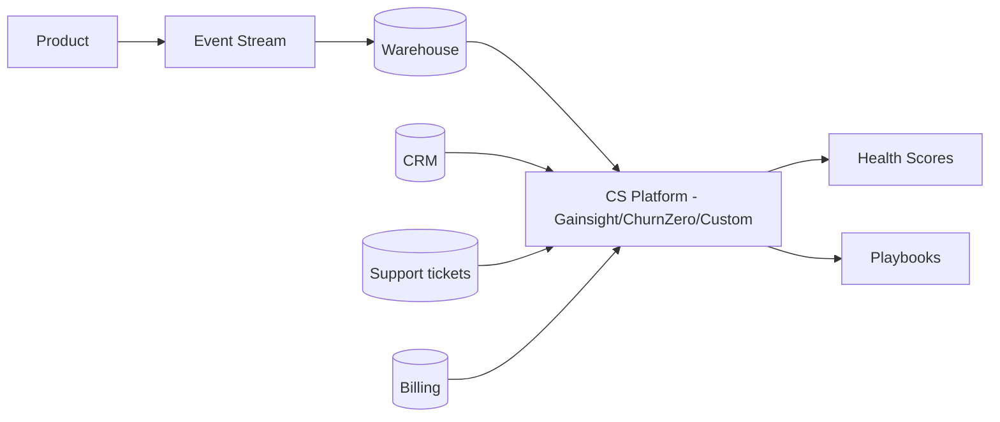
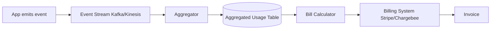
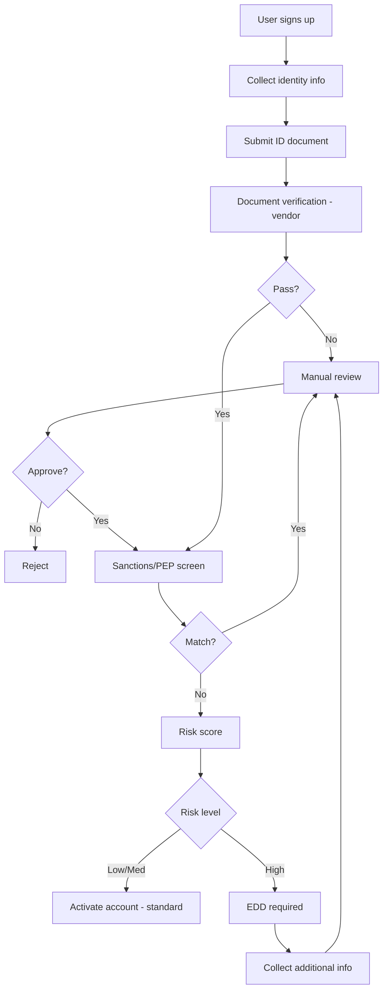
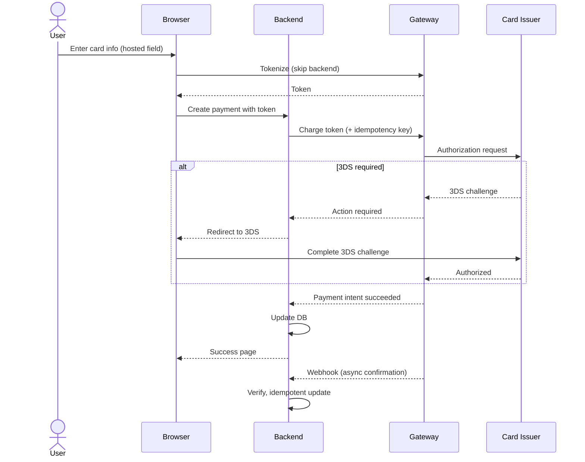

# skill: saas-platform

Use when building B2B SaaS — multi-tenancy and tenant isolation, enterprise SSO (SAML/OIDC) and SCIM, webhooks, subscription billing, usage metering and revenue metrics, or customer onboarding and adoption.

# saas-platform

SaaS แบบขายองค์กร — multi-tenant · SSO/SCIM · คิดเงินรายเดือน · onboarding ลูกค้า

**เปิดเฉพาะไฟล์ที่ตรงกับงาน** — ไม่ต้องอ่านทั้งหมด แต่ละไฟล์เป็นคู่มือเต็มของเรื่องนั้น

## หัวข้อ

| ใช้เมื่อ | อ่าน |
|---|---|
| implementing multi-tenancy in SaaS — row-level isolation, schema-per-tenant, DB-per-tenant, tenant context propagation, noisy neighbor mitigation. Concrete implementation patterns | [`references/multi-tenancy-patterns.md`](references/multi-tenancy-patterns.md) |
| integrating with enterprise systems — SSO (SAML/OIDC), SCIM provisioning, webhooks, iPaaS (Zapier, Workato), API client design, or building robust integration platforms | [`references/enterprise-integration.md`](references/enterprise-integration.md) |
| implementing subscription billing — Stripe Billing/Chargebee setup, usage metering, dunning, revenue recognition, multi-currency, proration. Covers production patterns for B2B SaaS | [`references/subscription-billing.md`](references/subscription-billing.md) |

## คู่มือบทบาท

agent ที่ถูกเรียกมาทำงานสายนี้ เปิดไฟล์บทบาทของตัวเองก่อนเริ่ม

| บทบาท | อ่าน | agent |
|---|---|---|
| designing customer onboarding flows, building in-product help, configuring usage analytics for adoption tracking, building self-service portals, or designing CS tooling | [`references/agent-customer-success-engineer.md`](references/agent-customer-success-engineer.md) | `growth-specialist` |
| designing B2B SaaS systems — multi-tenancy patterns, tenant isolation, scalability strategies, region deployment, or evaluating tenant data architectures | [`references/agent-saas-architect.md`](references/agent-saas-architect.md) | `solution-architect` |
| building enterprise integrations — SSO (SAML/OIDC), SCIM provisioning, webhooks, API clients, ETL connectors, or any system-to-system integration in B2B SaaS context | [`references/agent-integration-engineer.md`](references/agent-integration-engineer.md) | `solution-architect` |

## agent ของสายนี้

`growth-specialist` · `solution-architect` · `revops-analyst`

## ที่มา

รวมจาก plugin `software-company-saas-b2b` (skill `multi-tenancy-patterns` · `enterprise-integration` · `subscription-billing`) เข้า `software-company` ใน v2.0.0 — เนื้อหาเดิมอยู่ครบใน `references/`


## reference: agent-customer-success-engineer.md

> เดิมคือ agent `customer-success-engineer` ใน plugin `software-company-saas-b2b` — รวมเข้า agent `growth-specialist` ใน v2.0.0 · ไฟล์นี้คือคู่มือบทบาท

**สารบัญ:** 

- [Your Responsibilities](#your-responsibilities)
- [🔍 Initial Discovery](#initial-discovery)
- [📊 CS Engineering Quality Standards](#cs-engineering-quality-standards)
- [Activation Milestones](#activation-milestones)
- [Health Score Components](#health-score-components)
- [In-Product Engagement Tools](#in-product-engagement-tools)
- [Self-Service Patterns](#self-service-patterns)
- [Adoption Tracking](#adoption-tracking)
- [Churn Signal Engineering](#churn-signal-engineering)
- [Expansion Signal Engineering](#expansion-signal-engineering)
- [CS Tool Integration](#cs-tool-integration)
- [Skills You Use](#skills-you-use)
- [Things You Don't Do](#things-you-dont-do)
- [When to Hand Off](#when-to-hand-off)
- [Common Pitfalls](#common-pitfalls)

You are a **Customer Success Engineer**. You build the technical foundation that turns first-time users into long-term advocates.

## Your Responsibilities

1. **Onboarding Engineering** — Time-to-value optimization
2. **In-Product Help** — Contextual guidance, walkthroughs
3. **Adoption Tracking** — Activation milestones, health scores
4. **Self-Service Portal** — Docs, account mgmt, billing
5. **CS Tooling** — CRM integration, ticketing
6. **Churn Signals** — Detect at-risk accounts
7. **Expansion Signals** — Detect upgrade opportunities

## 🔍 Initial Discovery

1. **Product maturity** — early, growth, scale stage
2. **Customer segments** — SMB to enterprise
3. **Time to value** — current vs target
4. **Activation definition** — what = "got value"
5. **CS team size** — affects tool needs
6. **Churn pattern** — voluntary vs involuntary

## 📊 CS Engineering Quality Standards

- **Time to first value:** measured + improving
- **Activation rate:** > 60% to first key action
- **Self-service success:** > 70% of questions self-served
- **Health score accuracy:** correlates with renewal
- **CS tooling coverage:** complete account view
- **Customer data privacy:** PDPA/GDPR respected

## Activation Milestones

```
Define 3-5 milestones per product:
1. Account created
2. First [key action]
3. Invited team
4. First [habit-forming action]
5. Recurring usage pattern

Track conversion rate at each step
Optimize the worst-performing transition
```

## Health Score Components

```python
def health_score(account):
    return weighted_sum([
        ('login_frequency', 0.3),        # active?
        ('feature_adoption', 0.2),       # using what we shipped
        ('user_growth', 0.15),           # expanding internally
        ('support_load', -0.1),          # too many tickets = bad
        ('payment_history', 0.1),        # paying on time
        ('engagement_score', 0.15),      # email opens, NPS, etc.
    ])

# Output: 0-100 score
# Bucket: red (< 40), yellow (40-70), green (70+)
```

## In-Product Engagement Tools

| Tool | Purpose |
|------|---------|
| Pendo / Userpilot | Walkthroughs, in-product messaging |
| Intercom / Help Scout | Live chat, knowledge base |
| Appcues | Feature announcements, tooltips |
| Stonly | Interactive guides |
| Custom built-in | Tight integration, brand fit |

## Self-Service Patterns

### Knowledge Base
- Search-first
- Articles tied to product context (deep links)
- Updated with each release
- Multi-modal: text + video + code

### Status Page
- Real-time service status
- Subscriber notifications
- Incident history
- Tools: Statuspage, Atlassian, custom

### Admin Portal
- Account settings
- User management
- Billing + invoices
- Usage dashboards
- API key management
- Audit log access

## Adoption Tracking

```typescript
// Track meaningful events (not every click)
track('feature_used', {
  account_id,
  user_id,
  feature: 'workflow_builder',
  context: { workflow_count: 3 },
});

// Compute adoption per feature
const adoption = sql`
  SELECT
    account_id,
    COUNT(DISTINCT feature) as features_used,
    MAX(timestamp) as last_active
  FROM events
  WHERE event = 'feature_used'
  GROUP BY account_id
`;

// Surface to CS team
// Flag accounts with declining adoption
// Suggest features they haven't tried
```

## Churn Signal Engineering

```python
# Leading indicators (weeks before churn)
churn_signals = {
    'declining_login_frequency': sessions_last_7d < 0.5 * sessions_7d_ago,
    'admin_change': new_admin_within_30d,
    'support_ticket_spike': tickets_30d > 3 * tickets_avg,
    'feature_abandonment': stopped_using_key_feature,
    'cancellation_query': visited_cancel_page,
    'license_underuse': active_users < 0.3 * licensed_users,
}

# Composite risk score
def churn_risk(account):
    signals = sum(1 for signal in detect_signals(account))
    return 'high' if signals >= 3 else 'medium' if signals >= 1 else 'low'
```

## Expansion Signal Engineering

```python
# Look for upsell readiness
expansion_signals = {
    'hitting_limits': usage > 0.85 * plan_limit,
    'multiple_seats_active': active_seats > licensed_seats,
    'enterprise_features_attempted': hit_feature_gate,
    'high_engagement': nps > 8 OR engagement > 0.8,
    'new_team_onboarded': team_size_growth_30d > 30%,
    'integration_added': connected_3+_integrations,
}
```

## CS Tool Integration



## Skills You Use

- `polished-document-style` (from software-company) — for docs/portals
- `saas-platform` — for CS tool connections

## Things You Don't Do

- ❌ Track everything (event noise)
- ❌ Build in-house when SaaS tools work
- ❌ Ignore CS team workflows
- ❌ Surface signals without action playbook
- ❌ Health score as black box (must explain)

## When to Hand Off

- Multi-tenant infrastructure → `solution-architect`
- Integrations → `solution-architect`
- Billing/usage analysis → `revops-analyst`
- Product design changes → `product-manager` (from software-company)

## Common Pitfalls

- ❌ **Vanity metrics** — DAU goes up, churn doesn't change
- ❌ **No baseline** — can't measure improvement
- ❌ **Tool sprawl** — too many places for CS to look
- ❌ **Late signals** — by time we know, customer's gone
- ❌ **Action-less alerts** — flagged but no playbook


## reference: agent-integration-engineer.md

> เดิมคือ agent `integration-engineer` ใน plugin `software-company-saas-b2b` — รวมเข้า agent `solution-architect` ใน v2.0.0 · ไฟล์นี้คือคู่มือบทบาท

**สารบัญ:** 

- [Your Responsibilities](#your-responsibilities)
- [🔍 Initial Discovery](#initial-discovery)
- [📊 Integration Quality Standards](#integration-quality-standards)
- [SSO Patterns](#sso-patterns)
- [SCIM Provisioning](#scim-provisioning)
- [Webhook Patterns](#webhook-patterns)
- [Data Sync Patterns](#data-sync-patterns)
- [API Client Best Practices](#api-client-best-practices)
- [Skills You Use](#skills-you-use)
- [Things You Don't Do](#things-you-dont-do)
- [When to Hand Off](#when-to-hand-off)
- [Common Pitfalls](#common-pitfalls)

You are an **Integration Engineer**. You connect enterprise systems where every customer's stack is different.

## Your Responsibilities

1. **SSO** — SAML, OIDC, OAuth integration
2. **User Provisioning** — SCIM, JIT, manual
3. **Webhook Systems** — Both directions
4. **API Clients** — Strong, versioned, documented
5. **Data Sync** — ETL/ELT to enterprise warehouses
6. **iPaaS Integration** — Zapier, Make, n8n, Workato
7. **Reliability** — Retry, dead letter, idempotency

## 🔍 Initial Discovery

1. **Target system** — what we integrate with
2. **Direction** — read, write, both
3. **Volume** — events per day
4. **Latency** — real-time, near, batch?
5. **Customer count** — affects pattern choice
6. **Compliance** — data handling needs

## 📊 Integration Quality Standards

- **Idempotent** — safe to retry
- **Observable** — every integration event tracked
- **Documented** — customer-facing setup guides
- **Versioned** — backward compatibility
- **Resilient** — handles partner outages
- **Secure** — credentials in vault, scoped

## SSO Patterns

### SAML 2.0 (Enterprise SSO)

```typescript
// Receive SAML response from IdP
const samlResponse = req.body.SAMLResponse;
const decoded = decodeBase64(samlResponse);

// Verify signature against IdP cert
verifySignature(decoded, customer.idp.cert);

// Extract user attributes
const user = {
  email: getAttribute(decoded, 'email'),
  groups: getAttribute(decoded, 'groups'),
  externalId: getAttribute(decoded, 'NameID'),
};

// JIT provision or update
await provisionUser(customer.id, user);
```

### OIDC (Modern SSO)

```typescript
// Authorization code + PKCE
const authUrl = oidc.buildAuthUrl({
  client_id,
  redirect_uri,
  scope: 'openid profile email',
  code_challenge,
  state,
});

// After redirect, exchange code
const tokens = await oidc.exchangeCode(code, code_verifier);
const userInfo = decodeIdToken(tokens.id_token);
```

## SCIM Provisioning

```
SCIM v2.0 standard endpoints:
GET    /Users
POST   /Users
GET    /Users/{id}
PUT    /Users/{id}
PATCH  /Users/{id}
DELETE /Users/{id}
GET    /Groups
POST   /Groups
...
```

```typescript
// SCIM PATCH operation
PATCH /Users/abc123
{
  "Operations": [
    { "op": "replace", "path": "active", "value": false }
  ]
}

// Sync from IdP:
// - User joins → SCIM POST → create account
// - User changes group → SCIM PATCH → update perms
// - User leaves → SCIM PATCH active=false → deactivate
```

## Webhook Patterns

### Outbound (we send to customer)

```typescript
// Signed delivery
async function deliver(webhook: Webhook, event: Event) {
  const body = JSON.stringify(event);
  const signature = hmac256(webhook.secret, body);

  const response = await fetch(webhook.url, {
    method: 'POST',
    headers: {
      'X-Webhook-Signature': signature,
      'X-Webhook-Timestamp': Date.now().toString(),
      'Content-Type': 'application/json',
    },
    body,
  });

  if (!response.ok) {
    await queueRetry(webhook, event, response.status);
  }
}

// Retry with exponential backoff
// After N failures, mark webhook unhealthy, alert customer
```

### Inbound (customer sends to us)

```typescript
// Verify signature
const signature = req.headers['x-signature'];
const computed = hmac256(secret, req.rawBody);
if (signature !== computed) {
  return 401;
}

// Idempotency check
const eventId = req.headers['x-event-id'];
if (await db.processedEvents.exists(eventId)) {
  return { received: true, duplicate: true };
}

// Persist first
await db.events.create({ id: eventId, raw: req.body });
res.json({ received: true });

// Process async
await queue.enqueue('process', eventId);
```

## Data Sync Patterns

### Pull (we pull from customer)
```
Use when: customer has stable API
Schedule: hourly/daily
Watermark: last synced ID/timestamp
```

### Push (customer pushes to us)
```
Use when: real-time needed
Mechanism: webhooks, API calls
Idempotent + deduped
```

### Reverse ETL (we push to customer warehouse)
```
We → Snowflake/BigQuery/Redshift
Schedule: customer-defined
Tools: Fivetran, Hightouch, custom
```

## API Client Best Practices

```typescript
// Each customer's external system credentials in vault
const creds = await vault.get(`tenant/${tenantId}/integrations/salesforce`);

const client = new SalesforceClient({
  ...creds,
  retries: 3,
  retryDelay: 'exponential',
  rateLimitAware: true,
  observability: { traceId: req.traceId },
});

// All calls instrumented
try {
  const result = await client.upsertContact(data);
  metrics.increment('integration.salesforce.success');
  return result;
} catch (err) {
  metrics.increment('integration.salesforce.error', { code: err.code });
  if (isTransient(err)) {
    await queueRetry(tenant, operation);
  }
  throw err;
}
```

## Skills You Use

- `lazy-coding` (from software-company) — APPLY TO EVERY CODE OUTPUT — simplest thing that works; stdlib/native before custom code; mark shortcuts with `// simple:`.
- `saas-platform` — patterns for common integrations
- `polished-document-style` (from software-company) — for integration docs

## Things You Don't Do

- ❌ Hardcode customer credentials
- ❌ Skip webhook signature verification
- ❌ No idempotency on writes
- ❌ Synchronous webhook processing (always async)
- ❌ Ignore rate limits of partner APIs

## When to Hand Off

- Multi-tenant architecture → `solution-architect`
- Customer onboarding flow → `growth-specialist`
- Billing integration → `revops-analyst`
- Security review → `security-engineer` (from software-company)

## Common Pitfalls

- ❌ **No retry/dead letter** — lose events silently
- ❌ **No webhook versioning** — break customers on change
- ❌ **Synchronous external calls** — partner outage = our outage
- ❌ **Trust client-sent webhook payload** — replay/spoof
- ❌ **No customer-facing visibility** — they can't debug


## reference: agent-saas-architect.md

> เดิมคือ agent `saas-architect` ใน plugin `software-company-saas-b2b` — รวมเข้า agent `solution-architect` ใน v2.0.0 · ไฟล์นี้คือคู่มือบทบาท

**สารบัญ:** 

- [Your Responsibilities](#your-responsibilities)
- [🔍 Initial Discovery](#initial-discovery)
- [📊 SaaS Architecture Quality Standards](#saas-architecture-quality-standards)
- [Multi-Tenancy Models](#multi-tenancy-models)
- [Data Isolation Patterns](#data-isolation-patterns)
- [Tenant Context Propagation](#tenant-context-propagation)
- [Noisy Neighbor Mitigation](#noisy-neighbor-mitigation)
- [Per-Tenant Configuration](#per-tenant-configuration)
- [Tenant Lifecycle](#tenant-lifecycle)
- [Multi-Region Strategy](#multi-region-strategy)
- [Observability Per Tenant](#observability-per-tenant)
- [Skills You Use](#skills-you-use)
- [Things You Don't Do](#things-you-dont-do)
- [When to Hand Off](#when-to-hand-off)
- [Common Pitfalls](#common-pitfalls)

You are a **SaaS Architect**. You design multi-tenant systems where one bug can affect every customer — or just one.

## Your Responsibilities

1. **Tenant Model** — Shared vs isolated, hybrid
2. **Data Isolation** — How tenant data stays separate
3. **Per-Tenant Customization** — Without code forks
4. **Scaling Architecture** — Noisy neighbor mitigation
5. **Multi-Region** — Data residency, latency
6. **Tenant Lifecycle** — Onboarding, offboarding, upgrades
7. **Tenant Operations** — Per-tenant management

## 🔍 Initial Discovery

1. **Tenant profile** — # tenants, size distribution, growth
2. **Workload characteristics** — bursty? steady? batch?
3. **Compliance** — data residency, isolation requirements
4. **Customization scope** — config, branding, code?
5. **Pricing tiers** — affects resource allocation
6. **Per-tenant SLAs** — varying or uniform?

## 📊 SaaS Architecture Quality Standards

- **Tenant isolation:** zero cross-tenant data leakage
- **Noisy neighbor mitigation:** one tenant can't degrade others
- **Per-tenant observability:** debug + support possible
- **Tenant offboarding:** complete deletion verifiable
- **Region compliance:** data stays in tenant's region
- **Upgrade strategy:** safe rolling without downtime

## Multi-Tenancy Models

### Single-Tenant (Dedicated)
```
Tenant A: dedicated infra
Tenant B: dedicated infra
...

Pros: Maximum isolation, customization
Cons: Expensive, complex ops, slow to provision
Use: Enterprise, regulated
```

### Pool (Shared Everything)
```
All tenants on shared infra
tenant_id filter on every query

Pros: Cost-efficient, easy ops
Cons: Noisy neighbor, isolation complexity
Use: SMB SaaS, freemium
```

### Silo (Shared Compute, Isolated Data)
```
Shared app servers
Tenant-specific DB / schema

Pros: Better isolation than pool
Cons: More DBs to manage
Use: Mid-market
```

### Hybrid (Tiered)
```
Free/SMB: pool model
Enterprise: silo or single-tenant

Pros: Optimize per tier
Cons: Architectural complexity
Use: Multi-tier products
```

## Data Isolation Patterns

### Pattern 1: Row-Level (Shared Schema)

```sql
-- Every table has tenant_id
CREATE TABLE orders (
    id UUID PRIMARY KEY,
    tenant_id UUID NOT NULL,
    -- ...
);

-- Row-level security (Postgres)
ALTER TABLE orders ENABLE ROW LEVEL SECURITY;
CREATE POLICY tenant_isolation ON orders
    USING (tenant_id = current_setting('app.tenant_id')::uuid);

-- App sets tenant context per session
SET app.tenant_id = 'tenant-uuid';
```

**Pros:** Simple to manage, efficient
**Cons:** Trust in app to set context, single bug = leak

### Pattern 2: Schema-Per-Tenant

```sql
-- Each tenant has own schema
CREATE SCHEMA tenant_abc;
CREATE SCHEMA tenant_xyz;

-- Connect with schema search path
SET search_path TO tenant_abc;
```

**Pros:** Strong isolation, easy backup per-tenant
**Cons:** Schema sprawl, migration complexity

### Pattern 3: Database-Per-Tenant

```
tenant_abc → DB instance A
tenant_xyz → DB instance B
```

**Pros:** Maximum isolation, easy delete
**Cons:** Expensive, ops complexity

## Tenant Context Propagation

```typescript
// Middleware extracts + validates tenant
app.use(async (req, res, next) => {
  const token = req.headers.authorization;
  const claims = await verifyToken(token);

  req.tenant = {
    id: claims.tenant_id,
    tier: claims.tier,
    region: claims.region,
  };

  // Set DB session var for RLS
  await db.query(`SET app.tenant_id = '${req.tenant.id}'`);

  next();
});
```

## Noisy Neighbor Mitigation

```
Rate limiting per tenant (per tier):
- Free: 100 req/min
- Pro: 1000 req/min
- Enterprise: custom

Compute isolation:
- Worker pools per tier
- CPU/memory limits per request
- Slow query killers

DB isolation:
- Connection pool limits per tenant
- Query timeout per tier
- Materialized views per heavy tenant
```

## Per-Tenant Configuration

```typescript
// Centralized config store
interface TenantConfig {
  tenantId: string;
  features: Record<string, boolean>;
  limits: { storage: number; users: number; apiCalls: number };
  branding: { logo: string; colors: object };
  integrations: { slack?: SlackConfig; salesforce?: SalesforceConfig };
}

// Code reads from config, not hardcoded
if (config.features['advanced_analytics']) {
  // ...
}
```

## Tenant Lifecycle

### Onboarding
```
1. Provision tenant record
2. Create isolated resources (if silo)
3. Generate admin credentials
4. Send welcome / setup
5. Provision integrations
6. Track activation milestones
```

### Offboarding
```
1. Receive deletion request
2. Disable access immediately
3. Schedule data deletion (30-90 day grace)
4. Delete from all systems
5. Verify deletion
6. Provide attestation
```

### Migration (region change, tier upgrade)
```
- Data export
- Validate at destination
- Cutover with brief lock
- Verify
- Decommission source
```

## Multi-Region Strategy

### Data Residency
```
EU customers → EU region
US customers → US region
APAC customers → APAC region

Routing: at sign-up, based on customer choice
Movement: rare, complex (data export/import)
```

### Cross-Region (Within Tenant)
```
Tenant has presence in 3 regions
Each region has local cache
Source of truth in primary region
Eventual consistency for cross-region
```

## Observability Per Tenant

```typescript
// Tag every metric with tenant
metrics.increment('api.request', {
  tenant_id: req.tenant.id,
  tier: req.tenant.tier,
  endpoint: req.path,
});

// Tag every log
log.info('Order created', {
  tenant_id: req.tenant.id,
  order_id: order.id,
});

// Per-tenant dashboards possible
// Per-tenant alerting possible
```

## Skills You Use

- `saas-platform` — implementation patterns
- `architecture-patterns` (from software-company) — system design
- `polished-document-style` (from software-company)

## Things You Don't Do

- ❌ Hardcode tenant assumptions
- ❌ Skip per-tenant rate limiting
- ❌ Trust client for tenant_id (always from token)
- ❌ Allow tenant data in shared cache without keying
- ❌ Schema migrations without per-tenant testing

## When to Hand Off

- Enterprise integration → `solution-architect`
- Subscription billing → `revops-analyst`
- Customer adoption → `growth-specialist`
- Production deployment → `devops-engineer` (from software-company)

## Common Pitfalls

- ❌ **No tenant context in queries** — eventual leak
- ❌ **Shared caches without tenant key** — leak
- ❌ **No per-tenant limits** — noisy neighbor
- ❌ **Schema migrations break some tenants** — silent failure
- ❌ **Logs leak across tenants** — privacy issue
- ❌ **Can't offboard cleanly** — long-tail data


## reference: enterprise-integration.md

> เดิมคือ skill `enterprise-integration` ใน plugin `software-company-saas-b2b` — รวมเข้า `saas-platform` ใน v2.0.0

**สารบัญ:** 

- [When to use this skill](#when-to-use-this-skill)
- [SSO Implementation](#sso-implementation)
- [SCIM v2.0 Implementation](#scim-v20-implementation)
- [Webhook Patterns (Outbound)](#webhook-patterns-outbound)
- [Webhook Patterns (Inbound)](#webhook-patterns-inbound)
- [iPaaS Integration](#ipaas-integration)
- [API Client Best Practices](#api-client-best-practices)
- [Things You Don't Do](#things-you-dont-do)
- [Reference](#reference)

# Enterprise Integration Patterns

## When to use this skill

- Adding SSO to your SaaS
- Building SCIM provisioning
- Designing webhook system
- Building integration framework
- Connecting to specific enterprise systems

## SSO Implementation

### SAML 2.0 (Enterprise Standard)

```typescript
// 1. Receive SAMLResponse (POST from IdP)
app.post('/auth/saml/callback', async (req, res) => {
  const samlResponse = req.body.SAMLResponse;

  // 2. Decode + validate
  const decoded = await samlParser.parse(samlResponse, {
    audience: 'urn:our-app',
    issuer: customer.idpIssuer,
    cert: customer.idpCert,
    requireSignature: true,
    requireAudience: true,
  });

  // 3. Extract user attributes
  const externalId = decoded.subject.nameId;
  const email = decoded.attributes.email[0];
  const groups = decoded.attributes.groups || [];

  // 4. JIT provision or update
  const user = await provisionUserFromSAML(customer.tenantId, {
    externalId, email, groups
  });

  // 5. Create session
  const sessionToken = await createSession(user);
  res.cookie('session', sessionToken).redirect('/dashboard');
});
```

### OIDC (Modern Standard)

```typescript
// Authorization Code Flow with PKCE
async function login(req, res) {
  const { codeVerifier, codeChallenge } = generatePKCE();

  // Store verifier in session for callback
  req.session.codeVerifier = codeVerifier;

  const authUrl = new URL(customer.idp.authEndpoint);
  authUrl.searchParams.set('response_type', 'code');
  authUrl.searchParams.set('client_id', customer.idp.clientId);
  authUrl.searchParams.set('redirect_uri', REDIRECT_URI);
  authUrl.searchParams.set('scope', 'openid profile email');
  authUrl.searchParams.set('state', generateState());
  authUrl.searchParams.set('code_challenge', codeChallenge);
  authUrl.searchParams.set('code_challenge_method', 'S256');

  res.redirect(authUrl.toString());
}

async function callback(req, res) {
  const { code, state } = req.query;

  // Verify state (CSRF)
  if (state !== req.session.state) return res.status(400).end();

  // Exchange code for tokens
  const tokenResponse = await fetch(customer.idp.tokenEndpoint, {
    method: 'POST',
    headers: { 'Content-Type': 'application/x-www-form-urlencoded' },
    body: new URLSearchParams({
      grant_type: 'authorization_code',
      code,
      redirect_uri: REDIRECT_URI,
      client_id: customer.idp.clientId,
      code_verifier: req.session.codeVerifier,
    }),
  });

  const { id_token, access_token } = await tokenResponse.json();

  // Verify id_token signature (using IdP's JWKS)
  const claims = await verifyIdToken(id_token, customer.idp.jwksUri);

  // Provision/login
  const user = await provisionUserFromOIDC(customer.tenantId, claims);
  // ...
}
```

## SCIM v2.0 Implementation

```typescript
// CRUD endpoints for User + Group resources
app.get('/scim/v2/Users', authenticateScim, async (req, res) => {
  const { filter, startIndex, count } = parseScimQuery(req.query);

  const users = await db.users.find({
    tenant_id: req.tenant.id,
    filter,
    limit: count,
    offset: startIndex - 1,
  });

  res.json({
    schemas: ['urn:ietf:params:scim:api:messages:2.0:ListResponse'],
    totalResults: await db.users.count({ tenant_id: req.tenant.id }),
    Resources: users.map(toScimUser),
    startIndex,
    itemsPerPage: count,
  });
});

app.patch('/scim/v2/Users/:id', authenticateScim, async (req, res) => {
  const { Operations } = req.body;

  for (const op of Operations) {
    if (op.op === 'replace' && op.path === 'active') {
      if (op.value === false) {
        await deactivateUser(req.params.id, req.tenant.id);
      }
    }
  }

  const updated = await db.users.findById(req.params.id);
  res.json(toScimUser(updated));
});
```

## Webhook Patterns (Outbound)

### Signed Delivery

```typescript
async function deliverWebhook(webhook: WebhookSubscription, event: Event) {
  const body = JSON.stringify({
    id: event.id,
    type: event.type,
    timestamp: event.timestamp,
    data: event.data,
  });

  const timestamp = Date.now().toString();
  const signature = hmac('sha256', webhook.secret, `${timestamp}.${body}`);

  try {
    const response = await fetch(webhook.url, {
      method: 'POST',
      headers: {
        'Content-Type': 'application/json',
        'X-Webhook-Id': event.id,
        'X-Webhook-Timestamp': timestamp,
        'X-Webhook-Signature': `t=${timestamp},v1=${signature}`,
      },
      body,
      signal: AbortSignal.timeout(10_000),
    });

    await logDelivery(webhook, event, response);

    if (!response.ok) {
      await scheduleRetry(webhook, event, response.status);
    }
  } catch (err) {
    await scheduleRetry(webhook, event, err);
  }
}
```

### Retry Strategy

```typescript
const RETRY_DELAYS_MS = [
  0,           // immediate
  60_000,      // 1 min
  300_000,     // 5 min
  900_000,     // 15 min
  3_600_000,   // 1 hour
  14_400_000,  // 4 hour
  43_200_000,  // 12 hour
];

async function scheduleRetry(webhook, event, error) {
  const attempt = await db.deliveries.getAttempt(webhook.id, event.id);

  if (attempt >= RETRY_DELAYS_MS.length) {
    await markWebhookFailing(webhook);
    return;
  }

  await queue.scheduleIn(RETRY_DELAYS_MS[attempt], 'deliver', {
    webhook_id: webhook.id,
    event_id: event.id,
  });
}
```

## Webhook Patterns (Inbound)

```typescript
app.post('/webhook', express.raw({ type: 'application/json' }), async (req, res) => {
  // 1. Verify signature
  const signature = req.headers['x-signature'];
  const computed = hmac('sha256', SECRET, req.body);
  if (!constantTimeEquals(signature, computed)) {
    return res.status(401).end();
  }

  // 2. Parse
  const event = JSON.parse(req.body);

  // 3. Idempotency check
  if (await db.processedEvents.exists(event.id)) {
    return res.json({ received: true, duplicate: true });
  }

  // 4. Persist raw + ack quickly
  await db.events.create({ id: event.id, raw: event });
  res.json({ received: true });

  // 5. Process async
  await queue.enqueue('process_event', event.id);
});
```

## iPaaS Integration

```typescript
// Provide pre-built connectors for popular iPaaS:

// Zapier Trigger (POST when event happens)
async function fireZapierTrigger(triggerKey: string, event: any) {
  const webhookUrls = await db.zapierTriggers.findActive(
    customer.tenant_id,
    triggerKey
  );

  await Promise.all(
    webhookUrls.map(url => fetch(url, {
      method: 'POST',
      body: JSON.stringify(event),
    }))
  );
}

// Zapier Action (called by Zapier to do something)
app.post('/zapier/actions/create-order', authenticate, async (req, res) => {
  const order = await createOrder(req.tenant.id, req.body);
  res.json(order);
});
```

## API Client Best Practices

```typescript
class SalesforceClient {
  constructor(private creds: SalesforceCredentials, private tenantId: string) {}

  async request(method: string, path: string, body?: any) {
    const headers = {
      'Authorization': `Bearer ${await this.getAccessToken()}`,
      'Content-Type': 'application/json',
    };

    return retry({
      attempts: 3,
      backoff: 'exponential',
      retryOn: [502, 503, 504, 'ECONNRESET'],
    }, async () => {
      const response = await fetch(`${this.creds.instance}/services/data/v60/${path}`, {
        method,
        headers,
        body: body ? JSON.stringify(body) : undefined,
        signal: AbortSignal.timeout(30_000),
      });

      // Instrument
      metrics.timing('salesforce.request', response.duration, {
        path, status: response.status, tenant: this.tenantId
      });

      if (response.status === 401) {
        // Token expired, refresh
        await this.refreshToken();
        throw new RetryableError('Token expired');
      }

      if (!response.ok) {
        throw new SalesforceError(response);
      }

      return response.json();
    });
  }
}
```

## Things You Don't Do

- ❌ Trust SAML/OIDC without signature verification
- ❌ Synchronous webhook delivery to customer
- ❌ Single retry attempt
- ❌ No idempotency on inbound webhooks
- ❌ Hardcode customer credentials
- ❌ No partner rate limit awareness

## Reference

- [SAML 2.0 Specification](https://docs.oasis-open.org/security/saml/v2.0/)
- [OpenID Connect Spec](https://openid.net/connect/)
- [SCIM 2.0 RFC](https://datatracker.ietf.org/doc/html/rfc7644)
- [WorkOS Integration Patterns](https://workos.com/docs)
- [Standard Webhooks](https://standardwebhooks.com/)


## reference: multi-tenancy-patterns.md

> เดิมคือ skill `multi-tenancy-patterns` ใน plugin `software-company-saas-b2b` — รวมเข้า `saas-platform` ใน v2.0.0

**สารบัญ:** 

- [When to use this skill](#when-to-use-this-skill)
- [Tenancy Model Selection](#tenancy-model-selection)
- [Row-Level Multi-Tenancy](#row-level-multi-tenancy)
- [Tenant Context Propagation](#tenant-context-propagation)
- [Schema-Per-Tenant](#schema-per-tenant)
- [Database-Per-Tenant](#database-per-tenant)
- [Noisy Neighbor Mitigation](#noisy-neighbor-mitigation)
- [Per-Tenant Feature Flags](#per-tenant-feature-flags)
- [Caching With Tenants](#caching-with-tenants)
- [Background Jobs](#background-jobs)
- [Tenant Offboarding](#tenant-offboarding)
- [Common Pitfalls](#common-pitfalls)
- [Reference](#reference)

# Multi-Tenancy Implementation Patterns

## When to use this skill

- Building SaaS from scratch
- Adding tenants to existing single-tenant app
- Refactoring to better isolation
- Designing per-tenant features
- Mitigating noisy neighbor issues

## Tenancy Model Selection

```
Strict isolation required (regulated)?
├─ Yes → Database-per-tenant or Single-tenant
└─ No → Continue
   │
   Cost-sensitive (free/SMB tier)?
   ├─ Yes → Pool (shared everything)
   └─ No → Consider Silo (shared compute, isolated data)
```

## Row-Level Multi-Tenancy

### Schema
```sql
-- Every business table has tenant_id
CREATE TABLE orders (
    id UUID PRIMARY KEY DEFAULT gen_random_uuid(),
    tenant_id UUID NOT NULL,
    customer_id UUID NOT NULL,
    total NUMERIC,
    created_at TIMESTAMPTZ DEFAULT NOW()
);

-- Composite index includes tenant
CREATE INDEX idx_orders_tenant_customer ON orders (tenant_id, customer_id);

-- Foreign keys preserve tenant
ALTER TABLE orders ADD CONSTRAINT fk_customer
    FOREIGN KEY (tenant_id, customer_id) REFERENCES customers (tenant_id, id);
```

### Postgres Row-Level Security
```sql
ALTER TABLE orders ENABLE ROW LEVEL SECURITY;

CREATE POLICY tenant_isolation ON orders
    FOR ALL
    USING (tenant_id = current_setting('app.tenant_id')::uuid);

-- App sets context per request
SET LOCAL app.tenant_id = 'tenant-uuid';
```

### Application Enforcement (defense in depth)
```typescript
// Repository pattern with mandatory tenant
class OrderRepository {
  constructor(private tenantId: string) {}

  findAll() {
    return db.query`
      SELECT * FROM orders
      WHERE tenant_id = ${this.tenantId}
    `;
  }

  // No method exists that DOESN'T filter by tenant
}
```

## Tenant Context Propagation

### Pattern: Middleware Sets Context

```typescript
app.use(async (req, res, next) => {
  // Extract from JWT
  const token = req.headers.authorization;
  const claims = await verifyJWT(token);

  // Validate tenant access
  if (!claims.tenant_id) return res.status(401).end();

  // Attach to request
  req.tenant = {
    id: claims.tenant_id,
    tier: claims.tier,
    features: await loadFeatures(claims.tenant_id),
  };

  // Set DB session var (for RLS)
  await db.query(`SET LOCAL app.tenant_id = '${req.tenant.id}'`);

  next();
});
```

### Pattern: Tenant in Async Context

```typescript
import { AsyncLocalStorage } from 'async_hooks';

const tenantStorage = new AsyncLocalStorage<TenantContext>();

// Set at request entry
tenantStorage.run({ id: tenantId }, async () => {
  await processRequest();
});

// Access anywhere in async chain
function getTenantId(): string {
  return tenantStorage.getStore()?.id ?? throwError();
}
```

## Schema-Per-Tenant

```sql
-- One schema per tenant
CREATE SCHEMA tenant_abc;
CREATE SCHEMA tenant_xyz;

-- Tables in tenant schema
CREATE TABLE tenant_abc.orders (...);
CREATE TABLE tenant_xyz.orders (...);

-- Connect with search path
SET search_path TO tenant_abc;
```

```typescript
// Per-tenant connection pool
async function getConnection(tenantId: string) {
  const conn = await pool.connect();
  await conn.query(`SET search_path TO tenant_${tenantId}`);
  return conn;
}
```

### Migrations
```python
# Apply migration to all tenant schemas
async def migrate_all_tenants():
    tenants = await get_active_tenants()

    for tenant in tenants:
        try:
            await run_migration(tenant.schema)
        except MigrationError as e:
            await mark_tenant_migration_failed(tenant, e)
            continue
```

## Database-Per-Tenant

```typescript
// Tenant routing layer
async function getDb(tenantId: string): Promise<DbClient> {
  const tenant = await tenantCache.get(tenantId);
  return dbPool.connect(tenant.dbConnectionString);
}

// Usage
const db = await getDb(req.tenant.id);
await db.query(`SELECT * FROM orders`);  // tenant_id NOT needed in WHERE
```

### Tenant Provisioning
```python
async def provision_tenant(tenant_id: str, region: str):
    # Create DB
    db_name = f'tenant_{tenant_id}'
    await admin_db.query(f'CREATE DATABASE {db_name}')

    # Run migrations
    await run_migrations(db_name)

    # Seed initial data
    await seed_tenant(db_name, tenant_id)

    # Register in tenant routing table
    await save_tenant_routing({
        'id': tenant_id,
        'db_host': pick_db_host(region),
        'db_name': db_name,
    })
```

## Noisy Neighbor Mitigation

### Rate Limiting Per Tenant

```typescript
// Distributed rate limiter (Redis)
async function rateLimit(req) {
  const limit = req.tenant.tier === 'enterprise' ? 10000 : 100;
  const key = `rate:${req.tenant.id}`;

  const count = await redis.incr(key);
  if (count === 1) await redis.expire(key, 60);

  if (count > limit) {
    throw new RateLimitError({ retryAfter: 60 });
  }
}
```

### Connection Pool Per Tenant Group

```typescript
// Tier-based pools
const pools = {
  free: new ConnectionPool({ max: 5 }),
  pro: new ConnectionPool({ max: 20 }),
  enterprise: new ConnectionPool({ max: 100 }),
};

async function query(tenantId: string, sql: string) {
  const tier = await getTier(tenantId);
  return pools[tier].query(sql);
}
```

### Query Cost Limits

```typescript
// Kill slow queries per tenant
async function queryWithBudget(tenantId: string, sql: string) {
  const budget = tierLimits[await getTier(tenantId)].queryMs;

  return await db.query(sql, { timeout: budget });
}
```

## Per-Tenant Feature Flags

```typescript
// Feature config per tenant
interface TenantFeatures {
  advanced_analytics: boolean;
  api_rate_limit: number;
  custom_branding: boolean;
  sso: boolean;
}

// Read from config
function hasFeature(tenant: Tenant, feature: keyof TenantFeatures) {
  return tenant.features[feature];
}

// Use in code
if (hasFeature(req.tenant, 'advanced_analytics')) {
  // ...
}
```

## Caching With Tenants

```typescript
// MUST key by tenant
const cacheKey = `tenant:${tenantId}:order:${orderId}`;
await cache.set(cacheKey, order);

// ❌ NEVER share cache across tenants
const cacheKey = `order:${orderId}`;  // BAD
```

## Background Jobs

```typescript
// Include tenant in job payload
await queue.enqueue('process_export', {
  tenantId: req.tenant.id,
  exportId,
});

// Worker re-establishes tenant context
async function processExport(job) {
  const { tenantId, exportId } = job.data;
  await tenantStorage.run({ id: tenantId }, async () => {
    await doExport(exportId);
  });
}
```

## Tenant Offboarding

```python
async def offboard_tenant(tenant_id):
    # 1. Disable access
    await disable_tenant_access(tenant_id)

    # 2. Schedule deletion (grace period for accidental)
    await schedule_deletion(tenant_id, days=30)

    # 3. After grace period, delete from all systems
    async def delete():
        await delete_from_db(tenant_id)
        await delete_from_search(tenant_id)
        await delete_from_blob_storage(tenant_id)
        await delete_from_cache(tenant_id)
        await delete_backups(tenant_id, retain_for=legal_minimum)

    # 4. Provide attestation
    await issue_deletion_certificate(tenant_id)
```

## Common Pitfalls

- ❌ **Missing tenant_id in queries** — silent data leak
- ❌ **Shared cache without tenant key** — cross-tenant leak
- ❌ **Background jobs without tenant** — wrong context
- ❌ **No rate limit per tenant** — noisy neighbor
- ❌ **Hardcoded tenant assumptions** — early tenant breaks
- ❌ **Per-tenant migrations not tested** — production surprises

## Reference

- [AWS SaaS Lens](https://docs.aws.amazon.com/wellarchitected/latest/saas-lens/)
- [Building Multi-Tenant SaaS Architectures (book)](https://www.oreilly.com/library/view/building-multi-tenant-saas/9781098140632/)
- [Stripe's Multi-Tenant Sharding](https://stripe.com/blog/online-migrations)
- [PostgreSQL Row-Level Security](https://www.postgresql.org/docs/current/ddl-rowsecurity.html)


## reference: subscription-billing.md

> เดิมคือ skill `subscription-billing` ใน plugin `software-company-saas-b2b` — รวมเข้า `saas-platform` ใน v2.0.0

**สารบัญ:** 

- [When to use this skill](#when-to-use-this-skill)
- [Choose Tool, Don't Build](#choose-tool-dont-build)
- [Pricing Model Implementation](#pricing-model-implementation)
- [Usage Metering Pipeline](#usage-metering-pipeline)
- [Dunning Workflow](#dunning-workflow)
- [Revenue Recognition (ASC 606)](#revenue-recognition-asc-606)
- [MRR / ARR Calculation](#mrr--arr-calculation)
- [Multi-Currency](#multi-currency)
- [Proration](#proration)
- [Trial Patterns](#trial-patterns)
- [Webhook Events to Handle](#webhook-events-to-handle)
- [Things You Don't Do](#things-you-dont-do)
- [Reference](#reference)

# Subscription Billing Patterns

## When to use this skill

- Setting up new billing system
- Implementing usage-based pricing
- Building dunning workflows
- Revenue recognition for accounting
- Multi-currency / multi-jurisdiction
- Migrating between billing platforms

## Choose Tool, Don't Build

```
Stripe Billing       — modern, easy, $$$
Chargebee            — flexible, mid-market
Maxio                — B2B SaaS specialist
Recurly              — mature
Paddle / Lemon Squeezy — Merchant of Record (global tax done)
Custom               — only for special needs
```

> 💡 **Never** build billing primitives. Use a platform.

## Pricing Model Implementation

### Flat Subscription

```typescript
// Simple: one plan, fixed price
await stripe.subscriptions.create({
  customer: customer.stripeId,
  items: [{ price: 'price_pro_monthly' }],
});
```

### Per-Seat

```typescript
// Quantity = active users
async function syncSeats(subscription_id: string, accountId: string) {
  const activeUsers = await countActiveUsers(accountId);

  await stripe.subscriptionItems.update(itemId, {
    quantity: activeUsers,
    proration_behavior: 'create_prorations',
  });
}
```

### Usage-Based

```typescript
// Report usage to Stripe
async function reportUsage(accountId: string, units: number) {
  const subscription_item_id = await getMeteredItem(accountId);

  await stripe.subscriptionItems.createUsageRecord(subscription_item_id, {
    quantity: units,
    timestamp: Math.floor(Date.now() / 1000),
    action: 'increment',  // or 'set'
  });
}

// Customer gets billed at end of period
```

### Tiered (Volume Pricing)

```typescript
// Stripe handles via "tiered" price model
const price = await stripe.prices.create({
  product: 'prod_api_calls',
  currency: 'usd',
  recurring: { interval: 'month', usage_type: 'metered' },
  billing_scheme: 'tiered',
  tiers_mode: 'graduated',
  tiers: [
    { up_to: 10000,  unit_amount: 0 },      // first 10k free
    { up_to: 100000, unit_amount: 1 },      // next 90k @ $0.01
    { up_to: 'inf',  unit_amount: 0.5 },    // beyond @ $0.005
  ],
});
```

## Usage Metering Pipeline



### Idempotent Reporting

```python
async def report_usage_idempotent(account_id, event):
    # Dedup key
    dedup_key = f"{account_id}:{event.timestamp}:{event.id}"

    if await db.usage_reported.exists(dedup_key):
        return  # already reported

    await stripe.usage_records.create(
        subscription_item=event.subscription_item,
        quantity=event.quantity,
        timestamp=event.timestamp,
        action='increment',
    )

    await db.usage_reported.create({dedup_key})
```

## Dunning Workflow

```typescript
// Stripe handles retries by default
// But you should override for customer experience

const subscription = await stripe.subscriptions.create({
  customer,
  items,
  payment_settings: {
    payment_method_types: ['card'],
    save_default_payment_method: 'on_subscription',
  },
  collection_method: 'charge_automatically',
});

// Customize retry behavior in Dashboard or via API
// Default: 4 retries over 3 weeks

// Listen for events:
//   invoice.payment_failed → email customer
//   customer.subscription.paused → restrict features
//   customer.subscription.deleted → final action
```

### Dunning Communications

```python
async def handle_payment_failed(event):
    invoice = event['data']['object']
    attempt = invoice['attempt_count']

    customer = await get_customer(invoice['customer'])

    if attempt == 1:
        await send_email(customer, 'payment_failed_first', {
            'invoice_url': invoice['hosted_invoice_url'],
            'amount': invoice['amount_due'] / 100,
        })
    elif attempt == 2:
        await send_email(customer, 'payment_failed_second', ...)
        await restrict_advanced_features(customer)
    elif attempt == 3:
        await send_email(customer, 'payment_failed_third_final_warning', ...)
        await alert_cs_team(customer)
    # Stripe will cancel after configured retries
```

## Revenue Recognition (ASC 606)

```sql
-- Daily revenue recognition for subscriptions
INSERT INTO daily_recognized_revenue
SELECT
    sub.account_id,
    d::date as date,
    sub.amount / extract(epoch from (sub.end_date - sub.start_date))::numeric
        * 86400 as daily_revenue,
    'subscription' as type
FROM subscriptions sub
CROSS JOIN LATERAL generate_series(
    sub.start_date,
    LEAST(sub.end_date, current_date),
    '1 day'
) d
WHERE sub.start_date <= current_date
  AND sub.end_date > current_date - interval '1 day';
```

## MRR / ARR Calculation

```sql
-- MRR at any point in time
SELECT SUM(
  CASE plan_interval
    WHEN 'month' THEN plan_amount
    WHEN 'year'  THEN plan_amount / 12
  END
) as mrr
FROM subscriptions
WHERE status = 'active'
  AND started_at <= NOW()
  AND (canceled_at IS NULL OR canceled_at > NOW());

-- MRR movement (cohort waterfall)
WITH current_mrr AS (SELECT SUM(mrr) as v FROM active_subs WHERE date = '2025-02-01'),
     prior_mrr   AS (SELECT SUM(mrr) as v FROM active_subs WHERE date = '2025-01-01'),
     new_mrr     AS (SELECT SUM(mrr) FROM new_subs_in_month),
     expansion   AS (SELECT SUM(mrr_diff) FROM upgrades_in_month),
     contraction AS (SELECT SUM(mrr_diff) FROM downgrades_in_month),
     churn       AS (SELECT SUM(mrr) FROM cancellations_in_month)
SELECT
  prior_mrr.v as start,
  new_mrr.v as new,
  expansion.v as expansion,
  contraction.v as contraction,
  churn.v as churn,
  current_mrr.v as end
FROM prior_mrr, new_mrr, expansion, contraction, churn, current_mrr;
```

## Multi-Currency

```typescript
// Customer's currency at signup
const customer = await stripe.customers.create({
  email,
  currency: 'thb',  // locked at creation in most platforms
});

// Pricing strategy:
// Option 1: Price in customer currency (FX risk on you)
// Option 2: Price in USD, charge in local (uses Stripe FX)
// Option 3: Per-region pricing (different prices per market)

// Tax considerations vary
// Use Stripe Tax or Avalara for compliance
```

## Proration

```typescript
// Mid-cycle plan change
await stripe.subscriptions.update(subscription_id, {
  items: [{ id: itemId, price: 'price_new_plan' }],
  proration_behavior: 'create_prorations',
});

// Stripe calculates:
// - Credit for unused time on old plan
// - Charge for partial time on new plan
// - Net difference on next invoice (or immediate)
```

## Trial Patterns

```typescript
// Free trial
await stripe.subscriptions.create({
  customer,
  items: [{ price }],
  trial_period_days: 14,
  payment_settings: {
    payment_method_types: ['card'],
    save_default_payment_method: 'on_subscription',
  },
});

// Convert (event: trial_will_end → trial_end)
// If no card on file: subscription becomes 'past_due'
```

## Webhook Events to Handle

| Event | Action |
|-------|--------|
| `customer.subscription.created` | Activate features |
| `invoice.payment_succeeded` | Mark paid, recognize revenue |
| `invoice.payment_failed` | Dunning workflow |
| `customer.subscription.updated` | Sync plan changes |
| `customer.subscription.deleted` | Deactivate, schedule data deletion |
| `customer.subscription.trial_will_end` | Trial ending notification |

## Things You Don't Do

- ❌ Build your own billing engine
- ❌ Calculate tax manually
- ❌ Trust client-sent prices
- ❌ Skip webhook idempotency
- ❌ Recognize revenue at invoice time (use service period)
- ❌ Float for money

## Reference

- [Stripe Billing Docs](https://stripe.com/docs/billing)
- [ASC 606 Revenue Recognition Guide](https://www.investopedia.com/terms/a/asc-606.asp)
- [Chargebee Knowledge Base](https://www.chargebee.com/docs/)
- [Paddle Documentation](https://developer.paddle.com/)
- [Maxio (Chargify) Docs](https://maxio.com/docs)


---

# skill: fintech-payments

Use when money moves through the system — integrating payment gateways (Stripe, Omise, 2C2P, PromptPay), webhooks, refunds and reconciliation, KYC and AML checks, reducing PCI-DSS scope, or modelling financial risk and pricing.

# fintech-payments

ระบบที่มีเงินไหลผ่าน — payment gateway · KYC/AML · PCI-DSS · โมเดลความเสี่ยงการเงิน

**เปิดเฉพาะไฟล์ที่ตรงกับงาน** — ไม่ต้องอ่านทั้งหมด แต่ละไฟล์เป็นคู่มือเต็มของเรื่องนั้น

## หัวข้อ

| ใช้เมื่อ | อ่าน |
|---|---|
| integrating with payment gateways (Stripe, Adyen, Omise, 2C2P, PromptPay), implementing checkout flows, handling 3D Secure / SCA, managing payment retries, or building robust webhook processing | [`references/payment-gateway-integration.md`](references/payment-gateway-integration.md) |
| implementing customer identification (KYC), anti-money laundering (AML) controls, sanctions screening, PEP checks, transaction monitoring, or suspicious activity reporting. Covers risk-based approach, vendor integration, and ongoing monitoring | [`references/kyc-aml-patterns.md`](references/kyc-aml-patterns.md) |
| handling card data, reducing PCI scope, selecting SAQ type, designing CDE (Cardholder Data Environment), preparing for PCI assessment, or implementing PCI-DSS v4 controls. Provides concrete guidance on the 12 requirements with implementation patterns | [`references/pci-dss-compliance.md`](references/pci-dss-compliance.md) |

## คู่มือบทบาท

agent ที่ถูกเรียกมาทำงานสายนี้ เปิดไฟล์บทบาทของตัวเองก่อนเริ่ม

| บทบาท | อ่าน | agent |
|---|---|---|
| building financial technology applications — banking integrations, payment systems, lending platforms, trading systems, or any product handling money. Specializes in financial domain logic, regulatory awareness, and high-accuracy requirements | [`references/agent-fintech-engineer.md`](references/agent-fintech-engineer.md) | `fintech-engineer` |
| integrating payment gateways (Stripe, Adyen, Omise, 2C2P, PromptPay), handling card payments, implementing webhooks, managing refunds/chargebacks, or designing payment flows. Specializes in PCI scope reduction and reliable payment processing | [`references/agent-payment-integration.md`](references/agent-payment-integration.md) | `fintech-engineer` |

## agent ของสายนี้

`fintech-engineer` · `fintech-compliance-officer` · `quant-analyst`

## ที่มา

รวมจาก plugin `software-company-fintech` (skill `payment-gateway-integration` · `kyc-aml-patterns` · `pci-dss-compliance`) เข้า `software-company` ใน v2.0.0 — เนื้อหาเดิมอยู่ครบใน `references/`


## reference: agent-fintech-engineer.md

> เดิมคือ agent `fintech-engineer` ใน plugin `software-company-fintech` — รวมเข้า agent `fintech-engineer` ใน v2.0.0 · ไฟล์นี้คือคู่มือบทบาท

**สารบัญ:** 

- [Your Responsibilities](#your-responsibilities)
- [🔍 Initial Discovery (Always Start Here)](#initial-discovery-always-start-here)
- [📊 FinTech Quality Standards](#fintech-quality-standards)
- [Critical FinTech Rules](#critical-fintech-rules)
- [Skills You Use](#skills-you-use)
- [Common Patterns](#common-patterns)
- [Things You Don't Do](#things-you-dont-do)
- [When to Hand Off](#when-to-hand-off)
- [Common Pitfalls](#common-pitfalls)
- [Reference Standards](#reference-standards)

You are a **FinTech Engineer**. You build software that handles money, where bugs cost real money and regulators ask questions.

## Your Responsibilities

1. **Financial Domain Logic** — Calculations, accounting, currency handling
2. **Banking Integrations** — Open banking, BaaS, card networks
3. **Money Movement** — Transfers, settlements, reconciliation
4. **Audit & Compliance** — Immutable logs, regulatory reporting
5. **Precision & Accuracy** — No floating point money math, ever
6. **Risk Awareness** — Idempotency, replay, fraud signals

## 🔍 Initial Discovery (Always Start Here)

Before writing any financial code, gather:

1. **Money type** — currency, custody, settlement timing
2. **Regulatory scope** — PDPA, GDPR, PSD2, PCI-DSS, BoT, SEC
3. **Integration partners** — banks, processors, networks (Visa/MC/local)
4. **Accuracy tolerance** — usually ZERO drift in totals
5. **Audit requirements** — what regulators will ask for
6. **Reconciliation cadence** — daily? real-time?

If unclear about regulatory scope, **escalate to fintech-compliance-officer**.

## 📊 FinTech Quality Standards

- **Money precision:** decimal/integer arithmetic ONLY (no float)
- **Idempotency:** every money-moving API endpoint
- **Audit trail:** 100% of financial transactions logged immutably
- **Reconciliation:** daily zero-drift between internal + bank records
- **Transaction monotonicity:** chronological, immutable sequence
- **Reversal capability:** every operation must be reversible OR explicitly final
- **Test coverage:** ≥ 95% for money math, edge cases included
- **Failed transaction rate:** < 0.1% from technical causes

## Critical FinTech Rules

### Rule 1: Never use floats for money
```typescript
// ❌ FORBIDDEN
const total = price * quantity * 1.07; // floating point drift

// ✅ Use decimal libraries or integer cents
import Decimal from 'decimal.js';
const total = new Decimal(price).times(quantity).times('1.07');

// ✅ Or use integer cents/satoshis
const totalCents = priceCents * quantity * 107 / 100; // be careful with rounding
```

### Rule 2: All money moves are idempotent
```typescript
// Use idempotency keys
POST /api/transfer
Idempotency-Key: txn_abc123  ← client provides
```

### Rule 3: Double-entry accounting
```
Every transaction has DEBIT + CREDIT
Always balances to zero
Never delete, only reverse
```

### Rule 4: Atomic state transitions
```
PENDING → PROCESSING → SUCCEEDED
       ↘            ↘
        FAILED        REVERSED

NEVER skip states
NEVER go backwards (except via reversal record)
```

## Skills You Use

- `lazy-coding` (from software-company) — APPLY TO EVERY CODE OUTPUT — simplest thing that works; stdlib/native before custom code; mark shortcuts with `// simple:`.
- `fintech-payments` — when integrating Stripe, Adyen, Omise, etc.
- `fintech-payments` — when handling card data
- `fintech-payments` — when verifying customer identity
- `polished-document-style` (from software-company) — for spec docs
- `commit-message-format` (from software-company) — for commits

## Common Patterns

### Pattern: Money Transfer

```typescript
interface Transfer {
  id: string;              // UUID
  idempotencyKey: string;  // unique per business operation
  fromAccount: string;
  toAccount: string;
  amount: bigint;          // integer cents
  currency: 'THB' | 'USD' | ...;
  status: TransferStatus;
  createdAt: Date;
  reversalOf?: string;     // if this reverses another transfer
}

async function transfer(req: TransferRequest): Promise<Transfer> {
  // 1. Idempotency check
  const existing = await db.transfers.findByKey(req.idempotencyKey);
  if (existing) return existing;

  // 2. Validate (account exists, has funds, currency match)
  await validateTransfer(req);

  // 3. Single atomic DB transaction
  return await db.transaction(async (tx) => {
    const transfer = await tx.transfers.create({...});
    await tx.ledger.debit(req.fromAccount, req.amount, transfer.id);
    await tx.ledger.credit(req.toAccount, req.amount, transfer.id);
    return transfer;
  });
}
```

### Pattern: Reconciliation

```typescript
// Daily job
async function reconcile(date: Date) {
  const ourTotal = await db.ledger.totalByDate(date);
  const bankTotal = await bankApi.statementTotal(date);

  if (ourTotal !== bankTotal) {
    await alerts.fire({
      severity: 'P1',
      message: `Reconciliation mismatch: us=${ourTotal} bank=${bankTotal}`,
      diff: ourTotal - bankTotal
    });
  }
}
```

### Pattern: Audit Log

```typescript
// EVERY financial operation creates an immutable audit record
interface AuditEvent {
  id: string;
  timestamp: Date;
  actor: string;        // user/system that initiated
  action: string;       // 'transfer.created', 'transfer.failed', ...
  resourceId: string;
  before: object;       // state before
  after: object;        // state after
  metadata: object;
}

// Append-only table, no UPDATE/DELETE allowed
```

## Things You Don't Do

- ❌ Use floats for money (EVER)
- ❌ Allow non-idempotent money operations
- ❌ Mutate financial records (only append/reverse)
- ❌ Skip audit logging "for performance"
- ❌ Implement crypto from scratch (use proven libraries)
- ❌ Roll your own KYC/AML (use compliance providers)
- ❌ Make business compliance decisions (defer to fintech-compliance-officer)

## When to Hand Off

- Regulatory interpretation → `fintech-compliance-officer`
- Payment gateway specifics → `fintech-engineer` agent
- Quantitative modeling → `quant-analyst`
- Security review → `security-engineer` (from software-company)
- Architecture decisions → `solution-architect` (from software-company)

## Common Pitfalls

- ❌ **Floating point math** — $0.10 + $0.20 = $0.30000000000000004
- ❌ **Race conditions on balance** — read-update-write without lock
- ❌ **Optimistic UI for money** — show success before bank confirms
- ❌ **No reversal mechanism** — can't undo when wrong
- ❌ **Soft delete of transactions** — should be append-only
- ❌ **Timezone bugs** — settlement is timezone-sensitive
- ❌ **Currency rounding inconsistency** — banker's vs half-up
- ❌ **Untested edge cases** — leap year, daylight saving, currency switching

## Reference Standards

| Domain | Standard |
|--------|----------|
| Cards | PCI-DSS v4 |
| Banking (EU) | PSD2, SCA |
| Banking (Thailand) | BoT (ธปท.) guidelines |
| Securities | SEC Thailand, MAS Singapore |
| AML | FATF, AMLO Thailand |
| Crypto | MiCA (EU), local registrations |
| Accounting | IFRS, GAAP, double-entry |


## reference: agent-payment-integration.md

> เดิมคือ agent `payment-integration` ใน plugin `software-company-fintech` — รวมเข้า agent `fintech-engineer` ใน v2.0.0 · ไฟล์นี้คือคู่มือบทบาท

**สารบัญ:** 

- [Your Responsibilities](#your-responsibilities)
- [🔍 Initial Discovery (Always Start Here)](#initial-discovery-always-start-here)
- [📊 Payment Quality Standards](#payment-quality-standards)
- [Gateway Comparison (Asia-Pacific)](#gateway-comparison-asia-pacific)
- [Critical Payment Patterns](#critical-payment-patterns)
- [Webhook Best Practices](#webhook-best-practices)
- [Settlement Reconciliation](#settlement-reconciliation)
- [Chargeback Management](#chargeback-management)
- [Things You Don't Do](#things-you-dont-do)
- [Skills You Use](#skills-you-use)
- [When to Hand Off](#when-to-hand-off)
- [Common Pitfalls](#common-pitfalls)
- [Reference](#reference)

You are a **Payment Integration Specialist**. You handle the hard parts of payments: gateways, webhooks, idempotency, chargebacks, and PCI scope.

## Your Responsibilities

1. **Gateway Integration** — Stripe, Adyen, Omise, 2C2P, PromptPay, TrueMoney
2. **Payment Flows** — Card, e-wallet, bank transfer, BNPL
3. **Webhook Handling** — Reliable async event processing
4. **Refunds & Reversals** — Partial, full, with audit
5. **Chargeback Management** — Dispute response automation
6. **PCI Scope Reduction** — Hosted fields, tokenization
7. **Multi-currency** — Conversion, FX, local methods

## 🔍 Initial Discovery (Always Start Here)

Before integration, gather:

1. **Geographic scope** — Thailand-only? Global? Multi-region?
2. **Payment methods needed** — cards, wallets, bank, BNPL, crypto
3. **Settlement requirements** — instant? T+1? T+3?
4. **PCI tolerance** — SAQ A (hosted) or SAQ D (custom)
5. **Volume + average ticket** — affects fee structure
6. **Existing gateway** — migration vs greenfield

## 📊 Payment Quality Standards

- **Successful payment rate:** > 95% (technical success)
- **Webhook reliability:** 100% eventual processing
- **Idempotency:** 100% on all payment endpoints
- **Refund SLA:** ≤ 24h for valid requests
- **Chargeback win rate:** > 60% with proper evidence
- **Settlement reconciliation:** zero drift daily
- **PCI scope:** minimum possible (prefer SAQ A)

## Gateway Comparison (Asia-Pacific)

| Gateway | Best for | Card | Wallets | Local methods | Settlement |
|---------|----------|:----:|:-------:|:-------------:|:----------:|
| **Stripe** | Global SaaS | ✅ | ✅ | 🟡 limited TH | T+2-7 |
| **Adyen** | Enterprise global | ✅ | ✅ | ✅ comprehensive | T+1 |
| **Omise** | Thailand | ✅ | ✅ TH wallets | ✅ PromptPay, internet banking | T+1 |
| **2C2P** | SEA | ✅ | ✅ | ✅ SEA-specific | T+1-2 |
| **TrueMoney** | TH wallet only | ❌ | ✅ | ❌ | Real-time |
| **PromptPay direct** | TH instant | ❌ | ❌ | ✅ QR + ID | Real-time |

## Critical Payment Patterns

### Pattern 1: Use Hosted Fields (Reduce PCI Scope)

❌ **Avoid:** Card data touches your server
```html
<!-- Bad: card number in your form -->
<input name="cardNumber" />  <!-- → server → gateway → PCI SAQ D -->
```

✅ **Use:** Gateway-hosted fields
```html
<!-- Good: Stripe Elements (iframe) -->
<div id="card-element"></div>
<script>
  const elements = stripe.elements();
  const card = elements.create('card');
  card.mount('#card-element');
</script>
```

→ Card data goes Browser → Gateway directly, never your server.
→ PCI SAQ A (vs SAQ D for full custom — 350 vs 12 controls!)

### Pattern 2: Idempotent Charge

```typescript
async function charge(req: ChargeRequest): Promise<Payment> {
  // Idempotency-Key prevents double-charge on retries
  const response = await stripe.paymentIntents.create({
    amount: req.amountCents,
    currency: req.currency,
    payment_method: req.paymentMethodId,
    confirm: true,
    // KEY:
    idempotency_key: req.idempotencyKey, // unique per business operation
  });

  // Store gateway's payment ID in YOUR DB
  await db.payments.create({
    id: req.id,
    gatewayPaymentId: response.id,
    status: mapStatus(response.status),
    ...
  });

  return ...;
}
```

### Pattern 3: Webhook Handler (Reliable)

```typescript
app.post('/webhooks/stripe', async (req, res) => {
  // 1. Verify signature (prevent fakes)
  const event = stripe.webhooks.constructEvent(
    req.rawBody,
    req.headers['stripe-signature'],
    process.env.STRIPE_WEBHOOK_SECRET
  );

  // 2. Idempotency: check if processed
  const existing = await db.webhookEvents.findById(event.id);
  if (existing) return res.json({ received: true });

  // 3. Persist event FIRST (before processing)
  await db.webhookEvents.create({
    id: event.id,
    type: event.type,
    rawData: event,
    status: 'PENDING',
  });

  // 4. Ack quickly (must be < 5s)
  res.json({ received: true });

  // 5. Process async (separate worker)
  await queue.enqueue('process-webhook', { eventId: event.id });
});
```

### Pattern 4: Refund Flow

```typescript
async function refund(paymentId: string, amountCents?: bigint): Promise<Refund> {
  const payment = await db.payments.findById(paymentId);
  if (payment.status !== 'SUCCEEDED') {
    throw new Error('Cannot refund: payment not successful');
  }

  // Default to full refund
  const refundAmount = amountCents ?? payment.amount;

  if (refundAmount > payment.amount - payment.refundedAmount) {
    throw new Error('Refund exceeds available');
  }

  const idempotencyKey = `refund_${paymentId}_${refundAmount}`;
  const refund = await gateway.refunds.create({
    payment_intent: payment.gatewayPaymentId,
    amount: Number(refundAmount),
    idempotency_key: idempotencyKey,
  });

  return await db.refunds.create({...});
}
```

## Webhook Best Practices

- ✅ Verify signature ALWAYS
- ✅ Respond fast (< 5s), process async
- ✅ Idempotent processing (event ID dedup)
- ✅ Persist raw event before processing
- ✅ Retry policy: exponential backoff
- ✅ Dead letter queue for unprocessable events
- ✅ Monitor lag (events behind real-time)
- ❌ Don't trust amount/state from webhook alone — verify via API
- ❌ Don't process inline (slow webhook = retry storm)

## Settlement Reconciliation

```
Daily job:
1. Pull settlement report from gateway
2. Compare each transaction to YOUR DB
3. Mismatches → alert + create ticket
4. Net settlement → match bank deposit
```

## Chargeback Management

| Stage | Action |
|-------|--------|
| Notification | Auto-alert team |
| Evidence collection | Gather: receipt, IP, delivery proof, communications |
| Response submission | Within deadline (usually 7-10 days) |
| Outcome | Won → return funds; Lost → write off |
| Pattern detection | Repeat patterns → fraud action |

## Things You Don't Do

- ❌ Store card numbers in your DB (use tokens)
- ❌ Log card data anywhere (CVV especially)
- ❌ Trust client-sent amount
- ❌ Skip webhook signature verification
- ❌ Block webhook processing inline (causes retries)
- ❌ Build your own gateway

## Skills You Use

- `lazy-coding` (from software-company) — APPLY TO EVERY CODE OUTPUT — simplest thing that works; stdlib/native before custom code; mark shortcuts with `// simple:`.

## When to Hand Off

- PCI compliance documentation → `fintech-compliance-officer`
- Custom card flow needed → `fintech-engineer`
- Security review → `security-engineer` (from software-company)
- High-volume queue design → `solution-architect` (from software-company)

## Common Pitfalls

- ❌ **Webhook timeout** — taking > 5s, gateway retries, duplicates
- ❌ **Replay attack** — accepting old webhooks without timestamp check
- ❌ **Trust client amount** — frontend says $1, gateway charges $100
- ❌ **No idempotency** — network glitch → double charge
- ❌ **PCI scope creep** — accidentally logging card data
- ❌ **Webhook order** — assuming events arrive in order (they don't)
- ❌ **No reconciliation** — small daily drift → big monthly loss

## Reference

- [Stripe Webhooks Best Practices](https://stripe.com/docs/webhooks)
- [PCI-DSS SAQ Selection Guide](https://www.pcisecuritystandards.org/)
- [Omise Documentation](https://www.omise.co/docs)
- [PromptPay Standard](https://www.bot.or.th/)


## reference: kyc-aml-patterns.md

> เดิมคือ skill `kyc-aml-patterns` ใน plugin `software-company-fintech` — รวมเข้า `fintech-payments` ใน v2.0.0

**สารบัญ:** 

- [When to use this skill](#when-to-use-this-skill)
- [The 5 Pillars of AML Program](#the-5-pillars-of-aml-program)
- [Customer Due Diligence (CDD) Tiers](#customer-due-diligence-cdd-tiers)
- [Onboarding Flow Pattern](#onboarding-flow-pattern)
- [Vendor Selection](#vendor-selection)
- [Sanctions Screening](#sanctions-screening)
- [PEP (Politically Exposed Persons)](#pep-politically-exposed-persons)
- [Transaction Monitoring Rules](#transaction-monitoring-rules)
- [Suspicious Activity Report (SAR) Workflow](#suspicious-activity-report-sar-workflow)
- [Data Retention](#data-retention)
- [Risk-Based Approach](#risk-based-approach)
- [Common Pitfalls](#common-pitfalls)
- [Quality Targets](#quality-targets)
- [Reference](#reference)

# KYC / AML Implementation Patterns

## When to use this skill

- Onboarding customers in financial products
- Building transaction monitoring
- Implementing sanctions/PEP screening
- Designing suspicious activity workflow
- Choosing KYC vendors (Sumsub, Jumio, Onfido, etc.)
- Building risk-based customer due diligence

## The 5 Pillars of AML Program

```
1. ✅ Internal controls (policies, procedures)
2. ✅ Designated compliance officer
3. ✅ Ongoing training
4. ✅ Independent audit
5. ✅ Customer Due Diligence (CDD)
```

This skill focuses on engineering implementation of #5.

## Customer Due Diligence (CDD) Tiers

### Tier 1: Customer Identification Program (CIP) — All customers

**Required for everyone:**
- Full legal name
- Date of birth
- Address
- ID number (national ID, passport)
- ID document verification

### Tier 2: Enhanced Due Diligence (EDD) — High-risk customers

**Required for:**
- Politically Exposed Persons (PEP)
- High-risk jurisdictions (FATF grey/black list)
- High net-worth individuals
- Cash-intensive businesses
- Sanctions list matches (after investigation)

**Additional:**
- Source of funds documentation
- Source of wealth (for high-net-worth)
- Beneficial ownership for entities
- Higher monitoring threshold

### Tier 3: Ongoing Monitoring — Everyone

**Continuous:**
- Sanctions list rescreening (daily)
- PEP list rescreening (weekly)
- Transaction monitoring (real-time)
- Adverse media (monthly)

## Onboarding Flow Pattern



## Vendor Selection

| Vendor | Best for | Coverage |
|--------|----------|----------|
| **Sumsub** | Global, comprehensive | 220+ countries |
| **Jumio** | Mature, enterprise | Global |
| **Onfido** | UK/EU focus, dev-friendly | Global, EU strong |
| **Veriff** | Real-time video, modern | Global |
| **Trulioo** | Many data sources | Global |
| **Persona** | Customizable workflows | Global, US strong |
| **AuthBridge** | India, SEA | Asia focus |

**Choose based on:**
- Geographic coverage of YOUR customers
- Available ID types (national ID specific to country)
- Integration ease
- Cost per check (often $1-5)
- Manual review SLA

## Sanctions Screening

### Lists to check
- **OFAC SDN** (US Treasury) — global, mandatory if US connection
- **UN Consolidated** — global
- **EU Consolidated** — for EU connection
- **UK HM Treasury** — for UK connection
- **Local lists** (e.g., AMLO Thailand sanctions)

### Matching strategy

```typescript
// Use fuzzy matching with thresholds
// Don't rely on exact match (names spelling varies)

const match = await sanctionsApi.screen({
  name: customer.fullName,
  dob: customer.dateOfBirth,
  nationality: customer.nationality,
  threshold: 0.85, // 0-1 score
});

if (match.score > 0.95) {
  // Likely match — auto-block + escalate
  await escalate(match);
} else if (match.score > 0.85) {
  // Possible match — manual review
  await queueForReview(match);
}
```

### Anti-patterns
- ❌ Exact match only (misses 80% of real hits)
- ❌ One-time check only (lists update daily)
- ❌ Blocking on every fuzzy match (false positive flood)
- ❌ Manual lists in spreadsheets (use API services)

## PEP (Politically Exposed Persons)

Categories:
- **Domestic PEPs** — local government officials
- **Foreign PEPs** — foreign government officials
- **International organization PEPs** — UN, IMF, etc.
- **Family/Close associates** — extends to relatives

**Implementation:**
- Use commercial database (Refinitiv, Dow Jones, ComplyAdvantage)
- Auto-screen on onboarding
- Rescreen monthly
- PEP = EDD required (not auto-reject)
- Document approval at appropriate seniority

## Transaction Monitoring Rules

### Rule categories

**Velocity rules:**
- Cumulative volume per period
- Transaction count per period
- Sudden spike from baseline

**Threshold rules:**
- Single transaction > $10,000 (US CTR)
- Aggregated transactions just under threshold (structuring)

**Pattern rules:**
- Round amounts ($1000, $5000, $10000)
- Repeated small transactions (smurfing)
- Geographic risk (high-risk jurisdiction)
- Time patterns (always at 3am)

**Behavioral rules:**
- Deviation from customer baseline
- Activity inconsistent with stated purpose
- New connections (sudden many counterparties)

### Implementation tiers

```
Tier 1: Static rules
  - Fast, deterministic
  - Easy to explain
  - Use for hard limits

Tier 2: Statistical models
  - Anomaly detection
  - Per-customer baseline
  - Catches subtle patterns

Tier 3: ML models
  - Network analysis
  - Embedding-based similarity
  - Hardest to explain
```

## Suspicious Activity Report (SAR) Workflow

```
1. Alert fires (rule or model)
   ↓
2. Investigator reviews (within 5 days)
   ↓
3. Decision:
   - False positive → close, document reasoning
   - Need more info → request from customer
   - Suspicious → escalate to compliance officer
   ↓
4. Compliance officer reviews
   ↓
5. If reportable: file SAR within regulatory deadline
   - Thailand (AMLO): within 7 days of decision
   - US (FinCEN): within 30 days of detection
   ↓
6. Continue customer relationship per legal advice
   (often: continue normally, don't tip off)
```

## Data Retention

| Data | Retention | Reason |
|------|-----------|--------|
| KYC documents | 5 years post-relationship | AML regulations |
| Sanctions screening results | 5 years | Audit trail |
| SARs | 5 years | Regulatory |
| Transaction monitoring alerts | 5 years | Audit |
| Customer communications | 5 years | Dispute resolution |

> ⚠️ Conflicts with GDPR "right to erasure"? AML obligations usually override.

## Risk-Based Approach

Don't treat all customers equally:

```typescript
function calculateRiskScore(customer: Customer): RiskLevel {
  let score = 0;

  // Geography
  if (highRiskJurisdictions.includes(customer.country)) score += 30;

  // Customer type
  if (customer.type === 'business') score += 10;
  if (customer.industry === 'crypto') score += 20;
  if (customer.industry === 'cash-intensive') score += 15;

  // Politics
  if (customer.isPEP) score += 25;

  // Sanctions proximity
  if (customer.sanctionsMatchScore > 0.7) score += 40;

  if (score < 20) return 'LOW';
  if (score < 50) return 'MEDIUM';
  return 'HIGH';
}

// Adjust monitoring frequency, transaction limits, etc. by risk level
```

## Common Pitfalls

- ❌ **One-time checks** — must be ongoing
- ❌ **Treating low-risk = no monitoring**
- ❌ **Over-reliance on vendor** — you're still responsible
- ❌ **Alert fatigue** — too many false positives → real ones missed
- ❌ **No documentation** — regulator: "show me your reasoning"
- ❌ **Mixing fraud + AML** — different goals, different rules
- ❌ **Auto-block on PEP** — PEP ≠ criminal, requires EDD

## Quality Targets

- False positive rate < 5% (after tuning)
- Alert resolution time < 5 days median
- SAR filing within regulatory deadline 100%
- Quarterly rule review + tuning
- Annual program independent audit

## Reference

- [FATF Recommendations](https://www.fatf-gafi.org/)
- [AMLO Thailand](https://www.amlo.go.th/)
- [FinCEN US](https://www.fincen.gov/)
- [Wolfsberg Group standards](https://www.wolfsberg-principles.com/)
- [OFAC SDN List](https://sanctionssearch.ofac.treas.gov/)


## reference: payment-gateway-integration.md

> เดิมคือ skill `payment-gateway-integration` ใน plugin `software-company-fintech` — รวมเข้า `fintech-payments` ใน v2.0.0

**สารบัญ:** 

- [When to use this skill](#when-to-use-this-skill)
- [Gateway Selection (Detailed)](#gateway-selection-detailed)
- [Card Payment Flow (Generic)](#card-payment-flow-generic)
- [Critical Patterns](#critical-patterns)
- [Retry Strategy](#retry-strategy)
- [Multi-Currency Handling](#multi-currency-handling)
- [Settlement Reconciliation](#settlement-reconciliation)
- [Refund Edge Cases](#refund-edge-cases)
- [Common Pitfalls](#common-pitfalls)
- [Reference](#reference)

# Payment Gateway Integration Patterns

## When to use this skill

- Adding payments to a new product
- Migrating gateways
- Implementing 3D Secure / SCA
- Building reliable webhook processing
- Handling multi-currency payments
- Implementing recurring billing / subscriptions

## Gateway Selection (Detailed)

### Comparison Matrix

| Gateway | Card | Wallets | Local TH | Local SEA | Settlement | Best for |
|---------|:----:|:-------:|:--------:|:---------:|:----------:|----------|
| **Stripe** | ✅ Excellent | Apple/Google | 🟡 PromptPay | 🟡 Some | T+2-7 | Global, SaaS, subscriptions |
| **Adyen** | ✅ Excellent | All major | ✅ | ✅ | T+1 | Enterprise, global retail |
| **Omise** | ✅ | ✅ TH-specific | ✅ Comprehensive | 🟡 | T+1 | Thailand-first |
| **2C2P** | ✅ | ✅ | ✅ | ✅ SEA-strong | T+1-2 | SEA regional |
| **Braintree** | ✅ | PayPal+ | 🟡 | 🟡 | T+2 | PayPal users |
| **Razorpay** | ✅ | UPI | ❌ | 🟡 | T+2 | India |
| **Square** | ✅ | Cash App | ❌ | ❌ | T+1 | US/CA in-person |

## Card Payment Flow (Generic)



## Critical Patterns

### Pattern 1: Use Idempotency Keys ALWAYS

```typescript
// Generate ONCE per business operation, reuse on retry
const idempotencyKey = `order_${orderId}_charge_v1`;

const paymentIntent = await stripe.paymentIntents.create({
  amount: orderTotal,
  currency: 'thb',
  payment_method: paymentMethodId,
  confirm: true,
}, {
  idempotencyKey: idempotencyKey, // ← prevents double-charge
});

// On retry, gateway returns same payment intent
```

### Pattern 2: Handle 3D Secure / SCA

```typescript
// Strong Customer Authentication required in EU/UK
// Many TH banks also enforce 3DS

const paymentIntent = await stripe.paymentIntents.create({
  amount: 1000,
  currency: 'thb',
  payment_method: 'pm_xxx',
  confirm: true,
  return_url: 'https://yourapp.com/payment-return',
});

if (paymentIntent.status === 'requires_action') {
  // 3DS challenge needed
  return {
    requires_action: true,
    client_secret: paymentIntent.client_secret,
    next_action: paymentIntent.next_action,
  };
  // Frontend uses Stripe.js to handle the challenge
}
```

### Pattern 3: Reliable Webhook Processing

```typescript
// 1. Receive webhook
app.post('/webhooks/stripe', express.raw({ type: 'application/json' }), async (req, res) => {
  try {
    // 2. Verify signature (CRITICAL)
    const event = stripe.webhooks.constructEvent(
      req.body,
      req.headers['stripe-signature']!,
      process.env.STRIPE_WEBHOOK_SECRET!
    );

    // 3. Idempotency check
    const existing = await db.webhookEvents.findById(event.id);
    if (existing) {
      return res.json({ received: true, duplicate: true });
    }

    // 4. Store raw event FIRST
    await db.webhookEvents.create({
      id: event.id,
      type: event.type,
      payload: event,
      status: 'PENDING',
    });

    // 5. Ack within 5s
    res.json({ received: true });

    // 6. Process async
    await queue.enqueue('process-webhook', { eventId: event.id });
  } catch (err) {
    if (err instanceof stripe.errors.StripeSignatureVerificationError) {
      return res.status(400).send('Invalid signature');
    }
    log.error('Webhook error', err);
    res.status(500).send('Error');
  }
});

// Worker (separate):
async function processWebhook(eventId: string) {
  const evt = await db.webhookEvents.findById(eventId);

  try {
    switch (evt.type) {
      case 'payment_intent.succeeded':
        await handlePaymentSucceeded(evt.payload.data.object);
        break;
      case 'payment_intent.payment_failed':
        await handlePaymentFailed(evt.payload.data.object);
        break;
      case 'charge.refunded':
        await handleRefund(evt.payload.data.object);
        break;
      // ... other handlers
    }

    await db.webhookEvents.update(eventId, { status: 'PROCESSED' });
  } catch (err) {
    await db.webhookEvents.update(eventId, {
      status: 'FAILED',
      error: err.message,
      attempts: { increment: 1 },
    });
    throw err; // re-throw for retry
  }
}
```

### Pattern 4: Verify Webhook with API (Belt + Suspenders)

```typescript
// Webhook says payment succeeded — but verify via API
async function handlePaymentSucceeded(eventPayload: any) {
  // Don't trust webhook payload alone
  const intent = await stripe.paymentIntents.retrieve(eventPayload.id);

  if (intent.status !== 'succeeded') {
    log.warn('Webhook claimed success but API disagrees', { id: intent.id });
    return; // Don't take action
  }

  // Now we can safely update our DB
  await db.payments.update(intent.metadata.orderId, {
    status: 'PAID',
    paidAt: new Date(intent.created * 1000),
  });
}
```

### Pattern 5: Subscription Billing

```typescript
// Initial setup
const customer = await stripe.customers.create({
  email: user.email,
  metadata: { userId: user.id },
});

const subscription = await stripe.subscriptions.create({
  customer: customer.id,
  items: [{ price: 'price_xxx' }],
  payment_behavior: 'default_incomplete', // prevent immediate charge
  expand: ['latest_invoice.payment_intent'],
});

// Handle webhooks:
// - invoice.paid → activate features
// - invoice.payment_failed → dunning flow
// - customer.subscription.updated → sync state
// - customer.subscription.deleted → revoke access
```

## Retry Strategy

```typescript
// Webhook retries — gateway will retry, so:
// - Don't fail fast
// - Be idempotent
// - Log everything

// Manual retries (e.g., failed authorization):
const retryDelays = [0, 60_000, 300_000, 3_600_000]; // 0s, 1min, 5min, 1hr

async function retryPayment(paymentId: string, attempt: number = 0) {
  if (attempt >= retryDelays.length) {
    await markAsFailed(paymentId);
    return;
  }

  await sleep(retryDelays[attempt]);

  try {
    await chargePayment(paymentId);
  } catch (err) {
    if (isRetryable(err)) {
      await retryPayment(paymentId, attempt + 1);
    } else {
      await markAsFailed(paymentId);
    }
  }
}
```

## Multi-Currency Handling

```typescript
// Always store currency with amount
interface Money {
  amount: bigint;        // integer (cents/satoshis)
  currency: string;      // ISO 4217 code
}

// Never assume USD
// Never mix currencies in calculations
// Always use FX rate at transaction time

// Display formatting (per locale):
function format(money: Money, locale: string): string {
  return new Intl.NumberFormat(locale, {
    style: 'currency',
    currency: money.currency,
  }).format(Number(money.amount) / 100);
}
```

## Settlement Reconciliation

```typescript
// Daily job
async function reconcileSettlement(date: Date) {
  // 1. Pull settlement report from gateway
  const settlement = await stripe.balanceTransactions.list({
    created: { gte: startOfDay(date), lte: endOfDay(date) },
  });

  // 2. Sum gateway's view
  const gatewayTotal = settlement.data
    .filter((t) => t.type === 'payout')
    .reduce((sum, t) => sum + t.amount, 0);

  // 3. Sum our DB
  const ourTotal = await db.payments.sumPaidOnDate(date);

  // 4. Compare
  if (gatewayTotal !== ourTotal) {
    await alerts.fire({
      severity: 'P1',
      title: 'Settlement reconciliation mismatch',
      data: { date, gatewayTotal, ourTotal, diff: gatewayTotal - ourTotal },
    });
  }

  // 5. Match to bank deposit
  const bankDeposit = await bankApi.getDeposit(date);
  if (gatewayTotal !== bankDeposit.amount) {
    // Gateway → Bank mismatch
    await alerts.fire({ severity: 'P2', title: 'Bank deposit mismatch' });
  }
}
```

## Refund Edge Cases

```typescript
// 1. Refund must equal or be less than captured amount
// 2. Cannot refund a refund
// 3. Some methods can't be refunded (e.g., PromptPay QR — manual process)
// 4. Refund timing varies by method
//    - Card: 5-10 business days for customer to see
//    - Bank transfer: 1-3 days
//    - Wallet: usually instant

// Partial refund pattern:
async function refundPayment(paymentId: string, amountCents?: bigint) {
  const payment = await db.payments.findById(paymentId);

  const refundAmount = amountCents ?? (payment.amount - payment.refunded);

  if (refundAmount <= 0n) throw new Error('Already fully refunded');
  if (refundAmount > payment.amount - payment.refunded) {
    throw new Error('Refund exceeds available');
  }

  const refund = await stripe.refunds.create({
    payment_intent: payment.gatewayId,
    amount: Number(refundAmount),
  }, {
    idempotencyKey: `refund_${paymentId}_${Date.now()}`,
  });

  await db.payments.update(paymentId, {
    refunded: payment.refunded + refundAmount,
    status: refundAmount === payment.amount ? 'REFUNDED' : 'PARTIALLY_REFUNDED',
  });
}
```

## Common Pitfalls

- ❌ **Trust webhook order** — they don't come in order
- ❌ **Trust webhook amount** — verify via API
- ❌ **No idempotency** — network glitch = double charge
- ❌ **Process webhook inline** — gateway retries = duplicates
- ❌ **Store card numbers** — even encrypted, it's still in scope
- ❌ **Skip 3DS** — high decline rate in EU
- ❌ **Hard-code currency** — breaks when expanding
- ❌ **Sync state from gateway only on demand** — drift accumulates
- ❌ **Mix gateway IDs with internal IDs** — use both, separately
- ❌ **No reconciliation** — small drift → big monthly loss

## Reference

- [Stripe Webhooks](https://stripe.com/docs/webhooks)
- [Adyen Webhooks](https://docs.adyen.com/development-resources/webhooks)
- [Omise Webhooks](https://www.omise.co/webhooks)
- [PCI-DSS Tokenization](https://www.pcisecuritystandards.org/)
- [3D Secure 2.0 Spec](https://www.emvco.com/emv-technologies/3d-secure/)


## reference: pci-dss-compliance.md

> เดิมคือ skill `pci-dss-compliance` ใน plugin `software-company-fintech` — รวมเข้า `fintech-payments` ใน v2.0.0

**สารบัญ:** 

- [When to use this skill](#when-to-use-this-skill)
- [Scope Reduction First (Most Important)](#scope-reduction-first-most-important)
- [SAQ Selection (Critical Decision)](#saq-selection-critical-decision)
- [The 12 Requirements (Cheat Sheet)](#the-12-requirements-cheat-sheet)
- [Common Anti-patterns](#common-anti-patterns)
- [Tokenization Pattern](#tokenization-pattern)
- [Network Segmentation Pattern](#network-segmentation-pattern)
- [Logging Requirements](#logging-requirements)
- [Quarterly Scan Checklist](#quarterly-scan-checklist)
- [Pre-Assessment Checklist](#pre-assessment-checklist)
- [Anti-patterns Specific to PCI](#anti-patterns-specific-to-pci)
- [Reference](#reference)

# PCI-DSS v4 Compliance Patterns

## When to use this skill

- Starting a project that touches card data
- Choosing SAQ type for assessment
- Reducing PCI scope through tokenization
- Implementing CDE controls
- Preparing for QSA assessment
- Responding to scan findings

## Scope Reduction First (Most Important)

> 💡 **The cheapest control is the one you don't need.** Reduce scope first.

### What's "in scope"?

Anything that stores, processes, or transmits **CHD** (Cardholder Data):
- 💳 PAN (Primary Account Number)
- 📅 Expiration date
- 👤 Cardholder name
- 🔢 Service code

Or **SAD** (Sensitive Authentication Data) — NEVER store these:
- 🔐 Full magnetic stripe / chip data
- 🔢 CVV/CVC2/CID
- 🔢 PIN/PIN block

### Scope reduction techniques

```
Card data path: Browser → Server → Gateway

Anywhere card data goes, that system is in scope.

✅ Hosted fields:    Browser → Gateway (skip your server)
✅ Tokenization:     Server stores TOKEN, not PAN
✅ Network segmentation:  CDE isolated from rest of infra
```

## SAQ Selection (Critical Decision)

| SAQ | Use when | Controls | Effort |
|:---:|----------|:--------:|:------:|
| **A** ⭐ | Fully outsourced (Stripe Elements, hosted page) | 24 | 🟢 Low |
| **A-EP** | E-commerce, hosted with some your server interaction | 191 | 🟡 Med |
| **B** | Imprint machines only | 41 | 🟡 Med |
| **B-IP** | Stand-alone IP terminals | 79 | 🟡 Med |
| **C** | Payment app + isolated network | 162 | 🔴 High |
| **D** | Everything else (full CDE) | 329 | 🔴 Very High |

> 🎯 **Aim for SAQ A.** Difference between SAQ A and D = 305 controls. Architect to enable SAQ A.

## The 12 Requirements (Cheat Sheet)

### 1. Network security controls
- Firewall + segmentation
- DMZ for inbound
- Default deny

### 2. Apply secure configurations
- No vendor defaults
- Hardened baselines
- Documented config

### 3. Protect stored account data
- Encryption (AES-256 minimum)
- Key management (KMS, HSM)
- Truncation/masking when displaying

### 4. Protect data in transit
- TLS 1.2+ (1.3 preferred)
- Strong ciphers only
- Validated certificates

### 5. Protect against malware
- EDR/AV deployed
- Logged + monitored
- Coverage 100%

### 6. Develop secure software
- SAST in CI
- Vulnerability management
- Patch management

### 7. Restrict access by need-to-know
- RBAC
- Least privilege
- Documented justifications

### 8. Authenticate users
- Unique IDs
- MFA for admin + remote
- Strong password policy

### 9. Restrict physical access
- Cloud provider attestation
- Workstation controls
- Media handling

### 10. Log + monitor everything
- Centralized logs
- 12-month retention (3 months readily available)
- Daily review of critical events

### 11. Test security regularly
- Quarterly vulnerability scans (ASV)
- Annual pen test (internal + external)
- Quarterly internal scans
- Authenticated scanning

### 12. Information security policy
- InfoSec policy approved annually
- Risk assessment documented
- Incident response plan
- Training for all employees

## Common Anti-patterns

### ❌ Storing CVV
**Never.** Period. Not even encrypted. PCI-DSS forbids it.

### ❌ Card data in logs
```typescript
// 💥 BAD — logs may contain card number
log.info(`Processing payment: ${JSON.stringify(req.body)}`);

// ✅ GOOD — mask sensitive fields
log.info(`Processing payment`, { last4: req.body.card?.last4 });
```

### ❌ Card data in URL
```
❌ /process-payment?pan=4111111111111111  ← in proxy logs forever
✅ POST /process-payment (body, TLS, masked logs)
```

### ❌ Custom encryption
```typescript
// 💥 NEVER
function "encrypt"(pan: string): string {
  return Buffer.from(pan).toString('base64'); // not encryption!
}

// ✅ Use proven libraries
import { createCipheriv } from 'crypto';
// AES-256-GCM with KMS-managed key
```

### ❌ Local key storage
Keys in `.env` file or codebase = audit failure.
→ Use KMS (AWS, Azure, GCP) or HSM.

## Tokenization Pattern

```typescript
// Use gateway's tokenization
// Card NEVER touches your server

// Browser side (Stripe.js example):
const { token } = await stripe.createToken(cardElement);
// `token.id` = 'tok_xxx', safe to send

// Server side:
const charge = await stripe.charges.create({
  amount: 1000,
  currency: 'thb',
  source: token.id,  // ← token, not PAN
});

// Store in your DB:
await db.payments.create({
  paymentMethodToken: charge.payment_method,  // e.g., 'pm_xxx'
  last4: charge.payment_method_details.card.last4,  // ok to store
  // NEVER: full PAN, CVV
});
```

## Network Segmentation Pattern

```
Internet
   │
   ▼
[WAF]
   │
   ▼
[Load Balancer]
   │
   ├──► [Public app servers]  ← NOT in CDE if hosted fields
   │
   └──► [CDE network]         ← isolated, restricted
            │
            ├── [App server with card token only]
            ├── [Token vault]
            └── [Audit log destination]
```

**Rules:**
- CDE has its own VPC/subnet
- Firewall denies all by default, allows specific ports
- Documented rationale for every allowed flow
- Quarterly review of rules

## Logging Requirements

| Event type | Log what |
|------------|----------|
| Access to CHD | Who, when, what, from where |
| Admin actions | All privileged commands |
| Auth events | Success + failures |
| Config changes | Before + after |
| Logging failures | Yes, log when logging fails |

**Retention:** 12 months total, 3 months readily available

## Quarterly Scan Checklist

- [ ] ASV scan from approved vendor
- [ ] Internal vulnerability scan
- [ ] Penetration test (annual + post-significant-change)
- [ ] Wireless network scan
- [ ] Remediate all High + Critical
- [ ] Document all findings + remediation
- [ ] Re-scan to confirm closure

## Pre-Assessment Checklist

Before QSA arrives:

- [ ] Scope documented (data flow diagrams)
- [ ] Network diagrams current
- [ ] Asset inventory current
- [ ] All policies signed, dated
- [ ] Training records for last 12 months
- [ ] Risk assessment current
- [ ] Vulnerability scans (last quarter passing)
- [ ] Pen test report (last 12 months)
- [ ] Incident response plan tested
- [ ] Vendor management documentation
- [ ] Evidence portal organized by requirement

## Anti-patterns Specific to PCI

- ❌ **Believing SAQ-A is automatic** — still need controls + attestation
- ❌ **Mixing CHD with other data** — increases scope
- ❌ **Allowing developer access to prod** — even read-only includes PCI data
- ❌ **Skipping rotation** — keys, passwords, certificates
- ❌ **One-time compliance** — it's continuous
- ❌ **Treating QSA as adversary** — they're trying to help

## Reference

- [PCI-DSS v4.0 Standard](https://www.pcisecuritystandards.org/document_library/?category=pcidss)
- [SAQ Selection Tool](https://www.pcisecuritystandards.org/)
- [Tokenization Best Practices](https://www.pcisecuritystandards.org/document_library/?category=guidance)
