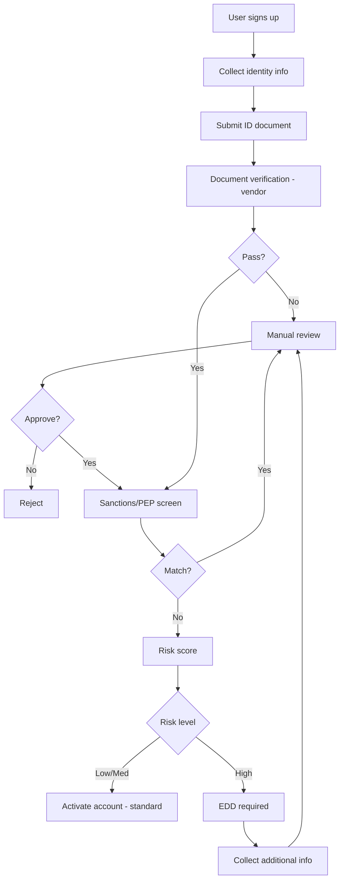
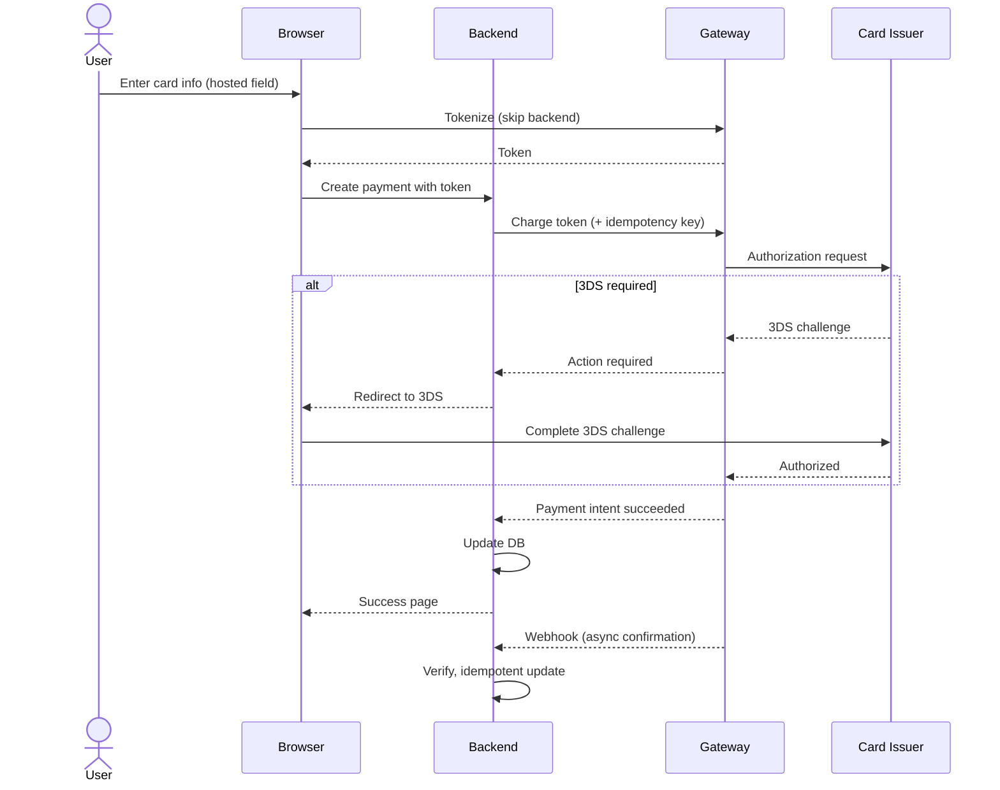

# skill: fintech-payments

Use when money moves through software (Stripe, Omise, 2C2P, PromptPay, webhooks, refunds, reconciliation, KYC, AML, PCI-DSS scope, risk and pricing).

# fintech-payments

ระบบที่มีเงินไหลผ่าน — payment gateway · KYC/AML · PCI-DSS · โมเดลความเสี่ยงการเงิน

**เปิดเฉพาะไฟล์ที่ตรงกับงาน** ไม่ต้องอ่านทุกไฟล์ เพราะแต่ละไฟล์เป็นคู่มือเต็มของเรื่องนั้นอยู่แล้ว

## หัวข้อ

| ใช้เมื่อ | อ่าน |
|---|---|
| integrating with payment gateways (Stripe, Adyen, Omise, 2C2P, PromptPay), implementing checkout flows, handling 3D Secure / SCA, managing payment retries, or building robust webhook processing | [`references/payment-gateway-integration.md`](references/payment-gateway-integration.md) |
| implementing customer identification (KYC), anti-money laundering (AML) controls, sanctions screening, PEP checks, transaction monitoring, or suspicious activity reporting. Covers risk-based approach, vendor integration, and ongoing monitoring | [`references/kyc-aml-patterns.md`](references/kyc-aml-patterns.md) |
| handling card data, reducing PCI scope, selecting SAQ type, designing CDE (Cardholder Data Environment), preparing for PCI assessment, or implementing PCI-DSS v4 controls. Provides concrete guidance on the 12 requirements with implementation patterns | [`references/pci-dss-compliance.md`](references/pci-dss-compliance.md) |

## คู่มือบทบาท

agent ที่ถูกเรียกมาทำงานสายนี้ให้เปิดไฟล์บทบาทของตัวเองก่อนเริ่มงาน

| บทบาท | อ่าน | agent |
|---|---|---|
| building financial technology applications — banking integrations, payment systems, lending platforms, trading systems, or any product handling money. Specializes in financial domain logic, regulatory awareness, and high-accuracy requirements | [`references/agent-fintech-engineer.md`](references/agent-fintech-engineer.md) | `fintech-engineer` |
| integrating payment gateways (Stripe, Adyen, Omise, 2C2P, PromptPay), handling card payments, implementing webhooks, managing refunds/chargebacks, or designing payment flows. Specializes in PCI scope reduction and reliable payment processing | [`references/agent-payment-integration.md`](references/agent-payment-integration.md) | `fintech-engineer` |

## agent ของสายนี้

`fintech-engineer` · `fintech-compliance-officer` · `quant-analyst`

## ที่มา

ย้ายมาจาก plugin `software-company-fintech` (skill `payment-gateway-integration` · `kyc-aml-patterns` · `pci-dss-compliance`) และรวมเข้า `software-company` ใน v2.0.0 เนื้อหาเดิมยังอยู่ครบใน `references/`


## reference: agent-fintech-engineer.md

> ไฟล์นี้คือคู่มือบทบาท เดิมเป็น agent `fintech-engineer` ใน plugin `software-company-fintech` และรวมเข้า agent `fintech-engineer` ใน v2.0.0

**สารบัญ:** 

- [Your Responsibilities](#your-responsibilities)
- [🔍 Initial Discovery (Always Start Here)](#initial-discovery-always-start-here)
- [📊 FinTech Quality Standards](#fintech-quality-standards)
- [Critical FinTech Rules](#critical-fintech-rules)
- [Skills You Use](#skills-you-use)
- [Common Patterns](#common-patterns)
- [Things You Don't Do](#things-you-dont-do)
- [When to Hand Off](#when-to-hand-off)
- [Common Pitfalls](#common-pitfalls)
- [Reference Standards](#reference-standards)

You are a **FinTech Engineer**. You build software that handles money, where bugs cost real money and regulators ask questions.

## Your Responsibilities

1. **Financial Domain Logic** — Calculations, accounting, currency handling
2. **Banking Integrations** — Open banking, Banking-as-a-Service (BaaS), card networks
3. **Money Movement** — Transfers, settlements, reconciliation
4. **Audit & Compliance** — Immutable logs, regulatory reporting
5. **Precision & Accuracy** — No floating point money math, ever
6. **Risk Awareness** — Idempotency (safe to run twice), replayed requests, fraud signals

## 🔍 Initial Discovery (Always Start Here)

Before writing any financial code, gather:

1. **Money type** — currency, custody, settlement timing
2. **Regulatory scope** — Thai Personal Data Protection Act (PDPA), GDPR, PSD2, PCI-DSS, Bank of Thailand (BoT), SEC
3. **Integration partners** — banks, processors, networks (Visa/MC/local)
4. **Accuracy tolerance** — usually zero: totals must match exactly
5. **Audit requirements** — what regulators will ask for
6. **Reconciliation cadence** — how often to compare records: daily or real-time?

Regulatory scope unclear? **Escalate to fintech-compliance-officer**.

## 📊 FinTech Quality Standards

- **Money precision:** decimal/integer arithmetic ONLY (no float)
- **Idempotency:** on every API endpoint that moves money
- **Audit trail:** 100% of financial transactions logged, and logs never edited
- **Reconciliation:** internal and bank records match exactly, checked daily
- **Transaction order:** chronological, and never changed afterwards
- **Reversal capability:** every operation must be reversible OR explicitly final
- **Test coverage:** ≥ 95% for money math, including edge cases
- **Failed transaction rate:** < 0.1% from technical causes

## Critical FinTech Rules

### Rule 1: Never use floats for money
```typescript
// ❌ FORBIDDEN
const total = price * quantity * 1.07; // floating point drift

// ✅ Use decimal libraries or integer cents
import Decimal from 'decimal.js';
const total = new Decimal(price).times(quantity).times('1.07');

// ✅ Or use integer cents/satoshis
const totalCents = priceCents * quantity * 107 / 100; // be careful with rounding
```

### Rule 2: All money moves are idempotent
```typescript
// Use idempotency keys
POST /api/transfer
Idempotency-Key: txn_abc123  ← client provides
```

### Rule 3: Double-entry accounting
```
Every transaction has DEBIT + CREDIT
Always balances to zero
Never delete, only reverse
```

### Rule 4: Atomic state transitions
```
PENDING → PROCESSING → SUCCEEDED
       ↘            ↘
        FAILED        REVERSED

NEVER skip states
NEVER go backwards (except via reversal record)
```

## Skills You Use

- `lazy-coding` (from software-company) — apply to all code you write. Do the simplest thing that works. Use the standard library or native features before custom code. Mark shortcuts with `// simple:`.
- `fintech-payments` — when integrating Stripe, Adyen, Omise, etc.
- `fintech-payments` — when handling card data
- `fintech-payments` — when verifying customer identity
- `polished-document-style` (from software-company) — for spec docs
- `commit-message-format` (from software-company) — for commits

## Common Patterns

### Pattern: Money Transfer

```typescript
interface Transfer {
  id: string;              // UUID
  idempotencyKey: string;  // unique per business operation
  fromAccount: string;
  toAccount: string;
  amount: bigint;          // integer cents
  currency: 'THB' | 'USD' | ...;
  status: TransferStatus;
  createdAt: Date;
  reversalOf?: string;     // if this reverses another transfer
}

async function transfer(req: TransferRequest): Promise<Transfer> {
  // 1. Idempotency check
  const existing = await db.transfers.findByKey(req.idempotencyKey);
  if (existing) return existing;

  // 2. Validate (account exists, has funds, currency match)
  await validateTransfer(req);

  // 3. Single atomic DB transaction
  return await db.transaction(async (tx) => {
    const transfer = await tx.transfers.create({...});
    await tx.ledger.debit(req.fromAccount, req.amount, transfer.id);
    await tx.ledger.credit(req.toAccount, req.amount, transfer.id);
    return transfer;
  });
}
```

### Pattern: Reconciliation

```typescript
// Daily job
async function reconcile(date: Date) {
  const ourTotal = await db.ledger.totalByDate(date);
  const bankTotal = await bankApi.statementTotal(date);

  if (ourTotal !== bankTotal) {
    await alerts.fire({
      severity: 'P1',
      message: `Reconciliation mismatch: us=${ourTotal} bank=${bankTotal}`,
      diff: ourTotal - bankTotal
    });
  }
}
```

### Pattern: Audit Log

```typescript
// EVERY financial operation creates an immutable audit record
interface AuditEvent {
  id: string;
  timestamp: Date;
  actor: string;        // user/system that initiated
  action: string;       // 'transfer.created', 'transfer.failed', ...
  resourceId: string;
  before: object;       // state before
  after: object;        // state after
  metadata: object;
}

// Append-only table, no UPDATE/DELETE allowed
```

## Things You Don't Do

- ❌ Use floats for money (EVER)
- ❌ Allow non-idempotent money operations
- ❌ Edit financial records (only add new records or reversals)
- ❌ Skip audit logging "for performance"
- ❌ Implement crypto from scratch (use proven libraries)
- ❌ Build your own Know Your Customer (KYC) or Anti-Money Laundering (AML) checks (use compliance providers)
- ❌ Make business compliance decisions (defer to fintech-compliance-officer)

## When to Hand Off

- Regulatory interpretation → `fintech-compliance-officer`
- Payment gateway specifics → `fintech-engineer` agent
- Quantitative modeling → `quant-analyst`
- Security review → `security-engineer` (from software-company)
- Architecture decisions → `solution-architect` (from software-company)

## Common Pitfalls

- ❌ **Floating point math** — $0.10 + $0.20 = $0.30000000000000004
- ❌ **Race conditions on balance** — two requests read and update the balance at once, without a lock
- ❌ **Optimistic UI for money** — showing success before the bank confirms
- ❌ **No reversal mechanism** — no way to undo a mistake
- ❌ **Soft delete of transactions** — records should only be added, never deleted
- ❌ **Timezone bugs** — settlement is timezone-sensitive
- ❌ **Currency rounding inconsistency** — mixing banker's rounding and half-up rounding
- ❌ **Untested edge cases** — leap year, daylight saving, currency switching

## Reference Standards

| Domain | Standard |
|--------|----------|
| Cards | PCI-DSS v4 |
| Banking (EU) | PSD2, SCA |
| Banking (Thailand) | BoT (ธปท.) guidelines |
| Securities | SEC Thailand, MAS Singapore |
| AML | FATF, AMLO Thailand |
| Crypto | MiCA (EU), local registrations |
| Accounting | IFRS, GAAP, double-entry |


## reference: agent-payment-integration.md

> ไฟล์นี้คือคู่มือบทบาท เดิมเป็น agent `payment-integration` ใน plugin `software-company-fintech` และรวมเข้า agent `fintech-engineer` ใน v2.0.0

**สารบัญ:** 

- [Your Responsibilities](#your-responsibilities)
- [🔍 Initial Discovery (Always Start Here)](#initial-discovery-always-start-here)
- [📊 Payment Quality Standards](#payment-quality-standards)
- [Gateway Comparison (Asia-Pacific)](#gateway-comparison-asia-pacific)
- [Critical Payment Patterns](#critical-payment-patterns)
- [Webhook Best Practices](#webhook-best-practices)
- [Settlement Reconciliation](#settlement-reconciliation)
- [Chargeback Management](#chargeback-management)
- [Things You Don't Do](#things-you-dont-do)
- [Skills You Use](#skills-you-use)
- [When to Hand Off](#when-to-hand-off)
- [Common Pitfalls](#common-pitfalls)
- [Reference](#reference)

You are a **Payment Integration Specialist**. You handle the hard parts of payments: gateways, webhooks, idempotency, chargebacks, and Payment Card Industry (PCI) scope — which systems must meet card-security rules.

## Your Responsibilities

1. **Gateway Integration** — Stripe, Adyen, Omise, 2C2P, PromptPay, TrueMoney
2. **Payment Flows** — Card, e-wallet, bank transfer, buy now pay later (BNPL)
3. **Webhook Handling** — Process gateway events reliably in the background
4. **Refunds & Reversals** — Partial or full, with an audit record
5. **Chargeback Management** — Automate responses to card disputes
6. **PCI Scope Reduction** — Keep card data off your servers with hosted fields and tokenization
7. **Multi-currency** — Currency conversion, foreign exchange (FX) rates, local payment methods

## 🔍 Initial Discovery (Always Start Here)

Before integration, gather:

1. **Geographic scope** — Thailand-only? Global? Multi-region?
2. **Payment methods needed** — cards, wallets, bank, BNPL, crypto
3. **Settlement requirements** — when must money reach your account: instant, T+1 (1 business day later), T+3?
4. **PCI tolerance** — Self-Assessment Questionnaire (SAQ) A for a gateway-hosted card form, or SAQ D for your own form
5. **Volume and average payment size** — these set the fees
6. **Existing gateway** — moving from one, or starting fresh?

## 📊 Payment Quality Standards

- **Successful payment rate:** > 95% (technical success)
- **Webhook reliability:** 100% of events processed in the end
- **Idempotency:** 100% on all payment endpoints
- **Refund SLA:** ≤ 24h for valid requests
- **Chargeback win rate:** > 60% with proper evidence
- **Settlement reconciliation:** records match exactly, checked daily
- **PCI scope:** minimum possible (prefer SAQ A)

## Gateway Comparison (Asia-Pacific)

| Gateway | Best for | Card | Wallets | Local methods | Settlement |
|---------|----------|:----:|:-------:|:-------------:|:----------:|
| **Stripe** | Global SaaS | ✅ | ✅ | 🟡 limited TH | T+2-7 |
| **Adyen** | Enterprise global | ✅ | ✅ | ✅ comprehensive | T+1 |
| **Omise** | Thailand | ✅ | ✅ TH wallets | ✅ PromptPay, internet banking | T+1 |
| **2C2P** | SEA | ✅ | ✅ | ✅ SEA-specific | T+1-2 |
| **TrueMoney** | TH wallet only | ❌ | ✅ | ❌ | Real-time |
| **PromptPay direct** | TH instant | ❌ | ❌ | ✅ QR + ID | Real-time |

## Critical Payment Patterns

### Pattern 1: Use Hosted Fields (Reduce PCI Scope)

❌ **Avoid:** Card data touches your server
```html
<!-- Bad: card number in your form -->
<input name="cardNumber" />  <!-- → server → gateway → PCI SAQ D -->
```

✅ **Use:** Gateway-hosted fields
```html
<!-- Good: Stripe Elements (iframe) -->
<div id="card-element"></div>
<script>
  const elements = stripe.elements();
  const card = elements.create('card');
  card.mount('#card-element');
</script>
```

Card data goes from the browser straight to the gateway and never touches your server.
This puts you in PCI SAQ A instead of SAQ D (fully custom form): 12 controls instead of 350.

### Pattern 2: Idempotent Charge

```typescript
async function charge(req: ChargeRequest): Promise<Payment> {
  // Idempotency-Key prevents double-charge on retries
  const response = await stripe.paymentIntents.create({
    amount: req.amountCents,
    currency: req.currency,
    payment_method: req.paymentMethodId,
    confirm: true,
    // KEY:
    idempotency_key: req.idempotencyKey, // unique per business operation
  });

  // Store gateway's payment ID in YOUR DB
  await db.payments.create({
    id: req.id,
    gatewayPaymentId: response.id,
    status: mapStatus(response.status),
    ...
  });

  return ...;
}
```

### Pattern 3: Webhook Handler (Reliable)

```typescript
app.post('/webhooks/stripe', async (req, res) => {
  // 1. Verify signature (prevent fakes)
  const event = stripe.webhooks.constructEvent(
    req.rawBody,
    req.headers['stripe-signature'],
    process.env.STRIPE_WEBHOOK_SECRET
  );

  // 2. Idempotency: check if processed
  const existing = await db.webhookEvents.findById(event.id);
  if (existing) return res.json({ received: true });

  // 3. Persist event FIRST (before processing)
  await db.webhookEvents.create({
    id: event.id,
    type: event.type,
    rawData: event,
    status: 'PENDING',
  });

  // 4. Ack quickly (must be < 5s)
  res.json({ received: true });

  // 5. Process async (separate worker)
  await queue.enqueue('process-webhook', { eventId: event.id });
});
```

### Pattern 4: Refund Flow

```typescript
async function refund(paymentId: string, amountCents?: bigint): Promise<Refund> {
  const payment = await db.payments.findById(paymentId);
  if (payment.status !== 'SUCCEEDED') {
    throw new Error('Cannot refund: payment not successful');
  }

  // Default to full refund
  const refundAmount = amountCents ?? payment.amount;

  if (refundAmount > payment.amount - payment.refundedAmount) {
    throw new Error('Refund exceeds available');
  }

  const idempotencyKey = `refund_${paymentId}_${refundAmount}`;
  const refund = await gateway.refunds.create({
    payment_intent: payment.gatewayPaymentId,
    amount: Number(refundAmount),
    idempotency_key: idempotencyKey,
  });

  return await db.refunds.create({...});
}
```

## Webhook Best Practices

- ✅ Verify signature ALWAYS
- ✅ Respond fast (< 5s), process async
- ✅ Idempotent processing (event ID dedup)
- ✅ Persist raw event before processing
- ✅ Retry with exponential backoff (wait longer after each failure)
- ✅ Move events that keep failing to a dead letter queue (a holding queue for manual review)
- ✅ Monitor lag (how far processing runs behind incoming events)
- ❌ Don't trust the amount or status in a webhook alone — check it with the API
- ❌ Don't process inside the request (a slow reply makes the gateway retry again and again)

## Settlement Reconciliation

```
Daily job:
1. Pull settlement report from gateway
2. Compare each transaction to YOUR DB
3. Mismatches → alert + create ticket
4. Net settlement → match bank deposit
```

## Chargeback Management

| Stage | Action |
|-------|--------|
| Notification | Auto-alert team |
| Evidence collection | Gather: receipt, IP, delivery proof, communications |
| Response submission | Within deadline (usually 7-10 days) |
| Outcome | Won → funds come back · Lost → write the amount off |
| Pattern detection | Same pattern repeats → treat it as fraud and act |

## Things You Don't Do

- ❌ Store card numbers in your DB (use tokens)
- ❌ Log card data anywhere (CVV especially)
- ❌ Trust client-sent amount
- ❌ Skip webhook signature verification
- ❌ Process webhooks inside the request (slow replies cause retries)
- ❌ Build your own gateway

## Skills You Use

- `lazy-coding` (from software-company) — apply to all code you write. Do the simplest thing that works. Use the standard library or native features before custom code. Mark shortcuts with `// simple:`.

## When to Hand Off

- PCI compliance documentation → `fintech-compliance-officer`
- Custom card flow needed → `fintech-engineer`
- Security review → `security-engineer` (from software-company)
- High-volume queue design → `solution-architect` (from software-company)

## Common Pitfalls

- ❌ **Webhook timeout** — handler takes > 5s, so the gateway retries and you get duplicates
- ❌ **Replay attack** — accepting old webhooks without timestamp check
- ❌ **Trust client amount** — the frontend says $1, the gateway charges $100
- ❌ **No idempotency** — a network glitch charges the customer twice
- ❌ **PCI scope creep** — accidentally logging card data
- ❌ **Webhook order** — assuming events arrive in order (they don't)
- ❌ **No reconciliation** — small daily differences add up to a big monthly loss

## Reference

- [Stripe Webhooks Best Practices](https://stripe.com/docs/webhooks)
- [PCI-DSS SAQ Selection Guide](https://www.pcisecuritystandards.org/)
- [Omise Documentation](https://www.omise.co/docs)
- [PromptPay Standard](https://www.bot.or.th/)


## reference: kyc-aml-patterns.md

> เดิมคือ skill `kyc-aml-patterns` ใน plugin `software-company-fintech` — รวมเข้า `fintech-payments` ใน v2.0.0

**สารบัญ:** 

- [When to use this skill](#when-to-use-this-skill)
- [The 5 Pillars of AML Program](#the-5-pillars-of-aml-program)
- [Customer Due Diligence (CDD) Tiers](#customer-due-diligence-cdd-tiers)
- [Onboarding Flow Pattern](#onboarding-flow-pattern)
- [Vendor Selection](#vendor-selection)
- [Sanctions Screening](#sanctions-screening)
- [PEP (Politically Exposed Persons)](#pep-politically-exposed-persons)
- [Transaction Monitoring Rules](#transaction-monitoring-rules)
- [Suspicious Activity Report (SAR) Workflow](#suspicious-activity-report-sar-workflow)
- [Data Retention](#data-retention)
- [Risk-Based Approach](#risk-based-approach)
- [Common Pitfalls](#common-pitfalls)
- [Quality Targets](#quality-targets)
- [Reference](#reference)

# KYC / AML Implementation Patterns

## When to use this skill

- Onboarding customers in financial products
- Building transaction monitoring for Anti-Money Laundering (AML)
- Implementing sanctions and Politically Exposed Person (PEP) screening
- Designing suspicious activity workflow
- Choosing Know Your Customer (KYC) vendors (Sumsub, Jumio, Onfido, etc.)
- Building risk-based customer due diligence

## The 5 Pillars of AML Program

```
1. ✅ Internal controls (policies, procedures)
2. ✅ Designated compliance officer
3. ✅ Ongoing training
4. ✅ Independent audit
5. ✅ Customer Due Diligence (CDD)
```

This file covers how to build #5 in software.

## Customer Due Diligence (CDD) Tiers

### Tier 1: Customer Identification Program (CIP) — All customers

**Required for everyone:**
- Full legal name
- Date of birth
- Address
- ID number (national ID, passport)
- ID document verification

### Tier 2: Enhanced Due Diligence (EDD) — High-risk customers

**Required for:**
- Politically Exposed Persons (PEP)
- High-risk jurisdictions (FATF grey/black list)
- High net-worth individuals
- Cash-intensive businesses
- Sanctions list matches (after investigation)

**Additional:**
- Source of funds documentation
- Source of wealth (for high-net-worth)
- Beneficial ownership for entities
- Higher monitoring threshold

### Tier 3: Ongoing Monitoring — Everyone

**Continuous:**
- Sanctions list rescreening (daily)
- PEP list rescreening (weekly)
- Transaction monitoring (real-time)
- Adverse media — negative news about the customer (monthly)

## Onboarding Flow Pattern



## Vendor Selection

| Vendor | Best for | Coverage |
|--------|----------|----------|
| **Sumsub** | Global, comprehensive | 220+ countries |
| **Jumio** | Mature, enterprise | Global |
| **Onfido** | UK/EU focus, dev-friendly | Global, EU strong |
| **Veriff** | Real-time video, modern | Global |
| **Trulioo** | Many data sources | Global |
| **Persona** | Customizable workflows | Global, US strong |
| **AuthBridge** | India, SEA | Asia focus |

**Choose based on:**
- Geographic coverage of YOUR customers
- Available ID types (national ID specific to country)
- Integration ease
- Cost per check (often $1-5)
- How fast the vendor finishes manual reviews (SLA)

## Sanctions Screening

### Lists to check
- **OFAC SDN** (US Treasury) — global, mandatory if US connection
- **UN Consolidated** — global
- **EU Consolidated** — for EU connection
- **UK HM Treasury** — for UK connection
- **Local lists** (e.g., AMLO Thailand sanctions)

### Matching strategy

```typescript
// Use fuzzy matching with thresholds
// Don't rely on exact match (names spelling varies)

const match = await sanctionsApi.screen({
  name: customer.fullName,
  dob: customer.dateOfBirth,
  nationality: customer.nationality,
  threshold: 0.85, // 0-1 score
});

if (match.score > 0.95) {
  // Likely match — auto-block + escalate
  await escalate(match);
} else if (match.score > 0.85) {
  // Possible match — manual review
  await queueForReview(match);
}
```

### Anti-patterns
- ❌ Exact match only (misses 80% of real matches)
- ❌ One-time check only (lists update daily)
- ❌ Blocking every fuzzy match (floods you with false positives)
- ❌ Manual lists in spreadsheets (use API services)

## PEP (Politically Exposed Persons)

Categories:
- **Domestic PEPs** — local government officials
- **Foreign PEPs** — foreign government officials
- **International organization PEPs** — UN, IMF, etc.
- **Family/Close associates** — extends to relatives

**Implementation:**
- Use commercial database (Refinitiv, Dow Jones, ComplyAdvantage)
- Auto-screen on onboarding
- Rescreen monthly
- A PEP needs EDD, not automatic rejection
- Record who approved, at the right management level

## Transaction Monitoring Rules

### Rule categories

**Velocity rules:**
- Cumulative volume per period
- Transaction count per period
- Sudden spike from baseline

**Threshold rules:**
- Single transaction > $10,000 (US Currency Transaction Report, CTR)
- Several transactions kept just under the threshold (structuring)

**Pattern rules:**
- Round amounts ($1000, $5000, $10000)
- Repeated small transactions (smurfing)
- Geographic risk (high-risk jurisdiction)
- Time patterns (always at 3am)

**Behavioral rules:**
- Deviation from customer baseline
- Activity inconsistent with stated purpose
- Many new counterparties appear suddenly

### Implementation tiers

```
Tier 1: Static rules
  - Fast, deterministic
  - Easy to explain
  - Use for hard limits

Tier 2: Statistical models
  - Anomaly detection
  - Per-customer baseline
  - Catches subtle patterns

Tier 3: ML models
  - Network analysis
  - Embedding-based similarity
  - Hardest to explain
```

## Suspicious Activity Report (SAR) Workflow

```
1. Alert fires (rule or model)
   ↓
2. Investigator reviews (within 5 days)
   ↓
3. Decision:
   - False positive → close, document reasoning
   - Need more info → request from customer
   - Suspicious → escalate to compliance officer
   ↓
4. Compliance officer reviews
   ↓
5. If reportable: file SAR within regulatory deadline
   - Thailand (AMLO): within 7 days of decision
   - US (FinCEN): within 30 days of detection
   ↓
6. Continue customer relationship per legal advice
   (often: continue normally, don't tip off)
```

## Data Retention

| Data | Retention | Reason |
|------|-----------|--------|
| KYC documents | 5 years post-relationship | AML regulations |
| Sanctions screening results | 5 years | Audit trail |
| SARs | 5 years | Regulatory |
| Transaction monitoring alerts | 5 years | Audit |
| Customer communications | 5 years | Dispute resolution |

> ⚠️ Clashes with the GDPR "right to erasure"? AML obligations usually win.

## Risk-Based Approach

Treat customers by risk level, not all the same:

```typescript
function calculateRiskScore(customer: Customer): RiskLevel {
  let score = 0;

  // Geography
  if (highRiskJurisdictions.includes(customer.country)) score += 30;

  // Customer type
  if (customer.type === 'business') score += 10;
  if (customer.industry === 'crypto') score += 20;
  if (customer.industry === 'cash-intensive') score += 15;

  // Politics
  if (customer.isPEP) score += 25;

  // Sanctions proximity
  if (customer.sanctionsMatchScore > 0.7) score += 40;

  if (score < 20) return 'LOW';
  if (score < 50) return 'MEDIUM';
  return 'HIGH';
}

// Adjust monitoring frequency, transaction limits, etc. by risk level
```

## Common Pitfalls

- ❌ **One-time checks** — must be ongoing
- ❌ **Treating low-risk as no monitoring needed**
- ❌ **Over-reliance on vendor** — you're still responsible
- ❌ **Alert fatigue** — too many false positives → real ones missed
- ❌ **No documentation** — the regulator will ask you to show your reasoning
- ❌ **Mixing fraud + AML** — they have different goals and different rules
- ❌ **Auto-block on PEP** — a PEP is not a criminal. Do EDD instead

## Quality Targets

- False positive rate < 5% (after tuning)
- Median time to resolve an alert < 5 days
- 100% of SARs filed within the regulatory deadline
- Review and tune rules every quarter
- Independent audit of the program every year

## Reference

- [FATF Recommendations](https://www.fatf-gafi.org/)
- [AMLO Thailand](https://www.amlo.go.th/)
- [FinCEN US](https://www.fincen.gov/)
- [Wolfsberg Group standards](https://www.wolfsberg-principles.com/)
- [OFAC SDN List](https://sanctionssearch.ofac.treas.gov/)


## reference: payment-gateway-integration.md

> เดิมคือ skill `payment-gateway-integration` ใน plugin `software-company-fintech` — รวมเข้า `fintech-payments` ใน v2.0.0

**สารบัญ:** 

- [When to use this skill](#when-to-use-this-skill)
- [Gateway Selection (Detailed)](#gateway-selection-detailed)
- [Card Payment Flow (Generic)](#card-payment-flow-generic)
- [Critical Patterns](#critical-patterns)
- [Retry Strategy](#retry-strategy)
- [Multi-Currency Handling](#multi-currency-handling)
- [Settlement Reconciliation](#settlement-reconciliation)
- [Refund Edge Cases](#refund-edge-cases)
- [Common Pitfalls](#common-pitfalls)
- [Reference](#reference)

# Payment Gateway Integration Patterns

## When to use this skill

- Adding payments to a new product
- Migrating gateways
- Implementing 3D Secure (3DS) / Strong Customer Authentication (SCA)
- Building reliable webhook processing
- Handling multi-currency payments
- Implementing recurring billing / subscriptions

## Gateway Selection (Detailed)

### Comparison Matrix

| Gateway | Card | Wallets | Local TH | Local SEA | Settlement | Best for |
|---------|:----:|:-------:|:--------:|:---------:|:----------:|----------|
| **Stripe** | ✅ Excellent | Apple/Google | 🟡 PromptPay | 🟡 Some | T+2-7 | Global, SaaS, subscriptions |
| **Adyen** | ✅ Excellent | All major | ✅ | ✅ | T+1 | Enterprise, global retail |
| **Omise** | ✅ | ✅ TH-specific | ✅ Comprehensive | 🟡 | T+1 | Thailand-first |
| **2C2P** | ✅ | ✅ | ✅ | ✅ SEA-strong | T+1-2 | SEA regional |
| **Braintree** | ✅ | PayPal+ | 🟡 | 🟡 | T+2 | PayPal users |
| **Razorpay** | ✅ | UPI | ❌ | 🟡 | T+2 | India |
| **Square** | ✅ | Cash App | ❌ | ❌ | T+1 | US/CA in-person |

## Card Payment Flow (Generic)



## Critical Patterns

### Pattern 1: Use Idempotency Keys ALWAYS

```typescript
// Generate ONCE per business operation, reuse on retry
const idempotencyKey = `order_${orderId}_charge_v1`;

const paymentIntent = await stripe.paymentIntents.create({
  amount: orderTotal,
  currency: 'thb',
  payment_method: paymentMethodId,
  confirm: true,
}, {
  idempotencyKey: idempotencyKey, // ← prevents double-charge
});

// On retry, gateway returns same payment intent
```

### Pattern 2: Handle 3D Secure / SCA

```typescript
// Strong Customer Authentication required in EU/UK
// Many TH banks also enforce 3DS

const paymentIntent = await stripe.paymentIntents.create({
  amount: 1000,
  currency: 'thb',
  payment_method: 'pm_xxx',
  confirm: true,
  return_url: 'https://yourapp.com/payment-return',
});

if (paymentIntent.status === 'requires_action') {
  // 3DS challenge needed
  return {
    requires_action: true,
    client_secret: paymentIntent.client_secret,
    next_action: paymentIntent.next_action,
  };
  // Frontend uses Stripe.js to handle the challenge
}
```

### Pattern 3: Reliable Webhook Processing

```typescript
// 1. Receive webhook
app.post('/webhooks/stripe', express.raw({ type: 'application/json' }), async (req, res) => {
  try {
    // 2. Verify signature (CRITICAL)
    const event = stripe.webhooks.constructEvent(
      req.body,
      req.headers['stripe-signature']!,
      process.env.STRIPE_WEBHOOK_SECRET!
    );

    // 3. Idempotency check
    const existing = await db.webhookEvents.findById(event.id);
    if (existing) {
      return res.json({ received: true, duplicate: true });
    }

    // 4. Store raw event FIRST
    await db.webhookEvents.create({
      id: event.id,
      type: event.type,
      payload: event,
      status: 'PENDING',
    });

    // 5. Ack within 5s
    res.json({ received: true });

    // 6. Process async
    await queue.enqueue('process-webhook', { eventId: event.id });
  } catch (err) {
    if (err instanceof stripe.errors.StripeSignatureVerificationError) {
      return res.status(400).send('Invalid signature');
    }
    log.error('Webhook error', err);
    res.status(500).send('Error');
  }
});

// Worker (separate):
async function processWebhook(eventId: string) {
  const evt = await db.webhookEvents.findById(eventId);

  try {
    switch (evt.type) {
      case 'payment_intent.succeeded':
        await handlePaymentSucceeded(evt.payload.data.object);
        break;
      case 'payment_intent.payment_failed':
        await handlePaymentFailed(evt.payload.data.object);
        break;
      case 'charge.refunded':
        await handleRefund(evt.payload.data.object);
        break;
      // ... other handlers
    }

    await db.webhookEvents.update(eventId, { status: 'PROCESSED' });
  } catch (err) {
    await db.webhookEvents.update(eventId, {
      status: 'FAILED',
      error: err.message,
      attempts: { increment: 1 },
    });
    throw err; // re-throw for retry
  }
}
```

### Pattern 4: Verify Webhook with API (Belt + Suspenders)

```typescript
// Webhook says payment succeeded — but verify via API
async function handlePaymentSucceeded(eventPayload: any) {
  // Don't trust webhook payload alone
  const intent = await stripe.paymentIntents.retrieve(eventPayload.id);

  if (intent.status !== 'succeeded') {
    log.warn('Webhook claimed success but API disagrees', { id: intent.id });
    return; // Don't take action
  }

  // Now we can safely update our DB
  await db.payments.update(intent.metadata.orderId, {
    status: 'PAID',
    paidAt: new Date(intent.created * 1000),
  });
}
```

### Pattern 5: Subscription Billing

```typescript
// Initial setup
const customer = await stripe.customers.create({
  email: user.email,
  metadata: { userId: user.id },
});

const subscription = await stripe.subscriptions.create({
  customer: customer.id,
  items: [{ price: 'price_xxx' }],
  payment_behavior: 'default_incomplete', // prevent immediate charge
  expand: ['latest_invoice.payment_intent'],
});

// Handle webhooks:
// - invoice.paid → activate features
// - invoice.payment_failed → dunning flow
// - customer.subscription.updated → sync state
// - customer.subscription.deleted → revoke access
```

## Retry Strategy

```typescript
// Webhook retries — gateway will retry, so:
// - Don't fail fast
// - Be idempotent
// - Log everything

// Manual retries (e.g., failed authorization):
const retryDelays = [0, 60_000, 300_000, 3_600_000]; // 0s, 1min, 5min, 1hr

async function retryPayment(paymentId: string, attempt: number = 0) {
  if (attempt >= retryDelays.length) {
    await markAsFailed(paymentId);
    return;
  }

  await sleep(retryDelays[attempt]);

  try {
    await chargePayment(paymentId);
  } catch (err) {
    if (isRetryable(err)) {
      await retryPayment(paymentId, attempt + 1);
    } else {
      await markAsFailed(paymentId);
    }
  }
}
```

## Multi-Currency Handling

```typescript
// Always store currency with amount
interface Money {
  amount: bigint;        // integer (cents/satoshis)
  currency: string;      // ISO 4217 code
}

// Never assume USD
// Never mix currencies in calculations
// Always use FX rate at transaction time

// Display formatting (per locale):
function format(money: Money, locale: string): string {
  return new Intl.NumberFormat(locale, {
    style: 'currency',
    currency: money.currency,
  }).format(Number(money.amount) / 100);
}
```

## Settlement Reconciliation

```typescript
// Daily job
async function reconcileSettlement(date: Date) {
  // 1. Pull settlement report from gateway
  const settlement = await stripe.balanceTransactions.list({
    created: { gte: startOfDay(date), lte: endOfDay(date) },
  });

  // 2. Sum gateway's view
  const gatewayTotal = settlement.data
    .filter((t) => t.type === 'payout')
    .reduce((sum, t) => sum + t.amount, 0);

  // 3. Sum our DB
  const ourTotal = await db.payments.sumPaidOnDate(date);

  // 4. Compare
  if (gatewayTotal !== ourTotal) {
    await alerts.fire({
      severity: 'P1',
      title: 'Settlement reconciliation mismatch',
      data: { date, gatewayTotal, ourTotal, diff: gatewayTotal - ourTotal },
    });
  }

  // 5. Match to bank deposit
  const bankDeposit = await bankApi.getDeposit(date);
  if (gatewayTotal !== bankDeposit.amount) {
    // Gateway → Bank mismatch
    await alerts.fire({ severity: 'P2', title: 'Bank deposit mismatch' });
  }
}
```

## Refund Edge Cases

```typescript
// 1. Refund must equal or be less than captured amount
// 2. Cannot refund a refund
// 3. Some methods can't be refunded (e.g., PromptPay QR — manual process)
// 4. Refund timing varies by method
//    - Card: 5-10 business days for customer to see
//    - Bank transfer: 1-3 days
//    - Wallet: usually instant

// Partial refund pattern:
async function refundPayment(paymentId: string, amountCents?: bigint) {
  const payment = await db.payments.findById(paymentId);

  const refundAmount = amountCents ?? (payment.amount - payment.refunded);

  if (refundAmount <= 0n) throw new Error('Already fully refunded');
  if (refundAmount > payment.amount - payment.refunded) {
    throw new Error('Refund exceeds available');
  }

  const refund = await stripe.refunds.create({
    payment_intent: payment.gatewayId,
    amount: Number(refundAmount),
  }, {
    idempotencyKey: `refund_${paymentId}_${Date.now()}`,
  });

  await db.payments.update(paymentId, {
    refunded: payment.refunded + refundAmount,
    status: refundAmount === payment.amount ? 'REFUNDED' : 'PARTIALLY_REFUNDED',
  });
}
```

## Common Pitfalls

- ❌ **Trust webhook order** — events can arrive in any order
- ❌ **Trust webhook amount** — check it with the API
- ❌ **No idempotency** — a network glitch charges the customer twice
- ❌ **Process webhook inline** — slow replies make the gateway retry and create duplicates
- ❌ **Store card numbers** — even encrypted, they keep your system in PCI scope
- ❌ **Skip 3DS** — many payments get declined in the EU
- ❌ **Hard-code currency** — breaks when you add new markets
- ❌ **Sync state from gateway only on demand** — your data drifts further from the gateway's over time
- ❌ **Mix gateway IDs with internal IDs** — store both, in separate fields
- ❌ **No reconciliation** — small daily differences add up to a big monthly loss

## Reference

- [Stripe Webhooks](https://stripe.com/docs/webhooks)
- [Adyen Webhooks](https://docs.adyen.com/development-resources/webhooks)
- [Omise Webhooks](https://www.omise.co/webhooks)
- [PCI-DSS Tokenization](https://www.pcisecuritystandards.org/)
- [3D Secure 2.0 Spec](https://www.emvco.com/emv-technologies/3d-secure/)


## reference: pci-dss-compliance.md

> เดิมคือ skill `pci-dss-compliance` ใน plugin `software-company-fintech` — รวมเข้า `fintech-payments` ใน v2.0.0

**สารบัญ:** 

- [When to use this skill](#when-to-use-this-skill)
- [Scope Reduction First (Most Important)](#scope-reduction-first-most-important)
- [SAQ Selection (Critical Decision)](#saq-selection-critical-decision)
- [The 12 Requirements (Cheat Sheet)](#the-12-requirements-cheat-sheet)
- [Common Anti-patterns](#common-anti-patterns)
- [Tokenization Pattern](#tokenization-pattern)
- [Network Segmentation Pattern](#network-segmentation-pattern)
- [Logging Requirements](#logging-requirements)
- [Quarterly Scan Checklist](#quarterly-scan-checklist)
- [Pre-Assessment Checklist](#pre-assessment-checklist)
- [Anti-patterns Specific to PCI](#anti-patterns-specific-to-pci)
- [Reference](#reference)

# PCI-DSS v4 Compliance Patterns

## When to use this skill

- Starting a project that touches card data
- Choosing the Self-Assessment Questionnaire (SAQ) type
- Reducing PCI scope through tokenization
- Implementing controls for the Cardholder Data Environment (CDE)
- Preparing for an assessment by a Qualified Security Assessor (QSA)
- Responding to scan findings

## Scope Reduction First (Most Important)

> 💡 **The cheapest control is the one you don't need.** Reduce scope first.

### What's "in scope"?

Anything that stores, processes, or transmits **CHD** (Cardholder Data):
- 💳 PAN (Primary Account Number)
- 📅 Expiration date
- 👤 Cardholder name
- 🔢 Service code

Or **SAD** (Sensitive Authentication Data) — NEVER store these:
- 🔐 Full magnetic stripe / chip data
- 🔢 CVV/CVC2/CID
- 🔢 PIN/PIN block

### Scope reduction techniques

```
Card data path: Browser → Server → Gateway

Anywhere card data goes, that system is in scope.

✅ Hosted fields:    Browser → Gateway (skip your server)
✅ Tokenization:     Server stores TOKEN, not PAN
✅ Network segmentation:  CDE isolated from rest of infra
```

## SAQ Selection (Critical Decision)

| SAQ | Use when | Controls | Effort |
|:---:|----------|:--------:|:------:|
| **A** ⭐ | Fully outsourced (Stripe Elements, hosted page) | 24 | 🟢 Low |
| **A-EP** | E-commerce, hosted with some your server interaction | 191 | 🟡 Med |
| **B** | Imprint machines only | 41 | 🟡 Med |
| **B-IP** | Stand-alone IP terminals | 79 | 🟡 Med |
| **C** | Payment app + isolated network | 162 | 🔴 High |
| **D** | Everything else (full CDE) | 329 | 🔴 Very High |

> 🎯 **Aim for SAQ A.** SAQ D has 305 more controls than SAQ A. Design the system so SAQ A applies.

## The 12 Requirements (Cheat Sheet)

### 1. Network security controls
- Firewall + segmentation
- DMZ for inbound
- Default deny

### 2. Apply secure configurations
- No vendor defaults
- Hardened baselines
- Documented config

### 3. Protect stored account data
- Encryption (AES-256 minimum)
- Key management (KMS, HSM)
- Truncation/masking when displaying

### 4. Protect data in transit
- TLS 1.2+ (1.3 preferred)
- Strong ciphers only
- Validated certificates

### 5. Protect against malware
- Endpoint detection and response (EDR) or antivirus installed
- Logged + monitored
- Coverage 100%

### 6. Develop secure software
- Static code scanning (SAST) in CI
- Vulnerability management
- Patch management

### 7. Restrict access by need-to-know
- Role-based access control (RBAC)
- Least privilege
- Documented justifications

### 8. Authenticate users
- Unique IDs
- MFA for admin + remote
- Strong password policy

### 9. Restrict physical access
- Cloud provider attestation
- Workstation controls
- Media handling

### 10. Log + monitor everything
- Centralized logs
- 12-month retention (3 months readily available)
- Daily review of critical events

### 11. Test security regularly
- Quarterly vulnerability scans by an Approved Scanning Vendor (ASV)
- Annual pen test (internal + external)
- Quarterly internal scans
- Authenticated scanning

### 12. Information security policy
- InfoSec policy approved annually
- Risk assessment documented
- Incident response plan
- Training for all employees

## Common Anti-patterns

### ❌ Storing CVV
**Never.** Period. Not even encrypted. PCI-DSS forbids it.

### ❌ Card data in logs
```typescript
// 💥 BAD — logs may contain card number
log.info(`Processing payment: ${JSON.stringify(req.body)}`);

// ✅ GOOD — mask sensitive fields
log.info(`Processing payment`, { last4: req.body.card?.last4 });
```

### ❌ Card data in URL
```
❌ /process-payment?pan=4111111111111111  ← in proxy logs forever
✅ POST /process-payment (body, TLS, masked logs)
```

### ❌ Custom encryption
```typescript
// 💥 NEVER
function "encrypt"(pan: string): string {
  return Buffer.from(pan).toString('base64'); // not encryption!
}

// ✅ Use proven libraries
import { createCipheriv } from 'crypto';
// AES-256-GCM with KMS-managed key
```

### ❌ Local key storage
Keys in a `.env` file or in the codebase fail the audit.
Use a key management service (KMS) from AWS, Azure or GCP, or a hardware security module (HSM).

## Tokenization Pattern

```typescript
// Use gateway's tokenization
// Card NEVER touches your server

// Browser side (Stripe.js example):
const { token } = await stripe.createToken(cardElement);
// `token.id` = 'tok_xxx', safe to send

// Server side:
const charge = await stripe.charges.create({
  amount: 1000,
  currency: 'thb',
  source: token.id,  // ← token, not PAN
});

// Store in your DB:
await db.payments.create({
  paymentMethodToken: charge.payment_method,  // e.g., 'pm_xxx'
  last4: charge.payment_method_details.card.last4,  // ok to store
  // NEVER: full PAN, CVV
});
```

## Network Segmentation Pattern

```
Internet
   │
   ▼
[WAF]
   │
   ▼
[Load Balancer]
   │
   ├──► [Public app servers]  ← NOT in CDE if hosted fields
   │
   └──► [CDE network]         ← isolated, restricted
            │
            ├── [App server with card token only]
            ├── [Token vault]
            └── [Audit log destination]
```

**Rules:**
- CDE has its own VPC/subnet
- Firewall denies all by default, allows specific ports
- A written reason for every allowed connection
- Review the rules every quarter

## Logging Requirements

| Event type | Log what |
|------------|----------|
| Access to CHD | Who, when, what, from where |
| Admin actions | All privileged commands |
| Auth events | Success + failures |
| Config changes | Before + after |
| Logging failures | Yes, log when logging fails |

**Retention:** 12 months total, 3 months readily available

## Quarterly Scan Checklist

- [ ] ASV scan from approved vendor
- [ ] Internal vulnerability scan
- [ ] Penetration test (yearly, and after any major change)
- [ ] Wireless network scan
- [ ] Fix all High and Critical findings
- [ ] Document every finding and its fix
- [ ] Re-scan to confirm the fixes

## Pre-Assessment Checklist

Before QSA arrives:

- [ ] Scope documented (data flow diagrams)
- [ ] Network diagrams current
- [ ] Asset inventory current
- [ ] All policies signed, dated
- [ ] Training records for last 12 months
- [ ] Risk assessment current
- [ ] Vulnerability scans (last quarter passing)
- [ ] Pen test report (last 12 months)
- [ ] Incident response plan tested
- [ ] Vendor management documentation
- [ ] Evidence portal organized by requirement

## Anti-patterns Specific to PCI

- ❌ **Believing SAQ-A is automatic** — you still need the controls and a signed attestation
- ❌ **Mixing CHD with other data** — increases scope
- ❌ **Allowing developer access to prod** — even read-only access exposes PCI data
- ❌ **Skipping rotation** — not rotating keys, passwords and certificates
- ❌ **One-time compliance** — it's continuous
- ❌ **Treating QSA as adversary** — they're trying to help

## Reference

- [PCI-DSS v4.0 Standard](https://www.pcisecuritystandards.org/document_library/?category=pcidss)
- [SAQ Selection Tool](https://www.pcisecuritystandards.org/)
- [Tokenization Best Practices](https://www.pcisecuritystandards.org/document_library/?category=guidance)
