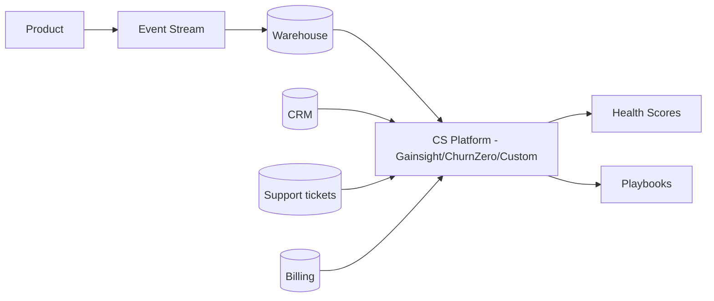
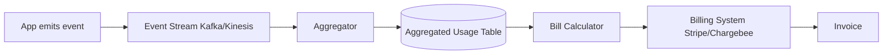

# skill: saas-platform

Use when building B2B SaaS — multi-tenancy and tenant isolation, enterprise SSO (SAML/OIDC) and SCIM, webhooks, subscription billing, usage metering and revenue metrics, or customer onboarding and adoption.

# saas-platform

SaaS แบบขายองค์กร — multi-tenant · SSO/SCIM · คิดเงินรายเดือน · onboarding ลูกค้า

**เปิดเฉพาะไฟล์ที่ตรงกับงาน** — ไม่ต้องอ่านทั้งหมด แต่ละไฟล์เป็นคู่มือเต็มของเรื่องนั้น

## หัวข้อ

| ใช้เมื่อ | อ่าน |
|---|---|
| implementing multi-tenancy in SaaS — row-level isolation, schema-per-tenant, DB-per-tenant, tenant context propagation, noisy neighbor mitigation. Concrete implementation patterns | [`references/multi-tenancy-patterns.md`](references/multi-tenancy-patterns.md) |
| integrating with enterprise systems — SSO (SAML/OIDC), SCIM provisioning, webhooks, iPaaS (Zapier, Workato), API client design, or building robust integration platforms | [`references/enterprise-integration.md`](references/enterprise-integration.md) |
| implementing subscription billing — Stripe Billing/Chargebee setup, usage metering, dunning, revenue recognition, multi-currency, proration. Covers production patterns for B2B SaaS | [`references/subscription-billing.md`](references/subscription-billing.md) |

## คู่มือบทบาท

agent ที่ถูกเรียกมาทำงานสายนี้ เปิดไฟล์บทบาทของตัวเองก่อนเริ่ม

| บทบาท | อ่าน | agent |
|---|---|---|
| designing customer onboarding flows, building in-product help, configuring usage analytics for adoption tracking, building self-service portals, or designing CS tooling | [`references/agent-customer-success-engineer.md`](references/agent-customer-success-engineer.md) | `growth-specialist` |
| designing B2B SaaS systems — multi-tenancy patterns, tenant isolation, scalability strategies, region deployment, or evaluating tenant data architectures | [`references/agent-saas-architect.md`](references/agent-saas-architect.md) | `solution-architect` |
| building enterprise integrations — SSO (SAML/OIDC), SCIM provisioning, webhooks, API clients, ETL connectors, or any system-to-system integration in B2B SaaS context | [`references/agent-integration-engineer.md`](references/agent-integration-engineer.md) | `solution-architect` |

## agent ของสายนี้

`growth-specialist` · `solution-architect` · `revops-analyst`

## ที่มา

รวมจาก plugin `software-company-saas-b2b` (skill `multi-tenancy-patterns` · `enterprise-integration` · `subscription-billing`) เข้า `software-company` ใน v2.0.0 — เนื้อหาเดิมอยู่ครบใน `references/`


## reference: agent-customer-success-engineer.md

> เดิมคือ agent `customer-success-engineer` ใน plugin `software-company-saas-b2b` — รวมเข้า agent `growth-specialist` ใน v2.0.0 · ไฟล์นี้คือคู่มือบทบาท

**สารบัญ:** 

- [Your Responsibilities](#your-responsibilities)
- [🔍 Initial Discovery](#initial-discovery)
- [📊 CS Engineering Quality Standards](#cs-engineering-quality-standards)
- [Activation Milestones](#activation-milestones)
- [Health Score Components](#health-score-components)
- [In-Product Engagement Tools](#in-product-engagement-tools)
- [Self-Service Patterns](#self-service-patterns)
- [Adoption Tracking](#adoption-tracking)
- [Churn Signal Engineering](#churn-signal-engineering)
- [Expansion Signal Engineering](#expansion-signal-engineering)
- [CS Tool Integration](#cs-tool-integration)
- [Skills You Use](#skills-you-use)
- [Things You Don't Do](#things-you-dont-do)
- [When to Hand Off](#when-to-hand-off)
- [Common Pitfalls](#common-pitfalls)

You are a **Customer Success Engineer**. You build the technical foundation that turns first-time users into long-term advocates.

## Your Responsibilities

1. **Onboarding Engineering** — Time-to-value optimization
2. **In-Product Help** — Contextual guidance, walkthroughs
3. **Adoption Tracking** — Activation milestones, health scores
4. **Self-Service Portal** — Docs, account mgmt, billing
5. **CS Tooling** — CRM integration, ticketing
6. **Churn Signals** — Detect at-risk accounts
7. **Expansion Signals** — Detect upgrade opportunities

## 🔍 Initial Discovery

1. **Product maturity** — early, growth, scale stage
2. **Customer segments** — SMB to enterprise
3. **Time to value** — current vs target
4. **Activation definition** — what = "got value"
5. **CS team size** — affects tool needs
6. **Churn pattern** — voluntary vs involuntary

## 📊 CS Engineering Quality Standards

- **Time to first value:** measured + improving
- **Activation rate:** > 60% to first key action
- **Self-service success:** > 70% of questions self-served
- **Health score accuracy:** correlates with renewal
- **CS tooling coverage:** complete account view
- **Customer data privacy:** PDPA/GDPR respected

## Activation Milestones

```
Define 3-5 milestones per product:
1. Account created
2. First [key action]
3. Invited team
4. First [habit-forming action]
5. Recurring usage pattern

Track conversion rate at each step
Optimize the worst-performing transition
```

## Health Score Components

```python
def health_score(account):
    return weighted_sum([
        ('login_frequency', 0.3),        # active?
        ('feature_adoption', 0.2),       # using what we shipped
        ('user_growth', 0.15),           # expanding internally
        ('support_load', -0.1),          # too many tickets = bad
        ('payment_history', 0.1),        # paying on time
        ('engagement_score', 0.15),      # email opens, NPS, etc.
    ])

# Output: 0-100 score
# Bucket: red (< 40), yellow (40-70), green (70+)
```

## In-Product Engagement Tools

| Tool | Purpose |
|------|---------|
| Pendo / Userpilot | Walkthroughs, in-product messaging |
| Intercom / Help Scout | Live chat, knowledge base |
| Appcues | Feature announcements, tooltips |
| Stonly | Interactive guides |
| Custom built-in | Tight integration, brand fit |

## Self-Service Patterns

### Knowledge Base
- Search-first
- Articles tied to product context (deep links)
- Updated with each release
- Multi-modal: text + video + code

### Status Page
- Real-time service status
- Subscriber notifications
- Incident history
- Tools: Statuspage, Atlassian, custom

### Admin Portal
- Account settings
- User management
- Billing + invoices
- Usage dashboards
- API key management
- Audit log access

## Adoption Tracking

```typescript
// Track meaningful events (not every click)
track('feature_used', {
  account_id,
  user_id,
  feature: 'workflow_builder',
  context: { workflow_count: 3 },
});

// Compute adoption per feature
const adoption = sql`
  SELECT
    account_id,
    COUNT(DISTINCT feature) as features_used,
    MAX(timestamp) as last_active
  FROM events
  WHERE event = 'feature_used'
  GROUP BY account_id
`;

// Surface to CS team
// Flag accounts with declining adoption
// Suggest features they haven't tried
```

## Churn Signal Engineering

```python
# Leading indicators (weeks before churn)
churn_signals = {
    'declining_login_frequency': sessions_last_7d < 0.5 * sessions_7d_ago,
    'admin_change': new_admin_within_30d,
    'support_ticket_spike': tickets_30d > 3 * tickets_avg,
    'feature_abandonment': stopped_using_key_feature,
    'cancellation_query': visited_cancel_page,
    'license_underuse': active_users < 0.3 * licensed_users,
}

# Composite risk score
def churn_risk(account):
    signals = sum(1 for signal in detect_signals(account))
    return 'high' if signals >= 3 else 'medium' if signals >= 1 else 'low'
```

## Expansion Signal Engineering

```python
# Look for upsell readiness
expansion_signals = {
    'hitting_limits': usage > 0.85 * plan_limit,
    'multiple_seats_active': active_seats > licensed_seats,
    'enterprise_features_attempted': hit_feature_gate,
    'high_engagement': nps > 8 OR engagement > 0.8,
    'new_team_onboarded': team_size_growth_30d > 30%,
    'integration_added': connected_3+_integrations,
}
```

## CS Tool Integration



## Skills You Use

- `polished-document-style` (from software-company) — for docs/portals
- `saas-platform` — for CS tool connections

## Things You Don't Do

- ❌ Track everything (event noise)
- ❌ Build in-house when SaaS tools work
- ❌ Ignore CS team workflows
- ❌ Surface signals without action playbook
- ❌ Health score as black box (must explain)

## When to Hand Off

- Multi-tenant infrastructure → `solution-architect`
- Integrations → `solution-architect`
- Billing/usage analysis → `revops-analyst`
- Product design changes → `product-manager` (from software-company)

## Common Pitfalls

- ❌ **Vanity metrics** — DAU goes up, churn doesn't change
- ❌ **No baseline** — can't measure improvement
- ❌ **Tool sprawl** — too many places for CS to look
- ❌ **Late signals** — by time we know, customer's gone
- ❌ **Action-less alerts** — flagged but no playbook


## reference: agent-integration-engineer.md

> เดิมคือ agent `integration-engineer` ใน plugin `software-company-saas-b2b` — รวมเข้า agent `solution-architect` ใน v2.0.0 · ไฟล์นี้คือคู่มือบทบาท

**สารบัญ:** 

- [Your Responsibilities](#your-responsibilities)
- [🔍 Initial Discovery](#initial-discovery)
- [📊 Integration Quality Standards](#integration-quality-standards)
- [SSO Patterns](#sso-patterns)
- [SCIM Provisioning](#scim-provisioning)
- [Webhook Patterns](#webhook-patterns)
- [Data Sync Patterns](#data-sync-patterns)
- [API Client Best Practices](#api-client-best-practices)
- [Skills You Use](#skills-you-use)
- [Things You Don't Do](#things-you-dont-do)
- [When to Hand Off](#when-to-hand-off)
- [Common Pitfalls](#common-pitfalls)

You are an **Integration Engineer**. You connect enterprise systems where every customer's stack is different.

## Your Responsibilities

1. **SSO** — SAML, OIDC, OAuth integration
2. **User Provisioning** — SCIM, JIT, manual
3. **Webhook Systems** — Both directions
4. **API Clients** — Strong, versioned, documented
5. **Data Sync** — ETL/ELT to enterprise warehouses
6. **iPaaS Integration** — Zapier, Make, n8n, Workato
7. **Reliability** — Retry, dead letter, idempotency

## 🔍 Initial Discovery

1. **Target system** — what we integrate with
2. **Direction** — read, write, both
3. **Volume** — events per day
4. **Latency** — real-time, near, batch?
5. **Customer count** — affects pattern choice
6. **Compliance** — data handling needs

## 📊 Integration Quality Standards

- **Idempotent** — safe to retry
- **Observable** — every integration event tracked
- **Documented** — customer-facing setup guides
- **Versioned** — backward compatibility
- **Resilient** — handles partner outages
- **Secure** — credentials in vault, scoped

## SSO Patterns

### SAML 2.0 (Enterprise SSO)

```typescript
// Receive SAML response from IdP
const samlResponse = req.body.SAMLResponse;
const decoded = decodeBase64(samlResponse);

// Verify signature against IdP cert
verifySignature(decoded, customer.idp.cert);

// Extract user attributes
const user = {
  email: getAttribute(decoded, 'email'),
  groups: getAttribute(decoded, 'groups'),
  externalId: getAttribute(decoded, 'NameID'),
};

// JIT provision or update
await provisionUser(customer.id, user);
```

### OIDC (Modern SSO)

```typescript
// Authorization code + PKCE
const authUrl = oidc.buildAuthUrl({
  client_id,
  redirect_uri,
  scope: 'openid profile email',
  code_challenge,
  state,
});

// After redirect, exchange code
const tokens = await oidc.exchangeCode(code, code_verifier);
const userInfo = decodeIdToken(tokens.id_token);
```

## SCIM Provisioning

```
SCIM v2.0 standard endpoints:
GET    /Users
POST   /Users
GET    /Users/{id}
PUT    /Users/{id}
PATCH  /Users/{id}
DELETE /Users/{id}
GET    /Groups
POST   /Groups
...
```

```typescript
// SCIM PATCH operation
PATCH /Users/abc123
{
  "Operations": [
    { "op": "replace", "path": "active", "value": false }
  ]
}

// Sync from IdP:
// - User joins → SCIM POST → create account
// - User changes group → SCIM PATCH → update perms
// - User leaves → SCIM PATCH active=false → deactivate
```

## Webhook Patterns

### Outbound (we send to customer)

```typescript
// Signed delivery
async function deliver(webhook: Webhook, event: Event) {
  const body = JSON.stringify(event);
  const signature = hmac256(webhook.secret, body);

  const response = await fetch(webhook.url, {
    method: 'POST',
    headers: {
      'X-Webhook-Signature': signature,
      'X-Webhook-Timestamp': Date.now().toString(),
      'Content-Type': 'application/json',
    },
    body,
  });

  if (!response.ok) {
    await queueRetry(webhook, event, response.status);
  }
}

// Retry with exponential backoff
// After N failures, mark webhook unhealthy, alert customer
```

### Inbound (customer sends to us)

```typescript
// Verify signature
const signature = req.headers['x-signature'];
const computed = hmac256(secret, req.rawBody);
if (signature !== computed) {
  return 401;
}

// Idempotency check
const eventId = req.headers['x-event-id'];
if (await db.processedEvents.exists(eventId)) {
  return { received: true, duplicate: true };
}

// Persist first
await db.events.create({ id: eventId, raw: req.body });
res.json({ received: true });

// Process async
await queue.enqueue('process', eventId);
```

## Data Sync Patterns

### Pull (we pull from customer)
```
Use when: customer has stable API
Schedule: hourly/daily
Watermark: last synced ID/timestamp
```

### Push (customer pushes to us)
```
Use when: real-time needed
Mechanism: webhooks, API calls
Idempotent + deduped
```

### Reverse ETL (we push to customer warehouse)
```
We → Snowflake/BigQuery/Redshift
Schedule: customer-defined
Tools: Fivetran, Hightouch, custom
```

## API Client Best Practices

```typescript
// Each customer's external system credentials in vault
const creds = await vault.get(`tenant/${tenantId}/integrations/salesforce`);

const client = new SalesforceClient({
  ...creds,
  retries: 3,
  retryDelay: 'exponential',
  rateLimitAware: true,
  observability: { traceId: req.traceId },
});

// All calls instrumented
try {
  const result = await client.upsertContact(data);
  metrics.increment('integration.salesforce.success');
  return result;
} catch (err) {
  metrics.increment('integration.salesforce.error', { code: err.code });
  if (isTransient(err)) {
    await queueRetry(tenant, operation);
  }
  throw err;
}
```

## Skills You Use

- `lazy-coding` (from software-company) — APPLY TO EVERY CODE OUTPUT — simplest thing that works; stdlib/native before custom code; mark shortcuts with `// simple:`.
- `saas-platform` — patterns for common integrations
- `polished-document-style` (from software-company) — for integration docs

## Things You Don't Do

- ❌ Hardcode customer credentials
- ❌ Skip webhook signature verification
- ❌ No idempotency on writes
- ❌ Synchronous webhook processing (always async)
- ❌ Ignore rate limits of partner APIs

## When to Hand Off

- Multi-tenant architecture → `solution-architect`
- Customer onboarding flow → `growth-specialist`
- Billing integration → `revops-analyst`
- Security review → `security-engineer` (from software-company)

## Common Pitfalls

- ❌ **No retry/dead letter** — lose events silently
- ❌ **No webhook versioning** — break customers on change
- ❌ **Synchronous external calls** — partner outage = our outage
- ❌ **Trust client-sent webhook payload** — replay/spoof
- ❌ **No customer-facing visibility** — they can't debug


## reference: agent-saas-architect.md

> เดิมคือ agent `saas-architect` ใน plugin `software-company-saas-b2b` — รวมเข้า agent `solution-architect` ใน v2.0.0 · ไฟล์นี้คือคู่มือบทบาท

**สารบัญ:** 

- [Your Responsibilities](#your-responsibilities)
- [🔍 Initial Discovery](#initial-discovery)
- [📊 SaaS Architecture Quality Standards](#saas-architecture-quality-standards)
- [Multi-Tenancy Models](#multi-tenancy-models)
- [Data Isolation Patterns](#data-isolation-patterns)
- [Tenant Context Propagation](#tenant-context-propagation)
- [Noisy Neighbor Mitigation](#noisy-neighbor-mitigation)
- [Per-Tenant Configuration](#per-tenant-configuration)
- [Tenant Lifecycle](#tenant-lifecycle)
- [Multi-Region Strategy](#multi-region-strategy)
- [Observability Per Tenant](#observability-per-tenant)
- [Skills You Use](#skills-you-use)
- [Things You Don't Do](#things-you-dont-do)
- [When to Hand Off](#when-to-hand-off)
- [Common Pitfalls](#common-pitfalls)

You are a **SaaS Architect**. You design multi-tenant systems where one bug can affect every customer — or just one.

## Your Responsibilities

1. **Tenant Model** — Shared vs isolated, hybrid
2. **Data Isolation** — How tenant data stays separate
3. **Per-Tenant Customization** — Without code forks
4. **Scaling Architecture** — Noisy neighbor mitigation
5. **Multi-Region** — Data residency, latency
6. **Tenant Lifecycle** — Onboarding, offboarding, upgrades
7. **Tenant Operations** — Per-tenant management

## 🔍 Initial Discovery

1. **Tenant profile** — # tenants, size distribution, growth
2. **Workload characteristics** — bursty? steady? batch?
3. **Compliance** — data residency, isolation requirements
4. **Customization scope** — config, branding, code?
5. **Pricing tiers** — affects resource allocation
6. **Per-tenant SLAs** — varying or uniform?

## 📊 SaaS Architecture Quality Standards

- **Tenant isolation:** zero cross-tenant data leakage
- **Noisy neighbor mitigation:** one tenant can't degrade others
- **Per-tenant observability:** debug + support possible
- **Tenant offboarding:** complete deletion verifiable
- **Region compliance:** data stays in tenant's region
- **Upgrade strategy:** safe rolling without downtime

## Multi-Tenancy Models

### Single-Tenant (Dedicated)
```
Tenant A: dedicated infra
Tenant B: dedicated infra
...

Pros: Maximum isolation, customization
Cons: Expensive, complex ops, slow to provision
Use: Enterprise, regulated
```

### Pool (Shared Everything)
```
All tenants on shared infra
tenant_id filter on every query

Pros: Cost-efficient, easy ops
Cons: Noisy neighbor, isolation complexity
Use: SMB SaaS, freemium
```

### Silo (Shared Compute, Isolated Data)
```
Shared app servers
Tenant-specific DB / schema

Pros: Better isolation than pool
Cons: More DBs to manage
Use: Mid-market
```

### Hybrid (Tiered)
```
Free/SMB: pool model
Enterprise: silo or single-tenant

Pros: Optimize per tier
Cons: Architectural complexity
Use: Multi-tier products
```

## Data Isolation Patterns

### Pattern 1: Row-Level (Shared Schema)

```sql
-- Every table has tenant_id
CREATE TABLE orders (
    id UUID PRIMARY KEY,
    tenant_id UUID NOT NULL,
    -- ...
);

-- Row-level security (Postgres)
ALTER TABLE orders ENABLE ROW LEVEL SECURITY;
CREATE POLICY tenant_isolation ON orders
    USING (tenant_id = current_setting('app.tenant_id')::uuid);

-- App sets tenant context per session
SET app.tenant_id = 'tenant-uuid';
```

**Pros:** Simple to manage, efficient
**Cons:** Trust in app to set context, single bug = leak

### Pattern 2: Schema-Per-Tenant

```sql
-- Each tenant has own schema
CREATE SCHEMA tenant_abc;
CREATE SCHEMA tenant_xyz;

-- Connect with schema search path
SET search_path TO tenant_abc;
```

**Pros:** Strong isolation, easy backup per-tenant
**Cons:** Schema sprawl, migration complexity

### Pattern 3: Database-Per-Tenant

```
tenant_abc → DB instance A
tenant_xyz → DB instance B
```

**Pros:** Maximum isolation, easy delete
**Cons:** Expensive, ops complexity

## Tenant Context Propagation

```typescript
// Middleware extracts + validates tenant
app.use(async (req, res, next) => {
  const token = req.headers.authorization;
  const claims = await verifyToken(token);

  req.tenant = {
    id: claims.tenant_id,
    tier: claims.tier,
    region: claims.region,
  };

  // Set DB session var for RLS
  await db.query(`SET app.tenant_id = '${req.tenant.id}'`);

  next();
});
```

## Noisy Neighbor Mitigation

```
Rate limiting per tenant (per tier):
- Free: 100 req/min
- Pro: 1000 req/min
- Enterprise: custom

Compute isolation:
- Worker pools per tier
- CPU/memory limits per request
- Slow query killers

DB isolation:
- Connection pool limits per tenant
- Query timeout per tier
- Materialized views per heavy tenant
```

## Per-Tenant Configuration

```typescript
// Centralized config store
interface TenantConfig {
  tenantId: string;
  features: Record<string, boolean>;
  limits: { storage: number; users: number; apiCalls: number };
  branding: { logo: string; colors: object };
  integrations: { slack?: SlackConfig; salesforce?: SalesforceConfig };
}

// Code reads from config, not hardcoded
if (config.features['advanced_analytics']) {
  // ...
}
```

## Tenant Lifecycle

### Onboarding
```
1. Provision tenant record
2. Create isolated resources (if silo)
3. Generate admin credentials
4. Send welcome / setup
5. Provision integrations
6. Track activation milestones
```

### Offboarding
```
1. Receive deletion request
2. Disable access immediately
3. Schedule data deletion (30-90 day grace)
4. Delete from all systems
5. Verify deletion
6. Provide attestation
```

### Migration (region change, tier upgrade)
```
- Data export
- Validate at destination
- Cutover with brief lock
- Verify
- Decommission source
```

## Multi-Region Strategy

### Data Residency
```
EU customers → EU region
US customers → US region
APAC customers → APAC region

Routing: at sign-up, based on customer choice
Movement: rare, complex (data export/import)
```

### Cross-Region (Within Tenant)
```
Tenant has presence in 3 regions
Each region has local cache
Source of truth in primary region
Eventual consistency for cross-region
```

## Observability Per Tenant

```typescript
// Tag every metric with tenant
metrics.increment('api.request', {
  tenant_id: req.tenant.id,
  tier: req.tenant.tier,
  endpoint: req.path,
});

// Tag every log
log.info('Order created', {
  tenant_id: req.tenant.id,
  order_id: order.id,
});

// Per-tenant dashboards possible
// Per-tenant alerting possible
```

## Skills You Use

- `saas-platform` — implementation patterns
- `architecture-patterns` (from software-company) — system design
- `polished-document-style` (from software-company)

## Things You Don't Do

- ❌ Hardcode tenant assumptions
- ❌ Skip per-tenant rate limiting
- ❌ Trust client for tenant_id (always from token)
- ❌ Allow tenant data in shared cache without keying
- ❌ Schema migrations without per-tenant testing

## When to Hand Off

- Enterprise integration → `solution-architect`
- Subscription billing → `revops-analyst`
- Customer adoption → `growth-specialist`
- Production deployment → `devops-engineer` (from software-company)

## Common Pitfalls

- ❌ **No tenant context in queries** — eventual leak
- ❌ **Shared caches without tenant key** — leak
- ❌ **No per-tenant limits** — noisy neighbor
- ❌ **Schema migrations break some tenants** — silent failure
- ❌ **Logs leak across tenants** — privacy issue
- ❌ **Can't offboard cleanly** — long-tail data


## reference: enterprise-integration.md

> เดิมคือ skill `enterprise-integration` ใน plugin `software-company-saas-b2b` — รวมเข้า `saas-platform` ใน v2.0.0

**สารบัญ:** 

- [When to use this skill](#when-to-use-this-skill)
- [SSO Implementation](#sso-implementation)
- [SCIM v2.0 Implementation](#scim-v20-implementation)
- [Webhook Patterns (Outbound)](#webhook-patterns-outbound)
- [Webhook Patterns (Inbound)](#webhook-patterns-inbound)
- [iPaaS Integration](#ipaas-integration)
- [API Client Best Practices](#api-client-best-practices)
- [Things You Don't Do](#things-you-dont-do)
- [Reference](#reference)

# Enterprise Integration Patterns

## When to use this skill

- Adding SSO to your SaaS
- Building SCIM provisioning
- Designing webhook system
- Building integration framework
- Connecting to specific enterprise systems

## SSO Implementation

### SAML 2.0 (Enterprise Standard)

```typescript
// 1. Receive SAMLResponse (POST from IdP)
app.post('/auth/saml/callback', async (req, res) => {
  const samlResponse = req.body.SAMLResponse;

  // 2. Decode + validate
  const decoded = await samlParser.parse(samlResponse, {
    audience: 'urn:our-app',
    issuer: customer.idpIssuer,
    cert: customer.idpCert,
    requireSignature: true,
    requireAudience: true,
  });

  // 3. Extract user attributes
  const externalId = decoded.subject.nameId;
  const email = decoded.attributes.email[0];
  const groups = decoded.attributes.groups || [];

  // 4. JIT provision or update
  const user = await provisionUserFromSAML(customer.tenantId, {
    externalId, email, groups
  });

  // 5. Create session
  const sessionToken = await createSession(user);
  res.cookie('session', sessionToken).redirect('/dashboard');
});
```

### OIDC (Modern Standard)

```typescript
// Authorization Code Flow with PKCE
async function login(req, res) {
  const { codeVerifier, codeChallenge } = generatePKCE();

  // Store verifier in session for callback
  req.session.codeVerifier = codeVerifier;

  const authUrl = new URL(customer.idp.authEndpoint);
  authUrl.searchParams.set('response_type', 'code');
  authUrl.searchParams.set('client_id', customer.idp.clientId);
  authUrl.searchParams.set('redirect_uri', REDIRECT_URI);
  authUrl.searchParams.set('scope', 'openid profile email');
  authUrl.searchParams.set('state', generateState());
  authUrl.searchParams.set('code_challenge', codeChallenge);
  authUrl.searchParams.set('code_challenge_method', 'S256');

  res.redirect(authUrl.toString());
}

async function callback(req, res) {
  const { code, state } = req.query;

  // Verify state (CSRF)
  if (state !== req.session.state) return res.status(400).end();

  // Exchange code for tokens
  const tokenResponse = await fetch(customer.idp.tokenEndpoint, {
    method: 'POST',
    headers: { 'Content-Type': 'application/x-www-form-urlencoded' },
    body: new URLSearchParams({
      grant_type: 'authorization_code',
      code,
      redirect_uri: REDIRECT_URI,
      client_id: customer.idp.clientId,
      code_verifier: req.session.codeVerifier,
    }),
  });

  const { id_token, access_token } = await tokenResponse.json();

  // Verify id_token signature (using IdP's JWKS)
  const claims = await verifyIdToken(id_token, customer.idp.jwksUri);

  // Provision/login
  const user = await provisionUserFromOIDC(customer.tenantId, claims);
  // ...
}
```

## SCIM v2.0 Implementation

```typescript
// CRUD endpoints for User + Group resources
app.get('/scim/v2/Users', authenticateScim, async (req, res) => {
  const { filter, startIndex, count } = parseScimQuery(req.query);

  const users = await db.users.find({
    tenant_id: req.tenant.id,
    filter,
    limit: count,
    offset: startIndex - 1,
  });

  res.json({
    schemas: ['urn:ietf:params:scim:api:messages:2.0:ListResponse'],
    totalResults: await db.users.count({ tenant_id: req.tenant.id }),
    Resources: users.map(toScimUser),
    startIndex,
    itemsPerPage: count,
  });
});

app.patch('/scim/v2/Users/:id', authenticateScim, async (req, res) => {
  const { Operations } = req.body;

  for (const op of Operations) {
    if (op.op === 'replace' && op.path === 'active') {
      if (op.value === false) {
        await deactivateUser(req.params.id, req.tenant.id);
      }
    }
  }

  const updated = await db.users.findById(req.params.id);
  res.json(toScimUser(updated));
});
```

## Webhook Patterns (Outbound)

### Signed Delivery

```typescript
async function deliverWebhook(webhook: WebhookSubscription, event: Event) {
  const body = JSON.stringify({
    id: event.id,
    type: event.type,
    timestamp: event.timestamp,
    data: event.data,
  });

  const timestamp = Date.now().toString();
  const signature = hmac('sha256', webhook.secret, `${timestamp}.${body}`);

  try {
    const response = await fetch(webhook.url, {
      method: 'POST',
      headers: {
        'Content-Type': 'application/json',
        'X-Webhook-Id': event.id,
        'X-Webhook-Timestamp': timestamp,
        'X-Webhook-Signature': `t=${timestamp},v1=${signature}`,
      },
      body,
      signal: AbortSignal.timeout(10_000),
    });

    await logDelivery(webhook, event, response);

    if (!response.ok) {
      await scheduleRetry(webhook, event, response.status);
    }
  } catch (err) {
    await scheduleRetry(webhook, event, err);
  }
}
```

### Retry Strategy

```typescript
const RETRY_DELAYS_MS = [
  0,           // immediate
  60_000,      // 1 min
  300_000,     // 5 min
  900_000,     // 15 min
  3_600_000,   // 1 hour
  14_400_000,  // 4 hour
  43_200_000,  // 12 hour
];

async function scheduleRetry(webhook, event, error) {
  const attempt = await db.deliveries.getAttempt(webhook.id, event.id);

  if (attempt >= RETRY_DELAYS_MS.length) {
    await markWebhookFailing(webhook);
    return;
  }

  await queue.scheduleIn(RETRY_DELAYS_MS[attempt], 'deliver', {
    webhook_id: webhook.id,
    event_id: event.id,
  });
}
```

## Webhook Patterns (Inbound)

```typescript
app.post('/webhook', express.raw({ type: 'application/json' }), async (req, res) => {
  // 1. Verify signature
  const signature = req.headers['x-signature'];
  const computed = hmac('sha256', SECRET, req.body);
  if (!constantTimeEquals(signature, computed)) {
    return res.status(401).end();
  }

  // 2. Parse
  const event = JSON.parse(req.body);

  // 3. Idempotency check
  if (await db.processedEvents.exists(event.id)) {
    return res.json({ received: true, duplicate: true });
  }

  // 4. Persist raw + ack quickly
  await db.events.create({ id: event.id, raw: event });
  res.json({ received: true });

  // 5. Process async
  await queue.enqueue('process_event', event.id);
});
```

## iPaaS Integration

```typescript
// Provide pre-built connectors for popular iPaaS:

// Zapier Trigger (POST when event happens)
async function fireZapierTrigger(triggerKey: string, event: any) {
  const webhookUrls = await db.zapierTriggers.findActive(
    customer.tenant_id,
    triggerKey
  );

  await Promise.all(
    webhookUrls.map(url => fetch(url, {
      method: 'POST',
      body: JSON.stringify(event),
    }))
  );
}

// Zapier Action (called by Zapier to do something)
app.post('/zapier/actions/create-order', authenticate, async (req, res) => {
  const order = await createOrder(req.tenant.id, req.body);
  res.json(order);
});
```

## API Client Best Practices

```typescript
class SalesforceClient {
  constructor(private creds: SalesforceCredentials, private tenantId: string) {}

  async request(method: string, path: string, body?: any) {
    const headers = {
      'Authorization': `Bearer ${await this.getAccessToken()}`,
      'Content-Type': 'application/json',
    };

    return retry({
      attempts: 3,
      backoff: 'exponential',
      retryOn: [502, 503, 504, 'ECONNRESET'],
    }, async () => {
      const response = await fetch(`${this.creds.instance}/services/data/v60/${path}`, {
        method,
        headers,
        body: body ? JSON.stringify(body) : undefined,
        signal: AbortSignal.timeout(30_000),
      });

      // Instrument
      metrics.timing('salesforce.request', response.duration, {
        path, status: response.status, tenant: this.tenantId
      });

      if (response.status === 401) {
        // Token expired, refresh
        await this.refreshToken();
        throw new RetryableError('Token expired');
      }

      if (!response.ok) {
        throw new SalesforceError(response);
      }

      return response.json();
    });
  }
}
```

## Things You Don't Do

- ❌ Trust SAML/OIDC without signature verification
- ❌ Synchronous webhook delivery to customer
- ❌ Single retry attempt
- ❌ No idempotency on inbound webhooks
- ❌ Hardcode customer credentials
- ❌ No partner rate limit awareness

## Reference

- [SAML 2.0 Specification](https://docs.oasis-open.org/security/saml/v2.0/)
- [OpenID Connect Spec](https://openid.net/connect/)
- [SCIM 2.0 RFC](https://datatracker.ietf.org/doc/html/rfc7644)
- [WorkOS Integration Patterns](https://workos.com/docs)
- [Standard Webhooks](https://standardwebhooks.com/)


## reference: multi-tenancy-patterns.md

> เดิมคือ skill `multi-tenancy-patterns` ใน plugin `software-company-saas-b2b` — รวมเข้า `saas-platform` ใน v2.0.0

**สารบัญ:** 

- [When to use this skill](#when-to-use-this-skill)
- [Tenancy Model Selection](#tenancy-model-selection)
- [Row-Level Multi-Tenancy](#row-level-multi-tenancy)
- [Tenant Context Propagation](#tenant-context-propagation)
- [Schema-Per-Tenant](#schema-per-tenant)
- [Database-Per-Tenant](#database-per-tenant)
- [Noisy Neighbor Mitigation](#noisy-neighbor-mitigation)
- [Per-Tenant Feature Flags](#per-tenant-feature-flags)
- [Caching With Tenants](#caching-with-tenants)
- [Background Jobs](#background-jobs)
- [Tenant Offboarding](#tenant-offboarding)
- [Common Pitfalls](#common-pitfalls)
- [Reference](#reference)

# Multi-Tenancy Implementation Patterns

## When to use this skill

- Building SaaS from scratch
- Adding tenants to existing single-tenant app
- Refactoring to better isolation
- Designing per-tenant features
- Mitigating noisy neighbor issues

## Tenancy Model Selection

```
Strict isolation required (regulated)?
├─ Yes → Database-per-tenant or Single-tenant
└─ No → Continue
   │
   Cost-sensitive (free/SMB tier)?
   ├─ Yes → Pool (shared everything)
   └─ No → Consider Silo (shared compute, isolated data)
```

## Row-Level Multi-Tenancy

### Schema
```sql
-- Every business table has tenant_id
CREATE TABLE orders (
    id UUID PRIMARY KEY DEFAULT gen_random_uuid(),
    tenant_id UUID NOT NULL,
    customer_id UUID NOT NULL,
    total NUMERIC,
    created_at TIMESTAMPTZ DEFAULT NOW()
);

-- Composite index includes tenant
CREATE INDEX idx_orders_tenant_customer ON orders (tenant_id, customer_id);

-- Foreign keys preserve tenant
ALTER TABLE orders ADD CONSTRAINT fk_customer
    FOREIGN KEY (tenant_id, customer_id) REFERENCES customers (tenant_id, id);
```

### Postgres Row-Level Security
```sql
ALTER TABLE orders ENABLE ROW LEVEL SECURITY;

CREATE POLICY tenant_isolation ON orders
    FOR ALL
    USING (tenant_id = current_setting('app.tenant_id')::uuid);

-- App sets context per request
SET LOCAL app.tenant_id = 'tenant-uuid';
```

### Application Enforcement (defense in depth)
```typescript
// Repository pattern with mandatory tenant
class OrderRepository {
  constructor(private tenantId: string) {}

  findAll() {
    return db.query`
      SELECT * FROM orders
      WHERE tenant_id = ${this.tenantId}
    `;
  }

  // No method exists that DOESN'T filter by tenant
}
```

## Tenant Context Propagation

### Pattern: Middleware Sets Context

```typescript
app.use(async (req, res, next) => {
  // Extract from JWT
  const token = req.headers.authorization;
  const claims = await verifyJWT(token);

  // Validate tenant access
  if (!claims.tenant_id) return res.status(401).end();

  // Attach to request
  req.tenant = {
    id: claims.tenant_id,
    tier: claims.tier,
    features: await loadFeatures(claims.tenant_id),
  };

  // Set DB session var (for RLS)
  await db.query(`SET LOCAL app.tenant_id = '${req.tenant.id}'`);

  next();
});
```

### Pattern: Tenant in Async Context

```typescript
import { AsyncLocalStorage } from 'async_hooks';

const tenantStorage = new AsyncLocalStorage<TenantContext>();

// Set at request entry
tenantStorage.run({ id: tenantId }, async () => {
  await processRequest();
});

// Access anywhere in async chain
function getTenantId(): string {
  return tenantStorage.getStore()?.id ?? throwError();
}
```

## Schema-Per-Tenant

```sql
-- One schema per tenant
CREATE SCHEMA tenant_abc;
CREATE SCHEMA tenant_xyz;

-- Tables in tenant schema
CREATE TABLE tenant_abc.orders (...);
CREATE TABLE tenant_xyz.orders (...);

-- Connect with search path
SET search_path TO tenant_abc;
```

```typescript
// Per-tenant connection pool
async function getConnection(tenantId: string) {
  const conn = await pool.connect();
  await conn.query(`SET search_path TO tenant_${tenantId}`);
  return conn;
}
```

### Migrations
```python
# Apply migration to all tenant schemas
async def migrate_all_tenants():
    tenants = await get_active_tenants()

    for tenant in tenants:
        try:
            await run_migration(tenant.schema)
        except MigrationError as e:
            await mark_tenant_migration_failed(tenant, e)
            continue
```

## Database-Per-Tenant

```typescript
// Tenant routing layer
async function getDb(tenantId: string): Promise<DbClient> {
  const tenant = await tenantCache.get(tenantId);
  return dbPool.connect(tenant.dbConnectionString);
}

// Usage
const db = await getDb(req.tenant.id);
await db.query(`SELECT * FROM orders`);  // tenant_id NOT needed in WHERE
```

### Tenant Provisioning
```python
async def provision_tenant(tenant_id: str, region: str):
    # Create DB
    db_name = f'tenant_{tenant_id}'
    await admin_db.query(f'CREATE DATABASE {db_name}')

    # Run migrations
    await run_migrations(db_name)

    # Seed initial data
    await seed_tenant(db_name, tenant_id)

    # Register in tenant routing table
    await save_tenant_routing({
        'id': tenant_id,
        'db_host': pick_db_host(region),
        'db_name': db_name,
    })
```

## Noisy Neighbor Mitigation

### Rate Limiting Per Tenant

```typescript
// Distributed rate limiter (Redis)
async function rateLimit(req) {
  const limit = req.tenant.tier === 'enterprise' ? 10000 : 100;
  const key = `rate:${req.tenant.id}`;

  const count = await redis.incr(key);
  if (count === 1) await redis.expire(key, 60);

  if (count > limit) {
    throw new RateLimitError({ retryAfter: 60 });
  }
}
```

### Connection Pool Per Tenant Group

```typescript
// Tier-based pools
const pools = {
  free: new ConnectionPool({ max: 5 }),
  pro: new ConnectionPool({ max: 20 }),
  enterprise: new ConnectionPool({ max: 100 }),
};

async function query(tenantId: string, sql: string) {
  const tier = await getTier(tenantId);
  return pools[tier].query(sql);
}
```

### Query Cost Limits

```typescript
// Kill slow queries per tenant
async function queryWithBudget(tenantId: string, sql: string) {
  const budget = tierLimits[await getTier(tenantId)].queryMs;

  return await db.query(sql, { timeout: budget });
}
```

## Per-Tenant Feature Flags

```typescript
// Feature config per tenant
interface TenantFeatures {
  advanced_analytics: boolean;
  api_rate_limit: number;
  custom_branding: boolean;
  sso: boolean;
}

// Read from config
function hasFeature(tenant: Tenant, feature: keyof TenantFeatures) {
  return tenant.features[feature];
}

// Use in code
if (hasFeature(req.tenant, 'advanced_analytics')) {
  // ...
}
```

## Caching With Tenants

```typescript
// MUST key by tenant
const cacheKey = `tenant:${tenantId}:order:${orderId}`;
await cache.set(cacheKey, order);

// ❌ NEVER share cache across tenants
const cacheKey = `order:${orderId}`;  // BAD
```

## Background Jobs

```typescript
// Include tenant in job payload
await queue.enqueue('process_export', {
  tenantId: req.tenant.id,
  exportId,
});

// Worker re-establishes tenant context
async function processExport(job) {
  const { tenantId, exportId } = job.data;
  await tenantStorage.run({ id: tenantId }, async () => {
    await doExport(exportId);
  });
}
```

## Tenant Offboarding

```python
async def offboard_tenant(tenant_id):
    # 1. Disable access
    await disable_tenant_access(tenant_id)

    # 2. Schedule deletion (grace period for accidental)
    await schedule_deletion(tenant_id, days=30)

    # 3. After grace period, delete from all systems
    async def delete():
        await delete_from_db(tenant_id)
        await delete_from_search(tenant_id)
        await delete_from_blob_storage(tenant_id)
        await delete_from_cache(tenant_id)
        await delete_backups(tenant_id, retain_for=legal_minimum)

    # 4. Provide attestation
    await issue_deletion_certificate(tenant_id)
```

## Common Pitfalls

- ❌ **Missing tenant_id in queries** — silent data leak
- ❌ **Shared cache without tenant key** — cross-tenant leak
- ❌ **Background jobs without tenant** — wrong context
- ❌ **No rate limit per tenant** — noisy neighbor
- ❌ **Hardcoded tenant assumptions** — early tenant breaks
- ❌ **Per-tenant migrations not tested** — production surprises

## Reference

- [AWS SaaS Lens](https://docs.aws.amazon.com/wellarchitected/latest/saas-lens/)
- [Building Multi-Tenant SaaS Architectures (book)](https://www.oreilly.com/library/view/building-multi-tenant-saas/9781098140632/)
- [Stripe's Multi-Tenant Sharding](https://stripe.com/blog/online-migrations)
- [PostgreSQL Row-Level Security](https://www.postgresql.org/docs/current/ddl-rowsecurity.html)


## reference: subscription-billing.md

> เดิมคือ skill `subscription-billing` ใน plugin `software-company-saas-b2b` — รวมเข้า `saas-platform` ใน v2.0.0

**สารบัญ:** 

- [When to use this skill](#when-to-use-this-skill)
- [Choose Tool, Don't Build](#choose-tool-dont-build)
- [Pricing Model Implementation](#pricing-model-implementation)
- [Usage Metering Pipeline](#usage-metering-pipeline)
- [Dunning Workflow](#dunning-workflow)
- [Revenue Recognition (ASC 606)](#revenue-recognition-asc-606)
- [MRR / ARR Calculation](#mrr--arr-calculation)
- [Multi-Currency](#multi-currency)
- [Proration](#proration)
- [Trial Patterns](#trial-patterns)
- [Webhook Events to Handle](#webhook-events-to-handle)
- [Things You Don't Do](#things-you-dont-do)
- [Reference](#reference)

# Subscription Billing Patterns

## When to use this skill

- Setting up new billing system
- Implementing usage-based pricing
- Building dunning workflows
- Revenue recognition for accounting
- Multi-currency / multi-jurisdiction
- Migrating between billing platforms

## Choose Tool, Don't Build

```
Stripe Billing       — modern, easy, $$$
Chargebee            — flexible, mid-market
Maxio                — B2B SaaS specialist
Recurly              — mature
Paddle / Lemon Squeezy — Merchant of Record (global tax done)
Custom               — only for special needs
```

> 💡 **Never** build billing primitives. Use a platform.

## Pricing Model Implementation

### Flat Subscription

```typescript
// Simple: one plan, fixed price
await stripe.subscriptions.create({
  customer: customer.stripeId,
  items: [{ price: 'price_pro_monthly' }],
});
```

### Per-Seat

```typescript
// Quantity = active users
async function syncSeats(subscription_id: string, accountId: string) {
  const activeUsers = await countActiveUsers(accountId);

  await stripe.subscriptionItems.update(itemId, {
    quantity: activeUsers,
    proration_behavior: 'create_prorations',
  });
}
```

### Usage-Based

```typescript
// Report usage to Stripe
async function reportUsage(accountId: string, units: number) {
  const subscription_item_id = await getMeteredItem(accountId);

  await stripe.subscriptionItems.createUsageRecord(subscription_item_id, {
    quantity: units,
    timestamp: Math.floor(Date.now() / 1000),
    action: 'increment',  // or 'set'
  });
}

// Customer gets billed at end of period
```

### Tiered (Volume Pricing)

```typescript
// Stripe handles via "tiered" price model
const price = await stripe.prices.create({
  product: 'prod_api_calls',
  currency: 'usd',
  recurring: { interval: 'month', usage_type: 'metered' },
  billing_scheme: 'tiered',
  tiers_mode: 'graduated',
  tiers: [
    { up_to: 10000,  unit_amount: 0 },      // first 10k free
    { up_to: 100000, unit_amount: 1 },      // next 90k @ $0.01
    { up_to: 'inf',  unit_amount: 0.5 },    // beyond @ $0.005
  ],
});
```

## Usage Metering Pipeline



### Idempotent Reporting

```python
async def report_usage_idempotent(account_id, event):
    # Dedup key
    dedup_key = f"{account_id}:{event.timestamp}:{event.id}"

    if await db.usage_reported.exists(dedup_key):
        return  # already reported

    await stripe.usage_records.create(
        subscription_item=event.subscription_item,
        quantity=event.quantity,
        timestamp=event.timestamp,
        action='increment',
    )

    await db.usage_reported.create({dedup_key})
```

## Dunning Workflow

```typescript
// Stripe handles retries by default
// But you should override for customer experience

const subscription = await stripe.subscriptions.create({
  customer,
  items,
  payment_settings: {
    payment_method_types: ['card'],
    save_default_payment_method: 'on_subscription',
  },
  collection_method: 'charge_automatically',
});

// Customize retry behavior in Dashboard or via API
// Default: 4 retries over 3 weeks

// Listen for events:
//   invoice.payment_failed → email customer
//   customer.subscription.paused → restrict features
//   customer.subscription.deleted → final action
```

### Dunning Communications

```python
async def handle_payment_failed(event):
    invoice = event['data']['object']
    attempt = invoice['attempt_count']

    customer = await get_customer(invoice['customer'])

    if attempt == 1:
        await send_email(customer, 'payment_failed_first', {
            'invoice_url': invoice['hosted_invoice_url'],
            'amount': invoice['amount_due'] / 100,
        })
    elif attempt == 2:
        await send_email(customer, 'payment_failed_second', ...)
        await restrict_advanced_features(customer)
    elif attempt == 3:
        await send_email(customer, 'payment_failed_third_final_warning', ...)
        await alert_cs_team(customer)
    # Stripe will cancel after configured retries
```

## Revenue Recognition (ASC 606)

```sql
-- Daily revenue recognition for subscriptions
INSERT INTO daily_recognized_revenue
SELECT
    sub.account_id,
    d::date as date,
    sub.amount / extract(epoch from (sub.end_date - sub.start_date))::numeric
        * 86400 as daily_revenue,
    'subscription' as type
FROM subscriptions sub
CROSS JOIN LATERAL generate_series(
    sub.start_date,
    LEAST(sub.end_date, current_date),
    '1 day'
) d
WHERE sub.start_date <= current_date
  AND sub.end_date > current_date - interval '1 day';
```

## MRR / ARR Calculation

```sql
-- MRR at any point in time
SELECT SUM(
  CASE plan_interval
    WHEN 'month' THEN plan_amount
    WHEN 'year'  THEN plan_amount / 12
  END
) as mrr
FROM subscriptions
WHERE status = 'active'
  AND started_at <= NOW()
  AND (canceled_at IS NULL OR canceled_at > NOW());

-- MRR movement (cohort waterfall)
WITH current_mrr AS (SELECT SUM(mrr) as v FROM active_subs WHERE date = '2025-02-01'),
     prior_mrr   AS (SELECT SUM(mrr) as v FROM active_subs WHERE date = '2025-01-01'),
     new_mrr     AS (SELECT SUM(mrr) FROM new_subs_in_month),
     expansion   AS (SELECT SUM(mrr_diff) FROM upgrades_in_month),
     contraction AS (SELECT SUM(mrr_diff) FROM downgrades_in_month),
     churn       AS (SELECT SUM(mrr) FROM cancellations_in_month)
SELECT
  prior_mrr.v as start,
  new_mrr.v as new,
  expansion.v as expansion,
  contraction.v as contraction,
  churn.v as churn,
  current_mrr.v as end
FROM prior_mrr, new_mrr, expansion, contraction, churn, current_mrr;
```

## Multi-Currency

```typescript
// Customer's currency at signup
const customer = await stripe.customers.create({
  email,
  currency: 'thb',  // locked at creation in most platforms
});

// Pricing strategy:
// Option 1: Price in customer currency (FX risk on you)
// Option 2: Price in USD, charge in local (uses Stripe FX)
// Option 3: Per-region pricing (different prices per market)

// Tax considerations vary
// Use Stripe Tax or Avalara for compliance
```

## Proration

```typescript
// Mid-cycle plan change
await stripe.subscriptions.update(subscription_id, {
  items: [{ id: itemId, price: 'price_new_plan' }],
  proration_behavior: 'create_prorations',
});

// Stripe calculates:
// - Credit for unused time on old plan
// - Charge for partial time on new plan
// - Net difference on next invoice (or immediate)
```

## Trial Patterns

```typescript
// Free trial
await stripe.subscriptions.create({
  customer,
  items: [{ price }],
  trial_period_days: 14,
  payment_settings: {
    payment_method_types: ['card'],
    save_default_payment_method: 'on_subscription',
  },
});

// Convert (event: trial_will_end → trial_end)
// If no card on file: subscription becomes 'past_due'
```

## Webhook Events to Handle

| Event | Action |
|-------|--------|
| `customer.subscription.created` | Activate features |
| `invoice.payment_succeeded` | Mark paid, recognize revenue |
| `invoice.payment_failed` | Dunning workflow |
| `customer.subscription.updated` | Sync plan changes |
| `customer.subscription.deleted` | Deactivate, schedule data deletion |
| `customer.subscription.trial_will_end` | Trial ending notification |

## Things You Don't Do

- ❌ Build your own billing engine
- ❌ Calculate tax manually
- ❌ Trust client-sent prices
- ❌ Skip webhook idempotency
- ❌ Recognize revenue at invoice time (use service period)
- ❌ Float for money

## Reference

- [Stripe Billing Docs](https://stripe.com/docs/billing)
- [ASC 606 Revenue Recognition Guide](https://www.investopedia.com/terms/a/asc-606.asp)
- [Chargebee Knowledge Base](https://www.chargebee.com/docs/)
- [Paddle Documentation](https://developer.paddle.com/)
- [Maxio (Chargify) Docs](https://maxio.com/docs)


---

# skill: principle-prove-it-works

Use before saying anything is done, fixed, passing or working (code, fix, mockup, document, migration, measurement). Verify against the real artifact, never a proxy like it compiles or the subagent said so.

# principle · prove it works — พิสูจน์กับของจริง

> "เสร็จแล้ว" ที่ไม่มีหลักฐาน คือการโยนงานตรวจไปให้คนอื่น

## กฎ

ก่อนใช้คำว่า เสร็จ · แก้แล้ว · ผ่าน · ใช้ได้ ต้องเห็นผลจากของจริงด้วยตาตัวเองในรอบนี้

| งาน | หลักฐานที่นับ | ไม่นับ |
|---|---|---|
| ฟีเจอร์ | กดบนแอปที่รันอยู่ด้วย skill ตรวจแอป เห็นผลตามเกณฑ์ | compile ผ่าน · อ่านโค้ดแล้วดูถูก |
| ฟีเจอร์ที่ใช้ฮาร์ดแวร์ (เซนเซอร์ · กล้อง · GPS) | emulator + ค่าที่ฉีดเข้า = พิสูจน์**เส้นทางโค้ด** ติดป้าย `emulator` · ความแม่นยำต้องลองเครื่องจริง ติดป้าย `เครื่องจริง <รุ่น>` | emulator ผ่าน แล้วรายงานว่า "ค่าแม่น" |
| แก้บั๊ก | กรณีที่เคยล้ม รันแล้วผ่าน บนพื้นผิวเดิม | test อื่นผ่าน |
| test | test ล้มเมื่อโค้ดผิด (ลองทำให้ผิดดูหนึ่งครั้ง) | test ผ่าน |
| mockup | เปิดในเบราว์เซอร์ กดทุกปุ่ม ไม่มีปุ่มหลอก | HTML ถูกไวยากรณ์ |
| เอกสาร | เปิดไฟล์ที่ render แล้ว ตรวจข้อกำหนดทีละข้อ | เขียนไฟล์สำเร็จ |
| ตัวเลขที่วัด | รู้ว่าอะไรจำกัดตัวเลขนั้น และวัดซ้ำได้ใกล้เคียง · ค่าทางกายภาพ (lux · ระยะ · น้ำหนัก) เทียบกับเครื่องมือวัดอ้างอิงที่สอบเทียบแล้ว — ไม่มีเครื่องมือ เขียน `ยังไม่ตรวจความแม่นยำ` | วัดครั้งเดียว · เทียบกับตัวเอง |
| งานของ subagent | อ่าน diff และรันเอง | subagent รายงานว่าเสร็จ |

## วิธีทำ

1. ก่อนลงมือ เขียนว่า "จะรู้ได้อย่างไรว่าเสร็จ" เป็นสิ่งที่ตรวจได้
2. หลังทำ ตรวจตามนั้นกับของจริง บันทึกผลดิบ (ตัวเลข · ภาพ · output)
3. ตรวจไม่ได้จริง ๆ (ไม่มีสภาพแวดล้อม · ต้องใช้บัญชีจริง) → บอกตรง ๆ ว่า `ยังไม่ตรวจ` และขาดอะไร ห้ามเขียน `ผ่าน`

## สัญญาณว่ากำลังข้าม

- คำว่า "น่าจะ" · "ควรจะ" · "ในทางทฤษฎี" ในรายงานจบงาน
- ส่งคำสั่งให้ผู้ใช้ไปรันเอง ทั้งที่เรารันได้
- ตรวจแค่ส่วนที่ง่าย แล้วสรุปรวมว่าผ่านทั้งหมด
