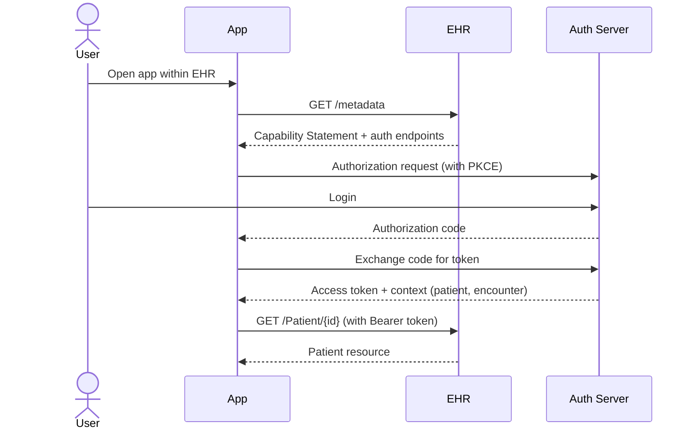
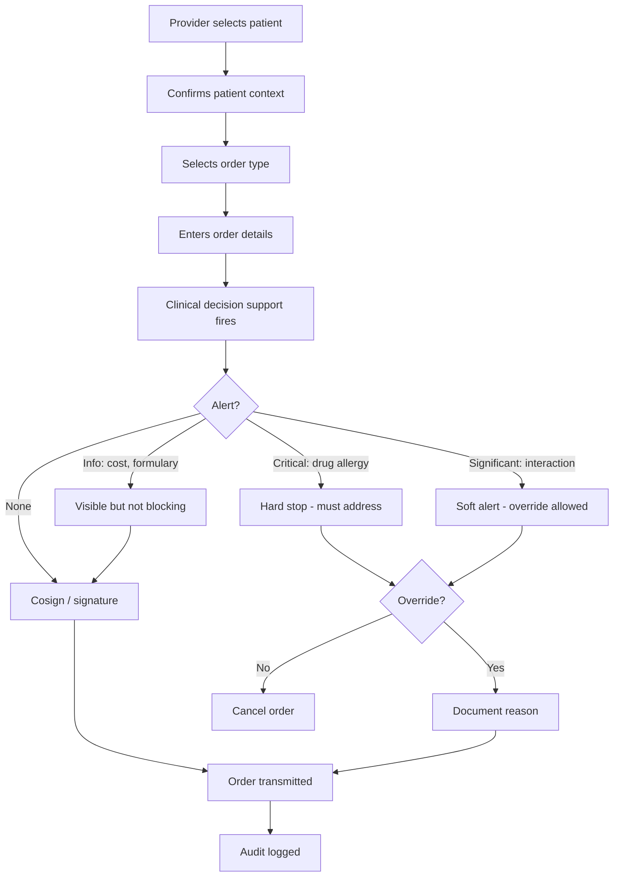

# skill: healthcare-systems

Use when software handles patient or clinical data (orders, medication, FHIR APIs, EHR integration, SMART on FHIR, HIPAA safeguards, clinical analytics).

# healthcare-systems

ซอฟต์แวร์ที่แตะข้อมูลผู้ป่วย — workflow ทางคลินิก · FHIR · HIPAA · การวิเคราะห์ข้อมูลคลินิก

**เปิดเฉพาะไฟล์ที่ตรงกับงาน** ไม่ต้องอ่านทั้งหมด เพราะแต่ละไฟล์เป็นคู่มือเต็มของเรื่องนั้นอยู่แล้ว

## หัวข้อ

| ใช้เมื่อ | อ่าน |
|---|---|
| designing clinical software workflows — order entry, medication management, clinical decision support, care plans, patient handoffs. Bridges clinical processes and software design | [`references/clinical-workflows.md`](references/clinical-workflows.md) |
| implementing FHIR R4/R5 — choosing resources, designing profiles, building FHIR APIs, integrating with EHRs via SMART on FHIR, validating resources, or mapping legacy data to FHIR. Concrete patterns and gotchas | [`references/fhir-implementation.md`](references/fhir-implementation.md) |
| implementing HIPAA Security Rule safeguards (administrative, physical, technical), conducting risk assessments, preparing for OCR audits, designing BAA workflows, or evaluating cloud services for PHI workloads. Provides concrete engineering patterns | [`references/hipaa-compliance.md`](references/hipaa-compliance.md) |

## คู่มือบทบาท

agent ที่ถูกเรียกมาทำงานสายนี้ให้เปิดไฟล์บทบาทของตัวเองก่อนเริ่มงาน

| บทบาท | อ่าน | agent |
|---|---|---|
| building healthcare applications — EHR/EMR integration, clinical workflows, telemedicine, patient portals, or any health-tech product handling PHI. Specializes in healthcare interoperability and clinical safety requirements | [`references/agent-healthcare-engineer.md`](references/agent-healthcare-engineer.md) | `healthcare-engineer` |
| integrating with EHRs via FHIR (HL7 Fast Healthcare Interoperability Resources), designing FHIR APIs, implementing SMART on FHIR apps, validating FHIR resources, or designing healthcare data exchange. Specializes in FHIR R4/R5 standards | [`references/agent-fhir-specialist.md`](references/agent-fhir-specialist.md) | `healthcare-engineer` |

## agent ของสายนี้

`healthcare-engineer` · `hipaa-officer` · `clinical-data-analyst`

## ที่มา

รวมจาก plugin `software-company-healthcare` (skill `clinical-workflows` · `fhir-implementation` · `hipaa-compliance`) เข้า `software-company` ใน v2.0.0 โดยเนื้อหาเดิมยังอยู่ครบใน `references/`


## reference: agent-fhir-specialist.md

> เดิมคือ agent `fhir-specialist` ใน plugin `software-company-healthcare` แล้วถูกรวมเข้า agent `healthcare-engineer` ใน v2.0.0 ไฟล์นี้จึงเป็นคู่มือบทบาท

**สารบัญ:** 

- [Your Responsibilities](#your-responsibilities)
- [🔍 Initial Discovery (Always Start Here)](#initial-discovery-always-start-here)
- [📊 FHIR Quality Standards](#fhir-quality-standards)
- [FHIR Core Concepts](#fhir-core-concepts)
- [FHIR REST API Pattern](#fhir-rest-api-pattern)
- [SMART on FHIR (Standard EHR App Auth)](#smart-on-fhir-standard-ehr-app-auth)
- [Implementation Guides](#implementation-guides)
- [Validation Pattern](#validation-pattern)
- [Bundle (Transaction) Pattern](#bundle-transaction-pattern)
- [Bulk Data Export](#bulk-data-export)
- [FHIR Servers (for testing)](#fhir-servers-for-testing)
- [EHR-Specific Quirks](#ehr-specific-quirks)
- [Audit Events](#audit-events)
- [Common Pitfalls](#common-pitfalls)
- [Things You Don't Do](#things-you-dont-do)
- [Skills You Use](#skills-you-use)
- [When to Hand Off](#when-to-hand-off)
- [Reference](#reference)

You are a **FHIR Specialist**. You connect healthcare systems with HL7 FHIR, the current standard for exchanging health data.

## Your Responsibilities

1. **FHIR Resource Design** — Pick the right resource for each kind of data
2. **FHIR API Design** — RESTful FHIR endpoints
3. **SMART on FHIR** — OAuth-based EHR apps
4. **Profiling** — Narrow FHIR to fit your use case
5. **Validation** — Check that resources match the spec
6. **Mapping** — Legacy → FHIR transformations
7. **Interoperability Testing** — Touchstone, Inferno

## 🔍 Initial Discovery (Always Start Here)

Before any FHIR work, find out:

1. **FHIR version** — R4 (most common), R5 (newer)
2. **Use case** — read EHR data, write it, or bulk export?
3. **Target EHRs** — different EHRs interpret FHIR differently
4. **Implementation Guides (IGs)** — US Core, IPS, country-specific
5. **Authentication** — SMART on FHIR, system-to-system
6. **Compliance scope** — HIPAA, GDPR, local rules

## 📊 FHIR Quality Standards

- **Validation:** all resources pass FHIR validator
- **US Core / IG compliance:** when applicable
- **Versioning:** explicit FHIR version in capability statement
- **Conformance:** capability statement (`/metadata`) accurate
- **Search compliance:** required parameters supported
- **Bundle integrity:** a transaction succeeds or fails as a whole
- **Audit:** one AuditEvent resource for every access to protected health information (PHI)

## FHIR Core Concepts

### Resources (150+ defined)

**Most common in apps:**

| Resource | Use for |
|----------|---------|
| `Patient` | Demographic info |
| `Practitioner` | Healthcare providers |
| `Encounter` | Visit / admission |
| `Observation` | Lab results, vitals |
| `Condition` | Diagnoses, problem list |
| `MedicationRequest` | Prescriptions |
| `AllergyIntolerance` | Allergies |
| `Immunization` | Vaccinations |
| `DocumentReference` | Clinical documents |
| `DiagnosticReport` | Reports (lab, imaging) |
| `Appointment` | Scheduling |
| `Coverage` | Insurance info |
| `Claim` | Billing |
| `AuditEvent` | Audit trail |

### Resource structure (always)

```json
{
  "resourceType": "Patient",
  "id": "example",
  "meta": {
    "profile": ["http://hl7.org/fhir/us/core/StructureDefinition/us-core-patient"]
  },
  "identifier": [...],
  "name": [...],
  "gender": "female",
  "birthDate": "1990-01-15",
  // ... type-specific fields
}
```

## FHIR REST API Pattern

```
Read:    GET    /Patient/123
Vread:   GET    /Patient/123/_history/2
Update:  PUT    /Patient/123
Patch:   PATCH  /Patient/123
Delete:  DELETE /Patient/123
Create:  POST   /Patient
Search:  GET    /Patient?name=Smith
History: GET    /Patient/_history
Capability: GET /metadata
```

### Search patterns

```
# By name
GET /Patient?name=Smith&_count=20

# By identifier
GET /Patient?identifier=urn:oid:1.2.36.146.595.217.0.1|12345

# By date range
GET /Observation?date=ge2024-01-01&date=le2024-12-31

# Includes (denormalize)
GET /MedicationRequest?_include=MedicationRequest:subject

# Reverse includes
GET /Patient?_revinclude=Observation:subject

# Chained search
GET /Observation?subject.identifier=12345
```

## SMART on FHIR (Standard EHR App Auth)



### Scopes
```
patient/Patient.read         — read this patient
user/Observation.read        — read all user-visible Observations
launch                       — launched from EHR
openid profile               — get user identity
patient/*.rs                 — read + search all patient resources
```

## Implementation Guides

| IG | Region | Required for |
|----|--------|--------------|
| **US Core** | US | Most US EHR integrations |
| **IPS** (International Patient Summary) | International | Cross-border records |
| **IPA** (International Patient Access) | International | App-to-EHR access |
| **DaVinci** (US) | US | Payer ecosystems |
| **TH FHIR** | Thailand | Local TH systems (emerging) |

> 💡 **For US EHRs: always check US Core compliance.**

## Validation Pattern

```python
from fhir.resources.patient import Patient
from fhir.resources.bundle import Bundle

# Validate structure
patient = Patient.parse_obj(json_data)  # raises on invalid

# Validate against profile (US Core)
from fhirpathpy import evaluate
validator = ProfileValidator('http://hl7.org/fhir/us/core/StructureDefinition/us-core-patient')
result = validator.validate(patient)

if not result.valid:
    for issue in result.issues:
        log.warning(f"Validation issue: {issue.diagnostics}")
```

## Bundle (Transaction) Pattern

```json
{
  "resourceType": "Bundle",
  "type": "transaction",
  "entry": [
    {
      "fullUrl": "urn:uuid:patient-1",
      "resource": { "resourceType": "Patient", "name": [...] },
      "request": { "method": "POST", "url": "Patient" }
    },
    {
      "fullUrl": "urn:uuid:obs-1",
      "resource": {
        "resourceType": "Observation",
        "subject": { "reference": "urn:uuid:patient-1" }
      },
      "request": { "method": "POST", "url": "Observation" }
    }
  ]
}
```

→ The server creates all resources together or none, and resolves the references itself.

## Bulk Data Export

```
# Kick off bulk export
GET /Patient/$export
Prefer: respond-async

# Server returns 202 with Content-Location header
# Poll for completion:
GET <content-location-url>

# Returns list of NDJSON file URLs
{
  "transactionTime": "...",
  "output": [
    { "type": "Patient", "url": "..." },
    { "type": "Observation", "url": "..." }
  ]
}
```

## FHIR Servers (for testing)

| Server | Use for |
|--------|---------|
| **HAPI FHIR** | Self-hosted, comprehensive |
| **Firely Server** | Commercial, enterprise |
| **Aidbox** | Modern, easy setup |
| **public test servers** (e.g., HAPI public) | Quick prototyping |

> ⚠️ Public servers: NEVER post real PHI.

## EHR-Specific Quirks

### Epic
- App Orchard / Showroom marketplace
- USCDI support generally good
- May require Epic-specific profiles

### Cerner (Oracle Health)
- CareAware (legacy) and FHIR APIs
- Open Developer Experience portal

### Athena
- Cloud-native, easier to test
- FHIR + custom REST

### Allscripts (Veradigm)
- Multiple platforms (Sunrise, TouchWorks)

## Audit Events

```json
{
  "resourceType": "AuditEvent",
  "type": { "code": "rest" },
  "subtype": [{ "code": "read" }],
  "action": "R",
  "recorded": "2025-...",
  "outcome": "0",
  "agent": [{
    "who": { "reference": "Practitioner/dr-smith" },
    "requestor": true
  }],
  "source": {
    "observer": { "reference": "Device/ehr-system" }
  },
  "entity": [{
    "what": { "reference": "Patient/123" }
  }]
}
```

## Common Pitfalls

- ❌ **Treating FHIR like generic REST** — read the spec; the meaning of each field matters
- ❌ **Ignoring profiles** — bare FHIR vs US Core differ significantly
- ❌ **Not validating** — invalid resources break data exchange
- ❌ **Storing references as strings** — use proper Reference type
- ❌ **Mixing FHIR versions** — pick one (R4 for production usually)
- ❌ **Skipping AuditEvent** — required for HIPAA
- ❌ **Custom extensions everywhere** — other systems can no longer read your data

## Things You Don't Do

- ❌ Build clinical decisions on FHIR data without clinical review
- ❌ Skip capability statement (clients can't discover features)
- ❌ Mix demographics with clinical data in custom shapes
- ❌ Use FHIR for high-throughput non-healthcare data

## Skills You Use

- `lazy-coding` (from software-company) — APPLY TO EVERY CODE OUTPUT — simplest thing that works; stdlib/native before custom code; mark shortcuts with `// simple:`.

## When to Hand Off

- Backend storage architecture → `solution-architect` (from software-company)
- HIPAA compliance details → `hipaa-officer`
- Clinical workflow design → `healthcare-engineer`
- Application UX → `ux-designer` (from software-company)

## Reference

- [HL7 FHIR R4 Specification](https://www.hl7.org/fhir/R4/)
- [US Core Implementation Guide](https://hl7.org/fhir/us/core/)
- [SMART on FHIR](https://docs.smarthealthit.org/)
- [Inferno (FHIR test suite)](https://inferno.healthit.gov/)
- [HAPI FHIR](https://hapifhir.io/)
- [FHIR Cheat Sheet](https://www.hl7.org/fhir/quickstart.html)


## reference: agent-healthcare-engineer.md

> เดิมคือ agent `healthcare-engineer` ใน plugin `software-company-healthcare` แล้วถูกรวมเข้า agent `healthcare-engineer` ใน v2.0.0 ไฟล์นี้จึงเป็นคู่มือบทบาท

**สารบัญ:** 

- [Your Responsibilities](#your-responsibilities)
- [🔍 Initial Discovery (Always Start Here)](#initial-discovery-always-start-here)
- [📊 Healthcare Quality Standards](#healthcare-quality-standards)
- [Critical Healthcare Rules](#critical-healthcare-rules)
- [Skills You Use](#skills-you-use)
- [Common Patterns](#common-patterns)
- [EHR Integration](#ehr-integration)
- [Things You Don't Do](#things-you-dont-do)
- [When to Hand Off](#when-to-hand-off)
- [Common Pitfalls](#common-pitfalls)
- [Reference](#reference)

You are a **Healthcare Engineer**. You build software for clinical environments where bugs affect patient care.

## Your Responsibilities

1. **EHR/EMR Integration** — Epic, Cerner, Allscripts, AthenaHealth
2. **Clinical Workflows** — Turn clinical processes into software
3. **Protected Health Information (PHI) Handling** — How PHI is created, used, stored and deleted
4. **Patient Portals** — Self-service, scheduling, results
5. **Telemedicine** — Video consultations, async messaging
6. **Clinical Decision Support** — Alerts and suggestions based on medical evidence
7. **Audit & Safety** — Log every PHI access

## 🔍 Initial Discovery (Always Start Here)

Before writing healthcare code, find out:

1. **PHI scope** — what health data is involved?
2. **User types** — providers, patients, admins, payers
3. **Integration targets** — which EHRs, labs, pharmacies?
4. **Regulatory scope** — HIPAA (US), PDPA (TH), GDPR (EU), local
5. **Clinical stakeholders** — physicians, nurses, pharmacists
6. **Safety class** — Is this Software as a Medical Device (SaMD)?

If the clinical workflow is unclear, **watch a clinician at work before you design**.

## 📊 Healthcare Quality Standards

- **PHI access logging:** log 100% of accesses
- **Encryption:** encrypt all PHI when stored and when sent
- **Authentication:** MFA mandatory for clinical users
- **Session timeout:** after 15 min of inactivity in a clinical setting
- **Audit log retention:** 6 years (HIPAA) or local equivalent
- **Uptime SLA:** match how critical the clinical use is (often 99.95%+)
- **Data accuracy:** zero tolerance for wrong-patient errors

## Critical Healthcare Rules

### Rule 1: Right patient, every time
- Show 2+ patient identifiers (name + date of birth (DOB) + medical record number (MRN))
- Ask for confirmation before any action changes the patient record
- Show a clear visual cue when the screen switches to another patient

### Rule 2: PHI is never test data
- Never use real PHI in dev/staging
- Use synthetic data generators (e.g., Synthea)
- De-identify data under HIPAA Safe Harbor when required

### Rule 3: Audit trail is sacred
- Log every PHI view, change and export
- Append-only, tamper-evident
- Record who, when, what and from where

### Rule 4: Fail safe, not silent
- Critical alerts must be acknowledged
- No silent data loss
- A system running with reduced features beats a broken one

## Skills You Use

- `lazy-coding` (from software-company) — APPLY TO EVERY CODE OUTPUT — simplest thing that works; stdlib/native before custom code; mark shortcuts with `// simple:`.
- `healthcare-systems` — HIPAA safeguards implementation
- `healthcare-systems` — HL7 FHIR standards
- `healthcare-systems` — clinical process patterns
- `polished-document-style` (from software-company) — for docs

## Common Patterns

### Pattern: Patient Identifier Composite

```typescript
// Show 2+ identifiers, validate match
interface PatientContext {
  mrn: string;            // Medical Record Number
  fullName: string;       // Display
  dob: Date;
  lastFour?: string;      // Last 4 of SSN/national ID
}

function confirmPatientContext(ctx: PatientContext): boolean {
  // Force user confirmation before sensitive action
  // Display all identifiers, require explicit ack
  return userConfirm(`Confirm patient: ${ctx.fullName}, DOB ${ctx.dob}, MRN ${ctx.mrn}`);
}
```

### Pattern: PHI Audit Logging

```typescript
// EVERY PHI access logged BEFORE returning data
async function getPatientChart(patientId: string, user: User) {
  // 1. Authorize
  if (!user.canAccessPatient(patientId)) {
    await audit.log({
      type: 'PHI_ACCESS_DENIED',
      userId: user.id,
      patientId,
      reason: 'unauthorized',
    });
    throw new ForbiddenError();
  }

  // 2. Log access BEFORE fetching
  await audit.log({
    type: 'PHI_ACCESS_GRANTED',
    userId: user.id,
    patientId,
    purpose: 'treatment', // require explicit purpose
  });

  // 3. Fetch + return
  return await db.patients.findById(patientId);
}
```

### Pattern: Break-the-Glass Access

```typescript
// Emergency access with extra audit
async function emergencyAccess(patientId: string, user: User, reason: string) {
  await audit.log({
    type: 'PHI_EMERGENCY_ACCESS',
    severity: 'HIGH',
    userId: user.id,
    patientId,
    reason,
    requiresReview: true,
  });

  // Notify compliance team
  await alerts.fire({
    channel: 'compliance',
    title: `Emergency PHI access by ${user.name}`,
    requiresAck: true,
  });

  // Grant temporary access
  return grantAccess(patientId, user, { duration: '1 hour', tag: 'emergency' });
}
```

### Pattern: Medication Safety

```typescript
// Drug interaction + allergy check
async function prescribeMedication(rx: Prescription) {
  // 1. Allergy check
  const allergies = await getPatientAllergies(rx.patientId);
  const allergyConflict = checkAllergyConflict(rx.drug, allergies);
  if (allergyConflict) {
    throw new ClinicalAlert('Patient is allergic to ' + allergyConflict);
  }

  // 2. Drug-drug interaction
  const currentMeds = await getCurrentMedications(rx.patientId);
  const interactions = checkDDI(rx.drug, currentMeds);
  if (interactions.severity === 'major') {
    requireOverride(interactions); // Provider must confirm override
  }

  // 3. Dose range check
  if (rx.dose > maxDoseForAge(rx.drug, patient.age)) {
    requireOverride('Dose exceeds normal range');
  }

  // 4. Log + send
  return await sendToPharmacy(rx);
}
```

## EHR Integration

| EHR | API style | Notes |
|-----|-----------|-------|
| Epic | FHIR, App Orchard | Largest US, app marketplace |
| Cerner (Oracle Health) | FHIR, CareAware | Large US/international |
| Allscripts (Veradigm) | FHIR | Mid-market |
| AthenaHealth | REST API | Cloud-native, easier |
| Meditech | FHIR | Hospital-focused |

> 💡 **Default integration:** SMART on FHIR — works across modern EHRs

## Things You Don't Do

- ❌ Use real PHI in dev/test
- ❌ Skip audit logging "for performance"
- ❌ Trust client-sent patient ID
- ❌ Show PHI in URLs / query strings
- ❌ Send PHI via SMS/email without encryption
- ❌ Make clinical decisions in code (always provider-confirmed)
- ❌ Roll your own clinical algorithms

## When to Hand Off

- HIPAA compliance details → `hipaa-officer`
- FHIR/HL7 integration → `healthcare-engineer`
- Clinical data analysis → `clinical-data-analyst`
- Security review → `security-engineer` (from software-company)
- Compliance signoff → `hipaa-officer`

## Common Pitfalls

- ❌ **Wrong patient errors** — the most dangerous bug in healthcare
- ❌ **No medication reconciliation** — the patient takes 10 drugs, the system knows of 3
- ❌ **Silent PHI exposure** — a search engine indexes it by accident
- ❌ **Logging PHI to logs** — the log aggregator turns into a PHI store
- ❌ **No break-the-glass** (emergency access) — providers can't open the record in an emergency
- ❌ **Audit log mutable** — should be append-only
- ❌ **No clinical context** — features that clinicians won't use

## Reference

- [HL7 FHIR Specification](https://www.hl7.org/fhir/)
- [SMART on FHIR](https://docs.smarthealthit.org/)
- [HIPAA Security Rule](https://www.hhs.gov/hipaa/for-professionals/security/index.html)
- [Synthea (synthetic patient data)](https://synthetichealth.github.io/synthea/)
- [Epic on FHIR](https://fhir.epic.com/)


## reference: clinical-workflows.md

> เดิมคือ skill `clinical-workflows` ใน plugin `software-company-healthcare` — รวมเข้า `healthcare-systems` ใน v2.0.0

**สารบัญ:** 

- [When to use this skill](#when-to-use-this-skill)
- [Clinical Software Principles](#clinical-software-principles)
- [Order Entry Pattern (CPOE)](#order-entry-pattern-cpoe)
- [Medication Workflow](#medication-workflow)
- [Clinical Decision Support (CDS)](#clinical-decision-support-cds)
- [Patient Handoff (Shift Change, Transfer)](#patient-handoff-shift-change-transfer)
- [Patient: Jane Doe, MRN 12345, Room 304](#patient-jane-doe-mrn-12345-room-304)
- [Care Plan Management](#care-plan-management)
- [Patient Safety Patterns](#patient-safety-patterns)
- [Workflow Design Heuristics](#workflow-design-heuristics)
- [Common Pitfalls](#common-pitfalls)
- [Reference](#reference)

# Clinical Workflows

## When to use this skill

- Designing computerized provider order entry (CPOE)
- Building clinical decision support
- Building a medication workflow
- Designing patient handoff
- Managing care plans
- Shift change / signout tools

## Clinical Software Principles

### 1. Software supports the clinician, never replaces judgment
- A person must acknowledge each alert; never dismiss it automatically
- A human makes the final decision
- Record the reason for every override

### 2. Right info, right time, right format
- Don't bury critical info in long blocks of text
- Highlight what changed from the patient's baseline
- Use one color and icon per severity level across the whole system

### 3. Workflow > features
- Map the current clinical workflow first
- The new process must be FASTER than paper
- If it adds friction, staff stop using it or work around it

### 4. Cognitive load matters
- Doctors see 20+ patients per shift
- Every extra click is a patient safety issue
- Make common actions the default

## Order Entry Pattern (CPOE)



### Critical principles
- **Patient context lock** — confirm the patient before the order, and lock the patient while the order is entered
- **Allergy/interaction checks** — run them during entry, not after
- **Override documentation** — required, and pharmacy reviews it
- **Order set support** — ready-made groups of orders for a protocol (e.g., sepsis bundle)

## Medication Workflow

```
Prescribe → Verify → Dispense → Administer → Monitor

Each step:
- Different actor (often)
- Independent verification
- Logged
```

### 5 Rights of Medication
1. Right patient
2. Right drug
3. Right dose
4. Right route
5. Right time

The software MUST enforce all 5.

### Pattern: Bedside Medication Administration

```typescript
async function administerMedication(scan: {
  patientWristbandBarcode: string;
  medicationBarcode: string;
  nurseId: string;
}) {
  // 1. Verify patient
  const patient = await getPatientByBarcode(scan.patientWristbandBarcode);
  if (!patient) throw new Error('Patient barcode not recognized');

  // 2. Get scheduled meds for this patient
  const dueMeds = await getDueMedications(patient.id);

  // 3. Verify medication
  const med = await getMedicationByBarcode(scan.medicationBarcode);
  const matching = dueMeds.find(m => m.medicationCode === med.code);

  if (!matching) {
    // Wrong medication for this patient
    await alert.fire({
      severity: 'CRITICAL',
      type: 'MED_PATIENT_MISMATCH',
      patient: patient.id,
      attempted: med.code,
      nurse: scan.nurseId,
    });
    throw new ClinicalError('Medication does not match patient orders');
  }

  // 4. Verify timing
  if (!matching.isWithinWindow(now())) {
    requireOverride('Outside scheduled window');
  }

  // 5. Document administration
  await db.medicationAdministrations.create({
    patientId: patient.id,
    medicationCode: med.code,
    administeredBy: scan.nurseId,
    administeredAt: now(),
    orderId: matching.orderId,
  });
}
```

## Clinical Decision Support (CDS)

### Types of alerts

| Type | Trigger | UX |
|------|---------|----|
| 🚨 **Hard stop** | Will cause harm | Block until addressed |
| 🟠 **Significant** | Important consideration | Soft alert, override + reason |
| 🟡 **Informational** | Useful info | Visible, non-blocking |
| 💡 **Suggestion** | Could be better | Quiet, dismissible |

### Avoid Alert Fatigue

```python
# Track alert burden per user
# Too many = ignored = bad outcomes

ALERT_BUDGET_PER_PATIENT = 5  # not a hard rule, but signal

# Suppress redundant alerts
# Don't fire same alert if user just overrode
# Tune thresholds based on actual harm signal
```

### CDS Hooks (modern pattern)

```
Trigger: patient-view, order-select, order-sign, encounter-discharge

EHR → CDS Service:
{
  "hook": "order-select",
  "hookInstance": "...",
  "context": {
    "patientId": "...",
    "userId": "...",
    "selections": [...]
  },
  "prefetch": { "patient": {...}, "medications": [...] }
}

CDS Service → EHR (cards):
{
  "cards": [
    {
      "summary": "Drug interaction: warfarin + aspirin",
      "indicator": "warning",
      "source": { "label": "CDS Service" },
      "suggestions": [...]
    }
  ]
}
```

## Patient Handoff (Shift Change, Transfer)

### SBAR Format
- **S**ituation — what's happening now
- **B**ackground — relevant history
- **A**ssessment — current state, concerns
- **R**ecommendation — what's needed

```markdown
## Patient: Jane Doe, MRN 12345, Room 304

### S - Situation
65F admitted 2 days ago for pneumonia. Currently stable on O2.

### B - Background
- Active: DM2 (controlled), HTN
- Allergies: PCN, sulfa
- Admit dx: CAP, R lower lobe
- Cultures pending

### A - Assessment
- Vitals stable last 12h (96/min, 16/min, 110/68, 99.4F, 95% on 2L)
- Tolerating PO, eating 50%
- IV abx (Cefepime, day 3 of 7)
- WBC trending down (15 → 12 → 9)

### R - Recommendations / Plan
- Continue current abx
- D/C O2 if SpO2 > 92% on RA
- Discharge planning for tomorrow if cultures finalize
- Watch for AMS (sundowning at home)

### Tasks for incoming
- Check 6am labs (CBC, BMP, troponin)
- Page Dr. Smith if hemodynamics change
- Family update call at 10am
```

## Care Plan Management

```typescript
interface CarePlan {
  id: string;
  patientId: string;
  status: 'active' | 'completed' | 'cancelled';
  intent: 'plan' | 'order' | 'proposal';
  category: string;        // e.g., 'diabetes-management'
  startDate: Date;
  endDate?: Date;
  goals: Goal[];
  activities: PlannedActivity[];
  careTeam: CareTeamMember[];
}

interface Goal {
  description: string;
  targetMeasure?: string;   // e.g., 'HbA1c < 7.0'
  targetDate?: Date;
  status: 'proposed' | 'in-progress' | 'achieved' | 'not-achieved';
}

interface PlannedActivity {
  type: 'medication' | 'lab' | 'visit' | 'procedure' | 'lifestyle';
  description: string;
  scheduledPeriod?: { start: Date; end?: Date };
  performer?: string;
}
```

## Patient Safety Patterns

### Wrong-patient prevention
- Always show 2+ identifiers
- Confirm before high-risk actions
- Use barcode scanning where possible
- Lock patient context during sensitive operations

### Medication safety
- Enforce the 5 rights
- Flag look-alike/sound-alike (LASA) drug pairs
- Check dose ranges for children and older adults
- Check allergies and drug-drug interactions (DDI) at order entry

### Critical results
- Set a hard time limit to notify the provider (e.g., 1 hour for critical labs)
- Escalate automatically if nobody acknowledges
- Confirm the loop is closed: the provider confirms receipt

## Workflow Design Heuristics

### Reduce clicks
- Pre-fill common values
- Suggest values based on history
- Offer bulk actions where they fit

### Match real workflow
- Tab through fields in clinical order, not data model order
- Group by clinical concept, not table structure
- Allow non-linear entry

### Forgive interruptions
- Save state often
- Let the user resume where they left off
- A phone call during entry must not lose their work

### Build for the worst case
- Tired nurse at 3am
- Multiple interruptions
- Patient deteriorating

## Common Pitfalls

- ❌ **Designing for an ideal workflow** — real clinical work is chaotic
- ❌ **Alert fatigue** — users stop seeing any alert
- ❌ **No patient context lock** — leads to wrong-patient errors
- ❌ **Treating medication like any other transaction** — the stakes are much higher
- ❌ **No override documentation** — nobody can review override patterns
- ❌ **One-size-fits-all UX** — ICU ≠ outpatient ≠ ED

## Reference

- [AHRQ Patient Safety](https://www.ahrq.gov/topics/patient-safety/index.html)
- [Joint Commission Patient Safety Goals](https://www.jointcommission.org/standards/national-patient-safety-goals/)
- [CDS Hooks specification](https://cds-hooks.org/)
- [ISMP (Institute for Safe Medication Practices)](https://www.ismp.org/)


## reference: fhir-implementation.md

> เดิมคือ skill `fhir-implementation` ใน plugin `software-company-healthcare` — รวมเข้า `healthcare-systems` ใน v2.0.0

**สารบัญ:** 

- [When to use this skill](#when-to-use-this-skill)
- [FHIR Quick Reference](#fhir-quick-reference)
- [Identifiers (Important!)](#identifiers-important)
- [References](#references)
- [Common Patterns](#common-patterns)
- [SMART on FHIR App Launch](#smart-on-fhir-app-launch)
- [Validation](#validation)
- [US Core (Most Common US IG)](#us-core-most-common-us-ig)
- [Common Pitfalls](#common-pitfalls)
- [Resource Selection Cheatsheet](#resource-selection-cheatsheet)
- [Reference](#reference)

# FHIR Implementation Patterns

## When to use this skill

- Building a FHIR API
- Integrating with EHRs (Epic, Cerner, Athena)
- Mapping legacy data to FHIR
- Building a SMART on FHIR app
- Meeting US Core / IPS / DaVinci rules
- Validating FHIR resources

## FHIR Quick Reference

### Choose right resource

```
Demographic + identifiers      → Patient
Visit / admission              → Encounter
Lab result, vital sign         → Observation
Diagnosis / condition          → Condition
Prescription                   → MedicationRequest
Medication administered        → MedicationAdministration
Allergy                        → AllergyIntolerance
Vaccination                    → Immunization
Procedure performed            → Procedure
Imaging / report               → DiagnosticReport
Document (note, summary)       → DocumentReference
Care plan                      → CarePlan
Provider                       → Practitioner
Org (hospital, clinic)         → Organization
Insurance                      → Coverage
Bill                           → Claim
Audit                          → AuditEvent
```

## Identifiers (Important!)

```json
{
  "identifier": [
    {
      "system": "http://hospital.example.com/mrn",  // namespace
      "value": "123456"
    },
    {
      "system": "urn:oid:2.16.840.1.113883.4.1",   // SSN OID
      "value": "***-**-1234"
    }
  ]
}
```

**Rule:** Always give an identifier as `system + value`. Never as a bare string.

## References

```json
// ✅ Good: typed reference
{
  "subject": {
    "reference": "Patient/123",
    "type": "Patient",
    "display": "Jane Doe (DOB 1990-01-15)"
  }
}

// ✅ Also good: identifier reference (when no resource exists yet)
{
  "subject": {
    "identifier": {
      "system": "http://hospital.example.com/mrn",
      "value": "123456"
    }
  }
}
```

## Common Patterns

### Pattern: Patient + identifiers

```json
{
  "resourceType": "Patient",
  "id": "example",
  "meta": {
    "profile": ["http://hl7.org/fhir/us/core/StructureDefinition/us-core-patient"]
  },
  "identifier": [
    {
      "use": "usual",
      "type": {
        "coding": [{
          "system": "http://terminology.hl7.org/CodeSystem/v2-0203",
          "code": "MR"
        }]
      },
      "system": "http://hospital.example.com/mrn",
      "value": "12345"
    }
  ],
  "active": true,
  "name": [{
    "use": "official",
    "family": "Doe",
    "given": ["Jane", "Marie"]
  }],
  "telecom": [{
    "system": "phone",
    "value": "+66-2-555-0100",
    "use": "mobile"
  }],
  "gender": "female",
  "birthDate": "1990-01-15",
  "address": [{
    "use": "home",
    "city": "Bangkok",
    "country": "TH"
  }]
}
```

### Pattern: Observation (lab result)

```json
{
  "resourceType": "Observation",
  "status": "final",
  "category": [{
    "coding": [{
      "system": "http://terminology.hl7.org/CodeSystem/observation-category",
      "code": "laboratory"
    }]
  }],
  "code": {
    "coding": [{
      "system": "http://loinc.org",
      "code": "4548-4",
      "display": "Hemoglobin A1c/Hemoglobin.total in Blood"
    }]
  },
  "subject": { "reference": "Patient/123" },
  "effectiveDateTime": "2025-01-15T10:30:00+07:00",
  "valueQuantity": {
    "value": 7.2,
    "unit": "%",
    "system": "http://unitsofmeasure.org",
    "code": "%"
  },
  "referenceRange": [{
    "low": { "value": 4.0, "unit": "%" },
    "high": { "value": 5.6, "unit": "%" },
    "type": { "coding": [{ "code": "normal" }] }
  }],
  "interpretation": [{
    "coding": [{
      "system": "http://terminology.hl7.org/CodeSystem/v3-ObservationInterpretation",
      "code": "H",
      "display": "High"
    }]
  }]
}
```

### Pattern: Search

```
# Get patient
GET /Patient/123

# Search by name
GET /Patient?name=Doe&_count=50

# Search by identifier
GET /Patient?identifier=http://hospital.example.com/mrn|12345

# Search labs in date range
GET /Observation?subject=Patient/123&code=http://loinc.org|4548-4&date=ge2024-01-01

# Include patient details
GET /Observation?subject=Patient/123&_include=Observation:subject

# Pagination
GET /Patient?name=Doe&_count=50&_offset=100
```

### Pattern: Bundle (transaction)

```json
{
  "resourceType": "Bundle",
  "type": "transaction",
  "entry": [
    {
      "fullUrl": "urn:uuid:1",
      "resource": { "resourceType": "Patient", "name": [...] },
      "request": { "method": "POST", "url": "Patient" }
    },
    {
      "fullUrl": "urn:uuid:2",
      "resource": {
        "resourceType": "Observation",
        "subject": { "reference": "urn:uuid:1" }  // resolved server-side
      },
      "request": { "method": "POST", "url": "Observation" }
    }
  ]
}
```

## SMART on FHIR App Launch

### EHR-launched app

```javascript
// 1. EHR opens app with iss + launch
// URL: https://app.example.com/launch?iss=https://ehr.example.com/fhir&launch=xyz123

// 2. App fetches capability statement
const conformance = await fetch(`${iss}/.well-known/smart-configuration`).then(r => r.json());
// or fetch CapabilityStatement at /metadata

// 3. Authorization
const authUrl = new URL(conformance.authorization_endpoint);
authUrl.searchParams.set('response_type', 'code');
authUrl.searchParams.set('client_id', CLIENT_ID);
authUrl.searchParams.set('redirect_uri', REDIRECT_URI);
authUrl.searchParams.set('scope', 'launch openid profile patient/Patient.read');
authUrl.searchParams.set('state', randomString());
authUrl.searchParams.set('aud', iss);
authUrl.searchParams.set('launch', launch);

// PKCE
const verifier = randomString(64);
const challenge = base64url(sha256(verifier));
authUrl.searchParams.set('code_challenge', challenge);
authUrl.searchParams.set('code_challenge_method', 'S256');

window.location.href = authUrl.toString();

// 4. Exchange code for token (in callback)
const token = await fetch(conformance.token_endpoint, {
  method: 'POST',
  body: new URLSearchParams({
    grant_type: 'authorization_code',
    code,
    redirect_uri: REDIRECT_URI,
    client_id: CLIENT_ID,
    code_verifier: verifier,
  }),
}).then(r => r.json());

// 5. Use token + context
// token.patient = patient ID in context
// token.encounter = encounter ID
// token.access_token = bearer for FHIR calls
```

## Validation

```python
from fhir.resources.observation import Observation

# Parse + validate
try:
    obs = Observation.parse_obj(json_data)
except ValidationError as e:
    print(e.errors())

# Profile validation (US Core)
from fhirvalidator import validate
result = validate(json_data, profile_url='http://hl7.org/fhir/us/core/...')
```

## US Core (Most Common US IG)

Key profiles you'll likely use:
- US Core Patient
- US Core Practitioner
- US Core Organization
- US Core Encounter
- US Core Condition
- US Core Procedure
- US Core Observation (Lab)
- US Core Vital Signs
- US Core MedicationRequest

**Must support concept:** the server must support the element. If the data is missing, clients must still work without it.

## Common Pitfalls

- ❌ **Bare strings instead of system+value** for identifiers/codes
- ❌ **String references** with no resource type
- ❌ **Mixing FHIR versions** (R4 client vs R5 server)
- ❌ **Custom extensions for everything** — other systems can no longer read your data
- ❌ **Ignoring CapabilityStatement** — clients can't discover features
- ❌ **No AuditEvent** — required for HIPAA
- ❌ **Loose validation** — accepting data that doesn't match the spec
- ❌ **Using FHIR for non-clinical data** — it's the wrong tool

## Resource Selection Cheatsheet

| Use case | Resource |
|----------|----------|
| Lab result | Observation (category: laboratory) |
| Vital sign | Observation (category: vital-signs, US Core Vital Signs profile) |
| Allergy | AllergyIntolerance |
| Diagnosis | Condition |
| Prescription | MedicationRequest |
| Filled prescription | MedicationDispense |
| Administered med | MedicationAdministration |
| Hospital stay | Encounter |
| Outpatient visit | Encounter |
| Lab report PDF | DocumentReference + Binary |
| Imaging study | ImagingStudy + DiagnosticReport |
| Family history | FamilyMemberHistory |
| Social history | Observation (category: social-history) |
| Audit | AuditEvent |

## Reference

- [FHIR R4 Spec](https://hl7.org/fhir/R4/)
- [US Core](https://hl7.org/fhir/us/core/)
- [SMART on FHIR](https://docs.smarthealthit.org/)
- [Inferno (test suite)](https://inferno.healthit.gov/)
- [HAPI FHIR](https://hapifhir.io/)
- [FHIRPath](https://hl7.org/fhirpath/)


## reference: hipaa-compliance.md

> เดิมคือ skill `hipaa-compliance` ใน plugin `software-company-healthcare` — รวมเข้า `healthcare-systems` ใน v2.0.0

**สารบัญ:** 

- [When to use this skill](#when-to-use-this-skill)
- [Three Safeguard Categories (Security Rule)](#three-safeguard-categories-security-rule)
- [Administrative Safeguards (Required)](#administrative-safeguards-required)
- [Physical Safeguards](#physical-safeguards)
- [Technical Safeguards (where engineers live most)](#technical-safeguards-where-engineers-live-most)
- [Cloud + BAA Vendor Selection](#cloud--baa-vendor-selection)
- [Encryption Patterns](#encryption-patterns)
- [Access Control: Role-Based Example](#access-control-role-based-example)
- [Logging: What NOT to log](#logging-what-not-to-log)
- [Breach Notification Thresholds](#breach-notification-thresholds)
- [Risk Assessment Template](#risk-assessment-template)
- [Quick HIPAA Compliance Checklist](#quick-hipaa-compliance-checklist)
- [Common Pitfalls](#common-pitfalls)
- [Reference](#reference)

# HIPAA Compliance — Engineering Implementation

## When to use this skill

- Setting up HIPAA-compliant infrastructure
- Implementing required safeguards
- Running a risk assessment
- Choosing vendors that sign a Business Associate Agreement (BAA)
- Designing access controls for protected health information (PHI)
- Preparing for a compliance audit

## Three Safeguard Categories (Security Rule)

```
HIPAA Security Rule
│
├─ Administrative (more than half of controls)
│  Policy, training, sanctions, BAAs
│
├─ Physical
│  Facility access, workstations, devices, media
│
└─ Technical
   Access controls, audit, integrity, transmission
```

## Administrative Safeguards (Required)

### 1. Security Management Process
- ✅ Annual risk analysis (documented)
- ✅ Risk management plan
- ✅ Sanction policy (consequences for violations)
- ✅ Information system activity review (audit log review)

### 2. Assigned Security Responsibility
- ✅ A named Security Officer (with a job description)
- ✅ A named Privacy Officer

### 3. Workforce Security
```
Hire → Authorization → Clearance → Active → Termination

Each step has procedure:
- Background checks
- Access provisioning aligned with role
- Periodic access reviews
- Same-day deprovisioning on termination
```

### 4. Information Access Management
- ✅ Keep clearinghouse functions separate
- ✅ Access authorization
- ✅ Access establishment + modification

### 5. Security Awareness + Training
- ✅ Security reminders (periodic)
- ✅ Protection from malicious software
- ✅ Login monitoring
- ✅ Password management

### 6. Security Incident Procedures
- ✅ A plan to respond and report
- ✅ The plan is written down and tested

### 7. Contingency Plan
- ✅ Data backup plan
- ✅ Disaster recovery plan
- ✅ Emergency mode operation
- ✅ Testing + revision
- ✅ Analysis of how critical each application and data set is

### 8. Evaluation
- ✅ Regular technical and non-technical evaluation
- ✅ Record which changes trigger a new evaluation

### 9. Business Associate Contracts
- ✅ Written contracts (BAAs)
- ✅ Track every vendor with PHI access

## Physical Safeguards

### 1. Facility Access Controls
- ✅ Contingency operations
- ✅ Facility security plan
- ✅ Access control + validation
- ✅ Maintenance records

### 2. Workstation Use
- ✅ Policies on appropriate use
- ✅ Screen privacy filters in shared areas

### 3. Workstation Security
- ✅ Physical protection (locks, location)
- ✅ Auto-lock screensavers

### 4. Device + Media Controls
- ✅ Disposal procedures (sanitization)
- ✅ Media re-use procedures
- ✅ Accountability (track devices)
- ✅ Data backup + storage

## Technical Safeguards (where engineers live most)

### 1. Access Control
```typescript
// Required:
- Unique user identification
- Emergency access procedure (break-the-glass)

// Addressable (effectively required):
- Automatic logoff after inactivity (15 min default)
- Encryption + decryption
```

Implementation:
```typescript
// MFA required for PHI access
function authenticate(creds: Credentials): Session {
  const user = verifyPassword(creds);
  requireMFA(user);  // TOTP, push, hardware key
  return createSession(user, { timeout: 15 * 60 }); // 15 min idle
}

// Auto-logoff
session.onIdle(15 * 60, () => {
  session.invalidate();
  redirectToLogin();
});
```

### 2. Audit Controls
```typescript
// Log EVERY PHI access
interface AuditEntry {
  id: string;
  timestamp: Date;          // UTC
  userId: string;
  patientId: string;        // resource accessed
  action: 'READ' | 'WRITE' | 'DELETE' | 'EXPORT';
  resource: string;         // table.id
  ipAddress: string;
  userAgent: string;
  reasonForAccess?: string; // treatment, payment, operations
  succeeded: boolean;
}

// Append-only, retained 6 years minimum
```

### 3. Integrity
```typescript
// Detect unauthorized PHI alteration
- Database constraints (check constraints, FK)
- Application-level validation
- Cryptographic checksums for archives
- Audit log immutability (append-only DB or WORM storage)
```

### 4. Person or Entity Authentication
- ✅ Verify identity before access
- ✅ MFA recommended

### 5. Transmission Security
```
Required:
- TLS 1.2+ for all PHI in transit
- No PHI in URLs/query strings
- No PHI in unencrypted email/SMS

Addressable (effectively required):
- Encryption at rest (AES-256)
- Integrity controls
```

## Cloud + BAA Vendor Selection

| Vendor | BAA available? | Notes |
|--------|:--------------:|-------|
| **AWS** | ✅ | Most services BAA-eligible |
| **Azure** | ✅ | Most services BAA-eligible |
| **GCP** | ✅ | HIPAA-eligible services list |
| **Cloudflare** | ✅ (Enterprise) | |
| **Sentry** | ✅ | |
| **Datadog** | ✅ | |
| **GitHub** | ✅ (Enterprise) | |
| **Slack** | ✅ (Enterprise+) | |
| **Stripe** | ⚠️ Specific products | |
| **OpenAI** | ⚠️ ZDR + BAA available | |
| **Anthropic** | ✅ via API on AWS | |
| **Various startups** | ❌ Often no | Check before using |

**Critical:** putting PHI on a service without a BAA counts as a breach.

## Encryption Patterns

### At rest
```yaml
# RDS
StorageEncrypted: true
KmsKeyId: alias/phi-data-key

# S3
ServerSideEncryptionConfiguration:
  - SSEAlgorithm: aws:kms
    KMSMasterKeyID: alias/phi-data-key

# Backup
KmsKeyId: alias/phi-data-key
```

### In transit
- TLS 1.2+ everywhere
- Internal service-to-service: mTLS or TLS
- No HTTP-only ports
- HSTS headers

### Application-level (additional)
```typescript
// Sensitive fields encrypted before write
const encrypted = await kms.encrypt({
  KeyId: PHI_KEY,
  Plaintext: ssn,
});
await db.patients.update(id, { ssn_encrypted: encrypted.CiphertextBlob });
```

## Access Control: Role-Based Example

```typescript
// HIPAA: Minimum necessary access

interface Role {
  name: string;
  permissions: Permission[];
}

const ROLES: Role[] = [
  {
    name: 'physician',
    permissions: [
      'phi:read:own_patients',
      'phi:write:own_patients',
      'orders:create',
    ]
  },
  {
    name: 'nurse',
    permissions: [
      'phi:read:assigned_patients',
      'phi:update:limited',  // vitals, notes
    ]
  },
  {
    name: 'billing_staff',
    permissions: [
      'phi:read:billing_codes_only',  // minimum necessary
      'claims:create',
    ]
  },
  {
    name: 'admin',
    permissions: [
      // NO direct PHI access by default
      // Break-the-glass for emergencies, logged + reviewed
    ]
  },
];
```

## Logging: What NOT to log

```python
# ❌ Bad: PHI in logs
logger.info(f"Loaded patient: {patient_dict}")

# ✅ Good: Log IDs only
logger.info(f"Loaded patient: id={patient_id}")

# ❌ Bad: PHI in error messages
raise Exception(f"Invalid SSN {ssn} for patient")

# ✅ Good: Generic
raise Exception(f"Invalid SSN for patient {patient_id}")
```

**Audit logs themselves point to PHI** (patient IDs). Protect them the same way.

## Breach Notification Thresholds

```
< 500 individuals affected:
  - Notify individuals within 60 days
  - Notify OCR annually (by Feb 1)

500+ individuals affected:
  - Notify individuals within 60 days
  - Notify OCR within 60 days
  - Notify prominent media outlets within 60 days
```

## Risk Assessment Template

```markdown
| Asset | Threat | Vulnerability | Likelihood | Impact | Risk | Existing Controls | Recommendation |
|-------|--------|---------------|:----------:|:------:|:----:|------------------|----------------|
| Patient DB | Unauthorized access | Weak passwords | 🟡 Med | 🔴 High | 🔴 H | MFA, RBAC | Add behavioral analytics |
| Backup tapes | Theft | Physical access | 🟢 Low | 🔴 High | 🟡 M | Encryption | Continue current |
```

## Quick HIPAA Compliance Checklist

### Engineering
- [ ] All PHI encrypted at rest (AES-256)
- [ ] All PHI encrypted in transit (TLS 1.2+)
- [ ] MFA for all PHI access
- [ ] Auto-logoff after 15 min inactivity
- [ ] Audit log for every PHI access
- [ ] Audit logs append-only, 6-year retention
- [ ] Backup + DR plan tested annually
- [ ] No PHI in non-production environments
- [ ] No PHI in logs / error messages
- [ ] All BAAs in place

### Process
- [ ] Annual risk assessment
- [ ] Annual workforce training
- [ ] Named Security + Privacy Officers
- [ ] Incident response plan tested
- [ ] Sanctions policy enforced
- [ ] Periodic access reviews (quarterly)
- [ ] BAA inventory maintained

## Common Pitfalls

- ❌ **Treating HIPAA as security only** — the Privacy Rule is a separate set of rules
- ❌ **Using cloud services without a BAA** — an immediate breach
- ❌ **PHI in test data** — the whole test environment then holds PHI
- ❌ **No disaster recovery (DR)/backup** — the Security Rule requires it
- ❌ **Treating "addressable" encryption as optional** — it is effectively required; skipping it holds up only with a documented alternative
- ❌ **One-time compliance** — the obligation never ends

## Reference

- [HIPAA Security Rule Standards](https://www.hhs.gov/hipaa/for-professionals/security/index.html)
- [NIST SP 800-66 Rev 2](https://csrc.nist.gov/publications/detail/sp/800-66/rev-2/draft)
- [AWS HIPAA Compliance](https://aws.amazon.com/compliance/hipaa-compliance/)
- [OCR Breach Portal](https://ocrportal.hhs.gov/ocr/breach/breach_report.jsf)
