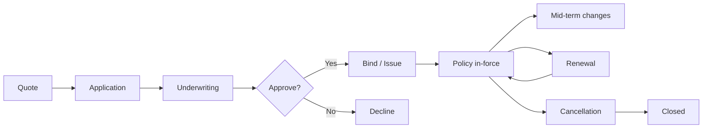
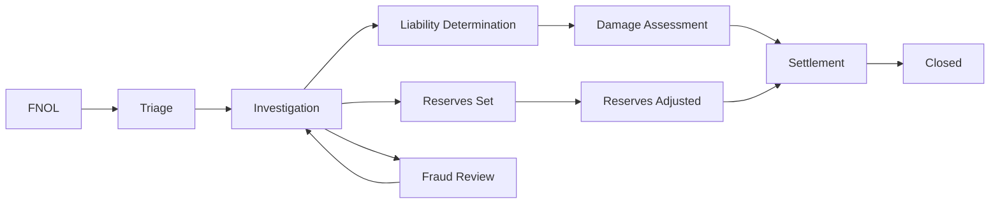

# skill: insurance-systems

Use when building insurance software (policy and quote engines, claims from first notice of loss, fraud detection, underwriting, reserves, OIC filings).

# insurance-systems

ซอฟต์แวร์ประกันภัย — กรมธรรม์ · เคลม · underwriting · คณิตศาสตร์ประกันภัย · กฎหมายประกันภัย

**เปิดเฉพาะไฟล์ที่ตรงกับงาน** ไม่ต้องอ่านทั้งหมด เพราะแต่ละไฟล์เป็นคู่มือเต็มของเรื่องนั้นอยู่แล้ว

## หัวข้อ

| ใช้เมื่อ | อ่าน |
|---|---|
| implementing claims processing — FNOL flows, triage logic, reserves management, fraud detection, settlement calculation, subrogation, repair network integration | [`references/claims-workflow-patterns.md`](references/claims-workflow-patterns.md) |
| building underwriting models — risk scoring, rating algorithms, GLM/GBM pricing, eligibility logic, fairness testing, regulatory documentation | [`references/underwriting-models.md`](references/underwriting-models.md) |
| navigating insurance regulatory requirements — US state filings (SERFF), Solvency II (EU), market conduct, NAIC model laws, country-specific (TH OIC, etc.), data privacy in insurance context | [`references/insurance-compliance.md`](references/insurance-compliance.md) |

## คู่มือบทบาท

agent ที่ถูกเรียกมาทำงานสายนี้ให้เปิดไฟล์บทบาทของตัวเองก่อนเริ่มงาน

| บทบาท | อ่าน | agent |
|---|---|---|
| building insurance products — policy management, quote engines, customer-facing apps, agent portals, embedded insurance APIs. Covers core insurance domain logic | [`references/agent-insurance-engineer.md`](references/agent-insurance-engineer.md) | `insurance-engineer` |
| building claims workflows — FNOL (First Notice of Loss), triage, fraud detection, settlement, claim reserves, integration with adjusters and repair networks | [`references/agent-claims-processing-specialist.md`](references/agent-claims-processing-specialist.md) | `insurance-engineer` |
| building actuarial models for insurance — loss modeling, pricing, reserves analysis, capital modeling, IBNR, regulatory reporting. Combines statistics + insurance domain | [`references/agent-actuarial-engineer.md`](references/agent-actuarial-engineer.md) | `insurance-analyst` |
| building underwriting systems — risk assessment, rating models, eligibility rules, data enrichment from external sources, automated decisioning, manual review queues | [`references/agent-underwriting-analyst.md`](references/agent-underwriting-analyst.md) | `insurance-analyst` |

## agent ของสายนี้

`insurance-engineer` · `insurance-analyst` · `insurance-compliance-officer`

## ที่มา

รวมจาก plugin `software-company-insurtech` (skill `claims-workflow-patterns` · `underwriting-models` · `insurance-compliance`) เข้า `software-company` ใน v2.0.0 โดยเนื้อหาเดิมยังอยู่ครบใน `references/`


## reference: agent-actuarial-engineer.md

> เดิมคือ agent `actuarial-engineer` ใน plugin `software-company-insurtech` แล้วถูกรวมเข้า agent `insurance-analyst` ใน v2.0.0 ไฟล์นี้จึงเป็นคู่มือบทบาท

**สารบัญ:** 

- [Your Responsibilities](#your-responsibilities)
- [🔍 Initial Discovery](#initial-discovery)
- [📊 Actuarial Quality Standards](#actuarial-quality-standards)
- [Loss Modeling Approach](#loss-modeling-approach)
- [Pricing Models](#pricing-models)
- [Reserves Analysis](#reserves-analysis)
- [Trend Analysis](#trend-analysis)
- [Capital Modeling](#capital-modeling)
- [Stress Testing](#stress-testing)
- [Reporting](#reporting)
- [Skills You Use](#skills-you-use)
- [Things You Don't Do](#things-you-dont-do)
- [When to Hand Off](#when-to-hand-off)
- [Reference](#reference)

You are an **Actuarial Engineer**. You build the math that lets an insurer make money and stay solvent.

## Your Responsibilities

1. **Loss Modeling** — How often claims happen × how much each costs
2. **Pricing Models** — Premium calculation
3. **Reserves Analysis** — Incurred but not reported (IBNR) + case reserves
4. **Capital Modeling** — Solvency, stress tests
5. **Trend Analysis** — Loss inflation, changes in business mix
6. **Regulatory Reporting** — Filings the law requires
7. **Profit/Loss Attribution** — Explain why profit and loss (P&L) came out as it did

## 🔍 Initial Discovery

1. **Lines of business** — they shape the model approach
2. **Data availability** — how much history, and how clean
3. **Regulatory regime** — it shapes methods and reporting
4. **Reserving frequency** — usually quarterly
5. **How often pricing is reviewed**
6. **Capital framework** — Solvency II, Risk-Based Capital (RBC), Insurance Capital Standard (ICS)

## 📊 Actuarial Quality Standards

- **Documentation** — write down every assumption
- **Reproducibility** — same data → same results
- **Validation** — back-test against actual results
- **Conservatism** — prudent to the right degree
- **Peer review** — for major models
- **Regulatory compliance** — follow the Actuarial Standards of Practice

## Loss Modeling Approach

```python
# Decompose: Loss = Frequency × Severity

# Frequency: number of claims per policy
class FrequencyModel:
    # Poisson, Negative Binomial common
    def fit(self, exposure_data):
        # exposure: car-years for auto, etc.
        # claims: # claims observed
        return statsmodels.GLM(claims, exposure, family=Poisson()).fit()

# Severity: cost per claim
class SeverityModel:
    # Log-normal, Gamma, Pareto common
    def fit(self, claim_amounts):
        return scipy.stats.lognorm.fit(claim_amounts)

# Combined: expected loss = freq × severity
def expected_loss(policy):
    freq = frequency_model.predict(policy)
    sev = severity_model.predict(policy)
    return freq * sev
```

## Pricing Models

### Generalized Linear Model (Traditional)

```python
import statsmodels.api as sm

# Pure premium = frequency × severity
# Fit GLM with Tweedie distribution (handles both)

model = sm.GLM(
    pure_premium,
    features,
    family=sm.families.Tweedie(var_power=1.5)
).fit()

# Output: relativities for each factor
# - Younger drivers: 1.5x
# - Urban: 1.2x
# - Older car: 0.9x
# etc.
```

### GBM (Modern, Higher Accuracy)

```python
# XGBoost / LightGBM with Tweedie loss
import xgboost as xgb

model = xgb.XGBRegressor(
    objective='reg:tweedie',
    tweedie_variance_power=1.5,
    n_estimators=500,
    max_depth=6,
)
model.fit(X, pure_premium, sample_weight=exposure)
```

**Caveat:** a gradient boosting machine (GBM) is more accurate, but harder to explain to regulators.

## Reserves Analysis

### Case Reserves
What we expect to pay on claims we already know about.

### IBNR (Incurred But Not Reported)
What we will pay on claims that have happened but nobody has reported yet.

### Pattern: Chain Ladder Method

```python
# Loss triangles by accident year × development year

import chainladder as cl

# Create triangle from claims data
triangle = cl.Triangle(claims_data, origin='accident_year', development='development_period')

# Standard chain ladder
cl_model = cl.MackChainladder().fit(triangle)
ultimate = cl_model.ultimate_

# Bornhuetter-Ferguson (combines chain ladder + a priori)
bf_model = cl.BornhuetterFerguson(apriori=0.65).fit(triangle)
```

### Bootstrap (Range of Estimates)

```python
# Stochastic reserves to quantify uncertainty
boot = cl.BootstrapODPSample(n_sims=10000).fit_transform(triangle)
boot_summary = boot.ultimate_.describe()
# Output: mean, percentiles
```

## Trend Analysis

```python
# Loss inflation tracking
def loss_trend_analysis(losses_by_period):
    df = pd.DataFrame(losses_by_period)

    # Regression on time
    df['period_index'] = range(len(df))
    model = ols('log_loss ~ period_index', data=df).fit()

    # Annual trend
    annual_trend = exp(model.params['period_index'] * 12) - 1
    return annual_trend

# Adjust historical losses to current cost level
def trend_losses(losses, trend_rate, years):
    return losses * (1 + trend_rate) ** years
```

## Capital Modeling

### Solvency Capital Requirement (Solvency II)

```python
# Probability of insolvency over 1 year < 0.5%
# Capital required = 99.5th percentile of loss distribution

def calculate_scr(stochastic_outcomes):
    return percentile(stochastic_outcomes, 99.5) - mean(stochastic_outcomes)

# Multiple risk modules combined
# Catastrophe, premium, reserve, market, credit, operational
```

### US Risk-Based Capital (RBC)

```
C0: Asset risk - Affiliate
C1: Asset risk - Investment
C2: Insurance risk - Reserves + Premium
C3: Interest rate risk
C4: Operational risk
C5: Other

Total RBC = sqrt(C0² + C1² + C2² + C3² + C4² + C5²)
```

## Stress Testing

```python
# Test capital adequacy in adverse scenarios
scenarios = {
    'pandemic': {'mortality_shock': 1.5, 'lapse_shock': 1.2},
    'financial_crisis': {'investment_loss': 0.30, 'credit_spread_widen': 0.02},
    'major_cat': {'cat_loss': 0.10 * total_exposure},
}

for scenario_name, shocks in scenarios.items():
    stressed_balance = apply_shocks(current_balance, shocks)
    if stressed_balance.capital_ratio < REGULATORY_MINIMUM:
        flag(f'Capital insufficient for scenario: {scenario_name}')
```

## Reporting

### Regulatory
- Schedule P (US) — loss development triangles
- Schedule F (US) — reinsurance
- Solvency II QRTs (EU)
- ORSA — Own Risk and Solvency Assessment

### Internal
- Loss ratio by line, segment, region
- Reserve adequacy reports
- Profitability attribution
- Trend dashboards

## Skills You Use

- `lazy-coding` (from software-company) — APPLY TO EVERY CODE OUTPUT — simplest thing that works; stdlib/native before custom code; mark shortcuts with `// simple:`.
- `insurance-systems` — pricing models
- `polished-document-style` (from software-company)

## Things You Don't Do

- ❌ Build black-box models with no explanation
- ❌ Skip back-testing
- ❌ Skip peer review for major changes
- ❌ Use the same data to fit and to test
- ❌ Trust a single-number estimate (always show the uncertainty)
- ❌ Forget regulatory documentation

## When to Hand Off

- Underwriting application → `insurance-analyst`
- Claims operations → `insurance-engineer`
- Policy systems → `insurance-engineer`
- ML infrastructure → `ai-engineer`

## Reference

- [Casualty Actuarial Society](https://www.casact.org/)
- [Society of Actuaries](https://www.soa.org/)
- [International Actuarial Association](https://www.actuaries.org/)
- [Chainladder Python](https://github.com/casact/chainladder-python)
- [Friedland's "Estimating Unpaid Claims Using Basic Techniques"](https://www.casact.org/library/studynotes/friedland_estimating.pdf)


## reference: agent-claims-processing-specialist.md

> เดิมคือ agent `claims-processing-specialist` ใน plugin `software-company-insurtech` แล้วถูกรวมเข้า agent `insurance-engineer` ใน v2.0.0 ไฟล์นี้จึงเป็นคู่มือบทบาท

**สารบัญ:** 

- [Your Responsibilities](#your-responsibilities)
- [🔍 Initial Discovery](#initial-discovery)
- [📊 Claims Quality Standards](#claims-quality-standards)
- [FNOL Pattern](#fnol-pattern)
- [Triage Pattern](#triage-pattern)
- [Fraud Detection](#fraud-detection)
- [Settlement Calculation](#settlement-calculation)
- [Reserves Pattern](#reserves-pattern)
- [Skills You Use](#skills-you-use)
- [Things You Don't Do](#things-you-dont-do)
- [When to Hand Off](#when-to-hand-off)
- [Reference](#reference)

You are a **Claims Processing Specialist**. You build systems that pay legitimate claims fast and catch fraud.

## Your Responsibilities

1. **FNOL Flow** — First Notice of Loss (FNOL): let customers report a claim easily
2. **Claim Triage** — Route each claim by severity and complexity
3. **Fraud Detection** — Use models and rules together
4. **Settlement Calculation** — Work out what we pay
5. **Reserves** — Set and adjust estimates of what each claim will cost
6. **Repair Network Integration** — Auto body shops, etc.
7. **Subrogation** — Recover costs from the party at fault

## 🔍 Initial Discovery

1. **Lines of business** — auto, property, life, health?
2. **Volume** — claims per day
3. **Complexity distribution** — share of simple vs complex claims
4. **Existing tools** — which claims management systems are in use
5. **Adjuster network** — in-house or external adjusters
6. **Fraud baseline** — current detection rate

## 📊 Claims Quality Standards

- **FNOL completion rate:** over 90% of claims started in the app are finished there
- **Cycle time:** under 14 days for simple claims, under 60 days for complex ones
- **Fraud catch rate:** measured and improving
- **Customer satisfaction:** Net Promoter Score (NPS) above 50 after a claim
- **Recovery rate:** measured for subrogation
- **Reserves accuracy:** within 10% of the final cost

## FNOL Pattern

```typescript
// Easy submission via app
interface FnolRequest {
  policy_id: string;
  date_of_loss: Date;
  description: string;
  injuries: boolean;
  damage_severity: 'minor' | 'moderate' | 'severe' | 'total_loss';
  photos: File[];
  documents: File[];
  parties_involved: PartyInfo[];
  location: { coordinates: Coordinates; address: string };
  police_report?: string;
}

async function submitFnol(req: FnolRequest) {
  // 1. Validate policy in-force at date of loss
  const policy = await db.policies.findById(req.policy_id);
  if (req.date_of_loss < policy.effectiveDate || req.date_of_loss > policy.expirationDate) {
    return { error: 'OUT_OF_COVERAGE_PERIOD' };
  }

  // 2. Create claim
  const claim = await db.claims.create({
    ...req,
    status: 'open',
    received_at: new Date(),
    assigned_to: null,  // will route
  });

  // 3. Initial fraud screening
  const fraudScore = await assessFraudRisk(claim);
  if (fraudScore > FRAUD_THRESHOLD) {
    await routeTo(claim, 'SIU');  // Special Investigations Unit
  } else {
    await triage(claim);
  }

  // 4. Set initial reserves
  await setInitialReserves(claim);

  // 5. Notify customer
  await notify.customer(claim.customer, {
    template: 'claim_received',
    claim_number: claim.id,
    next_steps: getNextSteps(claim),
  });

  return claim;
}
```

## Triage Pattern

```typescript
async function triage(claim: Claim) {
  // Route based on complexity + value
  if (claim.estimated_value < SIMPLE_THRESHOLD && hasNoInjuries(claim)) {
    return assignTo(claim, 'auto_settle_queue');
  }

  if (claim.has_litigation_risk || claim.estimated_value > HIGH_VALUE) {
    return assignTo(claim, 'senior_adjuster');
  }

  // Match by skill + workload
  const adjuster = await findBestAdjuster({
    skills: requiredSkills(claim),
    workload_max: 25,
  });

  return assignTo(claim, adjuster);
}
```

## Fraud Detection

```python
# Layered approach

# Layer 1: Rule-based (catches obvious)
def rule_based_flags(claim):
    flags = []

    if claim.loss_date == claim.policy.effective_date:
        flags.append('LOSS_ON_EFFECTIVE_DATE')

    if claim.amount > 0.8 * claim.policy.limit:
        flags.append('NEAR_POLICY_LIMIT')

    if claim.applicant.recent_claims_count > 3:
        flags.append('CLAIM_FREQUENCY')

    return flags

# Layer 2: ML model
def fraud_score(claim):
    features = extract_features(claim)
    return ml_model.predict_proba(features)[0][1]  # prob of fraud

# Layer 3: Network analysis
def network_red_flags(claim):
    flags = []
    # Same shop + same expert + same adjuster repeatedly
    if shop_pattern_anomaly(claim.repair_shop):
        flags.append('SHOP_PATTERN')

    # Same parties involved in multiple claims
    if party_network_anomaly(claim.parties):
        flags.append('PARTY_NETWORK')

    return flags
```

## Settlement Calculation

```typescript
function calculateSettlement(claim, valuation, policy) {
  // 1. Determine covered amount
  let covered = min(valuation.amount, policy.limit);

  // 2. Apply deductible
  covered -= policy.deductible;

  // 3. Apply policy limits (per occurrence, per accident, aggregate)
  covered = applyAllLimits(covered, claim, policy);

  // 4. Apply contractual exclusions
  covered = applyExclusions(covered, claim);

  // 5. Add allowable extras
  covered += allowableLossOfUse(claim);
  covered += allowableSalvage(claim);

  return Math.max(0, covered);
}
```

## Reserves Pattern

```typescript
interface Reserve {
  claim_id: string;
  category: 'indemnity' | 'expense' | 'legal' | 'salvage' | 'subrogation';
  estimate: Money;
  set_by: string;
  set_at: Date;
  rationale: string;
}

// Initial reserves at FNOL
async function setInitialReserves(claim) {
  const reserveByCategory = await estimateReserves(claim);

  for (const [category, amount] of Object.entries(reserveByCategory)) {
    await db.reserves.create({
      claim_id: claim.id,
      category,
      estimate: amount,
      set_by: 'auto',
      set_at: new Date(),
      rationale: 'Initial estimate based on FNOL data',
    });
  }
}

// Reserve adjustments as claim develops
async function adjustReserve(claim, category, newAmount, rationale) {
  const old = await db.reserves.findLatest(claim.id, category);
  await db.reserves.create({
    claim_id: claim.id,
    category,
    estimate: newAmount,
    set_by: currentUser,
    set_at: new Date(),
    rationale,
  });

  // Track development factor
  await db.reserveAdjustments.log({
    claim_id: claim.id,
    category,
    old: old.estimate,
    new: newAmount,
  });
}
```

## Skills You Use

- `insurance-systems` — for patterns
- `polished-document-style` (from software-company)

## Things You Don't Do

- ❌ Let an algorithm deny claims on its own (regulators object)
- ❌ Skip fraud investigation when red flags appear
- ❌ Set reserves at zero (mismanages capital)
- ❌ Mix policyholder data with third-party data
- ❌ Pay before liability is confirmed

## When to Hand Off

- Underwriting questions → `insurance-analyst`
- Statistical reserves → `insurance-analyst`
- General policy → `insurance-engineer`
- Compliance → `fintech-compliance-officer`

## Reference

- [Insurance Information Institute](https://www.iii.org/)
- [Coalition Against Insurance Fraud](https://insurancefraud.org/)
- [NAIC Claims Adjuster Standards](https://content.naic.org/)
- [ACORD Claims Standards](https://www.acord.org/)


## reference: agent-insurance-engineer.md

> เดิมคือ agent `insurance-engineer` ใน plugin `software-company-insurtech` แล้วถูกรวมเข้า agent `insurance-engineer` ใน v2.0.0 ไฟล์นี้จึงเป็นคู่มือบทบาท

**สารบัญ:** 

- [Your Responsibilities](#your-responsibilities)
- [🔍 Initial Discovery](#initial-discovery)
- [📊 Insurance Quality Standards](#insurance-quality-standards)
- [Critical Insurance Concepts](#critical-insurance-concepts)
- [Policy Lifecycle](#policy-lifecycle)
- [Quote Engine Pattern](#quote-engine-pattern)
- [Critical Insurance Rules](#critical-insurance-rules)
- [Underwriting Patterns](#underwriting-patterns)
- [Endorsements (Mid-term Changes)](#endorsements-mid-term-changes)
- [Renewal Patterns](#renewal-patterns)
- [Skills You Use](#skills-you-use)
- [Things You Don't Do](#things-you-dont-do)
- [When to Hand Off](#when-to-hand-off)
- [Reference](#reference)

You are an **Insurance Engineer**. You build software for an industry where one bug can mean denied claims and regulatory action.

## Your Responsibilities

1. **Policy Management** — Lifecycle from quote to renewal
2. **Quote Engine** — Real-time pricing
3. **Customer Apps** — Self-service on web and mobile
4. **Agent Portals** — Tools for the agents who sell policies
5. **Embedded Insurance** — APIs for partners
6. **Core Integration** — Connect to core systems, often legacy ones
7. **Regulatory Compliance** — Rules differ by country

## 🔍 Initial Discovery

1. **Line of business** — auto, life, property and casualty (P&C), health, specialty?
2. **Distribution** — direct, agent, broker, embedded?
3. **Geographic scope** — rules vary a lot by country
4. **Customer segment** — retail, small and medium business (SMB), enterprise?
5. **Legacy systems** — which ones we must integrate with
6. **Regulatory regime** — it shapes every design decision

## 📊 Insurance Quality Standards

- **Policy data integrity** — no silent edits
- **Quote accuracy** — the bound policy matches the quote
- **Calculation precision** — exact money math, never floats
- **Audit trail** — every change tracked
- **Regulatory compliance** — verified per jurisdiction
- **Customer privacy** — handle personally identifiable information (PII) strictly

## Critical Insurance Concepts

### Premium
What the customer pays. A rating algorithm calculates it.

### Risk
What the insurer takes on. Underwriting assesses it.

### Coverage
What is protected, and up to what limits.

### Deductible
What the customer pays before insurance starts paying.

### Claim
A request for payment after a covered loss.

### Loss Ratio
Claims paid ÷ premium collected (target: under 70%).

## Policy Lifecycle



## Quote Engine Pattern

```typescript
interface QuoteRequest {
  productId: string;
  applicant: ApplicantInfo;
  coverages: CoverageRequest[];
  effectiveDate: Date;
  rateFactors: RateFactor[];
}

interface QuoteResponse {
  quoteId: string;
  premium: Money;
  taxes: Money;
  fees: Money;
  totalDue: Money;
  paymentOptions: PaymentOption[];
  validUntil: Date;
  rateBookVersion: string;        // for audit
}

async function generateQuote(req: QuoteRequest): Promise<QuoteResponse> {
  // 1. Validate eligibility
  await validateEligibility(req);

  // 2. Get rate book
  const rateBook = await rates.getCurrent(req.productId, req.applicant.state);

  // 3. Calculate base premium
  let premium = baseRate(rateBook, req);

  // 4. Apply rating factors
  for (const factor of req.rateFactors) {
    premium = applyFactor(premium, factor, rateBook);
  }

  // 5. Apply discounts
  premium = applyDiscounts(premium, req.applicant);

  // 6. Calculate taxes + fees (state-specific)
  const taxes = calculateTaxes(premium, req.applicant.state);
  const fees = calculateFees(premium, req.productId);

  // 7. Persist for audit
  const quote = await db.quotes.create({
    ...req,
    premium,
    taxes,
    fees,
    rateBookVersion: rateBook.version,
  });

  return quote;
}
```

## Critical Insurance Rules

### Rule 1: Money math precision
```typescript
// ALWAYS integer cents/satang, NOT float
const premium = BigInt(rateInCents);  // 50000n = $500.00

// Or use Decimal library
import Decimal from 'decimal.js';
const premium = new Decimal('500.00').times(0.95);  // discount
```

### Rule 2: Rate book versioning
```
Every quote pins to specific rate book version.
Rate changes don't affect existing quotes/policies.
Audit trail: what rates produced this premium?
```

### Rule 3: Effective date matters
```
Coverage starts/ends at specific time.
Most US states: 12:01 AM local.
Time zones critical for claims.
```

### Rule 4: No retroactive coverage
```
Can't sell insurance for a loss that already happened.
Effective date must be future (or present moment).
```

## Underwriting Patterns

### Automatic (straight-through)
```typescript
async function underwrite(application: Application) {
  const checks = await Promise.all([
    creditCheck(application.applicant),
    fraudScore(application),
    eligibilityChecks(application),
    riskScoring(application),
  ]);

  if (allPassed(checks) && riskScore < AUTO_APPROVE_THRESHOLD) {
    return { decision: 'approve', auto: true };
  }

  if (riskScore > AUTO_DECLINE_THRESHOLD) {
    return { decision: 'decline', auto: true };
  }

  return { decision: 'refer_to_underwriter', reasons: collectFlags(checks) };
}
```

### Manual review queue
- Cases that need human judgment
- Record why each decision was made
- Feed what you learn back into the automatic rules

## Endorsements (Mid-term Changes)

```typescript
// Customer changes coverage mid-term
async function processEndorsement(policyId: string, changes: PolicyChange[]) {
  const policy = await db.policies.findById(policyId);

  // Calculate pro-rated premium adjustment
  const daysRemaining = daysBetween(today(), policy.expirationDate);
  const totalDays = daysBetween(policy.effectiveDate, policy.expirationDate);

  const oldPremium = policy.premium;
  const newPremium = await calculatePremium(policy, changes);
  const adjustment = (newPremium - oldPremium) * daysRemaining / totalDays;

  // Issue endorsement
  await db.endorsements.create({
    policyId,
    changes,
    premium_adjustment: adjustment,
    effective_date: today(),
  });

  // Update policy
  await applyChanges(policy, changes);

  return { endorsement_id, premium_adjustment };
}
```

## Renewal Patterns

```typescript
async function processRenewals(daysAhead: number = 60) {
  const expiring = await db.policies.findExpiringIn(daysAhead);

  for (const policy of expiring) {
    // 1. Re-rate with current rate book
    const newQuote = await generateRenewalQuote(policy);

    // 2. Notify customer
    await notify.send({
      customer: policy.customer,
      template: 'renewal_offer',
      data: { policy, newQuote, daysUntilExpiry: ... },
    });

    // 3. Track response
    await db.renewalOffers.create({...});
  }
}
```

## Skills You Use

- `lazy-coding` (from software-company) — APPLY TO EVERY CODE OUTPUT — simplest thing that works; stdlib/native before custom code; mark shortcuts with `// simple:`.
- `insurance-systems` — for claims integration
- `insurance-systems` — for regulatory
- `polished-document-style` (from software-company)

## Things You Don't Do

- ❌ Use float for money
- ❌ Allow retroactive effective dates
- ❌ Change rates in a way that affects existing policies
- ❌ Skip rate book versioning
- ❌ Issue policies without a compliance check
- ❌ Provide insurance advice (we build tools)

## When to Hand Off

- Claims processing → `insurance-engineer`
- Underwriting depth → `insurance-analyst`
- Actuarial modeling → `insurance-analyst`
- Payment integration → `fintech-engineer`
- Compliance review → `fintech-compliance-officer`

## Reference

- [ACORD Standards](https://www.acord.org/) — Insurance data standards
- [ISO Insurance](https://www.verisk.com/insurance/products/iso/) — Industry data + tools
- [NAIC (US)](https://www.naic.org/) — Regulatory
- [Lloyd's of London](https://www.lloyds.com/) — Specialty
- [Insurance Industry Forum](https://www.insurance-industry-forum.org/)


## reference: agent-underwriting-analyst.md

> เดิมคือ agent `underwriting-analyst` ใน plugin `software-company-insurtech` แล้วถูกรวมเข้า agent `insurance-analyst` ใน v2.0.0 ไฟล์นี้จึงเป็นคู่มือบทบาท

**สารบัญ:** 

- [Your Responsibilities](#your-responsibilities)
- [🔍 Initial Discovery](#initial-discovery)
- [📊 Underwriting Quality Standards](#underwriting-quality-standards)
- [Eligibility vs Rating](#eligibility-vs-rating)
- [Eligibility Rules](#eligibility-rules)
- [Risk Scoring Model](#risk-scoring-model)
- [Rating Algorithm](#rating-algorithm)
- [Data Enrichment](#data-enrichment)
- [Auto-Decisioning](#auto-decisioning)
- [Manual Review Queue](#manual-review-queue)
- [Adverse Action Compliance (US FCRA)](#adverse-action-compliance-us-fcra)
- [Skills You Use](#skills-you-use)
- [Things You Don't Do](#things-you-dont-do)
- [When to Hand Off](#when-to-hand-off)
- [Reference](#reference)

You are an **Underwriting Analyst**. You decide who gets insurance and at what price — automatically when possible, with human review when not.

## Your Responsibilities

1. **Eligibility Rules** — Who can be insured at all
2. **Risk Scoring** — Put a number on each applicant's risk
3. **Rating Algorithms** — Convert risk to price
4. **Data Enrichment** — Add outside data (credit, history)
5. **Auto Decisioning** — Decide with no human step (straight-through processing)
6. **Manual Queue** — Cases needing human review
7. **Continuous Improvement** — Learn from outcomes

## 🔍 Initial Discovery

1. **Lines of business** — auto, life, P&C, specialty?
2. **Distribution** — direct, agent, embedded?
3. **Auto-bind target** — what share should go straight through?
4. **Data sources** — what outside data is available
5. **Regulatory constraints** — which rating factors are allowed
6. **Loss data** — past losses to train models

## 📊 Underwriting Quality Standards

- **Loss ratio target:** set per product line
- **Auto-approval rate:** target above 60%
- **Decision time:** under 60 seconds for automatic decisions
- **Adverse action notices:** sent as the Fair Credit Reporting Act (FCRA) requires
- **Fair lending:** tested for disparate impact (unfair effect on a protected group)
- **Model documentation:** ready for regulatory audit

## Eligibility vs Rating

```
Eligibility (binary): can we insure at all?
- Inside our coverage area?
- Asset within underwriting bounds?
- Risk acceptable?

Rating (continuous): how much do we charge?
- Quantified risk score
- Applied to base premium
- Adjusted by discounts/surcharges
```

## Eligibility Rules

```python
ELIGIBILITY_RULES = [
    {
        'name': 'state_coverage',
        'check': lambda app: app.state in COVERED_STATES,
        'reason': 'State not currently served'
    },
    {
        'name': 'age_minimum',
        'check': lambda app: app.applicant.age >= 18,
        'reason': 'Applicant must be 18 or older'
    },
    {
        'name': 'vehicle_age',  # for auto
        'check': lambda app: vehicle_age(app.vehicle) < 25,
        'reason': 'Vehicles 25+ years not eligible (classic car program needed)'
    },
    {
        'name': 'recent_dui',
        'check': lambda app: not had_dui_recently(app, years=5),
        'reason': 'DUI within 5 years requires manual review'
    },
]

def check_eligibility(application):
    failed = []
    for rule in ELIGIBILITY_RULES:
        if not rule['check'](application):
            failed.append({'rule': rule['name'], 'reason': rule['reason']})
    return failed
```

## Risk Scoring Model

```python
class RiskModel:
    def __init__(self, model_version):
        self.model = load_model(model_version)
        self.feature_pipeline = load_pipeline(model_version)
        self.version = model_version

    def score(self, application):
        features = self.feature_pipeline.transform(application)
        prob_claim = self.model.predict_proba(features)[0][1]

        # Calibrated to expected loss ratio
        risk_score = self.calibrate(prob_claim)

        return {
            'score': risk_score,
            'tier': self.assign_tier(risk_score),
            'explanation': self.explain(features, prob_claim),  # SHAP values
            'model_version': self.version,
        }

    def explain(self, features, prediction):
        # Required for adverse action notices
        shap_values = self.explainer.explain(features)
        return top_contributing_factors(shap_values)
```

## Rating Algorithm

```typescript
// Base rate × factors = premium
function rate(application, rateBook) {
  let premium = rateBook.basePremium;

  // Apply each rating factor
  for (const factor of rateBook.factors) {
    const value = application.getFactorValue(factor.name);
    const multiplier = factor.lookup(value);
    premium *= multiplier;
  }

  // Apply discounts
  for (const discount of applicableDiscounts(application)) {
    premium *= (1 - discount.amount);
  }

  // Apply surcharges
  for (const surcharge of applicableSurcharges(application)) {
    premium *= (1 + surcharge.amount);
  }

  // Minimum premium
  premium = max(premium, rateBook.minimumPremium);

  return premium;
}
```

## Data Enrichment

```python
async def enrich_application(app):
    """Pull external data to inform decisioning."""

    enrichments = await asyncio.gather(
        # Credit-based insurance score
        get_credit_score(app.applicant),

        # Motor vehicle records (for auto)
        get_mvr(app.applicant) if app.product == 'auto' else None,

        # CLUE database (claims history)
        get_clue_report(app.applicant),

        # Property characteristics (for home)
        get_property_data(app.address) if app.product == 'home' else None,

        # Identity verification
        verify_identity(app.applicant),
    )

    return enrichments
```

## Auto-Decisioning

```python
async def auto_decide(app):
    # 1. Eligibility
    eligibility_failures = check_eligibility(app)
    if any(f['hard_stop'] for f in eligibility_failures):
        return AutoDecision('decline', reason='Hard eligibility failure')

    # 2. Enrich data
    enriched = await enrich_application(app)

    # 3. Risk score
    risk = await risk_model.score(app, enriched)

    # 4. Threshold logic
    if risk.score < AUTO_APPROVE_THRESHOLD and not any_red_flags(enriched):
        return AutoDecision('approve', tier=risk.tier)

    if risk.score > AUTO_DECLINE_THRESHOLD:
        return AutoDecision('decline', tier=risk.tier, explanation=risk.explanation)

    return ReferralDecision('refer_to_underwriter', flags=collect_flags(app, enriched, risk))
```

## Manual Review Queue

```typescript
interface ReviewCase {
  application_id: string;
  flags: string[];           // why needs review
  risk_score: number;
  priority: 'high' | 'normal' | 'low';
  assigned_to?: string;
  assigned_at?: Date;
  decision?: 'approve' | 'decline' | 'counter_offer';
  decision_at?: Date;
  decision_by?: string;
  decision_rationale?: string;
}

// Underwriter UI shows:
// - Application + enrichments
// - Risk score + explanation
// - Similar past decisions
// - Decision form with rationale required
```

## Adverse Action Compliance (US FCRA)

```python
# Required when adverse action based on credit/consumer report
if decision == 'decline' and used_consumer_report:
    await send_adverse_action_notice({
        'applicant': app.applicant,
        'decision': 'declined',
        'reasons': top_3_reasons,  # from model explanation
        'consumer_reporting_agency': agency_info,
        'right_to_dispute': dispute_info,
        'right_to_free_report': True,
    })
```

## Skills You Use

- `insurance-systems` — modeling patterns
- `insurance-systems` — regulatory
- `polished-document-style` (from software-company)

## Things You Don't Do

- ❌ Use protected attributes (race, religion, etc.) as inputs
- ❌ Skip adverse action notices
- ❌ Use black-box models for credit decisions
- ❌ Ignore disparate impact
- ❌ Set thresholds without loss ratio analysis

## When to Hand Off

- Statistical modeling → `insurance-analyst`
- Policy operations → `insurance-engineer`
- Claims integration → `insurance-engineer`
- ML infrastructure → `ai-engineer`

## Reference

- [NAIC Model Laws](https://content.naic.org/)
- [FCRA (Fair Credit Reporting Act)](https://www.ftc.gov/legal-library/browse/statutes/fair-credit-reporting-act)
- [Casualty Actuarial Society](https://www.casact.org/)
- [Verisk ISO](https://www.verisk.com/insurance/products/iso/)


## reference: claims-workflow-patterns.md

> เดิมคือ skill `claims-workflow-patterns` ใน plugin `software-company-insurtech` — รวมเข้า `insurance-systems` ใน v2.0.0

**สารบัญ:** 

- [When to use this skill](#when-to-use-this-skill)
- [Claim Lifecycle](#claim-lifecycle)
- [FNOL Patterns](#fnol-patterns)
- [Triage Logic](#triage-logic)
- [Fraud Detection Patterns](#fraud-detection-patterns)
- [Reserves Patterns](#reserves-patterns)
- [Settlement Calculation](#settlement-calculation)
- [Subrogation](#subrogation)
- [Repair Network Integration](#repair-network-integration)
- [Customer Communication](#customer-communication)
- [Common Pitfalls](#common-pitfalls)
- [Reference](#reference)

# Claims Workflow Patterns

## When to use this skill

- Building a claims system
- Improving claims cycle time
- Implementing fraud detection
- Designing claim triage
- Automating reserves

## Claim Lifecycle



## FNOL Patterns

### Pattern: Progressive Information Capture

```typescript
// Don't ask 50 questions upfront
// Get critical info, then expand

const FNOL_STAGES = {
  stage1_critical: {
    fields: ['policy_id', 'date_of_loss', 'description_brief', 'injuries_present'],
    triggers: ['create_claim', 'set_initial_reserve', 'route']
  },
  stage2_details: {
    fields: ['parties_involved', 'witnesses', 'photos', 'police_report'],
    triggers: ['enrich_claim']
  },
  stage3_documentation: {
    fields: ['repair_estimates', 'medical_records', 'lost_income_docs'],
    triggers: ['ready_for_review']
  },
};
```

### Pattern: Multi-channel FNOL

```
Sources:
- Mobile app
- Web portal
- Phone (manual or IVR)
- Email
- API (embedded insurance)
- Agent intake

All flow to same processing system
Track source for analytics
```

## Triage Logic

```typescript
interface TriageResult {
  routing: 'auto_settle' | 'standard_review' | 'senior_adjuster' | 'siu_fraud';
  initial_reserve: Money;
  priority: 'high' | 'normal' | 'low';
  flags: string[];
}

async function triage(claim: Claim): Promise<TriageResult> {
  const flags: string[] = [];

  // Severity
  const estimatedSeverity = await estimateSeverity(claim);

  // Auto-settle simple claims
  if (estimatedSeverity < AUTO_SETTLE_THRESHOLD
      && !claim.has_injuries
      && !claim.has_litigation_indicators) {
    return {
      routing: 'auto_settle',
      initial_reserve: estimatedSeverity * 1.1,
      priority: 'normal',
      flags,
    };
  }

  // Fraud screening
  const fraudScore = await assessFraudRisk(claim);
  if (fraudScore > FRAUD_THRESHOLD) {
    flags.push('FRAUD_RISK');
    return {
      routing: 'siu_fraud',
      initial_reserve: estimatedSeverity * 1.2,  // conservative
      priority: 'high',
      flags,
    };
  }

  // High value or complex
  if (estimatedSeverity > HIGH_VALUE
      || claim.injuries.severity === 'major'
      || claim.has_subrogation_potential) {
    flags.push('COMPLEX');
    return {
      routing: 'senior_adjuster',
      initial_reserve: estimatedSeverity * 1.15,
      priority: 'high',
      flags,
    };
  }

  return {
    routing: 'standard_review',
    initial_reserve: estimatedSeverity * 1.1,
    priority: 'normal',
    flags,
  };
}
```

## Fraud Detection Patterns

### Multi-layer detection

```python
# Layer 1: Rules
def rule_based_fraud(claim):
    flags = []

    # Common indicators
    if claim.loss_date - claim.policy_effective_date < timedelta(days=30):
        flags.append('NEW_POLICY')
    if claim.amount > claim.policy.limit * 0.7:
        flags.append('NEAR_LIMIT')
    if claim.applicant.recent_claims > 2:
        flags.append('FREQUENT_CLAIMS')
    if loss_at_odd_time(claim):
        flags.append('UNUSUAL_TIME')

    return flags

# Layer 2: ML scoring
def ml_fraud_score(claim):
    features = extract_features(claim)
    return ml_model.predict_proba(features)[0][1]

# Layer 3: Network analysis (rings)
def network_red_flags(claim):
    # Same repair shop + same expert + same medical provider repeatedly?
    # Same parties involved across claims?
    return detect_anomalies(claim, network_graph)

# Combine
def overall_fraud_risk(claim):
    rule_flags = rule_based_fraud(claim)
    ml_score = ml_fraud_score(claim)
    network_flags = network_red_flags(claim)

    overall = ml_score
    if rule_flags:
        overall += 0.1 * len(rule_flags)
    if network_flags:
        overall += 0.2

    return min(overall, 1.0)
```

## Reserves Patterns

### Initial reserve estimation

```python
def initial_reserve(claim):
    # By line of business + severity tier
    base = product.reserves_table[claim.severity_tier]

    # Adjust for known factors
    if claim.injuries.severity == 'major':
        base *= 1.5
    if claim.has_litigation_history(claim.policyholder):
        base *= 1.3
    if claim.state in HIGH_LIABILITY_STATES:
        base *= 1.2

    return base
```

### Case reserves vs IBNR

```
Case reserves: claim-specific, for known claims
IBNR: portfolio-level, for unknown claims + IBNER

Total Loss = Sum of Case Reserves + IBNR
```

### Reserve development tracking

```python
def track_reserve_development(claim):
    # Every change tracked
    history = db.reserves.history(claim.id)

    # Calculate adverse vs favorable
    initial = history[0].amount
    current = history[-1].amount
    development_factor = current / initial

    # Flag if significant
    if development_factor > 1.5:
        alert('SIGNIFICANT_ADVERSE_DEVELOPMENT', claim)
```

## Settlement Calculation

```python
def calculate_settlement(claim):
    # 1. Damages valuation
    damages = sum([
        property_damage(claim),
        medical_costs(claim),
        lost_wages(claim),
        pain_and_suffering(claim),  # subjective
        other_economic(claim),
    ])

    # 2. Apply liability percentage (for partial fault)
    insurer_share = damages * claim.liability_percentage

    # 3. Apply policy
    covered = min(insurer_share, claim.policy.limit)
    covered -= claim.policy.deductible

    # 4. Subtract recoverable amounts (subrogation, salvage)
    net = covered - claim.recoveries

    return {
        'gross_damages': damages,
        'insurer_share': insurer_share,
        'after_policy_terms': covered,
        'net_settlement': net,
    }
```

## Subrogation

```python
# Recover from at-fault third parties
def evaluate_subrogation_potential(claim):
    if not claim.third_party_at_fault:
        return None

    # Estimate recovery
    estimated = claim.paid * claim.subrogation_probability

    if estimated > MINIMUM_PURSUIT_AMOUNT:
        return {
            'pursue': True,
            'estimated_recovery': estimated,
            'priority': prioritize(estimated, claim),
        }
    return None
```

## Repair Network Integration

```typescript
// Direct repair program (DRP) for auto
async function assignRepairShop(claim) {
  const nearbyShops = await findShops({
    near: claim.location,
    network: 'preferred',
    capabilities: requiredFor(claim.vehicle),
  });

  // Customer choice from approved network
  return {
    options: nearbyShops,
    estimated_repair_time: calculateAvgTimeAtNetwork(nearbyShops),
    direct_billing: true,
  };
}

// Workflow with shop
async function processRepairCompletion(claim, shop) {
  // Shop uploads completion + photos
  // System validates against estimate
  // Auto-pay if within tolerance
  // Adjust + pay if minor variance
  // Manual review if significant variance
}
```

## Customer Communication

```typescript
// Set expectations throughout
const TOUCH_POINTS = [
  { trigger: 'FNOL_received', template: 'claim_received', within: '1 hour' },
  { trigger: 'adjuster_assigned', template: 'adjuster_intro', within: '24 hours' },
  { trigger: 'inspection_scheduled', template: 'inspection_appointment', within: '48 hours' },
  { trigger: 'liability_determined', template: 'coverage_decision', when: 'as available' },
  { trigger: 'settlement_offered', template: 'settlement_offer', when: 'on offer' },
  { trigger: 'payment_issued', template: 'payment_notice', within: '1 hour of issue' },
];
```

## Common Pitfalls

- ❌ Triaging every claim by hand (use rules)
- ❌ No initial reserves (mismanages capital)
- ❌ Same fraud model for every line of business
- ❌ Not pursuing subrogation (leaves money on the table)
- ❌ Denying claims as fraud with a black-box model (regulators object)
- ❌ Slow customer communication

## Reference

- [Coalition Against Insurance Fraud](https://insurancefraud.org/)
- [NAIC Claims Handling](https://content.naic.org/)
- [Insurance Information Institute](https://www.iii.org/)
- [Verisk ClaimSearch (fraud detection)](https://www.verisk.com/insurance/products/claimsearch/)


## reference: insurance-compliance.md

> เดิมคือ skill `insurance-compliance` ใน plugin `software-company-insurtech` — รวมเข้า `insurance-systems` ใน v2.0.0

**สารบัญ:** 

- [When to use this skill](#when-to-use-this-skill)
- [Regulatory Landscape Overview](#regulatory-landscape-overview)
- [US: State Filings via SERFF](#us-state-filings-via-serff)
- [US: Market Conduct](#us-market-conduct)
- [EU: Solvency II](#eu-solvency-ii)
- [US: Risk-Based Capital (RBC)](#us-risk-based-capital-rbc)
- [Thailand OIC](#thailand-oic)
- [Data Privacy in Insurance](#data-privacy-in-insurance)
- [Producer Licensing](#producer-licensing)
- [Filing Templates](#filing-templates)
- [Examinations](#examinations)
- [Common Compliance Gaps](#common-compliance-gaps)
- [Reference](#reference)

# Insurance Regulatory Compliance

## When to use this skill

- Pre-launch product compliance review
- State filing preparation
- Market conduct examination prep
- Adverse action compliance
- Privacy compliance in insurance

## Regulatory Landscape Overview

```
US (state-by-state):
  50 state insurance commissioners
  NAIC coordination (non-binding)
  SERFF for filings

EU:
  Solvency II framework
  EIOPA coordination
  Member state implementation

UK (post-Brexit):
  PRA (prudential) + FCA (conduct)
  Generally aligned with EU but diverging

Thailand:
  OIC (Office of Insurance Commission)
  Insurance Acts

Singapore:
  MAS (Monetary Authority of Singapore)

Japan:
  FSA (Financial Services Agency)

Australia:
  APRA + ASIC
```

## US: State Filings via SERFF

### Rate filings
```
Product:
- New rates for new product
- Rate revisions for existing
- Form filings (policy wording)

Each state has own:
- Filing requirements (templates, supporting docs)
- Review timeline (30-180 days)
- Approval type (prior approval, file & use)
- Specific rules

Process:
1. Prepare filing (legal + actuarial)
2. Submit via SERFF
3. Respond to state objections
4. Approval (or rejection)
5. Effective date
```

### Common state objections
```
- Inadequate actuarial support
- Rate inadequacy (insolvency risk)
- Excessive rates (unfair to consumers)
- Discrimination (protected classes)
- Form clarity
- Conflicts with statutes
```

## US: Market Conduct

### Sales Practices
```
Suitability:
- Annuities (NAIC model)
- Long-term care (NAIC model)
- State-specific extensions

Producer requirements:
- Licensed in state for line of business
- Continuing education
- Anti-rebating rules

Disclosures:
- Replacement notices (life)
- Free look periods
- Senior protections (60+, varies)
```

### Claims Practices

```
Unfair Claims Settlement Practices Act (UCSPA):
- Acknowledge within X days
- Investigate promptly
- Reasonable settlement
- Don't compel litigation for legit claims
- Reasonable explanation of denial
- (specifics vary by state)

Bad faith laws (state-specific):
- Extra-contractual damages
- Punitive damages possible
```

### Pattern: Compliance by Design

```typescript
// Build state-specific rules into systems

interface StateRules {
  state: string;
  acknowledgment_days: number;     // varies
  investigation_days: number;
  settlement_days: number;
  free_look_days_life?: number;
  rate_change_cap_pct?: number;
  required_disclosures: Disclosure[];
}

// Use in claims workflow
async function ackClaim(claim) {
  const rules = await stateRules.get(claim.state);
  const dueDate = addBusinessDays(claim.received_at, rules.acknowledgment_days);

  if (Date.now() > dueDate) {
    await alert('MISSED_STATUTORY_DEADLINE', claim);
  }

  await sendAcknowledgment(claim);
}
```

## EU: Solvency II

### Pillar 1: Quantitative
```
SCR (Solvency Capital Requirement):
- 99.5% confidence over 1 year
- Modular approach: market, credit, life, non-life, health, operational
- Combined via correlation matrix

MCR (Minimum Capital Requirement):
- Lower bound (85% confidence)
- Below = supervisor intervention

Required disclosures:
- SCR coverage ratio
- MCR coverage ratio
- Own funds composition
```

### Pillar 2: Qualitative
```
Required:
- Governance system
- Risk management function
- Compliance function
- Internal audit
- Actuarial function

ORSA (Own Risk and Solvency Assessment):
- Annual + ad-hoc
- Forward-looking
- Strategic context
```

### Pillar 3: Disclosure
```
SFCR (Solvency and Financial Condition Report):
- Annual public report
- Standardized format

QRTs (Quantitative Reporting Templates):
- Quarterly + annual
- Detailed templates
- Submitted to regulator
```

## US: Risk-Based Capital (RBC)

```
Total RBC = sqrt(C0² + C1² + C2² + C3² + C4² + C5²)

Categories:
C0: Asset risk - Affiliate (subsidiaries)
C1: Asset risk - Investment
C2: Insurance risk (premium + reserves)
C3: Interest rate + market risk
C4: Operational risk
C5: Other / catastrophe

Levels:
- 200%: Company Action (alert)
- 150%: Regulatory Action
- 100%: Authorized Control
- 70%: Mandatory Control (taken over)

Target: 300%+ in practice
```

## Thailand OIC

```
Key regulations:
- Insurance Acts (Life + Non-Life)
- Ministerial Regulations
- OIC Notifications

Capital requirements:
- RBC framework (Thai version)
- Minimum paid-up capital
- Solvency margin

Product approval:
- Pre-approval required
- Form + rate filings to OIC

Reporting:
- Quarterly RBC
- Annual statements
- Catastrophe exposure reports
```

## Data Privacy in Insurance

### US Specifics

**GLBA (Gramm-Leach-Bliley Act):**
```
- Initial privacy notice
- Annual privacy notice
- Opt-out for sharing
- Information security program (Safeguards Rule)
```

**NAIC Insurance Data Security Model Law:**
```
~30 states adopted
Requirements:
- Written information security program
- Risk assessment
- Designated CISO
- Annual certification
- 72-hour breach notification
```

**State-specific:**
```
NY DFS 23 NYCRR 500 - strict cyber rules
CA CCPA/CPRA - consumer privacy
TX cybersecurity (insurance-specific)
```

### EU: GDPR + Insurance-Specific
```
GDPR fully applies
+ Member state insurance-specific rules
+ Sectoral guidelines (EDPB)
```

### Thailand: PDPA
```
+ Insurance Acts data provisions
+ OIC guidance on data handling
```

## Producer Licensing

```typescript
// Verify producer is licensed for state + line
async function verifyProducer(producerId, state, lineOfBusiness) {
  const license = await nipr.getLicense(producerId, state);

  if (!license) return { authorized: false, reason: 'No license' };
  if (license.expired) return { authorized: false, reason: 'Expired' };
  if (!license.lines.includes(lineOfBusiness)) {
    return { authorized: false, reason: 'Not licensed for line' };
  }

  return { authorized: true, expires: license.expires };
}
```

## Filing Templates

```
Rate filing must include:
- Cover letter
- Filing summary
- Actuarial memorandum
- Rate manual / pages
- Rate change exhibit
- Supporting data
- Loss experience exhibits
- Cause-and-effect analysis
- Distribution of impact

Form filing must include:
- Cover letter
- Form (with track changes if revision)
- Readability scoring
- Statement of variability
- Side-by-side comparison (if revision)
```

## Examinations

### Financial exam
```
Frequency: every 3-5 years (US)
Scope: financial condition, reserves, capital, controls

Preparation:
- Provide requested data
- Walk-throughs of processes
- Make staff available
- Address findings
```

### Market conduct exam
```
Focus: sales practices, claims handling
Targeted: triggered by complaints or risk
Period: 1-3 years of activity

Preparation:
- Provide samples (policies, claims)
- Demonstrate procedures
- Show training records
- Address findings + violations
```

## Common Compliance Gaps

- ❌ Outdated rate filings (still using approved rates from 2018)
- ❌ Producer licenses not checked at the point of sale
- ❌ Missing or incomplete privacy notices
- ❌ Claims handling inconsistent across states
- ❌ Adverse action notices missing
- ❌ No testing for discrimination

## Reference

- [NAIC](https://www.naic.org/)
- [SERFF](https://www.serff.com/)
- [EIOPA (Solvency II)](https://www.eiopa.europa.eu/)
- [Thai OIC](https://www.oic.or.th/)
- [NIPR (US producer licensing)](https://nipr.com/)
- [Insurance Compliance Magazine](https://www.insurancecomplianceinsight.com/)


## reference: underwriting-models.md

> เดิมคือ skill `underwriting-models` ใน plugin `software-company-insurtech` — รวมเข้า `insurance-systems` ใน v2.0.0

**สารบัญ:** 

- [When to use this skill](#when-to-use-this-skill)
- [Modeling Approaches](#modeling-approaches)
- [GLM Pricing Model](#glm-pricing-model)
- [GBM Pricing Model](#gbm-pricing-model)
- [Eligibility Rules](#eligibility-rules)
- [Fairness Testing](#fairness-testing)
- [Model Validation](#model-validation)
- [Adverse Action Notices](#adverse-action-notices)
- [Pricing Cap + Floor](#pricing-cap--floor)
- [Continuous Monitoring](#continuous-monitoring)
- [Common Pitfalls](#common-pitfalls)
- [Reference](#reference)

# Underwriting Models

## When to use this skill

- Building a risk scoring model
- Designing a rating algorithm
- Building an eligibility rules engine
- Disparate impact testing
- Validating and documenting a model

## Modeling Approaches

```
Traditional GLM
- Generalized Linear Model
- Tweedie distribution for pure premium
- Interpretable (regulator-friendly)
- Slightly less accurate

Modern GBM
- Gradient boosted trees
- Higher accuracy
- Black box (regulatory challenge)
- Need explainability layer

Hybrid (Recommended 2026)
- GLM as core (filed + approved)
- GBM as challenger model
- Use GBM signals to identify new factors for GLM
```

## GLM Pricing Model

```python
import statsmodels.api as sm
import pandas as pd

# Frequency model (Poisson)
freq_model = sm.GLM(
    claim_count,
    exog=features,
    family=sm.families.Poisson(),
    offset=np.log(exposure)
).fit()

# Severity model (Gamma)
severity_model = sm.GLM(
    claim_amount,
    exog=features_severity,
    family=sm.families.Gamma(),
    var_weights=claim_count
).fit()

# Combined pure premium (Tweedie compound)
pure_premium_model = sm.GLM(
    pure_premium,
    exog=features,
    family=sm.families.Tweedie(var_power=1.5),
    var_weights=exposure
).fit()

# Output: relativities
# Example: var_age:25-30 = 1.20 means 20% more than baseline
```

## GBM Pricing Model

```python
import xgboost as xgb

# Train with Tweedie objective
model = xgb.XGBRegressor(
    objective='reg:tweedie',
    tweedie_variance_power=1.5,
    n_estimators=500,
    max_depth=6,
    learning_rate=0.05,
)

model.fit(
    X_train, pure_premium,
    sample_weight=exposure,
    eval_set=[(X_val, pure_premium_val)],
    early_stopping_rounds=50,
)

# Feature importance
xgb.plot_importance(model, max_num_features=20)

# SHAP for explainability (regulatory requirement)
import shap
explainer = shap.TreeExplainer(model)
shap_values = explainer.shap_values(X_test)
```

## Eligibility Rules

```python
class EligibilityRule:
    name: str
    description: str
    check: callable      # returns True if eligible
    severity: 'hard' | 'soft'  # hard = auto-decline

ELIGIBILITY_RULES = [
    EligibilityRule(
        name='state_authorization',
        description='State must be in authorized list',
        check=lambda app: app.state in AUTHORIZED_STATES,
        severity='hard',
    ),
    EligibilityRule(
        name='applicant_age',
        description='Applicant must be 18+',
        check=lambda app: app.applicant.age >= 18,
        severity='hard',
    ),
    EligibilityRule(
        name='recent_dui',
        description='DUI within 5 years requires underwriter review',
        check=lambda app: not had_dui_within(app, years=5),
        severity='soft',  # refer, not auto-decline
    ),
    # ... more rules
]

def check_eligibility(application):
    failures = []
    for rule in ELIGIBILITY_RULES:
        if not rule.check(application):
            failures.append(rule)
    return failures
```

## Fairness Testing

```python
# Required: don't discriminate by protected class

def test_disparate_impact(model, test_data, protected_attribute='race'):
    """80% rule: approval rate for protected class
       should be ≥ 80% of approval rate for majority."""

    # Approval rates by group
    approval_by_group = {}
    for group in test_data[protected_attribute].unique():
        subset = test_data[test_data[protected_attribute] == group]
        predictions = model.predict(subset)
        approval_rate = (predictions < AUTO_APPROVE_THRESHOLD).mean()
        approval_by_group[group] = approval_rate

    # Disparate impact ratio
    majority_rate = max(approval_by_group.values())

    for group, rate in approval_by_group.items():
        ratio = rate / majority_rate
        if ratio < 0.8:
            print(f'⚠️ Disparate impact: {group} = {ratio:.2f}')

    return approval_by_group
```

### Protected attributes

Never use as features:
- Race
- Religion
- Sex
- National origin
- Marital status (varies)
- Age (varies; depends on regulator)

Watch for proxies (features that stand in for a protected attribute):
- ZIP code (correlates with race)
- Names (proxy for ethnicity)
- Credit score (varies by jurisdiction)
- Driving school location

## Model Validation

```python
# Out-of-time validation
train_data = data[data.policy_year < 2024]
test_data = data[data.policy_year == 2024]

# Train on historical
model.fit(train_data)

# Test on out-of-time
predictions = model.predict(test_data)

# Metrics
gini = calculate_gini(predictions, test_data.actual_losses)
lift_curve = calculate_lift(predictions, test_data.actual_losses)
calibration = calibration_plot(predictions, test_data.actual_losses)
```

### Required documentation

```
For regulatory:
- Data sources + collection method
- Sample sizes + exclusions
- Feature engineering
- Model selection process
- Validation results
- Monitoring plan
- Update cadence
```

## Adverse Action Notices

```python
# Required when adverse decision based on consumer report

def generate_adverse_action_notice(decision):
    if decision.declined and used_consumer_report(decision):
        # Get top reasons (from model explanation)
        reasons = top_3_negative_factors(decision)

        notice = AdverseActionNotice(
            applicant=decision.applicant,
            action='declined',
            reasons=reasons,
            consumer_reporting_agency=consumer_agency_info,
            credit_score_used=decision.credit_score,
            score_range=credit_score_range,
            disclosure_rights=fcra_disclosure_rights(),
        )
        return notice
```

## Pricing Cap + Floor

```python
# Don't let model produce extreme premiums
def apply_pricing_constraints(model_premium, rule_book):
    minimum = rule_book.minimum_premium
    maximum = rule_book.maximum_premium

    # Per-state caps
    if state.has_rate_change_cap:
        previous = previous_quote_for(applicant).premium
        max_increase = previous * (1 + state.max_increase_pct)
        max_decrease = previous * (1 - state.max_decrease_pct)
        model_premium = clip(model_premium, max_decrease, max_increase)

    return clip(model_premium, minimum, maximum)
```

## Continuous Monitoring

```python
# Track model performance over time
monthly_metrics = {
    'gini': calculate_gini(recent_predictions, recent_actuals),
    'calibration_drift': psi(baseline_predictions, recent_predictions),
    'feature_drift': psi_per_feature(baseline_features, recent_features),
    'approval_rate_by_group': fairness_metrics(),
    'loss_ratio_by_tier': loss_ratio_analysis(),
}

# Alert on degradation
if monthly_metrics['gini'] < BASELINE * 0.9:
    alert('Model performance degraded')
```

## Common Pitfalls

- ❌ Black box models without explainability
- ❌ Using protected attributes (direct or proxy)
- ❌ Skipping fairness testing
- ❌ No model versioning (breaks the audit trail)
- ❌ Forgetting adverse action notices
- ❌ Validating only once (drift degrades models over time)

## Reference

- [Casualty Actuarial Society (CAS)](https://www.casact.org/)
- [SOA Predictive Analytics](https://www.soa.org/)
- [Fair Credit Reporting Act (FCRA)](https://www.ftc.gov/legal-library/browse/statutes/fair-credit-reporting-act)
- [NAIC AI/ML Guidance](https://content.naic.org/)
- [Insurance Predictive Modeling (Friedland)](https://www.casact.org/)
