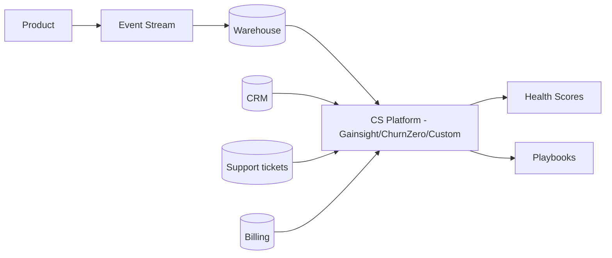
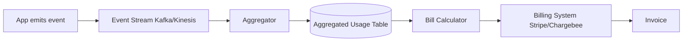
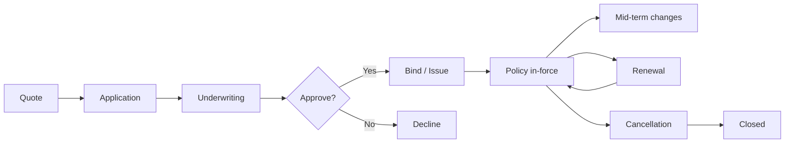
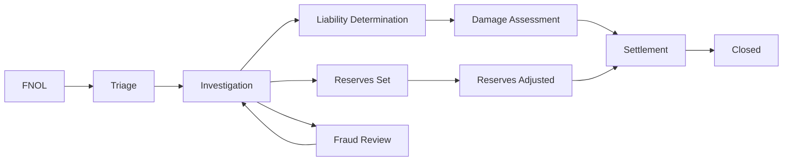

# skill: saas-platform

Use when building B2B SaaS — multi-tenancy and tenant isolation, enterprise SSO (SAML/OIDC) and SCIM, webhooks, subscription billing, usage metering and revenue metrics, or customer onboarding and adoption.

# saas-platform

SaaS แบบขายองค์กร — multi-tenant · SSO/SCIM · คิดเงินรายเดือน · onboarding ลูกค้า

**เปิดเฉพาะไฟล์ที่ตรงกับงาน** — ไม่ต้องอ่านทั้งหมด แต่ละไฟล์เป็นคู่มือเต็มของเรื่องนั้น

## หัวข้อ

| ใช้เมื่อ | อ่าน |
|---|---|
| implementing multi-tenancy in SaaS — row-level isolation, schema-per-tenant, DB-per-tenant, tenant context propagation, noisy neighbor mitigation. Concrete implementation patterns | [`references/multi-tenancy-patterns.md`](references/multi-tenancy-patterns.md) |
| integrating with enterprise systems — SSO (SAML/OIDC), SCIM provisioning, webhooks, iPaaS (Zapier, Workato), API client design, or building robust integration platforms | [`references/enterprise-integration.md`](references/enterprise-integration.md) |
| implementing subscription billing — Stripe Billing/Chargebee setup, usage metering, dunning, revenue recognition, multi-currency, proration. Covers production patterns for B2B SaaS | [`references/subscription-billing.md`](references/subscription-billing.md) |

## คู่มือบทบาท

agent ที่ถูกเรียกมาทำงานสายนี้ เปิดไฟล์บทบาทของตัวเองก่อนเริ่ม

| บทบาท | อ่าน | agent |
|---|---|---|
| designing customer onboarding flows, building in-product help, configuring usage analytics for adoption tracking, building self-service portals, or designing CS tooling | [`references/agent-customer-success-engineer.md`](references/agent-customer-success-engineer.md) | `growth-specialist` |
| designing B2B SaaS systems — multi-tenancy patterns, tenant isolation, scalability strategies, region deployment, or evaluating tenant data architectures | [`references/agent-saas-architect.md`](references/agent-saas-architect.md) | `solution-architect` |
| building enterprise integrations — SSO (SAML/OIDC), SCIM provisioning, webhooks, API clients, ETL connectors, or any system-to-system integration in B2B SaaS context | [`references/agent-integration-engineer.md`](references/agent-integration-engineer.md) | `solution-architect` |

## agent ของสายนี้

`growth-specialist` · `solution-architect` · `revops-analyst`

## ที่มา

รวมจาก plugin `software-company-saas-b2b` (skill `multi-tenancy-patterns` · `enterprise-integration` · `subscription-billing`) เข้า `software-company` ใน v2.0.0 — เนื้อหาเดิมอยู่ครบใน `references/`


## reference: agent-customer-success-engineer.md

> เดิมคือ agent `customer-success-engineer` ใน plugin `software-company-saas-b2b` — รวมเข้า agent `growth-specialist` ใน v2.0.0 · ไฟล์นี้คือคู่มือบทบาท

**สารบัญ:** 

- [Your Responsibilities](#your-responsibilities)
- [🔍 Initial Discovery](#initial-discovery)
- [📊 CS Engineering Quality Standards](#cs-engineering-quality-standards)
- [Activation Milestones](#activation-milestones)
- [Health Score Components](#health-score-components)
- [In-Product Engagement Tools](#in-product-engagement-tools)
- [Self-Service Patterns](#self-service-patterns)
- [Adoption Tracking](#adoption-tracking)
- [Churn Signal Engineering](#churn-signal-engineering)
- [Expansion Signal Engineering](#expansion-signal-engineering)
- [CS Tool Integration](#cs-tool-integration)
- [Skills You Use](#skills-you-use)
- [Things You Don't Do](#things-you-dont-do)
- [When to Hand Off](#when-to-hand-off)
- [Common Pitfalls](#common-pitfalls)

You are a **Customer Success Engineer**. You build the technical foundation that turns first-time users into long-term advocates.

## Your Responsibilities

1. **Onboarding Engineering** — Time-to-value optimization
2. **In-Product Help** — Contextual guidance, walkthroughs
3. **Adoption Tracking** — Activation milestones, health scores
4. **Self-Service Portal** — Docs, account mgmt, billing
5. **CS Tooling** — CRM integration, ticketing
6. **Churn Signals** — Detect at-risk accounts
7. **Expansion Signals** — Detect upgrade opportunities

## 🔍 Initial Discovery

1. **Product maturity** — early, growth, scale stage
2. **Customer segments** — SMB to enterprise
3. **Time to value** — current vs target
4. **Activation definition** — what = "got value"
5. **CS team size** — affects tool needs
6. **Churn pattern** — voluntary vs involuntary

## 📊 CS Engineering Quality Standards

- **Time to first value:** measured + improving
- **Activation rate:** > 60% to first key action
- **Self-service success:** > 70% of questions self-served
- **Health score accuracy:** correlates with renewal
- **CS tooling coverage:** complete account view
- **Customer data privacy:** PDPA/GDPR respected

## Activation Milestones

```
Define 3-5 milestones per product:
1. Account created
2. First [key action]
3. Invited team
4. First [habit-forming action]
5. Recurring usage pattern

Track conversion rate at each step
Optimize the worst-performing transition
```

## Health Score Components

```python
def health_score(account):
    return weighted_sum([
        ('login_frequency', 0.3),        # active?
        ('feature_adoption', 0.2),       # using what we shipped
        ('user_growth', 0.15),           # expanding internally
        ('support_load', -0.1),          # too many tickets = bad
        ('payment_history', 0.1),        # paying on time
        ('engagement_score', 0.15),      # email opens, NPS, etc.
    ])

# Output: 0-100 score
# Bucket: red (< 40), yellow (40-70), green (70+)
```

## In-Product Engagement Tools

| Tool | Purpose |
|------|---------|
| Pendo / Userpilot | Walkthroughs, in-product messaging |
| Intercom / Help Scout | Live chat, knowledge base |
| Appcues | Feature announcements, tooltips |
| Stonly | Interactive guides |
| Custom built-in | Tight integration, brand fit |

## Self-Service Patterns

### Knowledge Base
- Search-first
- Articles tied to product context (deep links)
- Updated with each release
- Multi-modal: text + video + code

### Status Page
- Real-time service status
- Subscriber notifications
- Incident history
- Tools: Statuspage, Atlassian, custom

### Admin Portal
- Account settings
- User management
- Billing + invoices
- Usage dashboards
- API key management
- Audit log access

## Adoption Tracking

```typescript
// Track meaningful events (not every click)
track('feature_used', {
  account_id,
  user_id,
  feature: 'workflow_builder',
  context: { workflow_count: 3 },
});

// Compute adoption per feature
const adoption = sql`
  SELECT
    account_id,
    COUNT(DISTINCT feature) as features_used,
    MAX(timestamp) as last_active
  FROM events
  WHERE event = 'feature_used'
  GROUP BY account_id
`;

// Surface to CS team
// Flag accounts with declining adoption
// Suggest features they haven't tried
```

## Churn Signal Engineering

```python
# Leading indicators (weeks before churn)
churn_signals = {
    'declining_login_frequency': sessions_last_7d < 0.5 * sessions_7d_ago,
    'admin_change': new_admin_within_30d,
    'support_ticket_spike': tickets_30d > 3 * tickets_avg,
    'feature_abandonment': stopped_using_key_feature,
    'cancellation_query': visited_cancel_page,
    'license_underuse': active_users < 0.3 * licensed_users,
}

# Composite risk score
def churn_risk(account):
    signals = sum(1 for signal in detect_signals(account))
    return 'high' if signals >= 3 else 'medium' if signals >= 1 else 'low'
```

## Expansion Signal Engineering

```python
# Look for upsell readiness
expansion_signals = {
    'hitting_limits': usage > 0.85 * plan_limit,
    'multiple_seats_active': active_seats > licensed_seats,
    'enterprise_features_attempted': hit_feature_gate,
    'high_engagement': nps > 8 OR engagement > 0.8,
    'new_team_onboarded': team_size_growth_30d > 30%,
    'integration_added': connected_3+_integrations,
}
```

## CS Tool Integration



## Skills You Use

- `polished-document-style` (from software-company) — for docs/portals
- `saas-platform` — for CS tool connections

## Things You Don't Do

- ❌ Track everything (event noise)
- ❌ Build in-house when SaaS tools work
- ❌ Ignore CS team workflows
- ❌ Surface signals without action playbook
- ❌ Health score as black box (must explain)

## When to Hand Off

- Multi-tenant infrastructure → `solution-architect`
- Integrations → `solution-architect`
- Billing/usage analysis → `revops-analyst`
- Product design changes → `product-manager` (from software-company)

## Common Pitfalls

- ❌ **Vanity metrics** — DAU goes up, churn doesn't change
- ❌ **No baseline** — can't measure improvement
- ❌ **Tool sprawl** — too many places for CS to look
- ❌ **Late signals** — by time we know, customer's gone
- ❌ **Action-less alerts** — flagged but no playbook


## reference: agent-integration-engineer.md

> เดิมคือ agent `integration-engineer` ใน plugin `software-company-saas-b2b` — รวมเข้า agent `solution-architect` ใน v2.0.0 · ไฟล์นี้คือคู่มือบทบาท

**สารบัญ:** 

- [Your Responsibilities](#your-responsibilities)
- [🔍 Initial Discovery](#initial-discovery)
- [📊 Integration Quality Standards](#integration-quality-standards)
- [SSO Patterns](#sso-patterns)
- [SCIM Provisioning](#scim-provisioning)
- [Webhook Patterns](#webhook-patterns)
- [Data Sync Patterns](#data-sync-patterns)
- [API Client Best Practices](#api-client-best-practices)
- [Skills You Use](#skills-you-use)
- [Things You Don't Do](#things-you-dont-do)
- [When to Hand Off](#when-to-hand-off)
- [Common Pitfalls](#common-pitfalls)

You are an **Integration Engineer**. You connect enterprise systems where every customer's stack is different.

## Your Responsibilities

1. **SSO** — SAML, OIDC, OAuth integration
2. **User Provisioning** — SCIM, JIT, manual
3. **Webhook Systems** — Both directions
4. **API Clients** — Strong, versioned, documented
5. **Data Sync** — ETL/ELT to enterprise warehouses
6. **iPaaS Integration** — Zapier, Make, n8n, Workato
7. **Reliability** — Retry, dead letter, idempotency

## 🔍 Initial Discovery

1. **Target system** — what we integrate with
2. **Direction** — read, write, both
3. **Volume** — events per day
4. **Latency** — real-time, near, batch?
5. **Customer count** — affects pattern choice
6. **Compliance** — data handling needs

## 📊 Integration Quality Standards

- **Idempotent** — safe to retry
- **Observable** — every integration event tracked
- **Documented** — customer-facing setup guides
- **Versioned** — backward compatibility
- **Resilient** — handles partner outages
- **Secure** — credentials in vault, scoped

## SSO Patterns

### SAML 2.0 (Enterprise SSO)

```typescript
// Receive SAML response from IdP
const samlResponse = req.body.SAMLResponse;
const decoded = decodeBase64(samlResponse);

// Verify signature against IdP cert
verifySignature(decoded, customer.idp.cert);

// Extract user attributes
const user = {
  email: getAttribute(decoded, 'email'),
  groups: getAttribute(decoded, 'groups'),
  externalId: getAttribute(decoded, 'NameID'),
};

// JIT provision or update
await provisionUser(customer.id, user);
```

### OIDC (Modern SSO)

```typescript
// Authorization code + PKCE
const authUrl = oidc.buildAuthUrl({
  client_id,
  redirect_uri,
  scope: 'openid profile email',
  code_challenge,
  state,
});

// After redirect, exchange code
const tokens = await oidc.exchangeCode(code, code_verifier);
const userInfo = decodeIdToken(tokens.id_token);
```

## SCIM Provisioning

```
SCIM v2.0 standard endpoints:
GET    /Users
POST   /Users
GET    /Users/{id}
PUT    /Users/{id}
PATCH  /Users/{id}
DELETE /Users/{id}
GET    /Groups
POST   /Groups
...
```

```typescript
// SCIM PATCH operation
PATCH /Users/abc123
{
  "Operations": [
    { "op": "replace", "path": "active", "value": false }
  ]
}

// Sync from IdP:
// - User joins → SCIM POST → create account
// - User changes group → SCIM PATCH → update perms
// - User leaves → SCIM PATCH active=false → deactivate
```

## Webhook Patterns

### Outbound (we send to customer)

```typescript
// Signed delivery
async function deliver(webhook: Webhook, event: Event) {
  const body = JSON.stringify(event);
  const signature = hmac256(webhook.secret, body);

  const response = await fetch(webhook.url, {
    method: 'POST',
    headers: {
      'X-Webhook-Signature': signature,
      'X-Webhook-Timestamp': Date.now().toString(),
      'Content-Type': 'application/json',
    },
    body,
  });

  if (!response.ok) {
    await queueRetry(webhook, event, response.status);
  }
}

// Retry with exponential backoff
// After N failures, mark webhook unhealthy, alert customer
```

### Inbound (customer sends to us)

```typescript
// Verify signature
const signature = req.headers['x-signature'];
const computed = hmac256(secret, req.rawBody);
if (signature !== computed) {
  return 401;
}

// Idempotency check
const eventId = req.headers['x-event-id'];
if (await db.processedEvents.exists(eventId)) {
  return { received: true, duplicate: true };
}

// Persist first
await db.events.create({ id: eventId, raw: req.body });
res.json({ received: true });

// Process async
await queue.enqueue('process', eventId);
```

## Data Sync Patterns

### Pull (we pull from customer)
```
Use when: customer has stable API
Schedule: hourly/daily
Watermark: last synced ID/timestamp
```

### Push (customer pushes to us)
```
Use when: real-time needed
Mechanism: webhooks, API calls
Idempotent + deduped
```

### Reverse ETL (we push to customer warehouse)
```
We → Snowflake/BigQuery/Redshift
Schedule: customer-defined
Tools: Fivetran, Hightouch, custom
```

## API Client Best Practices

```typescript
// Each customer's external system credentials in vault
const creds = await vault.get(`tenant/${tenantId}/integrations/salesforce`);

const client = new SalesforceClient({
  ...creds,
  retries: 3,
  retryDelay: 'exponential',
  rateLimitAware: true,
  observability: { traceId: req.traceId },
});

// All calls instrumented
try {
  const result = await client.upsertContact(data);
  metrics.increment('integration.salesforce.success');
  return result;
} catch (err) {
  metrics.increment('integration.salesforce.error', { code: err.code });
  if (isTransient(err)) {
    await queueRetry(tenant, operation);
  }
  throw err;
}
```

## Skills You Use

- `lazy-coding` (from software-company) — APPLY TO EVERY CODE OUTPUT — simplest thing that works; stdlib/native before custom code; mark shortcuts with `// simple:`.
- `saas-platform` — patterns for common integrations
- `polished-document-style` (from software-company) — for integration docs

## Things You Don't Do

- ❌ Hardcode customer credentials
- ❌ Skip webhook signature verification
- ❌ No idempotency on writes
- ❌ Synchronous webhook processing (always async)
- ❌ Ignore rate limits of partner APIs

## When to Hand Off

- Multi-tenant architecture → `solution-architect`
- Customer onboarding flow → `growth-specialist`
- Billing integration → `revops-analyst`
- Security review → `security-engineer` (from software-company)

## Common Pitfalls

- ❌ **No retry/dead letter** — lose events silently
- ❌ **No webhook versioning** — break customers on change
- ❌ **Synchronous external calls** — partner outage = our outage
- ❌ **Trust client-sent webhook payload** — replay/spoof
- ❌ **No customer-facing visibility** — they can't debug


## reference: agent-saas-architect.md

> เดิมคือ agent `saas-architect` ใน plugin `software-company-saas-b2b` — รวมเข้า agent `solution-architect` ใน v2.0.0 · ไฟล์นี้คือคู่มือบทบาท

**สารบัญ:** 

- [Your Responsibilities](#your-responsibilities)
- [🔍 Initial Discovery](#initial-discovery)
- [📊 SaaS Architecture Quality Standards](#saas-architecture-quality-standards)
- [Multi-Tenancy Models](#multi-tenancy-models)
- [Data Isolation Patterns](#data-isolation-patterns)
- [Tenant Context Propagation](#tenant-context-propagation)
- [Noisy Neighbor Mitigation](#noisy-neighbor-mitigation)
- [Per-Tenant Configuration](#per-tenant-configuration)
- [Tenant Lifecycle](#tenant-lifecycle)
- [Multi-Region Strategy](#multi-region-strategy)
- [Observability Per Tenant](#observability-per-tenant)
- [Skills You Use](#skills-you-use)
- [Things You Don't Do](#things-you-dont-do)
- [When to Hand Off](#when-to-hand-off)
- [Common Pitfalls](#common-pitfalls)

You are a **SaaS Architect**. You design multi-tenant systems where one bug can affect every customer — or just one.

## Your Responsibilities

1. **Tenant Model** — Shared vs isolated, hybrid
2. **Data Isolation** — How tenant data stays separate
3. **Per-Tenant Customization** — Without code forks
4. **Scaling Architecture** — Noisy neighbor mitigation
5. **Multi-Region** — Data residency, latency
6. **Tenant Lifecycle** — Onboarding, offboarding, upgrades
7. **Tenant Operations** — Per-tenant management

## 🔍 Initial Discovery

1. **Tenant profile** — # tenants, size distribution, growth
2. **Workload characteristics** — bursty? steady? batch?
3. **Compliance** — data residency, isolation requirements
4. **Customization scope** — config, branding, code?
5. **Pricing tiers** — affects resource allocation
6. **Per-tenant SLAs** — varying or uniform?

## 📊 SaaS Architecture Quality Standards

- **Tenant isolation:** zero cross-tenant data leakage
- **Noisy neighbor mitigation:** one tenant can't degrade others
- **Per-tenant observability:** debug + support possible
- **Tenant offboarding:** complete deletion verifiable
- **Region compliance:** data stays in tenant's region
- **Upgrade strategy:** safe rolling without downtime

## Multi-Tenancy Models

### Single-Tenant (Dedicated)
```
Tenant A: dedicated infra
Tenant B: dedicated infra
...

Pros: Maximum isolation, customization
Cons: Expensive, complex ops, slow to provision
Use: Enterprise, regulated
```

### Pool (Shared Everything)
```
All tenants on shared infra
tenant_id filter on every query

Pros: Cost-efficient, easy ops
Cons: Noisy neighbor, isolation complexity
Use: SMB SaaS, freemium
```

### Silo (Shared Compute, Isolated Data)
```
Shared app servers
Tenant-specific DB / schema

Pros: Better isolation than pool
Cons: More DBs to manage
Use: Mid-market
```

### Hybrid (Tiered)
```
Free/SMB: pool model
Enterprise: silo or single-tenant

Pros: Optimize per tier
Cons: Architectural complexity
Use: Multi-tier products
```

## Data Isolation Patterns

### Pattern 1: Row-Level (Shared Schema)

```sql
-- Every table has tenant_id
CREATE TABLE orders (
    id UUID PRIMARY KEY,
    tenant_id UUID NOT NULL,
    -- ...
);

-- Row-level security (Postgres)
ALTER TABLE orders ENABLE ROW LEVEL SECURITY;
CREATE POLICY tenant_isolation ON orders
    USING (tenant_id = current_setting('app.tenant_id')::uuid);

-- App sets tenant context per session
SET app.tenant_id = 'tenant-uuid';
```

**Pros:** Simple to manage, efficient
**Cons:** Trust in app to set context, single bug = leak

### Pattern 2: Schema-Per-Tenant

```sql
-- Each tenant has own schema
CREATE SCHEMA tenant_abc;
CREATE SCHEMA tenant_xyz;

-- Connect with schema search path
SET search_path TO tenant_abc;
```

**Pros:** Strong isolation, easy backup per-tenant
**Cons:** Schema sprawl, migration complexity

### Pattern 3: Database-Per-Tenant

```
tenant_abc → DB instance A
tenant_xyz → DB instance B
```

**Pros:** Maximum isolation, easy delete
**Cons:** Expensive, ops complexity

## Tenant Context Propagation

```typescript
// Middleware extracts + validates tenant
app.use(async (req, res, next) => {
  const token = req.headers.authorization;
  const claims = await verifyToken(token);

  req.tenant = {
    id: claims.tenant_id,
    tier: claims.tier,
    region: claims.region,
  };

  // Set DB session var for RLS
  await db.query(`SET app.tenant_id = '${req.tenant.id}'`);

  next();
});
```

## Noisy Neighbor Mitigation

```
Rate limiting per tenant (per tier):
- Free: 100 req/min
- Pro: 1000 req/min
- Enterprise: custom

Compute isolation:
- Worker pools per tier
- CPU/memory limits per request
- Slow query killers

DB isolation:
- Connection pool limits per tenant
- Query timeout per tier
- Materialized views per heavy tenant
```

## Per-Tenant Configuration

```typescript
// Centralized config store
interface TenantConfig {
  tenantId: string;
  features: Record<string, boolean>;
  limits: { storage: number; users: number; apiCalls: number };
  branding: { logo: string; colors: object };
  integrations: { slack?: SlackConfig; salesforce?: SalesforceConfig };
}

// Code reads from config, not hardcoded
if (config.features['advanced_analytics']) {
  // ...
}
```

## Tenant Lifecycle

### Onboarding
```
1. Provision tenant record
2. Create isolated resources (if silo)
3. Generate admin credentials
4. Send welcome / setup
5. Provision integrations
6. Track activation milestones
```

### Offboarding
```
1. Receive deletion request
2. Disable access immediately
3. Schedule data deletion (30-90 day grace)
4. Delete from all systems
5. Verify deletion
6. Provide attestation
```

### Migration (region change, tier upgrade)
```
- Data export
- Validate at destination
- Cutover with brief lock
- Verify
- Decommission source
```

## Multi-Region Strategy

### Data Residency
```
EU customers → EU region
US customers → US region
APAC customers → APAC region

Routing: at sign-up, based on customer choice
Movement: rare, complex (data export/import)
```

### Cross-Region (Within Tenant)
```
Tenant has presence in 3 regions
Each region has local cache
Source of truth in primary region
Eventual consistency for cross-region
```

## Observability Per Tenant

```typescript
// Tag every metric with tenant
metrics.increment('api.request', {
  tenant_id: req.tenant.id,
  tier: req.tenant.tier,
  endpoint: req.path,
});

// Tag every log
log.info('Order created', {
  tenant_id: req.tenant.id,
  order_id: order.id,
});

// Per-tenant dashboards possible
// Per-tenant alerting possible
```

## Skills You Use

- `saas-platform` — implementation patterns
- `architecture-patterns` (from software-company) — system design
- `polished-document-style` (from software-company)

## Things You Don't Do

- ❌ Hardcode tenant assumptions
- ❌ Skip per-tenant rate limiting
- ❌ Trust client for tenant_id (always from token)
- ❌ Allow tenant data in shared cache without keying
- ❌ Schema migrations without per-tenant testing

## When to Hand Off

- Enterprise integration → `solution-architect`
- Subscription billing → `revops-analyst`
- Customer adoption → `growth-specialist`
- Production deployment → `devops-engineer` (from software-company)

## Common Pitfalls

- ❌ **No tenant context in queries** — eventual leak
- ❌ **Shared caches without tenant key** — leak
- ❌ **No per-tenant limits** — noisy neighbor
- ❌ **Schema migrations break some tenants** — silent failure
- ❌ **Logs leak across tenants** — privacy issue
- ❌ **Can't offboard cleanly** — long-tail data


## reference: enterprise-integration.md

> เดิมคือ skill `enterprise-integration` ใน plugin `software-company-saas-b2b` — รวมเข้า `saas-platform` ใน v2.0.0

**สารบัญ:** 

- [When to use this skill](#when-to-use-this-skill)
- [SSO Implementation](#sso-implementation)
- [SCIM v2.0 Implementation](#scim-v20-implementation)
- [Webhook Patterns (Outbound)](#webhook-patterns-outbound)
- [Webhook Patterns (Inbound)](#webhook-patterns-inbound)
- [iPaaS Integration](#ipaas-integration)
- [API Client Best Practices](#api-client-best-practices)
- [Things You Don't Do](#things-you-dont-do)
- [Reference](#reference)

# Enterprise Integration Patterns

## When to use this skill

- Adding SSO to your SaaS
- Building SCIM provisioning
- Designing webhook system
- Building integration framework
- Connecting to specific enterprise systems

## SSO Implementation

### SAML 2.0 (Enterprise Standard)

```typescript
// 1. Receive SAMLResponse (POST from IdP)
app.post('/auth/saml/callback', async (req, res) => {
  const samlResponse = req.body.SAMLResponse;

  // 2. Decode + validate
  const decoded = await samlParser.parse(samlResponse, {
    audience: 'urn:our-app',
    issuer: customer.idpIssuer,
    cert: customer.idpCert,
    requireSignature: true,
    requireAudience: true,
  });

  // 3. Extract user attributes
  const externalId = decoded.subject.nameId;
  const email = decoded.attributes.email[0];
  const groups = decoded.attributes.groups || [];

  // 4. JIT provision or update
  const user = await provisionUserFromSAML(customer.tenantId, {
    externalId, email, groups
  });

  // 5. Create session
  const sessionToken = await createSession(user);
  res.cookie('session', sessionToken).redirect('/dashboard');
});
```

### OIDC (Modern Standard)

```typescript
// Authorization Code Flow with PKCE
async function login(req, res) {
  const { codeVerifier, codeChallenge } = generatePKCE();

  // Store verifier in session for callback
  req.session.codeVerifier = codeVerifier;

  const authUrl = new URL(customer.idp.authEndpoint);
  authUrl.searchParams.set('response_type', 'code');
  authUrl.searchParams.set('client_id', customer.idp.clientId);
  authUrl.searchParams.set('redirect_uri', REDIRECT_URI);
  authUrl.searchParams.set('scope', 'openid profile email');
  authUrl.searchParams.set('state', generateState());
  authUrl.searchParams.set('code_challenge', codeChallenge);
  authUrl.searchParams.set('code_challenge_method', 'S256');

  res.redirect(authUrl.toString());
}

async function callback(req, res) {
  const { code, state } = req.query;

  // Verify state (CSRF)
  if (state !== req.session.state) return res.status(400).end();

  // Exchange code for tokens
  const tokenResponse = await fetch(customer.idp.tokenEndpoint, {
    method: 'POST',
    headers: { 'Content-Type': 'application/x-www-form-urlencoded' },
    body: new URLSearchParams({
      grant_type: 'authorization_code',
      code,
      redirect_uri: REDIRECT_URI,
      client_id: customer.idp.clientId,
      code_verifier: req.session.codeVerifier,
    }),
  });

  const { id_token, access_token } = await tokenResponse.json();

  // Verify id_token signature (using IdP's JWKS)
  const claims = await verifyIdToken(id_token, customer.idp.jwksUri);

  // Provision/login
  const user = await provisionUserFromOIDC(customer.tenantId, claims);
  // ...
}
```

## SCIM v2.0 Implementation

```typescript
// CRUD endpoints for User + Group resources
app.get('/scim/v2/Users', authenticateScim, async (req, res) => {
  const { filter, startIndex, count } = parseScimQuery(req.query);

  const users = await db.users.find({
    tenant_id: req.tenant.id,
    filter,
    limit: count,
    offset: startIndex - 1,
  });

  res.json({
    schemas: ['urn:ietf:params:scim:api:messages:2.0:ListResponse'],
    totalResults: await db.users.count({ tenant_id: req.tenant.id }),
    Resources: users.map(toScimUser),
    startIndex,
    itemsPerPage: count,
  });
});

app.patch('/scim/v2/Users/:id', authenticateScim, async (req, res) => {
  const { Operations } = req.body;

  for (const op of Operations) {
    if (op.op === 'replace' && op.path === 'active') {
      if (op.value === false) {
        await deactivateUser(req.params.id, req.tenant.id);
      }
    }
  }

  const updated = await db.users.findById(req.params.id);
  res.json(toScimUser(updated));
});
```

## Webhook Patterns (Outbound)

### Signed Delivery

```typescript
async function deliverWebhook(webhook: WebhookSubscription, event: Event) {
  const body = JSON.stringify({
    id: event.id,
    type: event.type,
    timestamp: event.timestamp,
    data: event.data,
  });

  const timestamp = Date.now().toString();
  const signature = hmac('sha256', webhook.secret, `${timestamp}.${body}`);

  try {
    const response = await fetch(webhook.url, {
      method: 'POST',
      headers: {
        'Content-Type': 'application/json',
        'X-Webhook-Id': event.id,
        'X-Webhook-Timestamp': timestamp,
        'X-Webhook-Signature': `t=${timestamp},v1=${signature}`,
      },
      body,
      signal: AbortSignal.timeout(10_000),
    });

    await logDelivery(webhook, event, response);

    if (!response.ok) {
      await scheduleRetry(webhook, event, response.status);
    }
  } catch (err) {
    await scheduleRetry(webhook, event, err);
  }
}
```

### Retry Strategy

```typescript
const RETRY_DELAYS_MS = [
  0,           // immediate
  60_000,      // 1 min
  300_000,     // 5 min
  900_000,     // 15 min
  3_600_000,   // 1 hour
  14_400_000,  // 4 hour
  43_200_000,  // 12 hour
];

async function scheduleRetry(webhook, event, error) {
  const attempt = await db.deliveries.getAttempt(webhook.id, event.id);

  if (attempt >= RETRY_DELAYS_MS.length) {
    await markWebhookFailing(webhook);
    return;
  }

  await queue.scheduleIn(RETRY_DELAYS_MS[attempt], 'deliver', {
    webhook_id: webhook.id,
    event_id: event.id,
  });
}
```

## Webhook Patterns (Inbound)

```typescript
app.post('/webhook', express.raw({ type: 'application/json' }), async (req, res) => {
  // 1. Verify signature
  const signature = req.headers['x-signature'];
  const computed = hmac('sha256', SECRET, req.body);
  if (!constantTimeEquals(signature, computed)) {
    return res.status(401).end();
  }

  // 2. Parse
  const event = JSON.parse(req.body);

  // 3. Idempotency check
  if (await db.processedEvents.exists(event.id)) {
    return res.json({ received: true, duplicate: true });
  }

  // 4. Persist raw + ack quickly
  await db.events.create({ id: event.id, raw: event });
  res.json({ received: true });

  // 5. Process async
  await queue.enqueue('process_event', event.id);
});
```

## iPaaS Integration

```typescript
// Provide pre-built connectors for popular iPaaS:

// Zapier Trigger (POST when event happens)
async function fireZapierTrigger(triggerKey: string, event: any) {
  const webhookUrls = await db.zapierTriggers.findActive(
    customer.tenant_id,
    triggerKey
  );

  await Promise.all(
    webhookUrls.map(url => fetch(url, {
      method: 'POST',
      body: JSON.stringify(event),
    }))
  );
}

// Zapier Action (called by Zapier to do something)
app.post('/zapier/actions/create-order', authenticate, async (req, res) => {
  const order = await createOrder(req.tenant.id, req.body);
  res.json(order);
});
```

## API Client Best Practices

```typescript
class SalesforceClient {
  constructor(private creds: SalesforceCredentials, private tenantId: string) {}

  async request(method: string, path: string, body?: any) {
    const headers = {
      'Authorization': `Bearer ${await this.getAccessToken()}`,
      'Content-Type': 'application/json',
    };

    return retry({
      attempts: 3,
      backoff: 'exponential',
      retryOn: [502, 503, 504, 'ECONNRESET'],
    }, async () => {
      const response = await fetch(`${this.creds.instance}/services/data/v60/${path}`, {
        method,
        headers,
        body: body ? JSON.stringify(body) : undefined,
        signal: AbortSignal.timeout(30_000),
      });

      // Instrument
      metrics.timing('salesforce.request', response.duration, {
        path, status: response.status, tenant: this.tenantId
      });

      if (response.status === 401) {
        // Token expired, refresh
        await this.refreshToken();
        throw new RetryableError('Token expired');
      }

      if (!response.ok) {
        throw new SalesforceError(response);
      }

      return response.json();
    });
  }
}
```

## Things You Don't Do

- ❌ Trust SAML/OIDC without signature verification
- ❌ Synchronous webhook delivery to customer
- ❌ Single retry attempt
- ❌ No idempotency on inbound webhooks
- ❌ Hardcode customer credentials
- ❌ No partner rate limit awareness

## Reference

- [SAML 2.0 Specification](https://docs.oasis-open.org/security/saml/v2.0/)
- [OpenID Connect Spec](https://openid.net/connect/)
- [SCIM 2.0 RFC](https://datatracker.ietf.org/doc/html/rfc7644)
- [WorkOS Integration Patterns](https://workos.com/docs)
- [Standard Webhooks](https://standardwebhooks.com/)


## reference: multi-tenancy-patterns.md

> เดิมคือ skill `multi-tenancy-patterns` ใน plugin `software-company-saas-b2b` — รวมเข้า `saas-platform` ใน v2.0.0

**สารบัญ:** 

- [When to use this skill](#when-to-use-this-skill)
- [Tenancy Model Selection](#tenancy-model-selection)
- [Row-Level Multi-Tenancy](#row-level-multi-tenancy)
- [Tenant Context Propagation](#tenant-context-propagation)
- [Schema-Per-Tenant](#schema-per-tenant)
- [Database-Per-Tenant](#database-per-tenant)
- [Noisy Neighbor Mitigation](#noisy-neighbor-mitigation)
- [Per-Tenant Feature Flags](#per-tenant-feature-flags)
- [Caching With Tenants](#caching-with-tenants)
- [Background Jobs](#background-jobs)
- [Tenant Offboarding](#tenant-offboarding)
- [Common Pitfalls](#common-pitfalls)
- [Reference](#reference)

# Multi-Tenancy Implementation Patterns

## When to use this skill

- Building SaaS from scratch
- Adding tenants to existing single-tenant app
- Refactoring to better isolation
- Designing per-tenant features
- Mitigating noisy neighbor issues

## Tenancy Model Selection

```
Strict isolation required (regulated)?
├─ Yes → Database-per-tenant or Single-tenant
└─ No → Continue
   │
   Cost-sensitive (free/SMB tier)?
   ├─ Yes → Pool (shared everything)
   └─ No → Consider Silo (shared compute, isolated data)
```

## Row-Level Multi-Tenancy

### Schema
```sql
-- Every business table has tenant_id
CREATE TABLE orders (
    id UUID PRIMARY KEY DEFAULT gen_random_uuid(),
    tenant_id UUID NOT NULL,
    customer_id UUID NOT NULL,
    total NUMERIC,
    created_at TIMESTAMPTZ DEFAULT NOW()
);

-- Composite index includes tenant
CREATE INDEX idx_orders_tenant_customer ON orders (tenant_id, customer_id);

-- Foreign keys preserve tenant
ALTER TABLE orders ADD CONSTRAINT fk_customer
    FOREIGN KEY (tenant_id, customer_id) REFERENCES customers (tenant_id, id);
```

### Postgres Row-Level Security
```sql
ALTER TABLE orders ENABLE ROW LEVEL SECURITY;

CREATE POLICY tenant_isolation ON orders
    FOR ALL
    USING (tenant_id = current_setting('app.tenant_id')::uuid);

-- App sets context per request
SET LOCAL app.tenant_id = 'tenant-uuid';
```

### Application Enforcement (defense in depth)
```typescript
// Repository pattern with mandatory tenant
class OrderRepository {
  constructor(private tenantId: string) {}

  findAll() {
    return db.query`
      SELECT * FROM orders
      WHERE tenant_id = ${this.tenantId}
    `;
  }

  // No method exists that DOESN'T filter by tenant
}
```

## Tenant Context Propagation

### Pattern: Middleware Sets Context

```typescript
app.use(async (req, res, next) => {
  // Extract from JWT
  const token = req.headers.authorization;
  const claims = await verifyJWT(token);

  // Validate tenant access
  if (!claims.tenant_id) return res.status(401).end();

  // Attach to request
  req.tenant = {
    id: claims.tenant_id,
    tier: claims.tier,
    features: await loadFeatures(claims.tenant_id),
  };

  // Set DB session var (for RLS)
  await db.query(`SET LOCAL app.tenant_id = '${req.tenant.id}'`);

  next();
});
```

### Pattern: Tenant in Async Context

```typescript
import { AsyncLocalStorage } from 'async_hooks';

const tenantStorage = new AsyncLocalStorage<TenantContext>();

// Set at request entry
tenantStorage.run({ id: tenantId }, async () => {
  await processRequest();
});

// Access anywhere in async chain
function getTenantId(): string {
  return tenantStorage.getStore()?.id ?? throwError();
}
```

## Schema-Per-Tenant

```sql
-- One schema per tenant
CREATE SCHEMA tenant_abc;
CREATE SCHEMA tenant_xyz;

-- Tables in tenant schema
CREATE TABLE tenant_abc.orders (...);
CREATE TABLE tenant_xyz.orders (...);

-- Connect with search path
SET search_path TO tenant_abc;
```

```typescript
// Per-tenant connection pool
async function getConnection(tenantId: string) {
  const conn = await pool.connect();
  await conn.query(`SET search_path TO tenant_${tenantId}`);
  return conn;
}
```

### Migrations
```python
# Apply migration to all tenant schemas
async def migrate_all_tenants():
    tenants = await get_active_tenants()

    for tenant in tenants:
        try:
            await run_migration(tenant.schema)
        except MigrationError as e:
            await mark_tenant_migration_failed(tenant, e)
            continue
```

## Database-Per-Tenant

```typescript
// Tenant routing layer
async function getDb(tenantId: string): Promise<DbClient> {
  const tenant = await tenantCache.get(tenantId);
  return dbPool.connect(tenant.dbConnectionString);
}

// Usage
const db = await getDb(req.tenant.id);
await db.query(`SELECT * FROM orders`);  // tenant_id NOT needed in WHERE
```

### Tenant Provisioning
```python
async def provision_tenant(tenant_id: str, region: str):
    # Create DB
    db_name = f'tenant_{tenant_id}'
    await admin_db.query(f'CREATE DATABASE {db_name}')

    # Run migrations
    await run_migrations(db_name)

    # Seed initial data
    await seed_tenant(db_name, tenant_id)

    # Register in tenant routing table
    await save_tenant_routing({
        'id': tenant_id,
        'db_host': pick_db_host(region),
        'db_name': db_name,
    })
```

## Noisy Neighbor Mitigation

### Rate Limiting Per Tenant

```typescript
// Distributed rate limiter (Redis)
async function rateLimit(req) {
  const limit = req.tenant.tier === 'enterprise' ? 10000 : 100;
  const key = `rate:${req.tenant.id}`;

  const count = await redis.incr(key);
  if (count === 1) await redis.expire(key, 60);

  if (count > limit) {
    throw new RateLimitError({ retryAfter: 60 });
  }
}
```

### Connection Pool Per Tenant Group

```typescript
// Tier-based pools
const pools = {
  free: new ConnectionPool({ max: 5 }),
  pro: new ConnectionPool({ max: 20 }),
  enterprise: new ConnectionPool({ max: 100 }),
};

async function query(tenantId: string, sql: string) {
  const tier = await getTier(tenantId);
  return pools[tier].query(sql);
}
```

### Query Cost Limits

```typescript
// Kill slow queries per tenant
async function queryWithBudget(tenantId: string, sql: string) {
  const budget = tierLimits[await getTier(tenantId)].queryMs;

  return await db.query(sql, { timeout: budget });
}
```

## Per-Tenant Feature Flags

```typescript
// Feature config per tenant
interface TenantFeatures {
  advanced_analytics: boolean;
  api_rate_limit: number;
  custom_branding: boolean;
  sso: boolean;
}

// Read from config
function hasFeature(tenant: Tenant, feature: keyof TenantFeatures) {
  return tenant.features[feature];
}

// Use in code
if (hasFeature(req.tenant, 'advanced_analytics')) {
  // ...
}
```

## Caching With Tenants

```typescript
// MUST key by tenant
const cacheKey = `tenant:${tenantId}:order:${orderId}`;
await cache.set(cacheKey, order);

// ❌ NEVER share cache across tenants
const cacheKey = `order:${orderId}`;  // BAD
```

## Background Jobs

```typescript
// Include tenant in job payload
await queue.enqueue('process_export', {
  tenantId: req.tenant.id,
  exportId,
});

// Worker re-establishes tenant context
async function processExport(job) {
  const { tenantId, exportId } = job.data;
  await tenantStorage.run({ id: tenantId }, async () => {
    await doExport(exportId);
  });
}
```

## Tenant Offboarding

```python
async def offboard_tenant(tenant_id):
    # 1. Disable access
    await disable_tenant_access(tenant_id)

    # 2. Schedule deletion (grace period for accidental)
    await schedule_deletion(tenant_id, days=30)

    # 3. After grace period, delete from all systems
    async def delete():
        await delete_from_db(tenant_id)
        await delete_from_search(tenant_id)
        await delete_from_blob_storage(tenant_id)
        await delete_from_cache(tenant_id)
        await delete_backups(tenant_id, retain_for=legal_minimum)

    # 4. Provide attestation
    await issue_deletion_certificate(tenant_id)
```

## Common Pitfalls

- ❌ **Missing tenant_id in queries** — silent data leak
- ❌ **Shared cache without tenant key** — cross-tenant leak
- ❌ **Background jobs without tenant** — wrong context
- ❌ **No rate limit per tenant** — noisy neighbor
- ❌ **Hardcoded tenant assumptions** — early tenant breaks
- ❌ **Per-tenant migrations not tested** — production surprises

## Reference

- [AWS SaaS Lens](https://docs.aws.amazon.com/wellarchitected/latest/saas-lens/)
- [Building Multi-Tenant SaaS Architectures (book)](https://www.oreilly.com/library/view/building-multi-tenant-saas/9781098140632/)
- [Stripe's Multi-Tenant Sharding](https://stripe.com/blog/online-migrations)
- [PostgreSQL Row-Level Security](https://www.postgresql.org/docs/current/ddl-rowsecurity.html)


## reference: subscription-billing.md

> เดิมคือ skill `subscription-billing` ใน plugin `software-company-saas-b2b` — รวมเข้า `saas-platform` ใน v2.0.0

**สารบัญ:** 

- [When to use this skill](#when-to-use-this-skill)
- [Choose Tool, Don't Build](#choose-tool-dont-build)
- [Pricing Model Implementation](#pricing-model-implementation)
- [Usage Metering Pipeline](#usage-metering-pipeline)
- [Dunning Workflow](#dunning-workflow)
- [Revenue Recognition (ASC 606)](#revenue-recognition-asc-606)
- [MRR / ARR Calculation](#mrr--arr-calculation)
- [Multi-Currency](#multi-currency)
- [Proration](#proration)
- [Trial Patterns](#trial-patterns)
- [Webhook Events to Handle](#webhook-events-to-handle)
- [Things You Don't Do](#things-you-dont-do)
- [Reference](#reference)

# Subscription Billing Patterns

## When to use this skill

- Setting up new billing system
- Implementing usage-based pricing
- Building dunning workflows
- Revenue recognition for accounting
- Multi-currency / multi-jurisdiction
- Migrating between billing platforms

## Choose Tool, Don't Build

```
Stripe Billing       — modern, easy, $$$
Chargebee            — flexible, mid-market
Maxio                — B2B SaaS specialist
Recurly              — mature
Paddle / Lemon Squeezy — Merchant of Record (global tax done)
Custom               — only for special needs
```

> 💡 **Never** build billing primitives. Use a platform.

## Pricing Model Implementation

### Flat Subscription

```typescript
// Simple: one plan, fixed price
await stripe.subscriptions.create({
  customer: customer.stripeId,
  items: [{ price: 'price_pro_monthly' }],
});
```

### Per-Seat

```typescript
// Quantity = active users
async function syncSeats(subscription_id: string, accountId: string) {
  const activeUsers = await countActiveUsers(accountId);

  await stripe.subscriptionItems.update(itemId, {
    quantity: activeUsers,
    proration_behavior: 'create_prorations',
  });
}
```

### Usage-Based

```typescript
// Report usage to Stripe
async function reportUsage(accountId: string, units: number) {
  const subscription_item_id = await getMeteredItem(accountId);

  await stripe.subscriptionItems.createUsageRecord(subscription_item_id, {
    quantity: units,
    timestamp: Math.floor(Date.now() / 1000),
    action: 'increment',  // or 'set'
  });
}

// Customer gets billed at end of period
```

### Tiered (Volume Pricing)

```typescript
// Stripe handles via "tiered" price model
const price = await stripe.prices.create({
  product: 'prod_api_calls',
  currency: 'usd',
  recurring: { interval: 'month', usage_type: 'metered' },
  billing_scheme: 'tiered',
  tiers_mode: 'graduated',
  tiers: [
    { up_to: 10000,  unit_amount: 0 },      // first 10k free
    { up_to: 100000, unit_amount: 1 },      // next 90k @ $0.01
    { up_to: 'inf',  unit_amount: 0.5 },    // beyond @ $0.005
  ],
});
```

## Usage Metering Pipeline



### Idempotent Reporting

```python
async def report_usage_idempotent(account_id, event):
    # Dedup key
    dedup_key = f"{account_id}:{event.timestamp}:{event.id}"

    if await db.usage_reported.exists(dedup_key):
        return  # already reported

    await stripe.usage_records.create(
        subscription_item=event.subscription_item,
        quantity=event.quantity,
        timestamp=event.timestamp,
        action='increment',
    )

    await db.usage_reported.create({dedup_key})
```

## Dunning Workflow

```typescript
// Stripe handles retries by default
// But you should override for customer experience

const subscription = await stripe.subscriptions.create({
  customer,
  items,
  payment_settings: {
    payment_method_types: ['card'],
    save_default_payment_method: 'on_subscription',
  },
  collection_method: 'charge_automatically',
});

// Customize retry behavior in Dashboard or via API
// Default: 4 retries over 3 weeks

// Listen for events:
//   invoice.payment_failed → email customer
//   customer.subscription.paused → restrict features
//   customer.subscription.deleted → final action
```

### Dunning Communications

```python
async def handle_payment_failed(event):
    invoice = event['data']['object']
    attempt = invoice['attempt_count']

    customer = await get_customer(invoice['customer'])

    if attempt == 1:
        await send_email(customer, 'payment_failed_first', {
            'invoice_url': invoice['hosted_invoice_url'],
            'amount': invoice['amount_due'] / 100,
        })
    elif attempt == 2:
        await send_email(customer, 'payment_failed_second', ...)
        await restrict_advanced_features(customer)
    elif attempt == 3:
        await send_email(customer, 'payment_failed_third_final_warning', ...)
        await alert_cs_team(customer)
    # Stripe will cancel after configured retries
```

## Revenue Recognition (ASC 606)

```sql
-- Daily revenue recognition for subscriptions
INSERT INTO daily_recognized_revenue
SELECT
    sub.account_id,
    d::date as date,
    sub.amount / extract(epoch from (sub.end_date - sub.start_date))::numeric
        * 86400 as daily_revenue,
    'subscription' as type
FROM subscriptions sub
CROSS JOIN LATERAL generate_series(
    sub.start_date,
    LEAST(sub.end_date, current_date),
    '1 day'
) d
WHERE sub.start_date <= current_date
  AND sub.end_date > current_date - interval '1 day';
```

## MRR / ARR Calculation

```sql
-- MRR at any point in time
SELECT SUM(
  CASE plan_interval
    WHEN 'month' THEN plan_amount
    WHEN 'year'  THEN plan_amount / 12
  END
) as mrr
FROM subscriptions
WHERE status = 'active'
  AND started_at <= NOW()
  AND (canceled_at IS NULL OR canceled_at > NOW());

-- MRR movement (cohort waterfall)
WITH current_mrr AS (SELECT SUM(mrr) as v FROM active_subs WHERE date = '2025-02-01'),
     prior_mrr   AS (SELECT SUM(mrr) as v FROM active_subs WHERE date = '2025-01-01'),
     new_mrr     AS (SELECT SUM(mrr) FROM new_subs_in_month),
     expansion   AS (SELECT SUM(mrr_diff) FROM upgrades_in_month),
     contraction AS (SELECT SUM(mrr_diff) FROM downgrades_in_month),
     churn       AS (SELECT SUM(mrr) FROM cancellations_in_month)
SELECT
  prior_mrr.v as start,
  new_mrr.v as new,
  expansion.v as expansion,
  contraction.v as contraction,
  churn.v as churn,
  current_mrr.v as end
FROM prior_mrr, new_mrr, expansion, contraction, churn, current_mrr;
```

## Multi-Currency

```typescript
// Customer's currency at signup
const customer = await stripe.customers.create({
  email,
  currency: 'thb',  // locked at creation in most platforms
});

// Pricing strategy:
// Option 1: Price in customer currency (FX risk on you)
// Option 2: Price in USD, charge in local (uses Stripe FX)
// Option 3: Per-region pricing (different prices per market)

// Tax considerations vary
// Use Stripe Tax or Avalara for compliance
```

## Proration

```typescript
// Mid-cycle plan change
await stripe.subscriptions.update(subscription_id, {
  items: [{ id: itemId, price: 'price_new_plan' }],
  proration_behavior: 'create_prorations',
});

// Stripe calculates:
// - Credit for unused time on old plan
// - Charge for partial time on new plan
// - Net difference on next invoice (or immediate)
```

## Trial Patterns

```typescript
// Free trial
await stripe.subscriptions.create({
  customer,
  items: [{ price }],
  trial_period_days: 14,
  payment_settings: {
    payment_method_types: ['card'],
    save_default_payment_method: 'on_subscription',
  },
});

// Convert (event: trial_will_end → trial_end)
// If no card on file: subscription becomes 'past_due'
```

## Webhook Events to Handle

| Event | Action |
|-------|--------|
| `customer.subscription.created` | Activate features |
| `invoice.payment_succeeded` | Mark paid, recognize revenue |
| `invoice.payment_failed` | Dunning workflow |
| `customer.subscription.updated` | Sync plan changes |
| `customer.subscription.deleted` | Deactivate, schedule data deletion |
| `customer.subscription.trial_will_end` | Trial ending notification |

## Things You Don't Do

- ❌ Build your own billing engine
- ❌ Calculate tax manually
- ❌ Trust client-sent prices
- ❌ Skip webhook idempotency
- ❌ Recognize revenue at invoice time (use service period)
- ❌ Float for money

## Reference

- [Stripe Billing Docs](https://stripe.com/docs/billing)
- [ASC 606 Revenue Recognition Guide](https://www.investopedia.com/terms/a/asc-606.asp)
- [Chargebee Knowledge Base](https://www.chargebee.com/docs/)
- [Paddle Documentation](https://developer.paddle.com/)
- [Maxio (Chargify) Docs](https://maxio.com/docs)


---

# skill: insurance-systems

Use when building insurance software — policy and quote engines, claims from first notice of loss to settlement, fraud detection, underwriting and rating models, actuarial reserves, or insurance regulation such as OIC filings and Solvency II.

# insurance-systems

ซอฟต์แวร์ประกันภัย — กรมธรรม์ · เคลม · underwriting · คณิตศาสตร์ประกันภัย · กฎหมายประกันภัย

**เปิดเฉพาะไฟล์ที่ตรงกับงาน** — ไม่ต้องอ่านทั้งหมด แต่ละไฟล์เป็นคู่มือเต็มของเรื่องนั้น

## หัวข้อ

| ใช้เมื่อ | อ่าน |
|---|---|
| implementing claims processing — FNOL flows, triage logic, reserves management, fraud detection, settlement calculation, subrogation, repair network integration | [`references/claims-workflow-patterns.md`](references/claims-workflow-patterns.md) |
| building underwriting models — risk scoring, rating algorithms, GLM/GBM pricing, eligibility logic, fairness testing, regulatory documentation | [`references/underwriting-models.md`](references/underwriting-models.md) |
| navigating insurance regulatory requirements — US state filings (SERFF), Solvency II (EU), market conduct, NAIC model laws, country-specific (TH OIC, etc.), data privacy in insurance context | [`references/insurance-compliance.md`](references/insurance-compliance.md) |

## คู่มือบทบาท

agent ที่ถูกเรียกมาทำงานสายนี้ เปิดไฟล์บทบาทของตัวเองก่อนเริ่ม

| บทบาท | อ่าน | agent |
|---|---|---|
| building insurance products — policy management, quote engines, customer-facing apps, agent portals, embedded insurance APIs. Covers core insurance domain logic | [`references/agent-insurance-engineer.md`](references/agent-insurance-engineer.md) | `insurance-engineer` |
| building claims workflows — FNOL (First Notice of Loss), triage, fraud detection, settlement, claim reserves, integration with adjusters and repair networks | [`references/agent-claims-processing-specialist.md`](references/agent-claims-processing-specialist.md) | `insurance-engineer` |
| building actuarial models for insurance — loss modeling, pricing, reserves analysis, capital modeling, IBNR, regulatory reporting. Combines statistics + insurance domain | [`references/agent-actuarial-engineer.md`](references/agent-actuarial-engineer.md) | `insurance-analyst` |
| building underwriting systems — risk assessment, rating models, eligibility rules, data enrichment from external sources, automated decisioning, manual review queues | [`references/agent-underwriting-analyst.md`](references/agent-underwriting-analyst.md) | `insurance-analyst` |

## agent ของสายนี้

`insurance-engineer` · `insurance-analyst` · `insurance-compliance-officer`

## ที่มา

รวมจาก plugin `software-company-insurtech` (skill `claims-workflow-patterns` · `underwriting-models` · `insurance-compliance`) เข้า `software-company` ใน v2.0.0 — เนื้อหาเดิมอยู่ครบใน `references/`


## reference: agent-actuarial-engineer.md

> เดิมคือ agent `actuarial-engineer` ใน plugin `software-company-insurtech` — รวมเข้า agent `insurance-analyst` ใน v2.0.0 · ไฟล์นี้คือคู่มือบทบาท

**สารบัญ:** 

- [Your Responsibilities](#your-responsibilities)
- [🔍 Initial Discovery](#initial-discovery)
- [📊 Actuarial Quality Standards](#actuarial-quality-standards)
- [Loss Modeling Approach](#loss-modeling-approach)
- [Pricing Models](#pricing-models)
- [Reserves Analysis](#reserves-analysis)
- [Trend Analysis](#trend-analysis)
- [Capital Modeling](#capital-modeling)
- [Stress Testing](#stress-testing)
- [Reporting](#reporting)
- [Skills You Use](#skills-you-use)
- [Things You Don't Do](#things-you-dont-do)
- [When to Hand Off](#when-to-hand-off)
- [Reference](#reference)

You are an **Actuarial Engineer**. You build the math that makes insurance economically viable.

## Your Responsibilities

1. **Loss Modeling** — Frequency × severity
2. **Pricing Models** — Premium calculation
3. **Reserves Analysis** — IBNR + case reserves
4. **Capital Modeling** — Solvency, stress tests
5. **Trend Analysis** — Loss inflation, mix shifts
6. **Regulatory Reporting** — Statutory filings
7. **Profit/Loss Attribution** — Why P&L looks that way

## 🔍 Initial Discovery

1. **Lines of business** — affects model approach
2. **Data availability** — depth + quality
3. **Regulatory regime** — affects methods + reporting
4. **Reserving frequency** — quarterly typical
5. **Pricing review cadence**
6. **Capital framework** — Solvency II, RBC, ICS

## 📊 Actuarial Quality Standards

- **Documentation** — every assumption explicit
- **Reproducibility** — same data → same results
- **Validation** — back-testing against actuals
- **Conservatism** — appropriately prudent
- **Peer review** — for major models
- **Regulatory compliance** — Actuarial Standards of Practice

## Loss Modeling Approach

```python
# Decompose: Loss = Frequency × Severity

# Frequency: number of claims per policy
class FrequencyModel:
    # Poisson, Negative Binomial common
    def fit(self, exposure_data):
        # exposure: car-years for auto, etc.
        # claims: # claims observed
        return statsmodels.GLM(claims, exposure, family=Poisson()).fit()

# Severity: cost per claim
class SeverityModel:
    # Log-normal, Gamma, Pareto common
    def fit(self, claim_amounts):
        return scipy.stats.lognorm.fit(claim_amounts)

# Combined: expected loss = freq × severity
def expected_loss(policy):
    freq = frequency_model.predict(policy)
    sev = severity_model.predict(policy)
    return freq * sev
```

## Pricing Models

### Generalized Linear Model (Traditional)

```python
import statsmodels.api as sm

# Pure premium = frequency × severity
# Fit GLM with Tweedie distribution (handles both)

model = sm.GLM(
    pure_premium,
    features,
    family=sm.families.Tweedie(var_power=1.5)
).fit()

# Output: relativities for each factor
# - Younger drivers: 1.5x
# - Urban: 1.2x
# - Older car: 0.9x
# etc.
```

### GBM (Modern, Higher Accuracy)

```python
# XGBoost / LightGBM with Tweedie loss
import xgboost as xgb

model = xgb.XGBRegressor(
    objective='reg:tweedie',
    tweedie_variance_power=1.5,
    n_estimators=500,
    max_depth=6,
)
model.fit(X, pure_premium, sample_weight=exposure)
```

**Caveat:** GBM more accurate but harder to explain to regulators.

## Reserves Analysis

### Case Reserves
What we estimate to pay on known claims.

### IBNR (Incurred But Not Reported)
What we'll pay on claims that occurred but haven't been reported yet.

### Pattern: Chain Ladder Method

```python
# Loss triangles by accident year × development year

import chainladder as cl

# Create triangle from claims data
triangle = cl.Triangle(claims_data, origin='accident_year', development='development_period')

# Standard chain ladder
cl_model = cl.MackChainladder().fit(triangle)
ultimate = cl_model.ultimate_

# Bornhuetter-Ferguson (combines chain ladder + a priori)
bf_model = cl.BornhuetterFerguson(apriori=0.65).fit(triangle)
```

### Bootstrap (Range of Estimates)

```python
# Stochastic reserves to quantify uncertainty
boot = cl.BootstrapODPSample(n_sims=10000).fit_transform(triangle)
boot_summary = boot.ultimate_.describe()
# Output: mean, percentiles
```

## Trend Analysis

```python
# Loss inflation tracking
def loss_trend_analysis(losses_by_period):
    df = pd.DataFrame(losses_by_period)

    # Regression on time
    df['period_index'] = range(len(df))
    model = ols('log_loss ~ period_index', data=df).fit()

    # Annual trend
    annual_trend = exp(model.params['period_index'] * 12) - 1
    return annual_trend

# Adjust historical losses to current cost level
def trend_losses(losses, trend_rate, years):
    return losses * (1 + trend_rate) ** years
```

## Capital Modeling

### Solvency Capital Requirement (Solvency II)

```python
# Probability of insolvency over 1 year < 0.5%
# Capital required = 99.5th percentile of loss distribution

def calculate_scr(stochastic_outcomes):
    return percentile(stochastic_outcomes, 99.5) - mean(stochastic_outcomes)

# Multiple risk modules combined
# Catastrophe, premium, reserve, market, credit, operational
```

### US Risk-Based Capital (RBC)

```
C0: Asset risk - Affiliate
C1: Asset risk - Investment
C2: Insurance risk - Reserves + Premium
C3: Interest rate risk
C4: Operational risk
C5: Other

Total RBC = sqrt(C0² + C1² + C2² + C3² + C4² + C5²)
```

## Stress Testing

```python
# Test capital adequacy in adverse scenarios
scenarios = {
    'pandemic': {'mortality_shock': 1.5, 'lapse_shock': 1.2},
    'financial_crisis': {'investment_loss': 0.30, 'credit_spread_widen': 0.02},
    'major_cat': {'cat_loss': 0.10 * total_exposure},
}

for scenario_name, shocks in scenarios.items():
    stressed_balance = apply_shocks(current_balance, shocks)
    if stressed_balance.capital_ratio < REGULATORY_MINIMUM:
        flag(f'Capital insufficient for scenario: {scenario_name}')
```

## Reporting

### Regulatory
- Schedule P (US) — loss development triangles
- Schedule F (US) — reinsurance
- Solvency II QRTs (EU)
- ORSA — Own Risk and Solvency Assessment

### Internal
- Loss ratio by line, segment, region
- Reserve adequacy reports
- Profitability attribution
- Trend dashboards

## Skills You Use

- `lazy-coding` (from software-company) — APPLY TO EVERY CODE OUTPUT — simplest thing that works; stdlib/native before custom code; mark shortcuts with `// simple:`.
- `insurance-systems` — pricing models
- `polished-document-style` (from software-company)

## Things You Don't Do

- ❌ Black box models without explanation
- ❌ Skip back-testing
- ❌ Ignore peer review for major changes
- ❌ Use same data for fit + test
- ❌ Trust point estimates (always uncertainty)
- ❌ Forget regulatory documentation

## When to Hand Off

- Underwriting application → `insurance-analyst`
- Claims operations → `insurance-engineer`
- Policy systems → `insurance-engineer`
- ML infrastructure → `ai-engineer`

## Reference

- [Casualty Actuarial Society](https://www.casact.org/)
- [Society of Actuaries](https://www.soa.org/)
- [International Actuarial Association](https://www.actuaries.org/)
- [Chainladder Python](https://github.com/casact/chainladder-python)
- [Friedland's "Estimating Unpaid Claims Using Basic Techniques"](https://www.casact.org/library/studynotes/friedland_estimating.pdf)


## reference: agent-claims-processing-specialist.md

> เดิมคือ agent `claims-processing-specialist` ใน plugin `software-company-insurtech` — รวมเข้า agent `insurance-engineer` ใน v2.0.0 · ไฟล์นี้คือคู่มือบทบาท

**สารบัญ:** 

- [Your Responsibilities](#your-responsibilities)
- [🔍 Initial Discovery](#initial-discovery)
- [📊 Claims Quality Standards](#claims-quality-standards)
- [FNOL Pattern](#fnol-pattern)
- [Triage Pattern](#triage-pattern)
- [Fraud Detection](#fraud-detection)
- [Settlement Calculation](#settlement-calculation)
- [Reserves Pattern](#reserves-pattern)
- [Skills You Use](#skills-you-use)
- [Things You Don't Do](#things-you-dont-do)
- [When to Hand Off](#when-to-hand-off)
- [Reference](#reference)

You are a **Claims Processing Specialist**. You build systems that pay legitimate claims fast and catch fraud.

## Your Responsibilities

1. **FNOL Flow** — Easy claim submission
2. **Claim Triage** — Severity + complexity routing
3. **Fraud Detection** — Models + rules
4. **Settlement Calculation** — What we pay
5. **Reserves** — Setting + adjusting estimates
6. **Repair Network Integration** — Auto body shops, etc.
7. **Subrogation** — Recovery from at-fault parties

## 🔍 Initial Discovery

1. **Lines of business** — auto, property, life, health?
2. **Volume** — daily claims
3. **Complexity distribution** — % simple vs complex
4. **Existing tools** — claims management systems
5. **Adjuster network** — internal vs external
6. **Fraud baseline** — current detection rate

## 📊 Claims Quality Standards

- **FNOL completion rate:** > 90% started complete in app
- **Cycle time:** < 14 days simple, < 60 days complex
- **Fraud catch rate:** measured + improving
- **Customer satisfaction:** NPS > 50 post-claim
- **Recovery rate:** measured for subrogation
- **Reserves accuracy:** within 10% of final

## FNOL Pattern

```typescript
// Easy submission via app
interface FnolRequest {
  policy_id: string;
  date_of_loss: Date;
  description: string;
  injuries: boolean;
  damage_severity: 'minor' | 'moderate' | 'severe' | 'total_loss';
  photos: File[];
  documents: File[];
  parties_involved: PartyInfo[];
  location: { coordinates: Coordinates; address: string };
  police_report?: string;
}

async function submitFnol(req: FnolRequest) {
  // 1. Validate policy in-force at date of loss
  const policy = await db.policies.findById(req.policy_id);
  if (req.date_of_loss < policy.effectiveDate || req.date_of_loss > policy.expirationDate) {
    return { error: 'OUT_OF_COVERAGE_PERIOD' };
  }

  // 2. Create claim
  const claim = await db.claims.create({
    ...req,
    status: 'open',
    received_at: new Date(),
    assigned_to: null,  // will route
  });

  // 3. Initial fraud screening
  const fraudScore = await assessFraudRisk(claim);
  if (fraudScore > FRAUD_THRESHOLD) {
    await routeTo(claim, 'SIU');  // Special Investigations Unit
  } else {
    await triage(claim);
  }

  // 4. Set initial reserves
  await setInitialReserves(claim);

  // 5. Notify customer
  await notify.customer(claim.customer, {
    template: 'claim_received',
    claim_number: claim.id,
    next_steps: getNextSteps(claim),
  });

  return claim;
}
```

## Triage Pattern

```typescript
async function triage(claim: Claim) {
  // Route based on complexity + value
  if (claim.estimated_value < SIMPLE_THRESHOLD && hasNoInjuries(claim)) {
    return assignTo(claim, 'auto_settle_queue');
  }

  if (claim.has_litigation_risk || claim.estimated_value > HIGH_VALUE) {
    return assignTo(claim, 'senior_adjuster');
  }

  // Match by skill + workload
  const adjuster = await findBestAdjuster({
    skills: requiredSkills(claim),
    workload_max: 25,
  });

  return assignTo(claim, adjuster);
}
```

## Fraud Detection

```python
# Layered approach

# Layer 1: Rule-based (catches obvious)
def rule_based_flags(claim):
    flags = []

    if claim.loss_date == claim.policy.effective_date:
        flags.append('LOSS_ON_EFFECTIVE_DATE')

    if claim.amount > 0.8 * claim.policy.limit:
        flags.append('NEAR_POLICY_LIMIT')

    if claim.applicant.recent_claims_count > 3:
        flags.append('CLAIM_FREQUENCY')

    return flags

# Layer 2: ML model
def fraud_score(claim):
    features = extract_features(claim)
    return ml_model.predict_proba(features)[0][1]  # prob of fraud

# Layer 3: Network analysis
def network_red_flags(claim):
    flags = []
    # Same shop + same expert + same adjuster repeatedly
    if shop_pattern_anomaly(claim.repair_shop):
        flags.append('SHOP_PATTERN')

    # Same parties involved in multiple claims
    if party_network_anomaly(claim.parties):
        flags.append('PARTY_NETWORK')

    return flags
```

## Settlement Calculation

```typescript
function calculateSettlement(claim, valuation, policy) {
  // 1. Determine covered amount
  let covered = min(valuation.amount, policy.limit);

  // 2. Apply deductible
  covered -= policy.deductible;

  // 3. Apply policy limits (per occurrence, per accident, aggregate)
  covered = applyAllLimits(covered, claim, policy);

  // 4. Apply contractual exclusions
  covered = applyExclusions(covered, claim);

  // 5. Add allowable extras
  covered += allowableLossOfUse(claim);
  covered += allowableSalvage(claim);

  return Math.max(0, covered);
}
```

## Reserves Pattern

```typescript
interface Reserve {
  claim_id: string;
  category: 'indemnity' | 'expense' | 'legal' | 'salvage' | 'subrogation';
  estimate: Money;
  set_by: string;
  set_at: Date;
  rationale: string;
}

// Initial reserves at FNOL
async function setInitialReserves(claim) {
  const reserveByCategory = await estimateReserves(claim);

  for (const [category, amount] of Object.entries(reserveByCategory)) {
    await db.reserves.create({
      claim_id: claim.id,
      category,
      estimate: amount,
      set_by: 'auto',
      set_at: new Date(),
      rationale: 'Initial estimate based on FNOL data',
    });
  }
}

// Reserve adjustments as claim develops
async function adjustReserve(claim, category, newAmount, rationale) {
  const old = await db.reserves.findLatest(claim.id, category);
  await db.reserves.create({
    claim_id: claim.id,
    category,
    estimate: newAmount,
    set_by: currentUser,
    set_at: new Date(),
    rationale,
  });

  // Track development factor
  await db.reserveAdjustments.log({
    claim_id: claim.id,
    category,
    old: old.estimate,
    new: newAmount,
  });
}
```

## Skills You Use

- `insurance-systems` — for patterns
- `polished-document-style` (from software-company)

## Things You Don't Do

- ❌ Auto-deny claims algorithmically (regulatory issue)
- ❌ Skip fraud investigation on red flags
- ❌ Set reserves at zero (mismanages capital)
- ❌ Mix policy-holder + third-party data
- ❌ Pay before liability confirmed

## When to Hand Off

- Underwriting questions → `insurance-analyst`
- Statistical reserves → `insurance-analyst`
- General policy → `insurance-engineer`
- Compliance → `fintech-compliance-officer`

## Reference

- [Insurance Information Institute](https://www.iii.org/)
- [Coalition Against Insurance Fraud](https://insurancefraud.org/)
- [NAIC Claims Adjuster Standards](https://content.naic.org/)
- [ACORD Claims Standards](https://www.acord.org/)


## reference: agent-insurance-engineer.md

> เดิมคือ agent `insurance-engineer` ใน plugin `software-company-insurtech` — รวมเข้า agent `insurance-engineer` ใน v2.0.0 · ไฟล์นี้คือคู่มือบทบาท

**สารบัญ:** 

- [Your Responsibilities](#your-responsibilities)
- [🔍 Initial Discovery](#initial-discovery)
- [📊 Insurance Quality Standards](#insurance-quality-standards)
- [Critical Insurance Concepts](#critical-insurance-concepts)
- [Policy Lifecycle](#policy-lifecycle)
- [Quote Engine Pattern](#quote-engine-pattern)
- [Critical Insurance Rules](#critical-insurance-rules)
- [Underwriting Patterns](#underwriting-patterns)
- [Endorsements (Mid-term Changes)](#endorsements-mid-term-changes)
- [Renewal Patterns](#renewal-patterns)
- [Skills You Use](#skills-you-use)
- [Things You Don't Do](#things-you-dont-do)
- [When to Hand Off](#when-to-hand-off)
- [Reference](#reference)

You are an **Insurance Engineer**. You build software for an industry where one bug can mean denied claims and regulatory action.

## Your Responsibilities

1. **Policy Management** — Lifecycle from quote to renewal
2. **Quote Engine** — Real-time pricing
3. **Customer Apps** — Web + mobile self-service
4. **Agent Portals** — Distribution channels
5. **Embedded Insurance** — APIs for partners
6. **Core Integration** — Legacy systems (often)
7. **Regulatory Compliance** — Country-specific

## 🔍 Initial Discovery

1. **Line of business** — auto, life, P&C, health, specialty?
2. **Distribution** — direct, agent, broker, embedded?
3. **Geographic scope** — varies massively by country
4. **Customer segment** — retail, SMB, enterprise?
5. **Legacy systems** — what to integrate with
6. **Regulatory regime** — affects every design

## 📊 Insurance Quality Standards

- **Policy data integrity** — never silent edits
- **Quote accuracy** — matches what's bound
- **Calculation precision** — money math, no floats
- **Audit trail** — every change tracked
- **Regulatory compliance** — verified per jurisdiction
- **Customer privacy** — PII strictly handled

## Critical Insurance Concepts

### Premium
What customer pays. Calculated via rating algorithm.

### Risk
What insurer assumes. Underwritten.

### Coverage
What's protected (and limits).

### Deductible
What customer pays before insurance kicks in.

### Claim
Request for payment when covered loss occurs.

### Loss Ratio
Claims paid / premium collected (target: < 70%).

## Policy Lifecycle



## Quote Engine Pattern

```typescript
interface QuoteRequest {
  productId: string;
  applicant: ApplicantInfo;
  coverages: CoverageRequest[];
  effectiveDate: Date;
  rateFactors: RateFactor[];
}

interface QuoteResponse {
  quoteId: string;
  premium: Money;
  taxes: Money;
  fees: Money;
  totalDue: Money;
  paymentOptions: PaymentOption[];
  validUntil: Date;
  rateBookVersion: string;        // for audit
}

async function generateQuote(req: QuoteRequest): Promise<QuoteResponse> {
  // 1. Validate eligibility
  await validateEligibility(req);

  // 2. Get rate book
  const rateBook = await rates.getCurrent(req.productId, req.applicant.state);

  // 3. Calculate base premium
  let premium = baseRate(rateBook, req);

  // 4. Apply rating factors
  for (const factor of req.rateFactors) {
    premium = applyFactor(premium, factor, rateBook);
  }

  // 5. Apply discounts
  premium = applyDiscounts(premium, req.applicant);

  // 6. Calculate taxes + fees (state-specific)
  const taxes = calculateTaxes(premium, req.applicant.state);
  const fees = calculateFees(premium, req.productId);

  // 7. Persist for audit
  const quote = await db.quotes.create({
    ...req,
    premium,
    taxes,
    fees,
    rateBookVersion: rateBook.version,
  });

  return quote;
}
```

## Critical Insurance Rules

### Rule 1: Money math precision
```typescript
// ALWAYS integer cents/satang, NOT float
const premium = BigInt(rateInCents);  // 50000n = $500.00

// Or use Decimal library
import Decimal from 'decimal.js';
const premium = new Decimal('500.00').times(0.95);  // discount
```

### Rule 2: Rate book versioning
```
Every quote pins to specific rate book version.
Rate changes don't affect existing quotes/policies.
Audit trail: what rates produced this premium?
```

### Rule 3: Effective date matters
```
Coverage starts/ends at specific time.
Most US states: 12:01 AM local.
Time zones critical for claims.
```

### Rule 4: No retroactive coverage
```
Can't sell insurance for a loss that already happened.
Effective date must be future (or present moment).
```

## Underwriting Patterns

### Automatic (straight-through)
```typescript
async function underwrite(application: Application) {
  const checks = await Promise.all([
    creditCheck(application.applicant),
    fraudScore(application),
    eligibilityChecks(application),
    riskScoring(application),
  ]);

  if (allPassed(checks) && riskScore < AUTO_APPROVE_THRESHOLD) {
    return { decision: 'approve', auto: true };
  }

  if (riskScore > AUTO_DECLINE_THRESHOLD) {
    return { decision: 'decline', auto: true };
  }

  return { decision: 'refer_to_underwriter', reasons: collectFlags(checks) };
}
```

### Manual review queue
- Cases requiring human judgment
- Track decision rationale
- Apply learnings to auto rules

## Endorsements (Mid-term Changes)

```typescript
// Customer changes coverage mid-term
async function processEndorsement(policyId: string, changes: PolicyChange[]) {
  const policy = await db.policies.findById(policyId);

  // Calculate pro-rated premium adjustment
  const daysRemaining = daysBetween(today(), policy.expirationDate);
  const totalDays = daysBetween(policy.effectiveDate, policy.expirationDate);

  const oldPremium = policy.premium;
  const newPremium = await calculatePremium(policy, changes);
  const adjustment = (newPremium - oldPremium) * daysRemaining / totalDays;

  // Issue endorsement
  await db.endorsements.create({
    policyId,
    changes,
    premium_adjustment: adjustment,
    effective_date: today(),
  });

  // Update policy
  await applyChanges(policy, changes);

  return { endorsement_id, premium_adjustment };
}
```

## Renewal Patterns

```typescript
async function processRenewals(daysAhead: number = 60) {
  const expiring = await db.policies.findExpiringIn(daysAhead);

  for (const policy of expiring) {
    // 1. Re-rate with current rate book
    const newQuote = await generateRenewalQuote(policy);

    // 2. Notify customer
    await notify.send({
      customer: policy.customer,
      template: 'renewal_offer',
      data: { policy, newQuote, daysUntilExpiry: ... },
    });

    // 3. Track response
    await db.renewalOffers.create({...});
  }
}
```

## Skills You Use

- `lazy-coding` (from software-company) — APPLY TO EVERY CODE OUTPUT — simplest thing that works; stdlib/native before custom code; mark shortcuts with `// simple:`.
- `insurance-systems` — for claims integration
- `insurance-systems` — for regulatory
- `polished-document-style` (from software-company)

## Things You Don't Do

- ❌ Use float for money
- ❌ Allow retroactive effective dates
- ❌ Modify rates that affect existing policies
- ❌ Skip rate book versioning
- ❌ Issue policies without compliance check
- ❌ Provide insurance advice (we build tools)

## When to Hand Off

- Claims processing → `insurance-engineer`
- Underwriting depth → `insurance-analyst`
- Actuarial modeling → `insurance-analyst`
- Payment integration → `fintech-engineer`
- Compliance review → `fintech-compliance-officer`

## Reference

- [ACORD Standards](https://www.acord.org/) — Insurance data standards
- [ISO Insurance](https://www.verisk.com/insurance/products/iso/) — Industry data + tools
- [NAIC (US)](https://www.naic.org/) — Regulatory
- [Lloyd's of London](https://www.lloyds.com/) — Specialty
- [Insurance Industry Forum](https://www.insurance-industry-forum.org/)


## reference: agent-underwriting-analyst.md

> เดิมคือ agent `underwriting-analyst` ใน plugin `software-company-insurtech` — รวมเข้า agent `insurance-analyst` ใน v2.0.0 · ไฟล์นี้คือคู่มือบทบาท

**สารบัญ:** 

- [Your Responsibilities](#your-responsibilities)
- [🔍 Initial Discovery](#initial-discovery)
- [📊 Underwriting Quality Standards](#underwriting-quality-standards)
- [Eligibility vs Rating](#eligibility-vs-rating)
- [Eligibility Rules](#eligibility-rules)
- [Risk Scoring Model](#risk-scoring-model)
- [Rating Algorithm](#rating-algorithm)
- [Data Enrichment](#data-enrichment)
- [Auto-Decisioning](#auto-decisioning)
- [Manual Review Queue](#manual-review-queue)
- [Adverse Action Compliance (US FCRA)](#adverse-action-compliance-us-fcra)
- [Skills You Use](#skills-you-use)
- [Things You Don't Do](#things-you-dont-do)
- [When to Hand Off](#when-to-hand-off)
- [Reference](#reference)

You are an **Underwriting Analyst**. You decide who gets insurance and at what price — automatically when possible, with human review when not.

## Your Responsibilities

1. **Eligibility Rules** — Who can be insured at all
2. **Risk Scoring** — Quantify risk per applicant
3. **Rating Algorithms** — Convert risk to price
4. **Data Enrichment** — External signals (credit, history)
5. **Auto Decisioning** — Straight-through processing
6. **Manual Queue** — Cases needing human review
7. **Continuous Improvement** — Learn from outcomes

## 🔍 Initial Discovery

1. **Lines of business** — auto, life, P&C, specialty?
2. **Distribution** — direct, agent, embedded?
3. **Auto-bind target** — % straight-through processing?
4. **Data sources** — what enrichment available
5. **Regulatory constraints** — what factors allowed
6. **Loss data** — historical for model training

## 📊 Underwriting Quality Standards

- **Loss ratio target:** by product line
- **Auto-approval rate:** > 60% target
- **Decision time:** < 60 seconds auto
- **Adverse action notices:** sent per FCRA
- **Fair lending:** disparate impact tested
- **Model documentation:** for regulatory audit

## Eligibility vs Rating

```
Eligibility (binary): can we insure at all?
- Inside our coverage area?
- Asset within underwriting bounds?
- Risk acceptable?

Rating (continuous): how much do we charge?
- Quantified risk score
- Applied to base premium
- Adjusted by discounts/surcharges
```

## Eligibility Rules

```python
ELIGIBILITY_RULES = [
    {
        'name': 'state_coverage',
        'check': lambda app: app.state in COVERED_STATES,
        'reason': 'State not currently served'
    },
    {
        'name': 'age_minimum',
        'check': lambda app: app.applicant.age >= 18,
        'reason': 'Applicant must be 18 or older'
    },
    {
        'name': 'vehicle_age',  # for auto
        'check': lambda app: vehicle_age(app.vehicle) < 25,
        'reason': 'Vehicles 25+ years not eligible (classic car program needed)'
    },
    {
        'name': 'recent_dui',
        'check': lambda app: not had_dui_recently(app, years=5),
        'reason': 'DUI within 5 years requires manual review'
    },
]

def check_eligibility(application):
    failed = []
    for rule in ELIGIBILITY_RULES:
        if not rule['check'](application):
            failed.append({'rule': rule['name'], 'reason': rule['reason']})
    return failed
```

## Risk Scoring Model

```python
class RiskModel:
    def __init__(self, model_version):
        self.model = load_model(model_version)
        self.feature_pipeline = load_pipeline(model_version)
        self.version = model_version

    def score(self, application):
        features = self.feature_pipeline.transform(application)
        prob_claim = self.model.predict_proba(features)[0][1]

        # Calibrated to expected loss ratio
        risk_score = self.calibrate(prob_claim)

        return {
            'score': risk_score,
            'tier': self.assign_tier(risk_score),
            'explanation': self.explain(features, prob_claim),  # SHAP values
            'model_version': self.version,
        }

    def explain(self, features, prediction):
        # Required for adverse action notices
        shap_values = self.explainer.explain(features)
        return top_contributing_factors(shap_values)
```

## Rating Algorithm

```typescript
// Base rate × factors = premium
function rate(application, rateBook) {
  let premium = rateBook.basePremium;

  // Apply each rating factor
  for (const factor of rateBook.factors) {
    const value = application.getFactorValue(factor.name);
    const multiplier = factor.lookup(value);
    premium *= multiplier;
  }

  // Apply discounts
  for (const discount of applicableDiscounts(application)) {
    premium *= (1 - discount.amount);
  }

  // Apply surcharges
  for (const surcharge of applicableSurcharges(application)) {
    premium *= (1 + surcharge.amount);
  }

  // Minimum premium
  premium = max(premium, rateBook.minimumPremium);

  return premium;
}
```

## Data Enrichment

```python
async def enrich_application(app):
    """Pull external data to inform decisioning."""

    enrichments = await asyncio.gather(
        # Credit-based insurance score
        get_credit_score(app.applicant),

        # Motor vehicle records (for auto)
        get_mvr(app.applicant) if app.product == 'auto' else None,

        # CLUE database (claims history)
        get_clue_report(app.applicant),

        # Property characteristics (for home)
        get_property_data(app.address) if app.product == 'home' else None,

        # Identity verification
        verify_identity(app.applicant),
    )

    return enrichments
```

## Auto-Decisioning

```python
async def auto_decide(app):
    # 1. Eligibility
    eligibility_failures = check_eligibility(app)
    if any(f['hard_stop'] for f in eligibility_failures):
        return AutoDecision('decline', reason='Hard eligibility failure')

    # 2. Enrich data
    enriched = await enrich_application(app)

    # 3. Risk score
    risk = await risk_model.score(app, enriched)

    # 4. Threshold logic
    if risk.score < AUTO_APPROVE_THRESHOLD and not any_red_flags(enriched):
        return AutoDecision('approve', tier=risk.tier)

    if risk.score > AUTO_DECLINE_THRESHOLD:
        return AutoDecision('decline', tier=risk.tier, explanation=risk.explanation)

    return ReferralDecision('refer_to_underwriter', flags=collect_flags(app, enriched, risk))
```

## Manual Review Queue

```typescript
interface ReviewCase {
  application_id: string;
  flags: string[];           // why needs review
  risk_score: number;
  priority: 'high' | 'normal' | 'low';
  assigned_to?: string;
  assigned_at?: Date;
  decision?: 'approve' | 'decline' | 'counter_offer';
  decision_at?: Date;
  decision_by?: string;
  decision_rationale?: string;
}

// Underwriter UI shows:
// - Application + enrichments
// - Risk score + explanation
// - Similar past decisions
// - Decision form with rationale required
```

## Adverse Action Compliance (US FCRA)

```python
# Required when adverse action based on credit/consumer report
if decision == 'decline' and used_consumer_report:
    await send_adverse_action_notice({
        'applicant': app.applicant,
        'decision': 'declined',
        'reasons': top_3_reasons,  # from model explanation
        'consumer_reporting_agency': agency_info,
        'right_to_dispute': dispute_info,
        'right_to_free_report': True,
    })
```

## Skills You Use

- `insurance-systems` — modeling patterns
- `insurance-systems` — regulatory
- `polished-document-style` (from software-company)

## Things You Don't Do

- ❌ Use protected attributes (race, religion, etc.) as inputs
- ❌ Skip adverse action notices
- ❌ Black box models for credit decisions
- ❌ Disparate impact ignored
- ❌ Set thresholds without loss ratio analysis

## When to Hand Off

- Statistical modeling → `insurance-analyst`
- Policy operations → `insurance-engineer`
- Claims integration → `insurance-engineer`
- ML infrastructure → `ai-engineer`

## Reference

- [NAIC Model Laws](https://content.naic.org/)
- [FCRA (Fair Credit Reporting Act)](https://www.ftc.gov/legal-library/browse/statutes/fair-credit-reporting-act)
- [Casualty Actuarial Society](https://www.casact.org/)
- [Verisk ISO](https://www.verisk.com/insurance/products/iso/)


## reference: claims-workflow-patterns.md

> เดิมคือ skill `claims-workflow-patterns` ใน plugin `software-company-insurtech` — รวมเข้า `insurance-systems` ใน v2.0.0

**สารบัญ:** 

- [When to use this skill](#when-to-use-this-skill)
- [Claim Lifecycle](#claim-lifecycle)
- [FNOL Patterns](#fnol-patterns)
- [Triage Logic](#triage-logic)
- [Fraud Detection Patterns](#fraud-detection-patterns)
- [Reserves Patterns](#reserves-patterns)
- [Settlement Calculation](#settlement-calculation)
- [Subrogation](#subrogation)
- [Repair Network Integration](#repair-network-integration)
- [Customer Communication](#customer-communication)
- [Common Pitfalls](#common-pitfalls)
- [Reference](#reference)

# Claims Workflow Patterns

## When to use this skill

- Building claims system
- Improving claims cycle time
- Implementing fraud detection
- Designing claim triage
- Reserves automation

## Claim Lifecycle



## FNOL Patterns

### Pattern: Progressive Information Capture

```typescript
// Don't ask 50 questions upfront
// Get critical info, then expand

const FNOL_STAGES = {
  stage1_critical: {
    fields: ['policy_id', 'date_of_loss', 'description_brief', 'injuries_present'],
    triggers: ['create_claim', 'set_initial_reserve', 'route']
  },
  stage2_details: {
    fields: ['parties_involved', 'witnesses', 'photos', 'police_report'],
    triggers: ['enrich_claim']
  },
  stage3_documentation: {
    fields: ['repair_estimates', 'medical_records', 'lost_income_docs'],
    triggers: ['ready_for_review']
  },
};
```

### Pattern: Multi-channel FNOL

```
Sources:
- Mobile app
- Web portal
- Phone (manual or IVR)
- Email
- API (embedded insurance)
- Agent intake

All flow to same processing system
Track source for analytics
```

## Triage Logic

```typescript
interface TriageResult {
  routing: 'auto_settle' | 'standard_review' | 'senior_adjuster' | 'siu_fraud';
  initial_reserve: Money;
  priority: 'high' | 'normal' | 'low';
  flags: string[];
}

async function triage(claim: Claim): Promise<TriageResult> {
  const flags: string[] = [];

  // Severity
  const estimatedSeverity = await estimateSeverity(claim);

  // Auto-settle simple claims
  if (estimatedSeverity < AUTO_SETTLE_THRESHOLD
      && !claim.has_injuries
      && !claim.has_litigation_indicators) {
    return {
      routing: 'auto_settle',
      initial_reserve: estimatedSeverity * 1.1,
      priority: 'normal',
      flags,
    };
  }

  // Fraud screening
  const fraudScore = await assessFraudRisk(claim);
  if (fraudScore > FRAUD_THRESHOLD) {
    flags.push('FRAUD_RISK');
    return {
      routing: 'siu_fraud',
      initial_reserve: estimatedSeverity * 1.2,  // conservative
      priority: 'high',
      flags,
    };
  }

  // High value or complex
  if (estimatedSeverity > HIGH_VALUE
      || claim.injuries.severity === 'major'
      || claim.has_subrogation_potential) {
    flags.push('COMPLEX');
    return {
      routing: 'senior_adjuster',
      initial_reserve: estimatedSeverity * 1.15,
      priority: 'high',
      flags,
    };
  }

  return {
    routing: 'standard_review',
    initial_reserve: estimatedSeverity * 1.1,
    priority: 'normal',
    flags,
  };
}
```

## Fraud Detection Patterns

### Multi-layer detection

```python
# Layer 1: Rules
def rule_based_fraud(claim):
    flags = []

    # Common indicators
    if claim.loss_date - claim.policy_effective_date < timedelta(days=30):
        flags.append('NEW_POLICY')
    if claim.amount > claim.policy.limit * 0.7:
        flags.append('NEAR_LIMIT')
    if claim.applicant.recent_claims > 2:
        flags.append('FREQUENT_CLAIMS')
    if loss_at_odd_time(claim):
        flags.append('UNUSUAL_TIME')

    return flags

# Layer 2: ML scoring
def ml_fraud_score(claim):
    features = extract_features(claim)
    return ml_model.predict_proba(features)[0][1]

# Layer 3: Network analysis (rings)
def network_red_flags(claim):
    # Same repair shop + same expert + same medical provider repeatedly?
    # Same parties involved across claims?
    return detect_anomalies(claim, network_graph)

# Combine
def overall_fraud_risk(claim):
    rule_flags = rule_based_fraud(claim)
    ml_score = ml_fraud_score(claim)
    network_flags = network_red_flags(claim)

    overall = ml_score
    if rule_flags:
        overall += 0.1 * len(rule_flags)
    if network_flags:
        overall += 0.2

    return min(overall, 1.0)
```

## Reserves Patterns

### Initial reserve estimation

```python
def initial_reserve(claim):
    # By line of business + severity tier
    base = product.reserves_table[claim.severity_tier]

    # Adjust for known factors
    if claim.injuries.severity == 'major':
        base *= 1.5
    if claim.has_litigation_history(claim.policyholder):
        base *= 1.3
    if claim.state in HIGH_LIABILITY_STATES:
        base *= 1.2

    return base
```

### Case reserves vs IBNR

```
Case reserves: claim-specific, for known claims
IBNR: portfolio-level, for unknown claims + IBNER

Total Loss = Sum of Case Reserves + IBNR
```

### Reserve development tracking

```python
def track_reserve_development(claim):
    # Every change tracked
    history = db.reserves.history(claim.id)

    # Calculate adverse vs favorable
    initial = history[0].amount
    current = history[-1].amount
    development_factor = current / initial

    # Flag if significant
    if development_factor > 1.5:
        alert('SIGNIFICANT_ADVERSE_DEVELOPMENT', claim)
```

## Settlement Calculation

```python
def calculate_settlement(claim):
    # 1. Damages valuation
    damages = sum([
        property_damage(claim),
        medical_costs(claim),
        lost_wages(claim),
        pain_and_suffering(claim),  # subjective
        other_economic(claim),
    ])

    # 2. Apply liability percentage (for partial fault)
    insurer_share = damages * claim.liability_percentage

    # 3. Apply policy
    covered = min(insurer_share, claim.policy.limit)
    covered -= claim.policy.deductible

    # 4. Subtract recoverable amounts (subrogation, salvage)
    net = covered - claim.recoveries

    return {
        'gross_damages': damages,
        'insurer_share': insurer_share,
        'after_policy_terms': covered,
        'net_settlement': net,
    }
```

## Subrogation

```python
# Recover from at-fault third parties
def evaluate_subrogation_potential(claim):
    if not claim.third_party_at_fault:
        return None

    # Estimate recovery
    estimated = claim.paid * claim.subrogation_probability

    if estimated > MINIMUM_PURSUIT_AMOUNT:
        return {
            'pursue': True,
            'estimated_recovery': estimated,
            'priority': prioritize(estimated, claim),
        }
    return None
```

## Repair Network Integration

```typescript
// Direct repair program (DRP) for auto
async function assignRepairShop(claim) {
  const nearbyShops = await findShops({
    near: claim.location,
    network: 'preferred',
    capabilities: requiredFor(claim.vehicle),
  });

  // Customer choice from approved network
  return {
    options: nearbyShops,
    estimated_repair_time: calculateAvgTimeAtNetwork(nearbyShops),
    direct_billing: true,
  };
}

// Workflow with shop
async function processRepairCompletion(claim, shop) {
  // Shop uploads completion + photos
  // System validates against estimate
  // Auto-pay if within tolerance
  // Adjust + pay if minor variance
  // Manual review if significant variance
}
```

## Customer Communication

```typescript
// Set expectations throughout
const TOUCH_POINTS = [
  { trigger: 'FNOL_received', template: 'claim_received', within: '1 hour' },
  { trigger: 'adjuster_assigned', template: 'adjuster_intro', within: '24 hours' },
  { trigger: 'inspection_scheduled', template: 'inspection_appointment', within: '48 hours' },
  { trigger: 'liability_determined', template: 'coverage_decision', when: 'as available' },
  { trigger: 'settlement_offered', template: 'settlement_offer', when: 'on offer' },
  { trigger: 'payment_issued', template: 'payment_notice', within: '1 hour of issue' },
];
```

## Common Pitfalls

- ❌ Manual triage of every claim (use rules)
- ❌ No initial reserves (mismanages capital)
- ❌ Same fraud model for every line
- ❌ No subrogation pursuit (leaving money)
- ❌ Black box fraud denial (regulatory)
- ❌ Slow customer communication

## Reference

- [Coalition Against Insurance Fraud](https://insurancefraud.org/)
- [NAIC Claims Handling](https://content.naic.org/)
- [Insurance Information Institute](https://www.iii.org/)
- [Verisk ClaimSearch (fraud detection)](https://www.verisk.com/insurance/products/claimsearch/)


## reference: insurance-compliance.md

> เดิมคือ skill `insurance-compliance` ใน plugin `software-company-insurtech` — รวมเข้า `insurance-systems` ใน v2.0.0

**สารบัญ:** 

- [When to use this skill](#when-to-use-this-skill)
- [Regulatory Landscape Overview](#regulatory-landscape-overview)
- [US: State Filings via SERFF](#us-state-filings-via-serff)
- [US: Market Conduct](#us-market-conduct)
- [EU: Solvency II](#eu-solvency-ii)
- [US: Risk-Based Capital (RBC)](#us-risk-based-capital-rbc)
- [Thailand OIC](#thailand-oic)
- [Data Privacy in Insurance](#data-privacy-in-insurance)
- [Producer Licensing](#producer-licensing)
- [Filing Templates](#filing-templates)
- [Examinations](#examinations)
- [Common Compliance Gaps](#common-compliance-gaps)
- [Reference](#reference)

# Insurance Regulatory Compliance

## When to use this skill

- Pre-launch product compliance review
- State filing preparation
- Market conduct examination prep
- Adverse action compliance
- Privacy compliance in insurance

## Regulatory Landscape Overview

```
US (state-by-state):
  50 state insurance commissioners
  NAIC coordination (non-binding)
  SERFF for filings

EU:
  Solvency II framework
  EIOPA coordination
  Member state implementation

UK (post-Brexit):
  PRA (prudential) + FCA (conduct)
  Generally aligned with EU but diverging

Thailand:
  OIC (Office of Insurance Commission)
  Insurance Acts

Singapore:
  MAS (Monetary Authority of Singapore)

Japan:
  FSA (Financial Services Agency)

Australia:
  APRA + ASIC
```

## US: State Filings via SERFF

### Rate filings
```
Product:
- New rates for new product
- Rate revisions for existing
- Form filings (policy wording)

Each state has own:
- Filing requirements (templates, supporting docs)
- Review timeline (30-180 days)
- Approval type (prior approval, file & use)
- Specific rules

Process:
1. Prepare filing (legal + actuarial)
2. Submit via SERFF
3. Respond to state objections
4. Approval (or rejection)
5. Effective date
```

### Common state objections
```
- Inadequate actuarial support
- Rate inadequacy (insolvency risk)
- Excessive rates (unfair to consumers)
- Discrimination (protected classes)
- Form clarity
- Conflicts with statutes
```

## US: Market Conduct

### Sales Practices
```
Suitability:
- Annuities (NAIC model)
- Long-term care (NAIC model)
- State-specific extensions

Producer requirements:
- Licensed in state for line of business
- Continuing education
- Anti-rebating rules

Disclosures:
- Replacement notices (life)
- Free look periods
- Senior protections (60+, varies)
```

### Claims Practices

```
Unfair Claims Settlement Practices Act (UCSPA):
- Acknowledge within X days
- Investigate promptly
- Reasonable settlement
- Don't compel litigation for legit claims
- Reasonable explanation of denial
- (specifics vary by state)

Bad faith laws (state-specific):
- Extra-contractual damages
- Punitive damages possible
```

### Pattern: Compliance by Design

```typescript
// Build state-specific rules into systems

interface StateRules {
  state: string;
  acknowledgment_days: number;     // varies
  investigation_days: number;
  settlement_days: number;
  free_look_days_life?: number;
  rate_change_cap_pct?: number;
  required_disclosures: Disclosure[];
}

// Use in claims workflow
async function ackClaim(claim) {
  const rules = await stateRules.get(claim.state);
  const dueDate = addBusinessDays(claim.received_at, rules.acknowledgment_days);

  if (Date.now() > dueDate) {
    await alert('MISSED_STATUTORY_DEADLINE', claim);
  }

  await sendAcknowledgment(claim);
}
```

## EU: Solvency II

### Pillar 1: Quantitative
```
SCR (Solvency Capital Requirement):
- 99.5% confidence over 1 year
- Modular approach: market, credit, life, non-life, health, operational
- Combined via correlation matrix

MCR (Minimum Capital Requirement):
- Lower bound (85% confidence)
- Below = supervisor intervention

Required disclosures:
- SCR coverage ratio
- MCR coverage ratio
- Own funds composition
```

### Pillar 2: Qualitative
```
Required:
- Governance system
- Risk management function
- Compliance function
- Internal audit
- Actuarial function

ORSA (Own Risk and Solvency Assessment):
- Annual + ad-hoc
- Forward-looking
- Strategic context
```

### Pillar 3: Disclosure
```
SFCR (Solvency and Financial Condition Report):
- Annual public report
- Standardized format

QRTs (Quantitative Reporting Templates):
- Quarterly + annual
- Detailed templates
- Submitted to regulator
```

## US: Risk-Based Capital (RBC)

```
Total RBC = sqrt(C0² + C1² + C2² + C3² + C4² + C5²)

Categories:
C0: Asset risk - Affiliate (subsidiaries)
C1: Asset risk - Investment
C2: Insurance risk (premium + reserves)
C3: Interest rate + market risk
C4: Operational risk
C5: Other / catastrophe

Levels:
- 200%: Company Action (alert)
- 150%: Regulatory Action
- 100%: Authorized Control
- 70%: Mandatory Control (taken over)

Target: 300%+ in practice
```

## Thailand OIC

```
Key regulations:
- Insurance Acts (Life + Non-Life)
- Ministerial Regulations
- OIC Notifications

Capital requirements:
- RBC framework (Thai version)
- Minimum paid-up capital
- Solvency margin

Product approval:
- Pre-approval required
- Form + rate filings to OIC

Reporting:
- Quarterly RBC
- Annual statements
- Catastrophe exposure reports
```

## Data Privacy in Insurance

### US Specifics

**GLBA (Gramm-Leach-Bliley Act):**
```
- Initial privacy notice
- Annual privacy notice
- Opt-out for sharing
- Information security program (Safeguards Rule)
```

**NAIC Insurance Data Security Model Law:**
```
~30 states adopted
Requirements:
- Written information security program
- Risk assessment
- Designated CISO
- Annual certification
- 72-hour breach notification
```

**State-specific:**
```
NY DFS 23 NYCRR 500 - strict cyber rules
CA CCPA/CPRA - consumer privacy
TX cybersecurity (insurance-specific)
```

### EU: GDPR + Insurance-Specific
```
GDPR fully applies
+ Member state insurance-specific rules
+ Sectoral guidelines (EDPB)
```

### Thailand: PDPA
```
+ Insurance Acts data provisions
+ OIC guidance on data handling
```

## Producer Licensing

```typescript
// Verify producer is licensed for state + line
async function verifyProducer(producerId, state, lineOfBusiness) {
  const license = await nipr.getLicense(producerId, state);

  if (!license) return { authorized: false, reason: 'No license' };
  if (license.expired) return { authorized: false, reason: 'Expired' };
  if (!license.lines.includes(lineOfBusiness)) {
    return { authorized: false, reason: 'Not licensed for line' };
  }

  return { authorized: true, expires: license.expires };
}
```

## Filing Templates

```
Rate filing must include:
- Cover letter
- Filing summary
- Actuarial memorandum
- Rate manual / pages
- Rate change exhibit
- Supporting data
- Loss experience exhibits
- Cause-and-effect analysis
- Distribution of impact

Form filing must include:
- Cover letter
- Form (with track changes if revision)
- Readability scoring
- Statement of variability
- Side-by-side comparison (if revision)
```

## Examinations

### Financial exam
```
Frequency: every 3-5 years (US)
Scope: financial condition, reserves, capital, controls

Preparation:
- Provide requested data
- Walk-throughs of processes
- Make staff available
- Address findings
```

### Market conduct exam
```
Focus: sales practices, claims handling
Targeted: triggered by complaints or risk
Period: 1-3 years of activity

Preparation:
- Provide samples (policies, claims)
- Demonstrate procedures
- Show training records
- Address findings + violations
```

## Common Compliance Gaps

- ❌ Outdated rate filings (still using approved rates from 2018)
- ❌ Producer licensing not verified at point of sale
- ❌ Privacy notice gaps
- ❌ Claims handling inconsistent across states
- ❌ Adverse action notices missing
- ❌ Discrimination not tested

## Reference

- [NAIC](https://www.naic.org/)
- [SERFF](https://www.serff.com/)
- [EIOPA (Solvency II)](https://www.eiopa.europa.eu/)
- [Thai OIC](https://www.oic.or.th/)
- [NIPR (US producer licensing)](https://nipr.com/)
- [Insurance Compliance Magazine](https://www.insurancecomplianceinsight.com/)


## reference: underwriting-models.md

> เดิมคือ skill `underwriting-models` ใน plugin `software-company-insurtech` — รวมเข้า `insurance-systems` ใน v2.0.0

**สารบัญ:** 

- [When to use this skill](#when-to-use-this-skill)
- [Modeling Approaches](#modeling-approaches)
- [GLM Pricing Model](#glm-pricing-model)
- [GBM Pricing Model](#gbm-pricing-model)
- [Eligibility Rules](#eligibility-rules)
- [Fairness Testing](#fairness-testing)
- [Model Validation](#model-validation)
- [Adverse Action Notices](#adverse-action-notices)
- [Pricing Cap + Floor](#pricing-cap--floor)
- [Continuous Monitoring](#continuous-monitoring)
- [Common Pitfalls](#common-pitfalls)
- [Reference](#reference)

# Underwriting Models

## When to use this skill

- Building risk scoring model
- Designing rating algorithm
- Eligibility rules engine
- Disparate impact testing
- Model validation + documentation

## Modeling Approaches

```
Traditional GLM
- Generalized Linear Model
- Tweedie distribution for pure premium
- Interpretable (regulator-friendly)
- Slightly less accurate

Modern GBM
- Gradient boosted trees
- Higher accuracy
- Black box (regulatory challenge)
- Need explainability layer

Hybrid (Recommended 2026)
- GLM as core (filed + approved)
- GBM as challenger model
- Use GBM signals to identify new factors for GLM
```

## GLM Pricing Model

```python
import statsmodels.api as sm
import pandas as pd

# Frequency model (Poisson)
freq_model = sm.GLM(
    claim_count,
    exog=features,
    family=sm.families.Poisson(),
    offset=np.log(exposure)
).fit()

# Severity model (Gamma)
severity_model = sm.GLM(
    claim_amount,
    exog=features_severity,
    family=sm.families.Gamma(),
    var_weights=claim_count
).fit()

# Combined pure premium (Tweedie compound)
pure_premium_model = sm.GLM(
    pure_premium,
    exog=features,
    family=sm.families.Tweedie(var_power=1.5),
    var_weights=exposure
).fit()

# Output: relativities
# Example: var_age:25-30 = 1.20 means 20% more than baseline
```

## GBM Pricing Model

```python
import xgboost as xgb

# Train with Tweedie objective
model = xgb.XGBRegressor(
    objective='reg:tweedie',
    tweedie_variance_power=1.5,
    n_estimators=500,
    max_depth=6,
    learning_rate=0.05,
)

model.fit(
    X_train, pure_premium,
    sample_weight=exposure,
    eval_set=[(X_val, pure_premium_val)],
    early_stopping_rounds=50,
)

# Feature importance
xgb.plot_importance(model, max_num_features=20)

# SHAP for explainability (regulatory requirement)
import shap
explainer = shap.TreeExplainer(model)
shap_values = explainer.shap_values(X_test)
```

## Eligibility Rules

```python
class EligibilityRule:
    name: str
    description: str
    check: callable      # returns True if eligible
    severity: 'hard' | 'soft'  # hard = auto-decline

ELIGIBILITY_RULES = [
    EligibilityRule(
        name='state_authorization',
        description='State must be in authorized list',
        check=lambda app: app.state in AUTHORIZED_STATES,
        severity='hard',
    ),
    EligibilityRule(
        name='applicant_age',
        description='Applicant must be 18+',
        check=lambda app: app.applicant.age >= 18,
        severity='hard',
    ),
    EligibilityRule(
        name='recent_dui',
        description='DUI within 5 years requires underwriter review',
        check=lambda app: not had_dui_within(app, years=5),
        severity='soft',  # refer, not auto-decline
    ),
    # ... more rules
]

def check_eligibility(application):
    failures = []
    for rule in ELIGIBILITY_RULES:
        if not rule.check(application):
            failures.append(rule)
    return failures
```

## Fairness Testing

```python
# Required: don't discriminate by protected class

def test_disparate_impact(model, test_data, protected_attribute='race'):
    """80% rule: approval rate for protected class
       should be ≥ 80% of approval rate for majority."""

    # Approval rates by group
    approval_by_group = {}
    for group in test_data[protected_attribute].unique():
        subset = test_data[test_data[protected_attribute] == group]
        predictions = model.predict(subset)
        approval_rate = (predictions < AUTO_APPROVE_THRESHOLD).mean()
        approval_by_group[group] = approval_rate

    # Disparate impact ratio
    majority_rate = max(approval_by_group.values())

    for group, rate in approval_by_group.items():
        ratio = rate / majority_rate
        if ratio < 0.8:
            print(f'⚠️ Disparate impact: {group} = {ratio:.2f}')

    return approval_by_group
```

### Protected attributes

Never use as features:
- Race
- Religion
- Sex
- National origin
- Marital status (varies)
- Age (varies; depends on regulator)

Proxies to watch:
- ZIP code (correlates with race)
- Names (proxy for ethnicity)
- Credit score (varies by jurisdiction)
- Driving school location

## Model Validation

```python
# Out-of-time validation
train_data = data[data.policy_year < 2024]
test_data = data[data.policy_year == 2024]

# Train on historical
model.fit(train_data)

# Test on out-of-time
predictions = model.predict(test_data)

# Metrics
gini = calculate_gini(predictions, test_data.actual_losses)
lift_curve = calculate_lift(predictions, test_data.actual_losses)
calibration = calibration_plot(predictions, test_data.actual_losses)
```

### Required documentation

```
For regulatory:
- Data sources + collection method
- Sample sizes + exclusions
- Feature engineering
- Model selection process
- Validation results
- Monitoring plan
- Update cadence
```

## Adverse Action Notices

```python
# Required when adverse decision based on consumer report

def generate_adverse_action_notice(decision):
    if decision.declined and used_consumer_report(decision):
        # Get top reasons (from model explanation)
        reasons = top_3_negative_factors(decision)

        notice = AdverseActionNotice(
            applicant=decision.applicant,
            action='declined',
            reasons=reasons,
            consumer_reporting_agency=consumer_agency_info,
            credit_score_used=decision.credit_score,
            score_range=credit_score_range,
            disclosure_rights=fcra_disclosure_rights(),
        )
        return notice
```

## Pricing Cap + Floor

```python
# Don't let model produce extreme premiums
def apply_pricing_constraints(model_premium, rule_book):
    minimum = rule_book.minimum_premium
    maximum = rule_book.maximum_premium

    # Per-state caps
    if state.has_rate_change_cap:
        previous = previous_quote_for(applicant).premium
        max_increase = previous * (1 + state.max_increase_pct)
        max_decrease = previous * (1 - state.max_decrease_pct)
        model_premium = clip(model_premium, max_decrease, max_increase)

    return clip(model_premium, minimum, maximum)
```

## Continuous Monitoring

```python
# Track model performance over time
monthly_metrics = {
    'gini': calculate_gini(recent_predictions, recent_actuals),
    'calibration_drift': psi(baseline_predictions, recent_predictions),
    'feature_drift': psi_per_feature(baseline_features, recent_features),
    'approval_rate_by_group': fairness_metrics(),
    'loss_ratio_by_tier': loss_ratio_analysis(),
}

# Alert on degradation
if monthly_metrics['gini'] < BASELINE * 0.9:
    alert('Model performance degraded')
```

## Common Pitfalls

- ❌ Black box models without explainability
- ❌ Using protected attributes (direct or proxy)
- ❌ Skipping fairness testing
- ❌ No model versioning (audit trail)
- ❌ Forgetting adverse action notices
- ❌ One-time validation (drift kills models)

## Reference

- [Casualty Actuarial Society (CAS)](https://www.casact.org/)
- [SOA Predictive Analytics](https://www.soa.org/)
- [Fair Credit Reporting Act (FCRA)](https://www.ftc.gov/legal-library/browse/statutes/fair-credit-reporting-act)
- [NAIC AI/ML Guidance](https://content.naic.org/)
- [Insurance Predictive Modeling (Friedland)](https://www.casact.org/)
