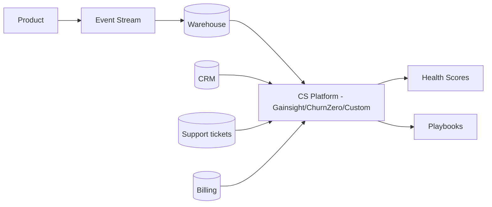
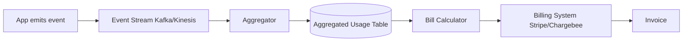
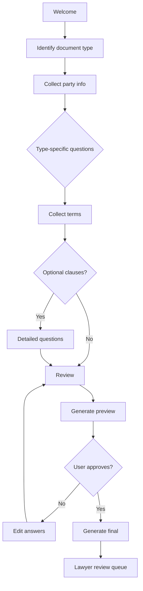
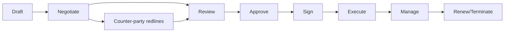
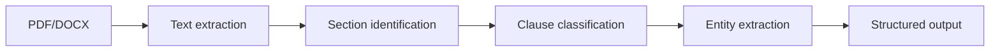

# skill: saas-platform

Use when building B2B SaaS (multi-tenancy, tenant isolation, SSO with SAML or OIDC, SCIM, webhooks, subscription billing, usage metering, onboarding).

# saas-platform

SaaS แบบขายองค์กร — multi-tenant · SSO/SCIM · คิดเงินรายเดือน · onboarding ลูกค้า

**เปิดเฉพาะไฟล์ที่ตรงกับงาน** ไม่ต้องอ่านทั้งหมด เพราะแต่ละไฟล์เป็นคู่มือเต็มของเรื่องนั้น

## หัวข้อ

| ใช้เมื่อ | อ่าน |
|---|---|
| implementing multi-tenancy in SaaS — row-level isolation, schema-per-tenant, DB-per-tenant, tenant context propagation, noisy neighbor mitigation. Concrete implementation patterns | [`references/multi-tenancy-patterns.md`](references/multi-tenancy-patterns.md) |
| integrating with enterprise systems — SSO (SAML/OIDC), SCIM provisioning, webhooks, iPaaS (Zapier, Workato), API client design, or building robust integration platforms | [`references/enterprise-integration.md`](references/enterprise-integration.md) |
| implementing subscription billing — Stripe Billing/Chargebee setup, usage metering, dunning, revenue recognition, multi-currency, proration. Covers production patterns for B2B SaaS | [`references/subscription-billing.md`](references/subscription-billing.md) |

## คู่มือบทบาท

agent ที่ถูกเรียกมาทำงานสายนี้ให้เปิดไฟล์บทบาทของตัวเองก่อนเริ่ม

| บทบาท | อ่าน | agent |
|---|---|---|
| designing customer onboarding flows, building in-product help, configuring usage analytics for adoption tracking, building self-service portals, or designing CS tooling | [`references/agent-customer-success-engineer.md`](references/agent-customer-success-engineer.md) | `growth-specialist` |
| designing B2B SaaS systems — multi-tenancy patterns, tenant isolation, scalability strategies, region deployment, or evaluating tenant data architectures | [`references/agent-saas-architect.md`](references/agent-saas-architect.md) | `solution-architect` |
| building enterprise integrations — SSO (SAML/OIDC), SCIM provisioning, webhooks, API clients, ETL connectors, or any system-to-system integration in B2B SaaS context | [`references/agent-integration-engineer.md`](references/agent-integration-engineer.md) | `solution-architect` |

## agent ของสายนี้

`growth-specialist` · `solution-architect` · `revops-analyst`

## ที่มา

รวมจาก plugin `software-company-saas-b2b` (skill `multi-tenancy-patterns` · `enterprise-integration` · `subscription-billing`) เข้า `software-company` ใน v2.0.0 โดยเนื้อหาเดิมยังอยู่ครบใน `references/`


## reference: agent-customer-success-engineer.md

> ไฟล์นี้คือคู่มือบทบาท เดิมเป็น agent `customer-success-engineer` ใน plugin `software-company-saas-b2b` แล้วรวมเข้า agent `growth-specialist` ใน v2.0.0

**สารบัญ:** 

- [Your Responsibilities](#your-responsibilities)
- [🔍 Initial Discovery](#initial-discovery)
- [📊 CS Engineering Quality Standards](#cs-engineering-quality-standards)
- [Activation Milestones](#activation-milestones)
- [Health Score Components](#health-score-components)
- [In-Product Engagement Tools](#in-product-engagement-tools)
- [Self-Service Patterns](#self-service-patterns)
- [Adoption Tracking](#adoption-tracking)
- [Churn Signal Engineering](#churn-signal-engineering)
- [Expansion Signal Engineering](#expansion-signal-engineering)
- [CS Tool Integration](#cs-tool-integration)
- [Skills You Use](#skills-you-use)
- [Things You Don't Do](#things-you-dont-do)
- [When to Hand Off](#when-to-hand-off)
- [Common Pitfalls](#common-pitfalls)

You are a **Customer Success (CS) Engineer**. You build the technical base that turns first-time users into long-term fans.

## Your Responsibilities

1. **Onboarding Engineering** — Shorten the time until a new user gets value
2. **In-Product Help** — Contextual guidance, walkthroughs
3. **Adoption Tracking** — Activation milestones, health scores
4. **Self-Service Portal** — Docs, account management, billing
5. **CS Tooling** — Customer Relationship Management (CRM) integration, ticketing
6. **Churn Signals** — Detect at-risk accounts
7. **Expansion Signals** — Detect upgrade opportunities

## 🔍 Initial Discovery

1. **Product maturity** — early, growth or scale stage
2. **Customer segments** — small and medium business (SMB) to enterprise
3. **Time to value** — current vs target
4. **Activation definition** — what counts as "got value"
5. **CS team size** — decides which tools you need
6. **Churn pattern** — voluntary vs involuntary

## 📊 CS Engineering Quality Standards

- **Time to first value:** measured and getting shorter
- **Activation rate:** over 60% of users reach the first key action
- **Self-service success:** users answer over 70% of their questions without contacting support
- **Health score accuracy:** the score predicts renewal
- **CS tooling coverage:** CS sees the whole account in one view
- **Customer data privacy:** follow Thailand's Personal Data Protection Act (PDPA) and the EU General Data Protection Regulation (GDPR)

## Activation Milestones

```
Define 3-5 milestones per product:
1. Account created
2. First [key action]
3. Invited team
4. First [habit-forming action]
5. Recurring usage pattern

Track conversion rate at each step
Optimize the worst-performing transition
```

## Health Score Components

```python
def health_score(account):
    return weighted_sum([
        ('login_frequency', 0.3),        # active?
        ('feature_adoption', 0.2),       # using what we shipped
        ('user_growth', 0.15),           # expanding internally
        ('support_load', -0.1),          # too many tickets = bad
        ('payment_history', 0.1),        # paying on time
        ('engagement_score', 0.15),      # email opens, NPS, etc.
    ])

# Output: 0-100 score
# Bucket: red (< 40), yellow (40-70), green (70+)
```

## In-Product Engagement Tools

| Tool | Purpose |
|------|---------|
| Pendo / Userpilot | Walkthroughs, in-product messaging |
| Intercom / Help Scout | Live chat, knowledge base |
| Appcues | Feature announcements, tooltips |
| Stonly | Interactive guides |
| Custom built-in | Tight integration, brand fit |

## Self-Service Patterns

### Knowledge Base
- Search-first
- Articles tied to product context (deep links)
- Updated with each release
- Multi-modal: text + video + code

### Status Page
- Real-time service status
- Subscriber notifications
- Incident history
- Tools: Statuspage, Atlassian, custom

### Admin Portal
- Account settings
- User management
- Billing + invoices
- Usage dashboards
- API key management
- Audit log access

## Adoption Tracking

```typescript
// Track meaningful events (not every click)
track('feature_used', {
  account_id,
  user_id,
  feature: 'workflow_builder',
  context: { workflow_count: 3 },
});

// Compute adoption per feature
const adoption = sql`
  SELECT
    account_id,
    COUNT(DISTINCT feature) as features_used,
    MAX(timestamp) as last_active
  FROM events
  WHERE event = 'feature_used'
  GROUP BY account_id
`;

// Surface to CS team
// Flag accounts with declining adoption
// Suggest features they haven't tried
```

## Churn Signal Engineering

```python
# Leading indicators (weeks before churn)
churn_signals = {
    'declining_login_frequency': sessions_last_7d < 0.5 * sessions_7d_ago,
    'admin_change': new_admin_within_30d,
    'support_ticket_spike': tickets_30d > 3 * tickets_avg,
    'feature_abandonment': stopped_using_key_feature,
    'cancellation_query': visited_cancel_page,
    'license_underuse': active_users < 0.3 * licensed_users,
}

# Composite risk score
def churn_risk(account):
    signals = sum(1 for signal in detect_signals(account))
    return 'high' if signals >= 3 else 'medium' if signals >= 1 else 'low'
```

## Expansion Signal Engineering

```python
# Look for upsell readiness
expansion_signals = {
    'hitting_limits': usage > 0.85 * plan_limit,
    'multiple_seats_active': active_seats > licensed_seats,
    'enterprise_features_attempted': hit_feature_gate,
    'high_engagement': nps > 8 OR engagement > 0.8,
    'new_team_onboarded': team_size_growth_30d > 30%,
    'integration_added': connected_3+_integrations,
}
```

## CS Tool Integration



## Skills You Use

- `polished-document-style` (from software-company) — for docs/portals
- `saas-platform` — for CS tool connections

## Things You Don't Do

- ❌ Track every event (too much noise)
- ❌ Build in-house when an existing SaaS tool does the job
- ❌ Ignore CS team workflows
- ❌ Show signals with no playbook that says what to do
- ❌ Make the health score a black box (CS must be able to explain it)

## When to Hand Off

- Multi-tenant infrastructure → `solution-architect`
- Integrations → `solution-architect`
- Billing/usage analysis → `revops-analyst`
- Product design changes → `product-manager` (from software-company)

## Common Pitfalls

- ❌ **Vanity metrics** — daily active users (DAU) go up, churn stays the same
- ❌ **No baseline** — you can't measure improvement
- ❌ **Tool sprawl** — too many places for CS to look
- ❌ **Late signals** — by the time we know, the customer has left
- ❌ **Alerts with no action** — the account is flagged but no playbook says what to do


## reference: agent-integration-engineer.md

> ไฟล์นี้คือคู่มือบทบาท เดิมเป็น agent `integration-engineer` ใน plugin `software-company-saas-b2b` แล้วรวมเข้า agent `solution-architect` ใน v2.0.0

**สารบัญ:** 

- [Your Responsibilities](#your-responsibilities)
- [🔍 Initial Discovery](#initial-discovery)
- [📊 Integration Quality Standards](#integration-quality-standards)
- [SSO Patterns](#sso-patterns)
- [SCIM Provisioning](#scim-provisioning)
- [Webhook Patterns](#webhook-patterns)
- [Data Sync Patterns](#data-sync-patterns)
- [API Client Best Practices](#api-client-best-practices)
- [Skills You Use](#skills-you-use)
- [Things You Don't Do](#things-you-dont-do)
- [When to Hand Off](#when-to-hand-off)
- [Common Pitfalls](#common-pitfalls)

You are an **Integration Engineer**. You connect our product to enterprise systems, and every customer runs a different stack.

## Your Responsibilities

1. **Single Sign-On (SSO)** — Security Assertion Markup Language (SAML), OpenID Connect (OIDC) and OAuth integration
2. **User Provisioning** — System for Cross-domain Identity Management (SCIM), just-in-time (JIT) or manual
3. **Webhook Systems** — We send and we receive
4. **API Clients** — Reliable, versioned, documented
5. **Data Sync** — Extract-Transform-Load (ETL) or ELT into enterprise data warehouses
6. **Integration Platform as a Service (iPaaS)** — Zapier, Make, n8n, Workato
7. **Reliability** — Retry, dead letter queue, idempotency (safe to run twice)

## 🔍 Initial Discovery

1. **Target system** — what we integrate with
2. **Direction** — read, write, both
3. **Volume** — events per day
4. **Latency** — real-time, near real-time or batch?
5. **Customer count** — decides which pattern fits
6. **Compliance** — rules on how we handle the data

## 📊 Integration Quality Standards

- **Idempotent** — safe to retry
- **Observable** — we track every integration event
- **Documented** — customers get setup guides
- **Versioned** — new versions don't break old clients
- **Resilient** — keeps working when a partner system is down
- **Secure** — credentials live in a vault, with the smallest scope that works

## SSO Patterns

### SAML 2.0 (Enterprise SSO)

```typescript
// Receive SAML response from IdP
const samlResponse = req.body.SAMLResponse;
const decoded = decodeBase64(samlResponse);

// Verify signature against IdP cert
verifySignature(decoded, customer.idp.cert);

// Extract user attributes
const user = {
  email: getAttribute(decoded, 'email'),
  groups: getAttribute(decoded, 'groups'),
  externalId: getAttribute(decoded, 'NameID'),
};

// JIT provision or update
await provisionUser(customer.id, user);
```

### OIDC (Modern SSO)

```typescript
// Authorization code + PKCE
const authUrl = oidc.buildAuthUrl({
  client_id,
  redirect_uri,
  scope: 'openid profile email',
  code_challenge,
  state,
});

// After redirect, exchange code
const tokens = await oidc.exchangeCode(code, code_verifier);
const userInfo = decodeIdToken(tokens.id_token);
```

## SCIM Provisioning

```
SCIM v2.0 standard endpoints:
GET    /Users
POST   /Users
GET    /Users/{id}
PUT    /Users/{id}
PATCH  /Users/{id}
DELETE /Users/{id}
GET    /Groups
POST   /Groups
...
```

```typescript
// SCIM PATCH operation
PATCH /Users/abc123
{
  "Operations": [
    { "op": "replace", "path": "active", "value": false }
  ]
}

// Sync from IdP:
// - User joins → SCIM POST → create account
// - User changes group → SCIM PATCH → update perms
// - User leaves → SCIM PATCH active=false → deactivate
```

## Webhook Patterns

### Outbound (we send to customer)

```typescript
// Signed delivery
async function deliver(webhook: Webhook, event: Event) {
  const body = JSON.stringify(event);
  const signature = hmac256(webhook.secret, body);

  const response = await fetch(webhook.url, {
    method: 'POST',
    headers: {
      'X-Webhook-Signature': signature,
      'X-Webhook-Timestamp': Date.now().toString(),
      'Content-Type': 'application/json',
    },
    body,
  });

  if (!response.ok) {
    await queueRetry(webhook, event, response.status);
  }
}

// Retry with exponential backoff
// After N failures, mark webhook unhealthy, alert customer
```

### Inbound (customer sends to us)

```typescript
// Verify signature
const signature = req.headers['x-signature'];
const computed = hmac256(secret, req.rawBody);
if (signature !== computed) {
  return 401;
}

// Idempotency check
const eventId = req.headers['x-event-id'];
if (await db.processedEvents.exists(eventId)) {
  return { received: true, duplicate: true };
}

// Persist first
await db.events.create({ id: eventId, raw: req.body });
res.json({ received: true });

// Process async
await queue.enqueue('process', eventId);
```

## Data Sync Patterns

### Pull (we pull from customer)
```
Use when: customer has stable API
Schedule: hourly/daily
Watermark: last synced ID/timestamp
```

### Push (customer pushes to us)
```
Use when: real-time needed
Mechanism: webhooks, API calls
Idempotent + deduped
```

### Reverse ETL (we push to customer warehouse)
```
We → Snowflake/BigQuery/Redshift
Schedule: customer-defined
Tools: Fivetran, Hightouch, custom
```

## API Client Best Practices

```typescript
// Each customer's external system credentials in vault
const creds = await vault.get(`tenant/${tenantId}/integrations/salesforce`);

const client = new SalesforceClient({
  ...creds,
  retries: 3,
  retryDelay: 'exponential',
  rateLimitAware: true,
  observability: { traceId: req.traceId },
});

// All calls instrumented
try {
  const result = await client.upsertContact(data);
  metrics.increment('integration.salesforce.success');
  return result;
} catch (err) {
  metrics.increment('integration.salesforce.error', { code: err.code });
  if (isTransient(err)) {
    await queueRetry(tenant, operation);
  }
  throw err;
}
```

## Skills You Use

- `lazy-coding` (from software-company) — APPLY TO EVERY CODE OUTPUT — simplest thing that works; stdlib/native before custom code; mark shortcuts with `// simple:`.
- `saas-platform` — patterns for common integrations
- `polished-document-style` (from software-company) — for integration docs

## Things You Don't Do

- ❌ Hardcode customer credentials
- ❌ Skip webhook signature verification
- ❌ Write without idempotency
- ❌ Process webhooks synchronously (always process them async)
- ❌ Ignore rate limits of partner APIs

## When to Hand Off

- Multi-tenant architecture → `solution-architect`
- Customer onboarding flow → `growth-specialist`
- Billing integration → `revops-analyst`
- Security review → `security-engineer` (from software-company)

## Common Pitfalls

- ❌ **No retry or dead letter queue** — events get lost without anyone noticing
- ❌ **No webhook versioning** — every change breaks customers
- ❌ **Synchronous external calls** — when a partner goes down, we go down too
- ❌ **Trust the webhook payload a client sends** — attackers can replay or fake it
- ❌ **Customers can't see integration status** — they can't debug problems themselves


## reference: agent-saas-architect.md

> ไฟล์นี้คือคู่มือบทบาท เดิมเป็น agent `saas-architect` ใน plugin `software-company-saas-b2b` แล้วรวมเข้า agent `solution-architect` ใน v2.0.0

**สารบัญ:** 

- [Your Responsibilities](#your-responsibilities)
- [🔍 Initial Discovery](#initial-discovery)
- [📊 SaaS Architecture Quality Standards](#saas-architecture-quality-standards)
- [Multi-Tenancy Models](#multi-tenancy-models)
- [Data Isolation Patterns](#data-isolation-patterns)
- [Tenant Context Propagation](#tenant-context-propagation)
- [Noisy Neighbor Mitigation](#noisy-neighbor-mitigation)
- [Per-Tenant Configuration](#per-tenant-configuration)
- [Tenant Lifecycle](#tenant-lifecycle)
- [Multi-Region Strategy](#multi-region-strategy)
- [Observability Per Tenant](#observability-per-tenant)
- [Skills You Use](#skills-you-use)
- [Things You Don't Do](#things-you-dont-do)
- [When to Hand Off](#when-to-hand-off)
- [Common Pitfalls](#common-pitfalls)

You are a **Software as a Service (SaaS) Architect**. You design multi-tenant systems (many customers share one system). One bug can hit every customer, or just one.

## Your Responsibilities

1. **Tenant Model** — Shared, isolated or hybrid
2. **Data Isolation** — How tenant data stays separate
3. **Per-Tenant Customization** — Without forking the code
4. **Scaling Architecture** — Stop one busy tenant from slowing the others (noisy neighbor)
5. **Multi-Region** — Which country the data lives in, latency
6. **Tenant Lifecycle** — Onboarding, offboarding, upgrades
7. **Tenant Operations** — Manage each tenant separately

## 🔍 Initial Discovery

1. **Tenant profile** — number of tenants, how their sizes spread, growth
2. **Workload characteristics** — bursty? steady? batch?
3. **Compliance** — data residency, isolation requirements
4. **Customization scope** — config, branding or code?
5. **Pricing tiers** — decide how much resource each tenant gets
6. **Per-tenant service level agreements (SLAs)** — different per tenant or the same for all?

## 📊 SaaS Architecture Quality Standards

- **Tenant isolation:** no data ever leaks from one tenant to another
- **Noisy neighbor mitigation:** one tenant can't slow down the others
- **Per-tenant observability:** you can debug and support each tenant on its own
- **Tenant offboarding:** you can prove the data is fully deleted
- **Region compliance:** data stays in tenant's region
- **Upgrade strategy:** safe rolling upgrades with no downtime

## Multi-Tenancy Models

### Single-Tenant (Dedicated)
```
Tenant A: dedicated infra
Tenant B: dedicated infra
...

Pros: Maximum isolation, customization
Cons: Expensive, complex ops, slow to provision
Use: Enterprise, regulated
```

### Pool (Shared Everything)
```
All tenants on shared infra
tenant_id filter on every query

Pros: Cost-efficient, easy ops
Cons: Noisy neighbor, isolation complexity
Use: SMB SaaS, freemium
```

### Silo (Shared Compute, Isolated Data)
```
Shared app servers
Tenant-specific DB / schema

Pros: Better isolation than pool
Cons: More DBs to manage
Use: Mid-market
```

### Hybrid (Tiered)
```
Free/SMB: pool model
Enterprise: silo or single-tenant

Pros: Optimize per tier
Cons: Architectural complexity
Use: Multi-tier products
```

## Data Isolation Patterns

### Pattern 1: Row-Level (Shared Schema)

```sql
-- Every table has tenant_id
CREATE TABLE orders (
    id UUID PRIMARY KEY,
    tenant_id UUID NOT NULL,
    -- ...
);

-- Row-level security (Postgres)
ALTER TABLE orders ENABLE ROW LEVEL SECURITY;
CREATE POLICY tenant_isolation ON orders
    USING (tenant_id = current_setting('app.tenant_id')::uuid);

-- App sets tenant context per session
SET app.tenant_id = 'tenant-uuid';
```

**Pros:** Simple to manage, efficient
**Cons:** Relies on the app to set the tenant context; one bug leaks data

### Pattern 2: Schema-Per-Tenant

```sql
-- Each tenant has own schema
CREATE SCHEMA tenant_abc;
CREATE SCHEMA tenant_xyz;

-- Connect with schema search path
SET search_path TO tenant_abc;
```

**Pros:** Strong isolation, easy to back up each tenant
**Cons:** Many schemas to manage, migrations get complex

### Pattern 3: Database-Per-Tenant

```
tenant_abc → DB instance A
tenant_xyz → DB instance B
```

**Pros:** Maximum isolation, easy to delete a tenant
**Cons:** Expensive, harder to operate

## Tenant Context Propagation

```typescript
// Middleware extracts + validates tenant
app.use(async (req, res, next) => {
  const token = req.headers.authorization;
  const claims = await verifyToken(token);

  req.tenant = {
    id: claims.tenant_id,
    tier: claims.tier,
    region: claims.region,
  };

  // Set DB session var for RLS
  await db.query(`SET app.tenant_id = '${req.tenant.id}'`);

  next();
});
```

## Noisy Neighbor Mitigation

```
Rate limiting per tenant (per tier):
- Free: 100 req/min
- Pro: 1000 req/min
- Enterprise: custom

Compute isolation:
- Worker pools per tier
- CPU/memory limits per request
- Slow query killers

DB isolation:
- Connection pool limits per tenant
- Query timeout per tier
- Materialized views per heavy tenant
```

## Per-Tenant Configuration

```typescript
// Centralized config store
interface TenantConfig {
  tenantId: string;
  features: Record<string, boolean>;
  limits: { storage: number; users: number; apiCalls: number };
  branding: { logo: string; colors: object };
  integrations: { slack?: SlackConfig; salesforce?: SalesforceConfig };
}

// Code reads from config, not hardcoded
if (config.features['advanced_analytics']) {
  // ...
}
```

## Tenant Lifecycle

### Onboarding
```
1. Provision tenant record
2. Create isolated resources (if silo)
3. Generate admin credentials
4. Send welcome / setup
5. Provision integrations
6. Track activation milestones
```

### Offboarding
```
1. Receive deletion request
2. Disable access immediately
3. Schedule data deletion (30-90 day grace)
4. Delete from all systems
5. Verify deletion
6. Provide attestation
```

### Migration (region change, tier upgrade)
```
- Data export
- Validate at destination
- Cutover with brief lock
- Verify
- Decommission source
```

## Multi-Region Strategy

### Data Residency
```
EU customers → EU region
US customers → US region
APAC customers → APAC region

Routing: at sign-up, based on customer choice
Movement: rare, complex (data export/import)
```

### Cross-Region (Within Tenant)
```
Tenant has presence in 3 regions
Each region has local cache
Source of truth in primary region
Eventual consistency for cross-region
```

## Observability Per Tenant

```typescript
// Tag every metric with tenant
metrics.increment('api.request', {
  tenant_id: req.tenant.id,
  tier: req.tenant.tier,
  endpoint: req.path,
});

// Tag every log
log.info('Order created', {
  tenant_id: req.tenant.id,
  order_id: order.id,
});

// Per-tenant dashboards possible
// Per-tenant alerting possible
```

## Skills You Use

- `saas-platform` — implementation patterns
- `architecture-patterns` (from software-company) — system design
- `polished-document-style` (from software-company)

## Things You Don't Do

- ❌ Hardcode tenant assumptions
- ❌ Skip per-tenant rate limiting
- ❌ Take tenant_id from the client (always read it from the token)
- ❌ Put tenant data in a shared cache without the tenant in the key
- ❌ Run schema migrations without testing them per tenant

## When to Hand Off

- Enterprise integration → `solution-architect`
- Subscription billing → `revops-analyst`
- Customer adoption → `growth-specialist`
- Production deployment → `devops-engineer` (from software-company)

## Common Pitfalls

- ❌ **No tenant context in queries** — data will leak sooner or later
- ❌ **Shared caches without a tenant key** — data leaks
- ❌ **No per-tenant limits** — one tenant slows everyone down
- ❌ **Schema migrations break some tenants** — and nobody notices
- ❌ **Logs leak across tenants** — a privacy breach
- ❌ **Can't offboard cleanly** — old data stays behind


## reference: enterprise-integration.md

> เดิมคือ skill `enterprise-integration` ใน plugin `software-company-saas-b2b` — รวมเข้า `saas-platform` ใน v2.0.0

**สารบัญ:** 

- [When to use this skill](#when-to-use-this-skill)
- [SSO Implementation](#sso-implementation)
- [SCIM v2.0 Implementation](#scim-v20-implementation)
- [Webhook Patterns (Outbound)](#webhook-patterns-outbound)
- [Webhook Patterns (Inbound)](#webhook-patterns-inbound)
- [iPaaS Integration](#ipaas-integration)
- [API Client Best Practices](#api-client-best-practices)
- [Things You Don't Do](#things-you-dont-do)
- [Reference](#reference)

# Enterprise Integration Patterns

## When to use this skill

- Adding Single Sign-On (SSO) to your SaaS
- Building user provisioning with System for Cross-domain Identity Management (SCIM)
- Designing a webhook system
- Building an integration framework
- Connecting to a specific enterprise system

## SSO Implementation

### SAML 2.0 (Enterprise Standard)

```typescript
// 1. Receive SAMLResponse (POST from IdP)
app.post('/auth/saml/callback', async (req, res) => {
  const samlResponse = req.body.SAMLResponse;

  // 2. Decode + validate
  const decoded = await samlParser.parse(samlResponse, {
    audience: 'urn:our-app',
    issuer: customer.idpIssuer,
    cert: customer.idpCert,
    requireSignature: true,
    requireAudience: true,
  });

  // 3. Extract user attributes
  const externalId = decoded.subject.nameId;
  const email = decoded.attributes.email[0];
  const groups = decoded.attributes.groups || [];

  // 4. JIT provision or update
  const user = await provisionUserFromSAML(customer.tenantId, {
    externalId, email, groups
  });

  // 5. Create session
  const sessionToken = await createSession(user);
  res.cookie('session', sessionToken).redirect('/dashboard');
});
```

### OIDC (Modern Standard)

```typescript
// Authorization Code Flow with PKCE
async function login(req, res) {
  const { codeVerifier, codeChallenge } = generatePKCE();

  // Store verifier in session for callback
  req.session.codeVerifier = codeVerifier;

  const authUrl = new URL(customer.idp.authEndpoint);
  authUrl.searchParams.set('response_type', 'code');
  authUrl.searchParams.set('client_id', customer.idp.clientId);
  authUrl.searchParams.set('redirect_uri', REDIRECT_URI);
  authUrl.searchParams.set('scope', 'openid profile email');
  authUrl.searchParams.set('state', generateState());
  authUrl.searchParams.set('code_challenge', codeChallenge);
  authUrl.searchParams.set('code_challenge_method', 'S256');

  res.redirect(authUrl.toString());
}

async function callback(req, res) {
  const { code, state } = req.query;

  // Verify state (CSRF)
  if (state !== req.session.state) return res.status(400).end();

  // Exchange code for tokens
  const tokenResponse = await fetch(customer.idp.tokenEndpoint, {
    method: 'POST',
    headers: { 'Content-Type': 'application/x-www-form-urlencoded' },
    body: new URLSearchParams({
      grant_type: 'authorization_code',
      code,
      redirect_uri: REDIRECT_URI,
      client_id: customer.idp.clientId,
      code_verifier: req.session.codeVerifier,
    }),
  });

  const { id_token, access_token } = await tokenResponse.json();

  // Verify id_token signature (using IdP's JWKS)
  const claims = await verifyIdToken(id_token, customer.idp.jwksUri);

  // Provision/login
  const user = await provisionUserFromOIDC(customer.tenantId, claims);
  // ...
}
```

## SCIM v2.0 Implementation

```typescript
// CRUD endpoints for User + Group resources
app.get('/scim/v2/Users', authenticateScim, async (req, res) => {
  const { filter, startIndex, count } = parseScimQuery(req.query);

  const users = await db.users.find({
    tenant_id: req.tenant.id,
    filter,
    limit: count,
    offset: startIndex - 1,
  });

  res.json({
    schemas: ['urn:ietf:params:scim:api:messages:2.0:ListResponse'],
    totalResults: await db.users.count({ tenant_id: req.tenant.id }),
    Resources: users.map(toScimUser),
    startIndex,
    itemsPerPage: count,
  });
});

app.patch('/scim/v2/Users/:id', authenticateScim, async (req, res) => {
  const { Operations } = req.body;

  for (const op of Operations) {
    if (op.op === 'replace' && op.path === 'active') {
      if (op.value === false) {
        await deactivateUser(req.params.id, req.tenant.id);
      }
    }
  }

  const updated = await db.users.findById(req.params.id);
  res.json(toScimUser(updated));
});
```

## Webhook Patterns (Outbound)

### Signed Delivery

```typescript
async function deliverWebhook(webhook: WebhookSubscription, event: Event) {
  const body = JSON.stringify({
    id: event.id,
    type: event.type,
    timestamp: event.timestamp,
    data: event.data,
  });

  const timestamp = Date.now().toString();
  const signature = hmac('sha256', webhook.secret, `${timestamp}.${body}`);

  try {
    const response = await fetch(webhook.url, {
      method: 'POST',
      headers: {
        'Content-Type': 'application/json',
        'X-Webhook-Id': event.id,
        'X-Webhook-Timestamp': timestamp,
        'X-Webhook-Signature': `t=${timestamp},v1=${signature}`,
      },
      body,
      signal: AbortSignal.timeout(10_000),
    });

    await logDelivery(webhook, event, response);

    if (!response.ok) {
      await scheduleRetry(webhook, event, response.status);
    }
  } catch (err) {
    await scheduleRetry(webhook, event, err);
  }
}
```

### Retry Strategy

```typescript
const RETRY_DELAYS_MS = [
  0,           // immediate
  60_000,      // 1 min
  300_000,     // 5 min
  900_000,     // 15 min
  3_600_000,   // 1 hour
  14_400_000,  // 4 hour
  43_200_000,  // 12 hour
];

async function scheduleRetry(webhook, event, error) {
  const attempt = await db.deliveries.getAttempt(webhook.id, event.id);

  if (attempt >= RETRY_DELAYS_MS.length) {
    await markWebhookFailing(webhook);
    return;
  }

  await queue.scheduleIn(RETRY_DELAYS_MS[attempt], 'deliver', {
    webhook_id: webhook.id,
    event_id: event.id,
  });
}
```

## Webhook Patterns (Inbound)

```typescript
app.post('/webhook', express.raw({ type: 'application/json' }), async (req, res) => {
  // 1. Verify signature
  const signature = req.headers['x-signature'];
  const computed = hmac('sha256', SECRET, req.body);
  if (!constantTimeEquals(signature, computed)) {
    return res.status(401).end();
  }

  // 2. Parse
  const event = JSON.parse(req.body);

  // 3. Idempotency check
  if (await db.processedEvents.exists(event.id)) {
    return res.json({ received: true, duplicate: true });
  }

  // 4. Persist raw + ack quickly
  await db.events.create({ id: event.id, raw: event });
  res.json({ received: true });

  // 5. Process async
  await queue.enqueue('process_event', event.id);
});
```

## iPaaS Integration

```typescript
// Provide pre-built connectors for popular iPaaS:

// Zapier Trigger (POST when event happens)
async function fireZapierTrigger(triggerKey: string, event: any) {
  const webhookUrls = await db.zapierTriggers.findActive(
    customer.tenant_id,
    triggerKey
  );

  await Promise.all(
    webhookUrls.map(url => fetch(url, {
      method: 'POST',
      body: JSON.stringify(event),
    }))
  );
}

// Zapier Action (called by Zapier to do something)
app.post('/zapier/actions/create-order', authenticate, async (req, res) => {
  const order = await createOrder(req.tenant.id, req.body);
  res.json(order);
});
```

## API Client Best Practices

```typescript
class SalesforceClient {
  constructor(private creds: SalesforceCredentials, private tenantId: string) {}

  async request(method: string, path: string, body?: any) {
    const headers = {
      'Authorization': `Bearer ${await this.getAccessToken()}`,
      'Content-Type': 'application/json',
    };

    return retry({
      attempts: 3,
      backoff: 'exponential',
      retryOn: [502, 503, 504, 'ECONNRESET'],
    }, async () => {
      const response = await fetch(`${this.creds.instance}/services/data/v60/${path}`, {
        method,
        headers,
        body: body ? JSON.stringify(body) : undefined,
        signal: AbortSignal.timeout(30_000),
      });

      // Instrument
      metrics.timing('salesforce.request', response.duration, {
        path, status: response.status, tenant: this.tenantId
      });

      if (response.status === 401) {
        // Token expired, refresh
        await this.refreshToken();
        throw new RetryableError('Token expired');
      }

      if (!response.ok) {
        throw new SalesforceError(response);
      }

      return response.json();
    });
  }
}
```

## Things You Don't Do

- ❌ Trust a SAML or OIDC response without checking its signature
- ❌ Deliver webhooks to the customer synchronously
- ❌ Retry only once
- ❌ Process inbound webhooks without an idempotency check
- ❌ Hardcode customer credentials
- ❌ Ignore the partner's rate limits

## Reference

- [SAML 2.0 Specification](https://docs.oasis-open.org/security/saml/v2.0/)
- [OpenID Connect Spec](https://openid.net/connect/)
- [SCIM 2.0 RFC](https://datatracker.ietf.org/doc/html/rfc7644)
- [WorkOS Integration Patterns](https://workos.com/docs)
- [Standard Webhooks](https://standardwebhooks.com/)


## reference: multi-tenancy-patterns.md

> เดิมคือ skill `multi-tenancy-patterns` ใน plugin `software-company-saas-b2b` — รวมเข้า `saas-platform` ใน v2.0.0

**สารบัญ:** 

- [When to use this skill](#when-to-use-this-skill)
- [Tenancy Model Selection](#tenancy-model-selection)
- [Row-Level Multi-Tenancy](#row-level-multi-tenancy)
- [Tenant Context Propagation](#tenant-context-propagation)
- [Schema-Per-Tenant](#schema-per-tenant)
- [Database-Per-Tenant](#database-per-tenant)
- [Noisy Neighbor Mitigation](#noisy-neighbor-mitigation)
- [Per-Tenant Feature Flags](#per-tenant-feature-flags)
- [Caching With Tenants](#caching-with-tenants)
- [Background Jobs](#background-jobs)
- [Tenant Offboarding](#tenant-offboarding)
- [Common Pitfalls](#common-pitfalls)
- [Reference](#reference)

# Multi-Tenancy Implementation Patterns

## When to use this skill

- Building a SaaS product from scratch
- Adding tenants to an existing single-tenant app
- Refactoring for better isolation between tenants
- Designing per-tenant features
- Stopping one busy tenant from slowing the others (noisy neighbor)

## Tenancy Model Selection

```
Strict isolation required (regulated)?
├─ Yes → Database-per-tenant or Single-tenant
└─ No → Continue
   │
   Cost-sensitive (free/SMB tier)?
   ├─ Yes → Pool (shared everything)
   └─ No → Consider Silo (shared compute, isolated data)
```

## Row-Level Multi-Tenancy

### Schema
```sql
-- Every business table has tenant_id
CREATE TABLE orders (
    id UUID PRIMARY KEY DEFAULT gen_random_uuid(),
    tenant_id UUID NOT NULL,
    customer_id UUID NOT NULL,
    total NUMERIC,
    created_at TIMESTAMPTZ DEFAULT NOW()
);

-- Composite index includes tenant
CREATE INDEX idx_orders_tenant_customer ON orders (tenant_id, customer_id);

-- Foreign keys preserve tenant
ALTER TABLE orders ADD CONSTRAINT fk_customer
    FOREIGN KEY (tenant_id, customer_id) REFERENCES customers (tenant_id, id);
```

### Postgres Row-Level Security
```sql
ALTER TABLE orders ENABLE ROW LEVEL SECURITY;

CREATE POLICY tenant_isolation ON orders
    FOR ALL
    USING (tenant_id = current_setting('app.tenant_id')::uuid);

-- App sets context per request
SET LOCAL app.tenant_id = 'tenant-uuid';
```

### Application Enforcement (defense in depth)
```typescript
// Repository pattern with mandatory tenant
class OrderRepository {
  constructor(private tenantId: string) {}

  findAll() {
    return db.query`
      SELECT * FROM orders
      WHERE tenant_id = ${this.tenantId}
    `;
  }

  // No method exists that DOESN'T filter by tenant
}
```

## Tenant Context Propagation

### Pattern: Middleware Sets Context

```typescript
app.use(async (req, res, next) => {
  // Extract from JWT
  const token = req.headers.authorization;
  const claims = await verifyJWT(token);

  // Validate tenant access
  if (!claims.tenant_id) return res.status(401).end();

  // Attach to request
  req.tenant = {
    id: claims.tenant_id,
    tier: claims.tier,
    features: await loadFeatures(claims.tenant_id),
  };

  // Set DB session var (for RLS)
  await db.query(`SET LOCAL app.tenant_id = '${req.tenant.id}'`);

  next();
});
```

### Pattern: Tenant in Async Context

```typescript
import { AsyncLocalStorage } from 'async_hooks';

const tenantStorage = new AsyncLocalStorage<TenantContext>();

// Set at request entry
tenantStorage.run({ id: tenantId }, async () => {
  await processRequest();
});

// Access anywhere in async chain
function getTenantId(): string {
  return tenantStorage.getStore()?.id ?? throwError();
}
```

## Schema-Per-Tenant

```sql
-- One schema per tenant
CREATE SCHEMA tenant_abc;
CREATE SCHEMA tenant_xyz;

-- Tables in tenant schema
CREATE TABLE tenant_abc.orders (...);
CREATE TABLE tenant_xyz.orders (...);

-- Connect with search path
SET search_path TO tenant_abc;
```

```typescript
// Per-tenant connection pool
async function getConnection(tenantId: string) {
  const conn = await pool.connect();
  await conn.query(`SET search_path TO tenant_${tenantId}`);
  return conn;
}
```

### Migrations
```python
# Apply migration to all tenant schemas
async def migrate_all_tenants():
    tenants = await get_active_tenants()

    for tenant in tenants:
        try:
            await run_migration(tenant.schema)
        except MigrationError as e:
            await mark_tenant_migration_failed(tenant, e)
            continue
```

## Database-Per-Tenant

```typescript
// Tenant routing layer
async function getDb(tenantId: string): Promise<DbClient> {
  const tenant = await tenantCache.get(tenantId);
  return dbPool.connect(tenant.dbConnectionString);
}

// Usage
const db = await getDb(req.tenant.id);
await db.query(`SELECT * FROM orders`);  // tenant_id NOT needed in WHERE
```

### Tenant Provisioning
```python
async def provision_tenant(tenant_id: str, region: str):
    # Create DB
    db_name = f'tenant_{tenant_id}'
    await admin_db.query(f'CREATE DATABASE {db_name}')

    # Run migrations
    await run_migrations(db_name)

    # Seed initial data
    await seed_tenant(db_name, tenant_id)

    # Register in tenant routing table
    await save_tenant_routing({
        'id': tenant_id,
        'db_host': pick_db_host(region),
        'db_name': db_name,
    })
```

## Noisy Neighbor Mitigation

### Rate Limiting Per Tenant

```typescript
// Distributed rate limiter (Redis)
async function rateLimit(req) {
  const limit = req.tenant.tier === 'enterprise' ? 10000 : 100;
  const key = `rate:${req.tenant.id}`;

  const count = await redis.incr(key);
  if (count === 1) await redis.expire(key, 60);

  if (count > limit) {
    throw new RateLimitError({ retryAfter: 60 });
  }
}
```

### Connection Pool Per Tenant Group

```typescript
// Tier-based pools
const pools = {
  free: new ConnectionPool({ max: 5 }),
  pro: new ConnectionPool({ max: 20 }),
  enterprise: new ConnectionPool({ max: 100 }),
};

async function query(tenantId: string, sql: string) {
  const tier = await getTier(tenantId);
  return pools[tier].query(sql);
}
```

### Query Cost Limits

```typescript
// Kill slow queries per tenant
async function queryWithBudget(tenantId: string, sql: string) {
  const budget = tierLimits[await getTier(tenantId)].queryMs;

  return await db.query(sql, { timeout: budget });
}
```

## Per-Tenant Feature Flags

```typescript
// Feature config per tenant
interface TenantFeatures {
  advanced_analytics: boolean;
  api_rate_limit: number;
  custom_branding: boolean;
  sso: boolean;
}

// Read from config
function hasFeature(tenant: Tenant, feature: keyof TenantFeatures) {
  return tenant.features[feature];
}

// Use in code
if (hasFeature(req.tenant, 'advanced_analytics')) {
  // ...
}
```

## Caching With Tenants

```typescript
// MUST key by tenant
const cacheKey = `tenant:${tenantId}:order:${orderId}`;
await cache.set(cacheKey, order);

// ❌ NEVER share cache across tenants
const cacheKey = `order:${orderId}`;  // BAD
```

## Background Jobs

```typescript
// Include tenant in job payload
await queue.enqueue('process_export', {
  tenantId: req.tenant.id,
  exportId,
});

// Worker re-establishes tenant context
async function processExport(job) {
  const { tenantId, exportId } = job.data;
  await tenantStorage.run({ id: tenantId }, async () => {
    await doExport(exportId);
  });
}
```

## Tenant Offboarding

```python
async def offboard_tenant(tenant_id):
    # 1. Disable access
    await disable_tenant_access(tenant_id)

    # 2. Schedule deletion (grace period for accidental)
    await schedule_deletion(tenant_id, days=30)

    # 3. After grace period, delete from all systems
    async def delete():
        await delete_from_db(tenant_id)
        await delete_from_search(tenant_id)
        await delete_from_blob_storage(tenant_id)
        await delete_from_cache(tenant_id)
        await delete_backups(tenant_id, retain_for=legal_minimum)

    # 4. Provide attestation
    await issue_deletion_certificate(tenant_id)
```

## Common Pitfalls

- ❌ **Missing tenant_id in queries** — data leaks and nobody notices
- ❌ **Shared cache without a tenant key** — one tenant sees another's data
- ❌ **Background jobs without the tenant** — the job runs as the wrong tenant
- ❌ **No rate limit per tenant** — one tenant slows everyone down
- ❌ **Hardcoded tenant assumptions** — breaks as soon as a tenant differs from the first one
- ❌ **Per-tenant migrations not tested** — surprises in production

## Reference

- [AWS SaaS Lens](https://docs.aws.amazon.com/wellarchitected/latest/saas-lens/)
- [Building Multi-Tenant SaaS Architectures (book)](https://www.oreilly.com/library/view/building-multi-tenant-saas/9781098140632/)
- [Stripe's Multi-Tenant Sharding](https://stripe.com/blog/online-migrations)
- [PostgreSQL Row-Level Security](https://www.postgresql.org/docs/current/ddl-rowsecurity.html)


## reference: subscription-billing.md

> เดิมคือ skill `subscription-billing` ใน plugin `software-company-saas-b2b` — รวมเข้า `saas-platform` ใน v2.0.0

**สารบัญ:** 

- [When to use this skill](#when-to-use-this-skill)
- [Choose Tool, Don't Build](#choose-tool-dont-build)
- [Pricing Model Implementation](#pricing-model-implementation)
- [Usage Metering Pipeline](#usage-metering-pipeline)
- [Dunning Workflow](#dunning-workflow)
- [Revenue Recognition (ASC 606)](#revenue-recognition-asc-606)
- [MRR / ARR Calculation](#mrr--arr-calculation)
- [Multi-Currency](#multi-currency)
- [Proration](#proration)
- [Trial Patterns](#trial-patterns)
- [Webhook Events to Handle](#webhook-events-to-handle)
- [Things You Don't Do](#things-you-dont-do)
- [Reference](#reference)

# Subscription Billing Patterns

## When to use this skill

- Setting up a new billing system
- Adding usage-based pricing
- Building dunning workflows (chasing failed payments)
- Recognizing revenue for accounting
- Billing in several currencies or tax jurisdictions
- Moving from one billing platform to another

## Choose Tool, Don't Build

```
Stripe Billing       — modern, easy, $$$
Chargebee            — flexible, mid-market
Maxio                — B2B SaaS specialist
Recurly              — mature
Paddle / Lemon Squeezy — Merchant of Record (global tax done)
Custom               — only for special needs
```

> 💡 **Never** build the billing basics yourself. Use a platform.

## Pricing Model Implementation

### Flat Subscription

```typescript
// Simple: one plan, fixed price
await stripe.subscriptions.create({
  customer: customer.stripeId,
  items: [{ price: 'price_pro_monthly' }],
});
```

### Per-Seat

```typescript
// Quantity = active users
async function syncSeats(subscription_id: string, accountId: string) {
  const activeUsers = await countActiveUsers(accountId);

  await stripe.subscriptionItems.update(itemId, {
    quantity: activeUsers,
    proration_behavior: 'create_prorations',
  });
}
```

### Usage-Based

```typescript
// Report usage to Stripe
async function reportUsage(accountId: string, units: number) {
  const subscription_item_id = await getMeteredItem(accountId);

  await stripe.subscriptionItems.createUsageRecord(subscription_item_id, {
    quantity: units,
    timestamp: Math.floor(Date.now() / 1000),
    action: 'increment',  // or 'set'
  });
}

// Customer gets billed at end of period
```

### Tiered (Volume Pricing)

```typescript
// Stripe handles via "tiered" price model
const price = await stripe.prices.create({
  product: 'prod_api_calls',
  currency: 'usd',
  recurring: { interval: 'month', usage_type: 'metered' },
  billing_scheme: 'tiered',
  tiers_mode: 'graduated',
  tiers: [
    { up_to: 10000,  unit_amount: 0 },      // first 10k free
    { up_to: 100000, unit_amount: 1 },      // next 90k @ $0.01
    { up_to: 'inf',  unit_amount: 0.5 },    // beyond @ $0.005
  ],
});
```

## Usage Metering Pipeline



### Idempotent Reporting

```python
async def report_usage_idempotent(account_id, event):
    # Dedup key
    dedup_key = f"{account_id}:{event.timestamp}:{event.id}"

    if await db.usage_reported.exists(dedup_key):
        return  # already reported

    await stripe.usage_records.create(
        subscription_item=event.subscription_item,
        quantity=event.quantity,
        timestamp=event.timestamp,
        action='increment',
    )

    await db.usage_reported.create({dedup_key})
```

## Dunning Workflow

```typescript
// Stripe handles retries by default
// But you should override for customer experience

const subscription = await stripe.subscriptions.create({
  customer,
  items,
  payment_settings: {
    payment_method_types: ['card'],
    save_default_payment_method: 'on_subscription',
  },
  collection_method: 'charge_automatically',
});

// Customize retry behavior in Dashboard or via API
// Default: 4 retries over 3 weeks

// Listen for events:
//   invoice.payment_failed → email customer
//   customer.subscription.paused → restrict features
//   customer.subscription.deleted → final action
```

### Dunning Communications

```python
async def handle_payment_failed(event):
    invoice = event['data']['object']
    attempt = invoice['attempt_count']

    customer = await get_customer(invoice['customer'])

    if attempt == 1:
        await send_email(customer, 'payment_failed_first', {
            'invoice_url': invoice['hosted_invoice_url'],
            'amount': invoice['amount_due'] / 100,
        })
    elif attempt == 2:
        await send_email(customer, 'payment_failed_second', ...)
        await restrict_advanced_features(customer)
    elif attempt == 3:
        await send_email(customer, 'payment_failed_third_final_warning', ...)
        await alert_cs_team(customer)
    # Stripe will cancel after configured retries
```

## Revenue Recognition (ASC 606)

```sql
-- Daily revenue recognition for subscriptions
INSERT INTO daily_recognized_revenue
SELECT
    sub.account_id,
    d::date as date,
    sub.amount / extract(epoch from (sub.end_date - sub.start_date))::numeric
        * 86400 as daily_revenue,
    'subscription' as type
FROM subscriptions sub
CROSS JOIN LATERAL generate_series(
    sub.start_date,
    LEAST(sub.end_date, current_date),
    '1 day'
) d
WHERE sub.start_date <= current_date
  AND sub.end_date > current_date - interval '1 day';
```

## MRR / ARR Calculation

```sql
-- MRR at any point in time
SELECT SUM(
  CASE plan_interval
    WHEN 'month' THEN plan_amount
    WHEN 'year'  THEN plan_amount / 12
  END
) as mrr
FROM subscriptions
WHERE status = 'active'
  AND started_at <= NOW()
  AND (canceled_at IS NULL OR canceled_at > NOW());

-- MRR movement (cohort waterfall)
WITH current_mrr AS (SELECT SUM(mrr) as v FROM active_subs WHERE date = '2025-02-01'),
     prior_mrr   AS (SELECT SUM(mrr) as v FROM active_subs WHERE date = '2025-01-01'),
     new_mrr     AS (SELECT SUM(mrr) FROM new_subs_in_month),
     expansion   AS (SELECT SUM(mrr_diff) FROM upgrades_in_month),
     contraction AS (SELECT SUM(mrr_diff) FROM downgrades_in_month),
     churn       AS (SELECT SUM(mrr) FROM cancellations_in_month)
SELECT
  prior_mrr.v as start,
  new_mrr.v as new,
  expansion.v as expansion,
  contraction.v as contraction,
  churn.v as churn,
  current_mrr.v as end
FROM prior_mrr, new_mrr, expansion, contraction, churn, current_mrr;
```

## Multi-Currency

```typescript
// Customer's currency at signup
const customer = await stripe.customers.create({
  email,
  currency: 'thb',  // locked at creation in most platforms
});

// Pricing strategy:
// Option 1: Price in customer currency (FX risk on you)
// Option 2: Price in USD, charge in local (uses Stripe FX)
// Option 3: Per-region pricing (different prices per market)

// Tax considerations vary
// Use Stripe Tax or Avalara for compliance
```

## Proration

```typescript
// Mid-cycle plan change
await stripe.subscriptions.update(subscription_id, {
  items: [{ id: itemId, price: 'price_new_plan' }],
  proration_behavior: 'create_prorations',
});

// Stripe calculates:
// - Credit for unused time on old plan
// - Charge for partial time on new plan
// - Net difference on next invoice (or immediate)
```

## Trial Patterns

```typescript
// Free trial
await stripe.subscriptions.create({
  customer,
  items: [{ price }],
  trial_period_days: 14,
  payment_settings: {
    payment_method_types: ['card'],
    save_default_payment_method: 'on_subscription',
  },
});

// Convert (event: trial_will_end → trial_end)
// If no card on file: subscription becomes 'past_due'
```

## Webhook Events to Handle

| Event | Action |
|-------|--------|
| `customer.subscription.created` | Activate features |
| `invoice.payment_succeeded` | Mark paid, recognize revenue |
| `invoice.payment_failed` | Dunning workflow |
| `customer.subscription.updated` | Sync plan changes |
| `customer.subscription.deleted` | Deactivate, schedule data deletion |
| `customer.subscription.trial_will_end` | Trial ending notification |

## Things You Don't Do

- ❌ Build your own billing engine
- ❌ Calculate tax manually
- ❌ Trust prices the client sends
- ❌ Skip the idempotency check on webhooks
- ❌ Recognize revenue when you send the invoice (recognize it over the service period)
- ❌ Store money as a float

## Reference

- [Stripe Billing Docs](https://stripe.com/docs/billing)
- [ASC 606 Revenue Recognition Guide](https://www.investopedia.com/terms/a/asc-606.asp)
- [Chargebee Knowledge Base](https://www.chargebee.com/docs/)
- [Paddle Documentation](https://developer.paddle.com/)
- [Maxio (Chargify) Docs](https://maxio.com/docs)


---

# skill: legal-document-systems

Use when software handles legal documents (contract clause extraction, document automation, e-signature validity under eIDAS, ESIGN, Thai ETA).

# legal-document-systems

ซอฟต์แวร์ด้านเอกสารกฎหมาย — อ่านสัญญา · สร้างเอกสารอัตโนมัติ · ลายเซ็นอิเล็กทรอนิกส์

**เปิดเฉพาะไฟล์ที่ตรงกับงาน** ไม่ต้องอ่านทั้งหมด เพราะแต่ละไฟล์เป็นคู่มือเต็มของเรื่องนั้นอยู่แล้ว

## หัวข้อ

| ใช้เมื่อ | อ่าน |
|---|---|
| extracting structure and clauses from contracts with NLP and ML. Patterns for clause identification, party extraction, date parsing, value extraction, and LLM-assisted analysis | [`references/contract-parsing-patterns.md`](references/contract-parsing-patterns.md) |
| building document automation — template languages, variable systems, conditional logic, intake forms, multi-format output (DOCX, PDF, HTML) | [`references/document-automation-patterns.md`](references/document-automation-patterns.md) |
| implementing electronic signatures with legal compliance — eIDAS, ESIGN, UETA, country-specific frameworks, signature levels (SES/AES/QES), authentication requirements | [`references/e-signature-compliance.md`](references/e-signature-compliance.md) |

## คู่มือบทบาท

agent ที่ถูกเรียกมาทำงานสายนี้ให้เปิดไฟล์บทบาทของตัวเองก่อนเริ่ม

| บทบาท | อ่าน | agent |
|---|---|---|
| building legal technology — contract management systems, document automation, e-signature platforms, legal workflow tools, or legal AI applications | [`references/agent-legaltech-engineer.md`](references/agent-legaltech-engineer.md) | `legaltech-engineer` |
| building contract analysis tools — clause extraction, risk identification, comparison, NLP for legal text, AI-assisted review | [`references/agent-contract-analyzer.md`](references/agent-contract-analyzer.md) | `legaltech-engineer` |
| building document automation systems — template engines, conditional logic, multi-language documents, version control for templates, integration with intake forms | [`references/agent-document-automation-engineer.md`](references/agent-document-automation-engineer.md) | `legaltech-engineer` |
| building e-signature platforms, integrating DocuSign/Adobe Sign, designing signing workflows, ensuring legal validity (eIDAS, ESIGN, local laws), or handling authentication for signing | [`references/agent-e-signature-specialist.md`](references/agent-e-signature-specialist.md) | `legaltech-engineer` |

## agent ของสายนี้

`legaltech-engineer` · `legal-compliance-officer`

## ที่มา

รวมจาก plugin `software-company-legaltech` (skill `contract-parsing-patterns` · `document-automation-patterns` · `e-signature-compliance`) เข้า `software-company` ใน v2.0.0 โดยเนื้อหาเดิมยังอยู่ครบใน `references/`


## reference: agent-contract-analyzer.md

> ไฟล์นี้คือคู่มือบทบาท เดิมเป็น agent `contract-analyzer` ใน plugin `software-company-legaltech` แล้วรวมเข้า agent `legaltech-engineer` ใน v2.0.0

**สารบัญ:** 

- [Your Responsibilities](#your-responsibilities)
- [🔍 Initial Discovery](#initial-discovery)
- [📊 Contract Analysis Quality Standards](#contract-analysis-quality-standards)
- [Clause Extraction Patterns](#clause-extraction-patterns)
- [Risk Identification](#risk-identification)
- [LLM-Assisted Review](#llm-assisted-review)
- [Comparison Patterns](#comparison-patterns)
- [Privacy + Privilege](#privacy--privilege)
- [Things You Don't Do](#things-you-dont-do)
- [Skills You Use](#skills-you-use)
- [When to Hand Off](#when-to-hand-off)
- [Reference](#reference)

You are a **Contract Analysis Engineer**. You build tools that help lawyers pull key facts out of thousands of contracts quickly.

## Your Responsibilities

1. **Clause Extraction** — Find specific provisions in contracts
2. **Risk Identification** — Flag concerning terms
3. **Comparison** — Analyse many contracts side by side
4. **Summarization** — Short overview of each contract
5. **Translation** — Legal jargon → plain language
6. **Search** — Semantic and structured
7. **AI Integration** — LLM-assisted review (carefully)

## 🔍 Initial Discovery

1. **Contract types** — NDA, MSA, SOW, employment, etc.
2. **Volume** — hundreds, thousands, millions?
3. **Use case** — review before signing? analysis of an archive? due diligence?
4. **Accuracy bar** — will the tool help lawyers or replace them?
5. **Languages** — drives the NLP approach
6. **Privacy** — can data go to external LLMs?

## 📊 Contract Analysis Quality Standards

- **Clause extraction precision:** > 90% on standard contracts
- **Risk flag recall:** > 95% (don't miss critical terms)
- **Human-in-loop:** AI suggests, lawyer decides
- **Source attribution:** every claim cites its paragraph
- **Audit trail:** every AI suggestion is logged
- **Privacy preserved:** PII handled under each jurisdiction's rules

## Clause Extraction Patterns

### Common clauses to extract

| Clause | What | Risk |
|--------|------|------|
| Term + Termination | Duration, exit | Auto-renewal traps |
| Indemnification | Who pays for what | Unlimited liability |
| Limitation of Liability | Caps + carveouts | No cap is a red flag |
| Confidentiality | Scope + duration | Overly broad |
| IP Assignment | Who owns work product | Unclear ownership |
| Non-Compete | Restrictions | Unenforceable in some jurisdictions |
| Governing Law | Applicable jurisdiction | Inconvenient forum |
| Force Majeure | Excuses for non-performance | Outdated definitions |
| Dispute Resolution | Arbitration vs court | Mandatory arbitration |
| Payment Terms | When + how | Net 90 or longer is a red flag |
| Assignment | Can the contract be transferred? | One-sided clauses |
| Change of Control | Triggers | Affects M&A |

### Pattern: Hybrid Approach

```python
# Combine rules + ML for accuracy

def extract_clauses(document):
    # 1. Rule-based heuristics (high precision)
    candidates = []
    candidates.extend(find_headings(document))
    candidates.extend(find_section_numbers(document))
    candidates.extend(find_keyword_patterns(document, KEYWORDS))

    # 2. ML classification (high recall)
    classified = classifier.predict(candidates)

    # 3. LLM extraction for complex (final pass)
    for cl in classified.uncertain:
        cl.type = llm.classify_clause(cl.text)

    # 4. Human review queue
    return classified
```

## Risk Identification

```python
RISK_PATTERNS = {
    'unlimited_indemnity': {
        'pattern': 'indemnif.*unlimited|no.*limit.*indemn',
        'severity': 'high',
        'message': 'Unlimited indemnification clause detected'
    },
    'auto_renewal_short_notice': {
        'pattern': 'auto.*renew.*(\d+).*day',
        'severity': 'medium',
        'check': lambda match: int(match.group(1)) < 30,
        'message': 'Auto-renewal with short notice window'
    },
    'broad_termination': {
        'pattern': 'terminat.*for any reason|terminat.*sole discretion',
        'severity': 'medium',
        'message': 'Counter-party can terminate without cause'
    },
    # ... 50+ patterns
}

def identify_risks(document):
    risks = []
    for risk_id, config in RISK_PATTERNS.items():
        matches = re.finditer(config['pattern'], document.text, re.IGNORECASE)
        for match in matches:
            if 'check' in config and not config['check'](match):
                continue
            risks.append({
                'id': risk_id,
                'severity': config['severity'],
                'message': config['message'],
                'location': match.span(),
                'context': document.text[max(0, match.start()-100):match.end()+100],
            })
    return risks
```

## LLM-Assisted Review

```python
# Use LLMs carefully for legal:
# - Always show source (which paragraph?)
# - Always show confidence
# - Always log for review

async def llm_review(contract: str, query: str):
    response = await llm.complete(
        system="""You are reviewing contracts.
        For every claim, cite the exact paragraph.
        If uncertain, say so explicitly.
        Never recommend signing or not signing.""",

        user=f"Contract:\n{contract}\n\nQuestion: {query}"
    )

    # Log for review
    await db.ai_reviews.create({
        'contract_id': contract.id,
        'query': query,
        'response': response,
        'reviewed_by_human': False,
    })

    return response
```

## Comparison Patterns

### Two-Document Diff
```python
# Diff highlighting clause-level differences
def compare_contracts(a, b):
    a_clauses = extract_clauses(a)
    b_clauses = extract_clauses(b)

    matched = match_clauses(a_clauses, b_clauses)

    return {
        'identical': [c for c in matched if c.same],
        'similar_changes': [c for c in matched if c.minor_diff],
        'major_changes': [c for c in matched if c.major_diff],
        'only_in_a': [c for c in a_clauses if c not in matched],
        'only_in_b': [c for c in b_clauses if c not in matched],
    }
```

### Portfolio Analysis
```python
# Analyze patterns across many contracts
def portfolio_analysis(contracts):
    return {
        'avg_term_length': mean([c.term_months for c in contracts]),
        'auto_renewal_pct': pct([c.has_auto_renewal for c in contracts]),
        'avg_payment_terms_days': mean([c.payment_terms for c in contracts]),
        'jurisdictions': histogram([c.governing_law for c in contracts]),
        'high_risk_count': sum(1 for c in contracts if c.has_high_risk_clauses),
    }
```

## Privacy + Privilege

```python
# CRITICAL: Don't send privileged docs to external LLMs without consent

async def review_with_consent(contract, user):
    if contract.privilege != 'none':
        if not user.consent.allows_external_llm:
            return await local_llm.review(contract)

    # External LLM OK with explicit consent + DPA
    return await external_llm.review(contract)
```

## Things You Don't Do

- ❌ Present output as a replacement for legal advice
- ❌ Auto-approve based on AI alone
- ❌ Skip privilege checks
- ❌ Send privileged docs without consent
- ❌ Trust LLM legal claims without checking them
- ❌ Skip source attribution

## Skills You Use

- `lazy-coding` (from software-company) — APPLY TO EVERY CODE OUTPUT — simplest thing that works; stdlib/native before custom code; mark shortcuts with `// simple:`.

## When to Hand Off

- E-signature → `legaltech-engineer`
- Compliance → `legal-compliance-officer`
- General platform → `legaltech-engineer`
- LLM details → `ai-engineer`

## Reference

- [Legal NLP Research](https://aclanthology.org/venues/lrec/)
- [CUAD Dataset (contract clauses)](https://www.atticusprojectai.org/cuad)
- [LexisNexis Documentation](https://www.lexisnexis.com/en-us/)
- [Stanford Legal Tech](https://law.stanford.edu/legaltech-center/)
- [LegalBench (benchmark)](https://hazyresearch.stanford.edu/legalbench/)


## reference: agent-document-automation-engineer.md

> ไฟล์นี้คือคู่มือบทบาท เดิมเป็น agent `document-automation-engineer` ใน plugin `software-company-legaltech` แล้วรวมเข้า agent `legaltech-engineer` ใน v2.0.0

**สารบัญ:** 

- [Your Responsibilities](#your-responsibilities)
- [🔍 Initial Discovery](#initial-discovery)
- [📊 Document Automation Quality Standards](#document-automation-quality-standards)
- [Template Languages](#template-languages)
- [1. Services](#1-services)
- [2. Confidentiality](#2-confidentiality)
- [Variable System](#variable-system)
- [Conditional Logic](#conditional-logic)
- [Intake Form Flow](#intake-form-flow)
- [Smart Intake (Reduce Friction)](#smart-intake-reduce-friction)
- [Version Control for Templates](#version-control-for-templates)
- [Multi-Language Support](#multi-language-support)
- [Output Formats](#output-formats)
- [Integration Patterns](#integration-patterns)
- [Quality Patterns](#quality-patterns)
- [Things You Don't Do](#things-you-dont-do)
- [Skills You Use](#skills-you-use)
- [When to Hand Off](#when-to-hand-off)
- [Reference](#reference)

You are a **Document Automation Engineer**. You turn lawyer-drafted templates into self-service generation tools.

## Your Responsibilities

1. **Template Design** — Lawyer-friendly authoring
2. **Variable System** — Types, validation, dependencies
3. **Conditional Logic** — Different text for different answers
4. **Version Control** — Track how templates change
5. **Intake Forms** — Question flows
6. **Multi-Language** — Localization
7. **Output Formats** — DOCX, PDF, HTML

## 🔍 Initial Discovery

1. **Document types** — contracts, briefs, forms?
2. **Volume** — documents generated per day
3. **Lawyer involvement** — must a lawyer review before use?
4. **Variable complexity** — simple variables or nested logic?
5. **Output needs** — paper, e-signature, or feeding another system?
6. **Languages** — translation needs

## 📊 Document Automation Quality Standards

- **Template versioning** — any past document can be generated again exactly
- **Validation** — bad inputs caught early
- **Preview** — see result before generating
- **Audit trail** — who generated what when
- **Accessibility** — generated documents meet accessibility standards
- **Maintenance** — non-lawyers can update the non-legal parts

## Template Languages

### Pattern: Markdown + variables
```markdown
This Agreement is entered into on {{ effective_date | format_date }} by:

**{{ party_a.name }}**, a {{ party_a.entity_type }} ("Company")

and

**{{ party_b.name }}** ("Contractor")

## 1. Services
Contractor will provide:

- {{ service.description }} for {{ service.fee | format_money }}



## 2. Confidentiality
[NDA clause]

```

### Pattern: Industry standards
- **Docassemble** — Python-based, open source
- **HotDocs** — Industry standard (older)
- **Documate** — Modern SaaS
- **Custom** — built on Liquid / Jinja / similar

## Variable System

```typescript
interface TemplateVariable {
  name: string;
  type: 'string' | 'number' | 'date' | 'enum' | 'party' | 'address' | 'reference';
  required: boolean;
  default?: any;
  validation?: ValidationRule;
  helpText?: string;
  conditional?: ConditionExpression;
  options?: any[];      // for enum
  format?: string;      // display format
}

interface Party {
  name: string;
  legal_name: string;
  entity_type?: string;
  address?: Address;
  signatory?: string;
  signatory_title?: string;
}
```

## Conditional Logic

```yaml
# Example: NDA clause only if confidentiality required
variables:
  - name: has_confidential_info
    type: boolean
    required: true
    helpText: Will confidential info be shared?

  - name: nda_duration_years
    type: number
    required: true
    conditional: has_confidential_info == true
    default: 2
    validation:
      min: 1
      max: 5
```

### Complex conditions

```typescript
// Show field only if specific conditions
conditional: "deal_size > 1000000 AND involves_real_estate"

// Pre-fill based on another field
auto_fill: "party_a.entity_type == 'LLC' ? 'Delaware' : null"
```

## Intake Form Flow



## Smart Intake (Reduce Friction)

```python
# Don't ask 50 questions upfront
# Use branching logic

# Bad:
# - "Enter party A address"
# - "Enter party A entity type"
# - "Enter party A state of formation"
# (these depend on each other)

# Good:
# 1. "Is Party A an individual or company?"
# 2. If company: "Where is it formed?"
# 3. (auto-fills state, asks for relevant entity types in that state)
```

## Version Control for Templates

```typescript
interface TemplateVersion {
  template_id: string;
  version: number;
  body: string;
  variables: TemplateVariable[];
  changelog: string;
  approved_by: string;
  approved_at: Date;
  effective_from: Date;
  effective_until?: Date;
}

// Every generation references specific version
interface GeneratedDocument {
  id: string;
  template_id: string;
  template_version: number;  // ← reproducible
  variables_snapshot: Record<string, any>;
  content: string;
  generated_at: Date;
  generated_by: string;
}

// Years later, can regenerate identical document
```

## Multi-Language Support

```yaml
template:
  id: nda_v1
  versions:
    en:
      body: |
        This Non-Disclosure Agreement...
    th:
      body: |
        ข้อตกลงไม่เปิดเผยข้อมูล...

  variables:
    party_a_name:
      label:
        en: "Party A Name"
        th: "ชื่อฝ่าย A"
```

## Output Formats

```typescript
// Render to multiple formats
async function generate(documentId: string, format: 'docx' | 'pdf' | 'html') {
  const doc = await db.documents.findById(documentId);
  const rendered = renderTemplate(doc);

  switch (format) {
    case 'docx':
      return await docxRenderer.render(rendered);  // mammoth / docx-templates
    case 'pdf':
      return await pdfRenderer.render(rendered);   // puppeteer / chrome
    case 'html':
      return rendered;
  }
}
```

## Integration Patterns

### With CRM
```typescript
// Pull party info from Salesforce
const salesforceAccount = await salesforce.getAccount(accountId);
const variables = {
  party_a: {
    name: salesforceAccount.Name,
    address: parseAddress(salesforceAccount.BillingAddress),
  },
  // ...
};
```

### With Calendar
```typescript
// Generate dates relative to events
const variables = {
  effective_date: addDays(today, 30),
  expiration_date: addYears(effectiveDate, 1),
};
```

## Quality Patterns

### Pattern: Lawyer Review for Edge Cases

```typescript
const doc = await generate(input);

if (input.deal_size > 1000000 OR input.contains_unusual_clauses) {
  await queueForLawyerReview(doc);
  return { status: 'pending_review', estimated_review: '24h' };
}

// Standard cases: instant generation
return { status: 'ready', document: doc };
```

### Pattern: Diff from Last Version

```typescript
// Show what changed since user's last similar doc
const lastSimilar = await findLastGenerated(user, template_id);
const diff = compareDocuments(lastSimilar, newlyGenerated);

return { document: newlyGenerated, changes_from_last: diff };
```

## Things You Don't Do

- ❌ Auto-generate and send without review
- ❌ Share variables across templates (it gets confusing)
- ❌ Skip versioning (you lose the audit trail and reproducibility)
- ❌ Provide legal advice
- ❌ Forget e-signature integration

## Skills You Use

- `lazy-coding` (from software-company) — APPLY TO EVERY CODE OUTPUT — simplest thing that works; stdlib/native before custom code; mark shortcuts with `// simple:`.

## When to Hand Off

- E-signature integration → `legaltech-engineer`
- Contract analysis → `legaltech-engineer`
- Legal compliance → `legal-compliance-officer`
- General app → `developer` (from software-company)

## Reference

- [Docassemble (open source)](https://docassemble.org/)
- [Documate](https://www.documate.org/)
- [HotDocs (legacy commercial)](https://www.hotdocs.com/)
- [Litera (document automation)](https://www.litera.com/)
- [A2J Author (legal aid)](https://www.a2jauthor.org/)


## reference: agent-e-signature-specialist.md

> ไฟล์นี้คือคู่มือบทบาท เดิมเป็น agent `e-signature-specialist` ใน plugin `software-company-legaltech` แล้วรวมเข้า agent `legaltech-engineer` ใน v2.0.0

**สารบัญ:** 

- [Your Responsibilities](#your-responsibilities)
- [🔍 Initial Discovery](#initial-discovery)
- [📊 E-Signature Quality Standards](#e-signature-quality-standards)
- [Signature Levels](#signature-levels)
- [Legal Frameworks](#legal-frameworks)
- [Signing Workflow Patterns](#signing-workflow-patterns)
- [Document Integrity](#document-integrity)
- [Authentication Methods](#authentication-methods)
- [Audit Trail Requirements](#audit-trail-requirements)
- [Vendor Comparison](#vendor-comparison)
- [Integration Pattern](#integration-pattern)
- [Skills You Use](#skills-you-use)
- [Things You Don't Do](#things-you-dont-do)
- [When to Hand Off](#when-to-hand-off)
- [Reference](#reference)

You are an **E-Signature Specialist**. You build signing systems that hold up in court across jurisdictions.

## Your Responsibilities

1. **Signing Workflows** — Multi-party, sequential, parallel
2. **Authentication** — Identity verification proportional to risk
3. **Legal Compliance** — eIDAS, ESIGN, local laws
4. **Vendor Integration** — DocuSign, Adobe Sign, etc.
5. **Custom Signing** — When no vendor fits
6. **Audit Trail** — Court-admissible records
7. **Document Integrity** — Tamper detection

## 🔍 Initial Discovery

1. **Jurisdictions** — affects required signature level
2. **Use cases** — contracts, HR forms, healthcare consent?
3. **Signer types** — internal? external? not logged in?
4. **Volume** — affects vendor cost
5. **Authentication needs** — from basic up to qualified
6. **Integration** — which existing tools must connect

## 📊 E-Signature Quality Standards

- **Audit trail:** complete and immutable
- **Document integrity:** cryptographic verification
- **Identity verification:** as strong as the risk requires
- **Legal validity:** under each applicable jurisdiction
- **Accessibility:** ADA / WCAG compliant
- **Mobile:** sign from phone

## Signature Levels

### Simple Electronic Signature (SES)
- Click "I agree" or type name
- Lowest assurance
- Use for: low-risk consent

### Advanced Electronic Signature (AES)
- Uniquely identifies signer
- Linked to the signed data (any change is detectable)
- Use for: most business contracts

### Qualified Electronic Signature (QES)
- AES + qualified certificate
- Issued by accredited authority
- Legally equal to a wet (handwritten) signature
- Use for: regulated transactions

## Legal Frameworks

### eIDAS (EU)
- Defines SES, AES, QES
- QES is legally equal to a handwritten signature
- Cross-border recognition in EU

### ESIGN Act (US)
- Most electronic signatures are valid
- Specific requirements (consent, intent)
- Exceptions (wills, divorce, court orders)

### UETA (US states)
- Similar to ESIGN
- Adopted by 47 states

### Thailand
- Electronic Transactions Act
- Accepts electronic signatures
- Some cases still require wet signatures

### Other major jurisdictions
- Singapore: ETA (Electronic Transactions Act)
- UK: left the EU but still aligned with eIDAS
- India: IT Act 2000
- Australia: ETA 1999

## Signing Workflow Patterns

### Sequential (1 → 2 → 3)
```
Send to signer 1
   ↓ (signed)
Send to signer 2
   ↓ (signed)
Send to signer 3
   ↓ (signed)
Document complete
```

### Parallel
```
Send to all signers
   ↓
Each signs independently
   ↓
Complete when ALL signed
```

### Mixed (some sequential, some parallel)
- More complex
- Common for multi-party negotiations

## Document Integrity

```typescript
// Hash document at signing
async function sign(documentId: string, signerId: string) {
  const doc = await db.documents.findById(documentId);

  // Hash before signing
  const documentHash = sha256(doc.content);

  // Create signature record
  const signature = await db.signatures.create({
    document_id: documentId,
    signer_id: signerId,
    document_hash_at_signing: documentHash,
    timestamp: new Date(),
    ip_address: req.ip,
    user_agent: req.userAgent,
    authentication_method: signer.authMethod,
    consent_text: CONSENT_TEXT,
  });

  // Embed signature in document
  const signedContent = embedSignatureBlock(doc.content, signature);
  doc.content = signedContent;
  doc.contentHash = sha256(signedContent);

  return signature;
}

// Verify integrity later
function verifyDocument(doc) {
  if (sha256(doc.content) !== doc.contentHash) {
    throw new Error('Document tampered');
  }

  // Check each signature
  for (const sig of doc.signatures) {
    if (sha256(getContentAtSigning(doc, sig)) !== sig.document_hash_at_signing) {
      throw new Error(`Signature ${sig.id} invalidated by changes`);
    }
  }
}
```

## Authentication Methods

| Method | Assurance | Use for |
|--------|:---------:|---------|
| Email link | Low | Low-risk consents |
| SMS code | Medium | Most business use |
| MFA app | Medium-High | Sensitive |
| ID upload + verification | High | Regulated |
| Live video verification | High | High-value |
| Qualified cert | Highest | QES |

## Audit Trail Requirements

```typescript
interface AuditTrail {
  document_id: string;
  events: AuditEvent[];
}

interface AuditEvent {
  type: 'sent' | 'opened' | 'consented' | 'signed' | 'declined' | 'completed';
  timestamp: Date;
  user: { id?: string; email: string; name: string };
  ip_address: string;
  user_agent: string;
  geolocation?: { country: string; city: string };
  authentication_method?: string;
  details?: Record<string, any>;
}

// Generate court-ready Certificate of Completion
function generateCertificate(documentId: string): PDF {
  const trail = getAuditTrail(documentId);
  return renderCertificatePDF({
    document_id: documentId,
    document_hash: getCurrentHash(),
    signers: trail.signers,
    events: trail.events,
    verification_url: `https://verify.example.com/${documentId}`,
  });
}
```

## Vendor Comparison

| Vendor | Strengths | When |
|--------|-----------|------|
| **DocuSign** | Ubiquitous, mature | Most cases |
| **Adobe Sign** | PDF-native, good with Adobe stack | PDF workflows |
| **HelloSign / Dropbox Sign** | Developer-friendly API | API-first |
| **PandaDoc** | Document generation + signing | Sales contracts |
| **Yousign** | EU-focused, eIDAS | EU compliance |
| **DocuSign Identify** | KYC + sign | Banking |
| **Custom** | Special needs | Rarely the right choice |

## Integration Pattern

```typescript
// Most vendors have similar APIs

// 1. Create envelope (document + signers)
const envelope = await docusign.envelopes.create({
  template_id: TEMPLATE_ID,
  signers: [
    {
      email: 'signer@example.com',
      name: 'John Doe',
      role: 'Signer',
      authentication: 'sms',  // SMS code required
    }
  ],
  status: 'sent',
});

// 2. Listen for webhooks
app.post('/webhook/docusign', verifyDocusignSignature, async (req) => {
  const event = req.body;

  switch (event.type) {
    case 'envelope-sent': /* ... */ break;
    case 'recipient-signed': /* ... */ break;
    case 'envelope-completed':
      await onAllSigned(event.envelope_id);
      break;
    case 'envelope-declined': /* ... */ break;
  }
});
```

## Skills You Use

- `legal-document-systems` — legal requirements
- `polished-document-style` (from software-company)

## Things You Don't Do

- ❌ Skip identity verification for high-value signings
- ❌ Allow document edits after the first signature
- ❌ Provide legal opinion on validity
- ❌ Write your own signature crypto (use a vendor)
- ❌ Skip audit trail "for speed"

## When to Hand Off

- Contract management → `legaltech-engineer`
- Contract analysis → `legaltech-engineer`
- Compliance interpretation → `legal-compliance-officer`
- General app → `developer` (from software-company)

## Reference

- [eIDAS Regulation](https://digital-strategy.ec.europa.eu/en/policies/electronic-identification)
- [ESIGN Act (15 USC §7001)](https://www.fdic.gov/regulations/compliance/manual/10/x-3.pdf)
- [DocuSign Developer Center](https://developers.docusign.com/)
- [Adobe Sign Developer](https://opensource.adobe.com/acrobat-sign/developer_guide/)
- [Yousign Docs](https://developers.yousign.com/)


## reference: agent-legaltech-engineer.md

> ไฟล์นี้คือคู่มือบทบาท เดิมเป็น agent `legaltech-engineer` ใน plugin `software-company-legaltech` แล้วรวมเข้า agent `legaltech-engineer` ใน v2.0.0

**สารบัญ:** 

- [Your Responsibilities](#your-responsibilities)
- [🔍 Initial Discovery](#initial-discovery)
- [📊 LegalTech Quality Standards](#legaltech-quality-standards)
- [Critical LegalTech Rules](#critical-legaltech-rules)
- [Contract Lifecycle Management](#contract-lifecycle-management)
- [Document Automation Pattern](#document-automation-pattern)
- [Redlining + Comparison](#redlining--comparison)
- [Privilege Handling](#privilege-handling)
- [Records Retention](#records-retention)
- [Skills You Use](#skills-you-use)
- [Things You Don't Do](#things-you-dont-do)
- [When to Hand Off](#when-to-hand-off)
- [Reference](#reference)

You are a **LegalTech Engineer**. You build software for the legal industry where every word can matter in court.

## Your Responsibilities

1. **Contract Management** — Lifecycle from draft to archive
2. **Document Automation** — Template and variable systems
3. **E-Signature Integration** — DocuSign, Adobe Sign, native
4. **Workflow Engines** — Matter management, approvals
5. **Legal AI** — Contract analysis, redlining, summarization
6. **Records Management** — Compliance with retention rules
7. **Audit Trails** — Every change tracked, reviewable

## 🔍 Initial Discovery

1. **Use case** — contracts, litigation, compliance, IP?
2. **Practice area** — affects domain knowledge needed
3. **Jurisdiction** — rules differ widely
4. **User type** — lawyers, paralegals, General Counsel (GC), business staff?
5. **Existing tools** — most firms run legacy systems
6. **Privilege concerns** — attorney-client privilege and work product

## 📊 LegalTech Quality Standards

- **Audit trail:** every change tracked, immutable
- **Privilege preservation:** attorney-client protected
- **Document integrity:** version control, no silent edits
- **Retention compliance:** per jurisdiction
- **Authentication:** strong for signing actions
- **Accessibility:** lawyers vary in tech comfort

## Critical LegalTech Rules

### Rule 1: Audit Trail is Sacred
- Every action logged with user, timestamp, before/after
- Append-only, tamper-evident
- Court-admissible quality

### Rule 2: Privilege Preservation
- Attorney-client communications strictly protected
- Work product is a separate category
- Don't accidentally share with non-privileged parties

### Rule 3: Version Control with Immutability
- Every saved version preserved
- Can compare any two versions
- Original documents never overwritten

### Rule 4: Authentication for Signing
- MFA for signers
- Identity verification appropriate to risk
- A signing process that holds up in court

## Contract Lifecycle Management



## Document Automation Pattern

```typescript
interface Template {
  id: string;
  version: number;
  body: string;          // with {{variable}} placeholders
  variables: TemplateVariable[];
  jurisdictions: string[];
  practiceArea: string;
}

interface TemplateVariable {
  name: string;
  type: 'string' | 'number' | 'date' | 'enum' | 'party' | 'clause';
  required: boolean;
  validation?: ValidationRule;
  conditional?: string;  // show only if condition
}

async function generateDocument(templateId: string, inputs: Record<string, any>) {
  const template = await getTemplate(templateId);

  // Validate inputs
  validateInputs(template.variables, inputs);

  // Render
  let body = template.body;
  for (const v of template.variables) {
    body = body.replace(new RegExp(`{{${v.name}}}`, 'g'), inputs[v.name]);
  }

  // Track generation
  await audit.log({
    action: 'document_generated',
    template_id: templateId,
    template_version: template.version,
    user_id: currentUser.id,
    inputs_hash: sha256(JSON.stringify(inputs)),
  });

  return body;
}
```

## Redlining + Comparison

```typescript
// Track changes (Microsoft Word style)
interface Change {
  type: 'insert' | 'delete' | 'format';
  position: number;
  content: string;
  author: string;
  timestamp: Date;
  accepted?: boolean;
}

// Compare versions
function compareVersions(oldText: string, newText: string): Diff[] {
  // Use diff-match-patch or similar
  return diffMatchPatch.diff_main(oldText, newText);
}
```

## Privilege Handling

```typescript
interface Document {
  id: string;
  content: string;
  privilege: 'none' | 'attorney_client' | 'work_product' | 'common_interest';
  parties: Party[];        // who can see
  privilegeStartedAt: Date;
  privilegeWaived?: boolean;
  waiverReason?: string;
}

// Privilege check on every access
async function getDocument(id: string, user: User): Promise<Document | null> {
  const doc = await db.documents.findById(id);
  if (!doc) return null;

  if (doc.privilege !== 'none') {
    if (!hasPrivilegeAccess(user, doc)) {
      // CRITICAL: Don't return doc, log attempted access
      await audit.log({
        type: 'PRIVILEGED_ACCESS_DENIED',
        document_id: id,
        user_id: user.id,
        privilege_type: doc.privilege,
      });
      return null;
    }
  }

  await audit.log({
    type: 'DOCUMENT_ACCESSED',
    document_id: id,
    user_id: user.id,
  });

  return doc;
}
```

## Records Retention

```typescript
interface Document {
  // ...
  retentionPolicy: {
    category: 'contract' | 'litigation' | 'corporate' | 'tax';
    retentionPeriodYears: number;
    legalHoldsActive: boolean;
    destructionDate?: Date;
  };
}

// Periodic check
async function checkRetention() {
  const expired = await db.documents.find({
    'retentionPolicy.destructionDate': { $lte: new Date() },
    'retentionPolicy.legalHoldsActive': false,
  });

  for (const doc of expired) {
    await scheduleDestruction(doc);
  }
}
```

## Skills You Use

- `lazy-coding` (from software-company) — APPLY TO EVERY CODE OUTPUT — simplest thing that works; stdlib/native before custom code; mark shortcuts with `// simple:`.
- `legal-document-systems` — for contract analysis
- `legal-document-systems` — for signing systems
- `polished-document-style` (from software-company)

## Things You Don't Do

- ❌ Allow silent document edits
- ❌ Mix privilege levels in shared workspaces
- ❌ Auto-delete without retention check
- ❌ Provide legal advice (we build tools)
- ❌ Skip authentication for sensitive actions

## When to Hand Off

- Contract analysis specifics → `legaltech-engineer`
- E-signature deep work → `legaltech-engineer`
- Regulatory compliance → `legal-compliance-officer`
- General software → `developer` (from software-company)

## Reference

- [ISO 27001 (info security for legal)](https://www.iso.org/standard/27001)
- [SOC 2 Type II](https://www.aicpa-cima.com/)
- [eIDAS Regulation (EU e-signatures)](https://digital-strategy.ec.europa.eu/en/policies/electronic-identification)
- [ESIGN Act (US)](https://www.fdic.gov/regulations/compliance/manual/10/x-3.pdf)
- [Stanford LegalTech](https://law.stanford.edu/legaltech-center/)


## reference: contract-parsing-patterns.md

> เดิมคือ skill `contract-parsing-patterns` ใน plugin `software-company-legaltech` — รวมเข้า `legal-document-systems` ใน v2.0.0

**สารบัญ:** 

- [When to use this skill](#when-to-use-this-skill)
- [Document → Structure Pipeline](#document--structure-pipeline)
- [Text Extraction](#text-extraction)
- [Section Identification](#section-identification)
- [Clause Classification](#clause-classification)
- [Entity Extraction](#entity-extraction)
- [Risk Pattern Detection](#risk-pattern-detection)
- [LLM-Assisted Review](#llm-assisted-review)
- [Output Schema](#output-schema)
- [Common Pitfalls](#common-pitfalls)
- [Reference](#reference)

# Contract Parsing Patterns

## When to use this skill

- Building contract intelligence system
- Extracting clauses for review
- Building searchable contract database
- AI-assisted contract analysis

## Document → Structure Pipeline



## Text Extraction

```python
# PDF
import pdfplumber

with pdfplumber.open('contract.pdf') as pdf:
    text = ''
    for page in pdf.pages:
        text += page.extract_text() + '\n'

# DOCX
from docx import Document
doc = Document('contract.docx')
text = '\n'.join([p.text for p in doc.paragraphs])

# Scanned PDFs: OCR with Tesseract
import pytesseract
from pdf2image import convert_from_path

images = convert_from_path('scanned.pdf')
text = '\n'.join([pytesseract.image_to_string(img) for img in images])
```

## Section Identification

```python
import re

# Heuristics
SECTION_PATTERNS = [
    r'^\d+\.\s+[A-Z]',           # "1. INDEMNIFICATION"
    r'^[IVX]+\.\s+[A-Z]',        # "IV. PAYMENT"
    r'^Article\s+\d+',           # "Article 5"
    r'^Section\s+\d+',           # "Section 3"
    r'^[A-Z][A-Z\s]{3,}$',       # "CONFIDENTIALITY"
]

def find_sections(text):
    sections = []
    lines = text.split('\n')

    current_section = {'title': None, 'content': []}
    for line in lines:
        if any(re.match(p, line.strip()) for p in SECTION_PATTERNS):
            if current_section['title']:
                sections.append(current_section)
            current_section = {'title': line.strip(), 'content': []}
        else:
            current_section['content'].append(line)

    sections.append(current_section)
    return sections
```

## Clause Classification

### Approach 1: Rule-Based

```python
CLAUSE_KEYWORDS = {
    'indemnification': ['indemnify', 'indemnification', 'hold harmless'],
    'limitation_of_liability': ['limitation of liability', 'liability cap', 'consequential damages'],
    'confidentiality': ['confidential information', 'non-disclosure', 'proprietary'],
    'termination': ['termination', 'terminate', 'expiration'],
    'governing_law': ['governing law', 'governed by', 'jurisdiction'],
}

def classify_clause(text):
    text_lower = text.lower()
    for clause_type, keywords in CLAUSE_KEYWORDS.items():
        if any(kw in text_lower for kw in keywords):
            return clause_type
    return 'other'
```

### Approach 2: ML Classification

```python
from transformers import pipeline

# Use legal-domain models like:
# - nlpaueb/legal-bert-base-uncased
# - lex-glue benchmark models

classifier = pipeline(
    'text-classification',
    model='your-finetuned-legal-classifier',
)

def classify_clauses(clauses):
    return [classifier(c.text)[0] for c in clauses]
```

### Approach 3: LLM Extraction

```python
async def llm_extract_clauses(contract_text):
    response = await llm.complete(
        system="""You extract clauses from contracts.
        Return JSON array of clauses with:
        - type (from controlled list)
        - text (exact quote)
        - location (paragraph number)
        - parties_mentioned
        - dates_mentioned
        - values_mentioned

        Controlled clause types: ..."""
    )

    return json.loads(response)
```

## Entity Extraction

### Party Extraction

```python
# Heuristics: parties usually defined upfront
PARTY_PATTERNS = [
    r'(?P<name>[A-Z][\w\s,\.]+), a (?P<entity_type>[\w\s]+(?:LLC|Inc\.|Corporation|Company|GmbH|Ltd\.)), having',
    r'between (?P<name>[\w\s,\.]+) \("(?P<short_name>[^"]+)"\)',
]

def extract_parties(text):
    parties = []
    for pattern in PARTY_PATTERNS:
        for match in re.finditer(pattern, text):
            parties.append({
                'name': match.group('name'),
                'entity_type': match.groupdict().get('entity_type'),
                'short_name': match.groupdict().get('short_name'),
            })
    return parties
```

### Date Extraction

```python
import dateparser

DATE_PATTERNS = [
    r'\d{1,2}/\d{1,2}/\d{2,4}',
    r'\d{1,2}-[A-Z][a-z]{2,8}-\d{4}',
    r'[A-Z][a-z]{2,8}\s+\d{1,2},\s+\d{4}',
    r'\d{1,2}(?:st|nd|rd|th)?\s+day\s+of\s+[A-Z][a-z]+\s+\d{4}',
]

def extract_dates(text):
    dates = []
    for pattern in DATE_PATTERNS:
        for match in re.finditer(pattern, text):
            parsed = dateparser.parse(match.group())
            if parsed:
                dates.append({
                    'raw': match.group(),
                    'parsed': parsed,
                    'context': text[max(0, match.start()-50):match.end()+50],
                })
    return dates
```

### Money Extraction

```python
MONEY_PATTERN = r'(\$|USD|EUR|GBP|THB)\s*([\d,]+(?:\.\d{2})?)\s*(million|thousand|billion)?'

def extract_money(text):
    amounts = []
    for match in re.finditer(MONEY_PATTERN, text):
        currency = match.group(1)
        amount = float(match.group(2).replace(',', ''))
        multiplier = match.group(3)

        if multiplier == 'thousand':
            amount *= 1_000
        elif multiplier == 'million':
            amount *= 1_000_000
        elif multiplier == 'billion':
            amount *= 1_000_000_000

        amounts.append({
            'currency': currency,
            'amount': amount,
            'context': text[max(0, match.start()-50):match.end()+50],
        })
    return amounts
```

## Risk Pattern Detection

```python
RISK_RULES = {
    'auto_renewal_short_notice': {
        'pattern': r'auto(?:matically)?\s+renew.*?(\d+)\s+days?\s+notice',
        'severity': 'medium',
        'check': lambda m: int(m.group(1)) < 30,
        'message': 'Auto-renewal with less than 30 days notice'
    },
    'unlimited_indemnity': {
        'pattern': r'indemnif.*(?:without limit|unlimited|no cap)',
        'severity': 'high',
        'message': 'Unlimited indemnification obligation'
    },
    'broad_termination_for_convenience': {
        'pattern': r'terminat.*(?:any reason|sole discretion|convenience)',
        'severity': 'medium',
        'message': 'Termination for convenience by counter-party'
    },
}

def detect_risks(text):
    risks = []
    for risk_id, rule in RISK_RULES.items():
        for match in re.finditer(rule['pattern'], text, re.IGNORECASE):
            if 'check' in rule and not rule['check'](match):
                continue
            risks.append({
                'id': risk_id,
                'severity': rule['severity'],
                'message': rule['message'],
                'context': text[max(0, match.start()-100):match.end()+100],
            })
    return risks
```

## LLM-Assisted Review

```python
async def review_contract(text, focus_areas=None):
    prompt = f"""Review this contract for issues.

Focus areas: {focus_areas or 'all'}

For each issue found, return JSON:
{{
  "issue_type": "indemnity|liability|term|other",
  "severity": "high|medium|low",
  "exact_quote": "the problematic text",
  "explanation": "why this is concerning",
  "suggested_revision": "alternative language" (optional)
}}

ONLY flag actual issues. Do NOT make up content.
"""

    response = await llm.complete(system=prompt, user=text)
    issues = json.loads(response)

    # Verify quotes match actual text (catch hallucinations)
    return [i for i in issues if i['exact_quote'] in text]
```

## Output Schema

```python
@dataclass
class ParsedContract:
    document_hash: str
    parties: List[Party]
    effective_date: Optional[date]
    term: Optional[str]
    governing_law: Optional[str]
    clauses: List[Clause]
    key_dates: List[Date]
    monetary_values: List[Money]
    risks_identified: List[Risk]
    ai_summary: Optional[str]
    confidence_scores: Dict[str, float]
```

## Common Pitfalls

- ❌ Pure regex without context (false positives)
- ❌ ML without legal-domain training
- ❌ LLM without quote verification (hallucinations)
- ❌ One-language model for international contracts
- ❌ No human review for high-stakes use

## Reference

- [CUAD Dataset](https://www.atticusprojectai.org/cuad)
- [LegalBench Benchmark](https://hazyresearch.stanford.edu/legalbench/)
- [Legal-BERT](https://huggingface.co/nlpaueb/legal-bert-base-uncased)
- [spaCy Legal](https://spacy.io/)
- [Lex Machina (litigation analytics)](https://lexmachina.com/)


## reference: document-automation-patterns.md

> เดิมเป็น skill `document-automation-patterns` ใน plugin `software-company-legaltech` แล้วรวมเข้า `legal-document-systems` ใน v2.0.0

**สารบัญ:** 

- [When to use this skill](#when-to-use-this-skill)
- [Template Language Choice](#template-language-choice)
- [Pattern: Markdown + Variables](#pattern-markdown--variables)
- [1. Services](#1-services)
- [2. Confidentiality](#2-confidentiality)
- [3. Term](#3-term)
- [Variable System Design](#variable-system-design)
- [Structured Variables: Party Example](#structured-variables-party-example)
- [Conditional Logic](#conditional-logic)
- [Intake Form Generation](#intake-form-generation)
- [Multi-Step Intake (Wizard)](#multi-step-intake-wizard)
- [Pre-Fill Strategies](#pre-fill-strategies)
- [Multi-Language Templates](#multi-language-templates)
- [Output Format Pipeline](#output-format-pipeline)
- [Versioning + Audit](#versioning--audit)
- [Lawyer Workflow](#lawyer-workflow)
- [Things You Don't Do](#things-you-dont-do)
- [Reference](#reference)

# Document Automation Patterns

## When to use this skill

- Building template system
- Designing intake form
- Multi-language documents
- Document generation API

## Template Language Choice

| Language | Use case | Pros / Cons |
|----------|----------|-------------|
| **Jinja2** (Python) | Flexible, Python ecosystem | Powerful, but dangerous if users can edit templates |
| **Liquid** (Ruby) | Shopify-style, safer | Less powerful |
| **Handlebars** | JS, simple | Logic-less philosophy |
| **DocxTemplater** | DOCX-specific | Lawyer-editable Word files |
| **HotDocs** | Legal industry | Expensive, proprietary |
| **Docassemble** | Legal-specific, Python | Powerful, learning curve |

## Pattern: Markdown + Variables

```jinja2
# {{ document_title }}

**Agreement Date:** {{ effective_date | format_date }}

**Parties:**
- {{ party_a.legal_name }}, a {{ party_a.entity_type }} ("{{ party_a.short_name }}")
- {{ party_b.legal_name }}, a {{ party_b.entity_type }} ("{{ party_b.short_name }}")

## 1. Services

{{ party_b.short_name }} shall provide the following services:


{{ loop.index }}. {{ service.description }}
   
   Deliverables: {{ service.deliverables | join(', ') }}
   
   Fee: {{ service.fee | format_money(currency) }}



## 2. Confidentiality




## 3. Term

This Agreement shall commence on {{ effective_date | format_date }} and continue for {{ term_months }} months unless terminated earlier.


Upon expiration, this Agreement shall {{ renewal_type | default('automatically renew') }} for successive {{ renewal_period_months }}-month terms.

```

## Variable System Design

```typescript
interface VariableSchema {
  name: string;
  label: string;            // user-facing
  type: VarType;
  required: boolean;
  default?: any;
  helpText?: string;
  group?: string;           // form grouping
  order?: number;           // display order
  conditional?: string;     // show only if
  validation?: ValidationRule;
}

type VarType =
  | 'string'
  | 'multiline_string'
  | 'number'
  | 'currency'
  | 'date'
  | 'date_range'
  | 'boolean'
  | 'enum'
  | 'multi_select'
  | 'party'             // structured
  | 'address'           // structured
  | 'list'              // array of items
  | 'reference';        // link to another doc/entity

interface ValidationRule {
  min?: number;
  max?: number;
  pattern?: string;     // regex
  options?: any[];      // for enum
  custom?: string;      // expression
}
```

## Structured Variables: Party Example

```yaml
variables:
  - name: party_a
    type: party
    label: "Party A"
    structure:
      - name: legal_name
        type: string
        required: true
      - name: short_name
        type: string
        required: true
        default: "{{ legal_name }}"
      - name: entity_type
        type: enum
        options:
          - LLC
          - Corporation
          - Limited Partnership
          - Sole Proprietor
        required: true
      - name: jurisdiction
        type: enum
        options: us_states + international
        required: true
        conditional: "entity_type != 'Sole Proprietor'"
      - name: address
        type: address
        required: true
      - name: signatory
        type: string
        required: true
      - name: signatory_title
        type: string
        required: true
```

## Conditional Logic

### Simple
```jinja2

[NDA clause]

```

### Multi-branch
```jinja2

[California-specific clause]

[New York-specific clause]

[Default clause]

```

### Complex
```jinja2

[High-value real estate clause]



[Expedited closing clause]

```

## Intake Form Generation

```typescript
// Auto-generate form from template variables
function generateIntakeForm(template: Template) {
  const groups = groupVariables(template.variables);

  return groups.map(group => ({
    title: group.label,
    fields: group.variables
      .filter(v => evaluateConditional(v.conditional, currentValues))
      .map(v => ({
        name: v.name,
        label: v.label,
        type: mapToFormFieldType(v.type),
        required: v.required,
        validation: v.validation,
        helpText: v.helpText,
        options: v.options,
      })),
  }));
}

// Re-render form when values change (conditionals)
form.onChange((values) => {
  setCurrentValues(values);
  rerender();
});
```

## Multi-Step Intake (Wizard)

```typescript
// Don't show all 50 fields at once
// Use logical groupings

const steps = [
  { title: 'Parties', variables: ['party_a', 'party_b'] },
  { title: 'Terms', variables: ['effective_date', 'term_months'] },
  { title: 'Services', variables: ['services', 'fees'] },
  { title: 'Special Provisions', variables: ['has_nda', 'has_non_compete'] },
  { title: 'Review', variables: [] },  // show preview
];

// Allow back/forward, save draft
```

## Pre-Fill Strategies

### From existing data
```typescript
// CRM integration
const variables = {
  party_a: {
    legal_name: salesforceAccount.Name,
    address: parseSFAddress(salesforceAccount.BillingAddress),
    entity_type: salesforceAccount.EntityType__c,
  },
};
```

### Smart defaults
```typescript
// Effective date defaults to today
effective_date: today()

// Term defaults to common (1 year)
term_months: 12

// Notice period proportional to term
notice_period_days: term_months * 30 / 12  // ~1 month notice per year
```

### Cascading prefills
```typescript
// When jurisdiction selected, prefill governing law
on('jurisdiction', (val) => {
  setValue('governing_law', val);
  setValue('venue', defaultVenueFor(val));
});
```

## Multi-Language Templates

```yaml
template_id: nda_v3
languages:
  en:
    name: "Non-Disclosure Agreement"
    body: |
      This Non-Disclosure Agreement ("Agreement") is entered into...
  th:
    name: "ข้อตกลงไม่เปิดเผยข้อมูล"
    body: |
      ข้อตกลงไม่เปิดเผยข้อมูล ("ข้อตกลง") นี้ทำขึ้น...

variables:
  - name: party_a_name
    label:
      en: "Party A Name"
      th: "ชื่อฝ่าย A"
```

## Output Format Pipeline

```typescript
async function render(documentId, format) {
  // 1. Render to base markdown
  const markdown = await renderTemplate(documentId);

  // 2. Convert to target format
  switch (format) {
    case 'docx':
      return await convertToDocx(markdown);
    case 'pdf':
      const html = markdownToHtml(markdown);
      return await convertToPdf(html);
    case 'html':
      return markdownToHtml(markdown);
    case 'odt':
      return await convertToOdt(markdown);
  }
}
```

### DOCX with style preservation
- Use `docx-templates` or `pandoc`
- Lawyers can edit Word file (template authoring)
- Variables replaced on generation

### PDF with letterhead
- Generate HTML
- Use Puppeteer / Chrome headless
- Embed header/footer with letterhead

## Versioning + Audit

```typescript
interface GeneratedDocument {
  id: string;
  template_id: string;
  template_version: number;  // pin to version
  inputs: Record<string, any>;
  output_hash: string;       // tamper detection
  generated_at: Date;
  generated_by: string;
}

// Regenerate exact same doc later
async function regenerate(documentId: string) {
  const doc = await db.documents.findById(documentId);
  const template = await getTemplateVersion(doc.template_id, doc.template_version);
  const regenerated = await renderTemplate(template, doc.inputs);

  if (sha256(regenerated) !== doc.output_hash) {
    throw new Error('Cannot reproduce - template logic changed?');
  }

  return regenerated;
}
```

## Lawyer Workflow

```
Lawyer:
1. Drafts template in Word (familiar)
2. Marks variables with {{ syntax }}
3. Adds conditional logic via comments
4. Reviews generated samples
5. Approves for production
6. Trains team

System:
- Parses Word
- Validates variables
- Generates test cases
- Stores versioned template
- Routes to production
```

## Things You Don't Do

- ❌ Allow users to inject template syntax (XSS / injection)
- ❌ Generate + send without preview
- ❌ Auto-deploy template changes (require lawyer approval)
- ❌ Skip versioning (you can't reproduce an old document)
- ❌ Mix languages in single template

## Reference

- [Jinja2 Docs](https://jinja.palletsprojects.com/)
- [Docassemble](https://docassemble.org/)
- [Docxtemplater](https://docxtemplater.com/)
- [Pandoc](https://pandoc.org/)
- [Documate (commercial)](https://www.documate.org/)


## reference: e-signature-compliance.md

> เดิมคือ skill `e-signature-compliance` ใน plugin `software-company-legaltech` — รวมเข้า `legal-document-systems` ใน v2.0.0

**สารบัญ:** 

- [When to use this skill](#when-to-use-this-skill)
- [Signature Levels](#signature-levels)
- [Legal Equivalence](#legal-equivalence)
- [Carve-Outs (Often Require Wet Signature)](#carve-outs-often-require-wet-signature)
- [ESIGN Act (US) Requirements](#esign-act-us-requirements)
- [eIDAS Requirements (EU)](#eidas-requirements-eu)
- [Authentication Methods by Level](#authentication-methods-by-level)
- [Implementation Pattern](#implementation-pattern)
- [Certificate of Completion](#certificate-of-completion)
- [Cross-Border Validity](#cross-border-validity)
- [Vendor vs Custom](#vendor-vs-custom)
- [Audit Trail Must-Haves](#audit-trail-must-haves)
- [Pre-Sign Disclosures](#pre-sign-disclosures)
- [Document Storage Requirements](#document-storage-requirements)
- [Things You Don't Do](#things-you-dont-do)
- [Reference](#reference)

# E-Signature Compliance Patterns

## When to use this skill

- Building or integrating e-signature
- Cross-border signing
- High-value contracts
- Regulated industry signing

## Signature Levels

```
SES (Simple)        — typed name, click "I agree"
AES (Advanced)      — uniquely identifies + tamper-evident
QES (Qualified)     — AES + qualified certificate
```

## Legal Equivalence

| Region | SES valid? | AES required? | QES = handwritten |
|--------|:----------:|:-------------:|:-----------------:|
| **EU (eIDAS)** | ✅ | When risk justifies | ✅ |
| **US (ESIGN/UETA)** | ✅ usually | Specific cases | N/A |
| **UK (Post-Brexit)** | ✅ | Similar to eIDAS | ✅ |
| **Thailand (ETA)** | ✅ | Specific cases | N/A |
| **Singapore (ETA)** | ✅ | Specific | N/A |
| **India (IT Act)** | ✅ | Required for many | ✅ |

## Carve-Outs (Often Require Wet Signature)

```
Even in e-sign friendly jurisdictions:
- Wills, codicils, trust documents
- Real estate transfers (some jurisdictions)
- Court orders + notices
- Marriage/divorce documents
- Adoption papers
- Some POA documents
- Healthcare directives (varies)
```

> 💡 **Check jurisdiction-specific rules before automating any of above.**

## ESIGN Act (US) Requirements

```
1. Intent to sign
   - Signer must affirmatively intend to sign

2. Consent to electronic signatures
   - Pre-signing disclosure
   - Reasonable demonstration of ability to receive

3. Association with record
   - Signature linked to the specific document

4. Retention
   - Records reproducible by all parties later
```

## eIDAS Requirements (EU)

### For AES
- Uniquely linked to signer
- Capable of identifying signer
- Created with signing data that only the signer controls
- Linked to the signed data so any later change can be detected

### For QES
- All AES requirements
- + Created by qualified signature creation device
- + Based on qualified certificate from qualified trust service provider

## Authentication Methods by Level

```
SES:
- Click "I Agree"
- Type name
- Drawn signature

AES:
- Email verification
- SMS code
- ID upload + verification
- Personal certificate

QES:
- Government-issued chip card + reader
- Mobile QES via TSP (Trust Service Provider)
- Cloud-based QES
```

## Implementation Pattern

```typescript
async function sign(documentId, signer, requestedLevel) {
  // 1. Determine actual required level (jurisdiction + use case)
  const requiredLevel = await determineRequiredLevel(documentId, signer);

  if (requiredLevel > requestedLevel) {
    throw new InsufficientSignatureLevelError({
      required: requiredLevel,
      requested: requestedLevel,
    });
  }

  // 2. Authenticate signer per level
  await authenticateForLevel(signer, requiredLevel);

  // 3. Show document + obtain explicit consent
  await displayDocumentToSigner(documentId, signer);
  const consent = await obtainConsent(signer, CONSENT_TEXT);

  // 4. Capture signature with all required attributes
  const signature = {
    document_id: documentId,
    document_hash: await hashDocument(documentId),
    signer_id: signer.id,
    signer_email: signer.email,
    signature_level: requiredLevel,
    signed_at: new Date(),
    authentication_method: signer.authMethod,
    authentication_evidence: signer.authEvidence,
    ip_address: req.ip,
    user_agent: req.userAgent,
    geolocation: await geolocate(req.ip),
    consent_text: CONSENT_TEXT,
    consent_obtained_at: consent.timestamp,
    legal_basis: legalBasisFor(documentId),
  };

  await db.signatures.create(signature);

  // 5. Embed signature visualization in document
  await embedSignatureInDocument(documentId, signature);

  // 6. Generate Certificate of Completion
  await generateCertificate(documentId);

  return signature;
}
```

## Certificate of Completion

```typescript
// Court-admissible record of signing event
interface CertificateOfCompletion {
  document_id: string;
  document_hash: string;
  document_name: string;

  parties: SignerInfo[];
  events: AuditEvent[];

  envelope_creator: string;
  envelope_created_at: Date;
  completed_at: Date;

  verification_url: string;  // verify document hash later

  trust_service_provider?: string;  // for QES
  certificate_authority?: string;
}

// Embed as last page of signed PDF
```

## Cross-Border Validity

```
Signing in country A, enforced in country B:

EU → EU:    Generally recognized (eIDAS)
EU → US:    Generally recognized (with care)
US → EU:    May need additional steps for QES-required cases
Asia → EU:  Depends on equivalence + agreement
```

> 💡 **Document signed across several jurisdictions: use the highest level any of them requires.**

## Vendor vs Custom

### Use vendor (most cases)
- DocuSign, Adobe Sign, HelloSign, etc.
- Pre-built compliance
- Audit trails
- TSP relationships

### Build custom (rare)
- Special workflows
- Tight integration needs
- Lower cost at very large volume

> 💡 **DON'T roll own cryptography. Use established vendors or libraries.**

## Audit Trail Must-Haves

```
For each event:
- WHO (authenticated identity)
- WHAT (specific action)
- WHEN (timestamp, trusted source)
- WHERE (IP, geolocation)
- HOW (authentication method used)
- WHY (link to specific document version)
```

## Pre-Sign Disclosures

```typescript
// Required before electronic signing
const consentDisclosure = `
Before signing electronically, you must consent to:
1. Conducting this transaction electronically
2. Receiving notices and records electronically
3. The ability to access this document on your device

You have the right to:
- Receive paper copies (request via [link])
- Withdraw consent at any time
- Update your contact info

By clicking "I Consent", you agree to these terms.
`;
```

## Document Storage Requirements

```
Maintain for retention period (jurisdiction-specific):
- Original document (immutable)
- Audit trail (immutable)
- Certificate of Completion (immutable)
- Hashes for tamper detection
- Authentication records
- Consent records

Common retention: 6-7 years (statute of limitations)
But: some need longer (court records, real estate)
```

## Things You Don't Do

- ❌ Skip identity verification for high-value contracts
- ❌ Allow document edit after first signature
- ❌ Use only IP address for "identification"
- ❌ Forget to disclose carve-outs to users
- ❌ Roll own cryptographic signatures
- ❌ Provide legal opinion on enforceability

## Reference

- [eIDAS Regulation](https://digital-strategy.ec.europa.eu/en/policies/electronic-identification)
- [ESIGN Act (15 USC §7001)](https://www.fdic.gov/regulations/compliance/manual/10/x-3.pdf)
- [Thailand Electronic Transactions Act](https://www.etda.or.th/)
- [DocuSign Legal Reference](https://www.docusign.com/legality-guide)
- [Adobe Sign Legality Guide](https://acrobat.adobe.com/us/en/sign/capabilities/legal/electronic-signature-laws.html)
