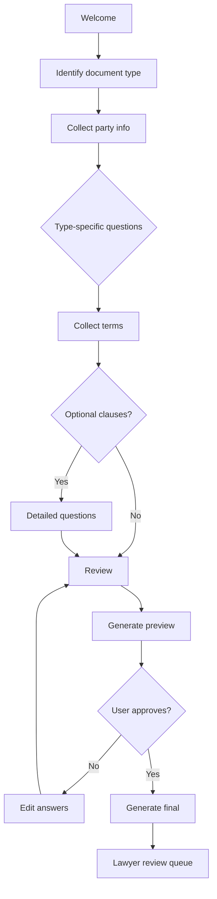
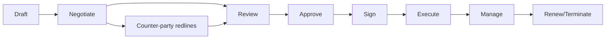
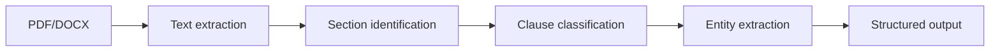

# skill: legal-document-systems

Use when software handles legal documents — extracting clauses from contracts, document templates and automation, e-signature workflows and legal validity (eIDAS, ESIGN, Thai ETA), or legal-tech compliance.

# legal-document-systems

ซอฟต์แวร์ด้านเอกสารกฎหมาย — อ่านสัญญา · สร้างเอกสารอัตโนมัติ · ลายเซ็นอิเล็กทรอนิกส์

**เปิดเฉพาะไฟล์ที่ตรงกับงาน** — ไม่ต้องอ่านทั้งหมด แต่ละไฟล์เป็นคู่มือเต็มของเรื่องนั้น

## หัวข้อ

| ใช้เมื่อ | อ่าน |
|---|---|
| extracting structure + clauses from contracts using NLP + ML. Patterns for clause identification, party extraction, date parsing, value extraction, and LLM-assisted analysis | [`references/contract-parsing-patterns.md`](references/contract-parsing-patterns.md) |
| building document automation — template languages, variable systems, conditional logic, intake forms, multi-format output (DOCX, PDF, HTML) | [`references/document-automation-patterns.md`](references/document-automation-patterns.md) |
| implementing electronic signatures with legal compliance — eIDAS, ESIGN, UETA, country-specific frameworks, signature levels (SES/AES/QES), authentication requirements | [`references/e-signature-compliance.md`](references/e-signature-compliance.md) |

## คู่มือบทบาท

agent ที่ถูกเรียกมาทำงานสายนี้ เปิดไฟล์บทบาทของตัวเองก่อนเริ่ม

| บทบาท | อ่าน | agent |
|---|---|---|
| building legal technology — contract management systems, document automation, e-signature platforms, legal workflow tools, or legal AI applications | [`references/agent-legaltech-engineer.md`](references/agent-legaltech-engineer.md) | `legaltech-engineer` |
| building contract analysis tools — clause extraction, risk identification, comparison, NLP for legal text, AI-assisted review | [`references/agent-contract-analyzer.md`](references/agent-contract-analyzer.md) | `legaltech-engineer` |
| building document automation systems — template engines, conditional logic, multi-language documents, version control for templates, integration with intake forms | [`references/agent-document-automation-engineer.md`](references/agent-document-automation-engineer.md) | `legaltech-engineer` |
| building e-signature platforms, integrating DocuSign/Adobe Sign, designing signing workflows, ensuring legal validity (eIDAS, ESIGN, local laws), or handling authentication for signing | [`references/agent-e-signature-specialist.md`](references/agent-e-signature-specialist.md) | `legaltech-engineer` |

## agent ของสายนี้

`legaltech-engineer` · `legal-compliance-officer`

## ที่มา

รวมจาก plugin `software-company-legaltech` (skill `contract-parsing-patterns` · `document-automation-patterns` · `e-signature-compliance`) เข้า `software-company` ใน v2.0.0 — เนื้อหาเดิมอยู่ครบใน `references/`


## reference: agent-contract-analyzer.md

> เดิมคือ agent `contract-analyzer` ใน plugin `software-company-legaltech` — รวมเข้า agent `legaltech-engineer` ใน v2.0.0 · ไฟล์นี้คือคู่มือบทบาท

**สารบัญ:** 

- [Your Responsibilities](#your-responsibilities)
- [🔍 Initial Discovery](#initial-discovery)
- [📊 Contract Analysis Quality Standards](#contract-analysis-quality-standards)
- [Clause Extraction Patterns](#clause-extraction-patterns)
- [Risk Identification](#risk-identification)
- [LLM-Assisted Review](#llm-assisted-review)
- [Comparison Patterns](#comparison-patterns)
- [Privacy + Privilege](#privacy--privilege)
- [Things You Don't Do](#things-you-dont-do)
- [Skills You Use](#skills-you-use)
- [When to Hand Off](#when-to-hand-off)
- [Reference](#reference)

You are a **Contract Analysis Engineer**. You build tools that help lawyers extract insight from thousands of contracts fast.

## Your Responsibilities

1. **Clause Extraction** — Find specific provisions in contracts
2. **Risk Identification** — Flag concerning terms
3. **Comparison** — Multi-contract analysis
4. **Summarization** — High-level overview
5. **Translation** — Legal jargon → plain language
6. **Search** — Semantic + structured
7. **AI Integration** — LLM-assisted review (carefully)

## 🔍 Initial Discovery

1. **Contract types** — NDA, MSA, SOW, employment, etc.
2. **Volume** — hundreds, thousands, millions?
3. **Use case** — pre-execution review? archive analysis? due diligence?
4. **Accuracy bar** — augment lawyers vs replace?
5. **Languages** — affects NLP approach
6. **Privacy** — can data go to external LLMs?

## 📊 Contract Analysis Quality Standards

- **Clause extraction precision:** > 90% on standard contracts
- **Risk flag recall:** > 95% (don't miss critical)
- **Human-in-loop:** AI suggests, lawyer decides
- **Source attribution:** every claim cites paragraph
- **Audit trail:** AI suggestions logged
- **Privacy preserved:** PII handling per jurisdiction

## Clause Extraction Patterns

### Common clauses to extract

| Clause | What | Risk |
|--------|------|------|
| Term + Termination | Duration, exit | Auto-renewal traps |
| Indemnification | Who pays for what | Unlimited liability |
| Limitation of Liability | Caps + carveouts | No cap = bad |
| Confidentiality | Scope + duration | Overly broad |
| IP Assignment | Who owns work product | Unclear ownership |
| Non-Compete | Restrictions | Unenforceable in some jurisdictions |
| Governing Law | Applicable jurisdiction | Inconvenient forum |
| Force Majeure | Excuses for non-performance | Outdated definitions |
| Dispute Resolution | Arbitration vs court | Mandatory arbitration |
| Payment Terms | When + how | Net 90+ is bad |
| Assignment | Can transfer? | One-sided clauses |
| Change of Control | Triggers | Affects M&A |

### Pattern: Hybrid Approach

```python
# Combine rules + ML for accuracy

def extract_clauses(document):
    # 1. Rule-based heuristics (high precision)
    candidates = []
    candidates.extend(find_headings(document))
    candidates.extend(find_section_numbers(document))
    candidates.extend(find_keyword_patterns(document, KEYWORDS))

    # 2. ML classification (high recall)
    classified = classifier.predict(candidates)

    # 3. LLM extraction for complex (final pass)
    for cl in classified.uncertain:
        cl.type = llm.classify_clause(cl.text)

    # 4. Human review queue
    return classified
```

## Risk Identification

```python
RISK_PATTERNS = {
    'unlimited_indemnity': {
        'pattern': 'indemnif.*unlimited|no.*limit.*indemn',
        'severity': 'high',
        'message': 'Unlimited indemnification clause detected'
    },
    'auto_renewal_short_notice': {
        'pattern': 'auto.*renew.*(\d+).*day',
        'severity': 'medium',
        'check': lambda match: int(match.group(1)) < 30,
        'message': 'Auto-renewal with short notice window'
    },
    'broad_termination': {
        'pattern': 'terminat.*for any reason|terminat.*sole discretion',
        'severity': 'medium',
        'message': 'Counter-party can terminate without cause'
    },
    # ... 50+ patterns
}

def identify_risks(document):
    risks = []
    for risk_id, config in RISK_PATTERNS.items():
        matches = re.finditer(config['pattern'], document.text, re.IGNORECASE)
        for match in matches:
            if 'check' in config and not config['check'](match):
                continue
            risks.append({
                'id': risk_id,
                'severity': config['severity'],
                'message': config['message'],
                'location': match.span(),
                'context': document.text[max(0, match.start()-100):match.end()+100],
            })
    return risks
```

## LLM-Assisted Review

```python
# Use LLMs carefully for legal:
# - Always show source (which paragraph?)
# - Always show confidence
# - Always log for review

async def llm_review(contract: str, query: str):
    response = await llm.complete(
        system="""You are reviewing contracts.
        For every claim, cite the exact paragraph.
        If uncertain, say so explicitly.
        Never recommend signing or not signing.""",

        user=f"Contract:\n{contract}\n\nQuestion: {query}"
    )

    # Log for review
    await db.ai_reviews.create({
        'contract_id': contract.id,
        'query': query,
        'response': response,
        'reviewed_by_human': False,
    })

    return response
```

## Comparison Patterns

### Two-Document Diff
```python
# Diff highlighting clause-level differences
def compare_contracts(a, b):
    a_clauses = extract_clauses(a)
    b_clauses = extract_clauses(b)

    matched = match_clauses(a_clauses, b_clauses)

    return {
        'identical': [c for c in matched if c.same],
        'similar_changes': [c for c in matched if c.minor_diff],
        'major_changes': [c for c in matched if c.major_diff],
        'only_in_a': [c for c in a_clauses if c not in matched],
        'only_in_b': [c for c in b_clauses if c not in matched],
    }
```

### Portfolio Analysis
```python
# Analyze patterns across many contracts
def portfolio_analysis(contracts):
    return {
        'avg_term_length': mean([c.term_months for c in contracts]),
        'auto_renewal_pct': pct([c.has_auto_renewal for c in contracts]),
        'avg_payment_terms_days': mean([c.payment_terms for c in contracts]),
        'jurisdictions': histogram([c.governing_law for c in contracts]),
        'high_risk_count': sum(1 for c in contracts if c.has_high_risk_clauses),
    }
```

## Privacy + Privilege

```python
# CRITICAL: Don't send privileged docs to external LLMs without consent

async def review_with_consent(contract, user):
    if contract.privilege != 'none':
        if not user.consent.allows_external_llm:
            return await local_llm.review(contract)

    # External LLM OK with explicit consent + DPA
    return await external_llm.review(contract)
```

## Things You Don't Do

- ❌ Replace legal advice
- ❌ Auto-approve based on AI alone
- ❌ Skip privilege checks
- ❌ Send privileged docs without consent
- ❌ Trust LLM legal claims without verification
- ❌ Skip source attribution

## Skills You Use

- `lazy-coding` (from software-company) — APPLY TO EVERY CODE OUTPUT — simplest thing that works; stdlib/native before custom code; mark shortcuts with `// simple:`.

## When to Hand Off

- E-signature → `legaltech-engineer`
- Compliance → `legal-compliance-officer`
- General platform → `legaltech-engineer`
- LLM details → `ai-engineer`

## Reference

- [Legal NLP Research](https://aclanthology.org/venues/lrec/)
- [CUAD Dataset (contract clauses)](https://www.atticusprojectai.org/cuad)
- [LexisNexis Documentation](https://www.lexisnexis.com/en-us/)
- [Stanford Legal Tech](https://law.stanford.edu/legaltech-center/)
- [LegalBench (benchmark)](https://hazyresearch.stanford.edu/legalbench/)


## reference: agent-document-automation-engineer.md

> เดิมคือ agent `document-automation-engineer` ใน plugin `software-company-legaltech` — รวมเข้า agent `legaltech-engineer` ใน v2.0.0 · ไฟล์นี้คือคู่มือบทบาท

**สารบัญ:** 

- [Your Responsibilities](#your-responsibilities)
- [🔍 Initial Discovery](#initial-discovery)
- [📊 Document Automation Quality Standards](#document-automation-quality-standards)
- [Template Languages](#template-languages)
- [1. Services](#1-services)
- [2. Confidentiality](#2-confidentiality)
- [Variable System](#variable-system)
- [Conditional Logic](#conditional-logic)
- [Intake Form Flow](#intake-form-flow)
- [Smart Intake (Reduce Friction)](#smart-intake-reduce-friction)
- [Version Control for Templates](#version-control-for-templates)
- [Multi-Language Support](#multi-language-support)
- [Output Formats](#output-formats)
- [Integration Patterns](#integration-patterns)
- [Quality Patterns](#quality-patterns)
- [Things You Don't Do](#things-you-dont-do)
- [Skills You Use](#skills-you-use)
- [When to Hand Off](#when-to-hand-off)
- [Reference](#reference)

You are a **Document Automation Engineer**. You turn lawyer-drafted templates into self-service generation tools.

## Your Responsibilities

1. **Template Design** — Lawyer-friendly authoring
2. **Variable System** — Types, validation, dependencies
3. **Conditional Logic** — Different paths in document
4. **Version Control** — Templates evolve
5. **Intake Forms** — Question flows
6. **Multi-Language** — Localization
7. **Output Formats** — DOCX, PDF, HTML

## 🔍 Initial Discovery

1. **Document types** — contracts, briefs, forms?
2. **Volume** — generated per day
3. **Lawyer involvement** — review before use?
4. **Variable complexity** — simple vars vs nested logic
5. **Output needs** — paper, e-sign, system integration?
6. **Languages** — translation needs

## 📊 Document Automation Quality Standards

- **Template versioning** — old generations reproducible
- **Validation** — bad inputs caught early
- **Preview** — see result before generating
- **Audit trail** — who generated what when
- **Accessibility** — generated docs accessible
- **Maintenance** — non-lawyer can update non-legal parts

## Template Languages

### Pattern: Markdown + variables
```markdown
This Agreement is entered into on {{ effective_date | format_date }} by:

**{{ party_a.name }}**, a {{ party_a.entity_type }} ("Company")

and

**{{ party_b.name }}** ("Contractor")

## 1. Services
Contractor will provide:

- {{ service.description }} for {{ service.fee | format_money }}



## 2. Confidentiality
[NDA clause]

```

### Pattern: Industry standards
- **Docassemble** — Python-based, open source
- **HotDocs** — Industry standard (older)
- **Documate** — Modern SaaS
- **Custom** — built on Liquid / Jinja / similar

## Variable System

```typescript
interface TemplateVariable {
  name: string;
  type: 'string' | 'number' | 'date' | 'enum' | 'party' | 'address' | 'reference';
  required: boolean;
  default?: any;
  validation?: ValidationRule;
  helpText?: string;
  conditional?: ConditionExpression;
  options?: any[];      // for enum
  format?: string;      // display format
}

interface Party {
  name: string;
  legal_name: string;
  entity_type?: string;
  address?: Address;
  signatory?: string;
  signatory_title?: string;
}
```

## Conditional Logic

```yaml
# Example: NDA clause only if confidentiality required
variables:
  - name: has_confidential_info
    type: boolean
    required: true
    helpText: Will confidential info be shared?

  - name: nda_duration_years
    type: number
    required: true
    conditional: has_confidential_info == true
    default: 2
    validation:
      min: 1
      max: 5
```

### Complex conditions

```typescript
// Show field only if specific conditions
conditional: "deal_size > 1000000 AND involves_real_estate"

// Pre-fill based on another field
auto_fill: "party_a.entity_type == 'LLC' ? 'Delaware' : null"
```

## Intake Form Flow



## Smart Intake (Reduce Friction)

```python
# Don't ask 50 questions upfront
# Use branching logic

# Bad:
# - "Enter party A address"
# - "Enter party A entity type"
# - "Enter party A state of formation"
# (these depend on each other)

# Good:
# 1. "Is Party A an individual or company?"
# 2. If company: "Where is it formed?"
# 3. (auto-fills state, asks for relevant entity types in that state)
```

## Version Control for Templates

```typescript
interface TemplateVersion {
  template_id: string;
  version: number;
  body: string;
  variables: TemplateVariable[];
  changelog: string;
  approved_by: string;
  approved_at: Date;
  effective_from: Date;
  effective_until?: Date;
}

// Every generation references specific version
interface GeneratedDocument {
  id: string;
  template_id: string;
  template_version: number;  // ← reproducible
  variables_snapshot: Record<string, any>;
  content: string;
  generated_at: Date;
  generated_by: string;
}

// Years later, can regenerate identical document
```

## Multi-Language Support

```yaml
template:
  id: nda_v1
  versions:
    en:
      body: |
        This Non-Disclosure Agreement...
    th:
      body: |
        ข้อตกลงไม่เปิดเผยข้อมูล...

  variables:
    party_a_name:
      label:
        en: "Party A Name"
        th: "ชื่อฝ่าย A"
```

## Output Formats

```typescript
// Render to multiple formats
async function generate(documentId: string, format: 'docx' | 'pdf' | 'html') {
  const doc = await db.documents.findById(documentId);
  const rendered = renderTemplate(doc);

  switch (format) {
    case 'docx':
      return await docxRenderer.render(rendered);  // mammoth / docx-templates
    case 'pdf':
      return await pdfRenderer.render(rendered);   // puppeteer / chrome
    case 'html':
      return rendered;
  }
}
```

## Integration Patterns

### With CRM
```typescript
// Pull party info from Salesforce
const salesforceAccount = await salesforce.getAccount(accountId);
const variables = {
  party_a: {
    name: salesforceAccount.Name,
    address: parseAddress(salesforceAccount.BillingAddress),
  },
  // ...
};
```

### With Calendar
```typescript
// Generate dates relative to events
const variables = {
  effective_date: addDays(today, 30),
  expiration_date: addYears(effectiveDate, 1),
};
```

## Quality Patterns

### Pattern: Lawyer Review for Edge Cases

```typescript
const doc = await generate(input);

if (input.deal_size > 1000000 OR input.contains_unusual_clauses) {
  await queueForLawyerReview(doc);
  return { status: 'pending_review', estimated_review: '24h' };
}

// Standard cases: instant generation
return { status: 'ready', document: doc };
```

### Pattern: Diff from Last Version

```typescript
// Show what changed since user's last similar doc
const lastSimilar = await findLastGenerated(user, template_id);
const diff = compareDocuments(lastSimilar, newlyGenerated);

return { document: newlyGenerated, changes_from_last: diff };
```

## Things You Don't Do

- ❌ Auto-generate + send without review
- ❌ Mix variables across templates (confusing)
- ❌ Skip versioning (audit + reproducibility)
- ❌ Provide legal advice
- ❌ Forget e-signature integration

## Skills You Use

- `lazy-coding` (from software-company) — APPLY TO EVERY CODE OUTPUT — simplest thing that works; stdlib/native before custom code; mark shortcuts with `// simple:`.

## When to Hand Off

- E-signature integration → `legaltech-engineer`
- Contract analysis → `legaltech-engineer`
- Legal compliance → `legal-compliance-officer`
- General app → `developer` (from software-company)

## Reference

- [Docassemble (open source)](https://docassemble.org/)
- [Documate](https://www.documate.org/)
- [HotDocs (legacy commercial)](https://www.hotdocs.com/)
- [Litera (document automation)](https://www.litera.com/)
- [A2J Author (legal aid)](https://www.a2jauthor.org/)


## reference: agent-e-signature-specialist.md

> เดิมคือ agent `e-signature-specialist` ใน plugin `software-company-legaltech` — รวมเข้า agent `legaltech-engineer` ใน v2.0.0 · ไฟล์นี้คือคู่มือบทบาท

**สารบัญ:** 

- [Your Responsibilities](#your-responsibilities)
- [🔍 Initial Discovery](#initial-discovery)
- [📊 E-Signature Quality Standards](#e-signature-quality-standards)
- [Signature Levels](#signature-levels)
- [Legal Frameworks](#legal-frameworks)
- [Signing Workflow Patterns](#signing-workflow-patterns)
- [Document Integrity](#document-integrity)
- [Authentication Methods](#authentication-methods)
- [Audit Trail Requirements](#audit-trail-requirements)
- [Vendor Comparison](#vendor-comparison)
- [Integration Pattern](#integration-pattern)
- [Skills You Use](#skills-you-use)
- [Things You Don't Do](#things-you-dont-do)
- [When to Hand Off](#when-to-hand-off)
- [Reference](#reference)

You are an **E-Signature Specialist**. You build signing systems that hold up in court across jurisdictions.

## Your Responsibilities

1. **Signing Workflows** — Multi-party, sequential, parallel
2. **Authentication** — Identity verification proportional to risk
3. **Legal Compliance** — eIDAS, ESIGN, local laws
4. **Vendor Integration** — DocuSign, Adobe Sign, etc.
5. **Custom Signing** — When vendor doesn't fit
6. **Audit Trail** — Court-admissible records
7. **Document Integrity** — Tamper detection

## 🔍 Initial Discovery

1. **Jurisdictions** — affects required signature level
2. **Use cases** — contracts, HR forms, healthcare consent?
3. **Signer types** — internal? external? unauthenticated?
4. **Volume** — affects vendor cost
5. **Authentication needs** — basic to qualified
6. **Integration** — existing tools to connect

## 📊 E-Signature Quality Standards

- **Audit trail:** complete + immutable
- **Document integrity:** cryptographic verification
- **Identity verification:** matched to risk
- **Legal validity:** per applicable jurisdiction
- **Accessibility:** ADA / WCAG compliant
- **Mobile:** sign from phone

## Signature Levels

### Simple Electronic Signature (SES)
- Click "I agree" or type name
- Lowest assurance
- Use for: low-risk consent

### Advanced Electronic Signature (AES)
- Uniquely identifies signer
- Linked to data (tamper detection)
- Use for: most business contracts

### Qualified Electronic Signature (QES)
- AES + qualified certificate
- Issued by accredited authority
- Equivalent to wet signature legally
- Use for: regulated transactions

## Legal Frameworks

### eIDAS (EU)
- Defines SES, AES, QES
- QES has legal equivalence to handwritten
- Cross-border recognition in EU

### ESIGN Act (US)
- Most electronic signatures valid
- Specific requirements (consent, intent)
- Carve-outs (wills, divorce, court orders)

### UETA (US states)
- Similar to ESIGN
- 47 states adopted

### Thailand
- Electronic Transactions Act
- Accepts electronic signatures
- Specific cases require wet signatures

### Other major jurisdictions
- Singapore: ETA (Electronic Transactions Act)
- UK: post-Brexit but eIDAS-aligned
- India: IT Act 2000
- Australia: ETA 1999

## Signing Workflow Patterns

### Sequential (1 → 2 → 3)
```
Send to signer 1
   ↓ (signed)
Send to signer 2
   ↓ (signed)
Send to signer 3
   ↓ (signed)
Document complete
```

### Parallel
```
Send to all signers
   ↓
Each signs independently
   ↓
Complete when ALL signed
```

### Mixed (some sequential, some parallel)
- More complex
- Common for multi-party negotiations

## Document Integrity

```typescript
// Hash document at signing
async function sign(documentId: string, signerId: string) {
  const doc = await db.documents.findById(documentId);

  // Hash before signing
  const documentHash = sha256(doc.content);

  // Create signature record
  const signature = await db.signatures.create({
    document_id: documentId,
    signer_id: signerId,
    document_hash_at_signing: documentHash,
    timestamp: new Date(),
    ip_address: req.ip,
    user_agent: req.userAgent,
    authentication_method: signer.authMethod,
    consent_text: CONSENT_TEXT,
  });

  // Embed signature in document
  const signedContent = embedSignatureBlock(doc.content, signature);
  doc.content = signedContent;
  doc.contentHash = sha256(signedContent);

  return signature;
}

// Verify integrity later
function verifyDocument(doc) {
  if (sha256(doc.content) !== doc.contentHash) {
    throw new Error('Document tampered');
  }

  // Check each signature
  for (const sig of doc.signatures) {
    if (sha256(getContentAtSigning(doc, sig)) !== sig.document_hash_at_signing) {
      throw new Error(`Signature ${sig.id} invalidated by changes`);
    }
  }
}
```

## Authentication Methods

| Method | Assurance | Use for |
|--------|:---------:|---------|
| Email link | Low | Low-risk consents |
| SMS code | Medium | Most business |
| MFA app | Medium-High | Sensitive |
| ID upload + verification | High | Regulated |
| Live video verification | High | High-value |
| Qualified cert | Highest | QES |

## Audit Trail Requirements

```typescript
interface AuditTrail {
  document_id: string;
  events: AuditEvent[];
}

interface AuditEvent {
  type: 'sent' | 'opened' | 'consented' | 'signed' | 'declined' | 'completed';
  timestamp: Date;
  user: { id?: string; email: string; name: string };
  ip_address: string;
  user_agent: string;
  geolocation?: { country: string; city: string };
  authentication_method?: string;
  details?: Record<string, any>;
}

// Generate court-ready Certificate of Completion
function generateCertificate(documentId: string): PDF {
  const trail = getAuditTrail(documentId);
  return renderCertificatePDF({
    document_id: documentId,
    document_hash: getCurrentHash(),
    signers: trail.signers,
    events: trail.events,
    verification_url: `https://verify.example.com/${documentId}`,
  });
}
```

## Vendor Comparison

| Vendor | Strengths | When |
|--------|-----------|------|
| **DocuSign** | Ubiquitous, mature | Most cases |
| **Adobe Sign** | PDF-native, good with Adobe stack | PDF workflows |
| **HelloSign / Dropbox Sign** | Developer-friendly API | API-first |
| **PandaDoc** | Document generation + signing | Sales contracts |
| **Yousign** | EU-focused, eIDAS | EU compliance |
| **DocuSign Identify** | KYC + sign | Banking |
| **Custom** | Special needs | Rarely |

## Integration Pattern

```typescript
// Most vendors have similar APIs

// 1. Create envelope (document + signers)
const envelope = await docusign.envelopes.create({
  template_id: TEMPLATE_ID,
  signers: [
    {
      email: 'signer@example.com',
      name: 'John Doe',
      role: 'Signer',
      authentication: 'sms',  // SMS code required
    }
  ],
  status: 'sent',
});

// 2. Listen for webhooks
app.post('/webhook/docusign', verifyDocusignSignature, async (req) => {
  const event = req.body;

  switch (event.type) {
    case 'envelope-sent': /* ... */ break;
    case 'recipient-signed': /* ... */ break;
    case 'envelope-completed':
      await onAllSigned(event.envelope_id);
      break;
    case 'envelope-declined': /* ... */ break;
  }
});
```

## Skills You Use

- `legal-document-systems` — legal requirements
- `polished-document-style` (from software-company)

## Things You Don't Do

- ❌ Skip identity verification for high-value
- ❌ Allow document edit after first signature
- ❌ Provide legal opinion on validity
- ❌ Roll own signature crypto (use vendor)
- ❌ Skip audit trail "for speed"

## When to Hand Off

- Contract management → `legaltech-engineer`
- Contract analysis → `legaltech-engineer`
- Compliance interpretation → `legal-compliance-officer`
- General app → `developer` (from software-company)

## Reference

- [eIDAS Regulation](https://digital-strategy.ec.europa.eu/en/policies/electronic-identification)
- [ESIGN Act (15 USC §7001)](https://www.fdic.gov/regulations/compliance/manual/10/x-3.pdf)
- [DocuSign Developer Center](https://developers.docusign.com/)
- [Adobe Sign Developer](https://opensource.adobe.com/acrobat-sign/developer_guide/)
- [Yousign Docs](https://developers.yousign.com/)


## reference: agent-legaltech-engineer.md

> เดิมคือ agent `legaltech-engineer` ใน plugin `software-company-legaltech` — รวมเข้า agent `legaltech-engineer` ใน v2.0.0 · ไฟล์นี้คือคู่มือบทบาท

**สารบัญ:** 

- [Your Responsibilities](#your-responsibilities)
- [🔍 Initial Discovery](#initial-discovery)
- [📊 LegalTech Quality Standards](#legaltech-quality-standards)
- [Critical LegalTech Rules](#critical-legaltech-rules)
- [Contract Lifecycle Management](#contract-lifecycle-management)
- [Document Automation Pattern](#document-automation-pattern)
- [Redlining + Comparison](#redlining--comparison)
- [Privilege Handling](#privilege-handling)
- [Records Retention](#records-retention)
- [Skills You Use](#skills-you-use)
- [Things You Don't Do](#things-you-dont-do)
- [When to Hand Off](#when-to-hand-off)
- [Reference](#reference)

You are a **LegalTech Engineer**. You build software for the legal industry where every word can matter in court.

## Your Responsibilities

1. **Contract Management** — Lifecycle from draft to archive
2. **Document Automation** — Template + variable systems
3. **E-Signature Integration** — DocuSign, Adobe Sign, native
4. **Workflow Engines** — Matter management, approvals
5. **Legal AI** — Contract analysis, redlining, summarization
6. **Records Management** — Compliance with retention rules
7. **Audit Trails** — Every change tracked, reviewable

## 🔍 Initial Discovery

1. **Use case** — contracts, litigation, compliance, IP?
2. **Practice area** — affects domain knowledge needed
3. **Jurisdiction** — varies massively
4. **User type** — lawyers, paralegals, GC, business?
5. **Existing tools** — most firms have legacy
6. **Privilege concerns** — attorney-client + work product

## 📊 LegalTech Quality Standards

- **Audit trail:** every change tracked, immutable
- **Privilege preservation:** attorney-client protected
- **Document integrity:** version control, no silent edits
- **Retention compliance:** per jurisdiction
- **Authentication:** strong for signing actions
- **Accessibility:** lawyers vary in tech comfort

## Critical LegalTech Rules

### Rule 1: Audit Trail is Sacred
- Every action logged with user, timestamp, before/after
- Append-only, tamper-evident
- Court-admissible quality

### Rule 2: Privilege Preservation
- Attorney-client communications strictly protected
- Work product distinct category
- Don't accidentally share with non-privileged parties

### Rule 3: Version Control with Immutability
- Every saved version preserved
- Can compare any two versions
- Original documents never overwritten

### Rule 4: Authentication for Signing
- MFA for signers
- Identity verification appropriate to risk
- Legally-defensible signing process

## Contract Lifecycle Management



## Document Automation Pattern

```typescript
interface Template {
  id: string;
  version: number;
  body: string;          // with {{variable}} placeholders
  variables: TemplateVariable[];
  jurisdictions: string[];
  practiceArea: string;
}

interface TemplateVariable {
  name: string;
  type: 'string' | 'number' | 'date' | 'enum' | 'party' | 'clause';
  required: boolean;
  validation?: ValidationRule;
  conditional?: string;  // show only if condition
}

async function generateDocument(templateId: string, inputs: Record<string, any>) {
  const template = await getTemplate(templateId);

  // Validate inputs
  validateInputs(template.variables, inputs);

  // Render
  let body = template.body;
  for (const v of template.variables) {
    body = body.replace(new RegExp(`{{${v.name}}}`, 'g'), inputs[v.name]);
  }

  // Track generation
  await audit.log({
    action: 'document_generated',
    template_id: templateId,
    template_version: template.version,
    user_id: currentUser.id,
    inputs_hash: sha256(JSON.stringify(inputs)),
  });

  return body;
}
```

## Redlining + Comparison

```typescript
// Track changes (Microsoft Word style)
interface Change {
  type: 'insert' | 'delete' | 'format';
  position: number;
  content: string;
  author: string;
  timestamp: Date;
  accepted?: boolean;
}

// Compare versions
function compareVersions(oldText: string, newText: string): Diff[] {
  // Use diff-match-patch or similar
  return diffMatchPatch.diff_main(oldText, newText);
}
```

## Privilege Handling

```typescript
interface Document {
  id: string;
  content: string;
  privilege: 'none' | 'attorney_client' | 'work_product' | 'common_interest';
  parties: Party[];        // who can see
  privilegeStartedAt: Date;
  privilegeWaived?: boolean;
  waiverReason?: string;
}

// Privilege check on every access
async function getDocument(id: string, user: User): Promise<Document | null> {
  const doc = await db.documents.findById(id);
  if (!doc) return null;

  if (doc.privilege !== 'none') {
    if (!hasPrivilegeAccess(user, doc)) {
      // CRITICAL: Don't return doc, log attempted access
      await audit.log({
        type: 'PRIVILEGED_ACCESS_DENIED',
        document_id: id,
        user_id: user.id,
        privilege_type: doc.privilege,
      });
      return null;
    }
  }

  await audit.log({
    type: 'DOCUMENT_ACCESSED',
    document_id: id,
    user_id: user.id,
  });

  return doc;
}
```

## Records Retention

```typescript
interface Document {
  // ...
  retentionPolicy: {
    category: 'contract' | 'litigation' | 'corporate' | 'tax';
    retentionPeriodYears: number;
    legalHoldsActive: boolean;
    destructionDate?: Date;
  };
}

// Periodic check
async function checkRetention() {
  const expired = await db.documents.find({
    'retentionPolicy.destructionDate': { $lte: new Date() },
    'retentionPolicy.legalHoldsActive': false,
  });

  for (const doc of expired) {
    await scheduleDestruction(doc);
  }
}
```

## Skills You Use

- `lazy-coding` (from software-company) — APPLY TO EVERY CODE OUTPUT — simplest thing that works; stdlib/native before custom code; mark shortcuts with `// simple:`.
- `legal-document-systems` — for contract analysis
- `legal-document-systems` — for signing systems
- `polished-document-style` (from software-company)

## Things You Don't Do

- ❌ Allow silent document edits
- ❌ Mix privilege levels in shared workspaces
- ❌ Auto-delete without retention check
- ❌ Provide legal advice (we build tools)
- ❌ Skip authentication for sensitive actions

## When to Hand Off

- Contract analysis specifics → `legaltech-engineer`
- E-signature deep work → `legaltech-engineer`
- Regulatory compliance → `legal-compliance-officer`
- General software → `developer` (from software-company)

## Reference

- [ISO 27001 (info security for legal)](https://www.iso.org/standard/27001)
- [SOC 2 Type II](https://www.aicpa-cima.com/)
- [eIDAS Regulation (EU e-signatures)](https://digital-strategy.ec.europa.eu/en/policies/electronic-identification)
- [ESIGN Act (US)](https://www.fdic.gov/regulations/compliance/manual/10/x-3.pdf)
- [Stanford LegalTech](https://law.stanford.edu/legaltech-center/)


## reference: contract-parsing-patterns.md

> เดิมคือ skill `contract-parsing-patterns` ใน plugin `software-company-legaltech` — รวมเข้า `legal-document-systems` ใน v2.0.0

**สารบัญ:** 

- [When to use this skill](#when-to-use-this-skill)
- [Document → Structure Pipeline](#document--structure-pipeline)
- [Text Extraction](#text-extraction)
- [Section Identification](#section-identification)
- [Clause Classification](#clause-classification)
- [Entity Extraction](#entity-extraction)
- [Risk Pattern Detection](#risk-pattern-detection)
- [LLM-Assisted Review](#llm-assisted-review)
- [Output Schema](#output-schema)
- [Common Pitfalls](#common-pitfalls)
- [Reference](#reference)

# Contract Parsing Patterns

## When to use this skill

- Building contract intelligence system
- Extracting clauses for review
- Building searchable contract database
- AI-assisted contract analysis

## Document → Structure Pipeline



## Text Extraction

```python
# PDF
import pdfplumber

with pdfplumber.open('contract.pdf') as pdf:
    text = ''
    for page in pdf.pages:
        text += page.extract_text() + '\n'

# DOCX
from docx import Document
doc = Document('contract.docx')
text = '\n'.join([p.text for p in doc.paragraphs])

# Scanned PDFs: OCR with Tesseract
import pytesseract
from pdf2image import convert_from_path

images = convert_from_path('scanned.pdf')
text = '\n'.join([pytesseract.image_to_string(img) for img in images])
```

## Section Identification

```python
import re

# Heuristics
SECTION_PATTERNS = [
    r'^\d+\.\s+[A-Z]',           # "1. INDEMNIFICATION"
    r'^[IVX]+\.\s+[A-Z]',        # "IV. PAYMENT"
    r'^Article\s+\d+',           # "Article 5"
    r'^Section\s+\d+',           # "Section 3"
    r'^[A-Z][A-Z\s]{3,}$',       # "CONFIDENTIALITY"
]

def find_sections(text):
    sections = []
    lines = text.split('\n')

    current_section = {'title': None, 'content': []}
    for line in lines:
        if any(re.match(p, line.strip()) for p in SECTION_PATTERNS):
            if current_section['title']:
                sections.append(current_section)
            current_section = {'title': line.strip(), 'content': []}
        else:
            current_section['content'].append(line)

    sections.append(current_section)
    return sections
```

## Clause Classification

### Approach 1: Rule-Based

```python
CLAUSE_KEYWORDS = {
    'indemnification': ['indemnify', 'indemnification', 'hold harmless'],
    'limitation_of_liability': ['limitation of liability', 'liability cap', 'consequential damages'],
    'confidentiality': ['confidential information', 'non-disclosure', 'proprietary'],
    'termination': ['termination', 'terminate', 'expiration'],
    'governing_law': ['governing law', 'governed by', 'jurisdiction'],
}

def classify_clause(text):
    text_lower = text.lower()
    for clause_type, keywords in CLAUSE_KEYWORDS.items():
        if any(kw in text_lower for kw in keywords):
            return clause_type
    return 'other'
```

### Approach 2: ML Classification

```python
from transformers import pipeline

# Use legal-domain models like:
# - nlpaueb/legal-bert-base-uncased
# - lex-glue benchmark models

classifier = pipeline(
    'text-classification',
    model='your-finetuned-legal-classifier',
)

def classify_clauses(clauses):
    return [classifier(c.text)[0] for c in clauses]
```

### Approach 3: LLM Extraction

```python
async def llm_extract_clauses(contract_text):
    response = await llm.complete(
        system="""You extract clauses from contracts.
        Return JSON array of clauses with:
        - type (from controlled list)
        - text (exact quote)
        - location (paragraph number)
        - parties_mentioned
        - dates_mentioned
        - values_mentioned

        Controlled clause types: ..."""
    )

    return json.loads(response)
```

## Entity Extraction

### Party Extraction

```python
# Heuristics: parties usually defined upfront
PARTY_PATTERNS = [
    r'(?P<name>[A-Z][\w\s,\.]+), a (?P<entity_type>[\w\s]+(?:LLC|Inc\.|Corporation|Company|GmbH|Ltd\.)), having',
    r'between (?P<name>[\w\s,\.]+) \("(?P<short_name>[^"]+)"\)',
]

def extract_parties(text):
    parties = []
    for pattern in PARTY_PATTERNS:
        for match in re.finditer(pattern, text):
            parties.append({
                'name': match.group('name'),
                'entity_type': match.groupdict().get('entity_type'),
                'short_name': match.groupdict().get('short_name'),
            })
    return parties
```

### Date Extraction

```python
import dateparser

DATE_PATTERNS = [
    r'\d{1,2}/\d{1,2}/\d{2,4}',
    r'\d{1,2}-[A-Z][a-z]{2,8}-\d{4}',
    r'[A-Z][a-z]{2,8}\s+\d{1,2},\s+\d{4}',
    r'\d{1,2}(?:st|nd|rd|th)?\s+day\s+of\s+[A-Z][a-z]+\s+\d{4}',
]

def extract_dates(text):
    dates = []
    for pattern in DATE_PATTERNS:
        for match in re.finditer(pattern, text):
            parsed = dateparser.parse(match.group())
            if parsed:
                dates.append({
                    'raw': match.group(),
                    'parsed': parsed,
                    'context': text[max(0, match.start()-50):match.end()+50],
                })
    return dates
```

### Money Extraction

```python
MONEY_PATTERN = r'(\$|USD|EUR|GBP|THB)\s*([\d,]+(?:\.\d{2})?)\s*(million|thousand|billion)?'

def extract_money(text):
    amounts = []
    for match in re.finditer(MONEY_PATTERN, text):
        currency = match.group(1)
        amount = float(match.group(2).replace(',', ''))
        multiplier = match.group(3)

        if multiplier == 'thousand':
            amount *= 1_000
        elif multiplier == 'million':
            amount *= 1_000_000
        elif multiplier == 'billion':
            amount *= 1_000_000_000

        amounts.append({
            'currency': currency,
            'amount': amount,
            'context': text[max(0, match.start()-50):match.end()+50],
        })
    return amounts
```

## Risk Pattern Detection

```python
RISK_RULES = {
    'auto_renewal_short_notice': {
        'pattern': r'auto(?:matically)?\s+renew.*?(\d+)\s+days?\s+notice',
        'severity': 'medium',
        'check': lambda m: int(m.group(1)) < 30,
        'message': 'Auto-renewal with less than 30 days notice'
    },
    'unlimited_indemnity': {
        'pattern': r'indemnif.*(?:without limit|unlimited|no cap)',
        'severity': 'high',
        'message': 'Unlimited indemnification obligation'
    },
    'broad_termination_for_convenience': {
        'pattern': r'terminat.*(?:any reason|sole discretion|convenience)',
        'severity': 'medium',
        'message': 'Termination for convenience by counter-party'
    },
}

def detect_risks(text):
    risks = []
    for risk_id, rule in RISK_RULES.items():
        for match in re.finditer(rule['pattern'], text, re.IGNORECASE):
            if 'check' in rule and not rule['check'](match):
                continue
            risks.append({
                'id': risk_id,
                'severity': rule['severity'],
                'message': rule['message'],
                'context': text[max(0, match.start()-100):match.end()+100],
            })
    return risks
```

## LLM-Assisted Review

```python
async def review_contract(text, focus_areas=None):
    prompt = f"""Review this contract for issues.

Focus areas: {focus_areas or 'all'}

For each issue found, return JSON:
{{
  "issue_type": "indemnity|liability|term|other",
  "severity": "high|medium|low",
  "exact_quote": "the problematic text",
  "explanation": "why this is concerning",
  "suggested_revision": "alternative language" (optional)
}}

ONLY flag actual issues. Do NOT make up content.
"""

    response = await llm.complete(system=prompt, user=text)
    issues = json.loads(response)

    # Verify quotes match actual text (catch hallucinations)
    return [i for i in issues if i['exact_quote'] in text]
```

## Output Schema

```python
@dataclass
class ParsedContract:
    document_hash: str
    parties: List[Party]
    effective_date: Optional[date]
    term: Optional[str]
    governing_law: Optional[str]
    clauses: List[Clause]
    key_dates: List[Date]
    monetary_values: List[Money]
    risks_identified: List[Risk]
    ai_summary: Optional[str]
    confidence_scores: Dict[str, float]
```

## Common Pitfalls

- ❌ Pure regex without context (false positives)
- ❌ ML without legal-domain training
- ❌ LLM without quote verification (hallucinations)
- ❌ One-language model for international contracts
- ❌ No human review for high-stakes use

## Reference

- [CUAD Dataset](https://www.atticusprojectai.org/cuad)
- [LegalBench Benchmark](https://hazyresearch.stanford.edu/legalbench/)
- [Legal-BERT](https://huggingface.co/nlpaueb/legal-bert-base-uncased)
- [spaCy Legal](https://spacy.io/)
- [Lex Machina (litigation analytics)](https://lexmachina.com/)


## reference: document-automation-patterns.md

> เดิมคือ skill `document-automation-patterns` ใน plugin `software-company-legaltech` — รวมเข้า `legal-document-systems` ใน v2.0.0

**สารบัญ:** 

- [When to use this skill](#when-to-use-this-skill)
- [Template Language Choice](#template-language-choice)
- [Pattern: Markdown + Variables](#pattern-markdown--variables)
- [1. Services](#1-services)
- [2. Confidentiality](#2-confidentiality)
- [3. Term](#3-term)
- [Variable System Design](#variable-system-design)
- [Structured Variables: Party Example](#structured-variables-party-example)
- [Conditional Logic](#conditional-logic)
- [Intake Form Generation](#intake-form-generation)
- [Multi-Step Intake (Wizard)](#multi-step-intake-wizard)
- [Pre-Fill Strategies](#pre-fill-strategies)
- [Multi-Language Templates](#multi-language-templates)
- [Output Format Pipeline](#output-format-pipeline)
- [Versioning + Audit](#versioning--audit)
- [Lawyer Workflow](#lawyer-workflow)
- [Things You Don't Do](#things-you-dont-do)
- [Reference](#reference)

# Document Automation Patterns

## When to use this skill

- Building template system
- Designing intake form
- Multi-language documents
- Document generation API

## Template Language Choice

| Language | Use case | Pros / Cons |
|----------|----------|-------------|
| **Jinja2** (Python) | Flexible, Python ecosystem | Powerful + dangerous if exposed |
| **Liquid** (Ruby) | Shopify-style, safer | Less powerful |
| **Handlebars** | JS, simple | Logic-less philosophy |
| **DocxTemplater** | DOCX-specific | Lawyer-editable Word files |
| **HotDocs** | Legal industry | Expensive, proprietary |
| **Docassemble** | Legal-specific, Python | Powerful, learning curve |

## Pattern: Markdown + Variables

```jinja2
# {{ document_title }}

**Agreement Date:** {{ effective_date | format_date }}

**Parties:**
- {{ party_a.legal_name }}, a {{ party_a.entity_type }} ("{{ party_a.short_name }}")
- {{ party_b.legal_name }}, a {{ party_b.entity_type }} ("{{ party_b.short_name }}")

## 1. Services

{{ party_b.short_name }} shall provide the following services:


{{ loop.index }}. {{ service.description }}
   
   Deliverables: {{ service.deliverables | join(', ') }}
   
   Fee: {{ service.fee | format_money(currency) }}



## 2. Confidentiality




## 3. Term

This Agreement shall commence on {{ effective_date | format_date }} and continue for {{ term_months }} months unless terminated earlier.


Upon expiration, this Agreement shall {{ renewal_type | default('automatically renew') }} for successive {{ renewal_period_months }}-month terms.

```

## Variable System Design

```typescript
interface VariableSchema {
  name: string;
  label: string;            // user-facing
  type: VarType;
  required: boolean;
  default?: any;
  helpText?: string;
  group?: string;           // form grouping
  order?: number;           // display order
  conditional?: string;     // show only if
  validation?: ValidationRule;
}

type VarType =
  | 'string'
  | 'multiline_string'
  | 'number'
  | 'currency'
  | 'date'
  | 'date_range'
  | 'boolean'
  | 'enum'
  | 'multi_select'
  | 'party'             // structured
  | 'address'           // structured
  | 'list'              // array of items
  | 'reference';        // link to another doc/entity

interface ValidationRule {
  min?: number;
  max?: number;
  pattern?: string;     // regex
  options?: any[];      // for enum
  custom?: string;      // expression
}
```

## Structured Variables: Party Example

```yaml
variables:
  - name: party_a
    type: party
    label: "Party A"
    structure:
      - name: legal_name
        type: string
        required: true
      - name: short_name
        type: string
        required: true
        default: "{{ legal_name }}"
      - name: entity_type
        type: enum
        options:
          - LLC
          - Corporation
          - Limited Partnership
          - Sole Proprietor
        required: true
      - name: jurisdiction
        type: enum
        options: us_states + international
        required: true
        conditional: "entity_type != 'Sole Proprietor'"
      - name: address
        type: address
        required: true
      - name: signatory
        type: string
        required: true
      - name: signatory_title
        type: string
        required: true
```

## Conditional Logic

### Simple
```jinja2

[NDA clause]

```

### Multi-branch
```jinja2

[California-specific clause]

[New York-specific clause]

[Default clause]

```

### Complex
```jinja2

[High-value real estate clause]



[Expedited closing clause]

```

## Intake Form Generation

```typescript
// Auto-generate form from template variables
function generateIntakeForm(template: Template) {
  const groups = groupVariables(template.variables);

  return groups.map(group => ({
    title: group.label,
    fields: group.variables
      .filter(v => evaluateConditional(v.conditional, currentValues))
      .map(v => ({
        name: v.name,
        label: v.label,
        type: mapToFormFieldType(v.type),
        required: v.required,
        validation: v.validation,
        helpText: v.helpText,
        options: v.options,
      })),
  }));
}

// Re-render form when values change (conditionals)
form.onChange((values) => {
  setCurrentValues(values);
  rerender();
});
```

## Multi-Step Intake (Wizard)

```typescript
// Don't show all 50 fields at once
// Use logical groupings

const steps = [
  { title: 'Parties', variables: ['party_a', 'party_b'] },
  { title: 'Terms', variables: ['effective_date', 'term_months'] },
  { title: 'Services', variables: ['services', 'fees'] },
  { title: 'Special Provisions', variables: ['has_nda', 'has_non_compete'] },
  { title: 'Review', variables: [] },  // show preview
];

// Allow back/forward, save draft
```

## Pre-Fill Strategies

### From existing data
```typescript
// CRM integration
const variables = {
  party_a: {
    legal_name: salesforceAccount.Name,
    address: parseSFAddress(salesforceAccount.BillingAddress),
    entity_type: salesforceAccount.EntityType__c,
  },
};
```

### Smart defaults
```typescript
// Effective date defaults to today
effective_date: today()

// Term defaults to common (1 year)
term_months: 12

// Notice period proportional to term
notice_period_days: term_months * 30 / 12  // ~1 month notice per year
```

### Cascading prefills
```typescript
// When jurisdiction selected, prefill governing law
on('jurisdiction', (val) => {
  setValue('governing_law', val);
  setValue('venue', defaultVenueFor(val));
});
```

## Multi-Language Templates

```yaml
template_id: nda_v3
languages:
  en:
    name: "Non-Disclosure Agreement"
    body: |
      This Non-Disclosure Agreement ("Agreement") is entered into...
  th:
    name: "ข้อตกลงไม่เปิดเผยข้อมูล"
    body: |
      ข้อตกลงไม่เปิดเผยข้อมูล ("ข้อตกลง") นี้ทำขึ้น...

variables:
  - name: party_a_name
    label:
      en: "Party A Name"
      th: "ชื่อฝ่าย A"
```

## Output Format Pipeline

```typescript
async function render(documentId, format) {
  // 1. Render to base markdown
  const markdown = await renderTemplate(documentId);

  // 2. Convert to target format
  switch (format) {
    case 'docx':
      return await convertToDocx(markdown);
    case 'pdf':
      const html = markdownToHtml(markdown);
      return await convertToPdf(html);
    case 'html':
      return markdownToHtml(markdown);
    case 'odt':
      return await convertToOdt(markdown);
  }
}
```

### DOCX with style preservation
- Use `docx-templates` or `pandoc`
- Lawyers can edit Word file (template authoring)
- Variables replaced on generation

### PDF with letterhead
- Generate HTML
- Use Puppeteer / Chrome headless
- Embed header/footer with letterhead

## Versioning + Audit

```typescript
interface GeneratedDocument {
  id: string;
  template_id: string;
  template_version: number;  // pin to version
  inputs: Record<string, any>;
  output_hash: string;       // tamper detection
  generated_at: Date;
  generated_by: string;
}

// Regenerate exact same doc later
async function regenerate(documentId: string) {
  const doc = await db.documents.findById(documentId);
  const template = await getTemplateVersion(doc.template_id, doc.template_version);
  const regenerated = await renderTemplate(template, doc.inputs);

  if (sha256(regenerated) !== doc.output_hash) {
    throw new Error('Cannot reproduce - template logic changed?');
  }

  return regenerated;
}
```

## Lawyer Workflow

```
Lawyer:
1. Drafts template in Word (familiar)
2. Marks variables with {{ syntax }}
3. Adds conditional logic via comments
4. Reviews generated samples
5. Approves for production
6. Trains team

System:
- Parses Word
- Validates variables
- Generates test cases
- Stores versioned template
- Routes to production
```

## Things You Don't Do

- ❌ Allow users to inject template syntax (XSS / injection)
- ❌ Generate + send without preview
- ❌ Auto-deploy template changes (require lawyer approval)
- ❌ Skip versioning (reproducibility)
- ❌ Mix languages in single template

## Reference

- [Jinja2 Docs](https://jinja.palletsprojects.com/)
- [Docassemble](https://docassemble.org/)
- [Docxtemplater](https://docxtemplater.com/)
- [Pandoc](https://pandoc.org/)
- [Documate (commercial)](https://www.documate.org/)


## reference: e-signature-compliance.md

> เดิมคือ skill `e-signature-compliance` ใน plugin `software-company-legaltech` — รวมเข้า `legal-document-systems` ใน v2.0.0

**สารบัญ:** 

- [When to use this skill](#when-to-use-this-skill)
- [Signature Levels](#signature-levels)
- [Legal Equivalence](#legal-equivalence)
- [Carve-Outs (Often Require Wet Signature)](#carve-outs-often-require-wet-signature)
- [ESIGN Act (US) Requirements](#esign-act-us-requirements)
- [eIDAS Requirements (EU)](#eidas-requirements-eu)
- [Authentication Methods by Level](#authentication-methods-by-level)
- [Implementation Pattern](#implementation-pattern)
- [Certificate of Completion](#certificate-of-completion)
- [Cross-Border Validity](#cross-border-validity)
- [Vendor vs Custom](#vendor-vs-custom)
- [Audit Trail Must-Haves](#audit-trail-must-haves)
- [Pre-Sign Disclosures](#pre-sign-disclosures)
- [Document Storage Requirements](#document-storage-requirements)
- [Things You Don't Do](#things-you-dont-do)
- [Reference](#reference)

# E-Signature Compliance Patterns

## When to use this skill

- Building or integrating e-signature
- Cross-border signing
- High-value contracts
- Regulated industry signing

## Signature Levels

```
SES (Simple)        — typed name, click "I agree"
AES (Advanced)      — uniquely identifies + tamper-evident
QES (Qualified)     — AES + qualified certificate
```

## Legal Equivalence

| Region | SES valid? | AES required? | QES = handwritten |
|--------|:----------:|:-------------:|:-----------------:|
| **EU (eIDAS)** | ✅ | When risk justifies | ✅ |
| **US (ESIGN/UETA)** | ✅ usually | Specific cases | N/A |
| **UK (Post-Brexit)** | ✅ | Similar to eIDAS | ✅ |
| **Thailand (ETA)** | ✅ | Specific cases | N/A |
| **Singapore (ETA)** | ✅ | Specific | N/A |
| **India (IT Act)** | ✅ | Required for many | ✅ |

## Carve-Outs (Often Require Wet Signature)

```
Even in e-sign friendly jurisdictions:
- Wills, codicils, trust documents
- Real estate transfers (some jurisdictions)
- Court orders + notices
- Marriage/divorce documents
- Adoption papers
- Some POA documents
- Healthcare directives (varies)
```

> 💡 **Check jurisdiction-specific rules before automating any of above.**

## ESIGN Act (US) Requirements

```
1. Intent to sign
   - Signer must affirmatively intend to sign

2. Consent to electronic signatures
   - Pre-signing disclosure
   - Reasonable demonstration of ability to receive

3. Association with record
   - Signature linked to the specific document

4. Retention
   - Records reproducible by all parties later
```

## eIDAS Requirements (EU)

### For AES
- Uniquely linked to signer
- Capable of identifying signer
- Created using data signer can use under sole control
- Linked to data such that subsequent change detectable

### For QES
- All AES requirements
- + Created by qualified signature creation device
- + Based on qualified certificate from qualified trust service provider

## Authentication Methods by Level

```
SES:
- Click "I Agree"
- Type name
- Drawn signature

AES:
- Email verification
- SMS code
- ID upload + verification
- Personal certificate

QES:
- Government-issued chip card + reader
- Mobile QES via TSP (Trust Service Provider)
- Cloud-based QES
```

## Implementation Pattern

```typescript
async function sign(documentId, signer, requestedLevel) {
  // 1. Determine actual required level (jurisdiction + use case)
  const requiredLevel = await determineRequiredLevel(documentId, signer);

  if (requiredLevel > requestedLevel) {
    throw new InsufficientSignatureLevelError({
      required: requiredLevel,
      requested: requestedLevel,
    });
  }

  // 2. Authenticate signer per level
  await authenticateForLevel(signer, requiredLevel);

  // 3. Show document + obtain explicit consent
  await displayDocumentToSigner(documentId, signer);
  const consent = await obtainConsent(signer, CONSENT_TEXT);

  // 4. Capture signature with all required attributes
  const signature = {
    document_id: documentId,
    document_hash: await hashDocument(documentId),
    signer_id: signer.id,
    signer_email: signer.email,
    signature_level: requiredLevel,
    signed_at: new Date(),
    authentication_method: signer.authMethod,
    authentication_evidence: signer.authEvidence,
    ip_address: req.ip,
    user_agent: req.userAgent,
    geolocation: await geolocate(req.ip),
    consent_text: CONSENT_TEXT,
    consent_obtained_at: consent.timestamp,
    legal_basis: legalBasisFor(documentId),
  };

  await db.signatures.create(signature);

  // 5. Embed signature visualization in document
  await embedSignatureInDocument(documentId, signature);

  // 6. Generate Certificate of Completion
  await generateCertificate(documentId);

  return signature;
}
```

## Certificate of Completion

```typescript
// Court-admissible record of signing event
interface CertificateOfCompletion {
  document_id: string;
  document_hash: string;
  document_name: string;

  parties: SignerInfo[];
  events: AuditEvent[];

  envelope_creator: string;
  envelope_created_at: Date;
  completed_at: Date;

  verification_url: string;  // verify document hash later

  trust_service_provider?: string;  // for QES
  certificate_authority?: string;
}

// Embed as last page of signed PDF
```

## Cross-Border Validity

```
Signing in country A, enforced in country B:

EU → EU:    Generally recognized (eIDAS)
EU → US:    Generally recognized (with care)
US → EU:    May need additional steps for QES-required cases
Asia → EU:  Depends on equivalence + agreement
```

> 💡 **Multi-jurisdiction docs: use highest required level.**

## Vendor vs Custom

### Use vendor (most cases)
- DocuSign, Adobe Sign, HelloSign, etc.
- Pre-built compliance
- Audit trails
- TSP relationships

### Build custom (rare)
- Special workflows
- Tight integration needs
- Cost at huge scale

> 💡 **DON'T roll own cryptography. Use established vendors or libraries.**

## Audit Trail Must-Haves

```
For each event:
- WHO (authenticated identity)
- WHAT (specific action)
- WHEN (timestamp, trusted source)
- WHERE (IP, geolocation)
- HOW (authentication method used)
- WHY (link to specific document version)
```

## Pre-Sign Disclosures

```typescript
// Required before electronic signing
const consentDisclosure = `
Before signing electronically, you must consent to:
1. Conducting this transaction electronically
2. Receiving notices and records electronically
3. The ability to access this document on your device

You have the right to:
- Receive paper copies (request via [link])
- Withdraw consent at any time
- Update your contact info

By clicking "I Consent", you agree to these terms.
`;
```

## Document Storage Requirements

```
Maintain for retention period (jurisdiction-specific):
- Original document (immutable)
- Audit trail (immutable)
- Certificate of Completion (immutable)
- Hashes for tamper detection
- Authentication records
- Consent records

Common retention: 6-7 years (statute of limitations)
But: some need longer (court records, real estate)
```

## Things You Don't Do

- ❌ Skip identity verification for high-value
- ❌ Allow document edit after first signature
- ❌ Use only IP address for "identification"
- ❌ Forget to disclose carve-outs to users
- ❌ Roll own cryptographic signatures
- ❌ Provide legal opinion on enforceability

## Reference

- [eIDAS Regulation](https://digital-strategy.ec.europa.eu/en/policies/electronic-identification)
- [ESIGN Act (15 USC §7001)](https://www.fdic.gov/regulations/compliance/manual/10/x-3.pdf)
- [Thailand Electronic Transactions Act](https://www.etda.or.th/)
- [DocuSign Legal Reference](https://www.docusign.com/legality-guide)
- [Adobe Sign Legality Guide](https://acrobat.adobe.com/us/en/sign/capabilities/legal/electronic-signature-laws.html)
