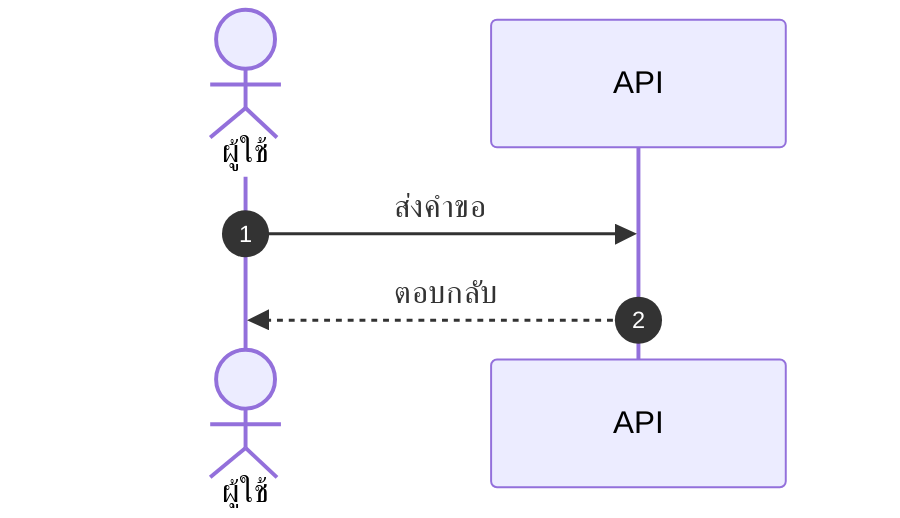

# skill: polished-document-style

Use when a stakeholder Markdown document (BRD, FSD, ADR, status report, audit, postmortem) needs polished formatting for GitHub, Notion or Obsidian.

# Polished Document Style

> **ภาษา:** ถ้อยคำทุกบรรทัดเขียนตาม [`human-writing`](../human-writing/SKILL.md) — skill นี้บอกรูปแบบและโครง ส่วน human-writing บอกวิธีเขียนให้คนอ่านรู้เรื่อง

## When to use this skill

- Output is meant for **non-developers** to read (PMs, executives, clients)
- Document needs **sign-off** or formal review
- Output will be **shared widely** or converted to PDF/Word later
- Any doc with 3+ sections or 500+ words

## When NOT to use

- Internal developer-only specs (keep them concise)
- Quick scratch notes
- Code comments / inline docs

> ℹ️ **Note:** This skill governs the *markdown source*. When the deliverable is a
> rendered **.docx / .pptx / .pdf** that a stakeholder will open, use
> `branded-document-design` on top of it — that skill carries the design tokens,
> the typography scale, Thai typography rules, and the `brandkit.py` builder.

## อ่านเพิ่มเมื่อ

| ไฟล์ | เปิดเมื่อ |
|---|---|
| [references/markdown-patterns.md](references/markdown-patterns.md) | ถ้าจะเขียนส่วนหัว สารบัญ กล่องข้อความ ตาราง ป้ายสถานะ cover block ตารางเทียบตัวเลือก ส่วนเซ็นรับ หรืออภิธานศัพท์ ให้เปิดดูตัวอย่าง markdown แล้วลอกไปใช้ |
| [references/theme-colors.md](references/theme-colors.md) | ถ้าต้องใส่สีจริงลงรูป ไฟล์ .docx หรือสไลด์ ให้เปิดดูว่าใครคุมสีส่วนไหน และค่าสีตั้งต้นประจำบ้านคืออะไร |

## Document Header (Always)

Every polished doc MUST start with ส่วนหัวชุดเดียวกัน คือ H1 ที่มีอิโมจิกำกับ ตามด้วยกล่อง quote ที่บอกเวอร์ชัน วันที่ สถานะ ผู้เขียน ผู้รีวิว และแท็ก แล้วปิดด้วย `---` ตัวอย่างเต็มอยู่ใน [references/markdown-patterns.md](references/markdown-patterns.md)

Status values:
- 🟡 **Draft** — work in progress
- 🔵 **Review** — under stakeholder review
- 🟢 **Approved** — signed off
- ⚪ **Archived** — historical reference

## Section Hierarchy

- **H1** — Document title (exactly one)
- **H2** — Numbered sections (`## 1. Section`)
- **H3** — Sub-sections (`### 1.1 Sub-topic`)
- **H4** — Rare, use only if needed

**Always add Table of Contents** for docs with 5+ sections และต้องกดลิงก์ในสารบัญแล้วไปถึงหัวข้อจริง ตัวอย่างอยู่ใน [references/markdown-patterns.md](references/markdown-patterns.md)

## ธีมของเอกสาร — ตัดสินใจครั้งเดียว ใช้ทุกที่ในเอกสารนั้น

เอกสาร 1 ฉบับผ่านหลาย skill: markdown (skill นี้) · รูปจาก `software-diagrams` ·
ไฟล์ .docx จาก `branded-document-design` · สไลด์จาก `presentation-design`
ถ้าแต่ละตัวเลือกสีเอง ผู้อ่านจะได้เอกสารที่รูปสีหนึ่ง หัวข้อสีหนึ่ง และสไลด์อีกสีหนึ่ง

**markdown เป็นต้นฉบับหลัก (source of truth) จึงประกาศธีมไว้ที่นี่** — ใส่ไว้ท้ายส่วนหัวของเอกสารหรือในไฟล์ข้างกัน:

```markdown
<!-- doc-theme: accent=<สีหลัก> · ที่มา=<แบรนด์ลูกค้า / เสนอจากเนื้องาน> · ยืนยันเมื่อ=YYYY-MM-DD -->
```

**สีหลักมาจากเนื้องาน ไม่ใช่จากค่าเริ่มต้นของเครื่องมือ**
ถ้ามีสีแบรนด์อยู่แล้วให้ใช้สีนั้น ถ้ายังไม่มีให้เสนอโทนที่เข้ากับเนื้องาน แล้วรอผู้ใช้ยืนยัน
(ตารางจับคู่เนื้องานกับโทนสีอยู่ใน [`colour-by-domain`](../diagram-figures/references/colour-by-domain.md))

markdown เองไม่มีสี จึงใช้อิโมจิและน้ำหนักตัวอักษรแทน ส่วนไดอะแกรม รูป ไฟล์ .docx และสไลด์อ่านค่าจาก `doc-theme` ถ้า `doc-theme` ยังไม่ประกาศ accent เฉพาะงาน ให้ใช้ค่าตั้งต้นประจำบ้าน ตารางทั้งสองอยู่ใน [references/theme-colors.md](references/theme-colors.md)

**สีสถานะไม่ขึ้นกับธีม** — 🔴 วิกฤต · 🟢 ผ่าน ต้องคงความหมายเดิมไม่ว่าธีมจะเป็นสีอะไร

## Emoji Vocabulary

ใช้ให้**คงที่ทั้งเอกสาร** และใช้เพื่อ**หาของเจอเร็วขึ้น** ไม่ใช่เพื่อความน่ารัก

| ใช้ทำอะไร | ชุดที่ใช้ |
|---|---|
| ระดับความสำคัญ | 🔴 วิกฤต · 🟠 สูง · 🟡 กลาง · 🟢 ต่ำ |
| สถานะ | ✅ เสร็จ · 🚧 กำลังทำ · ⏳ รอ · ❌ ไม่ผ่าน · ⚠️ ต้องระวัง |
| ชนิดกล่องข้อความ | 💡 ข้อแนะนำ · 📌 ข้อควรจำ · 🚨 อันตราย · 📋 รายการตรวจ |
| หมวดเนื้อหา | 🎯 เป้าหมาย · 🏗️ สถาปัตยกรรม · 🔐 ความปลอดภัย · 📊 ตัวเลข · 🧪 การทดสอบ |

**1 อิโมจิต่อหัวข้อ ไม่ใช่ต่อบรรทัด** — เอกสารที่ทุกบรรทัดมีอิโมจิอ่านยากกว่าเอกสารที่ไม่มีเลย

## Callout Boxes

Use blockquotes with emoji prefix มี 5 ชนิด คือ 💡 **Tip** · ⚠️ **Warning** · 🚨 **Critical** · ℹ️ **Note** · ❓ **Open Question** ตัวอย่างอยู่ใน [references/markdown-patterns.md](references/markdown-patterns.md)

**Rules:**
- Keep callouts to 1-3 sentences
- One callout per topic — don't stack
- Don't overuse — max 3-5 per page

## Tables — When and How

Use tables when items have **2+ attributes** ถ้าเขียนเป็น bullet แล้วแต่ละบรรทัดมีหลายค่าคั่นด้วยจุลภาค ให้เปลี่ยนเป็นตาราง ตัวอย่างเทียบกันอยู่ใน [references/markdown-patterns.md](references/markdown-patterns.md)

- Left-align text, center checkmarks/numbers, right-align money
- Use `—` (em dash) for "not applicable", not `-` or blank
- Keep cells short — long content goes in body paragraphs
- Bold key columns: `**email**`

ถ้าเอกสารต้องเทียบตัวเลือกหรือชั่งข้อดีข้อเสีย (architect, PM, SEO recommendations) ให้ใช้ตารางเทียบที่มีคอลัมน์ Recommendation ส่วนเอกสารที่ต้องอนุมัติให้ปิดท้ายด้วยตาราง Sign-off และเอกสารที่มีศัพท์เทคนิค 5 คำขึ้นไปให้มีอภิธานศัพท์ ตัวอย่างทั้งสามแบบอยู่ใน [references/markdown-patterns.md](references/markdown-patterns.md)

## Mermaid Diagrams

**ตัวเลือกชนิดไดอะแกรม กติกาความอ่านง่าย ธีม และการจัดการป้ายภาษาไทย อยู่ใน `software-diagrams`**
skill นี้คุมเฉพาะเรื่องการวางไดอะแกรมลงในเอกสาร markdown

- วางไว้**หลังย่อหน้าที่อธิบายว่ารูปนี้ตอบคำถามอะไร** ไม่ใช่ลอยขึ้นมาเฉย ๆ
- ทุกรูปมีคำบรรยายใต้รูป 1 บรรทัด ขึ้นต้นด้วย **รูปที่ N —**
- รูปเดียวกันอย่าใส่ซ้ำหลายที่ในเอกสาร ให้อ้างถึงเลขรูปแทน
- รูปที่ต้องส่งให้คนนอกทีมหรือใส่สไลด์ ใช้ `diagram-figures` แล้วฝังเป็นไฟล์ภาพ

## Status Badges and Cover Block

ช่องสำคัญในส่วนหัวหรือในตารางให้ใช้ป้ายสถานะแบบอิโมจิพร้อมคำกำกับ เช่น `**Status:** 🟢 Approved` ส่วนเอกสารทางการ (BRD, FSD, ADR, postmortem) ให้เปิดด้วย cover block ที่บอกชนิดเอกสาร เวอร์ชัน สถานะ วันที่ ผู้เขียน ผู้รีวิว และเอกสารที่เกี่ยวข้อง ตัวอย่างอยู่ใน [references/markdown-patterns.md](references/markdown-patterns.md)

## Lists and Code Blocks

**Rule:** Max 2 levels of nesting. More nesting = use a table.
ตัวอย่างรายการที่ดีและรายการที่ซ้อนเกินอยู่ใน [references/markdown-patterns.md](references/markdown-patterns.md)

Code blocks ต้องระบุภาษาทุกครั้ง (Always specify language) และถ้าโค้ดยาว ให้ใส่ชื่อไฟล์เป็นคอมเมนต์ในบรรทัดแรก ตัวอย่างอยู่ใน [references/markdown-patterns.md](references/markdown-patterns.md)

## Quality Checklist

Before delivering any polished doc:

- [ ] H1 title with emoji marker
- [ ] Cover block with version, date, status, authors
- [ ] TOC if 5+ sections
- [ ] All sections numbered consistently
- [ ] Anchor links in TOC actually work
- [ ] Status badges where applicable
- [ ] Tables used (not bullets) where data has 2+ attributes
- [ ] At least one Mermaid diagram for any flow/relationship
- [ ] Callout boxes for tips/warnings (not just paragraphs)
- [ ] Code blocks have language hints
- [ ] Glossary for docs with 5+ acronyms
- [ ] No placeholder text (TBD, TODO, Lorem ipsum)
- [ ] Tested rendering in GitHub preview

> ไดอะแกรมในเอกสาร: ชนิดไหนตอบคำถามไหน และธีม Mermaid ชุดเดียวกันทั้งโปรเจกต์
> อยู่ใน `software-diagrams` ส่วนเรื่องเอกสาร SRS โดยเฉพาะอยู่ใน `srs-writing`

## Anti-patterns

- ❌ **Emoji spam** — emoji in every heading just for decoration
- ❌ **All emoji, no labels** — `🔴 High` reads better than `🔴` alone
- ❌ **Deep nesting** — bullets 4+ levels deep, use tables instead
- ❌ **Walls of text** — paragraphs longer than 5 lines
- ❌ **Inconsistent terminology** — "user" in one section, "customer" in next
- ❌ **Diagrams that duplicate text** — diagram should add insight, not repeat
- ❌ **Tables of paragraphs** — if cells are >2 sentences, use headings instead
- ❌ **Skipping the cover block** — readers need version/status/date

## ตัวย่อ

เขียนตัวย่อเต็มครั้งแรกเสมอ แล้ววงเล็บตัวย่อไว้ — เช่น Model Context Protocol (MCP)
หลังจากนั้นใช้ตัวย่อได้เลย ดูรายละเอียดใน skill `spell-out-abbreviations`


## reference: markdown-patterns.md

# รูปแบบ markdown พร้อมตัวอย่าง

ตัวอย่างโค้ด markdown ของทุกรูปแบบที่ `SKILL.md` อ้างถึง ให้ลอกไปใช้ได้ทันที ส่วนกฎว่าใช้เมื่อไหร่อยู่ใน `SKILL.md`

## Document Header (Always)

Every polished doc MUST start with:

```markdown
# 📋 <Document Title>

> **Version:** 1.0 · **Date:** YYYY-MM-DD · **Status:** 🟡 Draft
> **Authors:** <names> · **Reviewers:** <names>
> **Tags:** `<area>` `<topic>`

---
```

Status values:
- 🟡 **Draft** — work in progress
- 🔵 **Review** — under stakeholder review
- 🟢 **Approved** — signed off
- ⚪ **Archived** — historical reference

## Table of Contents

**Always add Table of Contents** for docs with 5+ sections:

```markdown
## 📑 Table of Contents

1. [Executive Summary](#1-executive-summary)
2. [Scope](#2-scope)
3. [Details](#3-details)
```

## Callout Boxes

Use blockquotes with emoji prefix:

```markdown
> 💡 **Tip:** Brief actionable insight.

> ⚠️ **Warning:** Important caveat or limitation.

> 🚨 **Critical:** Must-read before proceeding.

> ℹ️ **Note:** Additional context or background.

> ❓ **Open Question:** Needs decision/clarification.
```

## Tables — When and How

### When to use tables instead of bullets

Use tables when items have **2+ attributes**:

❌ Don't use bullets:
```markdown
- email: string, required, unique
- age: number, optional
- role: enum, required, default "user"
```

✅ Use a table:
```markdown
| Field | Type   | Required | Default | Description       |
|-------|--------|:--------:|:-------:|-------------------|
| email | string | ✅       | —       | Unique login email|
| age   | number | ❌       | —       | Optional          |
| role  | enum   | ✅       | `user`  | Access level      |
```

## Mermaid Diagrams

````markdown

````

*รูปที่ 3 — ลำดับการเรียกเมื่อผู้ใช้กดบันทึก*

## Status Badges (Inline)

For key fields in headers/tables:

```markdown
**Status:** 🟢 Approved
**Priority:** 🔴 High
**Risk Level:** 🟡 Medium
**SLA:** ⚡ < 200ms
```

Multiple badges in a header:

```markdown
> 🟢 **Approved** · 🔴 **High Priority** · 👤 @alice · 🗓️ Due 2025-03-15
```

## Cover Block Pattern

For formal documents (BRD, FSD, ADR, postmortem):

```markdown
# 📋 <Title>

| | |
|--|--|
| **Document Type** | BRD \| FSD \| ADR \| Postmortem |
| **Version** | 1.2 |
| **Status** | 🟢 Approved |
| **Date** | 2025-01-15 |
| **Author(s)** | @alice, @bob |
| **Reviewer(s)** | @charlie |
| **Related** | [BRD-001](link), [FSD-005](link) |

---
```

## Comparison / Decision Tables

For trade-off analysis (architect, PM, SEO recommendations):

```markdown
| Option | Cost | Effort | Risk | Time-to-Value | Recommendation |
|--------|:----:|:------:|:----:|:-------------:|:--------------:|
| **A**  | 💰💰 | 🟡 Med | 🟢 Low | 🟢 Fast | ✅ Recommended |
| B      | 💰   | 🟢 Low | 🔴 High | 🟡 Med | ❌ Not recommended |
| C      | 💰💰💰| 🔴 High| 🟢 Low | 🔴 Slow | ⚪ Future consideration |
```

## Lists — When to nest, when to flatten

### ✅ Good list
```markdown
- Email is unique across all users
- Passwords must be 8+ characters with mixed case
- Sessions expire after 30 days of inactivity
```

### ❌ Bad list (over-nested)
```markdown
- Users
  - Email
    - Must be unique
    - Required
  - Password
    - 8+ chars
    - Mixed case
```

→ Should be a table instead.

## Code Blocks

Always specify language:

````markdown
```typescript
const user: User = { id: 1, email: 'a@b.com' };
```

```bash
npm install
```

```sql
SELECT * FROM users WHERE id = $1;
```
````

For long blocks, put the file name in a comment on the first line:

```typescript
// src/services/auth.ts
export async function login(email: string, password: string) {
  // ...
}
```

## Approval/Sign-off Section (End of Doc)

For documents needing formal approval:

```markdown
## ✍️ Sign-off

| Role | Name | Status | Date |
|------|------|:------:|------|
| Product Owner | @alice | 🟢 Approved | 2025-01-15 |
| Tech Lead | @bob | 🔵 Reviewing | — |
| QA Lead | @charlie | ⚪ Not started | — |
| Security | @dave | ❌ Rejected | 2025-01-14 |
```

## Glossary Section

For docs with 5+ technical terms:

```markdown
## 📖 Glossary

| Term | Definition |
|------|------------|
| **API** | Application Programming Interface |
| **JWT** | JSON Web Token, used for stateless auth |
| **SLA** | Service Level Agreement |
```

Define acronyms on first use, then add to glossary.


## reference: theme-colors.md

# ตารางสีของธีมเอกสาร

ไฟล์นี้บอกว่าส่วนไหนของเอกสารใครเป็นคนคุมสี และค่าสีตั้งต้นประจำบ้านคืออะไร ใช้ตอนต้องใส่สีจริงลงรูป ไฟล์ .docx หรือสไลด์

## ใครคุมสีส่วนไหน

| ส่วนของเอกสาร | ใครคุมสี | อ่านค่าจาก |
|---|---|---|
| หัวข้อ ตาราง กล่องข้อความใน markdown | markdown ไม่มีสี ใช้อิโมจิและน้ำหนักตัวอักษรแทน | — |
| ไดอะแกรม Mermaid | `software-diagrams` ข้อ 2 | `doc-theme` |
| รูปที่เป็นไฟล์ภาพ | `diagram-figures` | `doc-theme` |
| ไฟล์ .docx / .pdf ที่ส่งออก | `branded-document-design` ข้อ 0–1 | `doc-theme` |
| สไลด์ | `presentation-design` | `doc-theme` |

## ค่าตั้งต้นประจำบ้าน (house default)

ถ้า `doc-theme` ยังไม่ประกาศ accent เฉพาะงาน ทุก skill ใช้ชุดนี้เป็นค่าตั้งต้น เพื่อให้รูป เอกสาร และสไลด์เป็นชุดสีเดียวกันตั้งแต่แรก ชุดนี้คือชุดเดียวกับ `presentation-design` และ `branded-document-design`:

| token | ค่า | ใช้กับ |
|---|---|---|
| brand | `#2A78D6` | สีหลัก · หัวข้อ · เส้น accent |
| brand-deep | `#2A4C86` | หัวตาราง · H2 · ชื่อระบบ |
| brand-2 | `#6A5CD6` | accent รอง (ม่วง) |
| tint | `#EDF1FB` | พื้นหัวตาราง · พื้นกล่องเน้น |
| ink / body | `#333B4A` / `#414957` | หัวข้อ / เนื้อความ |
| muted / faint | `#7D8492` / `#A9AEB9` | คำบรรยาย / หมายเหตุ |
| line | `#E4E7EE` | เส้นขอบ · เส้นเชื่อม |
| exception | `#C77A11` | ทาง/โซนที่ไม่ใช่เส้นทางหลัก (ต่างจาก brand เสมอ) |
| ฟอนต์ | Tahoma (เอกสาร/สไลด์) · Noto Sans Thai → Tahoma (ภาพ) | ทั้งไทยและอังกฤษ |

เมื่อประกาศ accent เฉพาะงานแล้ว ให้ใช้ค่านั้นแทน brand ส่วนสีอื่นคำนวณจาก accent ตัวนั้น


---

# skill: markdown-visuals

Use when a markdown doc needs a picture (wireframe, UI state, flow, architecture). Picks inline SVG, image, ASCII or Mermaid so it renders everywhere.

# Markdown Visuals

> **ภาษา:** ถ้อยคำทุกบรรทัดเขียนตาม [`human-writing`](../human-writing/SKILL.md) — skill นี้บอกรูปแบบและโครง ส่วน human-writing บอกวิธีเขียนให้คนอ่านรู้เรื่อง

> **Scope:** this skill decides *how a picture goes into a markdown file* (inline SVG · image file · ASCII · Mermaid) and how to embed it. What a diagram should show lives in `software-diagrams` (Mermaid in the house theme) and `diagram-figures` (designed figures). Document formatting around the picture lives in `polished-document-style`.

> **Rule:** Every design, mockup, spec, or architecture doc must show — not just tell. If you wrote "the button sits top-right," you owe the reader a picture.

## When to use this skill

- Producing **any** design mockup, wireframe, or UI spec
- Writing FSD, BRD, ADR, or architecture docs that describe layout, flow, or relationships
- Explaining state transitions, user journeys, or system interactions
- Comparing 2+ visual options for the user
- The user said "make a mockup," "show me how it looks," or "design X"

**If the doc has zero visuals and is about anything visual or structural — stop and add one.**

## Decision tree: which format?

```
What are you showing?
│
├─ UI mockup / component state / icon       →  Inline SVG
├─ Layout sketch / box diagram / state map  →  ASCII art (boxes & arrows)
├─ Flow / sequence / decision tree          →  Mermaid (software-diagrams)
├─ Architecture / ER / class                →  Mermaid (software-diagrams)
├─ Designed figure (proposal, slide, print) →  diagram-figures → embed the PNG as an image file (§2)
├─ Data viz (chart, pie, quadrant)          →  Mermaid pie/quadrant OR inline SVG
├─ Photo, screenshot, complex illustration  →  External file → 
└─ Quick concept in chat reply              →  Inline SVG or ASCII (no external file)
```

**Default to inline SVG**, except for flows and sequences (use Mermaid for those). Inline SVG renders everywhere and versions cleanly in git. It adds no binary files to the repo, and the user can read and edit the markup.

## 1 · Inline SVG (primary technique)

### Boilerplate

```markdown
<p align="center">
<svg xmlns="http://www.w3.org/2000/svg" viewBox="0 0 640 280" role="img" aria-label="<what this shows>">
  <!-- background -->
  <rect width="640" height="280" rx="14" fill="#1c2230"/>

  <!-- content goes here -->
</svg>
</p>
```

**Required attributes:**
- `xmlns="http://www.w3.org/2000/svg"` — without this, GitHub may not render
- `viewBox` — sets the coordinate space; lets the SVG scale responsively
- `role="img"` + `aria-label` — accessibility, screen readers
- `<p align="center">` wrapper — centers in the rendered page

**Sizing:** Use `viewBox` (not width/height) so it scales. Common sizes:
- Mockup of a UI bar: `viewBox="0 0 640 200"` (wide, short)
- Component state: `viewBox="0 0 400 300"` (squarer)
- Icon / chip: `viewBox="0 0 64 64"`
- Full screen layout: `viewBox="0 0 800 500"`

### สี

ถ้าเอกสารหรือโปรเจกต์มีชุดสีอยู่แล้ว ให้ใช้ชุดนั้น ส่วนถ้ายังไม่มี ให้เสนอโทนจาก [`diagram-figures/references/colour-by-domain.md`](../diagram-figures/references/colour-by-domain.md) แล้วรอผู้ใช้ยืนยัน ส่วน token ตามหน้าที่ (`bg-canvas` · `accent-primary` · `state-*` …) ดูได้ใน [references/svg-snippets.md](references/svg-snippets.md) และ **1 เอกสารใช้ชุดสีเดียว**

### Reusable snippets

Window chrome, phone frame, button, card, status badge, running dot and tooltip snippets, plus the UI-state worked example, are in [references/svg-snippets.md](references/svg-snippets.md). Copy the structure and swap in the agreed colour tokens.

## 2 · External image files

Use when:
- Photo or screenshot
- Illustration too complex to author as SVG by hand (50+ shapes)
- Reusing the same image across many docs
- Generated by a design tool (Figma export, etc.)

### Folder convention

```
docs/
  figures/
    01-hover-state.svg
    02-empty-state.png
    architecture-overview.svg
    src/                      editable sources (.mmd · .drawio · .html)
```

- Put figures in `docs/figures/` (editable sources in `docs/figures/src/`) — relative to the doc · brand files (logo, icons) live in the project-root `assets/`, not here
- Name files `<doc-section-number>-<short-slug>.<ext>` so they sort with the doc
- Prefer `.svg` over `.png` when possible (scales, smaller, diff-friendly)

### Reference syntax

```markdown

```

- **Alt text** describes what the image shows, for accessibility — not "screenshot.png"
- Path is **relative to the markdown file**, not absolute
- For centered + sized images, wrap in HTML:

```markdown
<p align="center">
  
</p>
```

### Creating SVG files

When the visual is too big to inline (>50 lines of SVG markup), save it as a file instead. Use the `Write` tool to create the SVG file alongside the doc.

## 3 · ASCII art

For quick layouts, state diagrams, and structural sketches that don't need pixel-perfect visuals. Renders identically in every viewer and in terminal/diff output.

Box-drawing characters plus worked layout sketch, state machine and curve examples are in [references/ascii-patterns.md](references/ascii-patterns.md).

Always wrap ASCII in a fenced code block (` ``` `) so spacing is preserved.

## 4 · Mermaid

**การเลือกชนิดไดอะแกรม ธีม กติกาความอ่านง่าย และป้ายภาษาไทย อยู่ใน `software-diagrams`**
ที่นี่บอกแค่ว่า *เมื่อไหร่ควรเลือก Mermaid แทนรูปแบบอื่น*

| เลือก Mermaid เมื่อ | เลือกอย่างอื่นเมื่อ |
|---|---|
| เป็นกล่องกับลูกศรที่เครื่องจัดวางให้ได้ | ถ้าต้องคุมตำแหน่งเองให้ใช้ inline SVG ส่วนรูปที่ต้องดูออกแบบมาให้ใช้ `diagram-figures` (HTML layout หรือ engine-svg-python) แล้วฝังเป็นไฟล์ภาพ |
| อยู่ในไฟล์ที่ต้อง diff ใน git | เป็นภาพหน้าจอจริง ให้ใช้ไฟล์ภาพ |
| ผู้อ่านเปิดใน GitHub หรือ Notion | ผู้อ่านเปิดในเอกสาร Word หรือสไลด์ ให้ใช้ไฟล์ภาพ |

## Combining formats in one doc

A full design spec usually mixes formats (SVG mockup, reference table, ASCII sketch, Mermaid state diagram, acceptance table). The 6-part pattern is in [references/combining-formats.md](references/combining-formats.md). Don't force everything into one format.

## Accessibility checklist

For every visual:

- [ ] **Inline SVG** has `role="img"` and `aria-label="<description>"`
- [ ] **Image file** has descriptive alt text (not "image.png")
- [ ] **Mermaid** diagrams have a 1-sentence caption above or below
- [ ] **ASCII art** has a prose summary nearby — screen readers will read the characters literally
- [ ] **Colour** is not the only signal — pair red badges with `!`, green dots with a label
- [ ] **Contrast** for text in SVG ≥ 4.5:1 against its background

## Anti-patterns

- ❌ **Text-only design docs** — "the icon is in the top-right" with no picture
- ❌ **Linking to Figma / external design tools as the only source** — visuals must render in the repo
- ❌ **PNG screenshots of text** — use the text, in a code block
- ❌ **SVG without `xmlns`** — GitHub silently fails to render
- ❌ **Inline SVG with 200+ lines** — extract to `assets/x.svg` and reference it
- ❌ **ASCII art outside a code fence** — proportional fonts will mangle alignment
- ❌ **Mixing Mermaid syntax versions** — stick to v10 syntax so GitHub renders it
- ❌ **Generated images checked in without source** — commit the `.svg` source, not just the `.png` export
- ❌ **Decorative emoji as visuals** — emoji ≠ a mockup; pair them with real diagrams

## Quick-start recipe

When the user asks for a design / mockup:

1. **Identify what kinds of visuals are needed** (UI state? flow? architecture?)
2. **Pick the format(s)** using the decision tree above
3. **For each visual:**
   - State a one-line caption
   - Emit the SVG/Mermaid/ASCII
   - Add `role="img"` + `aria-label` (SVG) or alt text (file)
4. **Add a feature reference table** below the visuals — what each element means
5. **Cross-check accessibility checklist** before delivery

Not sure a visual will render? Tell the user to preview it in GitHub or Notion.

## Related skills

- [[polished-document-style]] — overall doc formatting, Mermaid catalogue, callout boxes
- [[simplicity-first]] — don't over-design the diagram; show what's needed
- [[software-diagrams]] — which diagram type answers which question, plus the shared Mermaid theme
- [[diagram-figures]] — designed figures for proposals, slides and print (HTML layouts or engine-svg-python)
- [[ui-craft]] — spacing, hierarchy and states when the picture is a screen

## ตัวย่อ

เขียนตัวย่อเต็มครั้งแรกเสมอ แล้ววงเล็บตัวย่อไว้ — เช่น Model Context Protocol (MCP)
หลังจากนั้นใช้ตัวย่อได้เลย ดูรายละเอียดใน skill `spell-out-abbreviations`


## reference: ascii-patterns.md

# ASCII patterns

Worked ASCII examples for markdown docs · used by [SKILL.md](../SKILL.md) §3 · always wrap ASCII in a fenced code block so spacing is preserved

## Box-drawing characters

```
┌─────┐  ┏━━━━━┓  ╭─────╮  ┌╌╌╌╌╌┐
│     │  ┃     ┃  │     │  ╎     ╎
└─────┘  ┗━━━━━┛  ╰─────╯  └╌╌╌╌╌┘
 light    heavy   rounded   dashed
```

Corners: `┌ ┐ └ ┘` ‧ `┏ ┓ ┗ ┛` ‧ `╭ ╮ ╰ ╯`
Lines:   `─ │` ‧ `━ ┃` ‧ `═ ║`
Joins:   `├ ┤ ┬ ┴ ┼`
Arrows:  `→ ← ↑ ↓ ▲ ▼ ▶ ◀ ↔ ↕ ⇒ ⇐`
Dots:    `• · ◦ ● ○ ▪ ▫`

## Common patterns

**Layout sketch:**
```
┌─────────────────────────────────────┐
│ Header        [Search]      [👤]    │
├──────────┬──────────────────────────┤
│ Sidebar  │ Main content             │
│  • Item  │                          │
│  • Item  │  ┌────────────────────┐  │
│          │  │  Primary CTA       │  │
│          │  └────────────────────┘  │
└──────────┴──────────────────────────┘
```

**State machine:**
```
┌─────────┐  hover  ┌──────────┐  click  ┌─────────┐
│  REST   │────────►│ MAGNIFIED│────────►│ LAUNCH  │
└─────────┘◄────────└──────────┘◄────────└─────────┘
            exit               done
```

**Curve / chart:**
```
scale
 ↑
1.7│         ╱╲
1.4│       ╱    ╲
1.2│     ╱        ╲
1.0│___╱            ╲___
   └──────────┬──────────→ cursor X
         tile.Center
```


## reference: combining-formats.md

# Combining formats in one doc

Used by [SKILL.md](../SKILL.md) · a full design spec usually mixes formats.

Pattern from `DockXI/docs/12-design-mockup.md`:

```
1. Inline SVG mockup of each UI state              ← "what it looks like"
2. Feature reference table                          ← "what it does"
3. ASCII layout sketch with measurements           ← "how it's positioned"
4. Mermaid state diagram                            ← "how it transitions"
5. ASCII / inline-SVG zoom curve                    ← "the math"
6. Acceptance criteria table                        ← "how we verify"
```

Don't force everything into one format. Each format is best at something different.


## reference: svg-snippets.md

# Inline SVG snippets

Reusable building blocks for inline SVG mockups in markdown docs · used by [SKILL.md](../SKILL.md) §1

## สี — มาจากเนื้องาน ไม่ใช่จากตารางสำเร็จรูป

**อย่าเลือกสีเอง** ถ้าเอกสารหรือโปรเจกต์มีชุดสีอยู่แล้ว ให้ใช้ชุดนั้น
ถ้ายังไม่มี ให้เสนอโทนจากเนื้องานแล้วรอผู้ใช้ยืนยัน — การแพทย์เขียว · การเงินน้ำเงินเข้ม ·
อุตสาหกรรมเหลืองอำพัน · ราชการกรมท่า · ซอฟต์แวร์ทั่วไปน้ำเงิน (ตารางเต็มอยู่ใน [`diagram-figures/references/colour-by-domain.md`](../../diagram-figures/references/colour-by-domain.md))

กำหนดเป็น **token ตามหน้าที่** ไว้บนสุดของเอกสาร แล้วใช้ค่าเดียวกันทุกรูปในเอกสารนั้น:

| Token | หน้าที่ | ได้มาจาก |
|---|---|---|
| `bg-canvas` | พื้นหลังของรูป | เฉดเข้มสุด (โหมดมืด) หรืออ่อนสุด (โหมดสว่าง) |
| `bg-surface` | แผ่น พาเนล การ์ด | ต่างจาก canvas พอให้เห็นขอบโดยไม่ต้องตีเส้น |
| `bg-elevated` | ไทล์ที่ลอยขึ้นมาอีกชั้น | |
| `accent-primary` | จุดเน้น สถานะที่กำลังทำงาน | **สีหลักที่ผู้ใช้เลือก** |
| `text-primary` | ข้อความหลัก | contrast ≥ 4.5:1 กับพื้นที่มันวางอยู่ |
| `text-muted` | ข้อความรอง placeholder | `rgba(...,0.55)` ของ `text-primary` |
| `state-success` · `state-warning` · `state-danger` | สถานะ | **ไม่เปลี่ยนตามแบรนด์** — เขียวคือผ่าน แดงคือไม่ผ่านเสมอ |

**1 เอกสารใช้ชุดสีเดียว** — รูป 10 รูปในเอกสารเดียวที่สีไม่ตรงกัน อ่านยากกว่ารูปไม่สวยแต่สีตรงกัน

## Snippets

> ตัวอย่างข้างล่างใช้ชุดสีโหมดมืดชุดหนึ่งเป็นตัวแทนเท่านั้น
> **เปลี่ยนค่าสีให้ตรงกับชุดที่ตกลงไว้ก่อนใช้** โครงสร้างคือสิ่งที่ต้องคัดลอก ไม่ใช่ค่าสี

**Window chrome (desktop app mockup):**
```xml
<rect x="20" y="20" width="600" height="360" rx="10" fill="#2a3245"/>
<circle cx="42" cy="42" r="6" fill="#ff5f57"/>
<circle cx="62" cy="42" r="6" fill="#febc2e"/>
<circle cx="82" cy="42" r="6" fill="#28c940"/>
<text x="320" y="46" text-anchor="middle" fill="#fff" font-family="system-ui" font-size="12">Window title</text>
<line x1="20" y1="64" x2="620" y2="64" stroke="rgba(255,255,255,0.08)"/>
```

**Phone frame (mobile mockup):**
```xml
<rect x="100" y="20" width="200" height="400" rx="28" fill="#0a0d14" stroke="#2a3245" stroke-width="2"/>
<rect x="120" y="50" width="160" height="340" rx="6" fill="#1c2230"/>
<rect x="170" y="28" width="60" height="14" rx="7" fill="#0a0d14"/>
```

**Button:**
```xml
<rect x="40" y="100" width="120" height="40" rx="8" fill="#0078d4"/>
<text x="100" y="125" text-anchor="middle" fill="#fff" font-family="system-ui" font-size="14" font-weight="500">Click me</text>
```

**Card with title and body:**
```xml
<rect x="40" y="40" width="240" height="120" rx="12" fill="#2a3245"/>
<text x="60" y="72" fill="#fff" font-family="system-ui" font-size="14" font-weight="600">Card title</text>
<text x="60" y="96" fill="rgba(255,255,255,0.7)" font-family="system-ui" font-size="12">Supporting body text goes here.</text>
<rect x="60" y="116" width="80" height="28" rx="6" fill="#0078d4"/>
<text x="100" y="134" text-anchor="middle" fill="#fff" font-family="system-ui" font-size="12">Action</text>
```

**Status badge (top-right of tile):**
```xml
<circle cx="<tile-right-x>" cy="<tile-top-y>" r="9" fill="#e24b4a"/>
<text x="<tile-right-x>" y="<tile-top-y + 4>" text-anchor="middle" fill="#fff" font-family="system-ui" font-size="13" font-weight="500">!</text>
```

**Running dot (indicator below tile):**
```xml
<circle cx="<tile-center-x>" cy="<tile-bottom-y + 12>" r="4" fill="#4cc2ff"/>
```

**Tooltip text (no balloon — plain floating text):**
```xml
<text x="<tile-center-x>" y="<tile-top-y - 12>" text-anchor="middle" fill="#fff" font-family="system-ui" font-size="12" font-weight="500">Tooltip label</text>
```

## Worked example — UI state mockup

This is the pattern used in `DockXI/docs/12-design-mockup.md` and should be the default for showing UI feature states.


---

# skill: branded-document-design

Use when a Word, PowerPoint or PDF deliverable must look designed. Token palette, type scale, tested python-docx and python-pptx builders, Thai typography.

# Branded Document Design

> **ภาษา:** ถ้อยคำทุกบรรทัดเขียนตาม [`human-writing`](../human-writing/SKILL.md) — skill นี้บอกรูปแบบและโครง ส่วน human-writing บอกวิธีเขียนให้คนอ่านรู้เรื่อง

> **กฎข้อเดียวของ skill นี้:** เอกสารที่ส่งออกไปต้องดูออกว่าตั้งใจออกแบบ คือมีชุดสี ชุดขนาดตัวอักษร
> และช่องไฟที่เหมือนกันทุกหน้า ไม่ใช่เปิด Word แล้วพิมพ์เลย

## เมื่อไหร่ใช้ skill นี้

- ผลลัพธ์คือ **.docx / .pptx / .pdf** ที่ลูกค้า ผู้บริหาร หรือทีมอื่นจะเปิดดู
- เอกสารต้อง **เซ็นอนุมัติ** หรือแนบไปกับสัญญา/ข้อเสนอ
- เอกสารไทย–อังกฤษปนกัน (ถ้าตั้งฟอนต์ไม่ครบจะพังง่ายมาก)
- ต้องออกเอกสารแบบเดียวกันซ้ำ ๆ และอยากให้ทุกฉบับหน้าตาเหมือนกัน

## เมื่อไหร่ **ไม่** ใช้

- ผลลัพธ์เป็น markdown ในรีโป ให้ใช้ `polished-document-style`
- ต้องแค่ **อ่าน/แกะ** ไฟล์ Office ที่ได้รับมา ให้ใช้ `anthropic-skills:docx` · `xlsx` · `pptx` · `pdf`
- ไดอะแกรมในเอกสาร markdown ให้ใช้ `markdown-visuals`

**ลำดับที่ถูกต้อง:** เขียนเนื้อหาเป็น markdown ก่อน (polished-document-style)
→ ค่อยใช้ skill นี้ render เป็นไฟล์ส่งมอบ และแก้เนื้อหาที่ markdown เสมอ (markdown คือต้นฉบับ)

---

## 0 · สีมาจากเนื้องาน — ถามก่อนเริ่ม

**ถ้า markdown ต้นทางมี `doc-theme` อยู่แล้ว ให้ใช้ค่านั้น อย่าถามซ้ำ อย่าตั้งใหม่**
(ดู `polished-document-style` หัวข้อ "ธีมของเอกสาร")

ถ้ายังไม่มี **ห้ามเลือกสีเอง ห้ามใช้ค่าเริ่มต้นเงียบ ๆ** ให้ถามผู้ใช้ว่าจะใช้สีอะไร
ถ้าผู้ใช้ยังไม่ระบุ ให้เสนอจากเนื้องาน รอยืนยัน แล้ว**เขียนกลับลง `doc-theme`** ในไฟล์ markdown

| เนื้องาน | โทนที่เสนอ | เหตุผล |
|---|---|---|
| การแพทย์ · สุขภาพ | เขียวอมฟ้า · เขียว | ความสะอาด ความปลอดภัย |
| การเงิน · ธนาคาร | น้ำเงินเข้ม · เทาเงิน | ความมั่นคง |
| อุตสาหกรรม · โรงงาน | เหลืองอำพัน · เทาเหล็ก | เครื่องจักร การเตือน |
| การศึกษา | ม่วง · ส้มอ่อน | ความกระตือรือร้น |
| ค้าปลีก · อาหาร | ส้ม · แดงอมชมพู | ความอบอุ่น ความอยาก |
| ราชการ · กฎหมาย | กรมท่า · เลือดหมู | ความเป็นทางการ |
| ซอฟต์แวร์ทั่วไป | น้ำเงิน | ค่ากลางเมื่อไม่มีบริบทอื่น |

ถ้าลูกค้ามีแบรนด์อยู่แล้ว ให้ใช้สีแบรนด์ ตารางนี้ใช้เฉพาะตอนไม่มีอะไรให้ยึด

**สีหลักมีสีเดียว** เฉดอ่อนและเข้มทั้งหมดคำนวณจากสีนั้น ไม่เลือกเพิ่มทีละสี
สีที่ไม่ผูกกับสีหลักมีแค่สีสถานะ (สำเร็จ · เตือน · ผิดพลาด) และต้องคงความหมายเดิมเสมอ

---

## 1 · Design tokens — ห้าม hardcode สีนอกตารางนี้

ตารางนี้กำหนด**หน้าที่**ของแต่ละ token ไม่ได้กำหนดค่าสี
ค่าจริงมาจากข้อ 0 แล้วตั้งครั้งเดียวด้วย `use_brand(...)`

| Token | หน้าที่ | ได้มาจาก |
|-------|---------|----------|
| `brand` | หัวข้อ H1 · ตัวเลข KPI · ลิงก์ · แถบ accent | สีหลักที่ผู้ใช้เลือก |
| `brand_2` | accent รอง · ขีดใต้หัวข้อสไลด์ · ปลายไล่สี | เพื่อนบ้านของสีหลักบนวงล้อสี |
| `brand_deep` | หัวข้อ H2 · ตัวอักษรหัวตาราง | สีหลักผสมดำ ให้ contrast ≥ 7:1 บนพื้นขาว |
| `brand_tint` | พื้นหัวตาราง · การ์ด KPI · พื้นหน้าปก | สีหลักผสมขาวประมาณ 90% |
| `brand_tint_2` | แถวสลับ (zebra) ในตารางยาว | สีหลักผสมขาวประมาณ 96% |
| `text` | หัวข้อ H3 · ข้อความเน้น | เทาเข้มอมโทนเดียวกับสีหลัก |
| `text_body` | เนื้อความทั้งหมด | เทาเข้มอ่อนกว่า `text` 1 ขั้น **ไม่ใช่ดำสนิท เพราะดำสนิทล้าตา** |
| `text_muted` | คำบรรยายรูป · meta · footer | เทากลาง contrast ≥ 4.5:1 |
| `line` | เส้นตาราง เส้นคั่น | เทาอ่อนมาก เห็นได้แต่ไม่แย่งสายตา |

**สีสถานะ 6 ตัว** (แต่ละตัวมีคู่สีพื้นกับสีตัวอักษร): สำเร็จ · ข้อมูล · เตือน · ผิดพลาด · เน้น · เป็นกลาง
สีสถานะ**ไม่เปลี่ยนตามแบรนด์** เพราะเขียวคือผ่าน แดงคือไม่ผ่าน ในทุกเอกสาร
พื้นคือเฉดอ่อนมาก ตัวอักษรคือเฉดเข้มของสีเดียวกัน ให้ contrast ≥ 4.5:1

**ความหมายของแต่ละสี — เลือกสีตามความหมายเสมอ** (เหมือนกันทั้งเอกสารและไดอะแกรม)

| สี | หมายความว่า | ใช้กับ (callout / pill / กล่อง / เส้นในรูป) |
|---|---|---|
| 🔴 แดง | อันตราย · ห้าม · ลบทิ้ง · ผิดพลาด · เลยกำหนด | `critical` · สถานะ "ค้าง/ล้มเหลว" · ขั้นที่ทำลายข้อมูล · เส้นที่พัง |
| 🟠 เหลือง/ส้ม | ระวัง · รอดำเนินการ · ข้อแม้ · ทางที่ไม่ใช่เส้นหลัก | `warning` · สถานะ "กำลังทำ" · โซน/เส้นข้อยกเว้น (`#C77A11`) |
| 🟢 เขียว | สำเร็จ · ผ่าน · ปลอดภัย · เสร็จแล้ว | `success` · สถานะ "เสร็จ" · ผลลัพธ์ที่ยืนยันแล้ว |
| 🔵 น้ำเงิน | ข้อมูล · การกระทำหลัก · เส้นทางปกติ | `tip` · ปุ่มหลัก · กล่อง/เส้นเส้นทางหลัก (brand) |
| 🟣 ม่วง | คำถาม · ทางเลือก · หมายเหตุเสริม | `question` · ของเสริมที่ไม่บังคับ |
| ⚪ เทา | เป็นกลาง · ปิดใช้งาน · ของภายนอก | `note` · ระบบภายนอก · ส่วนที่ปิดอยู่ |

กฎเดียว: **เลือกสีตามความหมาย ไม่ใช่ตามความสวย** อย่าใช้แดงเพราะอยากให้เด่น ใช้แดงเฉพาะเมื่ออันตรายหรือผิดจริง และไดอะแกรมก็ใช้ชุดความหมายเดียวกันนี้ (ดู `software-diagrams` · `diagram-figures` ที่มี `EXCEPT_HUE` ส้มสำหรับทางที่ไม่ผ่านเส้นหลัก)

> **เกณฑ์ที่ต้องผ่านทุกชุดสี:** เนื้อความบนพื้น ≥ 4.5:1 · หัวข้อบนพื้น ≥ 7:1 ·
> พิมพ์ขาวดำแล้วยังแยกลำดับชั้นออก ถ้าไม่ผ่านให้ปรับความเข้ม ไม่เปลี่ยนสี
>
> **ตัวอย่างชุดสีที่เคยใช้จริง** (ไม่ใช่ค่ามาตรฐาน อย่าคัดลอกไปใช้โดยไม่ดูเนื้องาน) → `references/palette-examples.md`

> 💡 **เปลี่ยนแบรนด์ทั้งชุดในบรรทัดเดียว:**
> `use_brand(brand="C1121F", brand_deep="780000", brand_tint="FDECEC")`

### สเกลตัวอักษร (pt)

| ระดับ | Word | Slide | น้ำหนัก · สี |
|-------|------|-------|--------------|
| ชื่อบนปก | 20 | 40 | bold · `brand` (Word) / `brand_deep` (สไลด์) |
| H1 | 16 | 26 | bold · `brand` |
| H2 | 12.5 | — | bold · `brand_deep` |
| H3 | 11.5 | — | bold · `text` |
| เนื้อความ | 11 | 17 | regular · `text_body` |
| ตาราง | 11 | 12.5 | regular · `text_body` |
| คำบรรยาย/footer | 8.5–9 | 10–12 | italic หรือ regular · `text_muted` |

**อย่าเพิ่มขนาดนอกสเกลนี้** เพราะทุกขนาดที่เพิ่มทำให้เอกสารดูไม่สม่ำเสมอ และคนอ่านสังเกตเห็น

---

## 2 · ฟอนต์และภาษาไทย — จุดที่พังบ่อยที่สุด

ใช้ **Tahoma** เป็นค่าเริ่มต้น: มีทุกเครื่อง Windows/Office · วรรณยุกต์ไม่ชนสระ ·
bold อ่านออกชัด · ความสูง x-height ไทยกับอังกฤษใกล้เคียงกัน

> 🚨 **กับดัก complex script:** Word ถือว่าภาษาไทยเป็น *complex script* คนละชุดกับ latin
> ถ้าตั้งแค่ `run.font.size` / `run.font.bold` ตัวอักษรไทยจะ **ไม่เปลี่ยนตาม**
> ต้องตั้ง `w:szCs`, `w:bCs`, `w:iCs` และ `w:rFonts` ให้ครบทั้ง `ascii/hAnsi/cs/eastAsia`
> ฟังก์ชัน `style_run()` ใน `brandkit.py` จัดการให้แล้ว **ห้ามตั้งฟอนต์เองด้วยมือ**

กฎอื่นสำหรับเอกสารไทย:

- ระยะบรรทัด **1.3–1.35** (อังกฤษล้วนใช้ 1.15 ได้ แต่ไทยมีวรรณยุกต์และสระบน–ล่าง ต้องเว้นที่)
- **ห้ามจัดชิดขอบ 2 ด้าน (justify)** กับย่อหน้าไทย เพราะไทยไม่มีช่องว่างระหว่างคำ Word จะยืดคำจนเป็นรู
- LibreOffice ตัดคำไทยไม่เหมือน Word ถ้าจะส่ง PDF ให้ export จาก Word จริง
  หรืออย่างน้อยเปิด PDF ตรวจด้วยตาก่อนส่ง
- สร้าง PDF บน Linux ที่ไม่มี Tahoma ให้ใช้ **Loma** หรือ **Sarabun** แทน
  (ReportLab จัดวรรณยุกต์ไทยผิด ให้ใช้ python-docx→LibreOffice หรือ WeasyPrint แทน)
- เวลา preview บน Linux ตัวอักษรไทยจะดู **เล็กกว่า** latin เพราะฟอนต์แทนที่มี x-height ต่ำกว่า
  ไม่ใช่บั๊กของขนาดฟอนต์ บน Windows ที่มี Tahoma จริงจะสูงเท่ากัน จึงให้ตรวจรอบสุดท้ายจาก Word

---

## 3 · โครงหน้าเอกสาร Word

```
หน้าปก        โลโก้กลาง → ชื่อเอกสาร (brand, bold) → ชื่อระบบ (text, bold)
              → บรรทัดเวอร์ชัน/วันที่ (9pt) → หมายเหตุการแก้ไข (8pt เอียง เทา)
              → ขึ้นหน้าใหม่
สารบัญ        field TOC (ผู้ใช้กด F9 อัปเดต) → ขึ้นหน้าใหม่
เนื้อหา        H1 มีเลขข้อเสมอ ("1. ภาพรวมระบบ") · H2 เป็น "1.1"
              ทุก H1/H2/H3 ตั้ง keep-with-next กันหัวข้อค้างท้ายหน้า
ท้ายเอกสาร    ตารางลงนามอนุมัติ
footer        "หน้า N" กลางหน้า สีเทา 9pt
```

หน้ากระดาษ A4 · ขอบ บน/ล่าง 2.2 ซม. · ซ้าย/ขวา 2.0 ซม. ได้ความกว้างเนื้อหา ≈ **9360 twips**
(ใช้ตัวเลขนี้ตั้งความกว้างคอลัมน์ตารางให้รวมกันพอดี)

---

## 4 · องค์ประกอบที่ใช้ซ้ำ

| องค์ประกอบ | หน้าตา | เมธอด |
|-----------|--------|-------|
| หน้าปก | โลโก้ + ชื่อสีแบรนด์ กลางหน้า | `cover()` |
| ตาราง | หัวพื้น `brand_tint` ตัวอักษร `brand_deep` เส้นเทาบาง หัวซ้ำทุกหน้า | `table()` |
| ตารางสถานะ | คอลัมน์สถานะย้อมสีตามค่า | `pill_table()` |
| แถบตัวเลขสรุป | การ์ดพื้นฟ้าอ่อน ตัวเลขใหญ่สีแบรนด์ + ป้ายเทาเล็ก | `kpi_row()` |
| กล่องข้อความ | พื้นสีอ่อน + แถบสีหนาด้านซ้าย + อีโมจิ 1 ตัว | `callout()` |
| รูปพร้อมคำบรรยาย | รูปกลางหน้า + "รูปที่ N — ..." เอียงเทาใต้รูป | `figure()` |
| บล็อกโค้ด | พื้นเทาอ่อน ฟอนต์ Consolas 9pt | `code()` |
| ตารางเซ็น | บทบาท / ชื่อ / ลายเซ็น / วันที่ | `signoff()` |

**สัดส่วนที่พอดี:** callout ไม่เกิน 3–5 กล่องต่อ 10 หน้า · แถบตัวเลขสรุป (KPI strip) 3–5 ช่อง (ตั้งแต่ 6 ช่อง ตัวเลขจะเล็กจนไม่เด่น) ·
ตารางเกิน 6 คอลัมน์ให้เปลี่ยนเป็นหน้าแนวนอน (`landscape_section()`)

---

## 5 · วิธีใช้ brandkit

```python
import sys; sys.path.insert(0, "scripts")     # หรือ copy brandkit.py มาไว้ข้างงาน
from brandkit import BrandDoc, use_brand, to_pdf

doc = BrandDoc()                                # A4 · Tahoma · โทน Apps Track
doc.cover("เอกสารข้อกำหนดซอฟต์แวร์ (Software Specification)",
          subtitle="ระบบ Apps Track — Project Control & Monitor",
          meta="เวอร์ชันเอกสาร 3.5  •  ปรับปรุง 19 กรกฎาคม 2026",
          logo="asset/AppsTrack_Logo_Badge.png")
doc.toc()

doc.h1("1. ภาพรวมระบบ")
doc.para("eitprojects เป็นระบบบริหารและติดตามโครงการ ...")
doc.kpi_row([("19", "โครงการ"), ("115", "Work items"), ("103", "Open tasks")])
doc.table(["หัวข้อ", "รายละเอียด"],
          [["URL ระบบ", "https://project.eitaccount.cloud"]],
          widths=[2600, 6760])                  # รวม = 9360
doc.callout("warning", "ข้อควรระวัง", "Token ต้องไม่ถูกแสดงกลับใน UI หลังบันทึก")
doc.figure("diagrams/context.png", "ภาพรวมระบบและขอบเขตการใช้งาน", number=1)
doc.pill_table(["รหัส", "งาน", "สถานะ"], rows, status_col=2,
               palette={"เสร็จ": "green", "กำลังทำ": "amber", "ค้าง": "red"})
doc.signoff([("Product Owner", "—"), ("Tech Lead", "—")])
doc.save("SRS.docx")
```

สไลด์ใช้ `brandkit_pptx.py` ซึ่งกินโทเคนชุดเดียวกัน:

```python
from brandkit_pptx import BrandDeck
d = BrandDeck()                                  # 16:9
d.title_slide("Apps Track", "Project Control & Monitor", "19 กรกฎาคม 2026")
d.section("1 · ภาพรวมระบบ", kicker="ส่วนที่ 1")
d.bullets_slide("ขอบเขตงาน", ["...", "..."], subtitle="สรุปจาก SRS v3.5")
d.kpi_slide("ตัวเลขสำคัญ", [("19", "โครงการ"), ("115", "Work items")])
d.table_slide("สถานะ Milestone", headers, rows, col_widths=[1, 4, 2, 2],
              status_col=3, palette={"เสร็จ": "green", "กำลังทำ": "amber"})
d.image_slide("สถาปัตยกรรม", "diagrams/arch.png", caption="ภาพรวมองค์ประกอบ")
d.save("deck.pptx")
```

เมธอดทั้งหมดอยู่ใน `references/api.md` ส่วนไฟล์ตัวอย่างที่รันได้จริงคือ
`scripts/example_srs.py`

---

## 6 · ตรวจงานด้วยตา — ขั้นตอนที่ห้ามข้าม

เอกสารที่ยังไม่มีใครเปิดดูหน้าจริง ถือว่ายังไม่เสร็จ เพราะอาจมีตารางล้นขอบ หัวข้อค้างท้ายหน้า
วรรณยุกต์ลอย ปัญหาเหล่านี้ดูจากโค้ดไม่เห็น

```bash
soffice --headless --convert-to pdf --outdir out SRS.docx
pdftoppm -png -r 80 out/SRS.pdf out/page      # ได้ page-01.png, page-02.png ...
```

แล้ว **เปิดภาพดูจริงทุกหน้า** (Read tool) ก่อนส่งมอบ ตรวจตามนี้:

- [ ] ไม่มีตารางล้นขอบกระดาษ คอลัมน์กว้างพอดี ไม่มีคำถูกบีบขึ้นบรรทัดใหม่แปลก ๆ
- [ ] ไม่มีหัวข้อค้างอยู่บรรทัดสุดท้ายของหน้า
- [ ] วรรณยุกต์/สระไทยไม่ชนกัน และไม่มีตัวอักษรกลายเป็นกล่องสี่เหลี่ยม
- [ ] หน้าปกไม่มีข้อความล้นหรือตกขอบ
- [ ] ช่องไฟก่อน/หลังตารางและ callout เท่ากันทั้งเอกสาร
- [ ] footer เลขหน้าครบทุกหน้า
- [ ] ไม่มี TBD / Lorem ipsum / placeholder หลงเหลือ

---

## 7 · Anti-patterns

- ❌ **ใช้ Heading style ที่มากับ Word** — จะทับสีที่ตั้งไว้ ให้ใช้ `h1()/h2()/h3()`
  ซึ่งตั้ง `outlineLvl` เอง สารบัญ (TOC) จึงยังเห็นหัวข้อ
- ❌ **เส้นตารางดำหนาแบบค่าเริ่มต้น** — เอกสารดูเก่าทันที ใช้เส้นสี `line` หนา 0.5pt
- ❌ **ตัวอักษรสีดำสนิท** — ให้ใช้ `text_body` ซึ่งเป็นเทาเข้ม เนื้อความจะนุ่มขึ้นมาก
- ❌ **หัวตารางตัวหนาแต่ไม่มีพื้นสี** — ตารางข้ามหน้าแล้วคนอ่านไม่รู้ว่าเริ่มตรงไหน
- ❌ **ปล่อยความกว้างคอลัมน์ให้ Word คิดเอง** — ต้อง `fixed_widths()` เสมอ
  ไม่งั้นคอลัมน์รหัสจะกว้างเท่าคอลัมน์รายละเอียด
- ❌ **อีโมจิเยอะเกิน** — 1 ตัวต่อ callout พอ ไม่ใส่ในหัวข้อทุกอัน
- ❌ **ส่งไฟล์โดยไม่เคย render ดู** — ดูข้อ 6
- ❌ **สร้าง .docx โดยไม่เก็บ markdown ต้นฉบับ** — รอบหน้าแก้ไม่ได้

---

## 8 · เชื่อมกับ skill อื่น

| ต้องการ | ใช้คู่กับ |
|---------|-----------|
| โครงเนื้อหา/สำนวนเอกสารทางการ · **ธีมสีของเอกสาร** | `polished-document-style` |
| ไดอะแกรมที่จะเอามาแปะเป็นรูป | `markdown-visuals` → export PNG → `figure()` |
| อ่านไฟล์ Office ที่ลูกค้าส่งมา | `anthropic-skills:docx` · `xlsx` · `pptx` · `pdf` |
| สเปรดชีตส่งมอบ | `anthropic-skills:xlsx` (โทเคนสีชุดเดียวกันใช้ได้) |
| เนื้อหาและความครบถ้วนของเอกสาร SRS | `srs-writing` |
| โครงเรื่องและเลย์เอาต์ของสไลด์ | `presentation-design` |
| ไดอะแกรมที่วาดด้วย Mermaid ธีมเดียวกัน | `software-diagrams` |
| ที่มาของระบบสีและตัวอักษร · โลโก้ | `graphic-design` |

---

## ตัวย่อ

เขียนตัวย่อเต็มครั้งแรกเสมอ แล้ววงเล็บตัวย่อไว้ — เช่น Model Context Protocol (MCP)
หลังจากนั้นใช้ตัวย่อได้ ดูรายละเอียดใน skill `spell-out-abbreviations`


## reference: api.md

# brandkit API — อ้างอิงเมธอด

ทุกเมธอดคืนอ็อบเจกต์ที่สร้าง (paragraph / table / slide) จึงปรับแต่งต่อได้

## สารบัญ

1. [brandkit.py — Word (.docx)](#brandkitpy--word-docx)
2. [brandkit_pptx.py — สไลด์ (.pptx)](#brandkitpptxpy--สไลด์-pptx)
3. [สูตรความกว้างคอลัมน์ (Word)](#สูตรความกว้างคอลัมน์-word)

---

## brandkit.py — Word (.docx)

### สร้างเอกสาร

```python
BrandDoc(path_template=None, page="A4", margins_cm=(2.2, 2.0, 2.2, 2.0),
         footer_text="หน้า")
```

| พารามิเตอร์ | ความหมาย |
|-------------|----------|
| `path_template` | ไฟล์ .docx/.dotx ที่ใช้เป็นแม่แบบ (มี header/logo ขององค์กรอยู่แล้ว) |
| `page` | `"A4"` หรือ `"Letter"` |
| `margins_cm` | (บน, ขวา, ล่าง, ซ้าย) |
| `footer_text` | คำนำหน้าเลขหน้า · `""` = เลขเปล่า |

### บล็อกระดับหน้า

| เมธอด | หมายเหตุ |
|-------|----------|
| `cover(title, subtitle, meta, note, logo, logo_width_cm=2.6, top_space_pt=150, page_break=True)` | โลโก้รับได้ทั้ง .png และ .emf แต่ **.svg ใช้ไม่ได้ใน python-docx** ต้องแปลงเป็น PNG ก่อน (`rsvg-convert -w 600` หรือ `cairosvg`) |
| `toc(heading="สารบัญ", levels="1-3")` | แทรก field TOC แล้วใน Word กด **Ctrl+A แล้ว F9** เพื่อให้รายการขึ้น (ตอนสร้างจะยังว่าง) |
| `page_break()` | |
| `landscape_section()` | เปิดส่วนแนวนอนสำหรับตารางกว้าง |

### หัวข้อและข้อความ

| เมธอด | ผลลัพธ์ |
|-------|---------|
| `h1(text)` `h2(text)` `h3(text)` | 16 / 12.5 / 11.5 pt · bold · brand / brand_deep / text · ตั้ง `outlineLvl` ให้ TOC เห็น |
| `para(text, size, color, bold, italic, align, space_after)` | `align` = `"center"｜"right"｜"justify"` (ไทยอย่าใช้ justify) |
| `rich([(text, opts), ...])` | หลายรูปแบบในย่อหน้าเดียว เช่น `[("สถานะ: ", {"bold": True}), ("อนุมัติ", {"color": "green"})]` |
| `bullets([...], style="List Bullet")` | `style="List Number"` สำหรับเลขลำดับ |
| `code(text)` | บล็อกโค้ดพื้นเทา |

### ตารางและข้อมูล

| เมธอด | หมายเหตุ |
|-------|----------|
| `table(headers, rows, widths=None, zebra=False, align=None, first_col_bold=False)` | `widths` หน่วย twips รวม **9360** สำหรับ A4 ขอบ 2 ซม. · `align` = list ต่อคอลัมน์ |
| `pill_table(headers, rows, status_col, palette, widths)` | `palette = {"เสร็จ": "green", "ค้าง": "red"}` · โทนที่ใช้ได้: green blue amber red violet grey |
| `kpi_row([(value, label), ...])` | 3–5 ช่องพอดี |
| `signoff([(role, name), ...])` | ตารางเซ็นอนุมัติ |

### อื่น ๆ

| เมธอด | หมายเหตุ |
|-------|----------|
| `callout(kind, title, body)` | kind = `tip｜note｜warning｜critical｜success｜question` |
| `figure(image_path, caption, width_cm=15.5, number=None)` | `number=1` จะขึ้นต้นคำบรรยายว่า "รูปที่ 1 — " |
| `save(path)` | |

### ฟังก์ชันระดับโมดูล

| ฟังก์ชัน | ใช้เมื่อ |
|----------|---------|
| `use_brand(**tokens)` | เปลี่ยนชุดสีทั้งชุด ต้องเรียก **ก่อน** สร้าง `BrandDoc` |
| `style_run(run, size, color, bold, italic, mono)` | ตั้งฟอนต์เอง (ครอบคลุม complex-script ให้แล้ว) |
| `shade(cell, token)` · `left_accent(cell, token, size)` | ระบายพื้น / แถบสีซ้ายของเซลล์ |
| `fixed_widths(table, widths)` | บังคับความกว้างคอลัมน์ |
| `set_borders(table)` · `no_borders(table)` | |
| `repeat_header(row)` · `keep_with_next(paragraph)` | |
| `add_field(paragraph, "PAGE")` | แทรก field ของ Word |
| `to_pdf(docx_path, outdir)` | เรียก LibreOffice แปลงเป็น PDF |

---

## brandkit_pptx.py — สไลด์ (.pptx)

```python
BrandDeck(template=None)      # 16:9 (13.333 × 7.5 นิ้ว)
```

| เมธอด | สไลด์ที่ได้ |
|-------|-------------|
| `title_slide(title, subtitle, meta)` | พื้นฟ้าอ่อน + เส้นแบรนด์คั่น |
| `section(title, kicker=None)` | แถบแบรนด์แนวตั้งซ้าย + ชื่อส่วน |
| `bullets_slide(title, items, subtitle=None)` | หัวข้อ + ขีดม่วงใต้หัวข้อ + bullet 17pt |
| `kpi_slide(title, items, subtitle=None)` | การ์ดตัวเลข |
| `table_slide(title, headers, rows, col_widths, subtitle, status_col, palette)` | `col_widths` เป็นสัดส่วน เช่น `[1, 4, 2, 2]` |
| `image_slide(title, image_path, caption, subtitle)` | รูปกลางสไลด์ พอดีกรอบอัตโนมัติ |
| `quote_slide(text, source)` | สไลด์คำพูด/ข้อสรุป |
| `save(path)` | |

**ข้อจำกัดที่ต้องรู้**

- สไลด์ทุกอันสร้างจาก layout ว่าง (`slide_layouts[6]`) จึงไม่มีช่อง placeholder ให้แก้ใน PowerPoint
  แบบเทมเพลตปกติ ถ้าลูกค้าต้องแก้เองเยอะ ให้ส่ง `template=` เป็นไฟล์ .pptx ขององค์กรแทน
- ตารางใน python-pptx ไม่มี API ปิดเส้นขอบตรง ๆ ถ้าอยากได้ตารางไม่มีเส้น ให้เรียงกล่องข้อความแทน
- ความสูงแถวตารางเป็นค่าต่ำสุด ข้อความยาวจะดันแถวสูงขึ้นเอง ให้เผื่อพื้นที่

---

## สูตรความกว้างคอลัมน์ (Word)

| จำนวนคอลัมน์ | ตัวอย่าง widths (รวม 9360) |
|:---:|---|
| 2 | `[2600, 6760]` — หัวข้อ/รายละเอียด |
| 3 | `[1400, 5960, 2000]` — รหัส/รายการ/ผู้รับผิดชอบ |
| 4 | `[1100, 4200, 1900, 2160]` — รหัส/รายการ/ผู้รับผิดชอบ/สถานะ |
| 5 | `[1000, 1800, 2560, 2000, 2000]` |
| 6 ขึ้นไป | ใช้ `landscape_section()` (พื้นที่ ≈ 14700 twips) |


## reference: palette-examples.md

# ตัวอย่างชุดสีที่เคยใช้จริง

> ⚠️ **นี่คือตัวอย่าง ไม่ใช่ค่ามาตรฐาน**
> เลือกสีจากเนื้องานตามข้อ 0 ของ `SKILL.md` ก่อนเสมอ
> ใช้ไฟล์นี้เพื่อดูว่าชุดที่ครบและผ่านเกณฑ์ contrast หน้าตาเป็นอย่างไร ไม่ใช่เพื่อคัดลอก

## ชุด A — น้ำเงิน–ม่วง (ซอฟต์แวร์ทั่วไป · สกัดจาก Apps Track)

โทนสว่าง โปร่ง นุ่มนวล ตัวอักษรเทาเย็น

```python
use_brand(
    brand="2A78D6", brand_2="6A5CD6", brand_deep="2A4C86",
    brand_tint="EDF1FB", brand_tint_2="F6F8FD",
    text="333B4A", text_body="414957", text_muted="7D8492", line="E4E7EE",
)
```

## ชุด B — เขียวอมฟ้า (การแพทย์ · สุขภาพ)

```python
use_brand(
    brand="0E8F86", brand_2="2F9E6E", brand_deep="0B5F5A",
    brand_tint="E6F4F2", brand_tint_2="F3FAF9",
    text="2C3A38", text_body="3A4846", text_muted="76857F", line="E1EAE8",
)
```

## ชุด C — กรมท่า (ราชการ · กฎหมาย)

```python
use_brand(
    brand="1F3C88", brand_2="5B4B8A", brand_deep="14275C",
    brand_tint="E8ECF7", brand_tint_2="F5F7FC",
    text="2B3245", text_body="3A4156", text_muted="767E93", line="E2E6F0",
)
```

## ชุด D — เหลืองอำพัน + เทาเหล็ก (อุตสาหกรรม · โรงงาน)

accent อุ่นบนโครงเทาเย็น — ใช้ accent เฉพาะจุดที่ต้องการให้สังเกต ไม่ใช่ทั้งหน้า

```python
use_brand(
    brand="B57509", brand_2="8C5A2B", brand_deep="7A4E05",
    brand_tint="FBF2E1", brand_tint_2="FDF9F1",
    text="2F3439", text_body="3E444A", text_muted="7B838B", line="E5E8EA",
)
```

## สีสถานะ — ชุดเดียวกันทุกแบรนด์

สีสถานะ**ไม่เปลี่ยนตามแบรนด์** เพราะความหมายของมันคงที่

| สถานะ | พื้น | ตัวอักษร |
|---|---|---|
| สำเร็จ | `E9F7EF` | `17794A` |
| ข้อมูล | `EAF2FD` | `2160AB` |
| เตือน | `FDF5E4` | `96660D` |
| ผิดพลาด | `FDEDEC` | `A63A34` |
| เน้น | `F1EEFC` | `52439F` |
| เป็นกลาง | `F2F4F8` | `626A7A` |

> ถ้าสีแบรนด์ชนกับสีสถานะตัวใดตัวหนึ่ง (เช่น แบรนด์เป็นเขียว) ให้เปลี่ยน**สีแบรนด์ในบริบทนั้น**
> อย่าเปลี่ยนสีสถานะ — ผู้อ่านตีความเขียวว่าผ่านไปแล้วก่อนอ่านข้อความ

## วิธีตรวจก่อนใช้

1. เนื้อความบนพื้น ≥ 4.5:1 · หัวข้อบนพื้น ≥ 7:1
2. พิมพ์ขาวดำแล้วยังแยกหัวข้อกับเนื้อความออก
3. เปิดไฟล์ที่เรนเดอร์แล้วดูด้วยตา ไม่ใช่เชื่อค่าในตาราง
