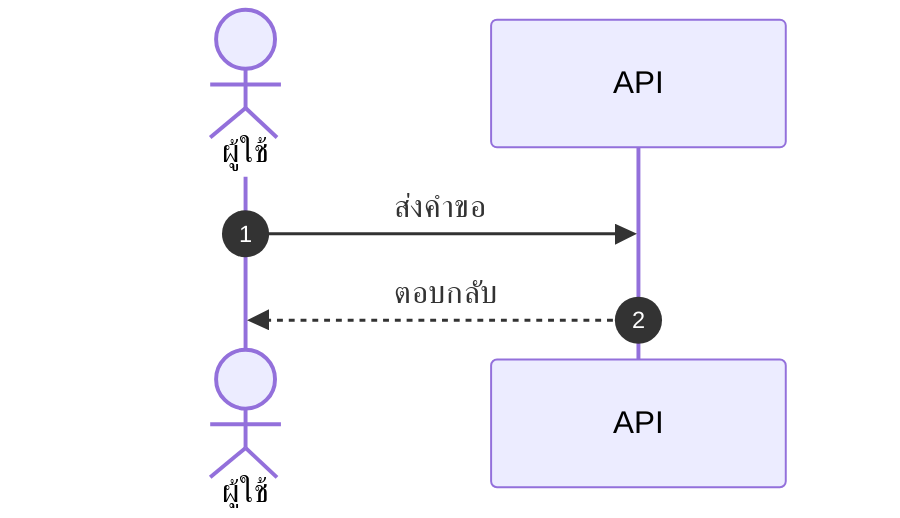

# skill: bug-report-template

Use when reporting a bug, documenting a defect found during testing, or converting a user complaint into a trackable bug report. Ensures all reproducible steps, environment details, and evidence are captured.

# Bug Report Template

## Where bug reports live

One file per bug in `qa/bugs/BUG-<NNN>-<slug>.md` at the project root. Attach screenshots and logs under `qa/bugs/BUG-<NNN>/` — redact personal data first.

## When to use this skill

- Filing a new bug during testing
- Converting user complaints into bug tickets
- Reproducing an issue and documenting findings

## Severity vs Priority

These are **different**:

| | Severity | Priority |
|---|----------|----------|
| What it measures | Technical impact | Business urgency |
| Set by | QA / Engineering | PM / PO |

| Severity | Definition |
|----------|------------|
| **S1 Critical** | System unusable, data loss, no workaround |
| **S2 High** | Major feature broken, workaround exists |
| **S3 Medium** | Feature partially broken |
| **S4 Low** | Cosmetic, minor inconvenience |

| Priority | Definition |
|----------|------------|
| **P1** | Fix immediately, block release |
| **P2** | Fix in current sprint |
| **P3** | Fix in next sprint |
| **P4** | Fix when convenient / backlog |

## Output Template

```markdown
# Bug: <concise, descriptive title>

**ID:** BUG-XXXX
**Severity:** S1 | S2 | S3 | S4
**Priority:** P1 | P2 | P3 | P4
**Reporter:** <name>
**Date:** YYYY-MM-DD
**Affected Component:** <module/feature>
**Affected Version:** <build/release>

## Environment
- OS: ...
- Browser: ... (version)
- Device: Desktop | Mobile | Tablet
- Screen size: ...
- Network: WiFi | Mobile data | VPN
- User role: ...

## Steps to Reproduce
1. Navigate to ...
2. Click ...
3. Enter ...
4. Observe ...

## Expected Result
<what should happen>

## Actual Result
<what actually happens>

## Frequency
Always (100%) | Often (>50%) | Sometimes (<50%) | Rare (<10%)

## Evidence
- Screenshot: [link]
- Video: [link]
- Console errors: \`\`\`<paste>\`\`\`
- Network trace: ...
- Log excerpt: ...

## Impact
- Users affected: All | Specific role | Edge case
- Business impact: ...
- Data integrity: Compromised | At risk | Not affected

## Workaround
<temporary fix users can do, or "None">

## Possible Root Cause (optional)
<if you have a hypothesis>

## Related
- Related bugs: BUG-XXXX
- User story: US-XXX
- Test case: TC-XXX-NNN
```

## Title Writing Guide

❌ Bad titles:
- "Login broken"
- "Bug in checkout"
- "It doesn't work"

✅ Good titles (action + condition + result):
- "Login fails with 500 error when email contains apostrophe"
- "Checkout total shows NaN when quantity is decimal"
- "Search returns no results for queries longer than 100 chars"

**Formula:** `<Action> + <Condition> + <Unexpected result>`

## Steps to Reproduce Rules

- [ ] Start from a known state (logged out, fresh browser, etc.)
- [ ] Each step is one action
- [ ] Anyone can follow without prior knowledge
- [ ] Include exact data used (not "some user")
- [ ] No skipped steps (even "obvious" ones)
- [ ] Numbered sequentially

## Quality Checklist

Before submitting:

- [ ] Title clearly summarizes the issue
- [ ] Severity AND priority both set
- [ ] Steps are reproducible by someone else
- [ ] Expected vs actual is clearly different
- [ ] At least one piece of evidence attached
- [ ] Environment info complete
- [ ] Searched for duplicates first

## Anti-patterns

- ❌ "Same as last week's bug" — describe it fully
- ❌ Multiple bugs in one report — split them
- ❌ "Bug" without steps — provide reproduction
- ❌ Including fix proposal in title — that's for the dev
- ❌ Marking everything as P1 — be honest about priority

---

## Document Look

This skill decides **what goes in** the document. It does not decide **how it looks** —
load the matching skill before writing, not after:

| What is being handed over | Load |
|---|---|
| Markdown someone reads (repo, wiki, issue tracker) | `polished-document-style` |
| A rendered `.docx` / `.pptx` / PDF a stakeholder signs off on | `branded-document-design` |
| The point needs a picture to land | `markdown-visuals`, then `software-diagrams` |

Default formatting is not neutral — it reads as unfinished work.


---

# skill: polished-document-style

Use when producing stakeholder-facing documents (BRD, FSD, ADR, status reports, audits, postmortems) that need polished formatting. Rich Markdown and Mermaid conventions that render well in GitHub, Notion, VS Code and Obsidian.

# Polished Document Style

## When to use this skill

- Output is meant for **non-developers** to read (PMs, executives, clients)
- Document needs **sign-off** or formal review
- Output will be **shared widely** or converted to PDF/Word later
- Any doc with 3+ sections or 500+ words

## When NOT to use

- Internal developer-only specs (keep them concise)
- Quick scratch notes
- Code comments / inline docs

> ℹ️ **Note:** This skill governs the *markdown source*. When the deliverable is a
> rendered **.docx / .pptx / .pdf** that a stakeholder will open, use
> `branded-document-design` on top of it — that skill carries the design tokens,
> the typography scale, Thai typography rules, and the `brandkit.py` builder.

---

## Document Header (Always)

Every polished doc MUST start with:

```markdown
# 📋 <Document Title>

> **Version:** 1.0 · **Date:** YYYY-MM-DD · **Status:** 🟡 Draft
> **Authors:** <names> · **Reviewers:** <names>
> **Tags:** `<area>` `<topic>`

---
```

Status values:
- 🟡 **Draft** — work in progress
- 🔵 **Review** — under stakeholder review
- 🟢 **Approved** — signed off
- ⚪ **Archived** — historical reference

---

## Section Hierarchy

- **H1** — Document title (exactly one)
- **H2** — Numbered sections (`## 1. Section`)
- **H3** — Sub-sections (`### 1.1 Sub-topic`)
- **H4** — Rare, use only if needed

**Always add Table of Contents** for docs with 5+ sections:

```markdown
## 📑 Table of Contents

1. [Executive Summary](#1-executive-summary)
2. [Scope](#2-scope)
3. [Details](#3-details)
```

---

## ธีมของเอกสาร — ตัดสินใจครั้งเดียว ใช้ทุกที่ในเอกสารนั้น

เอกสารหนึ่งฉบับผ่านมือหลาย skill — markdown ตัวนี้ · รูปจาก `software-diagrams` ·
ไฟล์ .docx จาก `branded-document-design` · สไลด์จาก `presentation-design`
ถ้าแต่ละตัวเลือกสีเอง ผู้อ่านจะได้เอกสารที่รูปสีหนึ่ง หัวข้อสีหนึ่ง และสไลด์อีกสีหนึ่ง

**markdown คือ source of truth ธีมจึงประกาศไว้ที่นี่** — ใส่ไว้ท้ายส่วนหัวของเอกสารหรือในไฟล์ข้างกัน:

```markdown
<!-- doc-theme: accent=<สีหลัก> · ที่มา=<แบรนด์ลูกค้า / เสนอจากเนื้องาน> · ยืนยันเมื่อ=YYYY-MM-DD -->
```

**สีหลักมาจากเนื้องาน ไม่ใช่จากค่าเริ่มต้นของเครื่องมือ**
มีสีแบรนด์อยู่แล้วใช้สีนั้น · ยังไม่มีให้เสนอโทนจากเนื้องานแล้วรอผู้ใช้ยืนยัน
(ตารางเนื้องาน → โทน อยู่ใน `svg-diagram-system` ข้อ 0)

| ส่วนของเอกสาร | ใครคุมสี | อ่านค่าจาก |
|---|---|---|
| หัวข้อ ตาราง กล่องข้อความใน markdown | markdown ไม่มีสี ใช้อิโมจิและน้ำหนักตัวอักษรแทน | — |
| ไดอะแกรม Mermaid | `software-diagrams` ข้อ 2 | `doc-theme` |
| รูปที่เป็นไฟล์ภาพ | `svg-diagram-system` · `diagram-figures` | `doc-theme` |
| ไฟล์ .docx / .pdf ที่ส่งออก | `branded-document-design` ข้อ 0–1 | `doc-theme` |
| สไลด์ | `presentation-design` | `doc-theme` |

**สีสถานะไม่นับรวม** — 🔴 วิกฤต 🟢 ผ่าน ต้องคงความหมายเดิมไม่ว่าธีมจะเป็นสีอะไร

### ค่าตั้งต้นประจำบ้าน (house default)

ถ้า `doc-theme` ยังไม่ประกาศ accent เฉพาะงาน ทุก skill ใช้ชุดนี้เป็นค่าตั้งต้น เพื่อให้รูป เอกสาร และสไลด์เป็นชุดสีเดียวกันตั้งแต่แรก ชุดนี้คือชุดเดียวกับ `presentation-design` และ `branded-document-design`:

| token | ค่า | ใช้กับ |
|---|---|---|
| brand | `#2A78D6` | สีหลัก · หัวข้อ · เส้น accent |
| brand-deep | `#2A4C86` | หัวตาราง · H2 · ชื่อระบบ |
| brand-2 | `#6A5CD6` | accent รอง (ม่วง) |
| tint | `#EDF1FB` | พื้นหัวตาราง · พื้นกล่องเน้น |
| ink / body | `#333B4A` / `#414957` | หัวข้อ / เนื้อความ |
| muted / faint | `#7D8492` / `#A9AEB9` | คำบรรยาย / หมายเหตุ |
| line | `#E4E7EE` | เส้นขอบ · เส้นเชื่อม |
| exception | `#C77A11` | ทาง/โซนที่ไม่ใช่เส้นทางหลัก (ต่างจาก brand เสมอ) |
| ฟอนต์ | Tahoma (เอกสาร/สไลด์) · Noto Sans Thai → Tahoma (ภาพ) | ทั้งไทยและอังกฤษ |

ประกาศ accent เฉพาะงานเมื่อไร ให้ค่านั้นทับ brand ส่วนที่เหลือคำนวณจาก accent เดียว

---

## Emoji Vocabulary

ใช้ให้**คงที่ทั้งเอกสาร** และใช้เพื่อ**หาของเจอเร็วขึ้น** ไม่ใช่เพื่อความน่ารัก

| ใช้ทำอะไร | ชุดที่ใช้ |
|---|---|
| ระดับความสำคัญ | 🔴 วิกฤต · 🟠 สูง · 🟡 กลาง · 🟢 ต่ำ |
| สถานะ | ✅ เสร็จ · 🚧 กำลังทำ · ⏳ รอ · ❌ ไม่ผ่าน · ⚠️ ต้องระวัง |
| ชนิดกล่องข้อความ | 💡 ข้อแนะนำ · 📌 ข้อควรจำ · 🚨 อันตราย · 📋 รายการตรวจ |
| หมวดเนื้อหา | 🎯 เป้าหมาย · 🏗️ สถาปัตยกรรม · 🔐 ความปลอดภัย · 📊 ตัวเลข · 🧪 การทดสอบ |

**หนึ่งอิโมจิต่อหัวข้อ ไม่ใช่ต่อบรรทัด** — เอกสารที่ทุกบรรทัดมีอิโมจิอ่านยากกว่าเอกสารที่ไม่มีเลย

---

## Callout Boxes

Use blockquotes with emoji prefix:

```markdown
> 💡 **Tip:** Brief actionable insight.

> ⚠️ **Warning:** Important caveat or limitation.

> 🚨 **Critical:** Must-read before proceeding.

> ℹ️ **Note:** Additional context or background.

> ❓ **Open Question:** Needs decision/clarification.
```

**Rules:**
- Keep callouts to 1-3 sentences
- One callout per topic — don't stack
- Don't overuse — max 3-5 per page

---

## Tables — When and How

### When to use tables instead of bullets

Use tables when items have **2+ attributes**:

❌ Don't use bullets:
```markdown
- email: string, required, unique
- age: number, optional
- role: enum, required, default "user"
```

✅ Use a table:
```markdown
| Field | Type   | Required | Default | Description       |
|-------|--------|:--------:|:-------:|-------------------|
| email | string | ✅       | —       | Unique login email|
| age   | number | ❌       | —       | Optional          |
| role  | enum   | ✅       | `user`  | Access level      |
```

### Table formatting tips

- Left-align text, center checkmarks/numbers, right-align money
- Use `—` (em dash) for "not applicable", not `-` or blank
- Keep cells short — long content goes in body paragraphs
- Bold key columns: `**email**`

---

## Mermaid Diagrams

**ตัวเลือกชนิดไดอะแกรม กติกาความอ่านง่าย ธีม และการจัดการป้ายภาษาไทย อยู่ใน `software-diagrams`**
skill นี้คุมเฉพาะเรื่องการวางไดอะแกรมลงในเอกสาร markdown

- วางไว้**หลังย่อหน้าที่อธิบายว่ารูปนี้ตอบคำถามอะไร** ไม่ใช่ลอยขึ้นมาเฉย ๆ
- ทุกรูปมีคำบรรยายใต้รูปหนึ่งบรรทัด ขึ้นต้นด้วย **รูปที่ N —**
- รูปเดียวกันอย่าใส่ซ้ำหลายที่ในเอกสาร ให้อ้างถึงเลขรูปแทน
- รูปที่ต้องส่งให้คนนอกทีมหรือใส่สไลด์ ใช้ `svg-diagram-system` แล้วฝังเป็นไฟล์ภาพ

````markdown

````

*รูปที่ 3 — ลำดับการเรียกเมื่อผู้ใช้กดบันทึก*

---

## Status Badges (Inline)

For key fields in headers/tables:

```markdown
**Status:** 🟢 Approved
**Priority:** 🔴 High
**Risk Level:** 🟡 Medium
**SLA:** ⚡ < 200ms
```

Multiple badges in a header:

```markdown
> 🟢 **Approved** · 🔴 **High Priority** · 👤 @alice · 🗓️ Due 2025-03-15
```

---

## Cover Block Pattern

For formal documents (BRD, FSD, ADR, postmortem):

```markdown
# 📋 <Title>

| | |
|--|--|
| **Document Type** | BRD \| FSD \| ADR \| Postmortem |
| **Version** | 1.2 |
| **Status** | 🟢 Approved |
| **Date** | 2025-01-15 |
| **Author(s)** | @alice, @bob |
| **Reviewer(s)** | @charlie |
| **Related** | [BRD-001](link), [FSD-005](link) |

---
```

---

## Comparison / Decision Tables

For trade-off analysis (architect, PM, SEO recommendations):

```markdown
| Option | Cost | Effort | Risk | Time-to-Value | Recommendation |
|--------|:----:|:------:|:----:|:-------------:|:--------------:|
| **A**  | 💰💰 | 🟡 Med | 🟢 Low | 🟢 Fast | ✅ Recommended |
| B      | 💰   | 🟢 Low | 🔴 High | 🟡 Med | ❌ Not recommended |
| C      | 💰💰💰| 🔴 High| 🟢 Low | 🔴 Slow | ⚪ Future consideration |
```

---

## Lists — When to nest, when to flatten

### ✅ Good list
```markdown
- Email is unique across all users
- Passwords must be 8+ characters with mixed case
- Sessions expire after 30 days of inactivity
```

### ❌ Bad list (over-nested)
```markdown
- Users
  - Email
    - Must be unique
    - Required
  - Password
    - 8+ chars
    - Mixed case
```

→ Should be a table instead.

**Rule:** Max 2 levels of nesting. More nesting = use a table.

---

## Code Blocks

Always specify language:

````markdown
```typescript
const user: User = { id: 1, email: 'a@b.com' };
```

```bash
npm install
```

```sql
SELECT * FROM users WHERE id = $1;
```
````

For long blocks, add file name as comment on first line:

```typescript
// src/services/auth.ts
export async function login(email: string, password: string) {
  // ...
}
```

---

## Approval/Sign-off Section (End of Doc)

For documents needing formal approval:

```markdown
## ✍️ Sign-off

| Role | Name | Status | Date |
|------|------|:------:|------|
| Product Owner | @alice | 🟢 Approved | 2025-01-15 |
| Tech Lead | @bob | 🔵 Reviewing | — |
| QA Lead | @charlie | ⚪ Not started | — |
| Security | @dave | ❌ Rejected | 2025-01-14 |
```

---

## Glossary Section

For docs with 5+ technical terms:

```markdown
## 📖 Glossary

| Term | Definition |
|------|------------|
| **API** | Application Programming Interface |
| **JWT** | JSON Web Token, used for stateless auth |
| **SLA** | Service Level Agreement |
```

Define acronyms on first use, then add to glossary.

---

## Quality Checklist

Before delivering any polished doc:

- [ ] H1 title with emoji marker
- [ ] Cover block with version, date, status, authors
- [ ] TOC if 5+ sections
- [ ] All sections numbered consistently
- [ ] Anchor links in TOC actually work
- [ ] Status badges where applicable
- [ ] Tables used (not bullets) where data has 2+ attributes
- [ ] At least one Mermaid diagram for any flow/relationship
- [ ] Callout boxes for tips/warnings (not just paragraphs)
- [ ] Code blocks have language hints
- [ ] Glossary for docs with 5+ acronyms
- [ ] No placeholder text (TBD, TODO, Lorem ipsum)
- [ ] Tested rendering in GitHub preview

---

> ไดอะแกรมในเอกสาร: ชนิดไหนตอบคำถามไหน และธีม Mermaid ชุดเดียวกันทั้งโปรเจกต์
> อยู่ใน `software-diagrams` · เอกสาร SRS โดยเฉพาะอยู่ใน `srs-writing`

## Anti-patterns


- ❌ **Emoji spam** — emoji in every heading just for decoration
- ❌ **All emoji, no labels** — `🔴 High` reads better than `🔴` alone
- ❌ **Deep nesting** — bullets 4+ levels deep, use tables instead
- ❌ **Walls of text** — paragraphs longer than 5 lines
- ❌ **Inconsistent terminology** — "user" in one section, "customer" in next
- ❌ **Diagrams that duplicate text** — diagram should add insight, not repeat
- ❌ **Tables of paragraphs** — if cells are >2 sentences, use headings instead
- ❌ **Skipping the cover block** — readers need version/status/date

---

## ตัวย่อ

เขียนตัวย่อเต็มครั้งแรกเสมอ แล้ววงเล็บตัวย่อไว้ — เช่น Model Context Protocol (MCP)
หลังจากนั้นใช้ตัวย่อได้ · รายละเอียดใน skill `spell-out-abbreviations`


---

# skill: markdown-visuals

Use when a markdown document needs a picture (wireframe, UI state, architecture, flow, data viz). Picks inline SVG, image, ASCII or Mermaid and embeds it so it renders in GitHub, Notion, VS Code and Obsidian.

# Markdown Visuals

> **Rule:** Every design, mockup, spec, or architecture doc must show — not just tell. If you wrote "the button sits top-right," you owe the reader a picture.

## When to use this skill

- Producing **any** design mockup, wireframe, or UI spec
- Writing FSD, BRD, ADR, or architecture docs that describe layout, flow, or relationships
- Explaining state transitions, user journeys, or system interactions
- Comparing 2+ visual options for the user
- The user said "make a mockup," "show me how it looks," or "design X"

**If the doc has zero visuals and is about anything visual or structural — stop and add one.**

---

## Decision tree: which format?

```
What are you showing?
│
├─ UI mockup / component state / icon       →  Inline SVG
├─ Layout sketch / box diagram / state map  →  ASCII art (boxes & arrows)
├─ Flow / sequence / decision tree          →  Mermaid (see polished-document-style)
├─ Architecture / ER / class                →  Mermaid
├─ Data viz (chart, pie, quadrant)          →  Mermaid pie/quadrant OR inline SVG
├─ Photo, screenshot, complex illustration  →  External file → 
└─ Quick concept in chat reply              →  Inline SVG or ASCII (no external file)
```

**Default to inline SVG** for anything that isn't a flow/sequence (use Mermaid for those). It renders everywhere, versions in git, doesn't bloat the repo with binaries, and the user can read/edit the markup.

---

## 1 · Inline SVG (primary technique)

### Boilerplate

```markdown
<p align="center">
<svg xmlns="http://www.w3.org/2000/svg" viewBox="0 0 640 280" role="img" aria-label="<what this shows>">
  <!-- background -->
  <rect width="640" height="280" rx="14" fill="#1c2230"/>

  <!-- content goes here -->
</svg>
</p>
```

**Required attributes:**
- `xmlns="http://www.w3.org/2000/svg"` — without this, GitHub may not render
- `viewBox` — sets the coordinate space; lets the SVG scale responsively
- `role="img"` + `aria-label` — accessibility, screen readers
- `<p align="center">` wrapper — centers in the rendered page

**Sizing:** Use `viewBox` (not width/height) so it scales. Common sizes:
- Mockup of a UI bar: `viewBox="0 0 640 200"` (wide, short)
- Component state: `viewBox="0 0 400 300"` (squarer)
- Icon / chip: `viewBox="0 0 64 64"`
- Full screen layout: `viewBox="0 0 800 500"`

### สี — มาจากเนื้องาน ไม่ใช่จากตารางสำเร็จรูป

**อย่าเลือกสีเอง** ถ้าเอกสารหรือโปรเจกต์มีชุดสีอยู่แล้ว ใช้ชุดนั้น
ถ้ายังไม่มี ให้เสนอโทนจากเนื้องานแล้วรอผู้ใช้ยืนยัน — การแพทย์เขียว · การเงินน้ำเงินเข้ม ·
อุตสาหกรรมเหลืองอำพัน · ราชการกรมท่า · ซอฟต์แวร์ทั่วไปน้ำเงิน (ตารางเต็มอยู่ใน `svg-diagram-system` ข้อ 0)

กำหนดเป็น **token ตามหน้าที่** ไว้บนสุดของเอกสาร แล้วใช้ค่าเดียวกันทุกรูปในเอกสารนั้น:

| Token | หน้าที่ | ได้มาจาก |
|---|---|---|
| `bg-canvas` | พื้นหลังของรูป | เฉดเข้มสุด (โหมดมืด) หรืออ่อนสุด (โหมดสว่าง) |
| `bg-surface` | แผ่น พาเนล การ์ด | ต่างจาก canvas พอให้เห็นขอบโดยไม่ต้องตีเส้น |
| `bg-elevated` | ไทล์ที่ลอยขึ้นมาอีกชั้น | |
| `accent-primary` | จุดเน้น สถานะที่กำลังทำงาน | **สีหลักที่ผู้ใช้เลือก** |
| `text-primary` | ข้อความหลัก | contrast ≥ 4.5:1 กับพื้นที่มันวางอยู่ |
| `text-muted` | ข้อความรอง placeholder | `rgba(...,0.55)` ของ `text-primary` |
| `state-success` · `state-warning` · `state-danger` | สถานะ | **ไม่เปลี่ยนตามแบรนด์** — เขียวคือผ่าน แดงคือไม่ผ่านเสมอ |

**หนึ่งเอกสารใช้หนึ่งชุด** — รูปสิบรูปในเอกสารเดียวที่สีไม่ตรงกัน อ่านยากกว่ารูปที่ไม่สวยแต่สีตรงกัน

### Reusable SVG snippets

> ตัวอย่างข้างล่างใช้ชุดสีโหมดมืดชุดหนึ่งเป็นตัวแทนเท่านั้น
> **เปลี่ยนค่าสีให้ตรงกับชุดที่ตกลงไว้ก่อนใช้** โครงสร้างคือสิ่งที่ต้องคัดลอก ไม่ใช่ค่าสี

**Window chrome (desktop app mockup):**
```xml
<rect x="20" y="20" width="600" height="360" rx="10" fill="#2a3245"/>
<circle cx="42" cy="42" r="6" fill="#ff5f57"/>
<circle cx="62" cy="42" r="6" fill="#febc2e"/>
<circle cx="82" cy="42" r="6" fill="#28c940"/>
<text x="320" y="46" text-anchor="middle" fill="#fff" font-family="system-ui" font-size="12">Window title</text>
<line x1="20" y1="64" x2="620" y2="64" stroke="rgba(255,255,255,0.08)"/>
```

**Phone frame (mobile mockup):**
```xml
<rect x="100" y="20" width="200" height="400" rx="28" fill="#0a0d14" stroke="#2a3245" stroke-width="2"/>
<rect x="120" y="50" width="160" height="340" rx="6" fill="#1c2230"/>
<rect x="170" y="28" width="60" height="14" rx="7" fill="#0a0d14"/>
```

**Button:**
```xml
<rect x="40" y="100" width="120" height="40" rx="8" fill="#0078d4"/>
<text x="100" y="125" text-anchor="middle" fill="#fff" font-family="system-ui" font-size="14" font-weight="500">Click me</text>
```

**Card with title and body:**
```xml
<rect x="40" y="40" width="240" height="120" rx="12" fill="#2a3245"/>
<text x="60" y="72" fill="#fff" font-family="system-ui" font-size="14" font-weight="600">Card title</text>
<text x="60" y="96" fill="rgba(255,255,255,0.7)" font-family="system-ui" font-size="12">Supporting body text goes here.</text>
<rect x="60" y="116" width="80" height="28" rx="6" fill="#0078d4"/>
<text x="100" y="134" text-anchor="middle" fill="#fff" font-family="system-ui" font-size="12">Action</text>
```

**Status badge (top-right of tile):**
```xml
<circle cx="<tile-right-x>" cy="<tile-top-y>" r="9" fill="#e24b4a"/>
<text x="<tile-right-x>" y="<tile-top-y + 4>" text-anchor="middle" fill="#fff" font-family="system-ui" font-size="13" font-weight="500">!</text>
```

**Running dot (indicator below tile):**
```xml
<circle cx="<tile-center-x>" cy="<tile-bottom-y + 12>" r="4" fill="#4cc2ff"/>
```

**Tooltip text (no balloon — plain floating text):**
```xml
<text x="<tile-center-x>" y="<tile-top-y - 12>" text-anchor="middle" fill="#fff" font-family="system-ui" font-size="12" font-weight="500">Tooltip label</text>
```

### Worked example — UI state mockup

This is the pattern used in `DockXI/docs/12-design-mockup.md` and should be the default for showing UI feature states:

```markdown
## 2 · External image files

Use when:
- Photo or screenshot
- Illustration too complex to author as SVG by hand (50+ shapes)
- Reusing the same image across many docs
- Generated by a design tool (Figma export, etc.)

### Folder convention

```
docs/
  figures/
    01-hover-state.svg
    02-empty-state.png
    architecture-overview.svg
    src/                      editable sources (.mmd · .drawio · .html)
```

- Put figures in `docs/figures/` (editable sources in `docs/figures/src/`) — relative to the doc · brand files (logo, icons) live in the project-root `assets/`, not here
- Name files `<doc-section-number>-<short-slug>.<ext>` so they sort with the doc
- Prefer `.svg` over `.png` when possible (scales, smaller, diff-friendly)

### Reference syntax

```markdown

```

- **Alt text** describes what the image shows, for accessibility — not "screenshot.png"
- Path is **relative to the markdown file**, not absolute
- For centered + sized images, wrap in HTML:

```markdown
<p align="center">
  
</p>
```

### Creating SVG files

When the visual is too big to inline (>50 lines of SVG markup), save it as a file instead. Use the `Write` tool to create the SVG file alongside the doc.

---

## 3 · ASCII art

For quick layouts, state diagrams, and structural sketches that don't need pixel-perfect visuals. Renders identically in every viewer and in terminal/diff output.

### Box-drawing characters

```
┌─────┐  ┏━━━━━┓  ╭─────╮  ┌╌╌╌╌╌┐
│     │  ┃     ┃  │     │  ╎     ╎
└─────┘  ┗━━━━━┛  ╰─────╯  └╌╌╌╌╌┘
 light    heavy   rounded   dashed
```

Corners: `┌ ┐ └ ┘` ‧ `┏ ┓ ┗ ┛` ‧ `╭ ╮ ╰ ╯`
Lines:   `─ │` ‧ `━ ┃` ‧ `═ ║`
Joins:   `├ ┤ ┬ ┴ ┼`
Arrows:  `→ ← ↑ ↓ ▲ ▼ ▶ ◀ ↔ ↕ ⇒ ⇐`
Dots:    `• · ◦ ● ○ ▪ ▫`

### Common patterns

**Layout sketch:**
```
┌─────────────────────────────────────┐
│ Header        [Search]      [👤]    │
├──────────┬──────────────────────────┤
│ Sidebar  │ Main content             │
│  • Item  │                          │
│  • Item  │  ┌────────────────────┐  │
│          │  │  Primary CTA       │  │
│          │  └────────────────────┘  │
└──────────┴──────────────────────────┘
```

**State machine:**
```
┌─────────┐  hover  ┌──────────┐  click  ┌─────────┐
│  REST   │────────►│ MAGNIFIED│────────►│ LAUNCH  │
└─────────┘◄────────└──────────┘◄────────└─────────┘
            exit               done
```

**Curve / chart:**
```
scale
 ↑
1.7│         ╱╲
1.4│       ╱    ╲
1.2│     ╱        ╲
1.0│___╱            ╲___
   └──────────┬──────────→ cursor X
         tile.Center
```

Always wrap ASCII in a fenced code block (` ``` `) so spacing is preserved.

---

## 4 · Mermaid

**การเลือกชนิดไดอะแกรม ธีม กติกาความอ่านง่าย และป้ายภาษาไทย อยู่ใน `software-diagrams`**
ที่นี่บอกแค่ว่า *เมื่อไหร่ควรเลือก Mermaid แทนรูปแบบอื่น*

| เลือก Mermaid เมื่อ | เลือกอย่างอื่นเมื่อ |
|---|---|
| เป็นกล่องกับลูกศรที่เครื่องจัดวางให้ได้ | ต้องคุมตำแหน่งเอง → SVG หรือ `svg-diagram-system` |
| อยู่ในไฟล์ที่ต้อง diff ใน git | เป็นภาพหน้าจอจริง → ไฟล์ภาพ |
| ผู้อ่านเปิดใน GitHub หรือ Notion | ผู้อ่านเปิดในเอกสาร Word หรือสไลด์ → ไฟล์ภาพ |

---

## Combining formats in one doc

A full design spec usually mixes formats. Pattern from `DockXI/docs/12-design-mockup.md`:

```
1. Inline SVG mockup of each UI state              ← "what it looks like"
2. Feature reference table                          ← "what it does"
3. ASCII layout sketch with measurements           ← "how it's positioned"
4. Mermaid state diagram                            ← "how it transitions"
5. ASCII / inline-SVG zoom curve                    ← "the math"
6. Acceptance criteria table                        ← "how we verify"
```

Don't pick one format and force everything into it — each format has a sweet spot.

---

## Accessibility checklist

For every visual:

- [ ] **Inline SVG** has `role="img"` and `aria-label="<description>"`
- [ ] **Image file** has descriptive alt text (not "image.png")
- [ ] **Mermaid** diagrams have a 1-sentence caption above or below
- [ ] **ASCII art** has a prose summary nearby — screen readers will read the characters literally
- [ ] **Colour** is not the only signal — pair red badges with `!`, green dots with a label
- [ ] **Contrast** for text in SVG ≥ 4.5:1 against its background

---

## Anti-patterns

- ❌ **Text-only design docs** — "the icon is in the top-right" with no picture
- ❌ **Linking to Figma / external design tools as the only source** — visuals must render in the repo
- ❌ **PNG screenshots of text** — use the text, in a code block
- ❌ **SVG without `xmlns`** — GitHub silently fails to render
- ❌ **Inline SVG with 200+ lines** — extract to `assets/x.svg` and reference it
- ❌ **ASCII art outside a code fence** — proportional fonts will mangle alignment
- ❌ **Mixing Mermaid syntax versions** — stick to v10 syntax for GitHub compat
- ❌ **Generated images checked in without source** — commit the `.svg` source, not just the `.png` export
- ❌ **Decorative emoji as visuals** — emoji ≠ a mockup; pair them with real diagrams

---

## Quick-start recipe

When the user asks for a design / mockup:

1. **Identify what kinds of visuals are needed** (UI state? flow? architecture?)
2. **Pick the format(s)** using the decision tree above
3. **For each visual:**
   - State a one-line caption
   - Emit the SVG/Mermaid/ASCII
   - Add `role="img"` + `aria-label` (SVG) or alt text (file)
4. **Add a feature reference table** below the visuals — what each element means
5. **Cross-check accessibility checklist** before delivery

If unsure whether a visual will render, mention that the user should preview in GitHub/Notion to confirm.

---

## Related skills

- [[polished-document-style]] — overall doc formatting, Mermaid catalogue, callout boxes
- [[simplicity-first]] — don't over-design the diagram; show what's needed
- [[software-diagrams]] — which diagram type answers which question, plus the shared Mermaid theme
- [[ui-craft]] — spacing, hierarchy and states when the picture is a screen

---

## ตัวย่อ

เขียนตัวย่อเต็มครั้งแรกเสมอ แล้ววงเล็บตัวย่อไว้ — เช่น Model Context Protocol (MCP)
หลังจากนั้นใช้ตัวย่อได้ · รายละเอียดใน skill `spell-out-abbreviations`


---

# skill: testing-standards

Use when adding, reviewing or setting up automated tests in .NET, Node, Python, Angular or Flutter, or when a test suite is slow or flaky. Uses the project's existing framework and sets what to test, naming and honest coverage.

# Testing Standards

> **กฎข้อเดียว:** test ที่ไม่มีใครเชื่อถือ แย่กว่าไม่มี test
> test ที่แดงสลับเขียวเองจะถูก `skip` ภายในสองสัปดาห์ แล้วทั้งชุดจะตายตามกันไป

## เมื่อไหร่ใช้ skill นี้

- เริ่มวาง test ในโปรเจกต์ใหม่ หรือเพิ่ม test ให้โค้ดที่มีอยู่
- มีคนขอ "ให้มี unit test / automate test"
- ชุด test เดิมช้า แดง ๆ เขียว ๆ หรือไม่มีใครดูแล้ว

## เมื่อไหร่ **ไม่** ใช้

- E2E ผ่านเบราว์เซอร์ (Playwright/Cypress) → `e2e-testing-patterns`
- ขับแอปมือถือจริงบน emulator → `app-verifier-setup` (`references/android-native.md`)
- ออกแบบ test case เชิงธุรกิจก่อนลงมือเขียน → `test-case-template`

---

## 1 · ขั้นแรก: ใช้ของที่มี ถามเฉพาะตอนต้องเพิ่มตัวใหม่

- **โปรเจกต์มี framework อยู่แล้ว หรือสแต็กมี test library มากับ SDK** (Flutter `flutter_test` · Angular CLI) → ใช้เลย ไม่ต้องถาม
- **ต้องลงแพ็กเกจ test ตัวใหม่** → ใส่คำถามนี้ในการถามครั้งเดียวก่อนเริ่มงาน (ถ้าเครื่องมือมีหน้าต่างให้เลือกคำตอบ เช่น `AskUserQuestion` ให้ใช้ตัวนั้น) — เพราะการเลือกผิดแล้วย้ายทีหลังแพงมาก
- เริ่มงานไปแล้วเพิ่งรู้ว่าต้องเลือก → เลือกตัว**แนะนำ**ในตาราง ทำต่อ แล้วบันทึกไว้ในหัวข้อ "ตัดสินใจเอง" ของรายงาน ไม่หยุดถามกลางทาง

สองเรื่องที่ต้องตกลง:

**ข้อ 1 — framework**

| สแต็ก | ตัวเลือกที่ควรเสนอ |
|---|---|
| .NET | **xUnit** (แนะนำ · เป็นมาตรฐานของ .NET ยุคใหม่) · NUnit (ทีมมาจาก NUnit เดิม) · MSTest (องค์กรที่ผูกกับ VS) |
| Node/TS | **Vitest** (แนะนำ · เร็ว ตั้งค่าน้อย ใช้ ESM/TS ได้เลย) · Jest (ระบบนิเวศใหญ่ที่สุด) · `node:test` (ไม่อยากลงอะไรเลย) |
| Python | **pytest** (แนะนำ) · `unittest` (stdlib ล้วน ห้ามลงแพ็กเกจเพิ่ม) |
| Angular | **Vitest + Testing Library** (แนะนำสำหรับโปรเจกต์ใหม่) · Jasmine + Karma (ค่าเริ่มต้นเดิมของ Angular) |
| Flutter · Dart | **`flutter_test`** (มากับ SDK ไม่ต้องถาม) · fake ด้วยคลาสที่ `implements` ของจริง ก่อนจะลง `mocktail` |

**ข้อ 2 — ขอบเขตที่ต้องการตอนนี้**

- unit อย่างเดียว (เร็ว ไม่แตะ DB/network)
- unit + integration (แตะ DB จริงผ่าน Testcontainers / SQLite in-memory)
- ครบชุดรวม E2E (ต่อยอดไป `e2e-testing-patterns`)

> ถ้าโปรเจกต์**มี framework อยู่แล้ว** ไม่ต้องถาม — ใช้ของเดิม การมีสองระบบในโปรเจกต์เดียว
> แย่กว่าการใช้ของที่ไม่ถูกใจนัก

---

## 2 · พีระมิด — สัดส่วนที่ยั่งยืน

```
        ▲  E2E  5%      ช้า เปราะ แพง — เอาไว้ทดสอบ "เส้นทางที่ทำเงิน" เท่านั้น
       ╱ ╲
      ╱   ╲ Integration 20%   ต่อ DB/API จริง ทดสอบว่าชิ้นส่วนคุยกันรู้เรื่อง
     ╱     ╲
    ╱       ╲ Unit 75%        ไม่แตะอะไรข้างนอก รันจบใน < 100ms ต่อตัว
   ╱_________╲
```

**แอปมือถือมีชั้น widget test (Flutter) หรือ component test (React Native)** อยู่ระหว่าง unit กับ E2E — สร้างหน้าจอจริงในหน่วยความจำ กดและอ่านได้โดยไม่ต้องมี emulator · เป็นชั้นกลางหลักของแอปมือถือแทน integration ที่ต่อ DB ซึ่งแอปส่วนใหญ่ไม่มี

**ชุด unit ทั้งหมดต้องรันจบใน 10 วินาที** (Flutter: นับหลังคอมไพล์เสร็จ — การเริ่ม `flutter test` เองก็กินหลายวินาที (รอยืนยันตัวเลขบนเครื่องจริง)) ถ้าเกินนี้คนจะเลิกรันก่อน commit
แล้ว test จะกลายเป็นด่านที่ CI เท่านั้นที่เจอ — ซึ่งช้าเกินไป

---

## 3 · อะไรควรมี test / อะไรไม่ต้อง

**ต้องมี**
- ตรรกะทางธุรกิจ: การคำนวณ, เงื่อนไขสิทธิ์, การเปลี่ยนสถานะ
- ทุกกรณีขอบ: ค่าว่าง, ศูนย์, ติดลบ, ขอบเขตล่าง/บน, ค่าซ้ำ
- **ทุกบั๊กที่เคยเกิด** — เขียน test ที่แดงก่อน แล้วค่อยแก้ (regression test)
- สัญญาที่คนอื่นพึ่งพา: รูปแบบ response ของ API, schema ของ event

**ไม่ต้องมี**
- getter/setter, DTO, mapping ตรง ๆ
- โค้ดของเฟรมเวิร์ก (ไม่ต้อง test ว่า EF Core บันทึกได้ไหม)
- ไลบรารีของคนอื่น
- UI ที่แค่แสดงผลโดยไม่มีตรรกะ

> **Coverage ที่ซื่อสัตย์: 70–80% ของ business logic** ไม่ใช่ 100% ของทั้งโปรเจกต์
> ไล่ตาม 100% จะได้ test ปลอม ๆ ที่เขียนเพื่อให้ตัวเลขสวยเต็มไปหมด
> ตั้ง gate ที่ "ห้ามลดลงจากเดิม" มีประโยชน์กว่าตั้งเลขเป้า

---

## 4 · เขียนยังไง

**ตั้งชื่อ** — อ่านชื่อแล้วต้องรู้ว่าพังอะไรโดยไม่ต้องเปิดโค้ด

```
MethodName_Scenario_ExpectedResult

CalculateDiscount_WhenMemberIsGold_Returns15Percent
CreateOrder_WhenStockIsZero_ThrowsOutOfStock
ParseDate_WhenInputIsEmpty_ReturnsNull
```

ภาษาที่ชื่อ test เป็นข้อความ (Dart · Vitest · Jest) ใช้ `group('<สิ่งที่ทดสอบ>')` + `test('<สถานการณ์> → <ผลที่ต้องได้>')` เป็นประโยค เช่น `group('verdict')` · `test('below 50 lux is too dark for reading')`

**โครง AAA** — เว้นบรรทัดคั่นสามส่วนให้เห็นชัด

```
// Arrange   เตรียมข้อมูลและ dependency
// Act       เรียกสิ่งที่ทดสอบ — บรรทัดเดียว
// Assert    ตรวจผล
```

**หนึ่ง test = หนึ่งเหตุผลที่จะพัง** ถ้ามี assert 5 อันที่ไม่เกี่ยวกัน ให้แยกเป็น 5 test

**ห้ามมี logic ใน test** — ไม่มี `if`, ไม่มีลูปที่คำนวณค่าคาดหวัง
ถ้าอยากรันหลายเคส ใช้ parameterized test (`[Theory]` / `test.each` / `@pytest.mark.parametrize`)

**ทำให้ผลเหมือนเดิมทุกครั้ง**
- เวลา: inject `IClock`/`now()` ไม่เรียก `DateTime.Now` ตรง ๆ ในโค้ดที่ทดสอบ
- สุ่ม: fix seed
- ลำดับ: test ต้องรันสลับลำดับได้ ห้ามพึ่งสถานะที่ test ก่อนหน้าทิ้งไว้
- **ห้าม `sleep`** เพื่อรอ async — ใช้ fake timer หรือรอ signal จริง

**Mock เท่าที่จำเป็น** — mock ขอบเขตนอกระบบ (HTTP, คิว, เวลา, ไฟล์)
ไม่ mock คลาสของตัวเองที่คำนวณล้วน ๆ mock เยอะเกินไปแปลว่า test ผูกกับวิธีเขียน
พอ refactor ทีเดียวแดงทั้งชุดทั้งที่พฤติกรรมไม่เปลี่ยน

---

## 5 · Integration test

- ใช้ **DB จริงชนิดเดียวกับ production** (Testcontainers) ไม่ใช่ SQLite แทน PostgreSQL
  เพราะ SQL ที่ผ่านบน SQLite อาจพังบนของจริง
- แต่ละ test เริ่มจากสถานะที่รู้แน่ — transaction rollback หรือ truncate ทุกครั้ง
- แยก command ออกจาก unit เพื่อให้รันแยกกันได้ (`npm run test:unit` / `test:integration`)
- ทดสอบ **สัญญา** ของ API: status code, รูปร่าง JSON, header สำคัญ — ไม่ใช่แค่ "ไม่ error"

---

## 6 · CI

```
push / PR → lint → unit (< 10 วินาที) → integration → build
```

- **test แดง = merge ไม่ได้** ไม่มีข้อยกเว้น
- ห้ามมี `skip`/`ignore` ค้างในสาขาหลัก — ถ้าจะ skip ต้องมีลิงก์ issue กำกับ
- test ที่ flaky ให้ **แก้หรือลบ** ห้าม retry จนกว่าจะเขียว นั่นคือการซ่อนบั๊ก
- รายงาน coverage ในหน้า PR ให้เห็นว่าเพิ่มหรือลด

รายละเอียดคำสั่งและไฟล์ config ของแต่ละ framework อยู่ใน `references/per-stack.md`

---

## 7 · ตรวจงาน

- [ ] ใช้ framework ของเดิมหรือที่มากับสแต็ก · ถ้าลงตัวใหม่ ถามแล้วหรือบันทึกใน "ตัดสินใจเอง"
- [ ] `npm test` / `dotnet test` / `pytest` / `flutter test` รันผ่านจากเครื่องเปล่าโดยไม่ต้องตั้งค่าอะไรเพิ่ม
- [ ] ชุด unit รันจบใน 10 วินาที
- [ ] ลองสลับลำดับ test แล้วยังเขียวหมด (`pytest -p no:randomly --lf` / `--shuffle`)
- [ ] รันซ้ำ 3 รอบได้ผลเหมือนเดิม (ไม่ flaky)
- [ ] แก้โค้ดให้พังโดยตั้งใจ 1 จุด แล้ว test **ต้องแดง** — ถ้ายังเขียว แปลว่า test ไม่ได้ทดสอบอะไร
- [ ] ชื่อ test อ่านแล้วรู้ว่าพังอะไรโดยไม่ต้องเปิดโค้ด
- [ ] ไม่มี `sleep` / `Thread.Sleep` ในชุด test
- [ ] ไม่มี test ที่ถูก skip ค้างโดยไม่มีเหตุผลกำกับ

---

## 8 · Anti-patterns

- ❌ **เขียน test หลังจบงานเพื่อให้ผ่าน gate** — ได้ test ที่ยืนยันว่าโค้ดทำสิ่งที่มันทำ
  ไม่ใช่สิ่งที่มันควรทำ
- ❌ **assert ว่า "ไม่ throw"** เฉย ๆ — ไม่ได้ทดสอบอะไรเลย
- ❌ **test ที่พึ่ง test ก่อนหน้า** — พอรันเดี่ยว ๆ แดงทันที
- ❌ **mock ทุกอย่างจน test ทดสอบแค่ mock**
- ❌ **`sleep(1000)` รอ async** — ช้าและยังเปราะอยู่ดี
- ❌ **retry flaky test จนเขียว** — คุณเพิ่งซ่อนบั๊กที่เกิดจริงใน production
- ❌ **ไล่ coverage 100%** — เขียน test ให้ getter เพื่อตัวเลข
- ❌ **ข้อมูลทดสอบเป็นข้อมูลลูกค้าจริง** — ผิดกฎหมายและหลุดง่าย ใช้ตัวสร้างข้อมูลปลอม

---

## 9 · เชื่อมกับ skill อื่น

| ต้องการ | ใช้คู่กับ |
|---|---|
| E2E ผ่านเบราว์เซอร์ | `e2e-testing-patterns` |
| E2E แอปมือถือ (`integration_test` · `adb`) | `app-verifier-setup` |
| ออกแบบ test case ก่อนเขียนโค้ด | `test-case-template` |
| ทดสอบ endpoint health/ping | `web-service-essentials` |
| log ที่ช่วยไล่ปัญหาตอน test แดง | `logging-standards` |
| review โค้ด test | `code-review-checklist` |


## reference: per-stack.md

# ตั้งค่าและตัวอย่างต่อสแต็ก

> ตัวอย่างในไฟล์นี้ **ยังไม่ได้รันทดสอบ** (ยกเว้นหัวข้อ Flutter ซึ่งมาจากแอปจริง Lumio) เป็นการตั้งค่ามาตรฐานของแต่ละ framework
> ให้รันครั้งแรกแล้วดูว่าคำสั่งและ path ตรงกับโครงโปรเจกต์จริงหรือไม่

---

## สารบัญ

1. [.NET — xUnit](#net--xunit)
2. [Node / TypeScript — Vitest](#node--typescript--vitest)
3. [Python — pytest](#python--pytest)
4. [Angular](#angular)
5. [Flutter / Dart — flutter_test](#flutter--dart--flutter_test)
6. [ตารางเทียบ](#ตารางเทียบ)

---

## .NET — xUnit

```bash
dotnet new xunit -o tests/MyApp.Tests
dotnet add tests/MyApp.Tests reference src/MyApp
dotnet add tests/MyApp.Tests package FluentAssertions      # assert ที่อ่านเป็นประโยค
dotnet add tests/MyApp.Tests package NSubstitute           # mock ที่ syntax สั้นกว่า Moq
dotnet add tests/MyApp.Tests package Microsoft.AspNetCore.Mvc.Testing   # integration
dotnet add tests/MyApp.Tests package Testcontainers.PostgreSql
```

```csharp
public class DiscountCalculatorTests
{
    [Fact]
    public void CalculateDiscount_WhenMemberIsGold_Returns15Percent()
    {
        // Arrange
        var sut = new DiscountCalculator();

        // Act
        var result = sut.Calculate(new Order { Total = 1000m }, MemberTier.Gold);

        // Assert
        result.Should().Be(150m);
    }

    // Theory = ทดสอบหลายเคสด้วยโค้ดชุดเดียว — ห้ามเขียนลูปเอง
    [Theory]
    [InlineData(MemberTier.None, 0)]
    [InlineData(MemberTier.Silver, 50)]
    [InlineData(MemberTier.Gold, 150)]
    public void CalculateDiscount_ByTier_ReturnsExpected(MemberTier tier, decimal expected)
        => new DiscountCalculator().Calculate(new Order { Total = 1000m }, tier)
               .Should().Be(expected);
}
```

Integration ผ่าน `WebApplicationFactory` — ยิง HTTP จริงเข้า pipeline จริงโดยไม่ต้องเปิดพอร์ต:

```csharp
public class OrdersApiTests(WebApplicationFactory<Program> factory)
    : IClassFixture<WebApplicationFactory<Program>>
{
    [Fact]
    public async Task GetOrders_WhenNotAuthenticated_Returns401()
    {
        var res = await factory.CreateClient().GetAsync("/api/v1/orders");
        res.StatusCode.Should().Be(HttpStatusCode.Unauthorized);
    }
}
```

```bash
dotnet test                                        # ทั้งหมด
dotnet test --filter "FullyQualifiedName!~Integration"   # เฉพาะ unit
dotnet test --collect:"XPlat Code Coverage"
```

---

## Node / TypeScript — Vitest

```bash
npm i -D vitest @vitest/coverage-v8
```

`vitest.config.ts`:

```ts
import { defineConfig } from 'vitest/config';

export default defineConfig({
  test: {
    globals: true,
    environment: 'node',
    include: ['src/**/*.test.ts'],
    // ไฟล์ setup ใช้ตั้ง fake timer / ล้าง mock ให้ทุกไฟล์เหมือนกัน
    setupFiles: ['./test/setup.ts'],
    coverage: {
      provider: 'v8',
      include: ['src/**/*.ts'],
      exclude: ['src/**/*.dto.ts', 'src/**/index.ts'],
      thresholds: { lines: 70, functions: 70, branches: 60 },
    },
  },
});
```

```ts
import { describe, it, expect, vi, beforeEach } from 'vitest';
import { DiscountCalculator } from '../src/discount';

describe('DiscountCalculator', () => {
  beforeEach(() => vi.restoreAllMocks());   // กันสถานะรั่วข้าม test

  it('calculateDiscount_whenMemberIsGold_returns15Percent', () => {
    const sut = new DiscountCalculator();
    expect(sut.calculate({ total: 1000 }, 'gold')).toBe(150);
  });

  it.each([
    ['none', 0], ['silver', 50], ['gold', 150],
  ])('calculateDiscount_byTier_%s', (tier, expected) => {
    expect(new DiscountCalculator().calculate({ total: 1000 }, tier)).toBe(expected);
  });
});
```

คุมเวลาแทนการ `sleep`:

```ts
vi.useFakeTimers();
vi.setSystemTime(new Date('2026-01-15T10:00:00+07:00'));
await vi.advanceTimersByTimeAsync(5000);   // เดินเวลา 5 วิ ทันที
vi.useRealTimers();
```

```json
{ "scripts": {
    "test": "vitest run",
    "test:watch": "vitest",
    "test:cov": "vitest run --coverage",
    "test:integration": "vitest run --config vitest.integration.config.ts"
} }
```

> **Jest แทน Vitest:** API เกือบเหมือนกัน (`jest.fn` ↔ `vi.fn`) แต่ต้องตั้ง `ts-jest`
> หรือ babel เพิ่มสำหรับ TypeScript · เลือก Jest เมื่อทีมคุ้นอยู่แล้วหรือมี preset ที่ต้องใช้

---

## Python — pytest

```bash
pip install pytest pytest-cov pytest-randomly
```

`pyproject.toml`:

```toml
[tool.pytest.ini_options]
testpaths = ["tests"]
addopts = "-q --strict-markers --cov=src --cov-report=term-missing"
markers = ["integration: ต้องมี DB/network — รันแยกจาก unit"]
```

```python
import pytest
from src.discount import calculate_discount

def test_calculate_discount_when_member_is_gold_returns_15_percent():
    assert calculate_discount(total=1000, tier="gold") == 150

@pytest.mark.parametrize("tier,expected", [("none", 0), ("silver", 50), ("gold", 150)])
def test_calculate_discount_by_tier(tier, expected):
    assert calculate_discount(total=1000, tier=tier) == expected

@pytest.mark.integration
def test_create_order_persists_to_db(db_session):
    ...
```

`conftest.py` — fixture ที่ใช้ร่วมกัน (คืนสถานะเดิมทุก test):

```python
import pytest

@pytest.fixture
def db_session(engine):
    conn = engine.connect()
    tx = conn.begin()
    yield Session(bind=conn)
    tx.rollback()          # ทุก test เริ่มจากฐานสะอาดเสมอ
    conn.close()
```

```bash
pytest                        # ทั้งหมด (pytest-randomly สลับลำดับให้เอง = จับ test ที่พึ่งกัน)
pytest -m "not integration"   # เฉพาะ unit
pytest --lf                   # เฉพาะที่แดงรอบก่อน
```

---

## Angular

**Vitest + Testing Library** (โปรเจกต์ใหม่ — เร็วกว่า Karma มาก ไม่ต้องเปิดเบราว์เซอร์จริง)

```bash
npm i -D vitest @analogjs/vite-plugin-angular jsdom \
         @testing-library/angular @testing-library/user-event
```

```ts
import { render, screen } from '@testing-library/angular';
import userEvent from '@testing-library/user-event';
import { OrderFormComponent } from './order-form.component';

it('orderForm_whenSubmitWithEmptyName_showsRequiredError', async () => {
  await render(OrderFormComponent);

  await userEvent.click(screen.getByRole('button', { name: /บันทึก/ }));

  expect(await screen.findByText(/กรุณากรอกชื่อ/)).toBeTruthy();
});
```

> ทดสอบจาก**มุมผู้ใช้** — หาปุ่มด้วยข้อความที่คนเห็น (`getByRole`, `getByText`)
> ไม่ใช่ `By.css('.btn-primary')` เพราะพอเปลี่ยนคลาส CSS test จะแดงทั้งที่ UI ยังทำงานถูก

**Jasmine + Karma** (ค่าเริ่มต้นเดิมของ Angular — ใช้ต่อได้ถ้าโปรเจกต์มีอยู่แล้ว):

```ts
describe('DiscountService', () => {
  let service: DiscountService;
  beforeEach(() => {
    TestBed.configureTestingModule({ providers: [DiscountService] });
    service = TestBed.inject(DiscountService);
  });

  it('calculate_whenMemberIsGold_returns15Percent', () => {
    expect(service.calculate(1000, 'gold')).toBe(150);
  });
});
```

```bash
ng test --watch=false --browsers=ChromeHeadless --code-coverage    # สำหรับ CI
```

---

## Flutter / Dart — flutter_test

มากับ SDK ไม่ต้องลงอะไร · ไฟล์อยู่ใน `test/` ล้อโครง `lib/` (`lib/features/measure/lux_math.dart` → `test/features/measure/lux_math_test.dart`) · ชื่อไฟล์ snake_case ตามธรรมเนียม Dart

```dart
// fake ของสะพานไปฝั่ง native: implements คลาสจริงได้เลย ไม่ต้องสร้าง interface ใหม่
class FakeDeviceLight implements DeviceLight {
  final _lux = StreamController<double>.broadcast();
  void emitSensor(double lux) => _lux.add(lux);
  @override
  Stream<double> sensorLux() => _lux.stream;
  // ...override ที่เหลือคืนค่าที่ test เลือก (มี sensor ไหม · สิทธิ์กล้อง)
}

void main() {
  group('measure screen', () {
    testWidgets('shows live lux and verdict', (tester) async {
      // จอทดสอบเริ่มต้น 800×600 — ตั้งเป็นขนาดมือถือ ไม่งั้นปุ่มอยู่นอกจอแล้วกดพลาด
      tester.view.physicalSize = const Size(1080, 2400);
      tester.view.devicePixelRatio = 2.75;
      addTearDown(tester.view.reset);

      final device = FakeDeviceLight();
      final meter = MeterController(device);
      await tester.pumpWidget(App(meter: meter));
      device.emitSensor(420);
      await tester.pump(MeterController.tick);   // ไม่ใช้ pumpAndSettle เมื่อมี Timer วนอยู่

      expect(find.textContaining('420 lux'), findsOneWidget);
      meter.dispose();   // ปิด Timer ในตัว test เอง ไม่งั้นล้มด้วย "A Timer is still pending"
    });
  });
}
```

| เรื่อง | ทำอย่างนี้ |
|---|---|
| ชั้น test | unit (`test`) สำหรับตรรกะล้วน · widget (`testWidgets`) สำหรับหน้าจอ — เป็นชั้นกลางหลัก · E2E บนเครื่อง: `integration_test` (`flutter test integration_test/`) หรือสคริปต์ `adb` ตาม `app-verifier-setup` |
| platform channel | fake ด้วยคลาสที่ `implements` คลาสสะพานของจริง · ลง `mocktail` เมื่อ fake ด้วยมือเริ่มยาวเท่านั้น |
| `pumpAndSettle` | ใช้ได้เมื่อหน้าจอหยุดนิ่งจริง · มี Timer หรือ animation วนตลอด → ไม่มีวันนิ่ง (หมดเวลา) ใช้ `pump(duration)` |
| Timer ค้าง | dispose controller ที่ถือ Timer ในตัว test เอง ก่อนบรรทัดสุดท้าย — Timer ที่ยังวิ่งอยู่ตอนจบทำให้ test ล้ม |
| จอเล็ก | test แยกหนึ่งชุดที่ 360×800 dp ภาษาไทย + `textScaler` ใหญ่ เพื่อจับข้อความล้น (Flutter ฟ้อง overflow เป็น exception ใน test) |
| SnackBar บังปุ่ม | widget test จับได้ — กดปุ่มล่างหลัง SnackBar ขึ้นแล้ว assert **ผลของการกด** (`tester.tap` ที่โดนของบังแค่พิมพ์คำเตือน ไม่ทำให้ล้ม) |
| golden test | ไม่บังคับ · ภาพต่างกันตามเครื่องและฟอนต์ ใช้เมื่อทีมมีเครื่อง CI ตายตัว |
| coverage | `flutter test --coverage` → `coverage/lcov.info` |
| พิสูจน์ว่า test ใช้ได้ | แก้โค้ดให้ผิดหนึ่งจุด รันแล้วต้องแดง แล้วคืนค่า |

```bash
flutter test                              # ทั้งหมด
flutter test test/features/measure        # โฟลเดอร์เดียว
flutter test --coverage
flutter test integration_test/            # ต้องมี emulator หรือเครื่องจริงต่ออยู่
```

---

## ตารางเทียบ

| เรื่อง | xUnit | Vitest | pytest | Angular (Vitest) | flutter_test |
|---|---|---|---|---|---|
| หลายเคส | `[Theory]` + `[InlineData]` | `it.each` | `@pytest.mark.parametrize` | `it.each` | วน `for` สร้าง `test(...)` ใน `group` |
| mock | NSubstitute `Substitute.For<T>()` | `vi.fn()` / `vi.mock()` | `unittest.mock` / `mocker` | `vi.fn()` + `providers` | คลาส `implements` · `mocktail` |
| ก่อน/หลังแต่ละ test | constructor / `IDisposable` | `beforeEach` / `afterEach` | fixture | `beforeEach` | `setUp` / `tearDown` / `addTearDown` |
| คุมเวลา | inject `TimeProvider` | `vi.useFakeTimers()` | `freezegun` | `vi.useFakeTimers()` | `tester.pump(duration)` · `fakeAsync` |
| DB จริง | Testcontainers | Testcontainers | Testcontainers / `pytest-postgresql` | — | — (`SharedPreferences.setMockInitialValues`) |
| coverage | `--collect:"XPlat Code Coverage"` | `--coverage` | `--cov` | `--coverage` | `--coverage` |
| สลับลำดับ | ไม่มีในตัว | `--sequence.shuffle` | `pytest-randomly` | `--sequence.shuffle` | `--test-randomize-ordering-seed random` |
