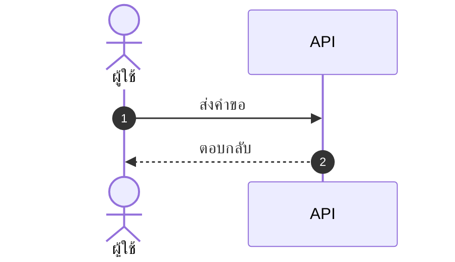

# skill: polished-document-style

Use when a stakeholder Markdown document (BRD, FSD, ADR, status report, audit, postmortem) needs polished formatting for GitHub, Notion or Obsidian.

# Polished Document Style

> **ภาษา:** ถ้อยคำทุกบรรทัดเขียนตาม [`human-writing`](../human-writing/SKILL.md) — skill นี้บอกรูปแบบและโครง ส่วน human-writing บอกวิธีเขียนให้คนอ่านรู้เรื่อง

## When to use this skill

- Output is meant for **non-developers** to read (PMs, executives, clients)
- Document needs **sign-off** or formal review
- Output will be **shared widely** or converted to PDF/Word later
- Any doc with 3+ sections or 500+ words

## When NOT to use

- Internal developer-only specs (keep them concise)
- Quick scratch notes
- Code comments / inline docs

> ℹ️ **Note:** This skill governs the *markdown source*. When the deliverable is a
> rendered **.docx / .pptx / .pdf** that a stakeholder will open, use
> `branded-document-design` on top of it — that skill carries the design tokens,
> the typography scale, Thai typography rules, and the `brandkit.py` builder.

## อ่านเพิ่มเมื่อ

| ไฟล์ | เปิดเมื่อ |
|---|---|
| [references/markdown-patterns.md](references/markdown-patterns.md) | ถ้าจะเขียนส่วนหัว สารบัญ กล่องข้อความ ตาราง ป้ายสถานะ cover block ตารางเทียบตัวเลือก ส่วนเซ็นรับ หรืออภิธานศัพท์ ให้เปิดดูตัวอย่าง markdown แล้วลอกไปใช้ |
| [references/theme-colors.md](references/theme-colors.md) | ถ้าต้องใส่สีจริงลงรูป ไฟล์ .docx หรือสไลด์ ให้เปิดดูว่าใครคุมสีส่วนไหน และค่าสีตั้งต้นประจำบ้านคืออะไร |

## Document Header (Always)

Every polished doc MUST start with ส่วนหัวชุดเดียวกัน คือ H1 ที่มีอิโมจิกำกับ ตามด้วยกล่อง quote ที่บอกเวอร์ชัน วันที่ สถานะ ผู้เขียน ผู้รีวิว และแท็ก แล้วปิดด้วย `---` ตัวอย่างเต็มอยู่ใน [references/markdown-patterns.md](references/markdown-patterns.md)

Status values:
- 🟡 **Draft** — work in progress
- 🔵 **Review** — under stakeholder review
- 🟢 **Approved** — signed off
- ⚪ **Archived** — historical reference

## Section Hierarchy

- **H1** — Document title (exactly one)
- **H2** — Numbered sections (`## 1. Section`)
- **H3** — Sub-sections (`### 1.1 Sub-topic`)
- **H4** — Rare, use only if needed

**Always add Table of Contents** for docs with 5+ sections และต้องกดลิงก์ในสารบัญแล้วไปถึงหัวข้อจริง ตัวอย่างอยู่ใน [references/markdown-patterns.md](references/markdown-patterns.md)

## ธีมของเอกสาร — ตัดสินใจครั้งเดียว ใช้ทุกที่ในเอกสารนั้น

เอกสาร 1 ฉบับผ่านหลาย skill: markdown (skill นี้) · รูปจาก `software-diagrams` ·
ไฟล์ .docx จาก `branded-document-design` · สไลด์จาก `presentation-design`
ถ้าแต่ละตัวเลือกสีเอง ผู้อ่านจะได้เอกสารที่รูปสีหนึ่ง หัวข้อสีหนึ่ง และสไลด์อีกสีหนึ่ง

**markdown เป็นต้นฉบับหลัก (source of truth) จึงประกาศธีมไว้ที่นี่** — ใส่ไว้ท้ายส่วนหัวของเอกสารหรือในไฟล์ข้างกัน:

```markdown
<!-- doc-theme: accent=<สีหลัก> · ที่มา=<แบรนด์ลูกค้า / เสนอจากเนื้องาน> · ยืนยันเมื่อ=YYYY-MM-DD -->
```

**สีหลักมาจากเนื้องาน ไม่ใช่จากค่าเริ่มต้นของเครื่องมือ**
ถ้ามีสีแบรนด์อยู่แล้วให้ใช้สีนั้น ถ้ายังไม่มีให้เสนอโทนที่เข้ากับเนื้องาน แล้วรอผู้ใช้ยืนยัน
(ตารางจับคู่เนื้องานกับโทนสีอยู่ใน [`colour-by-domain`](../diagram-figures/references/colour-by-domain.md))

markdown เองไม่มีสี จึงใช้อิโมจิและน้ำหนักตัวอักษรแทน ส่วนไดอะแกรม รูป ไฟล์ .docx และสไลด์อ่านค่าจาก `doc-theme` ถ้า `doc-theme` ยังไม่ประกาศ accent เฉพาะงาน ให้ใช้ค่าตั้งต้นประจำบ้าน ตารางทั้งสองอยู่ใน [references/theme-colors.md](references/theme-colors.md)

**สีสถานะไม่ขึ้นกับธีม** — 🔴 วิกฤต · 🟢 ผ่าน ต้องคงความหมายเดิมไม่ว่าธีมจะเป็นสีอะไร

## Emoji Vocabulary

ใช้ให้**คงที่ทั้งเอกสาร** และใช้เพื่อ**หาของเจอเร็วขึ้น** ไม่ใช่เพื่อความน่ารัก

| ใช้ทำอะไร | ชุดที่ใช้ |
|---|---|
| ระดับความสำคัญ | 🔴 วิกฤต · 🟠 สูง · 🟡 กลาง · 🟢 ต่ำ |
| สถานะ | ✅ เสร็จ · 🚧 กำลังทำ · ⏳ รอ · ❌ ไม่ผ่าน · ⚠️ ต้องระวัง |
| ชนิดกล่องข้อความ | 💡 ข้อแนะนำ · 📌 ข้อควรจำ · 🚨 อันตราย · 📋 รายการตรวจ |
| หมวดเนื้อหา | 🎯 เป้าหมาย · 🏗️ สถาปัตยกรรม · 🔐 ความปลอดภัย · 📊 ตัวเลข · 🧪 การทดสอบ |

**1 อิโมจิต่อหัวข้อ ไม่ใช่ต่อบรรทัด** — เอกสารที่ทุกบรรทัดมีอิโมจิอ่านยากกว่าเอกสารที่ไม่มีเลย

## Callout Boxes

Use blockquotes with emoji prefix มี 5 ชนิด คือ 💡 **Tip** · ⚠️ **Warning** · 🚨 **Critical** · ℹ️ **Note** · ❓ **Open Question** ตัวอย่างอยู่ใน [references/markdown-patterns.md](references/markdown-patterns.md)

**Rules:**
- Keep callouts to 1-3 sentences
- One callout per topic — don't stack
- Don't overuse — max 3-5 per page

## Tables — When and How

Use tables when items have **2+ attributes** ถ้าเขียนเป็น bullet แล้วแต่ละบรรทัดมีหลายค่าคั่นด้วยจุลภาค ให้เปลี่ยนเป็นตาราง ตัวอย่างเทียบกันอยู่ใน [references/markdown-patterns.md](references/markdown-patterns.md)

- Left-align text, center checkmarks/numbers, right-align money
- Use `—` (em dash) for "not applicable", not `-` or blank
- Keep cells short — long content goes in body paragraphs
- Bold key columns: `**email**`

ถ้าเอกสารต้องเทียบตัวเลือกหรือชั่งข้อดีข้อเสีย (architect, PM, SEO recommendations) ให้ใช้ตารางเทียบที่มีคอลัมน์ Recommendation ส่วนเอกสารที่ต้องอนุมัติให้ปิดท้ายด้วยตาราง Sign-off และเอกสารที่มีศัพท์เทคนิค 5 คำขึ้นไปให้มีอภิธานศัพท์ ตัวอย่างทั้งสามแบบอยู่ใน [references/markdown-patterns.md](references/markdown-patterns.md)

## Mermaid Diagrams

**ตัวเลือกชนิดไดอะแกรม กติกาความอ่านง่าย ธีม และการจัดการป้ายภาษาไทย อยู่ใน `software-diagrams`**
skill นี้คุมเฉพาะเรื่องการวางไดอะแกรมลงในเอกสาร markdown

- วางไว้**หลังย่อหน้าที่อธิบายว่ารูปนี้ตอบคำถามอะไร** ไม่ใช่ลอยขึ้นมาเฉย ๆ
- ทุกรูปมีคำบรรยายใต้รูป 1 บรรทัด ขึ้นต้นด้วย **รูปที่ N —**
- รูปเดียวกันอย่าใส่ซ้ำหลายที่ในเอกสาร ให้อ้างถึงเลขรูปแทน
- รูปที่ต้องส่งให้คนนอกทีมหรือใส่สไลด์ ใช้ `diagram-figures` แล้วฝังเป็นไฟล์ภาพ

## Status Badges and Cover Block

ช่องสำคัญในส่วนหัวหรือในตารางให้ใช้ป้ายสถานะแบบอิโมจิพร้อมคำกำกับ เช่น `**Status:** 🟢 Approved` ส่วนเอกสารทางการ (BRD, FSD, ADR, postmortem) ให้เปิดด้วย cover block ที่บอกชนิดเอกสาร เวอร์ชัน สถานะ วันที่ ผู้เขียน ผู้รีวิว และเอกสารที่เกี่ยวข้อง ตัวอย่างอยู่ใน [references/markdown-patterns.md](references/markdown-patterns.md)

## Lists and Code Blocks

**Rule:** Max 2 levels of nesting. More nesting = use a table.
ตัวอย่างรายการที่ดีและรายการที่ซ้อนเกินอยู่ใน [references/markdown-patterns.md](references/markdown-patterns.md)

Code blocks ต้องระบุภาษาทุกครั้ง (Always specify language) และถ้าโค้ดยาว ให้ใส่ชื่อไฟล์เป็นคอมเมนต์ในบรรทัดแรก ตัวอย่างอยู่ใน [references/markdown-patterns.md](references/markdown-patterns.md)

## Quality Checklist

Before delivering any polished doc:

- [ ] H1 title with emoji marker
- [ ] Cover block with version, date, status, authors
- [ ] TOC if 5+ sections
- [ ] All sections numbered consistently
- [ ] Anchor links in TOC actually work
- [ ] Status badges where applicable
- [ ] Tables used (not bullets) where data has 2+ attributes
- [ ] At least one Mermaid diagram for any flow/relationship
- [ ] Callout boxes for tips/warnings (not just paragraphs)
- [ ] Code blocks have language hints
- [ ] Glossary for docs with 5+ acronyms
- [ ] No placeholder text (TBD, TODO, Lorem ipsum)
- [ ] Tested rendering in GitHub preview

> ไดอะแกรมในเอกสาร: ชนิดไหนตอบคำถามไหน และธีม Mermaid ชุดเดียวกันทั้งโปรเจกต์
> อยู่ใน `software-diagrams` ส่วนเรื่องเอกสาร SRS โดยเฉพาะอยู่ใน `srs-writing`

## Anti-patterns

- ❌ **Emoji spam** — emoji in every heading just for decoration
- ❌ **All emoji, no labels** — `🔴 High` reads better than `🔴` alone
- ❌ **Deep nesting** — bullets 4+ levels deep, use tables instead
- ❌ **Walls of text** — paragraphs longer than 5 lines
- ❌ **Inconsistent terminology** — "user" in one section, "customer" in next
- ❌ **Diagrams that duplicate text** — diagram should add insight, not repeat
- ❌ **Tables of paragraphs** — if cells are >2 sentences, use headings instead
- ❌ **Skipping the cover block** — readers need version/status/date

## ตัวย่อ

เขียนตัวย่อเต็มครั้งแรกเสมอ แล้ววงเล็บตัวย่อไว้ — เช่น Model Context Protocol (MCP)
หลังจากนั้นใช้ตัวย่อได้เลย ดูรายละเอียดใน skill `spell-out-abbreviations`


## reference: markdown-patterns.md

# รูปแบบ markdown พร้อมตัวอย่าง

ตัวอย่างโค้ด markdown ของทุกรูปแบบที่ `SKILL.md` อ้างถึง ให้ลอกไปใช้ได้ทันที ส่วนกฎว่าใช้เมื่อไหร่อยู่ใน `SKILL.md`

## Document Header (Always)

Every polished doc MUST start with:

```markdown
# 📋 <Document Title>

> **Version:** 1.0 · **Date:** YYYY-MM-DD · **Status:** 🟡 Draft
> **Authors:** <names> · **Reviewers:** <names>
> **Tags:** `<area>` `<topic>`

---
```

Status values:
- 🟡 **Draft** — work in progress
- 🔵 **Review** — under stakeholder review
- 🟢 **Approved** — signed off
- ⚪ **Archived** — historical reference

## Table of Contents

**Always add Table of Contents** for docs with 5+ sections:

```markdown
## 📑 Table of Contents

1. [Executive Summary](#1-executive-summary)
2. [Scope](#2-scope)
3. [Details](#3-details)
```

## Callout Boxes

Use blockquotes with emoji prefix:

```markdown
> 💡 **Tip:** Brief actionable insight.

> ⚠️ **Warning:** Important caveat or limitation.

> 🚨 **Critical:** Must-read before proceeding.

> ℹ️ **Note:** Additional context or background.

> ❓ **Open Question:** Needs decision/clarification.
```

## Tables — When and How

### When to use tables instead of bullets

Use tables when items have **2+ attributes**:

❌ Don't use bullets:
```markdown
- email: string, required, unique
- age: number, optional
- role: enum, required, default "user"
```

✅ Use a table:
```markdown
| Field | Type   | Required | Default | Description       |
|-------|--------|:--------:|:-------:|-------------------|
| email | string | ✅       | —       | Unique login email|
| age   | number | ❌       | —       | Optional          |
| role  | enum   | ✅       | `user`  | Access level      |
```

## Mermaid Diagrams

````markdown

````

*รูปที่ 3 — ลำดับการเรียกเมื่อผู้ใช้กดบันทึก*

## Status Badges (Inline)

For key fields in headers/tables:

```markdown
**Status:** 🟢 Approved
**Priority:** 🔴 High
**Risk Level:** 🟡 Medium
**SLA:** ⚡ < 200ms
```

Multiple badges in a header:

```markdown
> 🟢 **Approved** · 🔴 **High Priority** · 👤 @alice · 🗓️ Due 2025-03-15
```

## Cover Block Pattern

For formal documents (BRD, FSD, ADR, postmortem):

```markdown
# 📋 <Title>

| | |
|--|--|
| **Document Type** | BRD \| FSD \| ADR \| Postmortem |
| **Version** | 1.2 |
| **Status** | 🟢 Approved |
| **Date** | 2025-01-15 |
| **Author(s)** | @alice, @bob |
| **Reviewer(s)** | @charlie |
| **Related** | [BRD-001](link), [FSD-005](link) |

---
```

## Comparison / Decision Tables

For trade-off analysis (architect, PM, SEO recommendations):

```markdown
| Option | Cost | Effort | Risk | Time-to-Value | Recommendation |
|--------|:----:|:------:|:----:|:-------------:|:--------------:|
| **A**  | 💰💰 | 🟡 Med | 🟢 Low | 🟢 Fast | ✅ Recommended |
| B      | 💰   | 🟢 Low | 🔴 High | 🟡 Med | ❌ Not recommended |
| C      | 💰💰💰| 🔴 High| 🟢 Low | 🔴 Slow | ⚪ Future consideration |
```

## Lists — When to nest, when to flatten

### ✅ Good list
```markdown
- Email is unique across all users
- Passwords must be 8+ characters with mixed case
- Sessions expire after 30 days of inactivity
```

### ❌ Bad list (over-nested)
```markdown
- Users
  - Email
    - Must be unique
    - Required
  - Password
    - 8+ chars
    - Mixed case
```

→ Should be a table instead.

## Code Blocks

Always specify language:

````markdown
```typescript
const user: User = { id: 1, email: 'a@b.com' };
```

```bash
npm install
```

```sql
SELECT * FROM users WHERE id = $1;
```
````

For long blocks, put the file name in a comment on the first line:

```typescript
// src/services/auth.ts
export async function login(email: string, password: string) {
  // ...
}
```

## Approval/Sign-off Section (End of Doc)

For documents needing formal approval:

```markdown
## ✍️ Sign-off

| Role | Name | Status | Date |
|------|------|:------:|------|
| Product Owner | @alice | 🟢 Approved | 2025-01-15 |
| Tech Lead | @bob | 🔵 Reviewing | — |
| QA Lead | @charlie | ⚪ Not started | — |
| Security | @dave | ❌ Rejected | 2025-01-14 |
```

## Glossary Section

For docs with 5+ technical terms:

```markdown
## 📖 Glossary

| Term | Definition |
|------|------------|
| **API** | Application Programming Interface |
| **JWT** | JSON Web Token, used for stateless auth |
| **SLA** | Service Level Agreement |
```

Define acronyms on first use, then add to glossary.


## reference: theme-colors.md

# ตารางสีของธีมเอกสาร

ไฟล์นี้บอกว่าส่วนไหนของเอกสารใครเป็นคนคุมสี และค่าสีตั้งต้นประจำบ้านคืออะไร ใช้ตอนต้องใส่สีจริงลงรูป ไฟล์ .docx หรือสไลด์

## ใครคุมสีส่วนไหน

| ส่วนของเอกสาร | ใครคุมสี | อ่านค่าจาก |
|---|---|---|
| หัวข้อ ตาราง กล่องข้อความใน markdown | markdown ไม่มีสี ใช้อิโมจิและน้ำหนักตัวอักษรแทน | — |
| ไดอะแกรม Mermaid | `software-diagrams` ข้อ 2 | `doc-theme` |
| รูปที่เป็นไฟล์ภาพ | `diagram-figures` | `doc-theme` |
| ไฟล์ .docx / .pdf ที่ส่งออก | `branded-document-design` ข้อ 0–1 | `doc-theme` |
| สไลด์ | `presentation-design` | `doc-theme` |

## ค่าตั้งต้นประจำบ้าน (house default)

ถ้า `doc-theme` ยังไม่ประกาศ accent เฉพาะงาน ทุก skill ใช้ชุดนี้เป็นค่าตั้งต้น เพื่อให้รูป เอกสาร และสไลด์เป็นชุดสีเดียวกันตั้งแต่แรก ชุดนี้คือชุดเดียวกับ `presentation-design` และ `branded-document-design`:

| token | ค่า | ใช้กับ |
|---|---|---|
| brand | `#2A78D6` | สีหลัก · หัวข้อ · เส้น accent |
| brand-deep | `#2A4C86` | หัวตาราง · H2 · ชื่อระบบ |
| brand-2 | `#6A5CD6` | accent รอง (ม่วง) |
| tint | `#EDF1FB` | พื้นหัวตาราง · พื้นกล่องเน้น |
| ink / body | `#333B4A` / `#414957` | หัวข้อ / เนื้อความ |
| muted / faint | `#7D8492` / `#A9AEB9` | คำบรรยาย / หมายเหตุ |
| line | `#E4E7EE` | เส้นขอบ · เส้นเชื่อม |
| exception | `#C77A11` | ทาง/โซนที่ไม่ใช่เส้นทางหลัก (ต่างจาก brand เสมอ) |
| ฟอนต์ | Tahoma (เอกสาร/สไลด์) · Noto Sans Thai → Tahoma (ภาพ) | ทั้งไทยและอังกฤษ |

เมื่อประกาศ accent เฉพาะงานแล้ว ให้ใช้ค่านั้นแทน brand ส่วนสีอื่นคำนวณจาก accent ตัวนั้น


---

# skill: markdown-visuals

Use when a markdown doc needs a picture (wireframe, UI state, flow, architecture). Picks inline SVG, image, ASCII or Mermaid so it renders everywhere.

# Markdown Visuals

> **ภาษา:** ถ้อยคำทุกบรรทัดเขียนตาม [`human-writing`](../human-writing/SKILL.md) — skill นี้บอกรูปแบบและโครง ส่วน human-writing บอกวิธีเขียนให้คนอ่านรู้เรื่อง

> **Scope:** this skill decides *how a picture goes into a markdown file* (inline SVG · image file · ASCII · Mermaid) and how to embed it. What a diagram should show lives in `software-diagrams` (Mermaid in the house theme) and `diagram-figures` (designed figures). Document formatting around the picture lives in `polished-document-style`.

> **Rule:** Every design, mockup, spec, or architecture doc must show — not just tell. If you wrote "the button sits top-right," you owe the reader a picture.

## When to use this skill

- Producing **any** design mockup, wireframe, or UI spec
- Writing FSD, BRD, ADR, or architecture docs that describe layout, flow, or relationships
- Explaining state transitions, user journeys, or system interactions
- Comparing 2+ visual options for the user
- The user said "make a mockup," "show me how it looks," or "design X"

**If the doc has zero visuals and is about anything visual or structural — stop and add one.**

## Decision tree: which format?

```
What are you showing?
│
├─ UI mockup / component state / icon       →  Inline SVG
├─ Layout sketch / box diagram / state map  →  ASCII art (boxes & arrows)
├─ Flow / sequence / decision tree          →  Mermaid (software-diagrams)
├─ Architecture / ER / class                →  Mermaid (software-diagrams)
├─ Designed figure (proposal, slide, print) →  diagram-figures → embed the PNG as an image file (§2)
├─ Data viz (chart, pie, quadrant)          →  Mermaid pie/quadrant OR inline SVG
├─ Photo, screenshot, complex illustration  →  External file → 
└─ Quick concept in chat reply              →  Inline SVG or ASCII (no external file)
```

**Default to inline SVG**, except for flows and sequences (use Mermaid for those). Inline SVG renders everywhere and versions cleanly in git. It adds no binary files to the repo, and the user can read and edit the markup.

## 1 · Inline SVG (primary technique)

### Boilerplate

```markdown
<p align="center">
<svg xmlns="http://www.w3.org/2000/svg" viewBox="0 0 640 280" role="img" aria-label="<what this shows>">
  <!-- background -->
  <rect width="640" height="280" rx="14" fill="#1c2230"/>

  <!-- content goes here -->
</svg>
</p>
```

**Required attributes:**
- `xmlns="http://www.w3.org/2000/svg"` — without this, GitHub may not render
- `viewBox` — sets the coordinate space; lets the SVG scale responsively
- `role="img"` + `aria-label` — accessibility, screen readers
- `<p align="center">` wrapper — centers in the rendered page

**Sizing:** Use `viewBox` (not width/height) so it scales. Common sizes:
- Mockup of a UI bar: `viewBox="0 0 640 200"` (wide, short)
- Component state: `viewBox="0 0 400 300"` (squarer)
- Icon / chip: `viewBox="0 0 64 64"`
- Full screen layout: `viewBox="0 0 800 500"`

### สี

ถ้าเอกสารหรือโปรเจกต์มีชุดสีอยู่แล้ว ให้ใช้ชุดนั้น ส่วนถ้ายังไม่มี ให้เสนอโทนจาก [`diagram-figures/references/colour-by-domain.md`](../diagram-figures/references/colour-by-domain.md) แล้วรอผู้ใช้ยืนยัน ส่วน token ตามหน้าที่ (`bg-canvas` · `accent-primary` · `state-*` …) ดูได้ใน [references/svg-snippets.md](references/svg-snippets.md) และ **1 เอกสารใช้ชุดสีเดียว**

### Reusable snippets

Window chrome, phone frame, button, card, status badge, running dot and tooltip snippets, plus the UI-state worked example, are in [references/svg-snippets.md](references/svg-snippets.md). Copy the structure and swap in the agreed colour tokens.

## 2 · External image files

Use when:
- Photo or screenshot
- Illustration too complex to author as SVG by hand (50+ shapes)
- Reusing the same image across many docs
- Generated by a design tool (Figma export, etc.)

### Folder convention

```
docs/
  figures/
    01-hover-state.svg
    02-empty-state.png
    architecture-overview.svg
    src/                      editable sources (.mmd · .drawio · .html)
```

- Put figures in `docs/figures/` (editable sources in `docs/figures/src/`) — relative to the doc · brand files (logo, icons) live in the project-root `assets/`, not here
- Name files `<doc-section-number>-<short-slug>.<ext>` so they sort with the doc
- Prefer `.svg` over `.png` when possible (scales, smaller, diff-friendly)

### Reference syntax

```markdown

```

- **Alt text** describes what the image shows, for accessibility — not "screenshot.png"
- Path is **relative to the markdown file**, not absolute
- For centered + sized images, wrap in HTML:

```markdown
<p align="center">
  
</p>
```

### Creating SVG files

When the visual is too big to inline (>50 lines of SVG markup), save it as a file instead. Use the `Write` tool to create the SVG file alongside the doc.

## 3 · ASCII art

For quick layouts, state diagrams, and structural sketches that don't need pixel-perfect visuals. Renders identically in every viewer and in terminal/diff output.

Box-drawing characters plus worked layout sketch, state machine and curve examples are in [references/ascii-patterns.md](references/ascii-patterns.md).

Always wrap ASCII in a fenced code block (` ``` `) so spacing is preserved.

## 4 · Mermaid

**การเลือกชนิดไดอะแกรม ธีม กติกาความอ่านง่าย และป้ายภาษาไทย อยู่ใน `software-diagrams`**
ที่นี่บอกแค่ว่า *เมื่อไหร่ควรเลือก Mermaid แทนรูปแบบอื่น*

| เลือก Mermaid เมื่อ | เลือกอย่างอื่นเมื่อ |
|---|---|
| เป็นกล่องกับลูกศรที่เครื่องจัดวางให้ได้ | ถ้าต้องคุมตำแหน่งเองให้ใช้ inline SVG ส่วนรูปที่ต้องดูออกแบบมาให้ใช้ `diagram-figures` (HTML layout หรือ engine-svg-python) แล้วฝังเป็นไฟล์ภาพ |
| อยู่ในไฟล์ที่ต้อง diff ใน git | เป็นภาพหน้าจอจริง ให้ใช้ไฟล์ภาพ |
| ผู้อ่านเปิดใน GitHub หรือ Notion | ผู้อ่านเปิดในเอกสาร Word หรือสไลด์ ให้ใช้ไฟล์ภาพ |

## Combining formats in one doc

A full design spec usually mixes formats (SVG mockup, reference table, ASCII sketch, Mermaid state diagram, acceptance table). The 6-part pattern is in [references/combining-formats.md](references/combining-formats.md). Don't force everything into one format.

## Accessibility checklist

For every visual:

- [ ] **Inline SVG** has `role="img"` and `aria-label="<description>"`
- [ ] **Image file** has descriptive alt text (not "image.png")
- [ ] **Mermaid** diagrams have a 1-sentence caption above or below
- [ ] **ASCII art** has a prose summary nearby — screen readers will read the characters literally
- [ ] **Colour** is not the only signal — pair red badges with `!`, green dots with a label
- [ ] **Contrast** for text in SVG ≥ 4.5:1 against its background

## Anti-patterns

- ❌ **Text-only design docs** — "the icon is in the top-right" with no picture
- ❌ **Linking to Figma / external design tools as the only source** — visuals must render in the repo
- ❌ **PNG screenshots of text** — use the text, in a code block
- ❌ **SVG without `xmlns`** — GitHub silently fails to render
- ❌ **Inline SVG with 200+ lines** — extract to `assets/x.svg` and reference it
- ❌ **ASCII art outside a code fence** — proportional fonts will mangle alignment
- ❌ **Mixing Mermaid syntax versions** — stick to v10 syntax so GitHub renders it
- ❌ **Generated images checked in without source** — commit the `.svg` source, not just the `.png` export
- ❌ **Decorative emoji as visuals** — emoji ≠ a mockup; pair them with real diagrams

## Quick-start recipe

When the user asks for a design / mockup:

1. **Identify what kinds of visuals are needed** (UI state? flow? architecture?)
2. **Pick the format(s)** using the decision tree above
3. **For each visual:**
   - State a one-line caption
   - Emit the SVG/Mermaid/ASCII
   - Add `role="img"` + `aria-label` (SVG) or alt text (file)
4. **Add a feature reference table** below the visuals — what each element means
5. **Cross-check accessibility checklist** before delivery

Not sure a visual will render? Tell the user to preview it in GitHub or Notion.

## Related skills

- [[polished-document-style]] — overall doc formatting, Mermaid catalogue, callout boxes
- [[simplicity-first]] — don't over-design the diagram; show what's needed
- [[software-diagrams]] — which diagram type answers which question, plus the shared Mermaid theme
- [[diagram-figures]] — designed figures for proposals, slides and print (HTML layouts or engine-svg-python)
- [[ui-craft]] — spacing, hierarchy and states when the picture is a screen

## ตัวย่อ

เขียนตัวย่อเต็มครั้งแรกเสมอ แล้ววงเล็บตัวย่อไว้ — เช่น Model Context Protocol (MCP)
หลังจากนั้นใช้ตัวย่อได้เลย ดูรายละเอียดใน skill `spell-out-abbreviations`


## reference: ascii-patterns.md

# ASCII patterns

Worked ASCII examples for markdown docs · used by [SKILL.md](../SKILL.md) §3 · always wrap ASCII in a fenced code block so spacing is preserved

## Box-drawing characters

```
┌─────┐  ┏━━━━━┓  ╭─────╮  ┌╌╌╌╌╌┐
│     │  ┃     ┃  │     │  ╎     ╎
└─────┘  ┗━━━━━┛  ╰─────╯  └╌╌╌╌╌┘
 light    heavy   rounded   dashed
```

Corners: `┌ ┐ └ ┘` ‧ `┏ ┓ ┗ ┛` ‧ `╭ ╮ ╰ ╯`
Lines:   `─ │` ‧ `━ ┃` ‧ `═ ║`
Joins:   `├ ┤ ┬ ┴ ┼`
Arrows:  `→ ← ↑ ↓ ▲ ▼ ▶ ◀ ↔ ↕ ⇒ ⇐`
Dots:    `• · ◦ ● ○ ▪ ▫`

## Common patterns

**Layout sketch:**
```
┌─────────────────────────────────────┐
│ Header        [Search]      [👤]    │
├──────────┬──────────────────────────┤
│ Sidebar  │ Main content             │
│  • Item  │                          │
│  • Item  │  ┌────────────────────┐  │
│          │  │  Primary CTA       │  │
│          │  └────────────────────┘  │
└──────────┴──────────────────────────┘
```

**State machine:**
```
┌─────────┐  hover  ┌──────────┐  click  ┌─────────┐
│  REST   │────────►│ MAGNIFIED│────────►│ LAUNCH  │
└─────────┘◄────────└──────────┘◄────────└─────────┘
            exit               done
```

**Curve / chart:**
```
scale
 ↑
1.7│         ╱╲
1.4│       ╱    ╲
1.2│     ╱        ╲
1.0│___╱            ╲___
   └──────────┬──────────→ cursor X
         tile.Center
```


## reference: combining-formats.md

# Combining formats in one doc

Used by [SKILL.md](../SKILL.md) · a full design spec usually mixes formats.

Pattern from `DockXI/docs/12-design-mockup.md`:

```
1. Inline SVG mockup of each UI state              ← "what it looks like"
2. Feature reference table                          ← "what it does"
3. ASCII layout sketch with measurements           ← "how it's positioned"
4. Mermaid state diagram                            ← "how it transitions"
5. ASCII / inline-SVG zoom curve                    ← "the math"
6. Acceptance criteria table                        ← "how we verify"
```

Don't force everything into one format. Each format is best at something different.


## reference: svg-snippets.md

# Inline SVG snippets

Reusable building blocks for inline SVG mockups in markdown docs · used by [SKILL.md](../SKILL.md) §1

## สี — มาจากเนื้องาน ไม่ใช่จากตารางสำเร็จรูป

**อย่าเลือกสีเอง** ถ้าเอกสารหรือโปรเจกต์มีชุดสีอยู่แล้ว ให้ใช้ชุดนั้น
ถ้ายังไม่มี ให้เสนอโทนจากเนื้องานแล้วรอผู้ใช้ยืนยัน — การแพทย์เขียว · การเงินน้ำเงินเข้ม ·
อุตสาหกรรมเหลืองอำพัน · ราชการกรมท่า · ซอฟต์แวร์ทั่วไปน้ำเงิน (ตารางเต็มอยู่ใน [`diagram-figures/references/colour-by-domain.md`](../../diagram-figures/references/colour-by-domain.md))

กำหนดเป็น **token ตามหน้าที่** ไว้บนสุดของเอกสาร แล้วใช้ค่าเดียวกันทุกรูปในเอกสารนั้น:

| Token | หน้าที่ | ได้มาจาก |
|---|---|---|
| `bg-canvas` | พื้นหลังของรูป | เฉดเข้มสุด (โหมดมืด) หรืออ่อนสุด (โหมดสว่าง) |
| `bg-surface` | แผ่น พาเนล การ์ด | ต่างจาก canvas พอให้เห็นขอบโดยไม่ต้องตีเส้น |
| `bg-elevated` | ไทล์ที่ลอยขึ้นมาอีกชั้น | |
| `accent-primary` | จุดเน้น สถานะที่กำลังทำงาน | **สีหลักที่ผู้ใช้เลือก** |
| `text-primary` | ข้อความหลัก | contrast ≥ 4.5:1 กับพื้นที่มันวางอยู่ |
| `text-muted` | ข้อความรอง placeholder | `rgba(...,0.55)` ของ `text-primary` |
| `state-success` · `state-warning` · `state-danger` | สถานะ | **ไม่เปลี่ยนตามแบรนด์** — เขียวคือผ่าน แดงคือไม่ผ่านเสมอ |

**1 เอกสารใช้ชุดสีเดียว** — รูป 10 รูปในเอกสารเดียวที่สีไม่ตรงกัน อ่านยากกว่ารูปไม่สวยแต่สีตรงกัน

## Snippets

> ตัวอย่างข้างล่างใช้ชุดสีโหมดมืดชุดหนึ่งเป็นตัวแทนเท่านั้น
> **เปลี่ยนค่าสีให้ตรงกับชุดที่ตกลงไว้ก่อนใช้** โครงสร้างคือสิ่งที่ต้องคัดลอก ไม่ใช่ค่าสี

**Window chrome (desktop app mockup):**
```xml
<rect x="20" y="20" width="600" height="360" rx="10" fill="#2a3245"/>
<circle cx="42" cy="42" r="6" fill="#ff5f57"/>
<circle cx="62" cy="42" r="6" fill="#febc2e"/>
<circle cx="82" cy="42" r="6" fill="#28c940"/>
<text x="320" y="46" text-anchor="middle" fill="#fff" font-family="system-ui" font-size="12">Window title</text>
<line x1="20" y1="64" x2="620" y2="64" stroke="rgba(255,255,255,0.08)"/>
```

**Phone frame (mobile mockup):**
```xml
<rect x="100" y="20" width="200" height="400" rx="28" fill="#0a0d14" stroke="#2a3245" stroke-width="2"/>
<rect x="120" y="50" width="160" height="340" rx="6" fill="#1c2230"/>
<rect x="170" y="28" width="60" height="14" rx="7" fill="#0a0d14"/>
```

**Button:**
```xml
<rect x="40" y="100" width="120" height="40" rx="8" fill="#0078d4"/>
<text x="100" y="125" text-anchor="middle" fill="#fff" font-family="system-ui" font-size="14" font-weight="500">Click me</text>
```

**Card with title and body:**
```xml
<rect x="40" y="40" width="240" height="120" rx="12" fill="#2a3245"/>
<text x="60" y="72" fill="#fff" font-family="system-ui" font-size="14" font-weight="600">Card title</text>
<text x="60" y="96" fill="rgba(255,255,255,0.7)" font-family="system-ui" font-size="12">Supporting body text goes here.</text>
<rect x="60" y="116" width="80" height="28" rx="6" fill="#0078d4"/>
<text x="100" y="134" text-anchor="middle" fill="#fff" font-family="system-ui" font-size="12">Action</text>
```

**Status badge (top-right of tile):**
```xml
<circle cx="<tile-right-x>" cy="<tile-top-y>" r="9" fill="#e24b4a"/>
<text x="<tile-right-x>" y="<tile-top-y + 4>" text-anchor="middle" fill="#fff" font-family="system-ui" font-size="13" font-weight="500">!</text>
```

**Running dot (indicator below tile):**
```xml
<circle cx="<tile-center-x>" cy="<tile-bottom-y + 12>" r="4" fill="#4cc2ff"/>
```

**Tooltip text (no balloon — plain floating text):**
```xml
<text x="<tile-center-x>" y="<tile-top-y - 12>" text-anchor="middle" fill="#fff" font-family="system-ui" font-size="12" font-weight="500">Tooltip label</text>
```

## Worked example — UI state mockup

This is the pattern used in `DockXI/docs/12-design-mockup.md` and should be the default for showing UI feature states.


---

# skill: testing-standards

Use when adding or setting up automated tests in .NET, Node, Python, Angular or Flutter, or a suite is slow or flaky. What to test, naming, coverage.

# Testing Standards

> **กฎข้อเดียว:** test ที่ไม่มีใครเชื่อถือ แย่กว่าไม่มี test
> test ที่แดงสลับเขียวเองจะถูก `skip` ภายใน 2 สัปดาห์ แล้วทั้งชุดจะตายตามกันไป

## เมื่อไหร่ใช้ skill นี้

- เริ่มวาง test ในโปรเจกต์ใหม่ หรือเพิ่ม test ให้โค้ดที่มีอยู่
- มีคนขอ "ให้มี unit test / automate test"
- ชุด test เดิมช้า แดง ๆ เขียว ๆ หรือไม่มีใครดูแล้ว

## เมื่อไหร่ **ไม่** ใช้

- E2E ผ่านเบราว์เซอร์ (Playwright/Cypress) ให้ใช้ `e2e-testing-patterns`
- ขับแอปมือถือจริงบน emulator ให้ใช้ `app-verifier-setup` (`references/android-native.md`)
- ออกแบบ test case เชิงธุรกิจก่อนลงมือเขียน ให้ใช้ `test-case-template`

---

## 1 · ขั้นแรก: ใช้ของที่มี ถามเฉพาะตอนต้องเพิ่มตัวใหม่

- **ถ้าโปรเจกต์มี framework อยู่แล้ว หรือสแต็กมี test library มากับ SDK** (Flutter `flutter_test` · Angular CLI) ให้ใช้เลย ไม่ต้องถาม
- **ถ้าต้องลงแพ็กเกจ test ตัวใหม่** ให้ใส่คำถามนี้ไว้ในการถามครั้งเดียวก่อนเริ่มงาน (ถ้าเครื่องมือมีหน้าต่างให้เลือกคำตอบ เช่น `AskUserQuestion` ก็ใช้ตัวนั้น) เพราะถ้าเลือกผิดแล้วย้ายทีหลังจะแพงมาก
- ถ้าเริ่มงานไปแล้วเพิ่งรู้ว่าต้องเลือก ให้เลือกตัว**แนะนำ**ในตารางแล้วทำต่อ จากนั้นบันทึกไว้ในหัวข้อ "ตัดสินใจเอง" ของรายงาน ไม่ต้องหยุดถามกลางทาง

2 เรื่องที่ต้องตกลง:

**ข้อ 1 — framework**

| สแต็ก | ตัวเลือกที่ควรเสนอ |
|---|---|
| .NET | **xUnit** (แนะนำ · เป็นมาตรฐานของ .NET ยุคใหม่) · NUnit (ทีมมาจาก NUnit เดิม) · MSTest (องค์กรที่ผูกกับ VS) |
| Node/TS | **Vitest** (แนะนำ · เร็ว ตั้งค่าน้อย ใช้ ESM/TS ได้เลย) · Jest (ระบบนิเวศใหญ่ที่สุด) · `node:test` (ไม่อยากลงอะไรเลย) |
| Python | **pytest** (แนะนำ) · `unittest` (stdlib ล้วน ห้ามลงแพ็กเกจเพิ่ม) |
| Angular | **Vitest + Testing Library** (แนะนำสำหรับโปรเจกต์ใหม่) · Jasmine + Karma (ค่าเริ่มต้นเดิมของ Angular) |
| Flutter · Dart | **`flutter_test`** (มากับ SDK ไม่ต้องถาม) · fake ด้วยคลาสที่ `implements` ของจริง ก่อนจะลง `mocktail` |

**ข้อ 2 — ขอบเขตที่ต้องการตอนนี้**

- unit อย่างเดียว (เร็ว ไม่แตะ DB/network)
- unit + integration (แตะ DB จริงผ่าน Testcontainers / SQLite in-memory)
- ครบชุดรวม E2E (ต่อยอดไป `e2e-testing-patterns`)

> ถ้าโปรเจกต์**มี framework อยู่แล้ว** ก็ไม่ต้องถาม ใช้ของเดิมไป เพราะการมี 2 ระบบในโปรเจกต์เดียว
> แย่กว่าใช้ของที่ไม่ถูกใจนัก

---

## 2 · พีระมิด — สัดส่วนที่ยั่งยืน

```
        ▲  E2E  5%      ช้า เปราะ แพง — เอาไว้ทดสอบ "เส้นทางที่ทำเงิน" เท่านั้น
       ╱ ╲
      ╱   ╲ Integration 20%   ต่อ DB/API จริง ทดสอบว่าชิ้นส่วนคุยกันรู้เรื่อง
     ╱     ╲
    ╱       ╲ Unit 75%        ไม่แตะอะไรข้างนอก รันจบใน < 100ms ต่อตัว
   ╱_________╲
```

**แอปมือถือมีชั้น widget test (Flutter) หรือ component test (React Native)** อยู่ระหว่าง unit กับ E2E ชั้นนี้สร้างหน้าจอจริงในหน่วยความจำ แล้วกดและอ่านได้โดยไม่ต้องมี emulator แอปมือถือส่วนใหญ่ไม่มี integration ที่ต่อ DB จึงใช้ชั้นนี้เป็นชั้นกลางหลักแทน

**ชุด unit ทั้งหมดต้องรันจบใน 10 วินาที** (Flutter: นับหลังคอมไพล์เสร็จ เพราะแค่เริ่ม `flutter test` ก็กินหลายวินาที · ตัวเลขนี้รอยืนยันบนเครื่องจริง)
ถ้าเกินนี้ คนจะเลิกรันก่อน commit แล้ว test ที่พังจะไปเจอที่ CI เท่านั้น ซึ่งช้าเกินไป

---

## 3 · อะไรควรมี test / อะไรไม่ต้อง

**ต้องมี**
- ตรรกะทางธุรกิจ: การคำนวณ, เงื่อนไขสิทธิ์, การเปลี่ยนสถานะ
- ทุกกรณีขอบ: ค่าว่าง, ศูนย์, ติดลบ, ขอบเขตล่าง/บน, ค่าซ้ำ
- **ทุกบั๊กที่เคยเกิด** — เขียน test ที่แดงก่อน แล้วค่อยแก้ (regression test)
- สัญญาที่คนอื่นพึ่งพา: รูปแบบ response ของ API, schema ของ event

**ไม่ต้องมี**
- getter/setter, DTO, mapping ตรง ๆ
- โค้ดของเฟรมเวิร์ก (ไม่ต้อง test ว่า EF Core บันทึกได้ไหม)
- ไลบรารีของคนอื่น
- UI ที่แค่แสดงผลโดยไม่มีตรรกะ

> **Coverage ที่ซื่อสัตย์: 70–80% ของ business logic** ไม่ใช่ 100% ของทั้งโปรเจกต์
> ไล่ตาม 100% จะได้ test ปลอม ๆ ที่เขียนเพื่อให้ตัวเลขสวยเต็มไปหมด
> ตั้ง gate ที่ "ห้ามลดลงจากเดิม" มีประโยชน์กว่าตั้งเลขเป้า

---

## 4 · เขียนยังไง

**ตั้งชื่อ** — อ่านชื่อแล้วต้องรู้ว่าพังอะไรโดยไม่ต้องเปิดโค้ด

```
MethodName_Scenario_ExpectedResult

CalculateDiscount_WhenMemberIsGold_Returns15Percent
CreateOrder_WhenStockIsZero_ThrowsOutOfStock
ParseDate_WhenInputIsEmpty_ReturnsNull
```

ภาษาที่ชื่อ test เป็นข้อความ (Dart · Vitest · Jest) ใช้ `group('<สิ่งที่ทดสอบ>')` + `test('<สถานการณ์> → <ผลที่ต้องได้>')` เป็นประโยค เช่น `group('verdict')` · `test('below 50 lux is too dark for reading')`

**โครง AAA** — เว้นบรรทัดคั่น 3 ส่วนให้เห็นชัด

```
// Arrange   เตรียมข้อมูลและ dependency
// Act       เรียกสิ่งที่ทดสอบ — บรรทัดเดียว
// Assert    ตรวจผล
```

**1 test = 1 เหตุผลที่จะพัง** ถ้ามี assert 5 อันที่ไม่เกี่ยวกัน ให้แยกเป็น 5 test

**ห้ามมี logic ใน test** — ไม่มี `if`, ไม่มีลูปที่คำนวณค่าคาดหวัง
ถ้าอยากรันหลายเคส ใช้ parameterized test (`[Theory]` / `test.each` / `@pytest.mark.parametrize`)

**ทำให้ผลเหมือนเดิมทุกครั้ง**
- เวลา: inject `IClock`/`now()` ไม่เรียก `DateTime.Now` ตรง ๆ ในโค้ดที่ทดสอบ
- สุ่ม: fix seed
- ลำดับ: test ต้องรันสลับลำดับได้ ห้ามพึ่งสถานะที่ test ก่อนหน้าทิ้งไว้
- **ห้าม `sleep`** เพื่อรอ async — ใช้ fake timer หรือรอ signal จริง

**Mock เท่าที่จำเป็น** — mock ขอบเขตนอกระบบ (HTTP, คิว, เวลา, ไฟล์)
ไม่ mock คลาสของตัวเองที่คำนวณล้วน ๆ ถ้า mock เยอะเกินไป แปลว่า test ผูกกับวิธีเขียนโค้ด
พอ refactor ทีเดียว test แดงทั้งชุด ทั้งที่พฤติกรรมไม่เปลี่ยน

---

## 5 · Integration test

- ใช้ **DB จริงชนิดเดียวกับ production** (Testcontainers) ไม่ใช่ SQLite แทน PostgreSQL
  เพราะ SQL ที่ผ่านบน SQLite อาจพังบนของจริง
- แต่ละ test เริ่มจากสถานะที่รู้แน่ — transaction rollback หรือ truncate ทุกครั้ง
- แยก command ออกจาก unit เพื่อให้รันแยกกันได้ (`npm run test:unit` / `test:integration`)
- ทดสอบ **สัญญา** ของ API: status code, รูปร่าง JSON, header สำคัญ — ไม่ใช่แค่ "ไม่ error"

---

## 6 · CI

```
push / PR → lint → unit (< 10 วินาที) → integration → build
```

- **test แดง = merge ไม่ได้** ไม่มีข้อยกเว้น
- ห้ามมี `skip`/`ignore` ค้างในสาขาหลัก — ถ้าจะ skip ต้องมีลิงก์ issue กำกับ
- test ที่ flaky (แดงสลับเขียวเอง) ต้อง**แก้หรือลบ** ห้าม retry จนกว่าจะเขียว เพราะนั่นคือการซ่อนบั๊ก
- รายงาน coverage ในหน้า PR ให้เห็นว่าเพิ่มหรือลด

รายละเอียดคำสั่งและไฟล์ config ของแต่ละ framework อยู่ใน `references/per-stack.md`

---

## 7 · ตรวจงาน

- [ ] ใช้ framework ของเดิมหรือที่มากับสแต็ก ถ้าลงตัวใหม่ ต้องถามแล้วหรือบันทึกไว้ใน "ตัดสินใจเอง"
- [ ] `npm test` / `dotnet test` / `pytest` / `flutter test` รันผ่านจากเครื่องเปล่าโดยไม่ต้องตั้งค่าอะไรเพิ่ม
- [ ] ชุด unit รันจบใน 10 วินาที
- [ ] ลองสลับลำดับ test แล้วยังเขียวหมด (`pytest -p no:randomly --lf` / `--shuffle`)
- [ ] รันซ้ำ 3 รอบได้ผลเหมือนเดิม (ไม่ flaky)
- [ ] แก้โค้ดให้พังโดยตั้งใจ 1 จุด แล้ว test **ต้องแดง** — ถ้ายังเขียว แปลว่า test ไม่ได้ทดสอบอะไร
- [ ] ชื่อ test อ่านแล้วรู้ว่าพังอะไรโดยไม่ต้องเปิดโค้ด
- [ ] ไม่มี `sleep` / `Thread.Sleep` ในชุด test
- [ ] ไม่มี test ที่ถูก skip ค้างโดยไม่มีเหตุผลกำกับ

---

## 8 · Anti-patterns

- ❌ **เขียน test หลังจบงานเพื่อให้ผ่าน gate** — ได้ test ที่ยืนยันว่าโค้ดทำสิ่งที่มันทำ
  ไม่ใช่สิ่งที่มันควรทำ
- ❌ **assert ว่า "ไม่ throw"** เฉย ๆ — ไม่ได้ทดสอบอะไรเลย
- ❌ **test ที่พึ่ง test ก่อนหน้า** — พอรันเดี่ยว ๆ แดงทันที
- ❌ **mock ทุกอย่างจน test ทดสอบแค่ mock**
- ❌ **`sleep(1000)` รอ async** — ช้าและยังเปราะอยู่ดี
- ❌ **retry flaky test จนเขียว** — คุณเพิ่งซ่อนบั๊กที่เกิดจริงใน production
- ❌ **ไล่ coverage 100%** — เขียน test ให้ getter เพื่อตัวเลข
- ❌ **ข้อมูลทดสอบเป็นข้อมูลลูกค้าจริง** — ผิดกฎหมายและหลุดง่าย ใช้ตัวสร้างข้อมูลปลอม

---

## 9 · เชื่อมกับ skill อื่น

| ต้องการ | ใช้คู่กับ |
|---|---|
| E2E ผ่านเบราว์เซอร์ | `e2e-testing-patterns` |
| E2E แอปมือถือ (`integration_test` · `adb`) | `app-verifier-setup` |
| ออกแบบ test case ก่อนเขียนโค้ด | `test-case-template` |
| ทดสอบ endpoint health/ping | `web-service-essentials` |
| log ที่ช่วยไล่ปัญหาตอน test แดง | `logging-standards` |
| review โค้ด test | `code-review-checklist` |


## reference: per-stack.md

# ตั้งค่าและตัวอย่างต่อสแต็ก

> ตัวอย่างในไฟล์นี้ **ยังไม่ได้รันทดสอบ** (ยกเว้นหัวข้อ Flutter ที่มาจากแอปจริง Lumio) ส่วนที่เหลือเป็นการตั้งค่ามาตรฐานของแต่ละ framework
> ตอนรันครั้งแรกให้ดูว่าคำสั่งและ path ตรงกับโครงโปรเจกต์จริงไหม

---

## สารบัญ

1. [.NET — xUnit](#net--xunit)
2. [Node / TypeScript — Vitest](#node--typescript--vitest)
3. [Python — pytest](#python--pytest)
4. [Angular](#angular)
5. [Flutter / Dart — flutter_test](#flutter--dart--flutter_test)
6. [ตารางเทียบ](#ตารางเทียบ)

---

## .NET — xUnit

```bash
dotnet new xunit -o tests/MyApp.Tests
dotnet add tests/MyApp.Tests reference src/MyApp
dotnet add tests/MyApp.Tests package FluentAssertions      # assert ที่อ่านเป็นประโยค
dotnet add tests/MyApp.Tests package NSubstitute           # mock ที่ syntax สั้นกว่า Moq
dotnet add tests/MyApp.Tests package Microsoft.AspNetCore.Mvc.Testing   # integration
dotnet add tests/MyApp.Tests package Testcontainers.PostgreSql
```

```csharp
public class DiscountCalculatorTests
{
    [Fact]
    public void CalculateDiscount_WhenMemberIsGold_Returns15Percent()
    {
        // Arrange
        var sut = new DiscountCalculator();

        // Act
        var result = sut.Calculate(new Order { Total = 1000m }, MemberTier.Gold);

        // Assert
        result.Should().Be(150m);
    }

    // Theory = ทดสอบหลายเคสด้วยโค้ดชุดเดียว — ห้ามเขียนลูปเอง
    [Theory]
    [InlineData(MemberTier.None, 0)]
    [InlineData(MemberTier.Silver, 50)]
    [InlineData(MemberTier.Gold, 150)]
    public void CalculateDiscount_ByTier_ReturnsExpected(MemberTier tier, decimal expected)
        => new DiscountCalculator().Calculate(new Order { Total = 1000m }, tier)
               .Should().Be(expected);
}
```

Integration ผ่าน `WebApplicationFactory` — ยิง HTTP จริงเข้า pipeline จริงโดยไม่ต้องเปิดพอร์ต:

```csharp
public class OrdersApiTests(WebApplicationFactory<Program> factory)
    : IClassFixture<WebApplicationFactory<Program>>
{
    [Fact]
    public async Task GetOrders_WhenNotAuthenticated_Returns401()
    {
        var res = await factory.CreateClient().GetAsync("/api/v1/orders");
        res.StatusCode.Should().Be(HttpStatusCode.Unauthorized);
    }
}
```

```bash
dotnet test                                        # ทั้งหมด
dotnet test --filter "FullyQualifiedName!~Integration"   # เฉพาะ unit
dotnet test --collect:"XPlat Code Coverage"
```

---

## Node / TypeScript — Vitest

```bash
npm i -D vitest @vitest/coverage-v8
```

`vitest.config.ts`:

```ts
import { defineConfig } from 'vitest/config';

export default defineConfig({
  test: {
    globals: true,
    environment: 'node',
    include: ['src/**/*.test.ts'],
    // ไฟล์ setup ใช้ตั้ง fake timer / ล้าง mock ให้ทุกไฟล์เหมือนกัน
    setupFiles: ['./test/setup.ts'],
    coverage: {
      provider: 'v8',
      include: ['src/**/*.ts'],
      exclude: ['src/**/*.dto.ts', 'src/**/index.ts'],
      thresholds: { lines: 70, functions: 70, branches: 60 },
    },
  },
});
```

```ts
import { describe, it, expect, vi, beforeEach } from 'vitest';
import { DiscountCalculator } from '../src/discount';

describe('DiscountCalculator', () => {
  beforeEach(() => vi.restoreAllMocks());   // กันสถานะรั่วข้าม test

  it('calculateDiscount_whenMemberIsGold_returns15Percent', () => {
    const sut = new DiscountCalculator();
    expect(sut.calculate({ total: 1000 }, 'gold')).toBe(150);
  });

  it.each([
    ['none', 0], ['silver', 50], ['gold', 150],
  ])('calculateDiscount_byTier_%s', (tier, expected) => {
    expect(new DiscountCalculator().calculate({ total: 1000 }, tier)).toBe(expected);
  });
});
```

คุมเวลาแทนการ `sleep`:

```ts
vi.useFakeTimers();
vi.setSystemTime(new Date('2026-01-15T10:00:00+07:00'));
await vi.advanceTimersByTimeAsync(5000);   // เดินเวลา 5 วิ ทันที
vi.useRealTimers();
```

```json
{ "scripts": {
    "test": "vitest run",
    "test:watch": "vitest",
    "test:cov": "vitest run --coverage",
    "test:integration": "vitest run --config vitest.integration.config.ts"
} }
```

> **Jest แทน Vitest:** API เกือบเหมือนกัน (`jest.fn` ↔ `vi.fn`) แต่ต้องตั้ง `ts-jest`
> หรือ babel เพิ่มสำหรับ TypeScript เลือก Jest เมื่อทีมคุ้นอยู่แล้วหรือมี preset ที่ต้องใช้

---

## Python — pytest

```bash
pip install pytest pytest-cov pytest-randomly
```

`pyproject.toml`:

```toml
[tool.pytest.ini_options]
testpaths = ["tests"]
addopts = "-q --strict-markers --cov=src --cov-report=term-missing"
markers = ["integration: ต้องมี DB/network — รันแยกจาก unit"]
```

```python
import pytest
from src.discount import calculate_discount

def test_calculate_discount_when_member_is_gold_returns_15_percent():
    assert calculate_discount(total=1000, tier="gold") == 150

@pytest.mark.parametrize("tier,expected", [("none", 0), ("silver", 50), ("gold", 150)])
def test_calculate_discount_by_tier(tier, expected):
    assert calculate_discount(total=1000, tier=tier) == expected

@pytest.mark.integration
def test_create_order_persists_to_db(db_session):
    ...
```

`conftest.py` — fixture ที่ใช้ร่วมกัน (คืนสถานะเดิมทุก test):

```python
import pytest

@pytest.fixture
def db_session(engine):
    conn = engine.connect()
    tx = conn.begin()
    yield Session(bind=conn)
    tx.rollback()          # ทุก test เริ่มจากฐานสะอาดเสมอ
    conn.close()
```

```bash
pytest                        # ทั้งหมด (pytest-randomly สลับลำดับให้เอง = จับ test ที่พึ่งกัน)
pytest -m "not integration"   # เฉพาะ unit
pytest --lf                   # เฉพาะที่แดงรอบก่อน
```

---

## Angular

**Vitest + Testing Library** (โปรเจกต์ใหม่ — เร็วกว่า Karma มาก ไม่ต้องเปิดเบราว์เซอร์จริง)

```bash
npm i -D vitest @analogjs/vite-plugin-angular jsdom \
         @testing-library/angular @testing-library/user-event
```

```ts
import { render, screen } from '@testing-library/angular';
import userEvent from '@testing-library/user-event';
import { OrderFormComponent } from './order-form.component';

it('orderForm_whenSubmitWithEmptyName_showsRequiredError', async () => {
  await render(OrderFormComponent);

  await userEvent.click(screen.getByRole('button', { name: /บันทึก/ }));

  expect(await screen.findByText(/กรุณากรอกชื่อ/)).toBeTruthy();
});
```

> ทดสอบจาก**มุมผู้ใช้** — หาปุ่มด้วยข้อความที่คนเห็น (`getByRole`, `getByText`)
> ไม่ใช่ `By.css('.btn-primary')` เพราะพอเปลี่ยนคลาส CSS test จะแดงทั้งที่ UI ยังทำงานถูก

**Jasmine + Karma** (ค่าเริ่มต้นเดิมของ Angular — ใช้ต่อได้ถ้าโปรเจกต์มีอยู่แล้ว):

```ts
describe('DiscountService', () => {
  let service: DiscountService;
  beforeEach(() => {
    TestBed.configureTestingModule({ providers: [DiscountService] });
    service = TestBed.inject(DiscountService);
  });

  it('calculate_whenMemberIsGold_returns15Percent', () => {
    expect(service.calculate(1000, 'gold')).toBe(150);
  });
});
```

```bash
ng test --watch=false --browsers=ChromeHeadless --code-coverage    # สำหรับ CI
```

---

## Flutter / Dart — flutter_test

มากับ SDK ไม่ต้องลงอะไร ไฟล์ test อยู่ใน `test/` และล้อโครง `lib/` (`lib/features/measure/lux_math.dart` → `test/features/measure/lux_math_test.dart`) ส่วนชื่อไฟล์ใช้ snake_case ตามธรรมเนียม Dart

```dart
// fake ของสะพานไปฝั่ง native: implements คลาสจริงได้เลย ไม่ต้องสร้าง interface ใหม่
class FakeDeviceLight implements DeviceLight {
  final _lux = StreamController<double>.broadcast();
  void emitSensor(double lux) => _lux.add(lux);
  @override
  Stream<double> sensorLux() => _lux.stream;
  // ...override ที่เหลือคืนค่าที่ test เลือก (มี sensor ไหม · สิทธิ์กล้อง)
}

void main() {
  group('measure screen', () {
    testWidgets('shows live lux and verdict', (tester) async {
      // จอทดสอบเริ่มต้น 800×600 — ตั้งเป็นขนาดมือถือ ไม่งั้นปุ่มอยู่นอกจอแล้วกดพลาด
      tester.view.physicalSize = const Size(1080, 2400);
      tester.view.devicePixelRatio = 2.75;
      addTearDown(tester.view.reset);

      final device = FakeDeviceLight();
      final meter = MeterController(device);
      await tester.pumpWidget(App(meter: meter));
      device.emitSensor(420);
      await tester.pump(MeterController.tick);   // ไม่ใช้ pumpAndSettle เมื่อมี Timer วนอยู่

      expect(find.textContaining('420 lux'), findsOneWidget);
      meter.dispose();   // ปิด Timer ในตัว test เอง ไม่งั้นล้มด้วย "A Timer is still pending"
    });
  });
}
```

| เรื่อง | ทำอย่างนี้ |
|---|---|
| ชั้น test | unit (`test`) ใช้กับตรรกะล้วน ส่วน widget (`testWidgets`) ใช้กับหน้าจอและเป็นชั้นกลางหลัก ถ้าเป็น E2E บนเครื่อง ใช้ `integration_test` (`flutter test integration_test/`) หรือสคริปต์ `adb` ตาม `app-verifier-setup` |
| platform channel | fake ด้วยคลาสที่ `implements` คลาสสะพานของจริง แล้วค่อยลง `mocktail` เมื่อ fake ด้วยมือเริ่มยาวเท่านั้น |
| `pumpAndSettle` | ใช้ได้เมื่อหน้าจอหยุดนิ่งจริง ถ้ามี Timer หรือ animation วนตลอด จอจะไม่มีวันนิ่งจนหมดเวลา ให้ใช้ `pump(duration)` แทน |
| Timer ค้าง | dispose controller ที่ถือ Timer ในตัว test เองก่อนบรรทัดสุดท้าย เพราะ Timer ที่ยังวิ่งอยู่ตอนจบจะทำให้ test ล้ม |
| จอเล็ก | test แยก 1 ชุดที่ 360×800 dp ภาษาไทย + `textScaler` ใหญ่ เพื่อจับข้อความล้น (Flutter ฟ้อง overflow เป็น exception ใน test) |
| SnackBar บังปุ่ม | widget test จับได้ โดยกดปุ่มล่างหลัง SnackBar ขึ้น แล้ว assert **ผลของการกด** (`tester.tap` ที่โดนของบังแค่พิมพ์คำเตือน ไม่ทำให้ล้ม) |
| golden test | ไม่บังคับ เพราะภาพต่างกันตามเครื่องและฟอนต์ ใช้เมื่อทีมมีเครื่อง CI ตายตัว |
| coverage | `flutter test --coverage` → `coverage/lcov.info` |
| พิสูจน์ว่า test ใช้ได้ | แก้โค้ดให้ผิด 1 จุด รันแล้วต้องแดง แล้วแก้กลับ |

```bash
flutter test                              # ทั้งหมด
flutter test test/features/measure        # โฟลเดอร์เดียว
flutter test --coverage
flutter test integration_test/            # ต้องมี emulator หรือเครื่องจริงต่ออยู่
```

---

## ตารางเทียบ

| เรื่อง | xUnit | Vitest | pytest | Angular (Vitest) | flutter_test |
|---|---|---|---|---|---|
| หลายเคส | `[Theory]` + `[InlineData]` | `it.each` | `@pytest.mark.parametrize` | `it.each` | วน `for` สร้าง `test(...)` ใน `group` |
| mock | NSubstitute `Substitute.For<T>()` | `vi.fn()` / `vi.mock()` | `unittest.mock` / `mocker` | `vi.fn()` + `providers` | คลาส `implements` · `mocktail` |
| ก่อน/หลังแต่ละ test | constructor / `IDisposable` | `beforeEach` / `afterEach` | fixture | `beforeEach` | `setUp` / `tearDown` / `addTearDown` |
| คุมเวลา | inject `TimeProvider` | `vi.useFakeTimers()` | `freezegun` | `vi.useFakeTimers()` | `tester.pump(duration)` · `fakeAsync` |
| DB จริง | Testcontainers | Testcontainers | Testcontainers / `pytest-postgresql` | — | — (`SharedPreferences.setMockInitialValues`) |
| coverage | `--collect:"XPlat Code Coverage"` | `--coverage` | `--cov` | `--coverage` | `--coverage` |
| สลับลำดับ | ไม่มีในตัว | `--sequence.shuffle` | `pytest-randomly` | `--sequence.shuffle` | `--test-randomize-ordering-seed random` |


---

# skill: e2e-testing-patterns

Use when designing end-to-end tests with Playwright or Cypress, structuring suites, fixing flaky tests or running E2E in CI.

> **ใน SuperUser:** ถ้าอยากให้ agent รันแอปและพิสูจน์ผลเอง ให้ใช้ [`app-verifier-setup`](../app-verifier-setup/SKILL.md) ส่วน skill นี้คือหลักออกแบบชุดทดสอบ E2E (end-to-end) ที่ verifier นั้นเรียกใช้

# End-to-End Testing Patterns

## When to use this skill

- Setting up E2E testing in a new project
- Choosing between Playwright, Cypress, Selenium
- Structuring a growing E2E test suite
- Fighting flaky tests
- Designing test data strategy
- Adding E2E to a CI/CD pipeline
- Migrating from one framework to another

## อ่านเพิ่มเมื่อ

| ไฟล์ | เปิดเมื่อ |
|---|---|
| [references/page-object-model.md](references/page-object-model.md) | ถ้าจะตั้งโครงชุดทดสอบใหม่ หรือเจอเทสต์ที่ลอกขั้นตอนล็อกอินซ้ำกัน ให้เปิดดูโค้ดเทียบแบบไม่ดีกับแบบ Page Object |
| [references/test-data-strategies.md](references/test-data-strategies.md) | ตอนเลือกวิธีเตรียมข้อมูลทดสอบ และอยากเห็นข้อดีข้อเสียของทั้ง 4 แบบพร้อมโค้ดตัวอย่าง |
| [references/flaky-tests.md](references/flaky-tests.md) | ถ้าเทสต์ผ่านบ้างไม่ผ่านบ้าง ให้เปิดดูโค้ดเทียบการรอแบบ sleep กับการรอตามเหตุการณ์ |
| [references/auth-in-e2e.md](references/auth-in-e2e.md) | ตอนวางวิธีล็อกอินในชุดทดสอบ และต้องการโค้ด `storageState` หรือการฉีด cookie ผ่าน API |
| [references/ci-and-parallel.md](references/ci-and-parallel.md) | ตอนตั้งการรันขนานหรือแบ่งรอบการรัน E2E ใน CI และต้องรู้ว่าต้องเก็บไฟล์อะไรเมื่อเทสต์ล้ม |
| [references/coverage-and-libraries.md](references/coverage-and-libraries.md) | ตอนทำตารางความครอบคลุมของเส้นทางผู้ใช้ หรือย้ายคำสั่งระหว่าง Playwright กับ Cypress |

## The Testing Pyramid (Get This Right First)

```
        ▲
       ╱E╲       E2E: 5-10% of tests
      ╱ 2 ╲
     ╱  E  ╲     - Slow, expensive, flaky
    ╱───────╲    - Test critical user journeys ONLY
   ╱  Integ  ╲   Integration: 15-25%
  ╱           ╲  - API contracts, DB interactions
 ╱─────────────╲ Unit: 70-80%
╱      Unit     ╲ - Fast, deterministic, many
─────────────────
```

> 🚨 **Anti-pattern: Ice cream cone** (many E2E tests, few unit tests)
> Result: slow CI, flaky tests, slow debugging

## Framework Selection (2026)

| Framework | Best for | Avoid for |
|-----------|----------|-----------|
| **Playwright** ⭐ | Modern apps, cross-browser, parallel | Legacy apps with weird patterns |
| **Cypress** | Developer experience, easy to learn, single-app | Multi-tab, cross-origin tests |
| **Selenium** | Legacy, language flexibility | Greenfield projects |
| **Puppeteer** | Chrome-only, scraping | Cross-browser needs |
| **WebDriverIO** | Mobile + web, BDD style | Simple use cases |

> 💡 **Default recommendation: Playwright** — best developer experience, fast, cross-browser, made by Microsoft

## Test Structure: Page Object Model (POM)

ถ้าทุกเทสต์เขียน `page.fill` และ `page.click` ของหน้าเดียวกันซ้ำ ๆ ให้ย้ายขั้นตอนเหล่านั้นไปไว้ในคลาสของหน้านั้น แล้วให้เทสต์เรียกเมธอดแทน โค้ดเทียบอยู่ใน [references/page-object-model.md](references/page-object-model.md)

> 💡 **One Page Object per page or major component.**

## Selectors: Hierarchy of Goodness

```
Most resilient ─────────────────────────► Most brittle

✅ Role + accessible name      page.getByRole('button', { name: 'Submit' })
✅ Test IDs                     page.getByTestId('submit-btn')
🟡 Visible text                 page.getByText('Submit')
🟡 Label                        page.getByLabel('Email')
🔴 CSS classes                  page.locator('.btn-primary')
🔴 Tag + index                  page.locator('button:nth-child(3)')
❌ XPath                        page.locator('//div[2]/button')
```

**Rule:** Prefer queries that survive refactoring.

## Test Data Strategy

มี 4 แบบ คือ shared test DB · per-test setup · API setup กับ UI verification · database snapshot กับ rollback
แบบที่แนะนำคือ **Option 3: API setup, UI verification (best)** — เตรียมข้อมูลผ่าน API ให้เร็วและแน่นอน แล้วค่อยทดสอบ UI จริง ส่วน shared test DB ทำให้เทสต์พึ่งลำดับกัน รันขนานยาก และข้อมูลปนกัน ส่วนข้อดีข้อเสียครบทุกแบบอยู่ใน [references/test-data-strategies.md](references/test-data-strategies.md)

## What to Test E2E (Not Everything!)

### ✅ DO test E2E
- Critical user journeys (login → checkout → confirmation)
- Multi-step workflows that span multiple pages
- Integration with external services (payment, email)
- "Smoke tests" that verify deployment works
- Cross-browser specific behavior

### ❌ DON'T test E2E
- Every form validation (use unit tests)
- Edge cases of business logic (use unit/integration)
- Every error message (use unit tests)
- Performance (use dedicated tools)
- Visual design (use visual regression tools)

> 💡 **Rule of thumb:** If a unit/integration test can verify it, don't add E2E.

ให้ทำตารางความครอบคลุมของเส้นทางผู้ใช้ (Critical Path Coverage Matrix) ที่บอกว่าแต่ละเส้นทางครอบคลุมแล้วหรือยัง และสำคัญระดับ P0 P1 หรือ P2 ตัวอย่างอยู่ใน [references/coverage-and-libraries.md](references/coverage-and-libraries.md)

## Fighting Flaky Tests

| Cause | Fix |
|-------|-----|
| Hard-coded sleeps | Use auto-waiting (Playwright/Cypress have this) |
| Animation timing | Wait for animation to complete OR disable in tests |
| Network race conditions | `page.waitForResponse(url)` before assertion |
| Test data leak | Use unique data per test (timestamp/UUID) |
| Order dependency | Each test fully isolated, parallelizable |
| Auth race condition | Pre-authenticate via API, inject session |
| Element not stable | `expect(el).toBeVisible()` before interacting |

ห้ามใช้ `page.waitForTimeout` รอแบบกำหนดเวลา ให้รอเหตุการณ์จริง เช่น response ของ API แทน โค้ดเทียบอยู่ใน [references/flaky-tests.md](references/flaky-tests.md)

### Retry strategy
- **In CI:** auto-retry failed tests 1-2 times
- **Track flakiness:** a test that fails > 5% of runs is a candidate for quarantine (pulled out of the blocking run)
- **Don't accept flaky tests:** investigate or delete them. Don't ignore them

## Authentication in E2E

อย่าล็อกอินผ่าน UI ในทุกเทสต์ เพราะช้า เปราะ และโค้ดซ้ำ ให้ล็อกอินครั้งเดียวแล้วแชร์สถานะ (`storageState`) หรือดีกว่านั้นคือล็อกอินผ่าน API แล้วฉีด cookie เข้า browser context โค้ดทั้งสามแบบอยู่ใน [references/auth-in-e2e.md](references/auth-in-e2e.md)

## Parallelization and CI

**Requirements for safe parallel:**
- ✅ Tests don't share state
- ✅ Unique test data per test
- ✅ Database/external services support concurrency

แบ่ง E2E ใน CI เป็น 3 รอบ คือ smoke ทุก PR ที่ล้มแล้วบล็อกการ merge → full ทุกคืนแบบข้าม browser → pre-prod ก่อน deploy ที่ต้องผ่าน P0 และ P1 เมื่อเทสต์ล้มต้องเก็บ screenshot · video · trace · console log · network log ไว้เสมอ ส่วนระดับการรันขนานและรายละเอียดของแต่ละรอบอยู่ใน [references/ci-and-parallel.md](references/ci-and-parallel.md)

## Anti-patterns

- ❌ **Testing implementation details** — selectors based on internal structure
- ❌ **Long monolithic tests** — one test with 50 steps is hard to debug
- ❌ **Coupled tests** — Test B depends on Test A having run
- ❌ **Hidden state** — tests behave differently depending on order or data
- ❌ **Manual cleanup** — relying on people to reset the environment
- ❌ **No quarantine** — failing tests get merged anyway because "it's flaky"
- ❌ **Mocking everything** — at this layer, use the real integrations, or it's not E2E

## Quality Targets (from qa-tester agent)

- Critical path coverage: 100%
- Test runtime: ≤ 10 min for smoke, ≤ 30 min for full
- Flakiness rate: < 2%
- Pass rate in main: > 95%
- Mean time to fix flake: < 2 days

ตารางเทียบคำสั่งที่ใช้บ่อยของ Playwright กับ Cypress (Library Quick Reference) อยู่ใน [references/coverage-and-libraries.md](references/coverage-and-libraries.md)


## reference: auth-in-e2e.md

# Authentication in E2E — ตัวอย่างการล็อกอินในเทสต์

สามวิธีล็อกอินในชุดทดสอบ เรียงจากแย่ไปดี พร้อมโค้ดตัวอย่างของ Playwright

## ❌ Bad: log in via UI every test
```
Slow, brittle, duplicate code
```

## ✅ Good: log in once, share state
```typescript
// playwright.config.ts
{
  use: { storageState: 'auth.json' },
  globalSetup: 'global-setup.ts',  // logs in once, saves cookies
}
```

## ✅ Better: API login + cookie injection
```typescript
async function login(page, user) {
  const response = await page.request.post('/api/login', { data: user });
  const cookies = await response.headers();
  await page.context().addCookies([...]);
}
```


## reference: ci-and-parallel.md

# Parallelization และ CI Integration

ระดับการรันขนาน รอบการรัน E2E ใน CI และไฟล์ที่ต้องเก็บไว้เมื่อเทสต์ล้ม

## Parallelization

| Level | Speedup | Complexity |
|-------|--------:|:----------:|
| File-level parallel | 4-8x | 🟢 Low (just enable) |
| Test-level within file | 10x+ | 🟡 Med (isolation needed) |
| Sharded across CI workers | Nx | 🟡 Med (requires sharding config) |
| Cloud grid (BrowserStack, etc.) | Massive | 🔴 High (cost) |

**Requirements for safe parallel:**
- ✅ Tests don't share state
- ✅ Unique test data per test
- ✅ Database/external services support concurrency

## CI Integration

### Run E2E tier
```yaml
# Smoke (every PR, 2 min)
- 5-10 critical tests
- Fail = block merge

# Full (nightly, 30 min)
- All E2E tests
- Cross-browser
- Failures investigated next day

# Pre-prod (before deploy, 10 min)
- P0 + P1 tests
- Must pass before prod deploy
```

### Artifacts to capture
- ✅ Screenshots on failure
- ✅ Video on failure
- ✅ Trace files (Playwright)
- ✅ Console logs
- ✅ Network logs


## reference: coverage-and-libraries.md

# Critical Path Coverage Matrix และ Library Quick Reference

ตัวอย่างตารางความครอบคลุมของเส้นทางผู้ใช้ และตารางเทียบคำสั่งที่ใช้บ่อยของ Playwright กับ Cypress

## Critical Path Coverage Matrix

```markdown
| User Journey | Coverage | Priority |
|--------------|:--------:|:--------:|
| Signup → first action | ✅ | 🔴 P0 |
| Login → main task | ✅ | 🔴 P0 |
| Add to cart → checkout → success | ✅ | 🔴 P0 |
| Search → filter → result | ✅ | 🟡 P1 |
| Settings → save | ✅ | 🟡 P1 |
| Admin panel CRUD | ✅ | 🟡 P1 |
| Password reset | ✅ | 🟢 P2 |
| Profile edit | 🟡 Sample | 🟢 P2 |
```

## Library Quick Reference

| Need | Playwright | Cypress |
|------|-----------|---------|
| Visit page | `page.goto(url)` | `cy.visit(url)` |
| Click | `page.click(sel)` | `cy.get(sel).click()` |
| Type | `page.fill(sel, text)` | `cy.get(sel).type(text)` |
| Assert text | `expect(page.getByText(...))` | `cy.contains(...)` |
| Wait for response | `page.waitForResponse(...)` | `cy.intercept(...).as(...)` |
| Screenshot | `page.screenshot()` | `cy.screenshot()` |


## reference: flaky-tests.md

# Fighting Flaky Tests — ตัวอย่างการรอที่ถูกวิธี

โค้ดเทียบการรอแบบกำหนดเวลากับการรอตามเหตุการณ์ ส่วนตารางสาเหตุและกลยุทธ์การรันซ้ำอยู่ใน `SKILL.md`

## ❌ Bad (sleep hack)
```typescript
await page.click('#submit');
await page.waitForTimeout(2000); // ← flaky
await expect(page.getByText('Success')).toBeVisible();
```

## ✅ Good (event-based wait)
```typescript
const responsePromise = page.waitForResponse('/api/submit');
await page.click('#submit');
await responsePromise; // ← deterministic
await expect(page.getByText('Success')).toBeVisible();
```


## reference: page-object-model.md

# Page Object Model (POM) — ตัวอย่างโค้ด

ตัวอย่างเทียบเทสต์ที่ไม่มี abstraction กับเทสต์ที่ใช้ Page Object ใช้ตอนตั้งโครงชุดทดสอบหรือรีวิวเทสต์ที่ลอกขั้นตอนซ้ำกัน

## ❌ Bad (no abstraction)
```typescript
test('user can login', async ({ page }) => {
  await page.goto('/login');
  await page.fill('[data-testid="email"]', 'user@example.com');
  await page.fill('[data-testid="password"]', 'pass123');
  await page.click('button[type="submit"]');
  await expect(page).toHaveURL('/dashboard');
});

test('user can update profile', async ({ page }) => {
  await page.goto('/login');
  await page.fill('[data-testid="email"]', 'user@example.com');  // ← duplicated
  await page.fill('[data-testid="password"]', 'pass123');
  await page.click('button[type="submit"]');
  await page.goto('/profile');
  // ...
});
```

## ✅ Good (Page Object)
```typescript
// pages/LoginPage.ts
export class LoginPage {
  constructor(private page: Page) {}

  async goto() { await this.page.goto('/login'); }

  async login(email: string, password: string) {
    await this.page.fill('[data-testid="email"]', email);
    await this.page.fill('[data-testid="password"]', password);
    await this.page.click('button[type="submit"]');
  }
}

// tests/login.spec.ts
test('user can login', async ({ page }) => {
  const login = new LoginPage(page);
  await login.goto();
  await login.login('user@example.com', 'pass123');
  await expect(page).toHaveURL('/dashboard');
});
```

> 💡 **One Page Object per page or major component.**


## reference: test-data-strategies.md

# Test Data Strategy — ทางเลือกทั้ง 4 แบบ

ข้อดีข้อเสียของการเตรียมข้อมูลทดสอบแต่ละแบบ พร้อมโค้ดตัวอย่างของแบบที่แนะนำ

## Option 1: Shared test DB (popular, problematic)
```
❌ All tests share same data
❌ Order-dependent
❌ Hard to parallelize
❌ Pollution between tests
```

## Option 2: Per-test setup (slow)
```
🟡 Clean slate every test
🟡 Reliable but slow
✅ Good for critical flows
```

## Option 3: API setup, UI verification (best)
```typescript
// ✅ Setup via API (fast), verify via UI (real test)
test('user sees orders', async ({ page, request }) => {
  // Setup via API — fast, reliable
  const user = await api.createUser();
  await api.createOrder(user.id, { items: [...] });

  // Test the actual UI flow
  await page.goto('/orders');
  await expect(page.getByText('Order #123')).toBeVisible();
});
```

## Option 4: Database snapshot + rollback
```
✅ Real production-like data
✅ Fast (uses snapshots)
🟡 Requires DB tooling
```
