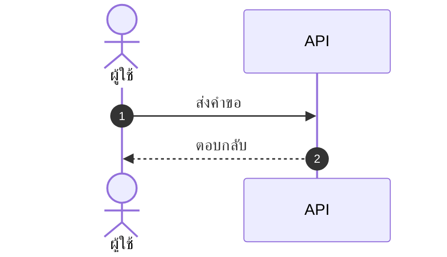

# skill: polished-document-style

Use when producing stakeholder-facing documents (BRD, FSD, ADR, status reports, audits, postmortems) that need polished formatting. Rich Markdown and Mermaid conventions that render well in GitHub, Notion, VS Code and Obsidian.

# Polished Document Style

## When to use this skill

- Output is meant for **non-developers** to read (PMs, executives, clients)
- Document needs **sign-off** or formal review
- Output will be **shared widely** or converted to PDF/Word later
- Any doc with 3+ sections or 500+ words

## When NOT to use

- Internal developer-only specs (keep them concise)
- Quick scratch notes
- Code comments / inline docs

> ℹ️ **Note:** This skill governs the *markdown source*. When the deliverable is a
> rendered **.docx / .pptx / .pdf** that a stakeholder will open, use
> `branded-document-design` on top of it — that skill carries the design tokens,
> the typography scale, Thai typography rules, and the `brandkit.py` builder.

---

## Document Header (Always)

Every polished doc MUST start with:

```markdown
# 📋 <Document Title>

> **Version:** 1.0 · **Date:** YYYY-MM-DD · **Status:** 🟡 Draft
> **Authors:** <names> · **Reviewers:** <names>
> **Tags:** `<area>` `<topic>`

---
```

Status values:
- 🟡 **Draft** — work in progress
- 🔵 **Review** — under stakeholder review
- 🟢 **Approved** — signed off
- ⚪ **Archived** — historical reference

---

## Section Hierarchy

- **H1** — Document title (exactly one)
- **H2** — Numbered sections (`## 1. Section`)
- **H3** — Sub-sections (`### 1.1 Sub-topic`)
- **H4** — Rare, use only if needed

**Always add Table of Contents** for docs with 5+ sections:

```markdown
## 📑 Table of Contents

1. [Executive Summary](#1-executive-summary)
2. [Scope](#2-scope)
3. [Details](#3-details)
```

---

## ธีมของเอกสาร — ตัดสินใจครั้งเดียว ใช้ทุกที่ในเอกสารนั้น

เอกสารหนึ่งฉบับผ่านมือหลาย skill — markdown ตัวนี้ · รูปจาก `software-diagrams` ·
ไฟล์ .docx จาก `branded-document-design` · สไลด์จาก `presentation-design`
ถ้าแต่ละตัวเลือกสีเอง ผู้อ่านจะได้เอกสารที่รูปสีหนึ่ง หัวข้อสีหนึ่ง และสไลด์อีกสีหนึ่ง

**markdown คือ source of truth ธีมจึงประกาศไว้ที่นี่** — ใส่ไว้ท้ายส่วนหัวของเอกสารหรือในไฟล์ข้างกัน:

```markdown
<!-- doc-theme: accent=<สีหลัก> · ที่มา=<แบรนด์ลูกค้า / เสนอจากเนื้องาน> · ยืนยันเมื่อ=YYYY-MM-DD -->
```

**สีหลักมาจากเนื้องาน ไม่ใช่จากค่าเริ่มต้นของเครื่องมือ**
มีสีแบรนด์อยู่แล้วใช้สีนั้น · ยังไม่มีให้เสนอโทนจากเนื้องานแล้วรอผู้ใช้ยืนยัน
(ตารางเนื้องาน → โทน อยู่ใน `svg-diagram-system` ข้อ 0)

| ส่วนของเอกสาร | ใครคุมสี | อ่านค่าจาก |
|---|---|---|
| หัวข้อ ตาราง กล่องข้อความใน markdown | markdown ไม่มีสี ใช้อิโมจิและน้ำหนักตัวอักษรแทน | — |
| ไดอะแกรม Mermaid | `software-diagrams` ข้อ 2 | `doc-theme` |
| รูปที่เป็นไฟล์ภาพ | `svg-diagram-system` · `diagram-figures` | `doc-theme` |
| ไฟล์ .docx / .pdf ที่ส่งออก | `branded-document-design` ข้อ 0–1 | `doc-theme` |
| สไลด์ | `presentation-design` | `doc-theme` |

**สีสถานะไม่นับรวม** — 🔴 วิกฤต 🟢 ผ่าน ต้องคงความหมายเดิมไม่ว่าธีมจะเป็นสีอะไร

### ค่าตั้งต้นประจำบ้าน (house default)

ถ้า `doc-theme` ยังไม่ประกาศ accent เฉพาะงาน ทุก skill ใช้ชุดนี้เป็นค่าตั้งต้น เพื่อให้รูป เอกสาร และสไลด์เป็นชุดสีเดียวกันตั้งแต่แรก ชุดนี้คือชุดเดียวกับ `presentation-design` และ `branded-document-design`:

| token | ค่า | ใช้กับ |
|---|---|---|
| brand | `#2A78D6` | สีหลัก · หัวข้อ · เส้น accent |
| brand-deep | `#2A4C86` | หัวตาราง · H2 · ชื่อระบบ |
| brand-2 | `#6A5CD6` | accent รอง (ม่วง) |
| tint | `#EDF1FB` | พื้นหัวตาราง · พื้นกล่องเน้น |
| ink / body | `#333B4A` / `#414957` | หัวข้อ / เนื้อความ |
| muted / faint | `#7D8492` / `#A9AEB9` | คำบรรยาย / หมายเหตุ |
| line | `#E4E7EE` | เส้นขอบ · เส้นเชื่อม |
| exception | `#C77A11` | ทาง/โซนที่ไม่ใช่เส้นทางหลัก (ต่างจาก brand เสมอ) |
| ฟอนต์ | Tahoma (เอกสาร/สไลด์) · Noto Sans Thai → Tahoma (ภาพ) | ทั้งไทยและอังกฤษ |

ประกาศ accent เฉพาะงานเมื่อไร ให้ค่านั้นทับ brand ส่วนที่เหลือคำนวณจาก accent เดียว

---

## Emoji Vocabulary

ใช้ให้**คงที่ทั้งเอกสาร** และใช้เพื่อ**หาของเจอเร็วขึ้น** ไม่ใช่เพื่อความน่ารัก

| ใช้ทำอะไร | ชุดที่ใช้ |
|---|---|
| ระดับความสำคัญ | 🔴 วิกฤต · 🟠 สูง · 🟡 กลาง · 🟢 ต่ำ |
| สถานะ | ✅ เสร็จ · 🚧 กำลังทำ · ⏳ รอ · ❌ ไม่ผ่าน · ⚠️ ต้องระวัง |
| ชนิดกล่องข้อความ | 💡 ข้อแนะนำ · 📌 ข้อควรจำ · 🚨 อันตราย · 📋 รายการตรวจ |
| หมวดเนื้อหา | 🎯 เป้าหมาย · 🏗️ สถาปัตยกรรม · 🔐 ความปลอดภัย · 📊 ตัวเลข · 🧪 การทดสอบ |

**หนึ่งอิโมจิต่อหัวข้อ ไม่ใช่ต่อบรรทัด** — เอกสารที่ทุกบรรทัดมีอิโมจิอ่านยากกว่าเอกสารที่ไม่มีเลย

---

## Callout Boxes

Use blockquotes with emoji prefix:

```markdown
> 💡 **Tip:** Brief actionable insight.

> ⚠️ **Warning:** Important caveat or limitation.

> 🚨 **Critical:** Must-read before proceeding.

> ℹ️ **Note:** Additional context or background.

> ❓ **Open Question:** Needs decision/clarification.
```

**Rules:**
- Keep callouts to 1-3 sentences
- One callout per topic — don't stack
- Don't overuse — max 3-5 per page

---

## Tables — When and How

### When to use tables instead of bullets

Use tables when items have **2+ attributes**:

❌ Don't use bullets:
```markdown
- email: string, required, unique
- age: number, optional
- role: enum, required, default "user"
```

✅ Use a table:
```markdown
| Field | Type   | Required | Default | Description       |
|-------|--------|:--------:|:-------:|-------------------|
| email | string | ✅       | —       | Unique login email|
| age   | number | ❌       | —       | Optional          |
| role  | enum   | ✅       | `user`  | Access level      |
```

### Table formatting tips

- Left-align text, center checkmarks/numbers, right-align money
- Use `—` (em dash) for "not applicable", not `-` or blank
- Keep cells short — long content goes in body paragraphs
- Bold key columns: `**email**`

---

## Mermaid Diagrams

**ตัวเลือกชนิดไดอะแกรม กติกาความอ่านง่าย ธีม และการจัดการป้ายภาษาไทย อยู่ใน `software-diagrams`**
skill นี้คุมเฉพาะเรื่องการวางไดอะแกรมลงในเอกสาร markdown

- วางไว้**หลังย่อหน้าที่อธิบายว่ารูปนี้ตอบคำถามอะไร** ไม่ใช่ลอยขึ้นมาเฉย ๆ
- ทุกรูปมีคำบรรยายใต้รูปหนึ่งบรรทัด ขึ้นต้นด้วย **รูปที่ N —**
- รูปเดียวกันอย่าใส่ซ้ำหลายที่ในเอกสาร ให้อ้างถึงเลขรูปแทน
- รูปที่ต้องส่งให้คนนอกทีมหรือใส่สไลด์ ใช้ `svg-diagram-system` แล้วฝังเป็นไฟล์ภาพ

````markdown

````

*รูปที่ 3 — ลำดับการเรียกเมื่อผู้ใช้กดบันทึก*

---

## Status Badges (Inline)

For key fields in headers/tables:

```markdown
**Status:** 🟢 Approved
**Priority:** 🔴 High
**Risk Level:** 🟡 Medium
**SLA:** ⚡ < 200ms
```

Multiple badges in a header:

```markdown
> 🟢 **Approved** · 🔴 **High Priority** · 👤 @alice · 🗓️ Due 2025-03-15
```

---

## Cover Block Pattern

For formal documents (BRD, FSD, ADR, postmortem):

```markdown
# 📋 <Title>

| | |
|--|--|
| **Document Type** | BRD \| FSD \| ADR \| Postmortem |
| **Version** | 1.2 |
| **Status** | 🟢 Approved |
| **Date** | 2025-01-15 |
| **Author(s)** | @alice, @bob |
| **Reviewer(s)** | @charlie |
| **Related** | [BRD-001](link), [FSD-005](link) |

---
```

---

## Comparison / Decision Tables

For trade-off analysis (architect, PM, SEO recommendations):

```markdown
| Option | Cost | Effort | Risk | Time-to-Value | Recommendation |
|--------|:----:|:------:|:----:|:-------------:|:--------------:|
| **A**  | 💰💰 | 🟡 Med | 🟢 Low | 🟢 Fast | ✅ Recommended |
| B      | 💰   | 🟢 Low | 🔴 High | 🟡 Med | ❌ Not recommended |
| C      | 💰💰💰| 🔴 High| 🟢 Low | 🔴 Slow | ⚪ Future consideration |
```

---

## Lists — When to nest, when to flatten

### ✅ Good list
```markdown
- Email is unique across all users
- Passwords must be 8+ characters with mixed case
- Sessions expire after 30 days of inactivity
```

### ❌ Bad list (over-nested)
```markdown
- Users
  - Email
    - Must be unique
    - Required
  - Password
    - 8+ chars
    - Mixed case
```

→ Should be a table instead.

**Rule:** Max 2 levels of nesting. More nesting = use a table.

---

## Code Blocks

Always specify language:

````markdown
```typescript
const user: User = { id: 1, email: 'a@b.com' };
```

```bash
npm install
```

```sql
SELECT * FROM users WHERE id = $1;
```
````

For long blocks, add file name as comment on first line:

```typescript
// src/services/auth.ts
export async function login(email: string, password: string) {
  // ...
}
```

---

## Approval/Sign-off Section (End of Doc)

For documents needing formal approval:

```markdown
## ✍️ Sign-off

| Role | Name | Status | Date |
|------|------|:------:|------|
| Product Owner | @alice | 🟢 Approved | 2025-01-15 |
| Tech Lead | @bob | 🔵 Reviewing | — |
| QA Lead | @charlie | ⚪ Not started | — |
| Security | @dave | ❌ Rejected | 2025-01-14 |
```

---

## Glossary Section

For docs with 5+ technical terms:

```markdown
## 📖 Glossary

| Term | Definition |
|------|------------|
| **API** | Application Programming Interface |
| **JWT** | JSON Web Token, used for stateless auth |
| **SLA** | Service Level Agreement |
```

Define acronyms on first use, then add to glossary.

---

## Quality Checklist

Before delivering any polished doc:

- [ ] H1 title with emoji marker
- [ ] Cover block with version, date, status, authors
- [ ] TOC if 5+ sections
- [ ] All sections numbered consistently
- [ ] Anchor links in TOC actually work
- [ ] Status badges where applicable
- [ ] Tables used (not bullets) where data has 2+ attributes
- [ ] At least one Mermaid diagram for any flow/relationship
- [ ] Callout boxes for tips/warnings (not just paragraphs)
- [ ] Code blocks have language hints
- [ ] Glossary for docs with 5+ acronyms
- [ ] No placeholder text (TBD, TODO, Lorem ipsum)
- [ ] Tested rendering in GitHub preview

---

> ไดอะแกรมในเอกสาร: ชนิดไหนตอบคำถามไหน และธีม Mermaid ชุดเดียวกันทั้งโปรเจกต์
> อยู่ใน `software-diagrams` · เอกสาร SRS โดยเฉพาะอยู่ใน `srs-writing`

## Anti-patterns


- ❌ **Emoji spam** — emoji in every heading just for decoration
- ❌ **All emoji, no labels** — `🔴 High` reads better than `🔴` alone
- ❌ **Deep nesting** — bullets 4+ levels deep, use tables instead
- ❌ **Walls of text** — paragraphs longer than 5 lines
- ❌ **Inconsistent terminology** — "user" in one section, "customer" in next
- ❌ **Diagrams that duplicate text** — diagram should add insight, not repeat
- ❌ **Tables of paragraphs** — if cells are >2 sentences, use headings instead
- ❌ **Skipping the cover block** — readers need version/status/date

---

## ตัวย่อ

เขียนตัวย่อเต็มครั้งแรกเสมอ แล้ววงเล็บตัวย่อไว้ — เช่น Model Context Protocol (MCP)
หลังจากนั้นใช้ตัวย่อได้ · รายละเอียดใน skill `spell-out-abbreviations`


---

# skill: spell-out-abbreviations

Use in every piece of writing for a person (docs, comments, commits, replies, UI text, diagram labels). Spell out each abbreviation the first time, e.g. Model Context Protocol (MCP), and gloss specialist terms.

# Spell Out Abbreviations

> **กฎที่หนึ่ง:** ตัวย่อทุกตัว เขียนเต็มครั้งแรก แล้ววงเล็บตัวย่อไว้ — หลังจากนั้นใช้ตัวย่อได้
> **กฎที่สอง:** ศัพท์เฉพาะทุกคำ วงเล็บคำอธิบายสั้น ๆ ไว้ครั้งแรก — ผู้อ่านนอกสายต้องไม่ต้องเดา

## รูปแบบ

```
✅ Model Context Protocol (MCP) ทำให้ Claude ต่อกับระบบอื่นได้ ... MCP รองรับ ...
❌ MCP ทำให้ Claude ต่อกับระบบอื่นได้
```

- **ครั้งแรกของแต่ละเอกสาร** เขียนเต็ม + วงเล็บ · ครั้งต่อไปใช้ตัวย่อล้วน
- เอกสารยาวที่แบ่งบท ให้เขียนเต็มใหม่**ครั้งแรกของแต่ละบท** เพราะคนมักอ่านทีละบท
- ตารางหรือหัวข้อที่ที่ไม่พอ ให้เขียนเต็มในบรรทัดแรกของส่วนนั้นแทน
- เอกสารที่มีตัวย่อตั้งแต่ 5 ตัวขึ้นไป ต้องมี **อภิธานศัพท์ (glossary)** ท้ายเอกสาร

## ยกเว้น — ไม่ต้องขยาย

คำที่คนทั่วไปรู้จักมากกว่าชื่อเต็ม: URL, PDF, HTML, CSS, JSON, USB, Wi-Fi, ID, OK
และนามสกุลไฟล์ (`.docx`, `.pptx`) · ถ้าไม่แน่ใจ **ให้ขยาย** เสียเปล่าดีกว่าคนอ่านไม่รู้เรื่อง

## ศัพท์เฉพาะ — วงเล็บคำอธิบาย ไม่ใช่แค่ตัวย่อ

ตัวย่อขยายแล้วยังไม่พอ ถ้าชื่อเต็มก็ยังไม่บอกอะไร **คำที่ผู้อ่านนอกสายไม่รู้จัก
ต้องมีคำอธิบายสั้นในวงเล็บครั้งแรก**

```
❌ ใช้ idempotency key กันงานซ้ำ
✅ ใช้ idempotency key (รหัสกำกับคำขอ ส่งซ้ำแล้วไม่ทำงานซ้ำ) กันงานซ้ำ

❌ ต้องทำ expand-contract ตอน migrate
✅ ต้องทำ expand-contract (ทยอยเพิ่มของใหม่ก่อน ค่อยลบของเก่าทีหลัง) ตอนเปลี่ยนโครงฐานข้อมูล
```

**คำอธิบายต้องสั้นกว่าหนึ่งบรรทัด** ยาวกว่านั้นแปลว่าควรแยกเป็นประโยคของตัวเอง

**วัดว่าคำไหนต้องอธิบาย** ด้วยคำถามเดียว — คนที่ทำงานคนละสายกับเรื่องนี้
อ่านแล้วเดาความหมายได้ไหม เดาไม่ได้คือต้องอธิบาย

| ระดับผู้อ่าน | อธิบายแค่ไหน |
|---|---|
| ลูกค้า ผู้บริหาร คนนอกสาย | ศัพท์เทคนิคทุกคำ แม้แต่คำที่ช่างใช้กันทุกวัน |
| ทีมพัฒนาแต่คนละส่วน | เฉพาะคำเฉพาะของส่วนนั้น เช่น ชื่อรูปแบบ ชื่อกระบวนการ |
| คนที่ทำเรื่องนี้อยู่แล้ว | เฉพาะคำที่เพิ่งตั้งขึ้นใหม่ในโปรเจกต์นี้ |

---

## ใช้กับอะไรบ้าง

เอกสารทุกชนิด · คอมเมนต์ในโค้ด · ข้อความ commit · ข้อความบนหน้าจอ · คำอธิบายไดอะแกรม ·
คำตอบในแชต — **ทุกอย่างที่มีคนอ่าน**

## ตัวอย่างที่เจอบ่อย

Model Context Protocol (MCP) · Application Programming Interface (API) ·
Service Level Agreement (SLA) · Role-Based Access Control (RBAC) ·
Software Development Life Cycle (SDLC) · Single Sign-On (SSO) ·
Continuous Integration / Continuous Deployment (CI/CD) ·
Software Requirements Specification (SRS) · Key Performance Indicator (KPI) ·
Personally Identifiable Information (PII) · Proof of Concept (POC) ·
Business Requirements Document (BRD) · Functional Specification Document (FSD) ·
Architecture Decision Record (ADR) · User Interface (UI) · User Experience (UX)

## Anti-patterns

- ❌ ขยายตัวย่อซ้ำทุกครั้งที่โผล่ — รกและกวนสายตา ครั้งแรกพอ
- ❌ วงเล็บกลับด้าน — `MCP (Model Context Protocol)` อ่านสะดุดกว่าเขียนเต็มขึ้นก่อน
- ❌ ขยายผิด — ถ้าไม่รู้ว่าย่อมาจากอะไร ให้ค้นก่อน อย่าเดา
- ❌ ขยายตัวย่อครบแต่ปล่อยศัพท์เฉพาะลอย — `Quadratic Weighted Kappa (QWK)` ยังไม่ช่วยใครถ้าไม่บอกว่ามันวัดอะไร
- ❌ อธิบายยาวเป็นย่อหน้าในวงเล็บ — วงเล็บไว้ให้คำสั้น ๆ ถ้ายาวให้แยกประโยค
