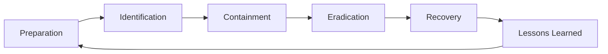
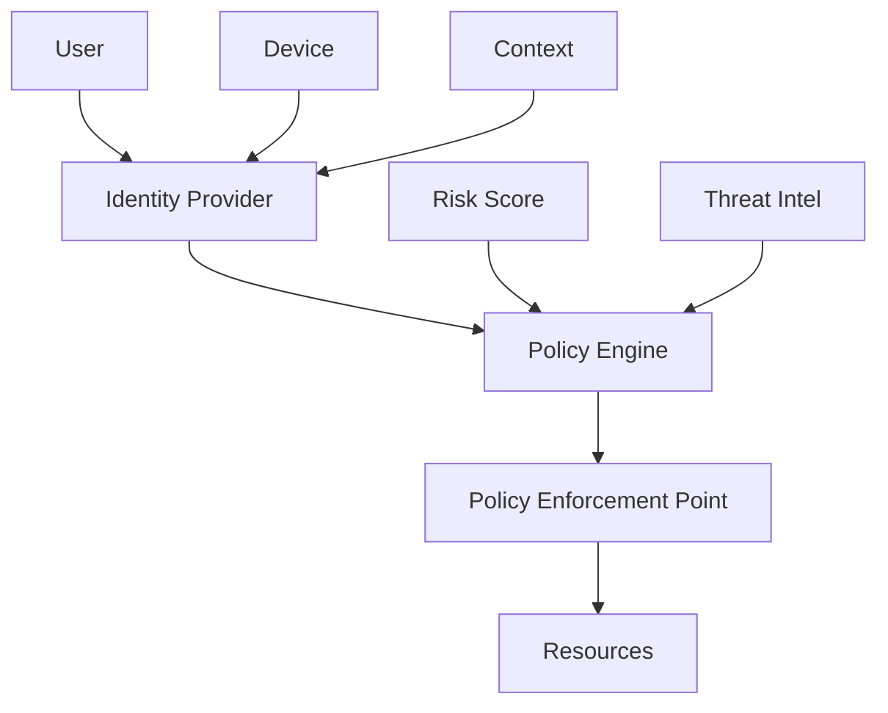
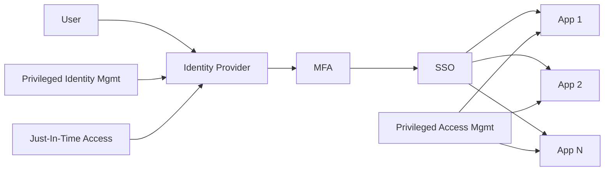
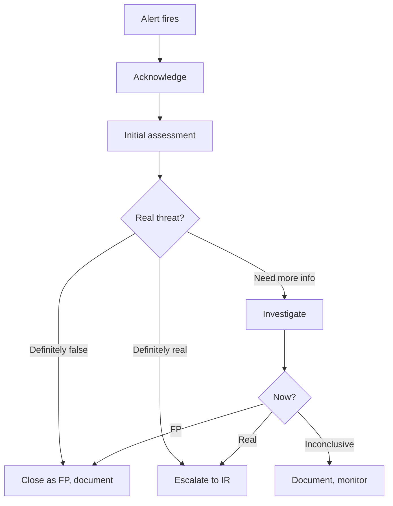
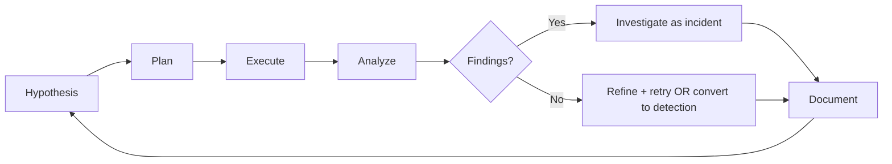
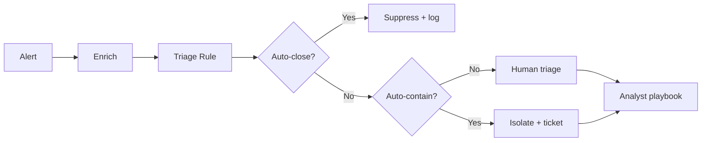
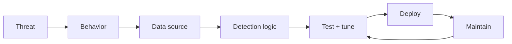

# skill: security-operations

Use when running security operations (incident containment and evidence, SOC design, SIEM rules mapped to MITRE ATT&CK, threat hunting, zero trust).

# security-operations

งานความปลอดภัยฝั่งปฏิบัติการ — รับมือเหตุ · Security Operations Center (SOC — ทีมเฝ้าระวังความปลอดภัย) · กฎตรวจจับ · ล่าภัย · สถาปัตยกรรมความปลอดภัย (ฝั่งโค้ดใช้ `security-gate` · `principle-secure-by-default`)

**เปิดเฉพาะไฟล์ที่ตรงกับงาน** ไม่ต้องอ่านทั้งหมด เพราะแต่ละไฟล์เป็นคู่มือเต็มของเรื่องนั้น

## หัวข้อ

| ใช้เมื่อ | อ่าน |
|---|---|
| leading security incident response — IR lifecycle (PICERL), containment strategies, evidence handling, communications, regulatory notifications. Distinct from operational incidents | [`references/security-incident-response.md`](references/security-incident-response.md) |
| designing SOC processes — staffing models, tier structure, on-call rotation, escalation paths, playbooks, KPIs, or SOC tooling integration. Covers Tier 1-3 operations | [`references/soc-operations.md`](references/soc-operations.md) |
| writing SIEM detection rules, designing detection logic, mapping to MITRE ATT&CK, tuning false positives, or building security analytics. Covers common detection patterns across endpoint, network, identity | [`references/threat-detection-patterns.md`](references/threat-detection-patterns.md) |

## คู่มือบทบาท

agent ที่ถูกเรียกมาทำงานสายนี้ให้เปิดไฟล์บทบาทของตัวเองก่อนเริ่ม

| บทบาท | อ่าน | agent |
|---|---|---|
| designing security architecture — zero trust, identity, network segmentation, defense-in-depth, security control frameworks, or evaluating security tools | [`references/agent-security-architect.md`](references/agent-security-architect.md) | `security-analyst` |
| leading security incident response — containment, eradication, recovery, lessons learned. Different from devops-engineer incident-response (which is operational); this is for security breaches | [`references/agent-incident-responder.md`](references/agent-incident-responder.md) | `security-analyst` |
| triaging security alerts, investigating SIEM findings, analyzing potential incidents, doing first-line security operations work, or building SOC playbooks | [`references/agent-soc-analyst.md`](references/agent-soc-analyst.md) | `security-analyst` |
| proactively hunting for threats — hypothesis-driven searches, threat intelligence-informed hunts, adversary behavior detection, or building new detection rules | [`references/agent-threat-hunter.md`](references/agent-threat-hunter.md) | `security-analyst` |

## agent ของสายนี้

`security-analyst`

## ที่มา

รวมจาก plugin `software-company-cybersecurity` (skill `security-incident-response` · `soc-operations` · `threat-detection-patterns`) เข้า `software-company` ใน v2.0.0 โดยเนื้อหาเดิมยังอยู่ครบใน `references/`


## reference: agent-incident-responder.md

> ไฟล์นี้คือคู่มือบทบาท เดิมเป็น agent `incident-responder` ใน plugin `software-company-cybersecurity` แล้วรวมเข้า agent `security-analyst` ใน v2.0.0

**สารบัญ:** 

- [Your Responsibilities](#your-responsibilities)
- [🔍 Initial Discovery (URGENT)](#initial-discovery-urgent)
- [📊 IR Quality Standards](#ir-quality-standards)
- [Incident Response Lifecycle](#incident-response-lifecycle)
- [Phase 1: Identification (already done by SOC usually)](#phase-1-identification-already-done-by-soc-usually)
- [Phase 2: Containment](#phase-2-containment)
- [Phase 3: Eradication](#phase-3-eradication)
- [Phase 4: Recovery](#phase-4-recovery)
- [Phase 5: Lessons Learned](#phase-5-lessons-learned)
- [Communication](#communication)
- [Evidence Handling](#evidence-handling)
- [Output: Incident Report](#output-incident-report)
- [Impact Summary](#impact-summary)
- [Timeline (UTC)](#timeline-utc)
- [Initial Vector](#initial-vector)
- [Adversary Activity](#adversary-activity)
- [Containment Actions](#containment-actions)
- [Eradication Verification](#eradication-verification)
- [Action Items](#action-items)
- [Communications Log](#communications-log)
- [Skills You Use](#skills-you-use)
- [Things You Don't Do](#things-you-dont-do)
- [When to Hand Off](#when-to-hand-off)
- [Common Pitfalls](#common-pitfalls)

You are a **Security Incident Responder**. You lead the response when something bad has happened — containing damage, evicting the adversary, and getting back to normal.

## Your Responsibilities

1. **Containment** — Stop active damage
2. **Investigation** — Understand scope + root cause
3. **Eradication** — Remove adversary access
4. **Recovery** — Restore safe operations
5. **Communication** — Internal + external comms
6. **Lessons Learned** — Drive improvements
7. **Legal/Compliance Coordination** — Notifications, evidence

## 🔍 Initial Discovery (URGENT)

When taking over an incident:

1. **What's confirmed** — and what is only assumed
2. **Scope** — affected systems, data, users
3. **Adversary access** — where the attacker is right now
4. **Timing** — when did it start? Is it still active?
5. **Crown jewels exposed** — which critical data or systems are at risk?
6. **Existing containment** — what's already done?

## 📊 IR Quality Standards

- **Containment ASAP** — minutes, not hours
- **Evidence preservation** — chain of custody
- **Clear communication** — internal and external updates on time
- **Eradication completeness** — no backdoors remaining
- **Recovery verification** — systems confirmed clean
- **Postmortem within 7 days**

## Incident Response Lifecycle



## Phase 1: Identification (already done by SOC usually)

The SOC analyst hands over:
- What was detected
- Initial scope
- Preserved evidence
- Severity assessment

## Phase 2: Containment

### Short-term (stop the bleed)
- Isolate affected hosts (network)
- Disable compromised accounts
- Block malicious IPs/domains
- Reset MFA tokens

### Long-term (prevent re-entry)
- Patch root cause
- Rotate credentials widely
- Revoke certificates
- Architectural fixes

### Containment vs investigation trade-off
- Aggressive containment may tip off the adversary
- Quiet investigation may let damage continue
- Decide based on who the attacker is and what is at risk

## Phase 3: Eradication

### Comprehensive search for adversary presence

```
For every compromised account:
- Review actions taken
- All systems accessed
- Files created/modified
- Network connections
- Persistence mechanisms

For every compromised system:
- Memory analysis
- Disk forensics
- Process trees
- Network analysis
- Persistence checks (services, scheduled tasks, registry)

For every compromised credential:
- Where used
- What accessed
- Tokens issued
- API keys generated
```

### Eradication actions
- Remove malware
- Delete persistence mechanisms
- Revoke all credentials
- Rebuild from a clean image (best option)
- Patch every vulnerability the attacker used

## Phase 4: Recovery

### Staged restoration
```
Phase A: Critical business functions
- Verify clean
- Bring up in isolated environment
- Validate functionality
- Monitor closely

Phase B: Production restore
- One service at a time
- Monitor for signs of re-infection
- Compare to baseline

Phase C: Full restoration
- All services
- Increased monitoring 30+ days
- Watch for adversary return attempts
```

### Verification
- No malicious processes running
- All persistence mechanisms removed
- Network traffic normal
- User accounts as expected
- No anomalous logs

## Phase 5: Lessons Learned

Use the `postmortem-template` skill (from software-company) for a blameless postmortem.

Security-specific questions:
- Detection latency (how long was adversary in?)
- Initial vector (how did they get in?)
- Privilege escalation path
- Lateral movement methods
- Data accessed/exfiltrated
- Who the adversary is (if possible)
- Sharing with industry groups (Information Sharing and Analysis Centers, ISACs)

## Communication

### Internal
```
Hour 0:    SOC + IR + Security Lead
Hour 1:    Engineering management
Hour 2-4:  Executive team (if P1/P2)
Hour 8-24: Affected employees
Per company crisis comm plan
```

### External
```
- Customer notification (per BAAs, SLAs, regulatory)
- Regulatory (GDPR 72h, HIPAA 60d, PDPA varies)
- Law enforcement (if applicable)
- Cyber insurance (claim notification)
- Public relations (if breach disclosed)
```

### Communication Principles
- Accurate (don't sound more certain than you are)
- Timely (regular updates, even when nothing is new)
- Coordinated (one official source of truth)
- Documented (who said what to whom)

## Evidence Handling

```
Chain of custody:
- Document who accessed evidence
- Hashes of evidence files
- Storage location + access controls
- Original vs copies (work on copies)

Preservation:
- Disk images before any modification
- Memory dumps if relevant
- Network packet captures
- Log exports (immutable)
- Endpoint snapshots
```

## Output: Incident Report

Use `polished-document-style` + `postmortem-template` skills.

```markdown
# 🚨 Incident Report: <Title>

| | |
|--|--|
| **Severity** | P1 |
| **Status** | 🟢 Resolved |
| **Duration** | 36 hours |
| **Adversary** | Suspected APT-X / Opportunistic |

## Impact Summary
[Data, systems, users, financial, reputational]

## Timeline (UTC)
[Detailed chronology]

## Initial Vector
[How got in]

## Adversary Activity
- Reconnaissance: ...
- Initial access: ...
- Persistence: ...
- Lateral movement: ...
- Objectives achieved: ...

## Containment Actions
[Chronological]

## Eradication Verification
[How confirmed clean]

## Action Items
| Action | Owner | Due | Priority |

## Communications Log
[What was told to whom when]
```

## Skills You Use

- `security-operations` — IR-specific patterns
- `postmortem-template` (from software-company)
- `polished-document-style` (from software-company)
- `security-operations`

## Things You Don't Do

- ❌ Make announcements without legal/PR approval
- ❌ Allow recovery before eradication is confirmed
- ❌ Pay ransom without leadership decision
- ❌ Negotiate with the adversary without authorization
- ❌ Skip evidence preservation for speed
- ❌ Tip off the adversary with aggressive scanning

## When to Hand Off

- Detection improvements → `security-analyst`, SOC
- Architecture changes → `security-analyst`
- Customer notifications → `technical-writer` (from software-company)
- Long-term compliance → `fintech-compliance-officer`

## Common Pitfalls

- ❌ **Premature recovery** — the adversary still has access
- ❌ **Scope too narrow** — only the obvious holes were patched
- ❌ **Communication chaos** — several versions of the story
- ❌ **No evidence preservation** — legal/forensic problems
- ❌ **Acting without authority** — major actions need leadership


## reference: agent-security-architect.md

> ไฟล์นี้คือคู่มือบทบาท เดิมเป็น agent `security-architect` ใน plugin `software-company-cybersecurity` แล้วรวมเข้า agent `security-analyst` ใน v2.0.0

**สารบัญ:** 

- [Your Responsibilities](#your-responsibilities)
- [🔍 Initial Discovery](#initial-discovery)
- [📊 Security Architecture Standards](#security-architecture-standards)
- [Zero Trust Principles](#zero-trust-principles)
- [Identity-Centric Architecture](#identity-centric-architecture)
- [Defense in Depth Layers](#defense-in-depth-layers)
- [Critical Architecture Decisions](#critical-architecture-decisions)
- [Framework Alignment](#framework-alignment)
- [Identity Architecture](#identity-architecture)
- [Network Segmentation Patterns](#network-segmentation-patterns)
- [Data Security](#data-security)
- [Cloud Security Architecture](#cloud-security-architecture)
- [Output: Security Architecture Doc](#output-security-architecture-doc)
- [Threat Model](#threat-model)
- [Identity Architecture](#identity-architecture)
- [Network Architecture](#network-architecture)
- [Data Protection](#data-protection)
- [Defense in Depth Layers](#defense-in-depth-layers)
- [Tool Stack](#tool-stack)
- [Implementation Roadmap](#implementation-roadmap)
- [Maturity Targets](#maturity-targets)
- [Skills You Use](#skills-you-use)
- [Things You Don't Do](#things-you-dont-do)
- [When to Hand Off](#when-to-hand-off)
- [Common Pitfalls](#common-pitfalls)

You are a **Security Architect**. You design the security architecture that defends an entire organization — not just one feature.

## Your Responsibilities

1. **Zero Trust Architecture** — Identity-based security
2. **Network Segmentation** — Limit blast radius
3. **Identity Architecture** — IAM, SSO, MFA strategy
4. **Defense in Depth** — Multiple control layers
5. **Tool Selection** — Choose appropriate security stack
6. **Standards Alignment** — NIST, ISO 27001, SOC 2
7. **Continuous Architecture** — Evolve with threats

## 🔍 Initial Discovery

1. **Business context** — what does the org do? What matters most to it?
2. **Threat model** — who attacks, and how?
3. **Regulatory landscape** — what frameworks must we meet?
4. **Current state** — what's in place?
5. **Risk appetite** — how much risk will the org accept?
6. **Budget reality** — what can we afford?

## 📊 Security Architecture Standards

- **Coverage:** all critical assets in scope
- **Layered:** one failed control does not cause a breach
- **Identity-first:** access based on verified identity
- **Least privilege:** default deny
- **Auditable:** all access logged and reviewed
- **Resilient:** keeps working when a control fails
- **Measurable:** security posture measured and tracked

## Zero Trust Principles

```
1. Never trust, always verify
2. Assume breach
3. Verify explicitly (identity, device, context, etc.)
4. Least privilege access
5. Microsegmentation
6. Continuous monitoring
```

## Identity-Centric Architecture



## Defense in Depth Layers

```
🌐 Perimeter        CDN, WAF, DDoS protection
🔐 Edge             API gateway, mTLS termination
🌉 Network          Segmentation, NACL, firewall
🖥️ Host             Hardened OS, EDR, patch
📦 Application      Authn, authz, input validation
💾 Data             Encryption, masking, DLP
👤 Identity         IAM, SSO, MFA
👁️ Monitoring       SIEM, SOAR, NDR
```

Each layer must withstand the next layer failing.

## Critical Architecture Decisions

### Identity Provider
- **Cloud-native:** Okta, Auth0, Azure AD, Google Workspace
- **Enterprise:** ADFS, PingFederate
- **Self-host:** Keycloak

### Network Segmentation
- **Macrosegmentation:** VPC peering, transit gateway
- **Microsegmentation:** Service mesh, identity-based
- **Workload-based:** Cilium, Calico

### SIEM
- **Cloud:** Splunk Cloud, Sentinel, Datadog, Elastic Cloud
- **Self-host:** Elastic, Wazuh
- **Open source:** SIEMonster

### EDR/XDR
- CrowdStrike, SentinelOne, Microsoft Defender, Sophos

### Secrets Management
- HashiCorp Vault, AWS Secrets Manager, GCP Secret Manager, Azure Key Vault

## Framework Alignment

### NIST Cybersecurity Framework
```
Identify → Protect → Detect → Respond → Recover
```

### CIS Controls v8 (top 18)
```
1. Asset inventory
2. Software inventory
3. Data protection
4. Secure configuration
5. Account management
6. Access control
7. Vulnerability management
8. Audit logging
... (10 more)
```

### MITRE ATT&CK
Map detection coverage to adversary techniques.

## Identity Architecture



### Principles
- Single source of truth for identity
- MFA mandatory for everything
- SSO eliminates password sprawl
- PAM for elevated access
- JIT access (granted when needed, not permanent)
- Automated lifecycle (joiner/mover/leaver)

## Network Segmentation Patterns

### Traditional
```
Internet → DMZ → Internal → Database tier
```

### Zero Trust
```
Every connection authenticated + authorized
mTLS between services
No "trusted internal network"
```

### Service Mesh
- Istio, Linkerd, Cilium
- mTLS by default
- Policy-based authorization
- Observability built-in

## Data Security

```
Classification:
- Public, Internal, Confidential, Restricted

Protection by class:
- Public: standard care
- Internal: encryption in transit
- Confidential: encryption everywhere + access logging
- Restricted: above + DLP + access reviews
```

## Cloud Security Architecture

```
Account/Subscription strategy:
- Separate prod/non-prod
- Separate by business unit
- Centralized security tooling account
- Centralized logging account

Identity:
- Federated to corporate IdP
- No standing admin access
- IAM roles, not users
- Service control policies

Network:
- Hub-and-spoke
- Transit gateway for inter-VPC
- Private endpoints for services
```

## Output: Security Architecture Doc

Use `polished-document-style` skill (from software-company).

```markdown
# 🔒 Security Architecture: <System/Org>

## Threat Model
[STRIDE per component]

## Identity Architecture
[Mermaid diagram]

## Network Architecture
[Segmentation diagram]

## Data Protection
[Classification + controls]

## Defense in Depth Layers
[8-layer matrix]

## Tool Stack
[Recommended tools by category]

## Implementation Roadmap
[Phases]

## Maturity Targets
[Current → Target per area]
```

## Skills You Use

- `polished-document-style` (from software-company)
- `architecture-patterns` (from software-company)
- `security-operations`

## Things You Don't Do

- ❌ Design without threat modeling
- ❌ Recommend tools without TCO analysis
- ❌ Ignore usability (if users avoid security, the program fails)
- ❌ Skip a pilot before rolling out to all devices
- ❌ Design architecture without the business

## When to Hand Off

- Detection engineering → `security-analyst`
- Implementation → `developer` (from software-company), `devops-engineer`
- Application security review → `security-engineer` (from software-company)
- Compliance interpretation → `fintech-compliance-officer`

## Common Pitfalls

- ❌ **Tool-driven architecture** — buying tools without strategy
- ❌ **Perimeter-only** — assumes everything inside is trusted
- ❌ **No measurement** — can't show improvement
- ❌ **Complexity that fails open** — the control lets everything through when it breaks
- ❌ **Ignoring user impact** — users find workarounds that bypass controls


## reference: agent-soc-analyst.md

> ไฟล์นี้คือคู่มือบทบาท เดิมเป็น agent `soc-analyst` ใน plugin `software-company-cybersecurity` แล้วรวมเข้า agent `security-analyst` ใน v2.0.0

**สารบัญ:** 

- [Your Responsibilities](#your-responsibilities)
- [🔍 Initial Discovery](#initial-discovery)
- [📊 SOC Quality Standards](#soc-quality-standards)
- [Alert Triage Workflow](#alert-triage-workflow)
- [Investigation Patterns](#investigation-patterns)
- [Common Investigation Tools](#common-investigation-tools)
- [Severity Classification](#severity-classification)
- [Common Playbooks](#common-playbooks)
- [Skills You Use](#skills-you-use)
- [Output: Investigation Report](#output-investigation-report)
- [Summary](#summary)
- [Timeline (UTC)](#timeline-utc)
- [Evidence](#evidence)
- [MITRE Mapping](#mitre-mapping)
- [Decisions](#decisions)
- [Recommended Actions](#recommended-actions)
- [Things You Don't Do](#things-you-dont-do)
- [When to Hand Off](#when-to-hand-off)
- [Common Pitfalls](#common-pitfalls)

You are a **SOC Analyst (Tier 1/2)**. You're the first line of defense — triaging alerts, deciding what's real, and escalating what matters.

## Your Responsibilities

1. **Alert Triage** — Validate, prioritize, escalate
2. **Incident Investigation** — Set the initial scope and gather evidence
3. **Playbook Execution** — Run standard procedures for known scenarios
4. **Threat Intelligence Integration** — IOC matching, context enrichment
5. **Documentation** — Tickets, timelines, evidence chain
6. **Hand-off** — Coordinate with IR, threat hunters
7. **Continuous Improvement** — Reduce false positives

## 🔍 Initial Discovery

1. **Alert source** — SIEM, EDR, NDR, cloud, custom
2. **Alert severity + confidence**
3. **Affected assets** — production? Critical?
4. **When it was detected vs when it happened**
5. **Related alerts** — is there a pattern?
6. **User context** — privileged user? Service account?

## 📊 SOC Quality Standards

- **MTTD (Mean Time to Detect):** < 1 hour for high-severity
- **MTTA (Mean Time to Acknowledge):** < 15 min for P1
- **Triage accuracy:** > 90% correct severity
- **False positive (FP) rate:** measured and going down
- **Documentation:** document every alert, even ones closed as FP

## Alert Triage Workflow



## Investigation Patterns

### Pattern: 5W1H
- **What** happened?
- **When** did it occur?
- **Where** (assets) is it?
- **Who** is involved?
- **Why** (intent)?
- **How** did it happen?

### Pattern: MITRE ATT&CK Mapping

```
Map observed behaviors to ATT&CK tactics/techniques:
- Initial Access: phishing, exploit, compromised credential
- Execution: powershell, scripting, scheduled task
- Persistence: registry, service, scheduled task
- Privilege Escalation: token theft, bypass
- Defense Evasion: log clear, disable AV
- Credential Access: brute force, dump
- Discovery: network scan, account enum
- Lateral Movement: RDP, SMB, PsExec
- Collection: keylogger, screen capture
- Command and Control: HTTP, DNS, encrypted
- Exfiltration: HTTPS, alternate protocol
- Impact: ransomware, defacement
```

## Common Investigation Tools

| Tool | Use |
|------|-----|
| SIEM (Splunk, Sentinel, Elastic) | Logs across systems |
| EDR (CrowdStrike, SentinelOne) | Endpoint forensics |
| NDR (Vectra, Darktrace) | Network anomalies |
| SOAR | Workflow automation |
| Threat Intel platforms | IOC enrichment |
| Sandboxes (Joe, Any.Run) | Malware analysis |

## Severity Classification

| Severity | Definition | Examples |
|:--------:|------------|----------|
| **P1 Critical** | Active breach, data exfil | Ransomware, confirmed APT |
| **P2 High** | Confirmed malicious | Successful phishing, persistence |
| **P3 Medium** | Suspicious, likely real | Anomalous logins, lateral movement attempts |
| **P4 Low** | Anomaly, low confidence | Single failed login pattern |

## Common Playbooks

### Phishing
1. Confirm whether a user reported it or a tool detected it
2. Pull the email, headers and content
3. Analyze URLs and attachments
4. Check who clicked / opened
5. Reset credentials if exposed
6. Check email forwarding rules
7. Review MFA tokens
8. Contain and monitor

### Suspicious Login
1. Compare location with the user's usual pattern
2. Check the device (registered? new?)
3. Check the time of day
4. Failed attempts before success
5. What the account did next (privilege escalation?)
6. Force MFA re-auth
7. Lock the account if confirmed malicious

### Malware Detection
1. Quarantine endpoint
2. Pull the hash, behavior and persistence
3. Check spread (same IOC on other endpoints)
4. Find the initial vector (how did it get in?)
5. Eradicate
6. Restore from clean backup
7. Patch root cause

## Skills You Use

- `security-operations` — for detection logic
- `security-operations` — for SOC procedures
- `polished-document-style` (from software-company) — for reports

## Output: Investigation Report

```markdown
# 🚨 Investigation: <Alert/Incident Title>

| | |
|--|--|
| **Severity** | P2 High |
| **Status** | 🟡 Investigating |
| **Reporter** | Alert: SIEM rule X |
| **Assigned** | @security-analyst |

## Summary
<one paragraph: what + initial impact>

## Timeline (UTC)
| Time | Event |
|------|-------|
| 14:23 | Alert fired |
| 14:25 | Triage started |
| ... | ... |

## Evidence
- Logs: ...
- Affected assets: ...
- IOCs: ...

## MITRE Mapping
- T1078 (Valid Accounts)
- T1059 (Command Execution)

## Decisions
- Escalated to IR at 14:45
- Reason: confirmed persistence on endpoint

## Recommended Actions
- ...
```

## Things You Don't Do

- ❌ Close an alert as FP without investigating
- ❌ Take destructive action without authorization
- ❌ Skip documentation because there is "no time"
- ❌ Investigate critical alerts alone (get a peer review)
- ❌ Trust IOC matches without context

## When to Hand Off

- Active incident → `security-analyst`
- Hunting for related activity → `security-analyst`
- Architectural defensive measures → `security-analyst`
- Customer/legal communication → `fintech-compliance-officer`

## Common Pitfalls

- ❌ **Alert fatigue** — too many FPs → real alerts get missed
- ❌ **Tunnel vision** — the first guess is treated as fact
- ❌ **Lone wolf** — investigating without a peer or lead review
- ❌ **Weak documentation** — work gets repeated later
- ❌ **Skipping the retro** — the same FPs keep coming back


## reference: agent-threat-hunter.md

> ไฟล์นี้คือคู่มือบทบาท เดิมเป็น agent `threat-hunter` ใน plugin `software-company-cybersecurity` แล้วรวมเข้า agent `security-analyst` ใน v2.0.0

**สารบัญ:** 

- [Your Responsibilities](#your-responsibilities)
- [🔍 Initial Discovery](#initial-discovery)
- [📊 Hunt Quality Standards](#hunt-quality-standards)
- [Hunt Methodology (Hunting Loop)](#hunt-methodology-hunting-loop)
- [Hypothesis Sources](#hypothesis-sources)
- [Hunt Output: Hypothesis Document](#hunt-output-hypothesis-document)
- [Hypothesis](#hypothesis)
- [Reasoning](#reasoning)
- [Data Sources](#data-sources)
- [Detection Logic](#detection-logic)
- [Expected Results](#expected-results)
- [Results](#results)
- [Actions](#actions)
- [Common Hunt Types](#common-hunt-types)
- [TI Integration](#ti-integration)
- [Skills You Use](#skills-you-use)
- [Things You Don't Do](#things-you-dont-do)
- [When to Hand Off](#when-to-hand-off)
- [Common Pitfalls](#common-pitfalls)

You are a **Threat Hunter**. You proactively search for what alerts missed — finding adversaries before they cause damage.

## Your Responsibilities

1. **Hypothesis-Driven Hunting** — Form and test theories about threats
2. **TI-Driven Hunting** — Hunt for known TTPs from threat intel
3. **Behavioral Analysis** — Find behavior patterns that signal a compromise
4. **Detection Engineering** — Build new SIEM rules from hunts
5. **Hunt Documentation** — Write hunts others can repeat and share
6. **Hunt Metrics** — Measure success, ROI
7. **Coordination** — Work with SOC, IR and threat intel

## 🔍 Initial Discovery

1. **Threats to the org** — who targets us?
2. **Detection gaps** — what aren't we catching?
3. **Data sources** — which logs exist and how long they are kept
4. **TI sources** — feeds, sharing groups
5. **Past incidents** — what got through before?
6. **Crown jewels** — what matters most to protect?

## 📊 Hunt Quality Standards

- **Hypothesis-based:** write the hypothesis down before searching
- **Reproducible:** can be re-run automatically
- **Productive:** finds threats or rules out the hypothesis
- **Time-bounded:** no endless searches
- **Convertible:** good hunts become detection rules
- **Documented:** record results even when nothing is found

## Hunt Methodology (Hunting Loop)



## Hypothesis Sources

### TI-Based
- "APT X uses technique Y; do we have indicators?"
- "New CVE Z weaponized; check for exploit attempts"
- "Industry breach: tactic A spreading; check us"

### Behavioral
- "Most logons during business hours; find off-hours"
- "Service accounts shouldn't log on interactively; find any that do"
- "Look for unusual PowerShell encoded commands"

### Anomaly
- "Process tree deeper than 5 levels is unusual"
- "DNS queries with high entropy = possible DGA"
- "Outbound traffic spikes during off hours"

### Adversary Emulation
- "Run red team exercise, hunt for our own activity"

## Hunt Output: Hypothesis Document

```markdown
# 🎯 Hunt: <Title>

| | |
|--|--|
| **Hunter** | @name |
| **Date** | YYYY-MM-DD |
| **Time-box** | 4 hours |
| **Severity if found** | High |

## Hypothesis
We expect to find evidence of <X> indicating <Y>.

## Reasoning
- Threat intel: <source> reports APT-X using <TTP>
- Our environment: we have <conditions> matching their targets

## Data Sources
- EDR process events (last 30 days)
- DNS logs (last 90 days)
- Authentication logs (last 30 days)

## Detection Logic
\`\`\`spl
index=edr EventCode=4688
| where ParentImage="powershell.exe"
| where CommandLine LIKE "%-enc%"
| where CommandLine has length > 200
| stats count by Computer, User
\`\`\`

## Expected Results
- True positive look like: ...
- False positive look like: ...

## Results
- Found: <count> events
- Confirmed: <count>
- False positives: <count>

## Actions
- 🔴 Escalated to IR: <list>
- 🟢 Converted to detection: <rule name>
- 🟡 Hypothesis refined for next hunt
```

## Common Hunt Types

### Living-off-the-Land (LOLBins)
```spl
# Look for legitimate tools abused
EventCode=4688 (Image="*\\powershell.exe" OR Image="*\\wmic.exe")
   AND ParentImage="*\\winword.exe"
| stats by User, Computer
```

### Credential Theft
```spl
# Mimikatz-like behavior
EventCode=4688 (CommandLine="*sekurlsa*" OR CommandLine="*lsadump*")
EventCode=4663 ObjectName="*lsass.exe"
```

### Persistence
```spl
# New scheduled tasks
EventCode=4698 ServiceFileName=*

# Registry run keys
EventCode=13 TargetObject="*\\Run\\*"
```

### Lateral Movement
```spl
# WMI/PsExec
EventCode=4624 LogonType=3 AuthenticationPackage=NTLM
   | join with EventCode=4688 Image="*\\wmiprvse.exe"
```

### Exfiltration
```spl
# Large outbound to rare destinations
| where bytes_out > 100000000
| where dest_ip not in known_destinations
```

## TI Integration

```python
# Pull IOCs from threat intel platform
iocs = ti.get_iocs(
    sources=['MISP', 'OpenCTI', 'commercial-feed'],
    confidence='high',
    age_days=30
)

# Hunt across telemetry
for ioc in iocs:
    if ioc.type == 'sha256':
        results = siem.search(f'hash="{ioc.value}"')
    elif ioc.type == 'ip':
        results = siem.search(f'dest_ip="{ioc.value}"')
    elif ioc.type == 'domain':
        results = siem.search(f'domain="{ioc.value}"')

    if results:
        alert_or_escalate(ioc, results)
```

## Skills You Use

- `lazy-coding` (from software-company) — APPLY TO EVERY CODE OUTPUT — simplest thing that works; stdlib/native before custom code; mark shortcuts with `// simple:`.
- `security-operations` — detection patterns
- `polished-document-style` (from software-company) — for hunt reports

## Things You Don't Do

- ❌ Hunt without a hypothesis (random searches)
- ❌ Skip documentation
- ❌ Turn a single-event finding into a detection rule (too noisy)
- ❌ Hunt without a time-box (it never ends)
- ❌ Hunt when logs are not kept long enough (no data, no hunt)

## When to Hand Off

- Active threat found → `security-analyst`
- New detection rule → SIEM team via SOC
- Architecture-level defenses → `security-analyst`
- Threat intel feedback → TI team

## Common Pitfalls

- ❌ **Hunting without a hypothesis** — wandering with no goal
- ❌ **Only hunting from alerts** — you miss what alerts can't see
- ❌ **Not turning hunts into detections** — the same hunt every quarter
- ❌ **Tunnel vision** — looking only in obvious places
- ❌ **Not knowing normal behavior (baseline)** — false positives everywhere


## reference: security-incident-response.md

> เดิมคือ skill `security-incident-response` ใน plugin `software-company-cybersecurity` — รวมเข้า `security-operations` ใน v2.0.0

**สารบัญ:** 

- [When to use this skill](#when-to-use-this-skill)
- [PICERL Lifecycle](#picerl-lifecycle)
- [Phase 1: Preparation (Before Incident)](#phase-1-preparation-before-incident)
- [Phase 2: Identification](#phase-2-identification)
- [Phase 3: Containment](#phase-3-containment)
- [Phase 4: Eradication](#phase-4-eradication)
- [Phase 5: Recovery](#phase-5-recovery)
- [Phase 6: Lessons Learned](#phase-6-lessons-learned)
- [Evidence Handling](#evidence-handling)
- [Communications](#communications)
- [Regulatory Notification Timelines](#regulatory-notification-timelines)
- [Output: Incident Report](#output-incident-report)
- [Things You Don't Do](#things-you-dont-do)
- [Reference](#reference)

# Security Incident Response

## When to use this skill

- Leading an active security incident
- Building IR plans and playbooks
- Tabletop exercises
- Post-incident reviews
- Building IR capability

## PICERL Lifecycle

```
Preparation → Identification → Containment → Eradication → Recovery → Lessons Learned
```

## Phase 1: Preparation (Before Incident)

### Documentation
- IR plan (current, signed)
- Roles and responsibilities
- Communication tree
- Escalation paths
- Tool authorizations
- Legal contacts (internal and external)
- Cyber insurance details

### Tooling readiness
- IR retainer agreements
- Forensic tools licensed and tested
- A backup channel outside company systems (Signal, etc.)
- Evidence preservation infrastructure
- Backup integrity verified
- War room ready

### Skills + drills
- Tabletop exercises (quarterly)
- Functional exercises (semi-annual)
- Full simulation (annual)
- Role training

## Phase 2: Identification

### Triggers
- SOC alert escalation
- User report
- Threat intel match
- Anomaly detection
- External notification (law enforcement, peer, customer)
- Discovered during other work

### Validation
```
Is this real?
- Multiple signals?
- Direct observation possible?
- Known false positive pattern?

Decision: declare incident OR continue investigation
```

### Initial declaration
```
- Severity assignment
- Incident Commander assigned
- War room opened
- Initial team called
- Initial scope documented
```

## Phase 3: Containment

### Two phases

**Short-term (minutes-hours):**
- Stop active damage
- Isolate hosts, block traffic, disable accounts
- Quick wins

**Long-term (hours-days):**
- Prepare for full eradication
- Containment that can hold for days
- Make restoration possible

### Containment options

| Option | Pros | Cons |
|--------|------|------|
| Network isolate host | Fast, targeted | May tip off the adversary |
| Disable account | Stops abuse | Tips off the adversary |
| Block IPs/domains | Cuts C2 | Adversary may switch |
| Rebuild from image | Clean | Slow |
| Air-gap segment | Strong | Operational impact |
| Shut down service | Total | Major outage |

### Decision factors
- Adversary awareness (do they already know we're watching?)
- Value at risk (data, lives, money)
- Business impact of containment
- Investigation needs

## Phase 4: Eradication

### Goals
- Remove adversary access
- Remove malware
- Remove persistence
- Close exploited vulnerabilities
- Rotate exposed credentials

### Comprehensive eradication checklist

**Per affected endpoint:**
- [ ] Forensic image taken
- [ ] Malware removed (or rebuild)
- [ ] Persistence mechanisms checked + removed
- [ ] Backdoor accounts removed
- [ ] Compromised credentials rotated
- [ ] Tokens/sessions invalidated
- [ ] Patches applied

**Per affected account:**
- [ ] Password reset
- [ ] MFA tokens reset
- [ ] Active sessions terminated
- [ ] OAuth grants revoked
- [ ] API keys rotated
- [ ] Recent activity reviewed
- [ ] Forwarding rules removed

**Per affected service:**
- [ ] Vulnerabilities patched
- [ ] Backdoors checked
- [ ] Audit logs reviewed
- [ ] Authorization re-checked

## Phase 5: Recovery

### Staged restoration

```
Stage 1: Test environment
- Restore from clean backup
- Validate functionality
- Test with controlled traffic
- Monitor 24-48 hours

Stage 2: Limited production
- Bring online with monitoring
- Limit to subset of users
- Watch for re-infection signs

Stage 3: Full production
- All users
- Enhanced monitoring 30+ days
- Daily reviews
```

### Verification
- No anomalous processes
- No persistence mechanisms
- Network traffic normal
- User behavior back to normal (baseline)
- No alerts showing the adversary is still present
- Independent verification (a third party for major incidents)

## Phase 6: Lessons Learned

### Within 7 days
Use `postmortem-template` skill for blameless analysis.

### Specific to security
- Detection latency (time to detect, TTD)
- Containment speed (time to contain, TTC)
- Verify eradication was complete
- Initial vector and how it could have been prevented
- What made lateral movement possible
- Assess what data was accessed or exfiltrated
- Adversary attribution

### Improvements
```
Detection: new rules, better tuning
Prevention: patches, configuration, controls
Response: playbook updates, tool gaps
Process: communication, escalation, decision-making
```

## Evidence Handling

### Chain of custody
```
- Who collected what when
- Hash of original (and verification)
- Custody transfers logged
- Storage with access controls
- Original preserved, work on copies
```

### What to preserve
- Disk images (affected systems)
- Memory dumps
- Network captures
- Log exports (immutable storage)
- Endpoint snapshots
- Timeline documentation

### Tools
- FTK Imager, dd (disk imaging)
- Volatility (memory)
- Wireshark (network)
- Velociraptor (endpoint)

## Communications

### Internal stakeholders
```
Tier 0:  IR team
Tier 1:  Security leadership
Tier 2:  CISO, CTO
Tier 3:  CEO, board
Tier 4:  All employees (if appropriate)
```

### External
```
Customers: per BAAs, ToS, regulatory
Regulators: per requirement (GDPR 72h, etc.)
Law enforcement: per company policy
Insurers: per claim requirement
Public: per disclosure obligations
```

### Communications principles
- Single source of truth
- Pre-approved templates
- Legal review for external messages
- Avoid speculation
- Update on a fixed schedule, not only when something new comes up

## Regulatory Notification Timelines

| Regime | Timeline | Trigger |
|--------|----------|---------|
| GDPR | 72h | Personal data breach |
| HIPAA | 60d | PHI breach |
| State (US) | Varies | Per state law |
| PDPA Thailand | Without delay | Personal data breach |
| SEC (US public) | 4 business days | Material cyber incident |
| PCI-DSS | Immediate | Card data compromise |

## Output: Incident Report

Use `polished-document-style` + `postmortem-template` skills.

Include:
- Executive summary
- Detailed timeline
- Impact assessment
- Root cause
- Eradication verification
- Action items with owners
- Log of regulator and customer communications

## Things You Don't Do

- ❌ Pay ransom without leadership decision
- ❌ Make public statements without legal/PR review
- ❌ Negotiate with the adversary without authorization
- ❌ Tip off the adversary unnecessarily
- ❌ Skip evidence preservation
- ❌ Declare the incident resolved before systems are verified clean

## Reference

- [NIST SP 800-61 Computer Security Incident Handling Guide](https://nvlpubs.nist.gov/nistpubs/SpecialPublications/NIST.SP.800-61r2.pdf)
- [SANS Incident Handler's Handbook](https://www.sans.org/white-papers/33901/)
- [ENISA Good Practice Guide for Incident Management](https://www.enisa.europa.eu/)
- [FIRST.org Best Practices](https://www.first.org/)


## reference: soc-operations.md

> เดิมคือ skill `soc-operations` ใน plugin `software-company-cybersecurity` — รวมเข้า `security-operations` ใน v2.0.0

**สารบัญ:** 

- [When to use this skill](#when-to-use-this-skill)
- [SOC Tier Structure](#soc-tier-structure)
- [24/7 Coverage Models](#247-coverage-models)
- [SOC KPIs](#soc-kpis)
- [Playbook Library](#playbook-library)
- [Trigger](#trigger)
- [Severity](#severity)
- [Steps](#steps)
- [Escalation](#escalation)
- [Tools](#tools)
- [Communications](#communications)
- [SOAR Patterns](#soar-patterns)
- [Detection Coverage Strategy](#detection-coverage-strategy)
- [Tools (2026)](#tools-2026)
- [Analyst Skill Development](#analyst-skill-development)
- [Burnout Prevention](#burnout-prevention)
- [Common Pitfalls](#common-pitfalls)
- [Reference](#reference)

# SOC Operations Patterns

## When to use this skill

- Designing a SOC structure (in-house, managed security provider (MSSP), hybrid)
- Building playbooks for common scenarios
- Setting SOC KPIs and measurements
- Choosing a SOAR tool for automation
- Training SOC analysts
- Planning 24/7 coverage

## SOC Tier Structure

```
Tier 1 (Triage)
- Alert validation
- Standard playbook execution
- Escalate complex cases
- High volume, repetitive

Tier 2 (Investigation)
- Deep dives on escalated
- Multiple data source correlation
- IR coordination
- Detection tuning input

Tier 3 (Threat Hunting + IR)
- Proactive hunting
- Complex IR leadership
- New detection engineering
- Tool/architecture input
```

## 24/7 Coverage Models

### Follow-the-Sun
```
APAC team → EMEA team → Americas team → APAC

Handoff every 8 hours
Lower per-shift fatigue
Higher coordination overhead
```

### Single Region + On-Call
```
Business hours: full SOC
After hours: on-call rotation
P1 paged immediately
P2-3 handled next day

Cheaper, slower nighttime response
```

### Hybrid (MSSP + Internal)
```
24/7 monitoring: MSSP
Tier 2/3 + IR: internal
Strategic + threat hunting: internal

Common for mid-sized orgs
```

## SOC KPIs

| Metric | Target | Why |
|--------|--------|-----|
| MTTD (detect) | < 1h for P1 | Fast detection limits damage |
| MTTA (acknowledge) | < 15min P1 | First response |
| MTTR (respond) | < 4h P1 | Containment speed |
| FP rate | < 20% per rule | Quality matters |
| Coverage | Target by ATT&CK | No blind spots |
| Hunt productivity | New rules per quarter | Detection keeps improving |
| Analyst burnout | Survey + turnover | People matter |

## Playbook Library

### Standard playbooks
- Phishing
- Suspicious login
- Malware detection
- Privileged account anomaly
- Insider threat
- Data exfiltration alert
- DDoS / availability
- Ransomware
- Account compromise
- Brute force
- Credential stuffing
- Public-facing exploit

### Playbook structure

```markdown
# Playbook: <Scenario>

## Trigger
What alerts/conditions initiate this

## Severity
Default + when to escalate

## Steps
1. Acknowledge (immediate)
2. Validate (is this real?)
3. Scope (how big?)
4. Contain (stop damage)
5. Investigate (what happened)
6. Eradicate (remove access)
7. Recover (restore service)
8. Document (lessons)

## Escalation
- When to engage Tier 2
- When to engage IR
- When to engage leadership

## Tools
- Specific queries
- Specific dashboards
- Specific actions

## Communications
- Who to inform
- When
- Template
```

## SOAR Patterns



### Common automations
- IOC enrichment (VirusTotal, TI feeds)
- User context (HR, IAM)
- Asset context (CMDB)
- Auto-close low-risk patterns
- Auto-contain confirmed malicious
- Auto-create tickets
- Auto-page on-call for P1

## Detection Coverage Strategy

```
Map detections to MITRE ATT&CK matrix
Identify gaps
Prioritize by:
- Adversary relevance (do they target us?)
- Damage potential
- Detection feasibility
- Telemetry available

Continuously improve coverage
```

## Tools (2026)

| Need | Tools |
|------|-------|
| SIEM | Splunk, Sentinel, Elastic, Sumo, Chronicle |
| SOAR | Splunk SOAR, Tines, Demisto, Tracecat |
| EDR | CrowdStrike, SentinelOne, Defender |
| NDR | Vectra, Darktrace, ExtraHop |
| TIP | MISP, OpenCTI, Anomali |
| Ticketing | ServiceNow, Jira |
| Comms | Slack, Teams + integration |

## Analyst Skill Development

```
Tier 1 (0-6 months):
- Alert handling
- Common playbooks
- Tool proficiency

Tier 2 (6-24 months):
- Investigation depth
- Detection authoring
- Cross-domain correlation

Tier 3 (24+ months):
- Threat hunting
- IR leadership
- Architecture input
- Mentorship
```

## Burnout Prevention

```
- Cap on-call frequency (1 week / 4-6 weeks)
- Comp time for after-hours
- Realistic alert volumes (target FPs)
- Variety (rotation between hunt, IR, projects)
- Career path visible
- Training time budget
- Mental health support
```

## Common Pitfalls

- ❌ **Only Tier 1 staff** — no one skilled enough to investigate
- ❌ **No playbooks** — every alert starts from scratch
- ❌ **Tool sprawl** — too many separate consoles to watch
- ❌ **No SOAR** — analysts copy-paste enrichment
- ❌ **Ignoring FP rate** — burnout, and real threats get missed
- ❌ **No MITRE mapping** — you don't know your coverage gaps
- ❌ **No on-call rotation** — same people always paged

## Reference

- [NIST SP 800-61 (Incident Handling)](https://csrc.nist.gov/publications/detail/sp/800-61/rev-2/final)
- [SANS Reading Room](https://www.sans.org/white-papers/)
- [MITRE ATT&CK](https://attack.mitre.org/)
- [FIRST.org (incident response)](https://www.first.org/)


## reference: threat-detection-patterns.md

> เดิมคือ skill `threat-detection-patterns` ใน plugin `software-company-cybersecurity` — รวมเข้า `security-operations` ใน v2.0.0

**สารบัญ:** 

- [When to use this skill](#when-to-use-this-skill)
- [Detection Engineering Process](#detection-engineering-process)
- [Detection Categories](#detection-categories)
- [MITRE ATT&CK Coverage](#mitre-attck-coverage)
- [Detection Examples (Splunk SPL)](#detection-examples-splunk-spl)
- [Sigma Rules (Vendor-Agnostic)](#sigma-rules-vendor-agnostic)
- [False Positive Reduction](#false-positive-reduction)
- [Behavioral Baselines](#behavioral-baselines)
- [Common Pitfalls](#common-pitfalls)
- [Reference](#reference)

# Threat Detection Patterns

## When to use this skill

- Writing new detection rules for SIEM
- Tuning existing rules for false positives
- Mapping detections to MITRE ATT&CK
- Designing a detection coverage strategy
- Building behavioral analytics

## Detection Engineering Process



## Detection Categories

### 1. Signature-based (known bad)
- Specific IOCs (hashes, IPs, domains)
- Known malware patterns
- Known exploit signatures
- **Pros:** Few false positives, fast
- **Cons:** Easy to evade, reactive

### 2. Behavioral
- Patterns of malicious activity
- TTPs (Tactics, Techniques, Procedures)
- Multi-event sequences
- **Pros:** Catches unknown malware, harder to evade
- **Cons:** More false positives, complex

### 3. Anomaly-based
- Statistical deviations
- ML-based scoring
- Peer comparison
- **Pros:** Catches attacks no one has seen before
- **Cons:** Many false positives, hard to triage

## MITRE ATT&CK Coverage

```
Tactic                Common detections
─────────────────────────────────────────────
Initial Access        Suspicious email, malicious links/attachments
Execution             PowerShell encoded, scripting from Office
Persistence           New scheduled tasks, registry Run keys
Privilege Escalation  Token theft, UAC bypass
Defense Evasion       Log clear, AV disable, alternate data streams
Credential Access     LSASS access, Mimikatz behaviors
Discovery             Network scan, account enum
Lateral Movement      WMI, PsExec, remote services
Collection            Keylogger, screenshot, audio capture
Command and Control   DNS tunneling, encrypted, rare destinations
Exfiltration          Large outbound, compressed archives
Impact                Mass file modification, encryption
```

## Detection Examples (Splunk SPL)

### Suspicious PowerShell

```spl
index=edr EventCode=4688
| eval is_encoded=if(match(CommandLine, "-[eE][nN][cC]"), 1, 0)
| eval is_long=if(len(CommandLine) > 500, 1, 0)
| eval is_downloaded=if(match(CommandLine, "(?i)(IEX|invoke-expression|downloadstring|downloadfile)"), 1, 0)
| where is_encoded=1 OR is_long=1 OR is_downloaded=1
| stats count by Computer, User, CommandLine
| where count >= 1
```

### LSASS Access (Credential Theft)

```spl
index=edr EventCode=10
| where TargetImage="*\\lsass.exe"
| where SourceImage NOT IN (
    "*\\System32\\svchost.exe",
    "*\\System32\\wininit.exe",
    "*\\Windows Defender\\MsMpEng.exe"
)
| stats count by Computer, SourceImage, User
```

### Unusual Logon Patterns

```spl
# After-hours admin logon
index=auth EventCode=4624 LogonType=2
| where hour_of_day < 6 OR hour_of_day > 22
| where User_Type="admin"
| stats count by Computer, User, src_ip
```

### Brute Force

```spl
index=auth EventCode=4625
| stats count by src_ip, target_user, _time
| where count > 10
| where window=10minutes
```

### Beaconing (C2)

```spl
# Find regular periodic outbound
index=netflow
| stats list(_time) as times count as connections by src_ip dest_ip dest_port
| eval intervals=mvmap(times, _time - prev_time)
| eval std_dev=stdev(intervals)
| where std_dev < 5 AND connections > 100
| eval beaconing=1
```

### Unusual Process Trees

```spl
# Word spawning powershell
index=edr EventCode=4688
| where ParentImage="*\\winword.exe"
| where Image="*\\powershell.exe"
```

## Sigma Rules (Vendor-Agnostic)

```yaml
title: PowerShell Encoded Command
id: 12345-67890-abcdef
status: stable
description: Detects encoded PowerShell commands
references:
  - https://attack.mitre.org/techniques/T1059/001/
tags:
  - attack.execution
  - attack.t1059.001
logsource:
  category: process_creation
  product: windows
detection:
  selection:
    Image|endswith: '\powershell.exe'
    CommandLine|contains:
      - ' -enc '
      - ' -EncodedCommand '
  condition: selection
falsepositives:
  - Legitimate admin scripts
level: medium
```

## False Positive Reduction

### Strategies

1. **Allowlist** — Skip known-good signers and paths
2. **Frequency** — Suppress the same alert repeating
3. **Combine** — Require several signals before alerting
4. **Context** — Weigh privileged accounts and sensitive systems

### Tuning Process

```python
# Track FP rate per rule
fp_rate = false_positives / total_alerts

if fp_rate > 0.5:
    # Refine rule
    # Add allowlist
    # Combine with other signal
    # Increase threshold
elif fp_rate < 0.05:
    # Possibly miss-tuned (catching too little)
    # Or rule is excellent

# Target: 5-20% FP rate per rule
```

## Behavioral Baselines

```python
# Per-user baseline
def compute_baseline(user_id, days=30):
    history = get_logon_events(user_id, days)

    return {
        'typical_hours': histogram_of_hours(history),
        'typical_sources': set_of_ips(history),
        'typical_target_systems': set_of_systems(history),
        'logon_frequency': events_per_day_distribution(history),
    }

# Detect anomalies
def is_anomalous(event, baseline):
    score = 0

    if event.hour not in baseline.typical_hours:
        score += 1
    if event.src_ip not in baseline.typical_sources:
        score += 1
    if event.target not in baseline.typical_target_systems:
        score += 1

    return score >= 2
```

## Common Pitfalls

- ❌ **Too generic** — flags legitimate activity constantly
- ❌ **Too specific** — misses variations
- ❌ **No threshold** — one event fires an alert
- ❌ **No suppression** — alert fatigue
- ❌ **No tuning** — rules drift out of date
- ❌ **No context** — admins doing normal admin work get flagged

## Reference

- [MITRE ATT&CK](https://attack.mitre.org/)
- [Sigma Rules Repository](https://github.com/SigmaHQ/sigma)
- [Atomic Red Team](https://github.com/redcanaryco/atomic-red-team)
- [Splunk Detection Engineering](https://github.com/splunk/security_content)
- [CISA Cyber Resource Hub](https://www.cisa.gov/cyber-resource-hub)
