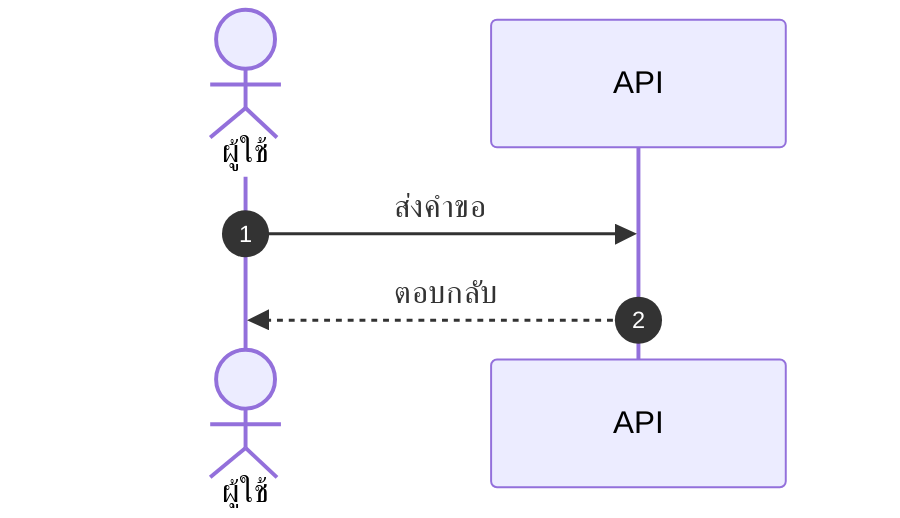

# skill: simplicity-first

Use when producing a document, design, architecture or plan — BRD, FSD, ADR, roadmap, UX or API design, sprint plan. Defaults to the simplest version that works and applies the "could a tired teammate follow this in 6 months?" test before delivery. Rejects buzzwords, premature abstraction and unnecessary layers. For code use lazy-coding instead.

# Simplicity First

> The best architecture has the fewest moving parts. The best plan is the one a
> teammate can follow with no context.

This skill covers **non-code outputs** — documents, plans, architecture, and
designs. For code, use `lazy-coding`.

## The one test

Before submitting, ask:

> Could a tired teammate understand this in 6 months, with no prior context?

If "no" or "not sure" → simplify.

## 5 principles

1. **Start with the simplest thing that works.** Add complexity only when something breaks.
2. **Reduce moving parts.** Each component adds failure modes, ops burden, and docs. Default to one thing.
3. **Use familiar patterns.** Boring, proven tech for critical paths. Save novelty for low-risk experiments.
4. **Optimize for reading.** It's read far more often than written.
5. **Delete &gt; add.** The best edit removes something. The worst adds a layer for an imagined future need.

## By output type

### Documents (BRD, FSD, ADR)

Do: short sentences (≤ 20 words), plain English, one idea per paragraph, an
example for every abstract point, tables for structured data.

Avoid: marketing-speak ("revolutionary", "best-in-class", "synergy"), undefined
jargon, walls of text, hedging ("might possibly potentially"), acronym soup.

### Architecture

Do: monolith first (split only when a bottleneck is proven), familiar stack,
standard patterns (REST, queues, caches), single source of truth per data type.

Avoid: microservices for small teams, distributed-everything, multi-master
databases before you must, event-driven by default (sync is simpler).

### Plans

Do: 3-5 priorities (not 20), a named owner per item, measurable success
criteria, realistic timelines with buffer, cut scope to fit time.

Avoid: vague goals ("improve quality"), 50-item lists (= no priority),
aspirational dates with no buffer, plans without success metrics.

### Designs (UX, API)

Do: fewest steps to the user's goal, reuse existing patterns, stay consistent
across screens, defaults that work for 80%, progressive disclosure.

Avoid: novel interactions where a standard one works, 10-step flows when 3
work, required fields with no smart default, hidden features needing tutorials.

## The 3-question filter

Before adding any new component, configuration option, or pattern:

1. Is there real evidence we need this **now** (not "might need")?
2. Is there a simpler way? (Sleep on it. Often yes.)
3. What's the cost of **not** adding it? (Often nothing, or a small refactor later.)

Two or more answers point to "simpler is fine" → don't add it.

## Examples

**API description**

❌ "This sophisticated, enterprise-grade endpoint leverages state-of-the-art
authentication to facilitate the seamless retrieval of user profile data."

✅ "`GET /users/{id}` returns a user profile. Requires a Bearer token. Use
`?fields=name,email` to limit the response."

**Sprint goal**

❌ "Improve overall product quality and customer satisfaction through various
initiatives."

✅ "Reduce login errors by 50% (8% → 4%): fix timeout bug (2d), retry on
transient errors (1d), clearer error messages (1d)."

**Architecture for a new feature**

❌ "Event-sourced microservice with CQRS, Kafka ingestion, Redis cache, and a
dedicated auth service."

✅ "Add an endpoint to the existing API. One Postgres table for state. Standard
auth middleware. Log to the existing system."

## Anti-patterns to reject

- **Future-proofing** — abstractions for needs that never arrive.
- **"It might scale"** — infra for 1M users while you have 1k.
- **Layer cake** — 6 layers where 90% just pass through.
- **Resume-driven design** — fancy tech to look sophisticated.
- **Buzzword stacking** — "cloud-native event-driven AI-powered".

## Pre-submit checklist

- [ ] A tired teammate would understand this in 6 months.
- [ ] Nothing can be deleted without losing meaning.
- [ ] No jargon the audience won't know.
- [ ] Every abstract claim has an example.
- [ ] I could explain the whole thing in two sentences.

If any answer is "no" → simplify before delivering.

> "Perfection is achieved not when there is nothing more to add, but when there
> is nothing left to take away." — Saint-Exupéry


---

# skill: polished-document-style

Use when producing stakeholder-facing or human-readable documents (BRD, FSD, ADR, status reports, audit reports, postmortems, etc.) that need polished formatting. Provides Rich Markdown + Mermaid conventions for consistent, professional output that renders well in GitHub, Notion, VSCode, and Obsidian.

# Polished Document Style

## When to use this skill

- Output is meant for **non-developers** to read (PMs, executives, clients)
- Document needs **sign-off** or formal review
- Output will be **shared widely** or converted to PDF/Word later
- Any doc with 3+ sections or 500+ words

## When NOT to use

- Internal developer-only specs (keep them concise)
- Quick scratch notes
- Code comments / inline docs

> ℹ️ **Note:** This skill governs the *markdown source*. When the deliverable is a
> rendered **.docx / .pptx / .pdf** that a stakeholder will open, use
> `branded-document-design` on top of it — that skill carries the design tokens,
> the typography scale, Thai typography rules, and the `brandkit.py` builder.

---

## Document Header (Always)

Every polished doc MUST start with:

```markdown
# 📋 <Document Title>

> **Version:** 1.0 · **Date:** YYYY-MM-DD · **Status:** 🟡 Draft
> **Authors:** <names> · **Reviewers:** <names>
> **Tags:** `<area>` `<topic>`

---
```

Status values:
- 🟡 **Draft** — work in progress
- 🔵 **Review** — under stakeholder review
- 🟢 **Approved** — signed off
- ⚪ **Archived** — historical reference

---

## Section Hierarchy

- **H1** — Document title (exactly one)
- **H2** — Numbered sections (`## 1. Section`)
- **H3** — Sub-sections (`### 1.1 Sub-topic`)
- **H4** — Rare, use only if needed

**Always add Table of Contents** for docs with 5+ sections:

```markdown
## 📑 Table of Contents

1. [Executive Summary](#1-executive-summary)
2. [Scope](#2-scope)
3. [Details](#3-details)
```

---

## ธีมของเอกสาร — ตัดสินใจครั้งเดียว ใช้ทุกที่ในเอกสารนั้น

เอกสารหนึ่งฉบับผ่านมือหลาย skill — markdown ตัวนี้ · รูปจาก `software-diagrams` ·
ไฟล์ .docx จาก `branded-document-design` · สไลด์จาก `presentation-design`
ถ้าแต่ละตัวเลือกสีเอง ผู้อ่านจะได้เอกสารที่รูปสีหนึ่ง หัวข้อสีหนึ่ง และสไลด์อีกสีหนึ่ง

**markdown คือ source of truth ธีมจึงประกาศไว้ที่นี่** — ใส่ไว้ท้ายส่วนหัวของเอกสารหรือในไฟล์ข้างกัน:

```markdown
<!-- doc-theme: accent=<สีหลัก> · ที่มา=<แบรนด์ลูกค้า / เสนอจากเนื้องาน> · ยืนยันเมื่อ=YYYY-MM-DD -->
```

**สีหลักมาจากเนื้องาน ไม่ใช่จากค่าเริ่มต้นของเครื่องมือ**
มีสีแบรนด์อยู่แล้วใช้สีนั้น · ยังไม่มีให้เสนอโทนจากเนื้องานแล้วรอผู้ใช้ยืนยัน
(ตารางเนื้องาน → โทน อยู่ใน `svg-diagram-system` ข้อ 0)

| ส่วนของเอกสาร | ใครคุมสี | อ่านค่าจาก |
|---|---|---|
| หัวข้อ ตาราง กล่องข้อความใน markdown | markdown ไม่มีสี ใช้อิโมจิและน้ำหนักตัวอักษรแทน | — |
| ไดอะแกรม Mermaid | `software-diagrams` ข้อ 2 | `doc-theme` |
| รูปที่เป็นไฟล์ภาพ | `svg-diagram-system` · `diagram-figures` | `doc-theme` |
| ไฟล์ .docx / .pdf ที่ส่งออก | `branded-document-design` ข้อ 0–1 | `doc-theme` |
| สไลด์ | `presentation-design` | `doc-theme` |

**สีสถานะไม่นับรวม** — 🔴 วิกฤต 🟢 ผ่าน ต้องคงความหมายเดิมไม่ว่าธีมจะเป็นสีอะไร

---

## Emoji Vocabulary

ใช้ให้**คงที่ทั้งเอกสาร** และใช้เพื่อ**หาของเจอเร็วขึ้น** ไม่ใช่เพื่อความน่ารัก

| ใช้ทำอะไร | ชุดที่ใช้ |
|---|---|
| ระดับความสำคัญ | 🔴 วิกฤต · 🟠 สูง · 🟡 กลาง · 🟢 ต่ำ |
| สถานะ | ✅ เสร็จ · 🚧 กำลังทำ · ⏳ รอ · ❌ ไม่ผ่าน · ⚠️ ต้องระวัง |
| ชนิดกล่องข้อความ | 💡 ข้อแนะนำ · 📌 ข้อควรจำ · 🚨 อันตราย · 📋 รายการตรวจ |
| หมวดเนื้อหา | 🎯 เป้าหมาย · 🏗️ สถาปัตยกรรม · 🔐 ความปลอดภัย · 📊 ตัวเลข · 🧪 การทดสอบ |

**หนึ่งอิโมจิต่อหัวข้อ ไม่ใช่ต่อบรรทัด** — เอกสารที่ทุกบรรทัดมีอิโมจิอ่านยากกว่าเอกสารที่ไม่มีเลย

---

## Callout Boxes

Use blockquotes with emoji prefix:

```markdown
> 💡 **Tip:** Brief actionable insight.

> ⚠️ **Warning:** Important caveat or limitation.

> 🚨 **Critical:** Must-read before proceeding.

> ℹ️ **Note:** Additional context or background.

> ❓ **Open Question:** Needs decision/clarification.
```

**Rules:**
- Keep callouts to 1-3 sentences
- One callout per topic — don't stack
- Don't overuse — max 3-5 per page

---

## Tables — When and How

### When to use tables instead of bullets

Use tables when items have **2+ attributes**:

❌ Don't use bullets:
```markdown
- email: string, required, unique
- age: number, optional
- role: enum, required, default "user"
```

✅ Use a table:
```markdown
| Field | Type   | Required | Default | Description       |
|-------|--------|:--------:|:-------:|-------------------|
| email | string | ✅       | —       | Unique login email|
| age   | number | ❌       | —       | Optional          |
| role  | enum   | ✅       | `user`  | Access level      |
```

### Table formatting tips

- Left-align text, center checkmarks/numbers, right-align money
- Use `—` (em dash) for "not applicable", not `-` or blank
- Keep cells short — long content goes in body paragraphs
- Bold key columns: `**email**`

---

## Mermaid Diagrams

**ตัวเลือกชนิดไดอะแกรม กติกาความอ่านง่าย ธีม และการจัดการป้ายภาษาไทย อยู่ใน `software-diagrams`**
skill นี้คุมเฉพาะเรื่องการวางไดอะแกรมลงในเอกสาร markdown

- วางไว้**หลังย่อหน้าที่อธิบายว่ารูปนี้ตอบคำถามอะไร** ไม่ใช่ลอยขึ้นมาเฉย ๆ
- ทุกรูปมีคำบรรยายใต้รูปหนึ่งบรรทัด ขึ้นต้นด้วย **รูปที่ N —**
- รูปเดียวกันอย่าใส่ซ้ำหลายที่ในเอกสาร ให้อ้างถึงเลขรูปแทน
- รูปที่ต้องส่งให้คนนอกทีมหรือใส่สไลด์ ใช้ `svg-diagram-system` แล้วฝังเป็นไฟล์ภาพ

````markdown

````

*รูปที่ 3 — ลำดับการเรียกเมื่อผู้ใช้กดบันทึก*

---

## Status Badges (Inline)

For key fields in headers/tables:

```markdown
**Status:** 🟢 Approved
**Priority:** 🔴 High
**Risk Level:** 🟡 Medium
**SLA:** ⚡ < 200ms
```

Multiple badges in a header:

```markdown
> 🟢 **Approved** · 🔴 **High Priority** · 👤 @alice · 🗓️ Due 2025-03-15
```

---

## Cover Block Pattern

For formal documents (BRD, FSD, ADR, postmortem):

```markdown
# 📋 <Title>

| | |
|--|--|
| **Document Type** | BRD \| FSD \| ADR \| Postmortem |
| **Version** | 1.2 |
| **Status** | 🟢 Approved |
| **Date** | 2025-01-15 |
| **Author(s)** | @alice, @bob |
| **Reviewer(s)** | @charlie |
| **Related** | [BRD-001](link), [FSD-005](link) |

---
```

---

## Comparison / Decision Tables

For trade-off analysis (architect, PM, SEO recommendations):

```markdown
| Option | Cost | Effort | Risk | Time-to-Value | Recommendation |
|--------|:----:|:------:|:----:|:-------------:|:--------------:|
| **A**  | 💰💰 | 🟡 Med | 🟢 Low | 🟢 Fast | ✅ Recommended |
| B      | 💰   | 🟢 Low | 🔴 High | 🟡 Med | ❌ Not recommended |
| C      | 💰💰💰| 🔴 High| 🟢 Low | 🔴 Slow | ⚪ Future consideration |
```

---

## Lists — When to nest, when to flatten

### ✅ Good list
```markdown
- Email is unique across all users
- Passwords must be 8+ characters with mixed case
- Sessions expire after 30 days of inactivity
```

### ❌ Bad list (over-nested)
```markdown
- Users
  - Email
    - Must be unique
    - Required
  - Password
    - 8+ chars
    - Mixed case
```

→ Should be a table instead.

**Rule:** Max 2 levels of nesting. More nesting = use a table.

---

## Code Blocks

Always specify language:

````markdown
```typescript
const user: User = { id: 1, email: 'a@b.com' };
```

```bash
npm install
```

```sql
SELECT * FROM users WHERE id = $1;
```
````

For long blocks, add file name as comment on first line:

```typescript
// src/services/auth.ts
export async function login(email: string, password: string) {
  // ...
}
```

---

## Approval/Sign-off Section (End of Doc)

For documents needing formal approval:

```markdown
## ✍️ Sign-off

| Role | Name | Status | Date |
|------|------|:------:|------|
| Product Owner | @alice | 🟢 Approved | 2025-01-15 |
| Tech Lead | @bob | 🔵 Reviewing | — |
| QA Lead | @charlie | ⚪ Not started | — |
| Security | @dave | ❌ Rejected | 2025-01-14 |
```

---

## Glossary Section

For docs with 5+ technical terms:

```markdown
## 📖 Glossary

| Term | Definition |
|------|------------|
| **API** | Application Programming Interface |
| **JWT** | JSON Web Token, used for stateless auth |
| **SLA** | Service Level Agreement |
```

Define acronyms on first use, then add to glossary.

---

## Quality Checklist

Before delivering any polished doc:

- [ ] H1 title with emoji marker
- [ ] Cover block with version, date, status, authors
- [ ] TOC if 5+ sections
- [ ] All sections numbered consistently
- [ ] Anchor links in TOC actually work
- [ ] Status badges where applicable
- [ ] Tables used (not bullets) where data has 2+ attributes
- [ ] At least one Mermaid diagram for any flow/relationship
- [ ] Callout boxes for tips/warnings (not just paragraphs)
- [ ] Code blocks have language hints
- [ ] Glossary for docs with 5+ acronyms
- [ ] No placeholder text (TBD, TODO, Lorem ipsum)
- [ ] Tested rendering in GitHub preview

---

> ไดอะแกรมในเอกสาร: ชนิดไหนตอบคำถามไหน และธีม Mermaid ชุดเดียวกันทั้งโปรเจกต์
> อยู่ใน `software-diagrams` · เอกสาร SRS โดยเฉพาะอยู่ใน `srs-writing`

## Anti-patterns


- ❌ **Emoji spam** — emoji in every heading just for decoration
- ❌ **All emoji, no labels** — `🔴 High` reads better than `🔴` alone
- ❌ **Deep nesting** — bullets 4+ levels deep, use tables instead
- ❌ **Walls of text** — paragraphs longer than 5 lines
- ❌ **Inconsistent terminology** — "user" in one section, "customer" in next
- ❌ **Diagrams that duplicate text** — diagram should add insight, not repeat
- ❌ **Tables of paragraphs** — if cells are >2 sentences, use headings instead
- ❌ **Skipping the cover block** — readers need version/status/date

---

## ตัวย่อ

เขียนตัวย่อเต็มครั้งแรกเสมอ แล้ววงเล็บตัวย่อไว้ — เช่น Model Context Protocol (MCP)
หลังจากนั้นใช้ตัวย่อได้ · รายละเอียดใน skill `spell-out-abbreviations`


---

# skill: postmortem-template

Use when writing a post-incident review, documenting a production outage, conducting a blameless postmortem, or analyzing how an incident was handled. Focuses on systemic issues and actionable improvements rather than blame.

# Blameless Postmortem Template

## When to use this skill

- After any incident affecting production (SEV1-SEV3)
- After a near-miss that could have been a major incident
- After significant bugs that reached production
- After a security incident

## Core Principles

1. **Blameless** — focus on systems and processes, not individuals
2. **Honest** — don't soften facts to protect feelings
3. **Actionable** — every postmortem produces concrete action items
4. **Educational** — others should learn from this

## Severity Levels

| Level | Definition | Response Time |
|-------|-----------|---------------|
| **SEV1** | Total outage, data loss, security breach | Immediate, 24/7 |
| **SEV2** | Major feature down, significant user impact | Within 1 hour |
| **SEV3** | Degraded service, partial impact | Within business hours |
| **SEV4** | Minor issue, no user impact | Next business day |

## Output Template

```markdown
# Postmortem: <Short Incident Title>

**Date of Incident:** YYYY-MM-DD
**Date of Postmortem:** YYYY-MM-DD
**Severity:** SEV1 | SEV2 | SEV3 | SEV4
**Duration:** XX hours XX minutes
**Authors:** <names>
**Status:** Draft | Final

---

## 1. Summary

<3-5 sentences for executives: what happened, impact, what we did, what we learned>

## 2. Impact

- **User-facing:** Yes | No
- **Users affected:** ~XX,XXX (X%)
- **Duration:** XX min
- **Revenue impact:** $XXX (if known)
- **Data loss:** None | Minor | Significant
- **SLA breached:** Yes | No
- **Regulatory implications:** None | <describe>

## 3. Timeline

All times in UTC.

| Time | Event |
|------|-------|
| HH:MM | First customer complaint |
| HH:MM | On-call paged by alert |
| HH:MM | Investigation started |
| HH:MM | Root cause identified |
| HH:MM | Mitigation deployed |
| HH:MM | Service restored |
| HH:MM | All clear confirmed |

## 4. What Happened (Detailed)

### Detection
How was the incident detected? Was it automated alerting or customer report?
- Time to detect (TTD): XX minutes
- Could we have detected faster? How?

### Investigation
What did we look at? What did we rule out?
- Tools used: ...
- Wrong turns / red herrings: ...

### Mitigation
What stopped the bleeding? (Not necessarily the fix)
- Time to mitigate (TTM): XX minutes

### Resolution
What was the permanent fix?
- Time to resolve (TTR): XX minutes

## 5. Root Cause Analysis

Use **5 Whys** technique:

- Why did the service go down? → Database queries timed out
- Why did queries time out? → Connection pool exhausted
- Why was the pool exhausted? → A new endpoint didn't release connections
- Why didn't it release connections? → Missing `finally` block
- Why wasn't this caught? → No load tests for that endpoint

**Root cause:** <one-sentence statement>

**Contributing factors:**
- ...
- ...

## 6. What Went Well

- Monitoring alerted within X minutes
- Rollback completed quickly thanks to ...
- Team collaboration on Slack was effective
- ...

## 7. What Went Wrong

- Took X minutes longer than needed because ...
- Runbook was outdated
- Required engineer was offline; no backup
- ...

## 8. Where We Got Lucky

- Issue happened during business hours; would have been worse at night
- Customer X didn't notice because they were also having maintenance
- ...

## 9. Action Items

| # | Action | Owner | Type | Priority | Due Date |
|---|--------|-------|------|----------|----------|
| 1 | Add monitoring for X | @alice | Prevent | P1 | YYYY-MM-DD |
| 2 | Update runbook | @bob | Mitigate | P2 | YYYY-MM-DD |
| 3 | Add load test for endpoint | @charlie | Prevent | P1 | YYYY-MM-DD |

**Action types:**
- **Prevent:** stops this from happening again
- **Detect:** catches it sooner if it happens
- **Mitigate:** reduces impact when it happens
- **Process:** improves how we respond

## 10. Lessons Learned

What can other teams learn from this?
- Lesson 1: ...
- Lesson 2: ...

## 11. Supporting Information

- Incident channel: #inc-XXX
- Status page updates: <link>
- Customer communications: <link>
- Graphs / dashboards: <link>
- Related PRs: <links>
```

## Blameless Language Guide

| ❌ Blameful | ✅ Blameless |
|------------|--------------|
| "Alice deployed the bug" | "A bug was deployed in PR #123" |
| "Bob should have caught this in review" | "The review process didn't catch this; we should add automated checks" |
| "QA missed this case" | "Our test coverage didn't include this scenario" |
| "Someone forgot to..." | "The process doesn't ensure that..." |
| "Human error" | "The system allowed the mistake to happen" |

## Quality Checklist

- [ ] Timeline includes specific times (not vague "morning of")
- [ ] Root cause goes deep enough (not just "bug in code")
- [ ] Action items have owners AND due dates
- [ ] Action items are tracked in actual ticket system
- [ ] Blameless language throughout
- [ ] Reviewed by someone NOT involved in incident
- [ ] Shared with broader team for learning

## Common Mistakes

- ❌ "Lessons learned: be more careful" — not actionable
- ❌ Single root cause when there are usually multiple factors
- ❌ Action items without owners → never done
- ❌ Skipping postmortem because "minor" — near-misses teach us most
- ❌ Hiding postmortems — share widely for org learning
- ❌ Blame language even when "talking about systems"

## When to Skip Postmortem

Almost never. Even for SEV4, a short writeup helps. Always do one for:
- Any SEV1 / SEV2
- Repeated SEV3+ from same root cause
- Security incidents
- Customer-facing incidents
- Data integrity issues

---

## Document Look

This skill decides **what goes in** the document. It does not decide **how it looks** —
load the matching skill before writing, not after:

| What is being handed over | Load |
|---|---|
| Markdown someone reads (repo, wiki, issue tracker) | `polished-document-style` |
| A rendered `.docx` / `.pptx` / PDF a stakeholder signs off on | `branded-document-design` |
| The point needs a picture to land | `markdown-visuals`, then `software-diagrams` |

Default formatting is not neutral — it reads as unfinished work.
