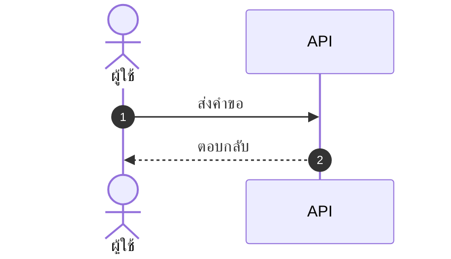

# skill: project-doc-set

Use when a new project needs its document set decided (which docs, in what order, who reads each, where docs, assets, mockups and qa sit). Scales the set to project size.

# ชุดเอกสารโปรเจกต์

> **กฎข้อเดียว:** เอกสารทุกชิ้นต้องตอบได้ว่า **ใครอ่าน** และ **อ่านแล้วตัดสินใจอะไร**
> ตอบไม่ได้ = ไม่ต้องเขียน

---

## เมื่อไหร่ใช้ skill นี้

- เปิดโปรเจกต์ใหม่ แล้วต้องตัดสินว่าจะมีเอกสารอะไรบ้าง
- โปรเจกต์เดิมมีเอกสารกระจัดกระจาย ไม่รู้ว่าอันไหนเป็นตัวจริง
- ลูกค้าถามว่า "ส่งมอบเอกสารอะไรบ้าง"
- จะเริ่มเขียนเอกสารสักชิ้น แต่ไม่แน่ใจว่าต้องมีอะไรมาก่อน

## เมื่อไหร่ **ไม่** ใช้

| สถานการณ์ | ใช้แทน |
|---|---|
| โครงโฟลเดอร์ของ**โค้ด** · README · CHANGELOG · linter · โครงเอกสารแบบ A | `project-bootstrap` |
| ตั้ง**ชื่อไฟล์** และเลขเวอร์ชันของเอกสาร | `document-naming` |
| ลงมือเขียนเอกสารชิ้นใดชิ้นหนึ่ง | skill ของเอกสารนั้น (ตารางข้อ 4) |
| จัดรูปแบบหน้าเอกสารให้สวย | `branded-document-design` |

---

## 1 · เอกสารอยู่ในหรืออยู่นอก repo

**ตัดสินข้อนี้ก่อน** เพราะย้ายทีหลังคือ rewrite ลิงก์ทั้งโปรเจกต์

**ค่าเริ่มต้นคือแบบ B** — โค้ดอยู่ในโฟลเดอร์ `<project-name>/` (ชื่อโปรเจกต์ตัวพิมพ์เล็กคั่น `-`) แม้เอกสารจะเป็น markdown ล้วน · แบบ A ใช้เมื่อผู้ใช้ขอเท่านั้น

| | **แบบ A — เอกสารอยู่ใน repo** | **แบบ B — เอกสารอยู่นอก repo** |
|---|---|---|
| เลือกเมื่อ | เอกสารเป็น markdown ทั้งหมด · ผู้อ่านคือทีมพัฒนา | มี `.docx` / `.xlsx` / mockup / รูป PNG ที่ลูกค้าต้องเห็น |
| ตรงกับชุด | S · M | M · L |
| โครง | ดู **`project-bootstrap` ข้อ 1** — เป็นเจ้าของโครงนี้ | ดูโครงข้างล่าง |
| ข้อดี | เอกสารกับโค้ดเปลี่ยนใน pull request เดียวกัน | pull request ไม่เต็มไปด้วยไฟล์ binary |

> โปรเจกต์ที่เริ่มเป็นแบบ A แล้วโตจนมีเอกสารส่งมอบ ให้ย้ายเป็นแบบ B **ทั้งชุดในครั้งเดียว**
> ห้ามอยู่กึ่งกลาง — เอกสารสองที่คือเอกสารสองเวอร์ชัน

### โครงของแบบ B

```
<ชื่อโปรเจกต์>/
├─ ref/                 ของที่ได้รับมา — TOR · บันทึกประชุม · ภาพหน้าจอระบบเดิม · ไฟล์จากลูกค้า  **อ่านอย่างเดียว ห้ามแก้**
├─ docs/                เอกสารทุกชิ้นที่เราเขียน — .docx ส่งมอบ และ .md เชิงเทคนิค อยู่ด้วยกัน
│  ├─ figures/          รูปที่ export แล้ว — .png เท่านั้น        [มีเมื่อมีรูปในเอกสารส่งมอบ]
│  │  └─ src/           ไฟล์ต้นทางของรูป (.html · .mmd · .drawio)
│  ├─ decisions/        ADR — หนึ่งการตัดสินใจต่อไฟล์              [ทางเลือก]
│  └─ research/         research แอปต้นแบบ (`reference-app-research`) [ทางเลือก]
├─ mockup/              .html ที่เปิดแล้วกดได้จริง
├─ qa/                  test case · ผลทดสอบ · bugs/ รายงานบั๊ก
├─ assets/              โลโก้ · ไอคอนทุกขนาด · favicon · wordmark (ต้นทาง .svg + ไฟล์ export)
├─ _to_delete/          ของชั่วคราวทุกอย่าง
├─ .claude/            skill ของโปรเจกต์ (เช่น verify) — ต้องอยู่ที่ที่เปิด Claude Code
└─ <project-name>/      repo โค้ด ชื่อโปรเจกต์ตัวพิมพ์เล็กคั่น `-` — โครงข้างในเป็นของ `project-bootstrap`
```

**โฟลเดอร์เหล่านี้สร้างเมื่อมีของจริง ไม่สร้างเผื่อ:**

| โฟลเดอร์ | สร้างเมื่อ | ถ้าไม่มี ของไปอยู่ไหน |
|---|---|---|
| `ref/` | ได้รับไฟล์จากลูกค้าหรือจากระบบเดิม | ไม่มีอะไรให้เก็บ — ห้ามเอาไฟล์ลูกค้าไปปนใน `docs/` เพราะจะแยกไม่ออกว่าอะไรเราเขียน |
| `docs/figures/` | มีรูปที่วาดเองและไปอยู่ในเอกสารส่งมอบ | รูปฝังอยู่ในไฟล์ `.docx` อย่างเดียว — แก้ทีหลังไม่ได้ |
| `docs/decisions/` | มีการตัดสินใจทางเทคนิคที่ต้องอธิบายทีหลัง | เหตุผลอยู่ใน Architecture หัวข้อเดียว |
| `docs/research/` | ผู้ใช้บอกว่าอยากได้แอปแบบเดียวกับแอปที่มีอยู่ | ไม่มี research |
| `qa/` | มี test case (เกือบทุกโปรเจกต์) — test case อยู่ที่นี่เสมอ `.md` หรือ `.xlsx` สำหรับขนาด L | — `docs/test-plan.md` มีแค่แผน ไม่มีรายการ test case |
| `assets/` | มีโลโก้หรือไอคอนของโปรเจกต์ | — |

**กฎของโฟลเดอร์ (ใช้ได้ทั้งสองแบบ):**

- **`.docx` กับ `.md` อยู่ใน `docs/` เดียวกันได้** ไม่ต้องแยกโฟลเดอร์ — นามสกุลบอกอยู่แล้วว่าใครอ่าน
- **ไฟล์ต้นทางของรูปห้ามหาย** — ปีหน้าต้องแก้รูป ถ้าเหลือแต่ PNG คือวาดใหม่ทั้งใบ
- **ทุกปุ่มใน mockup ต้องกดได้จริง** ปุ่มหลอกทำให้รีวิวผิด
- **`.docx` / `.xlsx` อยู่ใน `docs/` และ `qa/` เท่านั้น** ไม่กระจายไปรากโปรเจกต์
- **ของชั่วคราวลง `_to_delete/`** (`temp-file-discipline`)
- **`docs/README.md` เป็นสารบัญ** บอกว่าอ่านอะไรก่อนและใครเป็นเจ้าของ — รูปแบบตารางอยู่ใน `project-bootstrap` ข้อ 1

---

## 2 · เลือกชุดเอกสารตามขนาดงาน

ขนาดวัดจาก **ระยะเวลา × จำนวนคนที่ต้องเห็นพ้องกัน** ไม่ใช่จำนวนบรรทัดโค้ด

| ขนาด | ความหมาย |
|---|---|
| **S** | ≤ 2 สัปดาห์ · ทีมเดียว · ไม่มีใครนอกทีมต้องเซ็น |
| **M** | 1–3 เดือน · มีผู้ว่าจ้างภายใน · ส่งมอบเป็นรอบ |
| **L** | > 3 เดือน · ลูกค้าภายนอกเซ็นรับ · มีข้อผูกพันตามสัญญา |

### 2.1 · เอกสารส่งมอบ — คนอ่านและเซ็น

| เอกสาร | รูปแบบ | ผู้อ่าน | S | M | L |
|---|---|---|:-:|:-:|:-:|
| Project Plan | `.docx` | ผู้ว่าจ้าง · ทีม | ○ | ● | ● |
| SRS | `.docx` | dev · ผู้ว่าจ้าง | ○ | ● | ● |
| Architecture | `.docx` | dev · ops | ○ | ● | ● |
| Test Plan | `.docx` | QA · ผู้ว่าจ้าง | ○ | ● | ● |
| User Guide | `.docx` → `.pdf` | ผู้ใช้ปลายทาง | ○ | ● | ● |
| FSD | `.docx` | dev · QA | ○ | ○ | ● |
| BRD | `.docx` | ฝ่ายธุรกิจ | ○ | ○ | ● |
| Document Checklist | `.docx` | ทุกฝ่าย | ○ | ○ | ● |
| Test Cases | `.xlsx` | QA | ○ | ○ | ● |

● ต้องมี · ○ ไม่ต้อง เว้นแต่มีเหตุผลเฉพาะ
**ชุด S ไม่มีเอกสารกลุ่มนี้เลย** และนั่นถูกแล้ว — งานสองสัปดาห์ที่มาพร้อม BRD คือเอกสารที่เขียนให้ตัวเองอ่าน

---

### 2.2 · เอกสารเชิงเทคนิค — ทีมและ agent ใช้ระหว่างสร้าง

กลุ่มนี้เป็น **markdown ทั้งหมด** และ**ไม่ได้ขึ้นกับขนาดงาน** แต่ขึ้นกับว่าโปรเจกต์มีอะไร

| เอกสาร | ไฟล์ | ตอบคำถามว่า | ต้องมีเมื่อ |
|---|---|---|---|
| README | `<project-name>/README.md` | ติดตั้งและรันยังไง | **เสมอ** |
| BUILD-PLAN | `docs/BUILD-PLAN.md` | จะสร้างอะไรก่อนหลัง · ตอนนี้ถึงไหนแล้ว | **เสมอ** |
| AGENT-LOOP | `docs/AGENT-LOOP.md` | agent ทำงานเป็นวงจรแบบไหน · อะไรคือเงื่อนไขว่าจบ | ให้ agent เขียนโค้ดเป็นรอบ ๆ (`spec-to-code-loop`) |
| API-SPEC | `docs/API-SPEC.md` | endpoint ไหนรับอะไร คืนอะไร พังยังไง | มี API ที่คนอื่นเรียก (`api-conventions`) |
| DATA-DICTIONARY | `docs/DATA-DICTIONARY.md` | ฟิลด์นี้แปลว่าอะไร · ค่าที่เป็นไปได้มีอะไรบ้าง | มีฐานข้อมูลหรือสคีมาข้อมูล (`database-design`) |
| EVALUATION-POLICY | `docs/EVALUATION-POLICY.md` | วัดว่าผลลัพธ์ดีพอหรือยังด้วยอะไร · เกณฑ์ผ่านเท่าไร | ผลลัพธ์มาจากโมเดลหรือ LLM ที่ไม่ได้ถูกเสมอ |
| PROMPT-LIBRARY | `docs/PROMPT-LIBRARY.md` | prompt ตัวจริงคือตัวไหน เวอร์ชันอะไร เปลี่ยนอะไรไป | ใช้ LLM ในเส้นทางหลักของระบบ |
| ADR | `docs/decisions/ADR-*.md` | ทำไมถึงเลือกทางนี้ ไม่เลือกทางนั้น | มีการตัดสินใจที่จะถูกถามซ้ำ (`adr-writer`) |
| Runbook | `docs/runbook.md` | ระบบล่มตอนตีสองต้องทำอะไร | มีระบบที่รันอยู่จริงและมีคนอยู่เวร |

> **สี่ตัวล่างที่มีเงื่อนไข LLM/API/ฐานข้อมูล เป็นตัวที่คนลืมบ่อยที่สุด**
> แล้วไปจบด้วยการถาม agent ซ้ำทุกรอบว่า "prompt ตัวไหนคือตัวจริง" หรือ "ฟิลด์นี้แปลว่าอะไร"

---

## 3 · ลำดับการเขียน

**สายส่งมอบ** — ห้ามข้ามขั้น

```
Project Plan ─► BRD ─► SRS ─┬─► mockup
                            └─► Architecture ─► FSD
                                                 │
              User Guide ◄─ Test Cases ◄─ Test Plan
```

**ห้ามเขียนชิ้นถัดไปก่อนชิ้นก่อนหน้าได้รับการยืนยัน** — เขียนล่วงหน้าแล้วต้องรื้อทั้งสาย
ข้อยกเว้นเดียว: **mockup ทำคู่ไปกับ SRS ได้** เพราะภาพหน้าจอช่วยให้ SRS ถูกยืนยันเร็วขึ้น

**สายเทคนิค** — เขียนเมื่อถึงจุดที่ต้องใช้ ไม่ต้องรอใคร

| เขียนเมื่อ | เอกสาร |
|---|---|
| ก่อนเขียนโค้ดบรรทัดแรก | README · BUILD-PLAN |
| ก่อนปล่อย agent ทำงานเป็นรอบ | AGENT-LOOP |
| ตอนออกแบบตารางแรก | DATA-DICTIONARY |
| ตอนออกแบบ endpoint แรก | API-SPEC |
| ตอนเขียน prompt ตัวแรกที่จะใช้จริง | PROMPT-LIBRARY · EVALUATION-POLICY |
| ตอนตัดสินใจเรื่องที่จะถูกถามซ้ำ | ADR |
| ก่อนขึ้นระบบจริง | Runbook |

> **ADR กับ DATA-DICTIONARY เขียนตอนที่ตัดสินใจ ไม่ใช่ตอนสรุปท้ายโปรเจกต์**
> เขียนย้อนหลังได้แต่เหตุผลจริงหายไปแล้ว

---

## 4 · ใครเขียนชิ้นไหน ด้วย skill อะไร

| เอกสาร | agent | skill ที่ใช้ |
|---|---|---|
| README · CHANGELOG | `technical-writer` | `project-bootstrap` |
| Project Plan | `project-manager` | `branded-document-design` |
| BRD · user story | `business-analyst` | `user-story-writer` |
| SRS | `system-analyst` | `srs-writing` |
| FSD | `system-analyst` | `fsd-writing` |
| Architecture | `solution-architect` | `architecture-patterns` · `diagram-figures` |
| ADR | `solution-architect` | `adr-writer` |
| Test Plan · Test Cases | `qa-tester` | `test-case-template` |
| mockups | `ux-designer` | `web-app-design` · `ui-craft` |
| User Guide | `technical-writer` | `polished-document-style` |
| Runbook | `devops-engineer` | `incident-runbook-template` |
| BUILD-PLAN | `project-manager` | `simplicity-first` |
| AGENT-LOOP | `developer` | `spec-to-code-loop` |
| API-SPEC | `system-analyst` | `api-conventions` |
| DATA-DICTIONARY | `system-analyst` | `database-design` |
| PROMPT-LIBRARY · EVALUATION-POLICY | `developer` | — (คู่กับ skill `llm-engineering`) |

---

## 5 · รูปในเอกสาร — เลือกให้ถูกตั้งแต่ต้น

| รูปนี้ใครเห็น | วาดด้วย | เก็บที่ |
|---|---|---|
| อยู่ใน README · PR · เอกสารในทีม | Mermaid (`software-diagrams`) | ฝังในไฟล์ `.md` |
| อยู่ในเอกสารที่ลูกค้าเซ็น · สไลด์ · งานพิมพ์ | `diagram-figures` | `docs/figures/` + ต้นทางใน `src/` |

> **รูป Mermaid ค่าเริ่มต้นห้ามเข้าเอกสารส่งมอบ** — สีที่สุ่มตามชนิด node ไม่ได้แปลว่าอะไร
> ตัวหนังสือภาษาไทยล้นกรอบ และย่อลงหน้า A4 แล้วอ่านไม่ออก

**หัวรูปทุกใบต้องมีครบห้าอย่าง** — ชื่อ · คำขยายหนึ่งบรรทัด · เลขรูป · เวอร์ชันกับวันที่ · เจ้าของ
รูปสถาปัตยกรรมถูกก๊อปไปวางในอีเมลและสไลด์แล้วอยู่ต่ออีกเป็นปี **รูปที่ไม่มีวันที่ ไม่มีใครกล้าแก้**

---

## 6 · ธีมสีของชุดเอกสาร

ประกาศครั้งเดียวต่อโปรเจกต์ บนหัวไฟล์ต้นทางของทุกเอกสาร:

```markdown
<!-- doc-theme: accent=#5B4BE8 -->
```

`branded-document-design` · `presentation-design` · `diagram-figures` · `svg-diagram-system`
อ่านค่านี้แทนการเลือกสีเอง — เอกสาร สไลด์ และรูปทุกใบจึงเป็นชุดเดียวกัน

**สีมาจากเนื้องาน ไม่ใช่จากรสนิยม** — มีสีแบรนด์แล้วใช้สีแบรนด์ · ยังไม่มีให้เสนอโทนแล้วรอยืนยัน
ข้อยกเว้นที่ไม่เปลี่ยนตามธีม: สีโลโก้ผู้ให้บริการ · เทาโครงสร้าง · เขียวผ่าน/แดงไม่ผ่าน

---

## 7 · รายการตรวจก่อนส่งมอบชุดเอกสาร

- [ ] ทุกไฟล์ `.docx` เปิด Navigation Pane แล้ว**เห็นหัวข้อครบ** (ใช้ Heading style จริง ไม่ใช่ตัวหนา)
- [ ] ทุกเอกสารมีหน้าประวัติการแก้ไข · เลขเวอร์ชัน · วันที่ · ผู้จัดทำ
- [ ] ทุกรูปมีเลขรูปและถูกอ้างในเนื้อความอย่างน้อยหนึ่งครั้ง
- [ ] ไฟล์ต้นทางของทุกรูปอยู่ใน `docs/figures/src/` (ถ้ามีโฟลเดอร์นี้)
- [ ] เอกสารเชิงเทคนิคที่เข้าเงื่อนไขในข้อ 2.2 มีครบ — มี API ต้องมี API-SPEC · ใช้ LLM ต้องมี PROMPT-LIBRARY
- [ ] ตัวย่อทุกตัวกางเต็มครั้งแรกที่ปรากฏ
- [ ] ชื่อไฟล์ตรงตาม `document-naming` — ไม่มี `final2` ไม่มี `ล่าสุด`
- [ ] เอกสารในชุดอ้างเวอร์ชันของกันและกันตรงกัน
- [ ] `_to_delete/` ว่าง หรือถูกลบไปแล้ว

---

## 8 · Anti-patterns

- ❌ **เขียน BRD ให้งานสองสัปดาห์** — ข้อ 2
- ❌ **เอกสาร `.docx` ที่ไม่มี Heading style สักอัน** — navigation pane ว่าง หา TOC ไม่ได้ ไม่มีลำดับชั้น
- ❌ **เก็บแต่ PNG ไม่เก็บไฟล์ต้นทาง** — ข้อ 1
- ❌ **เก็บ `.docx` และ mockup ไว้ใน repo โค้ด** เพราะ "จะได้อยู่ที่เดียว" — pull request จะเต็มไปด้วย binary · ถ้าถึงจุดนี้แปลว่าต้องย้ายเป็นแบบ B (ข้อ 1)
- ❌ **เอกสารอยู่สองที่พร้อมกัน** — ครึ่งหนึ่งใน repo ครึ่งหนึ่งนอก repo คือเอกสารสองเวอร์ชัน
- ❌ **เขียน FSD ก่อน SRS ได้รับการยืนยัน**
- ❌ **มี mockup ที่ปุ่มกดไม่ได้** — ผู้รีวิวเข้าใจว่าทำได้แล้ว
- ❌ **ใช้ LLM แต่ไม่มี PROMPT-LIBRARY** — prompt ตัวจริงอยู่ในโค้ด แก้แล้วไม่มีใครรู้ว่าเปลี่ยนอะไร
- ❌ **สร้าง `qa/` `decisions/` `figures/` ทิ้งไว้ว่าง ๆ** เพราะ "ในแบบมี" — โฟลเดอร์ว่างทำให้คนคิดว่าของหาย
- ❌ **เอกสารชิ้นเดียวตอบทุกคำถาม** — SRS ที่มีทั้ง timeline ทั้ง test case คือเอกสารที่ไม่มีใครอ่านจบ

---

## 9 · ตัวย่อ

- **ADR** — Architecture Decision Record
- **BRD** — Business Requirements Document
- **FSD** — Functional Specification Document
- **QA** — Quality Assurance
- **SRS** — Software Requirements Specification
- **TOC** — Table of Contents

---

## 10 · เชื่อมกับ skill อื่น

| ต้องการ | ใช้คู่กับ |
|---|---|
| โครงโฟลเดอร์ของโค้ด · README · สารบัญ `docs/README.md` | `project-bootstrap` |
| ตั้งชื่อไฟล์และจัดเวอร์ชัน | `document-naming` |
| จัดรูปแบบหน้าเอกสาร | `branded-document-design` · `polished-document-style` |
| วาดรูปให้ดูออกแบบมา | `diagram-figures` |
| เลือกว่าจะวาดรูปด้วยอะไร | `software-diagrams` |
| ของชั่วคราวและการเก็บกวาด | `temp-file-discipline` |
| ตารางสถานะเอกสารและงานเมื่อจบแต่ละฉบับ (ลง `docs/BUILD-PLAN.md`) | `status-report` |
| รายการตรวจฉบับพิมพ์ | `assets/doc-set-checklist.md` |


---

# skill: polished-document-style

Use when producing stakeholder-facing documents (BRD, FSD, ADR, status reports, audits, postmortems) that need polished formatting. Rich Markdown and Mermaid conventions that render well in GitHub, Notion, VS Code and Obsidian.

# Polished Document Style

## When to use this skill

- Output is meant for **non-developers** to read (PMs, executives, clients)
- Document needs **sign-off** or formal review
- Output will be **shared widely** or converted to PDF/Word later
- Any doc with 3+ sections or 500+ words

## When NOT to use

- Internal developer-only specs (keep them concise)
- Quick scratch notes
- Code comments / inline docs

> ℹ️ **Note:** This skill governs the *markdown source*. When the deliverable is a
> rendered **.docx / .pptx / .pdf** that a stakeholder will open, use
> `branded-document-design` on top of it — that skill carries the design tokens,
> the typography scale, Thai typography rules, and the `brandkit.py` builder.

---

## Document Header (Always)

Every polished doc MUST start with:

```markdown
# 📋 <Document Title>

> **Version:** 1.0 · **Date:** YYYY-MM-DD · **Status:** 🟡 Draft
> **Authors:** <names> · **Reviewers:** <names>
> **Tags:** `<area>` `<topic>`

---
```

Status values:
- 🟡 **Draft** — work in progress
- 🔵 **Review** — under stakeholder review
- 🟢 **Approved** — signed off
- ⚪ **Archived** — historical reference

---

## Section Hierarchy

- **H1** — Document title (exactly one)
- **H2** — Numbered sections (`## 1. Section`)
- **H3** — Sub-sections (`### 1.1 Sub-topic`)
- **H4** — Rare, use only if needed

**Always add Table of Contents** for docs with 5+ sections:

```markdown
## 📑 Table of Contents

1. [Executive Summary](#1-executive-summary)
2. [Scope](#2-scope)
3. [Details](#3-details)
```

---

## ธีมของเอกสาร — ตัดสินใจครั้งเดียว ใช้ทุกที่ในเอกสารนั้น

เอกสารหนึ่งฉบับผ่านมือหลาย skill — markdown ตัวนี้ · รูปจาก `software-diagrams` ·
ไฟล์ .docx จาก `branded-document-design` · สไลด์จาก `presentation-design`
ถ้าแต่ละตัวเลือกสีเอง ผู้อ่านจะได้เอกสารที่รูปสีหนึ่ง หัวข้อสีหนึ่ง และสไลด์อีกสีหนึ่ง

**markdown คือ source of truth ธีมจึงประกาศไว้ที่นี่** — ใส่ไว้ท้ายส่วนหัวของเอกสารหรือในไฟล์ข้างกัน:

```markdown
<!-- doc-theme: accent=<สีหลัก> · ที่มา=<แบรนด์ลูกค้า / เสนอจากเนื้องาน> · ยืนยันเมื่อ=YYYY-MM-DD -->
```

**สีหลักมาจากเนื้องาน ไม่ใช่จากค่าเริ่มต้นของเครื่องมือ**
มีสีแบรนด์อยู่แล้วใช้สีนั้น · ยังไม่มีให้เสนอโทนจากเนื้องานแล้วรอผู้ใช้ยืนยัน
(ตารางเนื้องาน → โทน อยู่ใน `svg-diagram-system` ข้อ 0)

| ส่วนของเอกสาร | ใครคุมสี | อ่านค่าจาก |
|---|---|---|
| หัวข้อ ตาราง กล่องข้อความใน markdown | markdown ไม่มีสี ใช้อิโมจิและน้ำหนักตัวอักษรแทน | — |
| ไดอะแกรม Mermaid | `software-diagrams` ข้อ 2 | `doc-theme` |
| รูปที่เป็นไฟล์ภาพ | `svg-diagram-system` · `diagram-figures` | `doc-theme` |
| ไฟล์ .docx / .pdf ที่ส่งออก | `branded-document-design` ข้อ 0–1 | `doc-theme` |
| สไลด์ | `presentation-design` | `doc-theme` |

**สีสถานะไม่นับรวม** — 🔴 วิกฤต 🟢 ผ่าน ต้องคงความหมายเดิมไม่ว่าธีมจะเป็นสีอะไร

### ค่าตั้งต้นประจำบ้าน (house default)

ถ้า `doc-theme` ยังไม่ประกาศ accent เฉพาะงาน ทุก skill ใช้ชุดนี้เป็นค่าตั้งต้น เพื่อให้รูป เอกสาร และสไลด์เป็นชุดสีเดียวกันตั้งแต่แรก ชุดนี้คือชุดเดียวกับ `presentation-design` และ `branded-document-design`:

| token | ค่า | ใช้กับ |
|---|---|---|
| brand | `#2A78D6` | สีหลัก · หัวข้อ · เส้น accent |
| brand-deep | `#2A4C86` | หัวตาราง · H2 · ชื่อระบบ |
| brand-2 | `#6A5CD6` | accent รอง (ม่วง) |
| tint | `#EDF1FB` | พื้นหัวตาราง · พื้นกล่องเน้น |
| ink / body | `#333B4A` / `#414957` | หัวข้อ / เนื้อความ |
| muted / faint | `#7D8492` / `#A9AEB9` | คำบรรยาย / หมายเหตุ |
| line | `#E4E7EE` | เส้นขอบ · เส้นเชื่อม |
| exception | `#C77A11` | ทาง/โซนที่ไม่ใช่เส้นทางหลัก (ต่างจาก brand เสมอ) |
| ฟอนต์ | Tahoma (เอกสาร/สไลด์) · Noto Sans Thai → Tahoma (ภาพ) | ทั้งไทยและอังกฤษ |

ประกาศ accent เฉพาะงานเมื่อไร ให้ค่านั้นทับ brand ส่วนที่เหลือคำนวณจาก accent เดียว

---

## Emoji Vocabulary

ใช้ให้**คงที่ทั้งเอกสาร** และใช้เพื่อ**หาของเจอเร็วขึ้น** ไม่ใช่เพื่อความน่ารัก

| ใช้ทำอะไร | ชุดที่ใช้ |
|---|---|
| ระดับความสำคัญ | 🔴 วิกฤต · 🟠 สูง · 🟡 กลาง · 🟢 ต่ำ |
| สถานะ | ✅ เสร็จ · 🚧 กำลังทำ · ⏳ รอ · ❌ ไม่ผ่าน · ⚠️ ต้องระวัง |
| ชนิดกล่องข้อความ | 💡 ข้อแนะนำ · 📌 ข้อควรจำ · 🚨 อันตราย · 📋 รายการตรวจ |
| หมวดเนื้อหา | 🎯 เป้าหมาย · 🏗️ สถาปัตยกรรม · 🔐 ความปลอดภัย · 📊 ตัวเลข · 🧪 การทดสอบ |

**หนึ่งอิโมจิต่อหัวข้อ ไม่ใช่ต่อบรรทัด** — เอกสารที่ทุกบรรทัดมีอิโมจิอ่านยากกว่าเอกสารที่ไม่มีเลย

---

## Callout Boxes

Use blockquotes with emoji prefix:

```markdown
> 💡 **Tip:** Brief actionable insight.

> ⚠️ **Warning:** Important caveat or limitation.

> 🚨 **Critical:** Must-read before proceeding.

> ℹ️ **Note:** Additional context or background.

> ❓ **Open Question:** Needs decision/clarification.
```

**Rules:**
- Keep callouts to 1-3 sentences
- One callout per topic — don't stack
- Don't overuse — max 3-5 per page

---

## Tables — When and How

### When to use tables instead of bullets

Use tables when items have **2+ attributes**:

❌ Don't use bullets:
```markdown
- email: string, required, unique
- age: number, optional
- role: enum, required, default "user"
```

✅ Use a table:
```markdown
| Field | Type   | Required | Default | Description       |
|-------|--------|:--------:|:-------:|-------------------|
| email | string | ✅       | —       | Unique login email|
| age   | number | ❌       | —       | Optional          |
| role  | enum   | ✅       | `user`  | Access level      |
```

### Table formatting tips

- Left-align text, center checkmarks/numbers, right-align money
- Use `—` (em dash) for "not applicable", not `-` or blank
- Keep cells short — long content goes in body paragraphs
- Bold key columns: `**email**`

---

## Mermaid Diagrams

**ตัวเลือกชนิดไดอะแกรม กติกาความอ่านง่าย ธีม และการจัดการป้ายภาษาไทย อยู่ใน `software-diagrams`**
skill นี้คุมเฉพาะเรื่องการวางไดอะแกรมลงในเอกสาร markdown

- วางไว้**หลังย่อหน้าที่อธิบายว่ารูปนี้ตอบคำถามอะไร** ไม่ใช่ลอยขึ้นมาเฉย ๆ
- ทุกรูปมีคำบรรยายใต้รูปหนึ่งบรรทัด ขึ้นต้นด้วย **รูปที่ N —**
- รูปเดียวกันอย่าใส่ซ้ำหลายที่ในเอกสาร ให้อ้างถึงเลขรูปแทน
- รูปที่ต้องส่งให้คนนอกทีมหรือใส่สไลด์ ใช้ `svg-diagram-system` แล้วฝังเป็นไฟล์ภาพ

````markdown

````

*รูปที่ 3 — ลำดับการเรียกเมื่อผู้ใช้กดบันทึก*

---

## Status Badges (Inline)

For key fields in headers/tables:

```markdown
**Status:** 🟢 Approved
**Priority:** 🔴 High
**Risk Level:** 🟡 Medium
**SLA:** ⚡ < 200ms
```

Multiple badges in a header:

```markdown
> 🟢 **Approved** · 🔴 **High Priority** · 👤 @alice · 🗓️ Due 2025-03-15
```

---

## Cover Block Pattern

For formal documents (BRD, FSD, ADR, postmortem):

```markdown
# 📋 <Title>

| | |
|--|--|
| **Document Type** | BRD \| FSD \| ADR \| Postmortem |
| **Version** | 1.2 |
| **Status** | 🟢 Approved |
| **Date** | 2025-01-15 |
| **Author(s)** | @alice, @bob |
| **Reviewer(s)** | @charlie |
| **Related** | [BRD-001](link), [FSD-005](link) |

---
```

---

## Comparison / Decision Tables

For trade-off analysis (architect, PM, SEO recommendations):

```markdown
| Option | Cost | Effort | Risk | Time-to-Value | Recommendation |
|--------|:----:|:------:|:----:|:-------------:|:--------------:|
| **A**  | 💰💰 | 🟡 Med | 🟢 Low | 🟢 Fast | ✅ Recommended |
| B      | 💰   | 🟢 Low | 🔴 High | 🟡 Med | ❌ Not recommended |
| C      | 💰💰💰| 🔴 High| 🟢 Low | 🔴 Slow | ⚪ Future consideration |
```

---

## Lists — When to nest, when to flatten

### ✅ Good list
```markdown
- Email is unique across all users
- Passwords must be 8+ characters with mixed case
- Sessions expire after 30 days of inactivity
```

### ❌ Bad list (over-nested)
```markdown
- Users
  - Email
    - Must be unique
    - Required
  - Password
    - 8+ chars
    - Mixed case
```

→ Should be a table instead.

**Rule:** Max 2 levels of nesting. More nesting = use a table.

---

## Code Blocks

Always specify language:

````markdown
```typescript
const user: User = { id: 1, email: 'a@b.com' };
```

```bash
npm install
```

```sql
SELECT * FROM users WHERE id = $1;
```
````

For long blocks, add file name as comment on first line:

```typescript
// src/services/auth.ts
export async function login(email: string, password: string) {
  // ...
}
```

---

## Approval/Sign-off Section (End of Doc)

For documents needing formal approval:

```markdown
## ✍️ Sign-off

| Role | Name | Status | Date |
|------|------|:------:|------|
| Product Owner | @alice | 🟢 Approved | 2025-01-15 |
| Tech Lead | @bob | 🔵 Reviewing | — |
| QA Lead | @charlie | ⚪ Not started | — |
| Security | @dave | ❌ Rejected | 2025-01-14 |
```

---

## Glossary Section

For docs with 5+ technical terms:

```markdown
## 📖 Glossary

| Term | Definition |
|------|------------|
| **API** | Application Programming Interface |
| **JWT** | JSON Web Token, used for stateless auth |
| **SLA** | Service Level Agreement |
```

Define acronyms on first use, then add to glossary.

---

## Quality Checklist

Before delivering any polished doc:

- [ ] H1 title with emoji marker
- [ ] Cover block with version, date, status, authors
- [ ] TOC if 5+ sections
- [ ] All sections numbered consistently
- [ ] Anchor links in TOC actually work
- [ ] Status badges where applicable
- [ ] Tables used (not bullets) where data has 2+ attributes
- [ ] At least one Mermaid diagram for any flow/relationship
- [ ] Callout boxes for tips/warnings (not just paragraphs)
- [ ] Code blocks have language hints
- [ ] Glossary for docs with 5+ acronyms
- [ ] No placeholder text (TBD, TODO, Lorem ipsum)
- [ ] Tested rendering in GitHub preview

---

> ไดอะแกรมในเอกสาร: ชนิดไหนตอบคำถามไหน และธีม Mermaid ชุดเดียวกันทั้งโปรเจกต์
> อยู่ใน `software-diagrams` · เอกสาร SRS โดยเฉพาะอยู่ใน `srs-writing`

## Anti-patterns


- ❌ **Emoji spam** — emoji in every heading just for decoration
- ❌ **All emoji, no labels** — `🔴 High` reads better than `🔴` alone
- ❌ **Deep nesting** — bullets 4+ levels deep, use tables instead
- ❌ **Walls of text** — paragraphs longer than 5 lines
- ❌ **Inconsistent terminology** — "user" in one section, "customer" in next
- ❌ **Diagrams that duplicate text** — diagram should add insight, not repeat
- ❌ **Tables of paragraphs** — if cells are >2 sentences, use headings instead
- ❌ **Skipping the cover block** — readers need version/status/date

---

## ตัวย่อ

เขียนตัวย่อเต็มครั้งแรกเสมอ แล้ววงเล็บตัวย่อไว้ — เช่น Model Context Protocol (MCP)
หลังจากนั้นใช้ตัวย่อได้ · รายละเอียดใน skill `spell-out-abbreviations`


---

# skill: markdown-visuals

Use when a markdown document needs a picture (wireframe, UI state, architecture, flow, data viz). Picks inline SVG, image, ASCII or Mermaid and embeds it so it renders in GitHub, Notion, VS Code and Obsidian.

# Markdown Visuals

> **Rule:** Every design, mockup, spec, or architecture doc must show — not just tell. If you wrote "the button sits top-right," you owe the reader a picture.

## When to use this skill

- Producing **any** design mockup, wireframe, or UI spec
- Writing FSD, BRD, ADR, or architecture docs that describe layout, flow, or relationships
- Explaining state transitions, user journeys, or system interactions
- Comparing 2+ visual options for the user
- The user said "make a mockup," "show me how it looks," or "design X"

**If the doc has zero visuals and is about anything visual or structural — stop and add one.**

---

## Decision tree: which format?

```
What are you showing?
│
├─ UI mockup / component state / icon       →  Inline SVG
├─ Layout sketch / box diagram / state map  →  ASCII art (boxes & arrows)
├─ Flow / sequence / decision tree          →  Mermaid (see polished-document-style)
├─ Architecture / ER / class                →  Mermaid
├─ Data viz (chart, pie, quadrant)          →  Mermaid pie/quadrant OR inline SVG
├─ Photo, screenshot, complex illustration  →  External file → 
└─ Quick concept in chat reply              →  Inline SVG or ASCII (no external file)
```

**Default to inline SVG** for anything that isn't a flow/sequence (use Mermaid for those). It renders everywhere, versions in git, doesn't bloat the repo with binaries, and the user can read/edit the markup.

---

## 1 · Inline SVG (primary technique)

### Boilerplate

```markdown
<p align="center">
<svg xmlns="http://www.w3.org/2000/svg" viewBox="0 0 640 280" role="img" aria-label="<what this shows>">
  <!-- background -->
  <rect width="640" height="280" rx="14" fill="#1c2230"/>

  <!-- content goes here -->
</svg>
</p>
```

**Required attributes:**
- `xmlns="http://www.w3.org/2000/svg"` — without this, GitHub may not render
- `viewBox` — sets the coordinate space; lets the SVG scale responsively
- `role="img"` + `aria-label` — accessibility, screen readers
- `<p align="center">` wrapper — centers in the rendered page

**Sizing:** Use `viewBox` (not width/height) so it scales. Common sizes:
- Mockup of a UI bar: `viewBox="0 0 640 200"` (wide, short)
- Component state: `viewBox="0 0 400 300"` (squarer)
- Icon / chip: `viewBox="0 0 64 64"`
- Full screen layout: `viewBox="0 0 800 500"`

### สี — มาจากเนื้องาน ไม่ใช่จากตารางสำเร็จรูป

**อย่าเลือกสีเอง** ถ้าเอกสารหรือโปรเจกต์มีชุดสีอยู่แล้ว ใช้ชุดนั้น
ถ้ายังไม่มี ให้เสนอโทนจากเนื้องานแล้วรอผู้ใช้ยืนยัน — การแพทย์เขียว · การเงินน้ำเงินเข้ม ·
อุตสาหกรรมเหลืองอำพัน · ราชการกรมท่า · ซอฟต์แวร์ทั่วไปน้ำเงิน (ตารางเต็มอยู่ใน `svg-diagram-system` ข้อ 0)

กำหนดเป็น **token ตามหน้าที่** ไว้บนสุดของเอกสาร แล้วใช้ค่าเดียวกันทุกรูปในเอกสารนั้น:

| Token | หน้าที่ | ได้มาจาก |
|---|---|---|
| `bg-canvas` | พื้นหลังของรูป | เฉดเข้มสุด (โหมดมืด) หรืออ่อนสุด (โหมดสว่าง) |
| `bg-surface` | แผ่น พาเนล การ์ด | ต่างจาก canvas พอให้เห็นขอบโดยไม่ต้องตีเส้น |
| `bg-elevated` | ไทล์ที่ลอยขึ้นมาอีกชั้น | |
| `accent-primary` | จุดเน้น สถานะที่กำลังทำงาน | **สีหลักที่ผู้ใช้เลือก** |
| `text-primary` | ข้อความหลัก | contrast ≥ 4.5:1 กับพื้นที่มันวางอยู่ |
| `text-muted` | ข้อความรอง placeholder | `rgba(...,0.55)` ของ `text-primary` |
| `state-success` · `state-warning` · `state-danger` | สถานะ | **ไม่เปลี่ยนตามแบรนด์** — เขียวคือผ่าน แดงคือไม่ผ่านเสมอ |

**หนึ่งเอกสารใช้หนึ่งชุด** — รูปสิบรูปในเอกสารเดียวที่สีไม่ตรงกัน อ่านยากกว่ารูปที่ไม่สวยแต่สีตรงกัน

### Reusable SVG snippets

> ตัวอย่างข้างล่างใช้ชุดสีโหมดมืดชุดหนึ่งเป็นตัวแทนเท่านั้น
> **เปลี่ยนค่าสีให้ตรงกับชุดที่ตกลงไว้ก่อนใช้** โครงสร้างคือสิ่งที่ต้องคัดลอก ไม่ใช่ค่าสี

**Window chrome (desktop app mockup):**
```xml
<rect x="20" y="20" width="600" height="360" rx="10" fill="#2a3245"/>
<circle cx="42" cy="42" r="6" fill="#ff5f57"/>
<circle cx="62" cy="42" r="6" fill="#febc2e"/>
<circle cx="82" cy="42" r="6" fill="#28c940"/>
<text x="320" y="46" text-anchor="middle" fill="#fff" font-family="system-ui" font-size="12">Window title</text>
<line x1="20" y1="64" x2="620" y2="64" stroke="rgba(255,255,255,0.08)"/>
```

**Phone frame (mobile mockup):**
```xml
<rect x="100" y="20" width="200" height="400" rx="28" fill="#0a0d14" stroke="#2a3245" stroke-width="2"/>
<rect x="120" y="50" width="160" height="340" rx="6" fill="#1c2230"/>
<rect x="170" y="28" width="60" height="14" rx="7" fill="#0a0d14"/>
```

**Button:**
```xml
<rect x="40" y="100" width="120" height="40" rx="8" fill="#0078d4"/>
<text x="100" y="125" text-anchor="middle" fill="#fff" font-family="system-ui" font-size="14" font-weight="500">Click me</text>
```

**Card with title and body:**
```xml
<rect x="40" y="40" width="240" height="120" rx="12" fill="#2a3245"/>
<text x="60" y="72" fill="#fff" font-family="system-ui" font-size="14" font-weight="600">Card title</text>
<text x="60" y="96" fill="rgba(255,255,255,0.7)" font-family="system-ui" font-size="12">Supporting body text goes here.</text>
<rect x="60" y="116" width="80" height="28" rx="6" fill="#0078d4"/>
<text x="100" y="134" text-anchor="middle" fill="#fff" font-family="system-ui" font-size="12">Action</text>
```

**Status badge (top-right of tile):**
```xml
<circle cx="<tile-right-x>" cy="<tile-top-y>" r="9" fill="#e24b4a"/>
<text x="<tile-right-x>" y="<tile-top-y + 4>" text-anchor="middle" fill="#fff" font-family="system-ui" font-size="13" font-weight="500">!</text>
```

**Running dot (indicator below tile):**
```xml
<circle cx="<tile-center-x>" cy="<tile-bottom-y + 12>" r="4" fill="#4cc2ff"/>
```

**Tooltip text (no balloon — plain floating text):**
```xml
<text x="<tile-center-x>" y="<tile-top-y - 12>" text-anchor="middle" fill="#fff" font-family="system-ui" font-size="12" font-weight="500">Tooltip label</text>
```

### Worked example — UI state mockup

This is the pattern used in `DockXI/docs/12-design-mockup.md` and should be the default for showing UI feature states:

```markdown
## 2 · External image files

Use when:
- Photo or screenshot
- Illustration too complex to author as SVG by hand (50+ shapes)
- Reusing the same image across many docs
- Generated by a design tool (Figma export, etc.)

### Folder convention

```
docs/
  figures/
    01-hover-state.svg
    02-empty-state.png
    architecture-overview.svg
    src/                      editable sources (.mmd · .drawio · .html)
```

- Put figures in `docs/figures/` (editable sources in `docs/figures/src/`) — relative to the doc · brand files (logo, icons) live in the project-root `assets/`, not here
- Name files `<doc-section-number>-<short-slug>.<ext>` so they sort with the doc
- Prefer `.svg` over `.png` when possible (scales, smaller, diff-friendly)

### Reference syntax

```markdown

```

- **Alt text** describes what the image shows, for accessibility — not "screenshot.png"
- Path is **relative to the markdown file**, not absolute
- For centered + sized images, wrap in HTML:

```markdown
<p align="center">
  
</p>
```

### Creating SVG files

When the visual is too big to inline (>50 lines of SVG markup), save it as a file instead. Use the `Write` tool to create the SVG file alongside the doc.

---

## 3 · ASCII art

For quick layouts, state diagrams, and structural sketches that don't need pixel-perfect visuals. Renders identically in every viewer and in terminal/diff output.

### Box-drawing characters

```
┌─────┐  ┏━━━━━┓  ╭─────╮  ┌╌╌╌╌╌┐
│     │  ┃     ┃  │     │  ╎     ╎
└─────┘  ┗━━━━━┛  ╰─────╯  └╌╌╌╌╌┘
 light    heavy   rounded   dashed
```

Corners: `┌ ┐ └ ┘` ‧ `┏ ┓ ┗ ┛` ‧ `╭ ╮ ╰ ╯`
Lines:   `─ │` ‧ `━ ┃` ‧ `═ ║`
Joins:   `├ ┤ ┬ ┴ ┼`
Arrows:  `→ ← ↑ ↓ ▲ ▼ ▶ ◀ ↔ ↕ ⇒ ⇐`
Dots:    `• · ◦ ● ○ ▪ ▫`

### Common patterns

**Layout sketch:**
```
┌─────────────────────────────────────┐
│ Header        [Search]      [👤]    │
├──────────┬──────────────────────────┤
│ Sidebar  │ Main content             │
│  • Item  │                          │
│  • Item  │  ┌────────────────────┐  │
│          │  │  Primary CTA       │  │
│          │  └────────────────────┘  │
└──────────┴──────────────────────────┘
```

**State machine:**
```
┌─────────┐  hover  ┌──────────┐  click  ┌─────────┐
│  REST   │────────►│ MAGNIFIED│────────►│ LAUNCH  │
└─────────┘◄────────└──────────┘◄────────└─────────┘
            exit               done
```

**Curve / chart:**
```
scale
 ↑
1.7│         ╱╲
1.4│       ╱    ╲
1.2│     ╱        ╲
1.0│___╱            ╲___
   └──────────┬──────────→ cursor X
         tile.Center
```

Always wrap ASCII in a fenced code block (` ``` `) so spacing is preserved.

---

## 4 · Mermaid

**การเลือกชนิดไดอะแกรม ธีม กติกาความอ่านง่าย และป้ายภาษาไทย อยู่ใน `software-diagrams`**
ที่นี่บอกแค่ว่า *เมื่อไหร่ควรเลือก Mermaid แทนรูปแบบอื่น*

| เลือก Mermaid เมื่อ | เลือกอย่างอื่นเมื่อ |
|---|---|
| เป็นกล่องกับลูกศรที่เครื่องจัดวางให้ได้ | ต้องคุมตำแหน่งเอง → SVG หรือ `svg-diagram-system` |
| อยู่ในไฟล์ที่ต้อง diff ใน git | เป็นภาพหน้าจอจริง → ไฟล์ภาพ |
| ผู้อ่านเปิดใน GitHub หรือ Notion | ผู้อ่านเปิดในเอกสาร Word หรือสไลด์ → ไฟล์ภาพ |

---

## Combining formats in one doc

A full design spec usually mixes formats. Pattern from `DockXI/docs/12-design-mockup.md`:

```
1. Inline SVG mockup of each UI state              ← "what it looks like"
2. Feature reference table                          ← "what it does"
3. ASCII layout sketch with measurements           ← "how it's positioned"
4. Mermaid state diagram                            ← "how it transitions"
5. ASCII / inline-SVG zoom curve                    ← "the math"
6. Acceptance criteria table                        ← "how we verify"
```

Don't pick one format and force everything into it — each format has a sweet spot.

---

## Accessibility checklist

For every visual:

- [ ] **Inline SVG** has `role="img"` and `aria-label="<description>"`
- [ ] **Image file** has descriptive alt text (not "image.png")
- [ ] **Mermaid** diagrams have a 1-sentence caption above or below
- [ ] **ASCII art** has a prose summary nearby — screen readers will read the characters literally
- [ ] **Colour** is not the only signal — pair red badges with `!`, green dots with a label
- [ ] **Contrast** for text in SVG ≥ 4.5:1 against its background

---

## Anti-patterns

- ❌ **Text-only design docs** — "the icon is in the top-right" with no picture
- ❌ **Linking to Figma / external design tools as the only source** — visuals must render in the repo
- ❌ **PNG screenshots of text** — use the text, in a code block
- ❌ **SVG without `xmlns`** — GitHub silently fails to render
- ❌ **Inline SVG with 200+ lines** — extract to `assets/x.svg` and reference it
- ❌ **ASCII art outside a code fence** — proportional fonts will mangle alignment
- ❌ **Mixing Mermaid syntax versions** — stick to v10 syntax for GitHub compat
- ❌ **Generated images checked in without source** — commit the `.svg` source, not just the `.png` export
- ❌ **Decorative emoji as visuals** — emoji ≠ a mockup; pair them with real diagrams

---

## Quick-start recipe

When the user asks for a design / mockup:

1. **Identify what kinds of visuals are needed** (UI state? flow? architecture?)
2. **Pick the format(s)** using the decision tree above
3. **For each visual:**
   - State a one-line caption
   - Emit the SVG/Mermaid/ASCII
   - Add `role="img"` + `aria-label` (SVG) or alt text (file)
4. **Add a feature reference table** below the visuals — what each element means
5. **Cross-check accessibility checklist** before delivery

If unsure whether a visual will render, mention that the user should preview in GitHub/Notion to confirm.

---

## Related skills

- [[polished-document-style]] — overall doc formatting, Mermaid catalogue, callout boxes
- [[simplicity-first]] — don't over-design the diagram; show what's needed
- [[software-diagrams]] — which diagram type answers which question, plus the shared Mermaid theme
- [[ui-craft]] — spacing, hierarchy and states when the picture is a screen

---

## ตัวย่อ

เขียนตัวย่อเต็มครั้งแรกเสมอ แล้ววงเล็บตัวย่อไว้ — เช่น Model Context Protocol (MCP)
หลังจากนั้นใช้ตัวย่อได้ · รายละเอียดใน skill `spell-out-abbreviations`


---

# skill: branded-document-design

Use when the deliverable is a rendered Word, deck or PDF a stakeholder will look at and it must look designed. Token palette, type scale, tested python-docx and python-pptx builders, Thai typography.

# Branded Document Design

> **กฎข้อเดียวของ skill นี้:** เอกสารที่ส่งออกไปต้อง "ดูตั้งใจ" — มีระบบสี ระบบขนาดตัวอักษร
> และจังหวะช่องไฟที่ซ้ำเดิมทุกหน้า ไม่ใช่ Word ที่เปิดมาแล้วพิมพ์เลย

## เมื่อไหร่ใช้ skill นี้

- ผลลัพธ์คือ **.docx / .pptx / .pdf** ที่ลูกค้า ผู้บริหาร หรือทีมอื่นจะเปิดดู
- เอกสารต้อง **เซ็นอนุมัติ** หรือแนบไปกับสัญญา/ข้อเสนอ
- เอกสารไทย–อังกฤษปนกัน (ซึ่งพังง่ายมากถ้าตั้งฟอนต์ไม่ครบ)
- ต้องออกเอกสารชุดเดียวกันซ้ำ ๆ แล้วอยากให้ทุกฉบับหน้าตาเหมือนกัน

## เมื่อไหร่ **ไม่** ใช้

- ผลลัพธ์เป็น markdown ในรีโป → ใช้ `polished-document-style`
- ต้องแค่ **อ่าน/แกะ** ไฟล์ Office ที่ได้รับมา → ใช้ `anthropic-skills:docx` · `xlsx` · `pptx` · `pdf`
- ไดอะแกรมในเอกสาร markdown → ใช้ `markdown-visuals`

**ลำดับที่ถูกต้อง:** เขียนเนื้อหาเป็น markdown ก่อน (polished-document-style)
→ ค่อยใช้ skill นี้ render เป็นไฟล์ส่งมอบ · markdown คือ source of truth เสมอ

---

## 0 · สีมาจากเนื้องาน — ถามก่อนเริ่ม

**ถ้า markdown ต้นทางประกาศ `doc-theme` ไว้แล้ว ใช้ค่านั้น — อย่าถามซ้ำ อย่าตั้งใหม่**
(ดู `polished-document-style` หัวข้อ "ธีมของเอกสาร")

ถ้ายังไม่มี — **ห้ามเลือกสีเอง ห้ามใช้ค่าเริ่มต้นเงียบ ๆ** ถามผู้ใช้ว่าจะใช้สีอะไร
ถ้ายังไม่ระบุ ให้เสนอจากเนื้องานแล้วรอยืนยัน แล้ว**เขียนกลับลง `doc-theme`** ในไฟล์ markdown

| เนื้องาน | โทนที่เสนอ | เหตุผล |
|---|---|---|
| การแพทย์ · สุขภาพ | เขียวอมฟ้า · เขียว | ความสะอาด ความปลอดภัย |
| การเงิน · ธนาคาร | น้ำเงินเข้ม · เทาเงิน | ความมั่นคง |
| อุตสาหกรรม · โรงงาน | เหลืองอำพัน · เทาเหล็ก | เครื่องจักร การเตือน |
| การศึกษา | ม่วง · ส้มอ่อน | ความกระตือรือร้น |
| ค้าปลีก · อาหาร | ส้ม · แดงอมชมพู | ความอบอุ่น ความอยาก |
| ราชการ · กฎหมาย | กรมท่า · เลือดหมู | ความเป็นทางการ |
| ซอฟต์แวร์ทั่วไป | น้ำเงิน | ค่ากลางเมื่อไม่มีบริบทอื่น |

ถ้าลูกค้ามีแบรนด์อยู่แล้ว ใช้สีแบรนด์เป็นตัวตั้ง — ตารางนี้ใช้เฉพาะตอนไม่มีอะไรให้ยึด

**สีหลักมีสีเดียว** เฉดอ่อนและเข้มทั้งหมดคำนวณจากสีนั้น ไม่ใช่เลือกเพิ่มทีละสี
สีที่ไม่ผูกกับสีหลักมีแค่สีสถานะ (สำเร็จ · เตือน · ผิดพลาด) ซึ่งต้องคงความหมายเดิมเสมอ

---

## 1 · Design tokens — ห้าม hardcode สีนอกตารางนี้

ตารางนี้กำหนด**หน้าที่**ของแต่ละ token ไม่ได้กำหนดค่าสี
ค่าจริงมาจากข้อ 0 แล้วตั้งครั้งเดียวด้วย `use_brand(...)`

| Token | หน้าที่ | ได้มาจาก |
|-------|---------|----------|
| `brand` | หัวข้อ H1 · ตัวเลข KPI · ลิงก์ · แถบ accent | สีหลักที่ผู้ใช้เลือก |
| `brand_2` | accent รอง · ขีดใต้หัวข้อสไลด์ · ปลายไล่สี | เพื่อนบ้านของสีหลักบนวงล้อสี |
| `brand_deep` | หัวข้อ H2 · ตัวอักษรหัวตาราง | สีหลักผสมดำ ให้ contrast ≥ 7:1 บนพื้นขาว |
| `brand_tint` | พื้นหัวตาราง · การ์ด KPI · พื้นหน้าปก | สีหลักผสมขาวประมาณ 90% |
| `brand_tint_2` | แถวสลับ (zebra) ในตารางยาว | สีหลักผสมขาวประมาณ 96% |
| `text` | หัวข้อ H3 · ข้อความเน้น | เทาเข้มอมโทนเดียวกับสีหลัก |
| `text_body` | เนื้อความทั้งหมด | เทาเข้มอ่อนกว่า `text` หนึ่งขั้น — **ไม่ใช่ดำสนิท ดำสนิทล้าตา** |
| `text_muted` | คำบรรยายรูป · meta · footer | เทากลาง contrast ≥ 4.5:1 |
| `line` | เส้นตาราง เส้นคั่น | เทาอ่อนมาก เห็นได้แต่ไม่แย่งสายตา |

**สีสถานะ 6 ตัว** (คู่ พื้น/ตัวอักษร) — สำเร็จ · ข้อมูล · เตือน · ผิดพลาด · เน้น · เป็นกลาง
สีสถานะ**ไม่เปลี่ยนตามแบรนด์** เพราะเขียวคือผ่าน แดงคือไม่ผ่าน ในทุกเอกสาร
พื้นคือเฉดอ่อนมาก ตัวอักษรคือเฉดเข้มของสีเดียวกัน ให้ contrast ≥ 4.5:1

**ความหมายของแต่ละสี — ใช้ให้สื่ออารมณ์เสมอ** (เหมือนกันทั้งเอกสารและไดอะแกรม)

| สี | หมายความว่า | ใช้กับ (callout / pill / กล่อง / เส้นในรูป) |
|---|---|---|
| 🔴 แดง | อันตราย · ห้าม · ลบทิ้ง · ผิดพลาด · เลยกำหนด | `critical` · สถานะ "ค้าง/ล้มเหลว" · ขั้นที่ทำลายข้อมูล · เส้นที่พัง |
| 🟠 เหลือง/ส้ม | ระวัง · รอดำเนินการ · ข้อแม้ · ทางที่ไม่ใช่เส้นหลัก | `warning` · สถานะ "กำลังทำ" · โซน/เส้นข้อยกเว้น (`#C77A11`) |
| 🟢 เขียว | สำเร็จ · ผ่าน · ปลอดภัย · เสร็จแล้ว | `success` · สถานะ "เสร็จ" · ผลลัพธ์ที่ยืนยันแล้ว |
| 🔵 น้ำเงิน | ข้อมูล · การกระทำหลัก · เส้นทางปกติ | `tip` · ปุ่มหลัก · กล่อง/เส้นเส้นทางหลัก (brand) |
| 🟣 ม่วง | คำถาม · ทางเลือก · หมายเหตุเสริม | `question` · ของเสริมที่ไม่บังคับ |
| ⚪ เทา | เป็นกลาง · ปิดใช้งาน · ของภายนอก | `note` · ระบบภายนอก · ส่วนที่ปิดอยู่ |

กฎเดียว: **สีต้องตรงกับความหมาย ไม่ใช่ตรงกับความสวย** — อย่าใช้แดงเพราะอยากให้เด่น ใช้แดงเฉพาะเมื่อมันอันตรายหรือผิดจริง · ไดอะแกรมก็ใช้ชุดความหมายเดียวกันนี้ (ดู `software-diagrams` · `svg-diagram-system` ที่มี `EXCEPT_HUE` ส้มสำหรับทางที่ไม่ผ่านเส้นหลัก)

> **เกณฑ์ที่ต้องผ่านทุกชุดสี:** เนื้อความบนพื้น ≥ 4.5:1 · หัวข้อบนพื้น ≥ 7:1 ·
> พิมพ์ขาวดำแล้วยังแยกลำดับชั้นออก — ถ้าไม่ผ่านให้ปรับความเข้ม ไม่ใช่ปรับสี
>
> **ตัวอย่างชุดสีที่เคยใช้จริง** (ไม่ใช่ค่ามาตรฐาน อย่าคัดลอกไปใช้โดยไม่ดูเนื้องาน) → `references/palette-examples.md`

> 💡 **เปลี่ยนแบรนด์ทั้งชุดในบรรทัดเดียว:**
> `use_brand(brand="C1121F", brand_deep="780000", brand_tint="FDECEC")`

### สเกลตัวอักษร (pt)

| ระดับ | Word | Slide | น้ำหนัก · สี |
|-------|------|-------|--------------|
| ชื่อบนปก | 20 | 40 | bold · `brand` (Word) / `brand_deep` (สไลด์) |
| H1 | 16 | 26 | bold · `brand` |
| H2 | 12.5 | — | bold · `brand_deep` |
| H3 | 11.5 | — | bold · `text` |
| เนื้อความ | 11 | 17 | regular · `text_body` |
| ตาราง | 11 | 12.5 | regular · `text_body` |
| คำบรรยาย/footer | 8.5–9 | 10–12 | italic หรือ regular · `text_muted` |

**อย่าเพิ่มขนาดใหม่นอกสเกลนี้** — ทุกขนาดที่เพิ่มคือความไม่สม่ำเสมอที่ตาจับได้

---

## 2 · ฟอนต์และภาษาไทย — จุดที่พังบ่อยที่สุด

ใช้ **Tahoma** เป็นค่าเริ่มต้น: มีทุกเครื่อง Windows/Office · วรรณยุกต์ไม่ชนสระ ·
bold อ่านออกชัด · ความสูง x-height ไทยกับอังกฤษใกล้เคียงกัน

> 🚨 **กับดัก complex script:** Word ถือว่าภาษาไทยเป็น *complex script* คนละชุดกับ latin
> ถ้าตั้งแค่ `run.font.size` / `run.font.bold` ตัวอักษรไทยจะ **ไม่เปลี่ยนตาม** —
> ต้องตั้ง `w:szCs`, `w:bCs`, `w:iCs` และ `w:rFonts` ให้ครบทั้ง `ascii/hAnsi/cs/eastAsia`
> ฟังก์ชัน `style_run()` ใน `brandkit.py` จัดการให้แล้ว — **ห้ามตั้งฟอนต์เองแบบ manual**

กฎอื่นสำหรับเอกสารไทย:

- ระยะบรรทัด **1.3–1.35** (อังกฤษล้วนใช้ 1.15 ได้ แต่ไทยมีวรรณยุกต์บน–ล่าง ต้องหายใจ)
- **ห้ามใช้ justify** กับย่อหน้าไทย — ไทยไม่มีช่องว่างระหว่างคำ Word จะยืดคำจนเป็นรู
- ตัดคำไทยของ LibreOffice ไม่เหมือน Word — ถ้าจะส่ง PDF ให้ export จาก Word จริง
  หรืออย่างน้อยเปิด PDF ตรวจด้วยตาก่อนส่ง
- ถ้าสร้าง PDF บน Linux ที่ไม่มี Tahoma ให้ใช้ **Loma** หรือ **Sarabun** แทน
  (ReportLab จัดวรรณยุกต์ไทยผิด — ใช้ python-docx→LibreOffice หรือ WeasyPrint แทน)
- เวลา preview บน Linux ตัวอักษรไทยจะดู **เล็กกว่า** latin เพราะฟอนต์แทนที่มี x-height ต่ำกว่า
  ไม่ใช่บั๊กของขนาดฟอนต์ — บน Windows ที่มี Tahoma จริงจะสูงเท่ากัน ให้ตรวจครั้งสุดท้ายจาก Word

---

## 3 · โครงหน้าเอกสาร Word

```
หน้าปก        โลโก้กลาง → ชื่อเอกสาร (brand, bold) → ชื่อระบบ (text, bold)
              → บรรทัดเวอร์ชัน/วันที่ (9pt) → หมายเหตุการแก้ไข (8pt เอียง เทา)
              → ขึ้นหน้าใหม่
สารบัญ        field TOC (ผู้ใช้กด F9 อัปเดต) → ขึ้นหน้าใหม่
เนื้อหา        H1 มีเลขข้อเสมอ ("1. ภาพรวมระบบ") · H2 เป็น "1.1"
              ทุก H1/H2/H3 ตั้ง keep-with-next กันหัวข้อค้างท้ายหน้า
ท้ายเอกสาร    ตารางลงนามอนุมัติ
footer        "หน้า N" กลางหน้า สีเทา 9pt
```

หน้ากระดาษ A4 · ขอบ บน/ล่าง 2.2 ซม. · ซ้าย/ขวา 2.0 ซม. → ความกว้างเนื้อหา ≈ **9360 twips**
(ใช้ตัวเลขนี้ตั้งความกว้างคอลัมน์ตารางให้รวมกันพอดี)

---

## 4 · องค์ประกอบที่ใช้ซ้ำ

| องค์ประกอบ | หน้าตา | เมธอด |
|-----------|--------|-------|
| หน้าปก | โลโก้ + ชื่อสีแบรนด์ กลางหน้า | `cover()` |
| ตาราง | หัวพื้น `brand_tint` ตัวอักษร `brand_deep` เส้นเทาบาง หัวซ้ำทุกหน้า | `table()` |
| ตารางสถานะ | คอลัมน์สถานะย้อมสีตามค่า | `pill_table()` |
| แถบตัวเลขสรุป | การ์ดพื้นฟ้าอ่อน ตัวเลขใหญ่สีแบรนด์ + ป้ายเทาเล็ก | `kpi_row()` |
| กล่องข้อความ | พื้นสีอ่อน + แถบสีหนาด้านซ้าย + อีโมจิ 1 ตัว | `callout()` |
| รูปพร้อมคำบรรยาย | รูปกลางหน้า + "รูปที่ N — ..." เอียงเทาใต้รูป | `figure()` |
| บล็อกโค้ด | พื้นเทาอ่อน ฟอนต์ Consolas 9pt | `code()` |
| ตารางเซ็น | บทบาท / ชื่อ / ลายเซ็น / วันที่ | `signoff()` |

**สัดส่วนที่พอดี:** callout ไม่เกิน 3–5 กล่องต่อ 10 หน้า · KPI strip 3–5 ช่อง (6 ช่องขึ้นไปตัวเลขจะเล็กจนไม่มีพลัง) ·
ตารางเกิน 6 คอลัมน์ให้เปลี่ยนเป็นหน้าแนวนอน (`landscape_section()`)

---

## 5 · วิธีใช้ brandkit

```python
import sys; sys.path.insert(0, "scripts")     # หรือ copy brandkit.py มาไว้ข้างงาน
from brandkit import BrandDoc, use_brand, to_pdf

doc = BrandDoc()                                # A4 · Tahoma · โทน Apps Track
doc.cover("เอกสารข้อกำหนดซอฟต์แวร์ (Software Specification)",
          subtitle="ระบบ Apps Track — Project Control & Monitor",
          meta="เวอร์ชันเอกสาร 3.5  •  ปรับปรุง 19 กรกฎาคม 2026",
          logo="asset/AppsTrack_Logo_Badge.png")
doc.toc()

doc.h1("1. ภาพรวมระบบ")
doc.para("eitprojects เป็นระบบบริหารและติดตามโครงการ ...")
doc.kpi_row([("19", "โครงการ"), ("115", "Work items"), ("103", "Open tasks")])
doc.table(["หัวข้อ", "รายละเอียด"],
          [["URL ระบบ", "https://project.eitaccount.cloud"]],
          widths=[2600, 6760])                  # รวม = 9360
doc.callout("warning", "ข้อควรระวัง", "Token ต้องไม่ถูกแสดงกลับใน UI หลังบันทึก")
doc.figure("diagrams/context.png", "ภาพรวมระบบและขอบเขตการใช้งาน", number=1)
doc.pill_table(["รหัส", "งาน", "สถานะ"], rows, status_col=2,
               palette={"เสร็จ": "green", "กำลังทำ": "amber", "ค้าง": "red"})
doc.signoff([("Product Owner", "—"), ("Tech Lead", "—")])
doc.save("SRS.docx")
```

สไลด์ใช้ `brandkit_pptx.py` ซึ่งกินโทเคนชุดเดียวกัน:

```python
from brandkit_pptx import BrandDeck
d = BrandDeck()                                  # 16:9
d.title_slide("Apps Track", "Project Control & Monitor", "19 กรกฎาคม 2026")
d.section("1 · ภาพรวมระบบ", kicker="ส่วนที่ 1")
d.bullets_slide("ขอบเขตงาน", ["...", "..."], subtitle="สรุปจาก SRS v3.5")
d.kpi_slide("ตัวเลขสำคัญ", [("19", "โครงการ"), ("115", "Work items")])
d.table_slide("สถานะ Milestone", headers, rows, col_widths=[1, 4, 2, 2],
              status_col=3, palette={"เสร็จ": "green", "กำลังทำ": "amber"})
d.image_slide("สถาปัตยกรรม", "diagrams/arch.png", caption="ภาพรวมองค์ประกอบ")
d.save("deck.pptx")
```

รายละเอียดเมธอดทั้งหมดอยู่ใน `references/api.md` · ไฟล์ตัวอย่างที่รันได้จริงคือ
`scripts/example_srs.py`

---

## 6 · ตรวจงานด้วยตา — ขั้นตอนที่ห้ามข้าม

เอกสารที่ไม่เคยถูก "มอง" คือเอกสารที่ยังไม่เสร็จ ตารางล้นขอบ หัวข้อค้างท้ายหน้า
วรรณยุกต์ลอย — สิ่งเหล่านี้ไม่มีทางเห็นจากโค้ด

```bash
soffice --headless --convert-to pdf --outdir out SRS.docx
pdftoppm -png -r 80 out/SRS.pdf out/page      # ได้ page-01.png, page-02.png ...
```

แล้ว **เปิดภาพดูจริงทุกหน้า** (Read tool) ก่อนส่งมอบ ตรวจตามนี้:

- [ ] ไม่มีตารางล้นออกนอกขอบกระดาษ · คอลัมน์กว้างสมเหตุสมผล ไม่มีคำถูกบีบขึ้นบรรทัดใหม่แปลก ๆ
- [ ] ไม่มีหัวข้อค้างอยู่บรรทัดสุดท้ายของหน้า
- [ ] วรรณยุกต์/สระไทยไม่ชนกัน และไม่มีตัวอักษรกลายเป็นกล่องสี่เหลี่ยม
- [ ] หน้าปกไม่มีข้อความล้นหรือตกขอบ
- [ ] ช่องไฟก่อน/หลังตารางและ callout เท่ากันทั้งเอกสาร
- [ ] footer เลขหน้าครบทุกหน้า
- [ ] ไม่มี TBD / Lorem ipsum / placeholder หลงเหลือ

---

## 7 · Anti-patterns

- ❌ **ใช้ built-in Heading style ของ Word** — จะทับสีที่เราตั้ง ให้ใช้ `h1()/h2()/h3()`
  ซึ่งตั้ง `outlineLvl` เองเพื่อให้ TOC ยังเห็นหัวข้อ
- ❌ **เส้นตารางดำหนา default** — เอกสารดูเก่าทันที ใช้เส้นสี `line` หนา 0.5pt
- ❌ **ตัวอักษรสีดำสนิท** — ใช้ `text_body` ซึ่งเป็นเทาเข้ม เนื้อความจะนุ่มขึ้นมาก
- ❌ **หัวตารางตัวหนาแต่ไม่มีพื้นสี** — ตาจะไม่รู้ว่าตารางเริ่มตรงไหนเวลาข้ามหน้า
- ❌ **ปล่อยความกว้างคอลัมน์ให้ Word คิดเอง** — ต้อง `fixed_widths()` เสมอ
  ไม่งั้นคอลัมน์รหัสจะกว้างเท่าคอลัมน์รายละเอียด
- ❌ **อีโมจิเยอะเกิน** — 1 ตัวต่อ callout พอ ไม่ใส่ในหัวข้อทุกอัน
- ❌ **ส่งไฟล์โดยไม่เคย render ดู** — ดูข้อ 6
- ❌ **สร้าง .docx โดยไม่เก็บ markdown ต้นฉบับ** — รอบหน้าแก้ไม่ได้

---

## 8 · เชื่อมกับ skill อื่น

| ต้องการ | ใช้คู่กับ |
|---------|-----------|
| โครงเนื้อหา/สำนวนเอกสารทางการ · **ธีมสีของเอกสาร** | `polished-document-style` |
| ไดอะแกรมที่จะเอามาแปะเป็นรูป | `markdown-visuals` → export PNG → `figure()` |
| อ่านไฟล์ Office ที่ลูกค้าส่งมา | `anthropic-skills:docx` · `xlsx` · `pptx` · `pdf` |
| สเปรดชีตส่งมอบ | `anthropic-skills:xlsx` (โทเคนสีชุดเดียวกันใช้ได้) |
| เนื้อหาและความครบถ้วนของเอกสาร SRS | `srs-writing` |
| โครงเรื่องและเลย์เอาต์ของสไลด์ | `presentation-design` |
| ไดอะแกรมที่วาดด้วย Mermaid ธีมเดียวกัน | `software-diagrams` |
| ที่มาของระบบสีและตัวอักษร · โลโก้ | `graphic-design` |

---

## ตัวย่อ

เขียนตัวย่อเต็มครั้งแรกเสมอ แล้ววงเล็บตัวย่อไว้ — เช่น Model Context Protocol (MCP)
หลังจากนั้นใช้ตัวย่อได้ · รายละเอียดใน skill `spell-out-abbreviations`


## reference: api.md

# brandkit API — อ้างอิงเมธอด

ทุกเมธอดคืนอ็อบเจกต์ที่สร้าง (paragraph / table / slide) จึงปรับแต่งต่อได้เสมอ

## สารบัญ

1. [brandkit.py — Word (.docx)](#brandkitpy--word-docx)
2. [brandkit_pptx.py — สไลด์ (.pptx)](#brandkitpptxpy--สไลด์-pptx)
3. [สูตรความกว้างคอลัมน์ (Word)](#สูตรความกว้างคอลัมน์-word)

---

## brandkit.py — Word (.docx)

### สร้างเอกสาร

```python
BrandDoc(path_template=None, page="A4", margins_cm=(2.2, 2.0, 2.2, 2.0),
         footer_text="หน้า")
```

| พารามิเตอร์ | ความหมาย |
|-------------|----------|
| `path_template` | ไฟล์ .docx/.dotx ที่ใช้เป็นแม่แบบ (มี header/logo ขององค์กรอยู่แล้ว) |
| `page` | `"A4"` หรือ `"Letter"` |
| `margins_cm` | (บน, ขวา, ล่าง, ซ้าย) |
| `footer_text` | คำนำหน้าเลขหน้า · `""` = เลขเปล่า |

### บล็อกระดับหน้า

| เมธอด | หมายเหตุ |
|-------|----------|
| `cover(title, subtitle, meta, note, logo, logo_width_cm=2.6, top_space_pt=150, page_break=True)` | โลโก้รับได้ทั้ง .png และ .emf — **.svg ใช้ไม่ได้ใน python-docx** ให้แปลงเป็น PNG ก่อน (`rsvg-convert -w 600` หรือ `cairosvg`) |
| `toc(heading="สารบัญ", levels="1-3")` | แทรก field TOC · ใน Word กด **Ctrl+A แล้ว F9** เพื่อให้รายการขึ้น (ตอนสร้างจะยังว่าง) |
| `page_break()` | |
| `landscape_section()` | เปิดส่วนแนวนอนสำหรับตารางกว้าง |

### หัวข้อและข้อความ

| เมธอด | ผลลัพธ์ |
|-------|---------|
| `h1(text)` `h2(text)` `h3(text)` | 16 / 12.5 / 11.5 pt · bold · brand / brand_deep / text · ตั้ง `outlineLvl` ให้ TOC เห็น |
| `para(text, size, color, bold, italic, align, space_after)` | `align` = `"center"｜"right"｜"justify"` (ไทยอย่าใช้ justify) |
| `rich([(text, opts), ...])` | หลายรูปแบบในย่อหน้าเดียว เช่น `[("สถานะ: ", {"bold": True}), ("อนุมัติ", {"color": "green"})]` |
| `bullets([...], style="List Bullet")` | `style="List Number"` สำหรับเลขลำดับ |
| `code(text)` | บล็อกโค้ดพื้นเทา |

### ตารางและข้อมูล

| เมธอด | หมายเหตุ |
|-------|----------|
| `table(headers, rows, widths=None, zebra=False, align=None, first_col_bold=False)` | `widths` หน่วย twips รวม **9360** สำหรับ A4 ขอบ 2 ซม. · `align` = list ต่อคอลัมน์ |
| `pill_table(headers, rows, status_col, palette, widths)` | `palette = {"เสร็จ": "green", "ค้าง": "red"}` — โทนที่ใช้ได้: green blue amber red violet grey |
| `kpi_row([(value, label), ...])` | 3–5 ช่องกำลังดี |
| `signoff([(role, name), ...])` | ตารางเซ็นอนุมัติ |

### อื่น ๆ

| เมธอด | หมายเหตุ |
|-------|----------|
| `callout(kind, title, body)` | kind = `tip｜note｜warning｜critical｜success｜question` |
| `figure(image_path, caption, width_cm=15.5, number=None)` | `number=1` → ขึ้นต้นคำบรรยายว่า "รูปที่ 1 — " |
| `save(path)` | |

### ฟังก์ชันระดับโมดูล

| ฟังก์ชัน | ใช้เมื่อ |
|----------|---------|
| `use_brand(**tokens)` | เปลี่ยน palette ทั้งชุด — เรียก **ก่อน** สร้าง `BrandDoc` |
| `style_run(run, size, color, bold, italic, mono)` | ตั้งฟอนต์เอง (ครอบคลุม complex-script ให้แล้ว) |
| `shade(cell, token)` · `left_accent(cell, token, size)` | ระบายพื้น / แถบสีซ้ายของเซลล์ |
| `fixed_widths(table, widths)` | บังคับความกว้างคอลัมน์ |
| `set_borders(table)` · `no_borders(table)` | |
| `repeat_header(row)` · `keep_with_next(paragraph)` | |
| `add_field(paragraph, "PAGE")` | แทรก field ของ Word |
| `to_pdf(docx_path, outdir)` | เรียก LibreOffice แปลงเป็น PDF |

---

## brandkit_pptx.py — สไลด์ (.pptx)

```python
BrandDeck(template=None)      # 16:9 (13.333 × 7.5 นิ้ว)
```

| เมธอด | สไลด์ที่ได้ |
|-------|-------------|
| `title_slide(title, subtitle, meta)` | พื้นฟ้าอ่อน + เส้นแบรนด์คั่น |
| `section(title, kicker=None)` | แถบแบรนด์แนวตั้งซ้าย + ชื่อส่วน |
| `bullets_slide(title, items, subtitle=None)` | หัวข้อ + ขีดม่วงใต้หัวข้อ + bullet 17pt |
| `kpi_slide(title, items, subtitle=None)` | การ์ดตัวเลข |
| `table_slide(title, headers, rows, col_widths, subtitle, status_col, palette)` | `col_widths` เป็นสัดส่วน เช่น `[1, 4, 2, 2]` |
| `image_slide(title, image_path, caption, subtitle)` | รูปกลางสไลด์ พอดีกรอบอัตโนมัติ |
| `quote_slide(text, source)` | สไลด์คำพูด/ข้อสรุป |
| `save(path)` | |

**ข้อจำกัดที่ต้องรู้**

- สไลด์ทุกอันสร้างจาก layout ว่าง (`slide_layouts[6]`) — ไม่มี placeholder ให้แก้ใน PowerPoint
  แบบเทมเพลตปกติ ถ้าลูกค้าต้องแก้เองเยอะ ให้ส่ง `template=` เป็นไฟล์ .pptx ขององค์กรแทน
- ตารางใน python-pptx ไม่มี API ปิดเส้นขอบตรง ๆ · ถ้าต้องการตารางไร้เส้นให้ใช้กล่องข้อความเรียงแทน
- ความสูงแถวตารางเป็นค่าต่ำสุด — ข้อความยาวจะดันแถวสูงขึ้นเอง ให้เผื่อพื้นที่

---

## สูตรความกว้างคอลัมน์ (Word)

| จำนวนคอลัมน์ | ตัวอย่าง widths (รวม 9360) |
|:---:|---|
| 2 | `[2600, 6760]` — หัวข้อ/รายละเอียด |
| 3 | `[1400, 5960, 2000]` — รหัส/รายการ/ผู้รับผิดชอบ |
| 4 | `[1100, 4200, 1900, 2160]` — รหัส/รายการ/ผู้รับผิดชอบ/สถานะ |
| 5 | `[1000, 1800, 2560, 2000, 2000]` |
| 6 ขึ้นไป | ใช้ `landscape_section()` (พื้นที่ ≈ 14700 twips) |


## reference: palette-examples.md

# ตัวอย่างชุดสีที่เคยใช้จริง

> ⚠️ **นี่คือตัวอย่าง ไม่ใช่ค่ามาตรฐาน**
> เลือกสีจากเนื้องานตามข้อ 0 ของ `SKILL.md` ก่อนเสมอ
> ใช้ไฟล์นี้เพื่อดูว่าชุดที่ครบและผ่านเกณฑ์ contrast หน้าตาเป็นอย่างไร ไม่ใช่เพื่อคัดลอก

## ชุด A — น้ำเงิน–ม่วง (ซอฟต์แวร์ทั่วไป · สกัดจาก Apps Track)

โทนสว่าง โปร่ง นุ่มนวล ตัวอักษรเทาเย็น

```python
use_brand(
    brand="2A78D6", brand_2="6A5CD6", brand_deep="2A4C86",
    brand_tint="EDF1FB", brand_tint_2="F6F8FD",
    text="333B4A", text_body="414957", text_muted="7D8492", line="E4E7EE",
)
```

## ชุด B — เขียวอมฟ้า (การแพทย์ · สุขภาพ)

```python
use_brand(
    brand="0E8F86", brand_2="2F9E6E", brand_deep="0B5F5A",
    brand_tint="E6F4F2", brand_tint_2="F3FAF9",
    text="2C3A38", text_body="3A4846", text_muted="76857F", line="E1EAE8",
)
```

## ชุด C — กรมท่า (ราชการ · กฎหมาย)

```python
use_brand(
    brand="1F3C88", brand_2="5B4B8A", brand_deep="14275C",
    brand_tint="E8ECF7", brand_tint_2="F5F7FC",
    text="2B3245", text_body="3A4156", text_muted="767E93", line="E2E6F0",
)
```

## ชุด D — เหลืองอำพัน + เทาเหล็ก (อุตสาหกรรม · โรงงาน)

accent อุ่นบนโครงเทาเย็น — ใช้ accent เฉพาะจุดที่ต้องการให้สังเกต ไม่ใช่ทั้งหน้า

```python
use_brand(
    brand="B57509", brand_2="8C5A2B", brand_deep="7A4E05",
    brand_tint="FBF2E1", brand_tint_2="FDF9F1",
    text="2F3439", text_body="3E444A", text_muted="7B838B", line="E5E8EA",
)
```

## สีสถานะ — ชุดเดียวกันทุกแบรนด์

สีสถานะ**ไม่เปลี่ยนตามแบรนด์** เพราะความหมายของมันคงที่

| สถานะ | พื้น | ตัวอักษร |
|---|---|---|
| สำเร็จ | `E9F7EF` | `17794A` |
| ข้อมูล | `EAF2FD` | `2160AB` |
| เตือน | `FDF5E4` | `96660D` |
| ผิดพลาด | `FDEDEC` | `A63A34` |
| เน้น | `F1EEFC` | `52439F` |
| เป็นกลาง | `F2F4F8` | `626A7A` |

> ถ้าสีแบรนด์ชนกับสีสถานะตัวใดตัวหนึ่ง (เช่น แบรนด์เป็นเขียว) ให้เปลี่ยน**สีแบรนด์ในบริบทนั้น**
> อย่าเปลี่ยนสีสถานะ — ผู้อ่านตีความเขียวว่าผ่านไปแล้วก่อนอ่านข้อความ

## วิธีตรวจก่อนใช้

1. เนื้อความบนพื้น ≥ 4.5:1 · หัวข้อบนพื้น ≥ 7:1
2. พิมพ์ขาวดำแล้วยังแยกหัวข้อกับเนื้อความออก
3. เปิดไฟล์ที่เรนเดอร์แล้วดูด้วยตา ไม่ใช่เชื่อค่าในตาราง


---

# skill: architecture-patterns

Use when choosing system architecture (monolith, microservices, serverless), sync vs event-driven communication, or patterns like CQRS, Event Sourcing and Saga. Reference with concrete decision guidance.

# Architecture Patterns

## When to use this skill

- Greenfield architecture decisions
- Choosing communication patterns between services
- Refactoring monolith → modular or microservices
- Designing event-driven systems
- Implementing CQRS, Event Sourcing, Saga
- Reviewing existing architecture
- Making ADR-level decisions

---

## High-Level Architecture Choice

### Decision tree

```
How many engineers? Team count? Domain complexity?
│
├─ <10 engineers, 1 team
│  └─ ✅ Monolith (modular monolith)
│
├─ 10-50 engineers, 2-5 teams
│  └─ ✅ Modular monolith OR few services
│
├─ 50+ engineers, 5+ teams
│  └─ Consider microservices (only if needed)
│
└─ Any size + spiky/event-driven workload
   └─ Add serverless for that piece
```

---

## Pattern 1: Modular Monolith

**The 2026 default for most teams.**

```
┌─────────────────────────────────────┐
│   Single deployable application     │
│ ┌───────┐ ┌───────┐ ┌───────────┐  │
│ │Module │ │Module │ │  Module   │  │
│ │  A    │ │  B    │ │     C     │  │
│ └───────┘ └───────┘ └───────────┘  │
│   ▲           ▲           ▲         │
│   └── Strict module boundaries ──┘  │
└─────────────────────────────────────┘
         │
         ▼
    Single DB (or per-module schemas)
```

**When to use:**
- ✅ Small/medium team (< 30 engineers)
- ✅ Need fast iteration
- ✅ Simple ops requirements
- ✅ Can deploy together

**When NOT to use:**
- ❌ Multiple teams needing independent deploys
- ❌ Wildly different scaling needs per feature
- ❌ Different tech stacks needed

**Implementation tips:**
- Enforce module boundaries (e.g., NestJS modules, Java packages, Go internal/)
- Each module exposes a public interface
- Avoid cross-module DB access
- One DB but logical schema separation

---

## Pattern 2: Microservices

**When you've outgrown the monolith.**

```
┌──────┐  ┌──────┐  ┌──────┐
│ Svc A│  │ Svc B│  │ Svc C│
└──┬───┘  └──┬───┘  └──┬───┘
   │ ▲      │ ▲      │ ▲
   │ │      │ │      │ │     ← Each owns its DB
   ▼ │      ▼ │      ▼ │
  ┌──┴┐    ┌──┴┐    ┌──┴┐
  │DB │    │DB │    │DB │
  └───┘    └───┘    └───┘
```

**When to use:**
- ✅ Independent teams (Conway's Law)
- ✅ Different scaling needs per service
- ✅ Need polyglot tech stacks
- ✅ Mature CI/CD + observability

**When NOT to use (most projects):**
- ❌ Small team — overhead kills velocity
- ❌ No K8s/IaC expertise
- ❌ Can't afford distributed tracing
- ❌ Don't have strong domain boundaries yet

**Hidden costs:**
- 💸 Operational complexity (5x ops effort)
- 💸 Network latency between services
- 💸 Distributed transactions hard
- 💸 Debug-ability suffers
- 💸 Need service mesh, observability stack

> 🚨 **Microservices are an organizational scaling pattern**, not a tech pattern. Adopt only when team coordination is the bottleneck.

---

## Pattern 3: Serverless / Functions

**For spiky, event-driven workloads.**

```
Event ──► Function ──► Service / DB / Queue
```

**Sweet spots:**
- ✅ Async background processing
- ✅ Scheduled tasks (cron)
- ✅ Glue code between services
- ✅ Spiky / unpredictable traffic
- ✅ Image/video processing pipelines

**Bad fits:**
- ❌ Long-running processes (15 min limit usually)
- ❌ Stateful processing
- ❌ High-frequency low-latency (cold starts)
- ❌ Massive sustained traffic (cost spikes)

---

## Communication Patterns

### Synchronous (Request-Response)

```
Client ──HTTP/gRPC──► Server
       ◄──Response───
```

| Protocol | When |
|----------|------|
| REST | Public APIs, simple CRUD |
| GraphQL | Mobile clients, multiple read patterns |
| gRPC | Internal service-to-service |
| WebSocket | Real-time bidirectional |

**Pros:** Simple mental model, easy debugging
**Cons:** Coupling, cascading failures, hard to scale independently

### Asynchronous (Event-Driven)

```
Producer ──► Topic/Queue ──► Consumer(s)
         (publish)         (subscribe)
```

| Tech | When |
|------|------|
| Kafka | High throughput, event sourcing, replay needed |
| RabbitMQ | Traditional queuing, work distribution |
| SQS/SNS | AWS-native, simpler than Kafka |
| NATS | Lightweight, low-latency |
| Redis Pub/Sub | Simple, ephemeral |

**Pros:** Decoupling, resilience, scalability
**Cons:** Eventual consistency, harder debugging, ordering challenges

### When to choose which

```
Need immediate response? ─Yes─► Sync
                         └─No──► Async

Is producer impacted by consumer? ─Yes─► Sync
                                  └─No──► Async

Multiple consumers? ─Yes─► Async (pub/sub)
                   └─No──► Either
```

---

## Patterns 4–8: CQRS, Event Sourcing, Saga, API Gateway, Strangler Fig

Full detail for each is in [references/advanced-patterns.md](references/advanced-patterns.md). Load it when the decision involves one of these:

- Pattern 4: CQRS (Command Query Responsibility Segregation)
- Pattern 5: Event Sourcing
- Pattern 6: Saga (Distributed Transactions)
- Pattern 7: API Gateway
- Pattern 8: Strangler Fig (Migration)

---

## Cross-Cutting Decisions

### Database per service vs Shared DB

| | Shared DB | DB per service |
|---|-----------|----------------|
| Coupling | 🔴 High | 🟢 Low |
| Consistency | 🟢 ACID | 🟡 Eventual |
| Schema changes | 🔴 Coordinate | 🟢 Independent |
| Performance | 🟢 Easy joins | 🔴 Network calls |
| Use when | Monolith | Microservices |

### Caching tiers

```
Browser cache ──► CDN ──► Reverse Proxy ──► App Cache (Redis) ──► DB
       1                  2                       3                4
       ▲                                                           ▲
       Closest to user (fastest)              Furthest (last resort)
```

Each tier ~10x faster than the next.

### Idempotency

**Always design APIs to handle duplicate requests:**
```
Client retries → Server detects duplicate → Same result, no side effect
```

Methods:
- Idempotency key header (Stripe pattern)
- Deduplication window
- Natural idempotency (PUT vs POST)

---

## Decision Matrix Template

When proposing architecture, compare options:

```markdown
| Factor | Weight | Option A | Option B | Option C |
|--------|:------:|:--------:|:--------:|:--------:|
| Performance | 30% | 8 | 9 | 7 |
| Cost | 20% | 9 | 6 | 8 |
| Team skill | 20% | 9 | 5 | 7 |
| Operations | 15% | 8 | 5 | 7 |
| Future-proof | 15% | 6 | 9 | 7 |
| **Total** | 100% | **7.95** | 7.10 | 7.20 |
```

---

## Anti-patterns

- ❌ **Microservices premature** — monolith first
- ❌ **Distributed monolith** — services that must deploy together
- ❌ **God service** — one service that does everything
- ❌ **Chatty interfaces** — N+1 service calls
- ❌ **Shared database across microservices** — coupling without isolation
- ❌ **Synchronous calls in critical path** — cascading failures
- ❌ **No bulkheading** — one slow service kills everything
- ❌ **Resume-driven architecture** — using K8s/microservices to look fancy

---

## Quick Reference: When to Use What

| Need | Pattern |
|------|---------|
| Small team, fast iteration | Modular monolith |
| Independent team deploys | Microservices |
| Spiky background jobs | Serverless |
| High write throughput, complex reads | CQRS |
| Full audit trail, time-travel | Event Sourcing |
| Multi-service transaction | Saga |
| Reduce service-to-service complexity | Service mesh |
| Multiple external clients | API Gateway |
| Migrate legacy system | Strangler Fig |

---

## Always Reference

When you make a decision, document it with **adr-writer** skill. Architecture decisions are about trade-offs, and future-you (or your replacement) needs to understand why.


## reference: advanced-patterns.md

# Architecture Patterns — Advanced Pattern Catalogue

Detailed patterns moved from [SKILL.md](../SKILL.md). Load when the decision involves one of these patterns.

## Contents

- [Pattern 4: CQRS (Command Query Responsibility Segregation)](#pattern-4-cqrs-command-query-responsibility-segregation)
- [Pattern 5: Event Sourcing](#pattern-5-event-sourcing)
- [Pattern 6: Saga (Distributed Transactions)](#pattern-6-saga-distributed-transactions)
- [Pattern 7: API Gateway](#pattern-7-api-gateway)
- [Pattern 8: Strangler Fig (Migration)](#pattern-8-strangler-fig-migration)

---

## Pattern 4: CQRS (Command Query Responsibility Segregation)

**Split write model from read model.**

```
Commands ──► Write Model ──► Event Store
                              │
                              ▼
                          Projector
                              │
                              ▼
Queries ◄── Read Models (denormalized for query)
```

**When to use:**
- ✅ Vastly different read vs write loads
- ✅ Complex reporting / dashboards
- ✅ Multiple read views from same data

**When NOT to use:**
- ❌ Simple CRUD (massive overkill)
- ❌ Strong consistency required for reads

---

## Pattern 5: Event Sourcing

**Store events, not state.**

```
Instead of:           Store:
Account                Events:
  balance: $100        ├─ AccountOpened
                       ├─ Deposit($50)
                       ├─ Deposit($75)
                       └─ Withdraw($25)

State is computed from events
```

**When to use:**
- ✅ Strong audit/compliance requirements
- ✅ Need to replay history
- ✅ Temporal queries ("balance at date X")
- ✅ Complex business logic with many state transitions

**When NOT to use:**
- ❌ Simple state apps (overkill)
- ❌ No team experience with it
- ❌ Don't need history/audit
- ❌ Hard to delete data (GDPR considerations)

> ⚠️ **Both CQRS and Event Sourcing add MASSIVE complexity. Use sparingly.**

---

## Pattern 6: Saga (Distributed Transactions)

**When you need atomicity across services.**

### Orchestration (centralized)
```
Orchestrator
   │
   ├──► Service A (do step 1)
   │    [if fail → Orchestrator triggers compensations]
   ├──► Service B (do step 2)
   └──► Service C (do step 3)
```

### Choreography (decentralized)
```
Service A ──Event──► Service B ──Event──► Service C
   ▲                                            │
   └──────────── Compensation Event ────────────┘
```

| | Orchestration | Choreography |
|---|--------------|--------------|
| Visibility | 🟢 Central | 🔴 Distributed |
| Coupling | 🟡 Coupled to orchestrator | 🟢 Loosely coupled |
| Debugging | 🟢 Easier | 🔴 Hard |
| Adding services | 🟡 Update orchestrator | 🟢 Add subscriber |

**Choose orchestration** when: complex flow, need clear visibility
**Choose choreography** when: simple flow, many independent teams

---

## Pattern 7: API Gateway

```
Clients ──► API Gateway ──► Multiple Services
              │
              ├─ Routing
              ├─ Auth
              ├─ Rate limit
              ├─ Logging
              └─ Aggregation
```

**Tools:** Kong, AWS API Gateway, Envoy, Tyk, NGINX

**Use when:** External clients, multiple services, need cross-cutting concerns

---

## Pattern 8: Strangler Fig (Migration)

**Migrate monolith → modular gradually.**

```
Phase 1:    Phase 2:           Phase 3:
[Monolith]  [Mono] [NewSvc]    [NewSvc1] [NewSvc2]
                ▲    │              ▲
                └────┘ Proxy routes  └── Old Monolith deprecated
                  selective traffic
```

**Steps:**
1. Identify bounded context to extract
2. Build new service for that context
3. Add proxy/feature flag to route portion of traffic
4. Gradually shift traffic to new service
5. Delete old code when fully migrated

> 💡 **Beats big-bang rewrites every time.**
