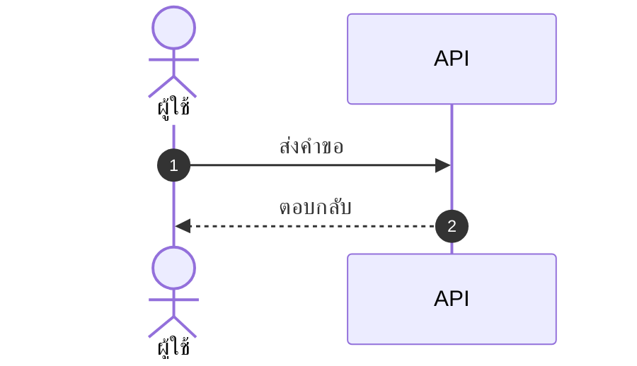

# skill: simplicity-first

Use when producing a document, design, architecture or plan (BRD, FSD, ADR, roadmap, API design). Simplest version that works, no buzzwords or layers.

# Simplicity First

> The best architecture has the fewest moving parts. The best plan is the one a
> teammate can follow with no context.

This skill covers **non-code outputs** — documents, plans, architecture, and
designs. For code, use `lazy-coding`.

## The one test

Before submitting, ask:

> Could a tired teammate understand this in 6 months, with no prior context?

If "no" or "not sure" → simplify.

## 5 principles

1. **Start with the simplest thing that works.** Add complexity only when something breaks.
2. **Reduce moving parts.** Each component adds failure modes, ops burden, and docs. Default to one thing.
3. **Use familiar patterns.** Boring, proven tech for critical paths. Save novelty for low-risk experiments.
4. **Optimize for reading.** It's read far more often than written.
5. **Delete &gt; add.** The best edit removes something. The worst adds a layer for an imagined future need.

## By output type

### Documents (BRD, FSD, ADR)

Do: short sentences (≤ 20 words), plain English, one idea per paragraph, an
example for every abstract point, tables for structured data.

Avoid: marketing-speak ("revolutionary", "best-in-class", "synergy"), undefined
jargon, walls of text, hedging ("might possibly potentially"), acronym soup.

### Architecture

Do: monolith first (split only when a bottleneck is proven), familiar stack,
standard patterns (REST, queues, caches), single source of truth per data type.

Avoid: microservices for small teams, distributed-everything, multi-master
databases before you must, event-driven by default (sync is simpler).

### Plans

Do: 3-5 priorities (not 20), a named owner per item, measurable success
criteria, realistic timelines with buffer, cut scope to fit time.

Avoid: vague goals ("improve quality"), 50-item lists (= no priority),
aspirational dates with no buffer, plans without success metrics.

### Designs (UX, API)

Do: fewest steps to the user's goal, reuse existing patterns, stay consistent
across screens, defaults that work for 80%, progressive disclosure.

Avoid: novel interactions where a standard one works, 10-step flows when 3
work, required fields with no smart default, hidden features needing tutorials.

## The 3-question filter

Before adding any new component, configuration option, or pattern:

1. Is there real evidence we need this **now** (not "might need")?
2. Is there a simpler way? (Sleep on it. Often yes.)
3. What's the cost of **not** adding it? (Often nothing, or a small refactor later.)

Two or more answers point to "simpler is fine" → don't add it.

## Examples

**API description**

❌ "This sophisticated, enterprise-grade endpoint leverages state-of-the-art
authentication to facilitate the seamless retrieval of user profile data."

✅ "`GET /users/{id}` returns a user profile. Requires a Bearer token. Use
`?fields=name,email` to limit the response."

**Sprint goal**

❌ "Improve overall product quality and customer satisfaction through various
initiatives."

✅ "Reduce login errors by 50% (8% → 4%): fix timeout bug (2d), retry on
transient errors (1d), clearer error messages (1d)."

**Architecture for a new feature**

❌ "Event-sourced microservice with CQRS, Kafka ingestion, Redis cache, and a
dedicated auth service."

✅ "Add an endpoint to the existing API. One Postgres table for state. Standard
auth middleware. Log to the existing system."

## Anti-patterns to reject

- **Future-proofing** — abstractions for needs that never arrive.
- **"It might scale"** — infra for 1M users while you have 1k.
- **Layer cake** — 6 layers where 90% just pass through.
- **Resume-driven design** — fancy tech to look sophisticated.
- **Buzzword stacking** — "cloud-native event-driven AI-powered".

## Pre-submit checklist

- [ ] A tired teammate would understand this in 6 months.
- [ ] Nothing can be deleted without losing meaning.
- [ ] No jargon the audience won't know.
- [ ] Every abstract claim has an example.
- [ ] I could explain the whole thing in two sentences.

If any answer is "no" → simplify before delivering.

> "Perfection is achieved not when there is nothing more to add, but when there
> is nothing left to take away." — Saint-Exupéry


---

# skill: project-doc-set

Use when a new project needs its document set decided (which docs, order, readers, where docs, assets, mockups and QA live). Scales to project size.

# ชุดเอกสารโปรเจกต์

> **กฎข้อเดียว:** เอกสารทุกชิ้นต้องตอบได้ว่า **ใครอ่าน** และ **อ่านแล้วตัดสินใจอะไร**
> ถ้าตอบไม่ได้ ก็ไม่ต้องเขียน

---

## เมื่อไหร่ใช้ skill นี้

- เปิดโปรเจกต์ใหม่ แล้วต้องตัดสินว่าจะมีเอกสารอะไรบ้าง
- โปรเจกต์เดิมมีเอกสารกระจัดกระจาย ไม่รู้ว่าอันไหนเป็นตัวจริง
- ลูกค้าถามว่า "ส่งมอบเอกสารอะไรบ้าง"
- จะเริ่มเขียนเอกสารสักชิ้น แต่ไม่แน่ใจว่าต้องมีอะไรมาก่อน

## เมื่อไหร่ **ไม่** ใช้

| สถานการณ์ | ใช้แทน |
|---|---|
| โครงโฟลเดอร์ของ**โค้ด** · README · CHANGELOG · linter · โครงเอกสารแบบ A | `project-bootstrap` |
| ตั้ง**ชื่อไฟล์** และเลขเวอร์ชันของเอกสาร | `document-naming` |
| ลงมือเขียนเอกสารชิ้นใดชิ้นหนึ่ง | skill ของเอกสารนั้น (ตารางข้อ 4) |
| จัดรูปแบบหน้าเอกสารให้สวย | `branded-document-design` |

---

## 1 · เอกสารอยู่ในหรืออยู่นอก repo

**ตัดสินข้อนี้ก่อน** เพราะถ้าย้ายทีหลังจะต้องแก้ลิงก์ทั้งโปรเจกต์

**ค่าเริ่มต้นคือแบบ B** — โค้ดอยู่ในโฟลเดอร์ `<project-name>/` (ชื่อโปรเจกต์ตัวพิมพ์เล็กคั่น `-`) แม้เอกสารจะเป็น markdown ล้วน ส่วนแบบ A ใช้เมื่อผู้ใช้ขอเท่านั้น

| | **แบบ A — เอกสารอยู่ใน repo** | **แบบ B — เอกสารอยู่นอก repo** |
|---|---|---|
| เลือกเมื่อ | เอกสารเป็น markdown ทั้งหมด และผู้อ่านคือทีมพัฒนา | มี `.docx` / `.xlsx` / mockup / รูป PNG ที่ลูกค้าต้องเห็น |
| ตรงกับชุด | S · M | M · L |
| โครง | ดู **`project-bootstrap` ข้อ 1** ซึ่งเป็นเจ้าของโครงนี้ | ดูโครงข้างล่าง |
| ข้อดี | เอกสารกับโค้ดเปลี่ยนใน pull request เดียวกัน | pull request ไม่เต็มไปด้วยไฟล์ binary |

> โปรเจกต์ที่เริ่มเป็นแบบ A แล้วโตจนมีเอกสารส่งมอบ ให้ย้ายเป็นแบบ B **ทั้งชุดในครั้งเดียว**
> ห้ามค้างอยู่ครึ่งทาง เพราะเอกสารที่อยู่ 2 ที่ ก็คือมี 2 เวอร์ชัน

### โครงของแบบ B

```
<ชื่อโปรเจกต์>/
├─ ref/                 ของที่ได้รับมา — TOR · บันทึกประชุม · ภาพหน้าจอระบบเดิม · ไฟล์จากลูกค้า  **อ่านอย่างเดียว ห้ามแก้**
├─ docs/                เอกสารทุกชิ้นที่เราเขียน — .docx ส่งมอบ และ .md เชิงเทคนิค อยู่ด้วยกัน
│  ├─ figures/          รูปที่ export แล้ว — .png เท่านั้น        [มีเมื่อมีรูปในเอกสารส่งมอบ]
│  │  └─ src/           ไฟล์ต้นทางของรูป (.html · .mmd · .drawio)
│  ├─ decisions/        ADR — หนึ่งการตัดสินใจต่อไฟล์              [ทางเลือก]
│  └─ research/         research แอปต้นแบบ (`reference-app-research`) [ทางเลือก]
├─ mockup/              .html ที่เปิดแล้วกดได้จริง
├─ qa/                  test case · ผลทดสอบ · bugs/ รายงานบั๊ก
├─ assets/              โลโก้ · ไอคอนทุกขนาด · favicon · wordmark (ต้นทาง .svg + ไฟล์ export)
├─ _to_delete/          ของชั่วคราวทุกอย่าง
├─ .claude/            skill ของโปรเจกต์ (เช่น verify) — ต้องอยู่ที่ที่เปิด Claude Code
└─ <project-name>/      repo โค้ด ชื่อโปรเจกต์ตัวพิมพ์เล็กคั่น `-` — โครงข้างในเป็นของ `project-bootstrap`
```

**โฟลเดอร์เหล่านี้สร้างเมื่อมีของจริง ไม่สร้างเผื่อ:**

| โฟลเดอร์ | สร้างเมื่อ | ถ้าไม่มี ของไปอยู่ไหน |
|---|---|---|
| `ref/` | ได้รับไฟล์จากลูกค้าหรือจากระบบเดิม | ไม่มีอะไรให้เก็บ และห้ามเอาไฟล์ลูกค้าไปปนใน `docs/` เพราะจะแยกไม่ออกว่าอะไรเราเขียน |
| `docs/figures/` | มีรูปที่วาดเองและไปอยู่ในเอกสารส่งมอบ | รูปฝังอยู่ในไฟล์ `.docx` อย่างเดียว จึงแก้ทีหลังไม่ได้ |
| `docs/decisions/` | มีการตัดสินใจทางเทคนิคที่ต้องอธิบายทีหลัง | เหตุผลอยู่ใน Architecture หัวข้อเดียว |
| `docs/research/` | ผู้ใช้บอกว่าอยากได้แอปแบบเดียวกับแอปที่มีอยู่ | ไม่มี research |
| `qa/` | มี test case (เกือบทุกโปรเจกต์) โดย test case อยู่ที่นี่เสมอ เป็น `.md` หรือ `.xlsx` (ขนาด L) | — ส่วน `docs/test-plan.md` มีแค่แผน ไม่มีรายการ test case |
| `assets/` | มีโลโก้หรือไอคอนของโปรเจกต์ | — |

**กฎของโฟลเดอร์ (ใช้ได้ทั้ง 2 แบบ):**

- **`.docx` กับ `.md` อยู่ใน `docs/` เดียวกันได้** ไม่ต้องแยกโฟลเดอร์ เพราะนามสกุลบอกอยู่แล้วว่าใครอ่าน
- **ไฟล์ต้นทางของรูปห้ามหาย** เพราะถ้าปีหน้าต้องแก้รูปแล้วเหลือแต่ PNG ก็ต้องวาดใหม่ทั้งใบ
- **ทุกปุ่มใน mockup ต้องกดได้จริง** เพราะปุ่มหลอกทำให้รีวิวผิด
- **`.docx` / `.xlsx` อยู่ใน `docs/` และ `qa/` เท่านั้น** ไม่กระจายไปรากโปรเจกต์
- **ของชั่วคราวลง `_to_delete/`** (`temp-file-discipline`)
- **`docs/README.md` เป็นสารบัญ** บอกว่าอ่านอะไรก่อนและใครเป็นเจ้าของ ส่วนรูปแบบตารางอยู่ใน `project-bootstrap` ข้อ 1

---

## 2 · เลือกชุดเอกสารตามขนาดงาน

ขนาดวัดจาก **ระยะเวลา × จำนวนคนที่ต้องเห็นพ้องกัน** ไม่ใช่จำนวนบรรทัดโค้ด

| ขนาด | ความหมาย |
|---|---|
| **S** | ≤ 2 สัปดาห์ · ทีมเดียว · ไม่มีใครนอกทีมต้องเซ็น |
| **M** | 1–3 เดือน · มีผู้ว่าจ้างภายใน · ส่งมอบเป็นรอบ |
| **L** | > 3 เดือน · ลูกค้าภายนอกเซ็นรับ · มีข้อผูกพันตามสัญญา |

### 2.1 · เอกสารส่งมอบ — คนอ่านและเซ็น

| เอกสาร | รูปแบบ | ผู้อ่าน | S | M | L |
|---|---|---|:-:|:-:|:-:|
| Project Plan | `.docx` | ผู้ว่าจ้าง · ทีม | ○ | ● | ● |
| SRS | `.docx` | dev · ผู้ว่าจ้าง | ○ | ● | ● |
| Architecture | `.docx` | dev · ops | ○ | ● | ● |
| Test Plan | `.docx` | QA · ผู้ว่าจ้าง | ○ | ● | ● |
| User Guide | `.docx` → `.pdf` | ผู้ใช้ปลายทาง | ○ | ● | ● |
| FSD | `.docx` | dev · QA | ○ | ○ | ● |
| BRD | `.docx` | ฝ่ายธุรกิจ | ○ | ○ | ● |
| Document Checklist | `.docx` | ทุกฝ่าย | ○ | ○ | ● |
| Test Cases | `.xlsx` | QA | ○ | ○ | ● |

● ต้องมี · ○ ไม่ต้อง เว้นแต่มีเหตุผลเฉพาะ
**ชุด S ไม่มีเอกสารกลุ่มนี้เลย** และนั่นถูกแล้ว เพราะงาน 2 สัปดาห์ที่มาพร้อม BRD คือเอกสารที่เขียนให้ตัวเองอ่าน

---

### 2.2 · เอกสารเชิงเทคนิค — ทีมและ agent ใช้ระหว่างสร้าง

กลุ่มนี้เป็น **markdown ทั้งหมด** และ**ไม่ได้ขึ้นกับขนาดงาน** แต่ขึ้นกับว่าโปรเจกต์มีอะไร

| เอกสาร | ไฟล์ | ตอบคำถามว่า | ต้องมีเมื่อ |
|---|---|---|---|
| README | `<project-name>/README.md` | ติดตั้งและรันยังไง | **เสมอ** |
| BUILD-PLAN | `docs/BUILD-PLAN.md` | จะสร้างอะไรก่อนหลัง · ตอนนี้ถึงไหนแล้ว | **เสมอ** |
| USER-STORIES | `docs/USER-STORIES.md` | จะสร้างอะไรให้ใคร · story ไหนพร้อมเข้า sprint · AC คืออะไร | ทำงานเป็น sprint หรือมี backlog (`user-story-writer`) |
| Sprint plan | `docs/sprints/sprint-NN.md` | sprint นี้รับ story ไหน · เป้าหมายคืออะไร · เสี่ยงอะไร | ทำงานเป็น sprint (`/sprint-plan`) — ไฟล์ละ sprint ไม่เขียนทับของเก่า |
| AGENT-LOOP | `docs/AGENT-LOOP.md` | agent ทำงานเป็นวงจรแบบไหน · อะไรคือเงื่อนไขว่าจบ | ให้ agent เขียนโค้ดเป็นรอบ ๆ (`spec-to-code-loop`) |
| API-SPEC | `docs/API-SPEC.md` | endpoint ไหนรับอะไร คืนอะไร พังยังไง | มี API ที่คนอื่นเรียก (`api-conventions`) |
| DATA-DICTIONARY | `docs/DATA-DICTIONARY.md` | ฟิลด์นี้แปลว่าอะไร · ค่าที่เป็นไปได้มีอะไรบ้าง | มีฐานข้อมูลหรือสคีมาข้อมูล (`database-design`) |
| EVALUATION-POLICY | `docs/EVALUATION-POLICY.md` | วัดว่าผลลัพธ์ดีพอหรือยังด้วยอะไร · เกณฑ์ผ่านเท่าไร | ผลลัพธ์มาจากโมเดลหรือ LLM ที่ไม่ได้ถูกเสมอ |
| PROMPT-LIBRARY | `docs/PROMPT-LIBRARY.md` | prompt ตัวจริงคือตัวไหน เวอร์ชันอะไร เปลี่ยนอะไรไป | ใช้ LLM ในเส้นทางหลักของระบบ |
| ADR | `docs/decisions/ADR-*.md` | ทำไมถึงเลือกทางนี้ ไม่เลือกทางนั้น | มีการตัดสินใจที่จะถูกถามซ้ำ (`adr-writer`) |
| Runbook | `docs/runbook.md` | ระบบล่มตอนตี 2 ต้องทำอะไร | มีระบบที่รันอยู่จริงและมีคนอยู่เวร |

> **เอกสาร 4 ตัวที่มีเงื่อนไขเรื่อง LLM · API · ฐานข้อมูล คือตัวที่คนลืมบ่อยที่สุด**
> แล้วไปจบด้วยการถาม agent ซ้ำทุกรอบว่า "prompt ตัวไหนคือตัวจริง" หรือ "ฟิลด์นี้แปลว่าอะไร"

---

## 3 · ลำดับการเขียน

**สายส่งมอบ** — ห้ามข้ามขั้น

```
Project Plan ─► BRD ─► SRS ─┬─► mockup
                            └─► Architecture ─► FSD
                                                 │
              User Guide ◄─ Test Cases ◄─ Test Plan
```

**ห้ามเขียนชิ้นถัดไปก่อนชิ้นก่อนหน้าได้รับการยืนยัน** เพราะถ้าเขียนล่วงหน้าไปแล้วจะต้องรื้อทั้งสาย
ข้อยกเว้นเดียว: **mockup ทำคู่ไปกับ SRS ได้** เพราะภาพหน้าจอช่วยให้ SRS ถูกยืนยันเร็วขึ้น

**สายเทคนิค** — เขียนเมื่อถึงจุดที่ต้องใช้ ไม่ต้องรอใคร

| เขียนเมื่อ | เอกสาร |
|---|---|
| ก่อนเขียนโค้ดบรรทัดแรก | README · BUILD-PLAN |
| ก่อนปล่อย agent ทำงานเป็นรอบ | AGENT-LOOP |
| ตอนออกแบบตารางแรก | DATA-DICTIONARY |
| ตอนออกแบบ endpoint แรก | API-SPEC |
| ตอนเขียน prompt ตัวแรกที่จะใช้จริง | PROMPT-LIBRARY · EVALUATION-POLICY |
| ตอนตัดสินใจเรื่องที่จะถูกถามซ้ำ | ADR |
| ก่อนขึ้นระบบจริง | Runbook |

> **ADR กับ DATA-DICTIONARY เขียนตอนที่ตัดสินใจ ไม่ใช่ตอนสรุปท้ายโปรเจกต์**
> เขียนย้อนหลังก็ได้ แต่ตอนนั้นเหตุผลจริงหายไปแล้ว

---

## 4 · ใครเขียนชิ้นไหน ด้วย skill อะไร

| เอกสาร | agent | skill ที่ใช้ |
|---|---|---|
| README · CHANGELOG | `technical-writer` | `project-bootstrap` |
| Project Plan | `project-manager` | `branded-document-design` |
| BRD · user story | `business-analyst` | `user-story-writer` |
| SRS | `system-analyst` | `srs-writing` |
| FSD | `system-analyst` | `fsd-writing` |
| Architecture | `solution-architect` | `architecture-patterns` · `diagram-figures` |
| ADR | `solution-architect` | `adr-writer` |
| Test Plan · Test Cases | `qa-tester` | `test-case-template` |
| mockups | `ux-designer` | `web-app-design` · `ui-craft` |
| User Guide | `technical-writer` | `polished-document-style` |
| Runbook | `devops-engineer` | `incident-runbook-template` |
| BUILD-PLAN | `project-manager` | `simplicity-first` |
| AGENT-LOOP | `developer` | `spec-to-code-loop` |
| API-SPEC | `system-analyst` | `api-conventions` |
| DATA-DICTIONARY | `system-analyst` | `database-design` |
| PROMPT-LIBRARY · EVALUATION-POLICY | `developer` | — (คู่กับ skill `llm-engineering`) |

---

## 5 · รูปในเอกสาร — เลือกให้ถูกตั้งแต่ต้น

| รูปนี้ใครเห็น | วาดด้วย | เก็บที่ |
|---|---|---|
| อยู่ใน README · PR · เอกสารในทีม | Mermaid (`software-diagrams`) | ฝังในไฟล์ `.md` |
| อยู่ในเอกสารที่ลูกค้าเซ็น · สไลด์ · งานพิมพ์ | `diagram-figures` | `docs/figures/` + ต้นทางใน `src/` |

> **รูป Mermaid ค่าเริ่มต้นห้ามเข้าเอกสารส่งมอบ** เพราะสีที่สุ่มตามชนิด node ไม่ได้แปลว่าอะไร
> ตัวหนังสือภาษาไทยล้นกรอบ และพอย่อลงหน้า A4 แล้วอ่านไม่ออก

**หัวรูปทุกใบต้องมีครบ 5 อย่าง** — ชื่อ · คำขยาย 1 บรรทัด · เลขรูป · เวอร์ชันกับวันที่ · เจ้าของ
รูปสถาปัตยกรรมถูกก๊อปไปวางในอีเมลและสไลด์แล้วอยู่ต่ออีกเป็นปี **รูปที่ไม่มีวันที่ ไม่มีใครกล้าแก้**

---

## 6 · ธีมสีของชุดเอกสาร

ประกาศครั้งเดียวต่อโปรเจกต์ บนหัวไฟล์ต้นทางของทุกเอกสาร:

```markdown
<!-- doc-theme: accent=#5B4BE8 -->
```

`branded-document-design` · `presentation-design` · `diagram-figures`
อ่านค่านี้แทนการเลือกสีเอง เอกสาร สไลด์ และรูปทุกใบจึงเป็นชุดเดียวกัน

**สีมาจากเนื้องาน ไม่ใช่จากรสนิยม** — ถ้ามีสีแบรนด์แล้วให้ใช้สีแบรนด์ ถ้ายังไม่มีให้เสนอโทนแล้วรอยืนยัน
ข้อยกเว้นที่ไม่เปลี่ยนตามธีม: สีโลโก้ผู้ให้บริการ · สีเทาของเส้นโครงสร้าง · เขียว = ผ่าน / แดง = ไม่ผ่าน

---

## 7 · รายการตรวจก่อนส่งมอบชุดเอกสาร

- [ ] ทุกไฟล์ `.docx` เปิด Navigation Pane แล้ว**เห็นหัวข้อครบ** (ใช้ Heading style จริง ไม่ใช่ตัวหนา)
- [ ] ทุกเอกสารมีหน้าประวัติการแก้ไข · เลขเวอร์ชัน · วันที่ · ผู้จัดทำ
- [ ] ทุกรูปมีเลขรูปและถูกอ้างในเนื้อความอย่างน้อย 1 ครั้ง
- [ ] ไฟล์ต้นทางของทุกรูปอยู่ใน `docs/figures/src/` (ถ้ามีโฟลเดอร์นี้)
- [ ] เอกสารเชิงเทคนิคที่เข้าเงื่อนไขในข้อ 2.2 มีครบ เช่น ถ้ามี API ต้องมี API-SPEC และถ้าใช้ LLM ต้องมี PROMPT-LIBRARY
- [ ] ตัวย่อทุกตัวเขียนเต็มครั้งแรกที่ปรากฏ
- [ ] ชื่อไฟล์ตรงตาม `document-naming` — ไม่มี `final2` ไม่มี `ล่าสุด`
- [ ] เอกสารในชุดอ้างเวอร์ชันของกันและกันตรงกัน
- [ ] `_to_delete/` ว่าง หรือถูกลบไปแล้ว

---

## 8 · Anti-patterns

- ❌ **เขียน BRD ให้งาน 2 สัปดาห์** — ข้อ 2
- ❌ **เอกสาร `.docx` ที่ไม่มี Heading style สักอัน** — navigation pane ว่าง หา TOC ไม่ได้ ไม่มีลำดับชั้น
- ❌ **เก็บแต่ PNG ไม่เก็บไฟล์ต้นทาง** — ข้อ 1
- ❌ **เก็บ `.docx` และ mockup ไว้ใน repo โค้ด** เพราะ "จะได้อยู่ที่เดียว" — pull request จะเต็มไปด้วย binary ถ้าถึงจุดนี้แปลว่าต้องย้ายเป็นแบบ B (ข้อ 1)
- ❌ **เอกสารอยู่ 2 ที่พร้อมกัน** — ครึ่งหนึ่งอยู่ใน repo อีกครึ่งอยู่นอก repo ก็คือมี 2 เวอร์ชัน
- ❌ **เขียน FSD ก่อน SRS ได้รับการยืนยัน**
- ❌ **มี mockup ที่ปุ่มกดไม่ได้** — ผู้รีวิวเข้าใจว่าทำได้แล้ว
- ❌ **ใช้ LLM แต่ไม่มี PROMPT-LIBRARY** — prompt ตัวจริงอยู่ในโค้ด พอแก้แล้วไม่มีใครรู้ว่าเปลี่ยนอะไร
- ❌ **สร้าง `qa/` `decisions/` `figures/` ทิ้งไว้ว่าง ๆ** เพราะ "ในแบบมี" — โฟลเดอร์ว่างทำให้คนคิดว่าของหาย
- ❌ **เอกสารชิ้นเดียวตอบทุกคำถาม** — SRS ที่มีทั้ง timeline ทั้ง test case คือเอกสารที่ไม่มีใครอ่านจบ

---

## 9 · ตัวย่อ

- **ADR** — Architecture Decision Record
- **BRD** — Business Requirements Document
- **FSD** — Functional Specification Document
- **QA** — Quality Assurance
- **SRS** — Software Requirements Specification
- **TOC** — Table of Contents

---

## 10 · เชื่อมกับ skill อื่น

| ต้องการ | ใช้คู่กับ |
|---|---|
| โครงโฟลเดอร์ของโค้ด · README · สารบัญ `docs/README.md` | `project-bootstrap` |
| ตั้งชื่อไฟล์และจัดเวอร์ชัน | `document-naming` |
| จัดรูปแบบหน้าเอกสาร | `branded-document-design` · `polished-document-style` |
| วาดรูปให้ดูออกแบบมา | `diagram-figures` |
| เลือกว่าจะวาดรูปด้วยอะไร | `software-diagrams` |
| ของชั่วคราวและการเก็บกวาด | `temp-file-discipline` |
| ตารางสถานะเอกสารและงานเมื่อจบแต่ละฉบับ (ลง `docs/BUILD-PLAN.md`) | `status-report` |
| รายการตรวจฉบับพิมพ์ | `assets/doc-set-checklist.md` |


---

# skill: polished-document-style

Use when a stakeholder Markdown document (BRD, FSD, ADR, status report, audit, postmortem) needs polished formatting for GitHub, Notion or Obsidian.

# Polished Document Style

> **ภาษา:** ถ้อยคำทุกบรรทัดเขียนตาม [`human-writing`](../human-writing/SKILL.md) — skill นี้บอกรูปแบบและโครง ส่วน human-writing บอกวิธีเขียนให้คนอ่านรู้เรื่อง

## When to use this skill

- Output is meant for **non-developers** to read (PMs, executives, clients)
- Document needs **sign-off** or formal review
- Output will be **shared widely** or converted to PDF/Word later
- Any doc with 3+ sections or 500+ words

## When NOT to use

- Internal developer-only specs (keep them concise)
- Quick scratch notes
- Code comments / inline docs

> ℹ️ **Note:** This skill governs the *markdown source*. When the deliverable is a
> rendered **.docx / .pptx / .pdf** that a stakeholder will open, use
> `branded-document-design` on top of it — that skill carries the design tokens,
> the typography scale, Thai typography rules, and the `brandkit.py` builder.

## อ่านเพิ่มเมื่อ

| ไฟล์ | เปิดเมื่อ |
|---|---|
| [references/markdown-patterns.md](references/markdown-patterns.md) | ถ้าจะเขียนส่วนหัว สารบัญ กล่องข้อความ ตาราง ป้ายสถานะ cover block ตารางเทียบตัวเลือก ส่วนเซ็นรับ หรืออภิธานศัพท์ ให้เปิดดูตัวอย่าง markdown แล้วลอกไปใช้ |
| [references/theme-colors.md](references/theme-colors.md) | ถ้าต้องใส่สีจริงลงรูป ไฟล์ .docx หรือสไลด์ ให้เปิดดูว่าใครคุมสีส่วนไหน และค่าสีตั้งต้นประจำบ้านคืออะไร |

## Document Header (Always)

Every polished doc MUST start with ส่วนหัวชุดเดียวกัน คือ H1 ที่มีอิโมจิกำกับ ตามด้วยกล่อง quote ที่บอกเวอร์ชัน วันที่ สถานะ ผู้เขียน ผู้รีวิว และแท็ก แล้วปิดด้วย `---` ตัวอย่างเต็มอยู่ใน [references/markdown-patterns.md](references/markdown-patterns.md)

Status values:
- 🟡 **Draft** — work in progress
- 🔵 **Review** — under stakeholder review
- 🟢 **Approved** — signed off
- ⚪ **Archived** — historical reference

## Section Hierarchy

- **H1** — Document title (exactly one)
- **H2** — Numbered sections (`## 1. Section`)
- **H3** — Sub-sections (`### 1.1 Sub-topic`)
- **H4** — Rare, use only if needed

**Always add Table of Contents** for docs with 5+ sections และต้องกดลิงก์ในสารบัญแล้วไปถึงหัวข้อจริง ตัวอย่างอยู่ใน [references/markdown-patterns.md](references/markdown-patterns.md)

## ธีมของเอกสาร — ตัดสินใจครั้งเดียว ใช้ทุกที่ในเอกสารนั้น

เอกสาร 1 ฉบับผ่านหลาย skill: markdown (skill นี้) · รูปจาก `software-diagrams` ·
ไฟล์ .docx จาก `branded-document-design` · สไลด์จาก `presentation-design`
ถ้าแต่ละตัวเลือกสีเอง ผู้อ่านจะได้เอกสารที่รูปสีหนึ่ง หัวข้อสีหนึ่ง และสไลด์อีกสีหนึ่ง

**markdown เป็นต้นฉบับหลัก (source of truth) จึงประกาศธีมไว้ที่นี่** — ใส่ไว้ท้ายส่วนหัวของเอกสารหรือในไฟล์ข้างกัน:

```markdown
<!-- doc-theme: accent=<สีหลัก> · ที่มา=<แบรนด์ลูกค้า / เสนอจากเนื้องาน> · ยืนยันเมื่อ=YYYY-MM-DD -->
```

**สีหลักมาจากเนื้องาน ไม่ใช่จากค่าเริ่มต้นของเครื่องมือ**
ถ้ามีสีแบรนด์อยู่แล้วให้ใช้สีนั้น ถ้ายังไม่มีให้เสนอโทนที่เข้ากับเนื้องาน แล้วรอผู้ใช้ยืนยัน
(ตารางจับคู่เนื้องานกับโทนสีอยู่ใน [`colour-by-domain`](../diagram-figures/references/colour-by-domain.md))

markdown เองไม่มีสี จึงใช้อิโมจิและน้ำหนักตัวอักษรแทน ส่วนไดอะแกรม รูป ไฟล์ .docx และสไลด์อ่านค่าจาก `doc-theme` ถ้า `doc-theme` ยังไม่ประกาศ accent เฉพาะงาน ให้ใช้ค่าตั้งต้นประจำบ้าน ตารางทั้งสองอยู่ใน [references/theme-colors.md](references/theme-colors.md)

**สีสถานะไม่ขึ้นกับธีม** — 🔴 วิกฤต · 🟢 ผ่าน ต้องคงความหมายเดิมไม่ว่าธีมจะเป็นสีอะไร

## Emoji Vocabulary

ใช้ให้**คงที่ทั้งเอกสาร** และใช้เพื่อ**หาของเจอเร็วขึ้น** ไม่ใช่เพื่อความน่ารัก

| ใช้ทำอะไร | ชุดที่ใช้ |
|---|---|
| ระดับความสำคัญ | 🔴 วิกฤต · 🟠 สูง · 🟡 กลาง · 🟢 ต่ำ |
| สถานะ | ✅ เสร็จ · 🚧 กำลังทำ · ⏳ รอ · ❌ ไม่ผ่าน · ⚠️ ต้องระวัง |
| ชนิดกล่องข้อความ | 💡 ข้อแนะนำ · 📌 ข้อควรจำ · 🚨 อันตราย · 📋 รายการตรวจ |
| หมวดเนื้อหา | 🎯 เป้าหมาย · 🏗️ สถาปัตยกรรม · 🔐 ความปลอดภัย · 📊 ตัวเลข · 🧪 การทดสอบ |

**1 อิโมจิต่อหัวข้อ ไม่ใช่ต่อบรรทัด** — เอกสารที่ทุกบรรทัดมีอิโมจิอ่านยากกว่าเอกสารที่ไม่มีเลย

## Callout Boxes

Use blockquotes with emoji prefix มี 5 ชนิด คือ 💡 **Tip** · ⚠️ **Warning** · 🚨 **Critical** · ℹ️ **Note** · ❓ **Open Question** ตัวอย่างอยู่ใน [references/markdown-patterns.md](references/markdown-patterns.md)

**Rules:**
- Keep callouts to 1-3 sentences
- One callout per topic — don't stack
- Don't overuse — max 3-5 per page

## Tables — When and How

Use tables when items have **2+ attributes** ถ้าเขียนเป็น bullet แล้วแต่ละบรรทัดมีหลายค่าคั่นด้วยจุลภาค ให้เปลี่ยนเป็นตาราง ตัวอย่างเทียบกันอยู่ใน [references/markdown-patterns.md](references/markdown-patterns.md)

- Left-align text, center checkmarks/numbers, right-align money
- Use `—` (em dash) for "not applicable", not `-` or blank
- Keep cells short — long content goes in body paragraphs
- Bold key columns: `**email**`

ถ้าเอกสารต้องเทียบตัวเลือกหรือชั่งข้อดีข้อเสีย (architect, PM, SEO recommendations) ให้ใช้ตารางเทียบที่มีคอลัมน์ Recommendation ส่วนเอกสารที่ต้องอนุมัติให้ปิดท้ายด้วยตาราง Sign-off และเอกสารที่มีศัพท์เทคนิค 5 คำขึ้นไปให้มีอภิธานศัพท์ ตัวอย่างทั้งสามแบบอยู่ใน [references/markdown-patterns.md](references/markdown-patterns.md)

## Mermaid Diagrams

**ตัวเลือกชนิดไดอะแกรม กติกาความอ่านง่าย ธีม และการจัดการป้ายภาษาไทย อยู่ใน `software-diagrams`**
skill นี้คุมเฉพาะเรื่องการวางไดอะแกรมลงในเอกสาร markdown

- วางไว้**หลังย่อหน้าที่อธิบายว่ารูปนี้ตอบคำถามอะไร** ไม่ใช่ลอยขึ้นมาเฉย ๆ
- ทุกรูปมีคำบรรยายใต้รูป 1 บรรทัด ขึ้นต้นด้วย **รูปที่ N —**
- รูปเดียวกันอย่าใส่ซ้ำหลายที่ในเอกสาร ให้อ้างถึงเลขรูปแทน
- รูปที่ต้องส่งให้คนนอกทีมหรือใส่สไลด์ ใช้ `diagram-figures` แล้วฝังเป็นไฟล์ภาพ

## Status Badges and Cover Block

ช่องสำคัญในส่วนหัวหรือในตารางให้ใช้ป้ายสถานะแบบอิโมจิพร้อมคำกำกับ เช่น `**Status:** 🟢 Approved` ส่วนเอกสารทางการ (BRD, FSD, ADR, postmortem) ให้เปิดด้วย cover block ที่บอกชนิดเอกสาร เวอร์ชัน สถานะ วันที่ ผู้เขียน ผู้รีวิว และเอกสารที่เกี่ยวข้อง ตัวอย่างอยู่ใน [references/markdown-patterns.md](references/markdown-patterns.md)

## Lists and Code Blocks

**Rule:** Max 2 levels of nesting. More nesting = use a table.
ตัวอย่างรายการที่ดีและรายการที่ซ้อนเกินอยู่ใน [references/markdown-patterns.md](references/markdown-patterns.md)

Code blocks ต้องระบุภาษาทุกครั้ง (Always specify language) และถ้าโค้ดยาว ให้ใส่ชื่อไฟล์เป็นคอมเมนต์ในบรรทัดแรก ตัวอย่างอยู่ใน [references/markdown-patterns.md](references/markdown-patterns.md)

## Quality Checklist

Before delivering any polished doc:

- [ ] H1 title with emoji marker
- [ ] Cover block with version, date, status, authors
- [ ] TOC if 5+ sections
- [ ] All sections numbered consistently
- [ ] Anchor links in TOC actually work
- [ ] Status badges where applicable
- [ ] Tables used (not bullets) where data has 2+ attributes
- [ ] At least one Mermaid diagram for any flow/relationship
- [ ] Callout boxes for tips/warnings (not just paragraphs)
- [ ] Code blocks have language hints
- [ ] Glossary for docs with 5+ acronyms
- [ ] No placeholder text (TBD, TODO, Lorem ipsum)
- [ ] Tested rendering in GitHub preview

> ไดอะแกรมในเอกสาร: ชนิดไหนตอบคำถามไหน และธีม Mermaid ชุดเดียวกันทั้งโปรเจกต์
> อยู่ใน `software-diagrams` ส่วนเรื่องเอกสาร SRS โดยเฉพาะอยู่ใน `srs-writing`

## Anti-patterns

- ❌ **Emoji spam** — emoji in every heading just for decoration
- ❌ **All emoji, no labels** — `🔴 High` reads better than `🔴` alone
- ❌ **Deep nesting** — bullets 4+ levels deep, use tables instead
- ❌ **Walls of text** — paragraphs longer than 5 lines
- ❌ **Inconsistent terminology** — "user" in one section, "customer" in next
- ❌ **Diagrams that duplicate text** — diagram should add insight, not repeat
- ❌ **Tables of paragraphs** — if cells are >2 sentences, use headings instead
- ❌ **Skipping the cover block** — readers need version/status/date

## ตัวย่อ

เขียนตัวย่อเต็มครั้งแรกเสมอ แล้ววงเล็บตัวย่อไว้ — เช่น Model Context Protocol (MCP)
หลังจากนั้นใช้ตัวย่อได้เลย ดูรายละเอียดใน skill `spell-out-abbreviations`


## reference: markdown-patterns.md

# รูปแบบ markdown พร้อมตัวอย่าง

ตัวอย่างโค้ด markdown ของทุกรูปแบบที่ `SKILL.md` อ้างถึง ให้ลอกไปใช้ได้ทันที ส่วนกฎว่าใช้เมื่อไหร่อยู่ใน `SKILL.md`

## Document Header (Always)

Every polished doc MUST start with:

```markdown
# 📋 <Document Title>

> **Version:** 1.0 · **Date:** YYYY-MM-DD · **Status:** 🟡 Draft
> **Authors:** <names> · **Reviewers:** <names>
> **Tags:** `<area>` `<topic>`

---
```

Status values:
- 🟡 **Draft** — work in progress
- 🔵 **Review** — under stakeholder review
- 🟢 **Approved** — signed off
- ⚪ **Archived** — historical reference

## Table of Contents

**Always add Table of Contents** for docs with 5+ sections:

```markdown
## 📑 Table of Contents

1. [Executive Summary](#1-executive-summary)
2. [Scope](#2-scope)
3. [Details](#3-details)
```

## Callout Boxes

Use blockquotes with emoji prefix:

```markdown
> 💡 **Tip:** Brief actionable insight.

> ⚠️ **Warning:** Important caveat or limitation.

> 🚨 **Critical:** Must-read before proceeding.

> ℹ️ **Note:** Additional context or background.

> ❓ **Open Question:** Needs decision/clarification.
```

## Tables — When and How

### When to use tables instead of bullets

Use tables when items have **2+ attributes**:

❌ Don't use bullets:
```markdown
- email: string, required, unique
- age: number, optional
- role: enum, required, default "user"
```

✅ Use a table:
```markdown
| Field | Type   | Required | Default | Description       |
|-------|--------|:--------:|:-------:|-------------------|
| email | string | ✅       | —       | Unique login email|
| age   | number | ❌       | —       | Optional          |
| role  | enum   | ✅       | `user`  | Access level      |
```

## Mermaid Diagrams

````markdown

````

*รูปที่ 3 — ลำดับการเรียกเมื่อผู้ใช้กดบันทึก*

## Status Badges (Inline)

For key fields in headers/tables:

```markdown
**Status:** 🟢 Approved
**Priority:** 🔴 High
**Risk Level:** 🟡 Medium
**SLA:** ⚡ < 200ms
```

Multiple badges in a header:

```markdown
> 🟢 **Approved** · 🔴 **High Priority** · 👤 @alice · 🗓️ Due 2025-03-15
```

## Cover Block Pattern

For formal documents (BRD, FSD, ADR, postmortem):

```markdown
# 📋 <Title>

| | |
|--|--|
| **Document Type** | BRD \| FSD \| ADR \| Postmortem |
| **Version** | 1.2 |
| **Status** | 🟢 Approved |
| **Date** | 2025-01-15 |
| **Author(s)** | @alice, @bob |
| **Reviewer(s)** | @charlie |
| **Related** | [BRD-001](link), [FSD-005](link) |

---
```

## Comparison / Decision Tables

For trade-off analysis (architect, PM, SEO recommendations):

```markdown
| Option | Cost | Effort | Risk | Time-to-Value | Recommendation |
|--------|:----:|:------:|:----:|:-------------:|:--------------:|
| **A**  | 💰💰 | 🟡 Med | 🟢 Low | 🟢 Fast | ✅ Recommended |
| B      | 💰   | 🟢 Low | 🔴 High | 🟡 Med | ❌ Not recommended |
| C      | 💰💰💰| 🔴 High| 🟢 Low | 🔴 Slow | ⚪ Future consideration |
```

## Lists — When to nest, when to flatten

### ✅ Good list
```markdown
- Email is unique across all users
- Passwords must be 8+ characters with mixed case
- Sessions expire after 30 days of inactivity
```

### ❌ Bad list (over-nested)
```markdown
- Users
  - Email
    - Must be unique
    - Required
  - Password
    - 8+ chars
    - Mixed case
```

→ Should be a table instead.

## Code Blocks

Always specify language:

````markdown
```typescript
const user: User = { id: 1, email: 'a@b.com' };
```

```bash
npm install
```

```sql
SELECT * FROM users WHERE id = $1;
```
````

For long blocks, put the file name in a comment on the first line:

```typescript
// src/services/auth.ts
export async function login(email: string, password: string) {
  // ...
}
```

## Approval/Sign-off Section (End of Doc)

For documents needing formal approval:

```markdown
## ✍️ Sign-off

| Role | Name | Status | Date |
|------|------|:------:|------|
| Product Owner | @alice | 🟢 Approved | 2025-01-15 |
| Tech Lead | @bob | 🔵 Reviewing | — |
| QA Lead | @charlie | ⚪ Not started | — |
| Security | @dave | ❌ Rejected | 2025-01-14 |
```

## Glossary Section

For docs with 5+ technical terms:

```markdown
## 📖 Glossary

| Term | Definition |
|------|------------|
| **API** | Application Programming Interface |
| **JWT** | JSON Web Token, used for stateless auth |
| **SLA** | Service Level Agreement |
```

Define acronyms on first use, then add to glossary.


## reference: theme-colors.md

# ตารางสีของธีมเอกสาร

ไฟล์นี้บอกว่าส่วนไหนของเอกสารใครเป็นคนคุมสี และค่าสีตั้งต้นประจำบ้านคืออะไร ใช้ตอนต้องใส่สีจริงลงรูป ไฟล์ .docx หรือสไลด์

## ใครคุมสีส่วนไหน

| ส่วนของเอกสาร | ใครคุมสี | อ่านค่าจาก |
|---|---|---|
| หัวข้อ ตาราง กล่องข้อความใน markdown | markdown ไม่มีสี ใช้อิโมจิและน้ำหนักตัวอักษรแทน | — |
| ไดอะแกรม Mermaid | `software-diagrams` ข้อ 2 | `doc-theme` |
| รูปที่เป็นไฟล์ภาพ | `diagram-figures` | `doc-theme` |
| ไฟล์ .docx / .pdf ที่ส่งออก | `branded-document-design` ข้อ 0–1 | `doc-theme` |
| สไลด์ | `presentation-design` | `doc-theme` |

## ค่าตั้งต้นประจำบ้าน (house default)

ถ้า `doc-theme` ยังไม่ประกาศ accent เฉพาะงาน ทุก skill ใช้ชุดนี้เป็นค่าตั้งต้น เพื่อให้รูป เอกสาร และสไลด์เป็นชุดสีเดียวกันตั้งแต่แรก ชุดนี้คือชุดเดียวกับ `presentation-design` และ `branded-document-design`:

| token | ค่า | ใช้กับ |
|---|---|---|
| brand | `#2A78D6` | สีหลัก · หัวข้อ · เส้น accent |
| brand-deep | `#2A4C86` | หัวตาราง · H2 · ชื่อระบบ |
| brand-2 | `#6A5CD6` | accent รอง (ม่วง) |
| tint | `#EDF1FB` | พื้นหัวตาราง · พื้นกล่องเน้น |
| ink / body | `#333B4A` / `#414957` | หัวข้อ / เนื้อความ |
| muted / faint | `#7D8492` / `#A9AEB9` | คำบรรยาย / หมายเหตุ |
| line | `#E4E7EE` | เส้นขอบ · เส้นเชื่อม |
| exception | `#C77A11` | ทาง/โซนที่ไม่ใช่เส้นทางหลัก (ต่างจาก brand เสมอ) |
| ฟอนต์ | Tahoma (เอกสาร/สไลด์) · Noto Sans Thai → Tahoma (ภาพ) | ทั้งไทยและอังกฤษ |

เมื่อประกาศ accent เฉพาะงานแล้ว ให้ใช้ค่านั้นแทน brand ส่วนสีอื่นคำนวณจาก accent ตัวนั้น


---

# skill: markdown-visuals

Use when a markdown doc needs a picture (wireframe, UI state, flow, architecture). Picks inline SVG, image, ASCII or Mermaid so it renders everywhere.

# Markdown Visuals

> **ภาษา:** ถ้อยคำทุกบรรทัดเขียนตาม [`human-writing`](../human-writing/SKILL.md) — skill นี้บอกรูปแบบและโครง ส่วน human-writing บอกวิธีเขียนให้คนอ่านรู้เรื่อง

> **Scope:** this skill decides *how a picture goes into a markdown file* (inline SVG · image file · ASCII · Mermaid) and how to embed it. What a diagram should show lives in `software-diagrams` (Mermaid in the house theme) and `diagram-figures` (designed figures). Document formatting around the picture lives in `polished-document-style`.

> **Rule:** Every design, mockup, spec, or architecture doc must show — not just tell. If you wrote "the button sits top-right," you owe the reader a picture.

## When to use this skill

- Producing **any** design mockup, wireframe, or UI spec
- Writing FSD, BRD, ADR, or architecture docs that describe layout, flow, or relationships
- Explaining state transitions, user journeys, or system interactions
- Comparing 2+ visual options for the user
- The user said "make a mockup," "show me how it looks," or "design X"

**If the doc has zero visuals and is about anything visual or structural — stop and add one.**

## Decision tree: which format?

```
What are you showing?
│
├─ UI mockup / component state / icon       →  Inline SVG
├─ Layout sketch / box diagram / state map  →  ASCII art (boxes & arrows)
├─ Flow / sequence / decision tree          →  Mermaid (software-diagrams)
├─ Architecture / ER / class                →  Mermaid (software-diagrams)
├─ Designed figure (proposal, slide, print) →  diagram-figures → embed the PNG as an image file (§2)
├─ Data viz (chart, pie, quadrant)          →  Mermaid pie/quadrant OR inline SVG
├─ Photo, screenshot, complex illustration  →  External file → 
└─ Quick concept in chat reply              →  Inline SVG or ASCII (no external file)
```

**Default to inline SVG**, except for flows and sequences (use Mermaid for those). Inline SVG renders everywhere and versions cleanly in git. It adds no binary files to the repo, and the user can read and edit the markup.

## 1 · Inline SVG (primary technique)

### Boilerplate

```markdown
<p align="center">
<svg xmlns="http://www.w3.org/2000/svg" viewBox="0 0 640 280" role="img" aria-label="<what this shows>">
  <!-- background -->
  <rect width="640" height="280" rx="14" fill="#1c2230"/>

  <!-- content goes here -->
</svg>
</p>
```

**Required attributes:**
- `xmlns="http://www.w3.org/2000/svg"` — without this, GitHub may not render
- `viewBox` — sets the coordinate space; lets the SVG scale responsively
- `role="img"` + `aria-label` — accessibility, screen readers
- `<p align="center">` wrapper — centers in the rendered page

**Sizing:** Use `viewBox` (not width/height) so it scales. Common sizes:
- Mockup of a UI bar: `viewBox="0 0 640 200"` (wide, short)
- Component state: `viewBox="0 0 400 300"` (squarer)
- Icon / chip: `viewBox="0 0 64 64"`
- Full screen layout: `viewBox="0 0 800 500"`

### สี

ถ้าเอกสารหรือโปรเจกต์มีชุดสีอยู่แล้ว ให้ใช้ชุดนั้น ส่วนถ้ายังไม่มี ให้เสนอโทนจาก [`diagram-figures/references/colour-by-domain.md`](../diagram-figures/references/colour-by-domain.md) แล้วรอผู้ใช้ยืนยัน ส่วน token ตามหน้าที่ (`bg-canvas` · `accent-primary` · `state-*` …) ดูได้ใน [references/svg-snippets.md](references/svg-snippets.md) และ **1 เอกสารใช้ชุดสีเดียว**

### Reusable snippets

Window chrome, phone frame, button, card, status badge, running dot and tooltip snippets, plus the UI-state worked example, are in [references/svg-snippets.md](references/svg-snippets.md). Copy the structure and swap in the agreed colour tokens.

## 2 · External image files

Use when:
- Photo or screenshot
- Illustration too complex to author as SVG by hand (50+ shapes)
- Reusing the same image across many docs
- Generated by a design tool (Figma export, etc.)

### Folder convention

```
docs/
  figures/
    01-hover-state.svg
    02-empty-state.png
    architecture-overview.svg
    src/                      editable sources (.mmd · .drawio · .html)
```

- Put figures in `docs/figures/` (editable sources in `docs/figures/src/`) — relative to the doc · brand files (logo, icons) live in the project-root `assets/`, not here
- Name files `<doc-section-number>-<short-slug>.<ext>` so they sort with the doc
- Prefer `.svg` over `.png` when possible (scales, smaller, diff-friendly)

### Reference syntax

```markdown

```

- **Alt text** describes what the image shows, for accessibility — not "screenshot.png"
- Path is **relative to the markdown file**, not absolute
- For centered + sized images, wrap in HTML:

```markdown
<p align="center">
  
</p>
```

### Creating SVG files

When the visual is too big to inline (>50 lines of SVG markup), save it as a file instead. Use the `Write` tool to create the SVG file alongside the doc.

## 3 · ASCII art

For quick layouts, state diagrams, and structural sketches that don't need pixel-perfect visuals. Renders identically in every viewer and in terminal/diff output.

Box-drawing characters plus worked layout sketch, state machine and curve examples are in [references/ascii-patterns.md](references/ascii-patterns.md).

Always wrap ASCII in a fenced code block (` ``` `) so spacing is preserved.

## 4 · Mermaid

**การเลือกชนิดไดอะแกรม ธีม กติกาความอ่านง่าย และป้ายภาษาไทย อยู่ใน `software-diagrams`**
ที่นี่บอกแค่ว่า *เมื่อไหร่ควรเลือก Mermaid แทนรูปแบบอื่น*

| เลือก Mermaid เมื่อ | เลือกอย่างอื่นเมื่อ |
|---|---|
| เป็นกล่องกับลูกศรที่เครื่องจัดวางให้ได้ | ถ้าต้องคุมตำแหน่งเองให้ใช้ inline SVG ส่วนรูปที่ต้องดูออกแบบมาให้ใช้ `diagram-figures` (HTML layout หรือ engine-svg-python) แล้วฝังเป็นไฟล์ภาพ |
| อยู่ในไฟล์ที่ต้อง diff ใน git | เป็นภาพหน้าจอจริง ให้ใช้ไฟล์ภาพ |
| ผู้อ่านเปิดใน GitHub หรือ Notion | ผู้อ่านเปิดในเอกสาร Word หรือสไลด์ ให้ใช้ไฟล์ภาพ |

## Combining formats in one doc

A full design spec usually mixes formats (SVG mockup, reference table, ASCII sketch, Mermaid state diagram, acceptance table). The 6-part pattern is in [references/combining-formats.md](references/combining-formats.md). Don't force everything into one format.

## Accessibility checklist

For every visual:

- [ ] **Inline SVG** has `role="img"` and `aria-label="<description>"`
- [ ] **Image file** has descriptive alt text (not "image.png")
- [ ] **Mermaid** diagrams have a 1-sentence caption above or below
- [ ] **ASCII art** has a prose summary nearby — screen readers will read the characters literally
- [ ] **Colour** is not the only signal — pair red badges with `!`, green dots with a label
- [ ] **Contrast** for text in SVG ≥ 4.5:1 against its background

## Anti-patterns

- ❌ **Text-only design docs** — "the icon is in the top-right" with no picture
- ❌ **Linking to Figma / external design tools as the only source** — visuals must render in the repo
- ❌ **PNG screenshots of text** — use the text, in a code block
- ❌ **SVG without `xmlns`** — GitHub silently fails to render
- ❌ **Inline SVG with 200+ lines** — extract to `assets/x.svg` and reference it
- ❌ **ASCII art outside a code fence** — proportional fonts will mangle alignment
- ❌ **Mixing Mermaid syntax versions** — stick to v10 syntax so GitHub renders it
- ❌ **Generated images checked in without source** — commit the `.svg` source, not just the `.png` export
- ❌ **Decorative emoji as visuals** — emoji ≠ a mockup; pair them with real diagrams

## Quick-start recipe

When the user asks for a design / mockup:

1. **Identify what kinds of visuals are needed** (UI state? flow? architecture?)
2. **Pick the format(s)** using the decision tree above
3. **For each visual:**
   - State a one-line caption
   - Emit the SVG/Mermaid/ASCII
   - Add `role="img"` + `aria-label` (SVG) or alt text (file)
4. **Add a feature reference table** below the visuals — what each element means
5. **Cross-check accessibility checklist** before delivery

Not sure a visual will render? Tell the user to preview it in GitHub or Notion.

## Related skills

- [[polished-document-style]] — overall doc formatting, Mermaid catalogue, callout boxes
- [[simplicity-first]] — don't over-design the diagram; show what's needed
- [[software-diagrams]] — which diagram type answers which question, plus the shared Mermaid theme
- [[diagram-figures]] — designed figures for proposals, slides and print (HTML layouts or engine-svg-python)
- [[ui-craft]] — spacing, hierarchy and states when the picture is a screen

## ตัวย่อ

เขียนตัวย่อเต็มครั้งแรกเสมอ แล้ววงเล็บตัวย่อไว้ — เช่น Model Context Protocol (MCP)
หลังจากนั้นใช้ตัวย่อได้เลย ดูรายละเอียดใน skill `spell-out-abbreviations`


## reference: ascii-patterns.md

# ASCII patterns

Worked ASCII examples for markdown docs · used by [SKILL.md](../SKILL.md) §3 · always wrap ASCII in a fenced code block so spacing is preserved

## Box-drawing characters

```
┌─────┐  ┏━━━━━┓  ╭─────╮  ┌╌╌╌╌╌┐
│     │  ┃     ┃  │     │  ╎     ╎
└─────┘  ┗━━━━━┛  ╰─────╯  └╌╌╌╌╌┘
 light    heavy   rounded   dashed
```

Corners: `┌ ┐ └ ┘` ‧ `┏ ┓ ┗ ┛` ‧ `╭ ╮ ╰ ╯`
Lines:   `─ │` ‧ `━ ┃` ‧ `═ ║`
Joins:   `├ ┤ ┬ ┴ ┼`
Arrows:  `→ ← ↑ ↓ ▲ ▼ ▶ ◀ ↔ ↕ ⇒ ⇐`
Dots:    `• · ◦ ● ○ ▪ ▫`

## Common patterns

**Layout sketch:**
```
┌─────────────────────────────────────┐
│ Header        [Search]      [👤]    │
├──────────┬──────────────────────────┤
│ Sidebar  │ Main content             │
│  • Item  │                          │
│  • Item  │  ┌────────────────────┐  │
│          │  │  Primary CTA       │  │
│          │  └────────────────────┘  │
└──────────┴──────────────────────────┘
```

**State machine:**
```
┌─────────┐  hover  ┌──────────┐  click  ┌─────────┐
│  REST   │────────►│ MAGNIFIED│────────►│ LAUNCH  │
└─────────┘◄────────└──────────┘◄────────└─────────┘
            exit               done
```

**Curve / chart:**
```
scale
 ↑
1.7│         ╱╲
1.4│       ╱    ╲
1.2│     ╱        ╲
1.0│___╱            ╲___
   └──────────┬──────────→ cursor X
         tile.Center
```


## reference: combining-formats.md

# Combining formats in one doc

Used by [SKILL.md](../SKILL.md) · a full design spec usually mixes formats.

Pattern from `DockXI/docs/12-design-mockup.md`:

```
1. Inline SVG mockup of each UI state              ← "what it looks like"
2. Feature reference table                          ← "what it does"
3. ASCII layout sketch with measurements           ← "how it's positioned"
4. Mermaid state diagram                            ← "how it transitions"
5. ASCII / inline-SVG zoom curve                    ← "the math"
6. Acceptance criteria table                        ← "how we verify"
```

Don't force everything into one format. Each format is best at something different.


## reference: svg-snippets.md

# Inline SVG snippets

Reusable building blocks for inline SVG mockups in markdown docs · used by [SKILL.md](../SKILL.md) §1

## สี — มาจากเนื้องาน ไม่ใช่จากตารางสำเร็จรูป

**อย่าเลือกสีเอง** ถ้าเอกสารหรือโปรเจกต์มีชุดสีอยู่แล้ว ให้ใช้ชุดนั้น
ถ้ายังไม่มี ให้เสนอโทนจากเนื้องานแล้วรอผู้ใช้ยืนยัน — การแพทย์เขียว · การเงินน้ำเงินเข้ม ·
อุตสาหกรรมเหลืองอำพัน · ราชการกรมท่า · ซอฟต์แวร์ทั่วไปน้ำเงิน (ตารางเต็มอยู่ใน [`diagram-figures/references/colour-by-domain.md`](../../diagram-figures/references/colour-by-domain.md))

กำหนดเป็น **token ตามหน้าที่** ไว้บนสุดของเอกสาร แล้วใช้ค่าเดียวกันทุกรูปในเอกสารนั้น:

| Token | หน้าที่ | ได้มาจาก |
|---|---|---|
| `bg-canvas` | พื้นหลังของรูป | เฉดเข้มสุด (โหมดมืด) หรืออ่อนสุด (โหมดสว่าง) |
| `bg-surface` | แผ่น พาเนล การ์ด | ต่างจาก canvas พอให้เห็นขอบโดยไม่ต้องตีเส้น |
| `bg-elevated` | ไทล์ที่ลอยขึ้นมาอีกชั้น | |
| `accent-primary` | จุดเน้น สถานะที่กำลังทำงาน | **สีหลักที่ผู้ใช้เลือก** |
| `text-primary` | ข้อความหลัก | contrast ≥ 4.5:1 กับพื้นที่มันวางอยู่ |
| `text-muted` | ข้อความรอง placeholder | `rgba(...,0.55)` ของ `text-primary` |
| `state-success` · `state-warning` · `state-danger` | สถานะ | **ไม่เปลี่ยนตามแบรนด์** — เขียวคือผ่าน แดงคือไม่ผ่านเสมอ |

**1 เอกสารใช้ชุดสีเดียว** — รูป 10 รูปในเอกสารเดียวที่สีไม่ตรงกัน อ่านยากกว่ารูปไม่สวยแต่สีตรงกัน

## Snippets

> ตัวอย่างข้างล่างใช้ชุดสีโหมดมืดชุดหนึ่งเป็นตัวแทนเท่านั้น
> **เปลี่ยนค่าสีให้ตรงกับชุดที่ตกลงไว้ก่อนใช้** โครงสร้างคือสิ่งที่ต้องคัดลอก ไม่ใช่ค่าสี

**Window chrome (desktop app mockup):**
```xml
<rect x="20" y="20" width="600" height="360" rx="10" fill="#2a3245"/>
<circle cx="42" cy="42" r="6" fill="#ff5f57"/>
<circle cx="62" cy="42" r="6" fill="#febc2e"/>
<circle cx="82" cy="42" r="6" fill="#28c940"/>
<text x="320" y="46" text-anchor="middle" fill="#fff" font-family="system-ui" font-size="12">Window title</text>
<line x1="20" y1="64" x2="620" y2="64" stroke="rgba(255,255,255,0.08)"/>
```

**Phone frame (mobile mockup):**
```xml
<rect x="100" y="20" width="200" height="400" rx="28" fill="#0a0d14" stroke="#2a3245" stroke-width="2"/>
<rect x="120" y="50" width="160" height="340" rx="6" fill="#1c2230"/>
<rect x="170" y="28" width="60" height="14" rx="7" fill="#0a0d14"/>
```

**Button:**
```xml
<rect x="40" y="100" width="120" height="40" rx="8" fill="#0078d4"/>
<text x="100" y="125" text-anchor="middle" fill="#fff" font-family="system-ui" font-size="14" font-weight="500">Click me</text>
```

**Card with title and body:**
```xml
<rect x="40" y="40" width="240" height="120" rx="12" fill="#2a3245"/>
<text x="60" y="72" fill="#fff" font-family="system-ui" font-size="14" font-weight="600">Card title</text>
<text x="60" y="96" fill="rgba(255,255,255,0.7)" font-family="system-ui" font-size="12">Supporting body text goes here.</text>
<rect x="60" y="116" width="80" height="28" rx="6" fill="#0078d4"/>
<text x="100" y="134" text-anchor="middle" fill="#fff" font-family="system-ui" font-size="12">Action</text>
```

**Status badge (top-right of tile):**
```xml
<circle cx="<tile-right-x>" cy="<tile-top-y>" r="9" fill="#e24b4a"/>
<text x="<tile-right-x>" y="<tile-top-y + 4>" text-anchor="middle" fill="#fff" font-family="system-ui" font-size="13" font-weight="500">!</text>
```

**Running dot (indicator below tile):**
```xml
<circle cx="<tile-center-x>" cy="<tile-bottom-y + 12>" r="4" fill="#4cc2ff"/>
```

**Tooltip text (no balloon — plain floating text):**
```xml
<text x="<tile-center-x>" y="<tile-top-y - 12>" text-anchor="middle" fill="#fff" font-family="system-ui" font-size="12" font-weight="500">Tooltip label</text>
```

## Worked example — UI state mockup

This is the pattern used in `DockXI/docs/12-design-mockup.md` and should be the default for showing UI feature states.
