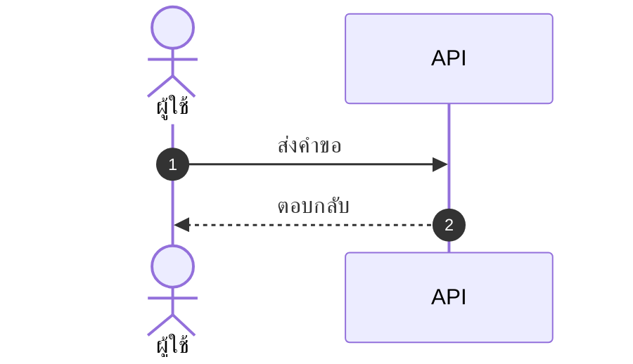

# skill: principle-prove-it-works

Use before saying anything is done, fixed, passing or working (code, fix, mockup, document, migration, measurement). Verify against the real artifact, never a proxy like it compiles or the subagent said so.

# principle · prove it works — พิสูจน์กับของจริง

> "เสร็จแล้ว" ที่ไม่มีหลักฐาน คือการโยนงานตรวจไปให้คนอื่น

## กฎ

ก่อนใช้คำว่า เสร็จ · แก้แล้ว · ผ่าน · ใช้ได้ ต้องเห็นผลจากของจริงด้วยตาตัวเองในรอบนี้

| งาน | หลักฐานที่นับ | ไม่นับ |
|---|---|---|
| ฟีเจอร์ | กดบนแอปที่รันอยู่ด้วย skill ตรวจแอป เห็นผลตามเกณฑ์ | compile ผ่าน · อ่านโค้ดแล้วดูถูก |
| ฟีเจอร์ที่ใช้ฮาร์ดแวร์ (เซนเซอร์ · กล้อง · GPS) | emulator + ค่าที่ฉีดเข้า = พิสูจน์**เส้นทางโค้ด** ติดป้าย `emulator` · ความแม่นยำต้องลองเครื่องจริง ติดป้าย `เครื่องจริง <รุ่น>` | emulator ผ่าน แล้วรายงานว่า "ค่าแม่น" |
| แก้บั๊ก | กรณีที่เคยล้ม รันแล้วผ่าน บนพื้นผิวเดิม | test อื่นผ่าน |
| test | test ล้มเมื่อโค้ดผิด (ลองทำให้ผิดดูหนึ่งครั้ง) | test ผ่าน |
| mockup | เปิดในเบราว์เซอร์ กดทุกปุ่ม ไม่มีปุ่มหลอก | HTML ถูกไวยากรณ์ |
| เอกสาร | เปิดไฟล์ที่ render แล้ว ตรวจข้อกำหนดทีละข้อ | เขียนไฟล์สำเร็จ |
| ตัวเลขที่วัด | รู้ว่าอะไรจำกัดตัวเลขนั้น และวัดซ้ำได้ใกล้เคียง · ค่าทางกายภาพ (lux · ระยะ · น้ำหนัก) เทียบกับเครื่องมือวัดอ้างอิงที่สอบเทียบแล้ว — ไม่มีเครื่องมือ เขียน `ยังไม่ตรวจความแม่นยำ` | วัดครั้งเดียว · เทียบกับตัวเอง |
| งานของ subagent | อ่าน diff และรันเอง | subagent รายงานว่าเสร็จ |

## วิธีทำ

1. ก่อนลงมือ เขียนว่า "จะรู้ได้อย่างไรว่าเสร็จ" เป็นสิ่งที่ตรวจได้
2. หลังทำ ตรวจตามนั้นกับของจริง บันทึกผลดิบ (ตัวเลข · ภาพ · output)
3. ตรวจไม่ได้จริง ๆ (ไม่มีสภาพแวดล้อม · ต้องใช้บัญชีจริง) → บอกตรง ๆ ว่า `ยังไม่ตรวจ` และขาดอะไร ห้ามเขียน `ผ่าน`

## สัญญาณว่ากำลังข้าม

- คำว่า "น่าจะ" · "ควรจะ" · "ในทางทฤษฎี" ในรายงานจบงาน
- ส่งคำสั่งให้ผู้ใช้ไปรันเอง ทั้งที่เรารันได้
- ตรวจแค่ส่วนที่ง่าย แล้วสรุปรวมว่าผ่านทั้งหมด


---

# skill: decision-log

Use whenever an agent makes a judgment call on its own during long or unattended work (choosing an approach, filling a gap, resolving conflicting docs, skipping something). Appends one auditable row to docs/BUILD-PLAN.md.

# decision-log — ทุกการตัดสินใจเองต้องตรวจย้อนได้

> ให้ agent ทำต่อเองโดยไม่ถามได้ ก็ต่อเมื่อคนกลับมาเห็นได้ว่ามันเลือกอะไรไปบ้าง และกลับคำตัดสินทีละข้อได้

มาจาก `show-me-your-work` ของ pstack · ปรับให้ใช้ไฟล์เดียวกับ [`status-report`](../status-report/SKILL.md)

## เขียนที่ไหน

`docs/BUILD-PLAN.md` หัวข้อ `## ตัดสินใจเอง` — หัวข้อสุดท้ายของไฟล์ · ลำดับเต็ม: `## สถานะล่าสุด` → ตารางงาน → `## ประวัติสถานะ` → `## ตัดสินใจเอง` · ไม่มีหัวข้อหรือไม่มีไฟล์ ให้สร้าง
subagent ไม่เขียนเอง — **รายงานการตัดสินใจกลับมา** ตัวหลักเป็นคนลงตาราง

```markdown
## ตัดสินใจเอง

| วันที่ | งาน | เรื่อง | เลือก | ไม่เลือก | เหตุผล · หลักฐาน |
|---|---|---|---|---|---|
| 2026-10-04 15:40 | SRS | เวลาตอบสนองหน้าค้นหา | ≤ 2 วินาที (รอยืนยัน) | ≤ 1 วินาที | BRD ไม่ระบุ · ใช้ค่าที่ระบบเดิมทำได้ (วัดจริง 1.6 วินาที) |
| 2026-10-04 16:05 | FR-012 | เก็บไฟล์แนบ | ดิสก์ในเครื่อง + path ในฐานข้อมูล | object storage | ขนาดงาน S · ย้ายทีหลังได้ · ADR-004 |
```

## ต้องลงเมื่อ

- เลือกระหว่างหลายทางที่ใช้ได้ทั้งคู่
- เอกสารไม่ได้บอก แล้ว agent เติมค่าเอง
- เอกสารสองฉบับขัดกัน แล้วเลือกยึดฉบับหนึ่ง
- ข้ามขั้นตอนหรือฉบับที่สั่ง เพราะทำไม่ได้หรือไม่จำเป็น
- ผลทดลองตัดสินทางเลือก (จาก playbook `prototype` หรือ `parallel-attempts-pick-best`)

**ไม่ต้องลง** — เรื่องที่ skill หรือเอกสารสั่งไว้ชัดแล้ว · การตั้งชื่อตัวแปรทั่วไป

## หลักการเลือกเมื่อต้องตัดสินเอง

เลือกทางที่ผลกระทบน้อยสุด — ย้อนกลับง่าย · แก้ไฟล์น้อย · ตรงกับที่เอกสารหรือ repo ใช้อยู่ · ไม่ปิดทางเลือกอื่น
**ข้อเท็จจริง** (ตัวเลข ชื่อ วันที่ งบ) ห้ามเดา — ใส่ค่าที่ใช้ชั่วคราวพร้อม `(รอยืนยัน)` แล้วลงคำถามใน "ค้างอยู่" ของ `status-report` · งานที่ย้อนไม่ได้ เตรียมคำสั่งหรือ diff ไว้ใน "รออนุมัติ" — ไม่ทำเอง

## กติกาของแถว

- หนึ่งแถวต่อหนึ่งการตัดสินใจ · ลงทันทีที่ตัดสิน ไม่รวบไปเขียนตอนจบ
- "ไม่เลือก" ต้องมีอย่างน้อยหนึ่งทาง — ถ้าไม่มีทางอื่นเลย ไม่ใช่การตัดสินใจ
- "เหตุผล · หลักฐาน" ระบุที่มา — ไฟล์ · ADR · ตัวเลขที่วัด · ติดป้าย `วัดจริง` / `อนุมาน` เมื่อเป็นตัวเลข
- ไม่ลบแถวเก่า · ผู้ใช้ไม่เห็นด้วย แก้ที่แถวนั้นแล้วสั่งทำใหม่เฉพาะงานนั้น
- **ผู้ใช้เป็นคนตัดสินเอง** (เช่น ยอมรับความเสี่ยงจาก `security-gate`) ลงตารางเดียวกัน แล้วเพิ่มคอลัมน์ท้าย `ผู้ตัดสิน` = `agent` · `ผู้ใช้` · ไม่มีคอลัมน์นี้ = agent ตัดสินทุกแถว

## ในคำตอบตอนจบ

หัวข้อ **ตัดสินใจเอง** ท้ายคำตอบ แสดง**ทุกแถวของรอบนี้** (เลือกอะไร · ไม่เลือกอะไร · ทำไม หนึ่งบรรทัด) แล้วชี้ไปที่ตารางเต็ม
เกิน 15 แถว สรุปเป็นกลุ่มได้ (เช่น "เลือก dependency 6 ตัว") แต่ต้องบอกจำนวนรวมและลิงก์ไปที่ตาราง · แถวที่กระทบผลมากยังต้องแสดงเต็ม


---

# skill: simplicity-first

Use when producing a document, design, architecture or plan (BRD, FSD, ADR, roadmap, UX, API design, sprint plan). Simplest version that works, the tired-teammate test, no buzzwords or extra layers. For code use lazy-coding.

# Simplicity First

> The best architecture has the fewest moving parts. The best plan is the one a
> teammate can follow with no context.

This skill covers **non-code outputs** — documents, plans, architecture, and
designs. For code, use `lazy-coding`.

## The one test

Before submitting, ask:

> Could a tired teammate understand this in 6 months, with no prior context?

If "no" or "not sure" → simplify.

## 5 principles

1. **Start with the simplest thing that works.** Add complexity only when something breaks.
2. **Reduce moving parts.** Each component adds failure modes, ops burden, and docs. Default to one thing.
3. **Use familiar patterns.** Boring, proven tech for critical paths. Save novelty for low-risk experiments.
4. **Optimize for reading.** It's read far more often than written.
5. **Delete &gt; add.** The best edit removes something. The worst adds a layer for an imagined future need.

## By output type

### Documents (BRD, FSD, ADR)

Do: short sentences (≤ 20 words), plain English, one idea per paragraph, an
example for every abstract point, tables for structured data.

Avoid: marketing-speak ("revolutionary", "best-in-class", "synergy"), undefined
jargon, walls of text, hedging ("might possibly potentially"), acronym soup.

### Architecture

Do: monolith first (split only when a bottleneck is proven), familiar stack,
standard patterns (REST, queues, caches), single source of truth per data type.

Avoid: microservices for small teams, distributed-everything, multi-master
databases before you must, event-driven by default (sync is simpler).

### Plans

Do: 3-5 priorities (not 20), a named owner per item, measurable success
criteria, realistic timelines with buffer, cut scope to fit time.

Avoid: vague goals ("improve quality"), 50-item lists (= no priority),
aspirational dates with no buffer, plans without success metrics.

### Designs (UX, API)

Do: fewest steps to the user's goal, reuse existing patterns, stay consistent
across screens, defaults that work for 80%, progressive disclosure.

Avoid: novel interactions where a standard one works, 10-step flows when 3
work, required fields with no smart default, hidden features needing tutorials.

## The 3-question filter

Before adding any new component, configuration option, or pattern:

1. Is there real evidence we need this **now** (not "might need")?
2. Is there a simpler way? (Sleep on it. Often yes.)
3. What's the cost of **not** adding it? (Often nothing, or a small refactor later.)

Two or more answers point to "simpler is fine" → don't add it.

## Examples

**API description**

❌ "This sophisticated, enterprise-grade endpoint leverages state-of-the-art
authentication to facilitate the seamless retrieval of user profile data."

✅ "`GET /users/{id}` returns a user profile. Requires a Bearer token. Use
`?fields=name,email` to limit the response."

**Sprint goal**

❌ "Improve overall product quality and customer satisfaction through various
initiatives."

✅ "Reduce login errors by 50% (8% → 4%): fix timeout bug (2d), retry on
transient errors (1d), clearer error messages (1d)."

**Architecture for a new feature**

❌ "Event-sourced microservice with CQRS, Kafka ingestion, Redis cache, and a
dedicated auth service."

✅ "Add an endpoint to the existing API. One Postgres table for state. Standard
auth middleware. Log to the existing system."

## Anti-patterns to reject

- **Future-proofing** — abstractions for needs that never arrive.
- **"It might scale"** — infra for 1M users while you have 1k.
- **Layer cake** — 6 layers where 90% just pass through.
- **Resume-driven design** — fancy tech to look sophisticated.
- **Buzzword stacking** — "cloud-native event-driven AI-powered".

## Pre-submit checklist

- [ ] A tired teammate would understand this in 6 months.
- [ ] Nothing can be deleted without losing meaning.
- [ ] No jargon the audience won't know.
- [ ] Every abstract claim has an example.
- [ ] I could explain the whole thing in two sentences.

If any answer is "no" → simplify before delivering.

> "Perfection is achieved not when there is nothing more to add, but when there
> is nothing left to take away." — Saint-Exupéry


---

# skill: polished-document-style

Use when producing stakeholder-facing documents (BRD, FSD, ADR, status reports, audits, postmortems) that need polished formatting. Rich Markdown and Mermaid conventions that render well in GitHub, Notion, VS Code and Obsidian.

# Polished Document Style

## When to use this skill

- Output is meant for **non-developers** to read (PMs, executives, clients)
- Document needs **sign-off** or formal review
- Output will be **shared widely** or converted to PDF/Word later
- Any doc with 3+ sections or 500+ words

## When NOT to use

- Internal developer-only specs (keep them concise)
- Quick scratch notes
- Code comments / inline docs

> ℹ️ **Note:** This skill governs the *markdown source*. When the deliverable is a
> rendered **.docx / .pptx / .pdf** that a stakeholder will open, use
> `branded-document-design` on top of it — that skill carries the design tokens,
> the typography scale, Thai typography rules, and the `brandkit.py` builder.

---

## Document Header (Always)

Every polished doc MUST start with:

```markdown
# 📋 <Document Title>

> **Version:** 1.0 · **Date:** YYYY-MM-DD · **Status:** 🟡 Draft
> **Authors:** <names> · **Reviewers:** <names>
> **Tags:** `<area>` `<topic>`

---
```

Status values:
- 🟡 **Draft** — work in progress
- 🔵 **Review** — under stakeholder review
- 🟢 **Approved** — signed off
- ⚪ **Archived** — historical reference

---

## Section Hierarchy

- **H1** — Document title (exactly one)
- **H2** — Numbered sections (`## 1. Section`)
- **H3** — Sub-sections (`### 1.1 Sub-topic`)
- **H4** — Rare, use only if needed

**Always add Table of Contents** for docs with 5+ sections:

```markdown
## 📑 Table of Contents

1. [Executive Summary](#1-executive-summary)
2. [Scope](#2-scope)
3. [Details](#3-details)
```

---

## ธีมของเอกสาร — ตัดสินใจครั้งเดียว ใช้ทุกที่ในเอกสารนั้น

เอกสารหนึ่งฉบับผ่านมือหลาย skill — markdown ตัวนี้ · รูปจาก `software-diagrams` ·
ไฟล์ .docx จาก `branded-document-design` · สไลด์จาก `presentation-design`
ถ้าแต่ละตัวเลือกสีเอง ผู้อ่านจะได้เอกสารที่รูปสีหนึ่ง หัวข้อสีหนึ่ง และสไลด์อีกสีหนึ่ง

**markdown คือ source of truth ธีมจึงประกาศไว้ที่นี่** — ใส่ไว้ท้ายส่วนหัวของเอกสารหรือในไฟล์ข้างกัน:

```markdown
<!-- doc-theme: accent=<สีหลัก> · ที่มา=<แบรนด์ลูกค้า / เสนอจากเนื้องาน> · ยืนยันเมื่อ=YYYY-MM-DD -->
```

**สีหลักมาจากเนื้องาน ไม่ใช่จากค่าเริ่มต้นของเครื่องมือ**
มีสีแบรนด์อยู่แล้วใช้สีนั้น · ยังไม่มีให้เสนอโทนจากเนื้องานแล้วรอผู้ใช้ยืนยัน
(ตารางเนื้องาน → โทน อยู่ใน `svg-diagram-system` ข้อ 0)

| ส่วนของเอกสาร | ใครคุมสี | อ่านค่าจาก |
|---|---|---|
| หัวข้อ ตาราง กล่องข้อความใน markdown | markdown ไม่มีสี ใช้อิโมจิและน้ำหนักตัวอักษรแทน | — |
| ไดอะแกรม Mermaid | `software-diagrams` ข้อ 2 | `doc-theme` |
| รูปที่เป็นไฟล์ภาพ | `svg-diagram-system` · `diagram-figures` | `doc-theme` |
| ไฟล์ .docx / .pdf ที่ส่งออก | `branded-document-design` ข้อ 0–1 | `doc-theme` |
| สไลด์ | `presentation-design` | `doc-theme` |

**สีสถานะไม่นับรวม** — 🔴 วิกฤต 🟢 ผ่าน ต้องคงความหมายเดิมไม่ว่าธีมจะเป็นสีอะไร

### ค่าตั้งต้นประจำบ้าน (house default)

ถ้า `doc-theme` ยังไม่ประกาศ accent เฉพาะงาน ทุก skill ใช้ชุดนี้เป็นค่าตั้งต้น เพื่อให้รูป เอกสาร และสไลด์เป็นชุดสีเดียวกันตั้งแต่แรก ชุดนี้คือชุดเดียวกับ `presentation-design` และ `branded-document-design`:

| token | ค่า | ใช้กับ |
|---|---|---|
| brand | `#2A78D6` | สีหลัก · หัวข้อ · เส้น accent |
| brand-deep | `#2A4C86` | หัวตาราง · H2 · ชื่อระบบ |
| brand-2 | `#6A5CD6` | accent รอง (ม่วง) |
| tint | `#EDF1FB` | พื้นหัวตาราง · พื้นกล่องเน้น |
| ink / body | `#333B4A` / `#414957` | หัวข้อ / เนื้อความ |
| muted / faint | `#7D8492` / `#A9AEB9` | คำบรรยาย / หมายเหตุ |
| line | `#E4E7EE` | เส้นขอบ · เส้นเชื่อม |
| exception | `#C77A11` | ทาง/โซนที่ไม่ใช่เส้นทางหลัก (ต่างจาก brand เสมอ) |
| ฟอนต์ | Tahoma (เอกสาร/สไลด์) · Noto Sans Thai → Tahoma (ภาพ) | ทั้งไทยและอังกฤษ |

ประกาศ accent เฉพาะงานเมื่อไร ให้ค่านั้นทับ brand ส่วนที่เหลือคำนวณจาก accent เดียว

---

## Emoji Vocabulary

ใช้ให้**คงที่ทั้งเอกสาร** และใช้เพื่อ**หาของเจอเร็วขึ้น** ไม่ใช่เพื่อความน่ารัก

| ใช้ทำอะไร | ชุดที่ใช้ |
|---|---|
| ระดับความสำคัญ | 🔴 วิกฤต · 🟠 สูง · 🟡 กลาง · 🟢 ต่ำ |
| สถานะ | ✅ เสร็จ · 🚧 กำลังทำ · ⏳ รอ · ❌ ไม่ผ่าน · ⚠️ ต้องระวัง |
| ชนิดกล่องข้อความ | 💡 ข้อแนะนำ · 📌 ข้อควรจำ · 🚨 อันตราย · 📋 รายการตรวจ |
| หมวดเนื้อหา | 🎯 เป้าหมาย · 🏗️ สถาปัตยกรรม · 🔐 ความปลอดภัย · 📊 ตัวเลข · 🧪 การทดสอบ |

**หนึ่งอิโมจิต่อหัวข้อ ไม่ใช่ต่อบรรทัด** — เอกสารที่ทุกบรรทัดมีอิโมจิอ่านยากกว่าเอกสารที่ไม่มีเลย

---

## Callout Boxes

Use blockquotes with emoji prefix:

```markdown
> 💡 **Tip:** Brief actionable insight.

> ⚠️ **Warning:** Important caveat or limitation.

> 🚨 **Critical:** Must-read before proceeding.

> ℹ️ **Note:** Additional context or background.

> ❓ **Open Question:** Needs decision/clarification.
```

**Rules:**
- Keep callouts to 1-3 sentences
- One callout per topic — don't stack
- Don't overuse — max 3-5 per page

---

## Tables — When and How

### When to use tables instead of bullets

Use tables when items have **2+ attributes**:

❌ Don't use bullets:
```markdown
- email: string, required, unique
- age: number, optional
- role: enum, required, default "user"
```

✅ Use a table:
```markdown
| Field | Type   | Required | Default | Description       |
|-------|--------|:--------:|:-------:|-------------------|
| email | string | ✅       | —       | Unique login email|
| age   | number | ❌       | —       | Optional          |
| role  | enum   | ✅       | `user`  | Access level      |
```

### Table formatting tips

- Left-align text, center checkmarks/numbers, right-align money
- Use `—` (em dash) for "not applicable", not `-` or blank
- Keep cells short — long content goes in body paragraphs
- Bold key columns: `**email**`

---

## Mermaid Diagrams

**ตัวเลือกชนิดไดอะแกรม กติกาความอ่านง่าย ธีม และการจัดการป้ายภาษาไทย อยู่ใน `software-diagrams`**
skill นี้คุมเฉพาะเรื่องการวางไดอะแกรมลงในเอกสาร markdown

- วางไว้**หลังย่อหน้าที่อธิบายว่ารูปนี้ตอบคำถามอะไร** ไม่ใช่ลอยขึ้นมาเฉย ๆ
- ทุกรูปมีคำบรรยายใต้รูปหนึ่งบรรทัด ขึ้นต้นด้วย **รูปที่ N —**
- รูปเดียวกันอย่าใส่ซ้ำหลายที่ในเอกสาร ให้อ้างถึงเลขรูปแทน
- รูปที่ต้องส่งให้คนนอกทีมหรือใส่สไลด์ ใช้ `svg-diagram-system` แล้วฝังเป็นไฟล์ภาพ

````markdown

````

*รูปที่ 3 — ลำดับการเรียกเมื่อผู้ใช้กดบันทึก*

---

## Status Badges (Inline)

For key fields in headers/tables:

```markdown
**Status:** 🟢 Approved
**Priority:** 🔴 High
**Risk Level:** 🟡 Medium
**SLA:** ⚡ < 200ms
```

Multiple badges in a header:

```markdown
> 🟢 **Approved** · 🔴 **High Priority** · 👤 @alice · 🗓️ Due 2025-03-15
```

---

## Cover Block Pattern

For formal documents (BRD, FSD, ADR, postmortem):

```markdown
# 📋 <Title>

| | |
|--|--|
| **Document Type** | BRD \| FSD \| ADR \| Postmortem |
| **Version** | 1.2 |
| **Status** | 🟢 Approved |
| **Date** | 2025-01-15 |
| **Author(s)** | @alice, @bob |
| **Reviewer(s)** | @charlie |
| **Related** | [BRD-001](link), [FSD-005](link) |

---
```

---

## Comparison / Decision Tables

For trade-off analysis (architect, PM, SEO recommendations):

```markdown
| Option | Cost | Effort | Risk | Time-to-Value | Recommendation |
|--------|:----:|:------:|:----:|:-------------:|:--------------:|
| **A**  | 💰💰 | 🟡 Med | 🟢 Low | 🟢 Fast | ✅ Recommended |
| B      | 💰   | 🟢 Low | 🔴 High | 🟡 Med | ❌ Not recommended |
| C      | 💰💰💰| 🔴 High| 🟢 Low | 🔴 Slow | ⚪ Future consideration |
```

---

## Lists — When to nest, when to flatten

### ✅ Good list
```markdown
- Email is unique across all users
- Passwords must be 8+ characters with mixed case
- Sessions expire after 30 days of inactivity
```

### ❌ Bad list (over-nested)
```markdown
- Users
  - Email
    - Must be unique
    - Required
  - Password
    - 8+ chars
    - Mixed case
```

→ Should be a table instead.

**Rule:** Max 2 levels of nesting. More nesting = use a table.

---

## Code Blocks

Always specify language:

````markdown
```typescript
const user: User = { id: 1, email: 'a@b.com' };
```

```bash
npm install
```

```sql
SELECT * FROM users WHERE id = $1;
```
````

For long blocks, add file name as comment on first line:

```typescript
// src/services/auth.ts
export async function login(email: string, password: string) {
  // ...
}
```

---

## Approval/Sign-off Section (End of Doc)

For documents needing formal approval:

```markdown
## ✍️ Sign-off

| Role | Name | Status | Date |
|------|------|:------:|------|
| Product Owner | @alice | 🟢 Approved | 2025-01-15 |
| Tech Lead | @bob | 🔵 Reviewing | — |
| QA Lead | @charlie | ⚪ Not started | — |
| Security | @dave | ❌ Rejected | 2025-01-14 |
```

---

## Glossary Section

For docs with 5+ technical terms:

```markdown
## 📖 Glossary

| Term | Definition |
|------|------------|
| **API** | Application Programming Interface |
| **JWT** | JSON Web Token, used for stateless auth |
| **SLA** | Service Level Agreement |
```

Define acronyms on first use, then add to glossary.

---

## Quality Checklist

Before delivering any polished doc:

- [ ] H1 title with emoji marker
- [ ] Cover block with version, date, status, authors
- [ ] TOC if 5+ sections
- [ ] All sections numbered consistently
- [ ] Anchor links in TOC actually work
- [ ] Status badges where applicable
- [ ] Tables used (not bullets) where data has 2+ attributes
- [ ] At least one Mermaid diagram for any flow/relationship
- [ ] Callout boxes for tips/warnings (not just paragraphs)
- [ ] Code blocks have language hints
- [ ] Glossary for docs with 5+ acronyms
- [ ] No placeholder text (TBD, TODO, Lorem ipsum)
- [ ] Tested rendering in GitHub preview

---

> ไดอะแกรมในเอกสาร: ชนิดไหนตอบคำถามไหน และธีม Mermaid ชุดเดียวกันทั้งโปรเจกต์
> อยู่ใน `software-diagrams` · เอกสาร SRS โดยเฉพาะอยู่ใน `srs-writing`

## Anti-patterns


- ❌ **Emoji spam** — emoji in every heading just for decoration
- ❌ **All emoji, no labels** — `🔴 High` reads better than `🔴` alone
- ❌ **Deep nesting** — bullets 4+ levels deep, use tables instead
- ❌ **Walls of text** — paragraphs longer than 5 lines
- ❌ **Inconsistent terminology** — "user" in one section, "customer" in next
- ❌ **Diagrams that duplicate text** — diagram should add insight, not repeat
- ❌ **Tables of paragraphs** — if cells are >2 sentences, use headings instead
- ❌ **Skipping the cover block** — readers need version/status/date

---

## ตัวย่อ

เขียนตัวย่อเต็มครั้งแรกเสมอ แล้ววงเล็บตัวย่อไว้ — เช่น Model Context Protocol (MCP)
หลังจากนั้นใช้ตัวย่อได้ · รายละเอียดใน skill `spell-out-abbreviations`
