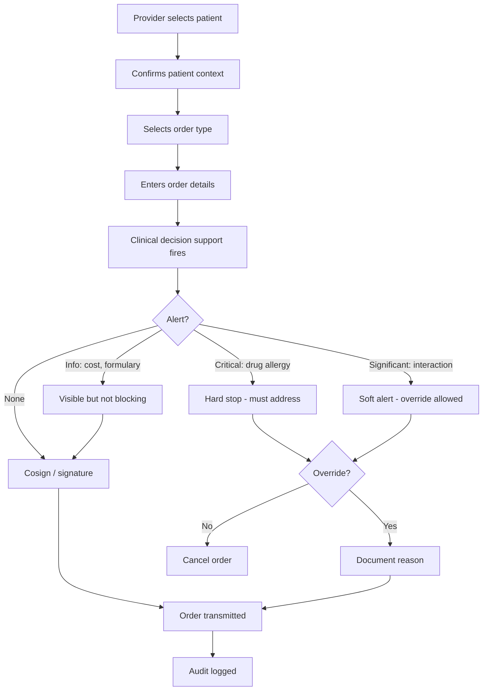

> เดิมคือ skill `clinical-workflows` ใน plugin `software-company-healthcare` — รวมเข้า `healthcare-systems` ใน v2.0.0

**สารบัญ:** 

- [When to use this skill](#when-to-use-this-skill)
- [Clinical Software Principles](#clinical-software-principles)
- [Order Entry Pattern (CPOE)](#order-entry-pattern-cpoe)
- [Medication Workflow](#medication-workflow)
- [Clinical Decision Support (CDS)](#clinical-decision-support-cds)
- [Patient Handoff (Shift Change, Transfer)](#patient-handoff-shift-change-transfer)
- [Patient: Jane Doe, MRN 12345, Room 304](#patient-jane-doe-mrn-12345-room-304)
- [Care Plan Management](#care-plan-management)
- [Patient Safety Patterns](#patient-safety-patterns)
- [Workflow Design Heuristics](#workflow-design-heuristics)
- [Common Pitfalls](#common-pitfalls)
- [Reference](#reference)

# Clinical Workflows

## When to use this skill

- Designing computerized provider order entry (CPOE)
- Building clinical decision support
- Building a medication workflow
- Designing patient handoff
- Managing care plans
- Shift change / signout tools

## Clinical Software Principles

### 1. Software supports the clinician, never replaces judgment
- A person must acknowledge each alert; never dismiss it automatically
- A human makes the final decision
- Record the reason for every override

### 2. Right info, right time, right format
- Don't bury critical info in long blocks of text
- Highlight what changed from the patient's baseline
- Use one color and icon per severity level across the whole system

### 3. Workflow > features
- Map the current clinical workflow first
- The new process must be FASTER than paper
- If it adds friction, staff stop using it or work around it

### 4. Cognitive load matters
- Doctors see 20+ patients per shift
- Every extra click is a patient safety issue
- Make common actions the default

## Order Entry Pattern (CPOE)



### Critical principles
- **Patient context lock** — confirm the patient before the order, and lock the patient while the order is entered
- **Allergy/interaction checks** — run them during entry, not after
- **Override documentation** — required, and pharmacy reviews it
- **Order set support** — ready-made groups of orders for a protocol (e.g., sepsis bundle)

## Medication Workflow

```
Prescribe → Verify → Dispense → Administer → Monitor

Each step:
- Different actor (often)
- Independent verification
- Logged
```

### 5 Rights of Medication
1. Right patient
2. Right drug
3. Right dose
4. Right route
5. Right time

The software MUST enforce all 5.

### Pattern: Bedside Medication Administration

```typescript
async function administerMedication(scan: {
  patientWristbandBarcode: string;
  medicationBarcode: string;
  nurseId: string;
}) {
  // 1. Verify patient
  const patient = await getPatientByBarcode(scan.patientWristbandBarcode);
  if (!patient) throw new Error('Patient barcode not recognized');

  // 2. Get scheduled meds for this patient
  const dueMeds = await getDueMedications(patient.id);

  // 3. Verify medication
  const med = await getMedicationByBarcode(scan.medicationBarcode);
  const matching = dueMeds.find(m => m.medicationCode === med.code);

  if (!matching) {
    // Wrong medication for this patient
    await alert.fire({
      severity: 'CRITICAL',
      type: 'MED_PATIENT_MISMATCH',
      patient: patient.id,
      attempted: med.code,
      nurse: scan.nurseId,
    });
    throw new ClinicalError('Medication does not match patient orders');
  }

  // 4. Verify timing
  if (!matching.isWithinWindow(now())) {
    requireOverride('Outside scheduled window');
  }

  // 5. Document administration
  await db.medicationAdministrations.create({
    patientId: patient.id,
    medicationCode: med.code,
    administeredBy: scan.nurseId,
    administeredAt: now(),
    orderId: matching.orderId,
  });
}
```

## Clinical Decision Support (CDS)

### Types of alerts

| Type | Trigger | UX |
|------|---------|----|
| 🚨 **Hard stop** | Will cause harm | Block until addressed |
| 🟠 **Significant** | Important consideration | Soft alert, override + reason |
| 🟡 **Informational** | Useful info | Visible, non-blocking |
| 💡 **Suggestion** | Could be better | Quiet, dismissible |

### Avoid Alert Fatigue

```python
# Track alert burden per user
# Too many = ignored = bad outcomes

ALERT_BUDGET_PER_PATIENT = 5  # not a hard rule, but signal

# Suppress redundant alerts
# Don't fire same alert if user just overrode
# Tune thresholds based on actual harm signal
```

### CDS Hooks (modern pattern)

```
Trigger: patient-view, order-select, order-sign, encounter-discharge

EHR → CDS Service:
{
  "hook": "order-select",
  "hookInstance": "...",
  "context": {
    "patientId": "...",
    "userId": "...",
    "selections": [...]
  },
  "prefetch": { "patient": {...}, "medications": [...] }
}

CDS Service → EHR (cards):
{
  "cards": [
    {
      "summary": "Drug interaction: warfarin + aspirin",
      "indicator": "warning",
      "source": { "label": "CDS Service" },
      "suggestions": [...]
    }
  ]
}
```

## Patient Handoff (Shift Change, Transfer)

### SBAR Format
- **S**ituation — what's happening now
- **B**ackground — relevant history
- **A**ssessment — current state, concerns
- **R**ecommendation — what's needed

```markdown
## Patient: Jane Doe, MRN 12345, Room 304

### S - Situation
65F admitted 2 days ago for pneumonia. Currently stable on O2.

### B - Background
- Active: DM2 (controlled), HTN
- Allergies: PCN, sulfa
- Admit dx: CAP, R lower lobe
- Cultures pending

### A - Assessment
- Vitals stable last 12h (96/min, 16/min, 110/68, 99.4F, 95% on 2L)
- Tolerating PO, eating 50%
- IV abx (Cefepime, day 3 of 7)
- WBC trending down (15 → 12 → 9)

### R - Recommendations / Plan
- Continue current abx
- D/C O2 if SpO2 > 92% on RA
- Discharge planning for tomorrow if cultures finalize
- Watch for AMS (sundowning at home)

### Tasks for incoming
- Check 6am labs (CBC, BMP, troponin)
- Page Dr. Smith if hemodynamics change
- Family update call at 10am
```

## Care Plan Management

```typescript
interface CarePlan {
  id: string;
  patientId: string;
  status: 'active' | 'completed' | 'cancelled';
  intent: 'plan' | 'order' | 'proposal';
  category: string;        // e.g., 'diabetes-management'
  startDate: Date;
  endDate?: Date;
  goals: Goal[];
  activities: PlannedActivity[];
  careTeam: CareTeamMember[];
}

interface Goal {
  description: string;
  targetMeasure?: string;   // e.g., 'HbA1c < 7.0'
  targetDate?: Date;
  status: 'proposed' | 'in-progress' | 'achieved' | 'not-achieved';
}

interface PlannedActivity {
  type: 'medication' | 'lab' | 'visit' | 'procedure' | 'lifestyle';
  description: string;
  scheduledPeriod?: { start: Date; end?: Date };
  performer?: string;
}
```

## Patient Safety Patterns

### Wrong-patient prevention
- Always show 2+ identifiers
- Confirm before high-risk actions
- Use barcode scanning where possible
- Lock patient context during sensitive operations

### Medication safety
- Enforce the 5 rights
- Flag look-alike/sound-alike (LASA) drug pairs
- Check dose ranges for children and older adults
- Check allergies and drug-drug interactions (DDI) at order entry

### Critical results
- Set a hard time limit to notify the provider (e.g., 1 hour for critical labs)
- Escalate automatically if nobody acknowledges
- Confirm the loop is closed: the provider confirms receipt

## Workflow Design Heuristics

### Reduce clicks
- Pre-fill common values
- Suggest values based on history
- Offer bulk actions where they fit

### Match real workflow
- Tab through fields in clinical order, not data model order
- Group by clinical concept, not table structure
- Allow non-linear entry

### Forgive interruptions
- Save state often
- Let the user resume where they left off
- A phone call during entry must not lose their work

### Build for the worst case
- Tired nurse at 3am
- Multiple interruptions
- Patient deteriorating

## Common Pitfalls

- ❌ **Designing for an ideal workflow** — real clinical work is chaotic
- ❌ **Alert fatigue** — users stop seeing any alert
- ❌ **No patient context lock** — leads to wrong-patient errors
- ❌ **Treating medication like any other transaction** — the stakes are much higher
- ❌ **No override documentation** — nobody can review override patterns
- ❌ **One-size-fits-all UX** — ICU ≠ outpatient ≠ ED

## Reference

- [AHRQ Patient Safety](https://www.ahrq.gov/topics/patient-safety/index.html)
- [Joint Commission Patient Safety Goals](https://www.jointcommission.org/standards/national-patient-safety-goals/)
- [CDS Hooks specification](https://cds-hooks.org/)
- [ISMP (Institute for Safe Medication Practices)](https://www.ismp.org/)
