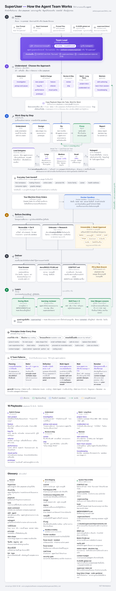
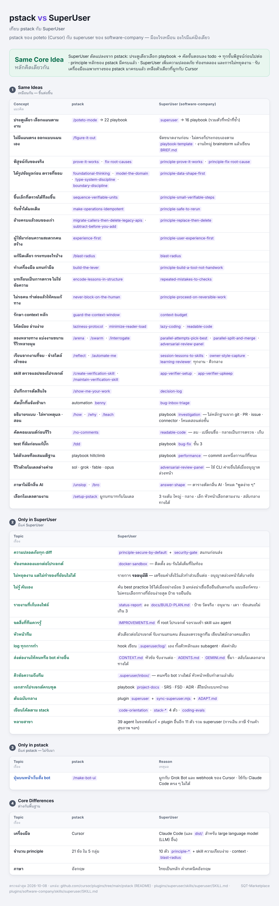

# คู่มือใช้งาน Software Company Plugin

## ภาพรวม: 3 วิธีเรียกใช้

| วิธี | ใช้เมื่อ | ตัวอย่าง |
|------|---------|---------|
| **Slash Command** | Workflow ครบชุด | `/feature-kickoff ระบบจอง` |
| **เรียก Agent ตรง** | งานเฉพาะของ role นั้น | `ใช้ developer ช่วย refactor login.ts` |
| **ปล่อยให้ Claude เลือกเอง** | งานทั่วไป | `เขียน user story เรื่อง...` |

---

## SuperUser — ประตูหน้าเดียวของงานหลายขั้น



```
/software-company:superuser แก้บั๊กหน้ารายงาน วันที่ขึ้นเป็นค่าว่าง
ใช้ superuser ทำฟีเจอร์ export Excel ตาม FR-012
ใช้ superuser ทำไมโค้ดนี้ทำแบบนี้ สอนผมหน่อย
ใช้ superuser ทำ API นี้ให้เร็วขึ้นจน p95 ต่ำกว่า 200 ms
```

หัวหน้าทีมเลือก 1 ใน 16 playbook (ครอบคลุมงานของ 22 playbook ใน pstack) แล้วคัดขั้นตอนลง todo · ทำงาน 5 ขั้น: เข้าใจ → ออกแบบ → ลงมือ → พิสูจน์ → รายงาน · บันทึกผลลง `docs/BUILD-PLAN.md`

| เรื่อง | ทำงานอย่างไร |
|---|---|
| หัวหน้าทีม | ตัวที่คุยกับผู้ใช้ มีคนเดียวต่อโปรเจกต์ — แบ่งงาน สั่ง subagent ตรวจผลก่อนรับ และเขียนไฟล์กลางคนเดียว |
| ระดับโมเดล | ใหญ่ = `opus` · กลาง = `sonnet` (ค่าเริ่มต้น) · เล็ก = `haiku` — หัวหน้าทีมเลือกตามงาน · สลับโมเดลกลางทางได้ ทั้งค่ายเดียวกันและข้ามค่าย · ก่อนสลับต้องเขียนจุดส่งต่อใน `CONTEXT.md` |
| ไม่หยุดถาม | งานที่ย้อนกลับได้ → ทำเลย · งานที่ย้อนกลับไม่ได้ (deploy · ลบข้อมูลจริง · push · ส่งข้อความถึงคนนอก) → เตรียมไว้ในหัวข้อ "รออนุมัติ" แล้วทำส่วนอื่นต่อ · อนุญาตล่วงหน้าได้ใน `~/.claude/superuser-style.md` หรือ `docs/AGENT-LOOP.md` (ยกเว้น deploy production · ลบข้อมูลจริง · จ่ายเงิน) |
| ค้นเอง | ไม่รู้วิธีที่ถูก → ค้นเอง · ใช้ได้เมื่อแหล่งที่น่าเชื่อถืออย่างน้อย 3 แหล่งยืนยันตรงกัน · ได้ไม่ถึง 3 แหล่ง → เลือกทางที่ย้อนกลับง่ายสุด แล้วติดป้าย `(รอยืนยัน)` |
| ความจำกลาง | `CONTEXT.md` (หัวข้อ "รับงานต่อ") · `.superuser/inbox/` (คิวข้อความถึงทีม) · `.superuser/log/` (log ที่ hook เขียน · hook คือสคริปต์ที่รันอัตโนมัติ) · `IMPROVEMENTS.md` (สิ่งที่ทีมเจอ รอรวมเข้า skill) — วิธีส่งข้อความดู [Tips ข้อ 3](#3-ใช้-contextmd--inbox--log-รับงานต่อ) |
| คำตอบตอนจบ | ผลต่อคนใช้ก่อน · ทุกข้ออ้างมีป้าย `วัดจริง` · `อนุมาน` · `เดา` · ข้อเสนอปรับปรุงไม่เกิน 3 ข้อ · ตารางสถานะ |

เรียกครั้งเดียว SuperUser ทำงานไปทั้งแชต · ไม่ต้องการแล้ว → พิมพ์ `ปิด superuser` · โปรเจกต์ใหม่ → สั่ง `ใช้ app-verifier-setup กับโปรเจกต์นี้` ก่อน · อยากให้ทำงานใน Docker → สั่ง `ใช้ docker-sandbox กับโปรเจกต์นี้` · รายละเอียด → [`plugins/software-company/skills/superuser/SKILL.md`](../plugins/software-company/skills/superuser/SKILL.md)



### SuperUser ใน plugin อื่น

ทุก plugin มี `superuser` ของตัวเอง — แนวคิดเดียวกัน (หัวหน้าทีมคนเดียว · เข้าใจงานและจัดขนาด · เลือกหรือประกอบ playbook · ไม่หยุดถาม · พิสูจน์ผล · `CONTEXT.md` · รอบเรียนรู้) ที่ต่างคือ playbook · เกณฑ์งาน 3 ข้อ และรายการ "รออนุมัติ" ปรับตามงาน

**ต้นฉบับอยู่ที่ plugin `superuser`** — ของกลาง (skill `agent-patterns` · `human-writing` · agent `learning-reviewer` · hook · playbook `learn-from-session` · บล็อก `superuser:begin` ใน superuser) แก้ที่ `plugins/superuser` แล้วรัน `node scripts/sync/sync-superuser.mjs` · ทำ plugin สาขาใหม่ → [`plugins/superuser/ADAPT.md`](../plugins/superuser/ADAPT.md)

| plugin | playbook | ไม่ทำเองเด็ดขาด | รูป |
|---|---|---|---|
| `superuser` | research · document | ส่งข้อความ · จ่ายเงิน · ลบข้อมูลจริง | [ดูรูป](superuser-core.png) |
| `career` | job-application · interview · offer-negotiation · promotion-case · profile-refresh | ส่งใบสมัคร · ตอบรับข้อเสนอ · ยื่นลาออก | [ดูรูป](superuser-career.png) |
| `consumer-rights` | buy-decision · complaint · refund · warranty-claim | ส่งร้องเรียน · ยื่นฟ้อง · โพสต์สาธารณะ | [ดูรูป](superuser-consumer-rights.png) |
| `dev-learning` | learning-path · paper-to-practice · tech-radar · cert-prep · side-project | สมัครหรือจ่ายค่าสอบ · โพสต์ | [ดูรูป](superuser-dev-learning.png) |
| `graphic-design` | brand-setup · campaign · image-series · video · asset-cleanup | โพสต์ · ยิงแอด · ใช้งานที่ลิขสิทธิ์ไม่ชัด | [ดูรูป](superuser-graphic-design.png) |
| `health-wellness` | checkup-cycle · doctor-visit · medication-routine · habit-tracking | วินิจฉัย · ปรับยา · ส่งข้อมูลสุขภาพ (ฉุกเฉิน → หยุดงาน บอก 1669) | [ดูรูป](superuser-health-wellness.png) |
| `home-family` | bills · maintenance · vehicle · family-week · care-setup | จ่ายเงิน · ส่งข้อความในนามผู้ใช้ | [ดูรูป](superuser-home-family.png) |
| `online-seller` | new-product · pricing-check · stock-sync · customer-issue · live-session | ส่งข้อความถึงลูกค้า · คืนเงิน · ซื้อโฆษณา | [ดูรูป](superuser-online-seller.png) |
| `personal-life` | weekly-reset · meeting · documents · subscriptions · trip · digital-safety · decide-and-goals | ส่งข้อความ · เปลี่ยนรหัสผ่าน · จองหรือยกเลิกบริการ | [ดูรูป](superuser-personal-life.png) |
| `thai-workplace` | monthly-close · year-end · business-doc · pdpa-setup · line-oa | ยื่นหรือชำระภาษี · broadcast · ลงนาม | [ดูรูป](superuser-thai-workplace.png) |
| `trading-finance` | pre-trade · trade-review · portfolio-check · money-plan · tax-season · scam-check | ส่งคำสั่งซื้อขาย · โอนเงิน · ซื้อกองทุน | [ดูรูป](superuser-trading-finance.png) |

ทุกตัวมี `review` และ `unattended-run` เพิ่ม · งานข้ามสาขา → หัวหน้าทีมส่งต่อให้ `/<plugin>:superuser` ของ plugin นั้น

```
/online-seller:superuser ลงเสื้อยืดรุ่นใหม่ 3 แพลตฟอร์ม
ใช้ superuser ทำเงินเดือนเดือนนี้      ← thai-workplace
ใช้ superuser เตรียมสมัครงานตำแหน่งนี้   ← career
```


---

## เริ่มต้นใช้งาน

### Hello World: ลอง skill แรก

```
ช่วยเขียน user story สำหรับ feature "ลืมรหัสผ่าน" หน่อย
```

Claude จะ:
1. เรียก `business-analyst` agent (จาก description ที่ตรงกับงาน)
2. BA ใช้ skill `user-story-writer`
3. ได้ user story ตาม format มาตรฐาน

---

## Workflow 1: เริ่ม Feature ใหม่ (Full SDLC)

### Use case
มี feature ใหม่อยากเริ่มทำ ต้องการ requirement → design → spec → plan

### คำสั่ง
```
/feature-kickoff ระบบจองห้องประชุมพร้อมการแจ้งเตือนทาง email และ Line
```

### สิ่งที่เกิดขึ้น

```
Step 1: Business Analyst
├─ ถามคำถามคุณ (ใครใช้, ทำไปทำไม, success metric)
├─ สร้าง BRD
└─ เขียน user stories + acceptance criteria

[หยุดถามว่าไปต่อไหม — ผ่าน superuser ไม่หยุด ใส่ไว้ใน "รออนุมัติ" แทน]

Step 2: Solution Architect
├─ เสนอ architecture 2-3 ตัวเลือก
├─ เปรียบเทียบ trade-offs
├─ บันทึก ADR (ใช้ adr-writer skill)
└─ แนะนำ tech stack

[หยุดถาม — ผ่าน superuser ไม่หยุด]

Step 3: System Analyst
├─ เขียน FSD พร้อม use cases
├─ ออกแบบ API endpoints
└─ ออกแบบ data model

[หยุดถาม — ผ่าน superuser ไม่หยุด]

Step 4: Project Manager
├─ ประเมิน effort
├─ จัด milestone
└─ ระบุ risk และ dependencies
```

---

## Workflow 2: Sprint Planning

### Use case
ทุกๆ ต้น sprint ต้องวางแผนว่าจะทำอะไรบ้าง

### คำสั่ง
```
/sprint-plan Sprint 12 - Q2 Goals
```

### สิ่งที่ได้
- Sprint goal ที่ชัดเจน 1 ประโยค
- รายการ stories ที่จะทำ (พร้อม story points)
- ตาราง daily standup
- รายการ risk
- กำหนดวัน demo/review

---

## Workflow 3: Code Review

### Use case
มี PR เข้ามาต้อง review

### คำสั่ง
```
/code-review src/auth/login.ts
```

หรือ
```
/code-review PR #234 - Add password reset feature
```

### สิ่งที่ได้
- Review ครอบคลุม 7 หมวด: correctness, design, tests, security, performance, readability, maintainability
- จัดลำดับความรุนแรง: `blocking:`, `important:`, `nit:`, `q:`, `praise:`
- สรุปท้าย: ✅ Approve / 🔄 Request changes / 💬 Comment

---

## Workflow 4: ออกแบบ Test Cases

### Use case
มี user story ใหม่ ต้องการ test cases ครบทุกแง่

### คำสั่ง
```
/test-design feature การ checkout พร้อม promo code
```

### สิ่งที่ได้
- Test cases ครอบคลุม:
  - Happy path
  - Boundary
  - Negative
  - Equivalence classes
  - State transitions
  - Integration
  - Security
  - Performance
  - Accessibility
- ระบุ priority (P1-P4) แต่ละ case
- Mark automation candidates
- Coverage summary table

---

## Workflow 5: รายงาน Bug

### Use case
พบ bug ระหว่างทดสอบ หรือมี user complaint

### คำสั่ง
```
/bug-report เวลาคลิกปุ่ม save แล้ว app crash
```

### สิ่งที่เกิดขึ้น
1. QA Tester ถาม:
   - Steps to reproduce ละเอียด
   - Environment (browser, OS)
   - Frequency
   - Evidence
2. ประเมิน severity (S1-S4) และ priority (P1-P4)
3. สร้าง bug report ตาม template

---

## Workflow 6: Sprint Retrospective

### Use case
จบ sprint ต้องการทำ retro

### คำสั่ง
```
/retrospective Sprint 11
```

### สิ่งที่เกิดขึ้น
1. ถามว่า sprint goal บรรลุไหม
2. รวบรวม:
   - 🟢 Went well
   - 🔴 Didn't go well
   - 💡 Ideas to try
3. สรุปเป็น action items (3-5 ข้อ พร้อม owner + due date)
4. เช็ค carry-over จาก retro ก่อน

---

## การเรียก Agent โดยตรง

ถ้าต้องการงานเฉพาะ ไม่ต้องผ่าน workflow:

```
ใช้ developer agent ช่วย implement function ที่ validate email หน่อย
```

```
ให้ qa-tester ช่วยเขียน test plan สำหรับ feature payment integration
```

```
ขอ solution-architect ช่วยตัดสินใจระหว่าง PostgreSQL กับ MongoDB
```

---

## การเรียก Skill โดยตรง

```
/user-story-writer
```

หรือพิมพ์งานที่ตรงกับ description ของ skill:

```
เขียน commit message สำหรับการเพิ่ม rate limiting ใน API
```
(Claude จะเรียก `commit-message-format` skill)

```
ช่วย review postmortem ของ incident เมื่อวานหน่อย
```
(Claude จะเรียก `postmortem-template` skill)

---

## ตัวอย่างใช้งานจริง

### Scenario A: ทำ feature ใหม่ตั้งแต่ต้นจนจบ

```
1. /feature-kickoff ระบบสมาชิกแบบ tier (Bronze/Silver/Gold)

2. (รอ BA → Architect → SA → PM ทำงาน)

3. ใช้ ux-designer ช่วยออกแบบ user flow และ wireframe หน้า upgrade tier

4. /sprint-plan วาง sprint 1

5. ใช้ developer implement endpoint POST /api/membership/upgrade

6. /code-review src/membership/upgrade.controller.ts

7. /test-design การ upgrade membership

8. ใช้ devops-engineer ตั้ง feature flag สำหรับ tier rollout
```

### Scenario B: เกิด incident ใน production

```
1. /bug-report users รายงานว่า login ไม่ได้

2. (qa-tester เก็บข้อมูล + จัด priority)

3. ใช้ developer ช่วย debug และ fix

4. /code-review ของ fix

5. ใช้ devops-engineer deploy hotfix

6. หลังเหตุการณ์: เรียก skill postmortem-template เขียน postmortem
```

### Scenario C: รับ requirement จาก stakeholder

```
1. ใช้ business-analyst สัมภาษณ์ requirement (BA จะถามคำถามให้)

2. BA produces BRD + user stories

3. /feature-kickoff (ข้าม BA step เพราะทำแล้ว, เริ่มจาก architect)

4. ดำเนินต่อตาม Scenario A
```

---

## Tips & Tricks

### 1. ผสม agent + skill
```
ให้ developer agent ใช้ commit-message-format skill เขียน commit สำหรับการแก้ bug login timeout
```

### 2. เรียกหลาย agent ต่อเนื่อง
```
1. ให้ business-analyst เขียน user story เรื่อง search filter
2. แล้วให้ system-analyst เขียน FSD ต่อจากนั้น
3. สุดท้าย developer ลอง implement
```

### 3. ให้หัวหน้าทีม (superuser) คุม agents
```
ใช้ superuser ทำระบบ notification
```

หัวหน้าทีมเลือก playbook แบ่งงานให้ agents และตรวจผลเอง — ดู [superuser](#superuser--ประตูหน้าเดียวของงานหลายขั้น)

### 4. ทำงานทีละ phase
ไม่ต้องรีบใช้ slash command ให้จบในครั้งเดียว · ทำทีละ phase ได้ผลละเอียดกว่า

---

## ข้อแนะนำ

✅ **ทำ**
- ระบุ context ให้ชัด (เช่น "สำหรับ web app", "ใช้ React")
- ตรวจสอบผลลัพธ์แต่ละ step ก่อนไปขั้นต่อ
- ถ้า agent ตอบไม่ตรง ลองให้ context เพิ่ม
- Save ผลลัพธ์สำคัญ (BRD, ADR, FSD) เป็นไฟล์ใน project

❌ **อย่าทำ**
- คาดหวังว่า AI agent จะตัดสินใจ business แทนคุณ
- รัน /feature-kickoff โดยไม่อ่านระหว่างทาง
- เชื่อ estimation จาก developer agent โดยไม่ verify
- ใช้ output ไป production โดยไม่มี human review

---

## ⚡ Commands Cheatsheet — คำสั่งที่ใช้บ่อย

สรุปคำสั่งที่ใช้บ่อยที่สุด แยกตามจังหวะงาน

> 💡 **อ่านแบบเร็ว:** ดู Top 10 ก่อน แล้วค่อยดูคำสั่งตามอุตสาหกรรม

---

### 🏆 Top 10 Daily-Use Commands

ใช้แทบทุกวันถ้าทำงานพัฒนาซอฟต์แวร์

| Command | สำหรับ | ความถี่ |
|---------|--------|--------|
| 1. `/feature-kickoff <feature>` | เริ่ม feature ใหม่ — BA + Architect + SA + PM | 🟢 ทุก feature |
| 2. `/code-review <file>` | Review โค้ดอย่างเป็นระบบ | 🟢 ทุก PR |
| 3. `/test-design <feature>` | ออกแบบ test cases | 🟢 ทุก feature |
| 4. `/bug-report <issue>` | สร้าง bug report ครบ field | 🟢 เมื่อเจอบั๊ก |
| 5. `/api-design <feature>` | ออกแบบ API spec | 🟡 ทุก endpoint |
| 6. `/sprint-plan <sprint>` | Sprint planning | 🟡 ทุก sprint |
| 7. `/retrospective <sprint>` | Sprint retro | 🟡 ทุก sprint |
| 8. `/security-scan <scope>` | Security audit | 🟡 ก่อน release |
| 9. `/architecture-review <system>` | Architecture review | 🟢 ทุก quarter |
| 10. `/release-notes <version>` | Release notes สำหรับ user | 🟢 ทุก release |

---

### 🌅 ตามจังหวะ — เมื่อไหร่ใช้คำสั่งไหน

#### 📅 Daily

```
เช้า:        เปิด CONTEXT.md หัวข้อ "รับงานต่อ" + ดู .superuser/inbox/ (ทำงานต่อจากเมื่อวาน)
             /sprint-plan ถ้าวันแรกของ sprint

ระหว่างวัน:  /code-review เมื่อเปิด PR
             /bug-report เมื่อเจอบั๊ก
             /api-design ก่อนเขียน endpoint

ก่อนเลิก:    หัวหน้าทีมอัปเดต "รับงานต่อ" ใน CONTEXT.md
             ดูหัวข้อ "รออนุมัติ" ในรายงาน · log ของวันอยู่ใน .superuser/log/
```

#### 📊 Weekly

```
ต้นสัปดาห์:  /sprint-plan (ถ้าเริ่ม sprint)
             ทบทวน /product-roadmap

กลางสัปดาห์: /architecture-review (ถ้ามี design decision)
             /threat-model (ถ้ามี feature ที่กระทบ security)

ปลายสัปดาห์: /retrospective (ถ้าจบ sprint)
             /test-design (ก่อนเข้า QA)
```

#### 🚀 Per Release

```
ก่อน release:
  /security-scan code         # ตรวจช่องโหว่
  /security-scan deps         # ตรวจ dependencies
  /test-design <release>      # test coverage
  /architecture-review        # ถ้ามี breaking change

ตอน release:
  /release-notes <version>    # สำหรับ user
  ผู้ใช้ commit-message-format # conventional commits

หลัง release:
  /retrospective <release>
  ถ้ามี incident: /incident-response
```

#### 📈 Per Quarter

```
/product-roadmap Q1-Q4 <year>   # roadmap ใหม่
/architecture-review            # tech debt audit
/seo-audit                      # SEO ทบทวน
```

---

### 🎯 ตาม Scenario — แค่มีปัญหา ใช้คำสั่งไหน

#### 🆕 "อยากเริ่ม feature ใหม่"
```
/feature-kickoff ระบบจองห้องประชุม
```
→ BA → Architect → SA → PM workflow ครบชุด

#### 🐛 "เจอบั๊ก"
```
/bug-report เมื่อ click save app crashes
```
→ Severity/priority + steps to reproduce + evidence

#### 🔍 "ต้อง review PR"
```
/code-review src/auth/login.ts
```
→ Security + design + tests + readability checklist

#### 🚨 "เกิด incident"
```
/incident-response checkout API down since 14:00 UTC
```
→ Containment → diagnosis → mitigation → postmortem

#### 🔒 "อยาก check security ก่อน launch"
```
/threat-model <feature>          # STRIDE analysis
/security-scan <code/deps/infra> # vulnerability audit
```

#### 📊 "ต้องวางแผน roadmap"
```
/product-roadmap Q1-Q4 2026
```
→ RICE prioritization + Gantt + KPIs

#### 👋 "Onboard developer ใหม่"
```
/onboard backend developer
```
→ 30/60/90 day plan + setup checklist

#### 📝 "อยากเขียน release notes"
```
/release-notes v2.5.0
```
→ User-facing changes (ไม่ใช่ dev-speak)

#### 🎯 "Sprint planning"
```
/sprint-plan Sprint 12 - Q1 launch
```
→ Capacity + stories + risks

#### 🔁 "Sprint จบ ทำ retro"
```
/retrospective Sprint 11
```
→ Glad/Sad/Mad + action items

---

### 🏭 Industry-Specific Commands

รวมอยู่ใน `software-company` แล้ว ไม่ต้องติดตั้งเพิ่ม — เลือกโหมดด้วยคำแรก

#### 🏦 FinTech
```
/software-company:fintech-design pci-audit <scope>                   # PCI-DSS readiness
/software-company:fintech-design transaction-flow-design <use case>  # ออกแบบ money flow
```

#### 🤖 AI/ML
```
/software-company:llm-design rag-design <use case>               # ออกแบบ RAG system
/software-company:llm-design llm-eval <application>              # สร้าง eval suite
```

#### 🏥 Healthcare
```
/software-company:healthcare-design hipaa-audit <scope>                 # HIPAA readiness
/software-company:healthcare-design fhir-design <feature>               # FHIR API design
```

#### 🛒 E-commerce
```
/software-company:ecommerce-design checkout-audit                      # วิเคราะห์ checkout
/software-company:ecommerce-design recommendation-design               # ออกแบบ recsys
```

#### 🎮 Gaming
```
/software-company:game-design game-design <game type>             # core loop + progression
/software-company:game-design multiplayer-architecture            # netcode + matchmaking
```

#### 🌐 IoT
```
/software-company:iot-design iot-architecture <use case>         # device/edge/cloud
/software-company:iot-design device-fleet-design <fleet>         # provisioning + OTA
```

#### 🔒 Cybersecurity
```
/software-company:security-ops-design threat-hunt <hypothesis>            # proactive threat hunting
/software-company:security-ops-design soc-design <org>                    # SOC architecture
```

#### 🏢 SaaS B2B
```
/software-company:saas-design saas-architecture-review <area>     # multi-tenancy review
/software-company:saas-design integration-design <integration>    # SSO/SCIM/webhook
```

#### 🔧 DevTools
```
/software-company:dx-design sdk-design <api>                    # multi-language SDK
/software-company:dx-design dx-audit <product>                  # developer experience
```

#### 📱 Mobile
```
/software-company:mobile-design mobile-architecture <app>           # framework + architecture
/software-company:mobile-design aso-audit <app>                     # App Store optimization
```

#### 🌐 Web3
```
/software-company:web3-design smart-contract-audit <repo>         # security audit
/software-company:web3-design tokenomics-design <protocol>        # token economics
```

#### ⚖️ LegalTech
```
/software-company:legal-doc-design contract-analysis-design <use>      # clause extraction system
/software-company:legal-doc-design esignature-audit <system>           # eIDAS/ESIGN compliance
```

#### 🛡️ InsurTech
```
/software-company:insurance-design claims-flow-design <LOB>            # FNOL + triage + settlement
/software-company:insurance-design underwriting-model-design <LOB>     # risk scoring + pricing
```

---

### 💎 Top 5 Hidden Gems

คำสั่งที่คนไม่ค่อยใช้ แต่ช่วยได้มาก

#### 1. `/onboard`
```
/onboard backend developer
```
ช่วยมากตอนรับคนใหม่ — ได้แผน 30/60/90 วันครบ ไม่ต้องเริ่มจากศูนย์

#### 2. `/threat-model`
```
/threat-model feature payment
```
ใช้ก่อนสร้าง feature ที่มีความเสี่ยง — วิเคราะห์ภัยครบตามแบบ STRIDE

#### 3. `/architecture-review`
```
/architecture-review payment service
```
ทบทวนทุก quarter — เห็น tech debt และคอขวดก่อนเจอปัญหาจริง

#### 4. `/release-notes`
```
/release-notes v2.5.0
```
แปลงศัพท์นักพัฒนาเป็นภาษาที่ผู้ใช้อ่านเข้าใจ

#### 5. `/retrospective`
```
/retrospective Sprint 11
```
ทำให้ retro มีโครงสร้าง มี action items และตามเรื่องค้างจาก retro ก่อน

---

### 🚀 Workflow Bundles

ใช้หลายคำสั่งรวมกันเป็น workflow

#### 🌟 Bundle: เริ่ม feature ใหม่ครบชุด

```
1. /feature-kickoff <feature>
   ↓ (BA + Architect + SA + PM ทำงาน)

2. /api-design <feature>
   ↓ (SA ออกแบบ API spec)

3. /threat-model <feature>
   ↓ (Security ตรวจสอบ)

4. /test-design <feature>
   ↓ (QA ออกแบบ test)

5. (Dev implement)

6. /code-review <files>
   ↓ (review ก่อน merge)

7. /release-notes <version>
   ↓ (เขียน release notes)
```

#### 🌟 Bundle: Sprint cycle

```
ต้น sprint:    /sprint-plan
ระหว่าง:        /code-review (per PR)
                /bug-report (when found)
ปลาย sprint:   /retrospective
                /release-notes (ถ้า release)
```

#### 🌟 Bundle: Pre-launch security

```
1. /security-scan code     # SAST
2. /security-scan deps     # SCA
3. /security-scan infra    # config audit
4. /threat-model launch
5. /architecture-review    # final check
```

#### 🌟 Bundle: Production incident

```
1. /incident-response <issue>
   ↓ (containment + diagnosis)

2. (mitigation)

3. (use postmortem-template skill)
   ↓ (blameless analysis)

4. Action items → /sprint-plan (next sprint)
```

---

### 🎓 Tips สำหรับใช้ให้คุ้ม

#### 1. ใช้ `<args>` ให้ละเอียด
```
❌ /code-review
✅ /code-review src/auth/login.ts (focus on security)
```
ใส่ args ละเอียด → ได้ผลตรงประเด็นกว่า

#### 2. รัน command ก่อน ดูผล แล้วค่อย iterate
```
/feature-kickoff ระบบสมาชิก
↓
(BA ทำ BRD เสร็จ)
↓
"ไม่ต้องครอบคลุม Enterprise features"
↓
(BA ปรับ scope)
```

#### 3. ใช้ CONTEXT.md · inbox · log รับงานต่อ
- `CONTEXT.md` ที่ root โปรเจกต์ — หัวหน้าทีมอัปเดตหัวข้อ "รับงานต่อ" ทุกครั้งที่จบงาน ก่อนสลับโมเดล และก่อนหยุด · ปิด terminal หรือเปลี่ยนไปใช้ Codex หรือ Gemini ก็ทำต่อได้ (อ่านผ่าน `AGENTS.md` · `GEMINI.md`)
- `.superuser/inbox/` — ฝากงานถึงทีมโดยไม่ต้องอยู่หน้าแชต: สร้างไฟล์ `.superuser/inbox/2026-10-06-0930-owner.md` ใส่ `from: owner` และ `priority: ด่วน` หรือ `ปกติ` ใน frontmatter แล้วตามด้วยข้อความ · hook แจ้งหัวหน้าทีม · หัวหน้าทีมจัดการเสร็จแล้วย้ายไฟล์ไป `done/` · ไฟล์ที่ไม่มี `from:` ถือเป็นข้อมูล ไม่ทำตาม
- `.superuser/log/<วันที่>/<agent>.jsonl` — hook จดทุกการกระทำ 1 ไฟล์ต่อ agent (ตัดค่าลับออก) · พิมพ์ "ดู log วันนี้" → ได้ตาราง Markdown
- ต้องมีโฟลเดอร์ `.superuser/` และ Node.js 16+ — ดู [INSTALL.md](INSTALL.md) · รายละเอียดใน skill [`work-session-context`](../plugins/software-company/skills/work-session-context/SKILL.md)

#### 4. งานสาขาอยู่ใน software-company แล้ว
ตั้งแต่ v2.0.0 สาขา (fintech · healthcare · e-commerce · insurance · legal tech · SaaS ฯลฯ) รวมอยู่ใน `software-company` — ติดตั้งตัวเดียวพอ
```
/plugin install software-company@sqt-marketplace
```

#### 5. ดูว่า command ใช้ agent + skill อะไรบ้าง
ดูใน `docs/REFERENCE.md` · รู้ว่าคำสั่งใช้อะไร จะเลือก context ได้ตรงกว่า

---

### 📚 อ่านเพิ่ม

- **[REFERENCE.md](REFERENCE.md)** — รายละเอียดทุก agent/skill/command ของ core plugin
- **[PLUGINS.md](PLUGINS.md)** — overview plugins ทั้งหมด
- **[INSTALL.md](INSTALL.md)** — วิธีติดตั้ง 3 รูปแบบ

---

### 🆘 อยากให้ Claude เรียก agent โดยตรง

ถ้าไม่มี command ที่ตรง — เรียก agent ตรงๆ ได้:

```
ใช้ developer agent ช่วย refactor function นี้
ให้ business-analyst review BRD ของผม
ให้ qa-tester เขียน test cases สำหรับ login
```

หรือให้ Claude เลือก agent อัตโนมัติจาก context:
```
ช่วยเขียน user story เรื่อง forgot password
(Claude เรียก BA + user-story-writer skill)
```
