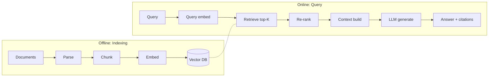

# RAG (Retrieval-Augmented Generation) Architecture

## When to use this skill

- Building Q&A over private documents
- Adding citations to LLM outputs
- Knowledge base updates frequently
- Specialty domain not in LLM training data
- Reducing hallucination through grounding

## When NOT to RAG

- ❌ Small static knowledge → just include in prompt
- ❌ Reasoning tasks (not factual retrieval)
- ❌ Latency-critical (RAG adds round trips)
- ❌ Fast-changing facts (cache invalidation hard)

## RAG Pipeline Overview



## Stage 1: Document Processing

### Parsing

| Format | Tools |
|--------|-------|
| PDF | `pdfplumber`, `pymupdf`, `unstructured` |
| HTML | `beautifulsoup4`, `trafilatura` (article extraction) |
| Markdown | direct parse, preserve headings |
| Office | `python-docx`, `openpyxl`, `python-pptx` |
| Tables | `camelot`, `tabula-py` for PDF tables |
| Images | OCR via `tesseract`, `paddleocr` |

> 💡 **Use [Unstructured.io](https://unstructured.io)** for mixed-format pipelines.

### Cleaning

- Remove headers/footers/page numbers
- Normalize whitespace
- Preserve structure (lists, tables, code blocks)
- Keep metadata (title, section, page)

## Stage 2: Chunking Strategy

### Compare strategies

| Strategy | Pros | Cons | Best for |
|----------|------|------|----------|
| **Fixed token** (500-1000) | Simple, predictable | Cuts mid-thought | Generic |
| **Recursive char** | Respects boundaries | Some variance | LangChain default |
| **Semantic** (by similarity) | High coherence | Slow, complex | Quality docs |
| **Hierarchical** | Multi-resolution | More storage | Long docs |
| **Document-aware** | Uses headings/sections | Format-specific | Structured docs |

### Recommended approach (2026)

```python
# Use LangChain's RecursiveCharacterTextSplitter
from langchain.text_splitter import RecursiveCharacterTextSplitter

splitter = RecursiveCharacterTextSplitter(
    chunk_size=800,       # ~200 tokens
    chunk_overlap=100,    # 12.5% overlap
    separators=["\n\n", "\n", ". ", " ", ""],  # try in order
    length_function=tiktoken_len,  # use token count, not chars
)

chunks = splitter.split_text(document)
```

### Hierarchical chunking (parent-child)

```python
# Small chunks for retrieval, large chunks for context
parent_chunks = recursive_splitter(text, chunk_size=2000)
child_chunks = recursive_splitter(text, chunk_size=400)

# Index CHILDREN (more precise retrieval)
# Return PARENTS to LLM (more context)

# Store relationship:
# child.metadata["parent_id"] = parent.id
```

## Stage 3: Embeddings

### Model selection (2026)

| Model | Dim | Cost | Quality |
|-------|----:|:----:|:-------:|
| **OpenAI text-embedding-3-large** | 3072 | 💰💰 | 🟢🟢🟢 |
| **OpenAI text-embedding-3-small** | 1536 | 💰 | 🟢🟢 |
| **Cohere embed-multilingual-v3** | 1024 | 💰 | 🟢🟢🟢 multilingual |
| **Voyage AI voyage-3** | 1024 | 💰 | 🟢🟢🟢 |
| **BGE-large-en** (open) | 1024 | free | 🟢🟢 |
| **E5-mistral-7b** (open, big) | 4096 | free GPU | 🟢🟢🟢 |

> 💡 **2026 sweet spot:** text-embedding-3-small for budget, voyage-3 for quality

### Embedding tips

- **Embed query and document with SAME model**
- **Dimension reduction** (Matryoshka embeddings) — many models support truncating dim for speed/cost
- **Re-embed when changing model** (don't mix)
- **Batch embeddings** for cost reduction (5-10x faster)

## Stage 4: Vector Database

### Selection matrix

| Vector DB | Open Source | Hybrid Search | Filtering | Scale | Best for |
|-----------|:----------:|:-------------:|:---------:|:-----:|----------|
| **Pinecone** | ❌ | 🟡 | ✅ | 🟢 | Quick start, managed |
| **Weaviate** | ✅ | ✅ | ✅ | 🟢 | Self-host, GraphQL |
| **Qdrant** | ✅ | ✅ | ✅ | 🟢 | Performance, Rust |
| **Chroma** | ✅ | 🟡 | ✅ | 🟡 | Local dev |
| **pgvector** | ✅ | ✅ (with FTS) | ✅ | 🟡 | Already on Postgres |
| **Elasticsearch** | ✅ | ✅✅ | ✅ | 🟢 | Hybrid + analytics |
| **OpenSearch** | ✅ | ✅✅ | ✅ | 🟢 | AWS-native |

### When to choose what

```
Just need it to work, low ops? → Pinecone
Want hybrid search, self-host? → Qdrant or Weaviate
Already use Postgres? → pgvector
Already use Elasticsearch? → ES vector field
Local development? → Chroma
```

## Stage 5: Retrieval

### Dense + Sparse (Hybrid Search)

```python
# Run BOTH in parallel, combine with RRF
async def hybrid_search(query: str, k: int = 10):
    vector_results, bm25_results = await asyncio.gather(
        vector_db.search(query_embedding, top_k=k * 2),
        bm25_index.search(query, top_k=k * 2),
    )

    # Reciprocal Rank Fusion
    return rrf_merge(vector_results, bm25_results)[:k]

def rrf_merge(*result_lists, k=60):
    scores = {}
    for results in result_lists:
        for rank, doc in enumerate(results):
            scores[doc.id] = scores.get(doc.id, 0) + 1 / (k + rank)
    return sorted(scores.items(), key=lambda x: -x[1])
```

> 💡 **Hybrid beats pure vector** in most production cases — esp. for proper nouns, acronyms, codes

### Metadata filtering

```python
# Pre-filter by metadata before vector search
results = vector_db.search(
    query_embedding,
    top_k=10,
    filter={
        "department": "engineering",
        "date": {"$gte": "2024-01-01"},
        "language": "en",
    }
)
```

## Stage 6: Re-ranking

```python
# Re-rank top-K with cross-encoder (slow but accurate)
from sentence_transformers import CrossEncoder

reranker = CrossEncoder("BAAI/bge-reranker-large")
# Or use Cohere Rerank API for managed solution

scores = reranker.predict([(query, doc.text) for doc in candidates])
ranked = sorted(zip(candidates, scores), key=lambda x: -x[1])
final = [doc for doc, score in ranked[:5]]
```

> 💡 Retrieve top-20, re-rank to top-5. Big quality gain, modest cost.

## Stage 7: Context Construction

```python
def build_context(retrieved_docs: List[Doc], max_tokens: int = 4000) -> str:
    """Pack context within token budget."""
    context_parts = []
    total_tokens = 0

    for i, doc in enumerate(retrieved_docs, 1):
        formatted = f"[{i}] Source: {doc.source}\n{doc.text}\n"
        doc_tokens = count_tokens(formatted)

        if total_tokens + doc_tokens > max_tokens:
            break

        context_parts.append(formatted)
        total_tokens += doc_tokens

    return "\n".join(context_parts)
```

### Prompt template

```python
RAG_PROMPT = """You answer questions based ONLY on the provided context.

Rules:
- Cite sources using [1], [2], etc.
- If context doesn't contain the answer, say "I don't have information on that"
- Do NOT use prior knowledge outside the context
- Be concise

Context:
{context}

Question: {query}

Answer:"""
```

## Stage 8: Evaluation

### Eval metrics

**Retrieval quality:**
- **Recall@K** — relevant docs in top-K
- **MRR** (Mean Reciprocal Rank) — position of first relevant
- **NDCG** — ranking quality with graded relevance

**Generation quality:**
- **Faithfulness** — does answer match context?
- **Answer relevance** — does answer address question?
- **Context relevance** — were retrieved docs relevant?

### RAGAS framework

```python
from ragas import evaluate
from ragas.metrics import (
    faithfulness, answer_relevancy,
    context_precision, context_recall
)

results = evaluate(
    dataset=eval_dataset,
    metrics=[faithfulness, answer_relevancy, context_precision, context_recall]
)
```

## Advanced Patterns

### Multi-query RAG

```python
# Generate multiple paraphrases, retrieve for each
queries = await llm.generate_paraphrases(original_query, n=3)
all_results = await asyncio.gather(*[retrieve(q) for q in queries])
deduplicated = dedupe(flatten(all_results))
```

### HyDE (Hypothetical Document Embeddings)

```python
# Generate hypothetical answer, embed THAT for retrieval
hypothetical = await llm.generate(f"Answer: {query}")
embedding = await embed(hypothetical)
results = vector_db.search(embedding)
```

### Self-querying

```python
# LLM extracts metadata filters from query
parsed = await llm.parse_query(query)
# {"vector_query": "...", "filters": {"year": 2024, "type": "report"}}

results = vector_db.search(
    embed(parsed["vector_query"]),
    filter=parsed["filters"]
)
```

### Recursive retrieval

```python
# Retrieve, then retrieve based on initial results
initial = await retrieve(query)
refined_query = await llm.refine(query, initial)
final = await retrieve(refined_query)
```

## Production Considerations

### Cost optimization

- Cache embeddings (don't re-embed unchanged docs)
- Use smaller embedding models with re-ranking
- Cache LLM responses for identical queries
- Batch embedding API calls

### Latency optimization

- Async/parallel retrieval
- Pre-compute embeddings for popular queries
- CDN for static knowledge
- Streaming LLM response

### Scaling

- Sharding (by tenant, time, topic)
- Replicas (read scaling)
- Hot/cold tiers (recent in fast DB, old in slow)

## Common Pitfalls

- ❌ **One-size chunking** — different doc types need different sizes
- ❌ **Pure vector search** — hybrid almost always better
- ❌ **No re-ranking** — top-1 often not most relevant
- ❌ **Embedding model mismatch** — query and docs must use same model
- ❌ **No eval set** — can't measure quality
- ❌ **No citation requirement** — LLM hallucinates
- ❌ **Static index** — knowledge changes, index doesn't
- ❌ **Stuffing too much context** — model gets confused

## Reference

- [LangChain RAG docs](https://python.langchain.com/docs/use_cases/question_answering/)
- [LlamaIndex docs](https://docs.llamaindex.ai/)
- [RAGAS evaluation framework](https://docs.ragas.io/)
- [Pinecone learning center](https://www.pinecone.io/learn/)
