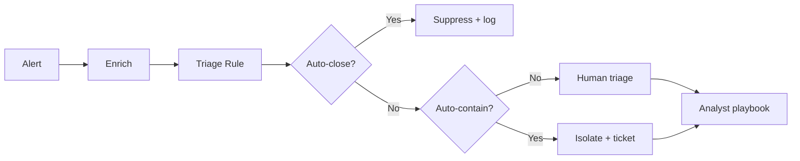

# SOC Operations Patterns

## When to use this skill

- Designing SOC structure (in-house, MSSP, hybrid)
- Building playbooks for common scenarios
- Setting SOC KPIs + measurements
- Selecting SOAR for automation
- Training SOC analysts
- 24/7 coverage planning

## SOC Tier Structure

```
Tier 1 (Triage)
- Alert validation
- Standard playbook execution
- Escalate complex cases
- High volume, repetitive

Tier 2 (Investigation)
- Deep dives on escalated
- Multiple data source correlation
- IR coordination
- Detection tuning input

Tier 3 (Threat Hunting + IR)
- Proactive hunting
- Complex IR leadership
- New detection engineering
- Tool/architecture input
```

## 24/7 Coverage Models

### Follow-the-Sun
```
APAC team → EMEA team → Americas team → APAC

Handoff every 8 hours
Lower per-shift fatigue
Higher coordination overhead
```

### Single Region + On-Call
```
Business hours: full SOC
After hours: on-call rotation
P1 paged immediately
P2-3 handled next day

Cheaper, slower nighttime response
```

### Hybrid (MSSP + Internal)
```
24/7 monitoring: MSSP
Tier 2/3 + IR: internal
Strategic + threat hunting: internal

Common for mid-sized orgs
```

## SOC KPIs

| Metric | Target | Why |
|--------|--------|-----|
| MTTD (detect) | < 1h for P1 | Speed catches damage |
| MTTA (acknowledge) | < 15min P1 | First response |
| MTTR (respond) | < 4h P1 | Containment speed |
| FP rate | < 20% per rule | Quality matters |
| Coverage | Target by ATT&CK | Comprehensive |
| Hunt productivity | New rules per quarter | Improvement |
| Analyst burnout | Survey + turnover | People matter |

## Playbook Library

### Standard playbooks
- Phishing
- Suspicious login
- Malware detection
- Privileged account anomaly
- Insider threat
- Data exfiltration alert
- DDoS / availability
- Ransomware
- Account compromise
- Brute force
- Credential stuffing
- Public-facing exploit

### Playbook structure

```markdown
# Playbook: <Scenario>

## Trigger
What alerts/conditions initiate this

## Severity
Default + when to escalate

## Steps
1. Acknowledge (immediate)
2. Validate (is this real?)
3. Scope (how big?)
4. Contain (stop damage)
5. Investigate (what happened)
6. Eradicate (remove access)
7. Recover (restore service)
8. Document (lessons)

## Escalation
- When to engage Tier 2
- When to engage IR
- When to engage leadership

## Tools
- Specific queries
- Specific dashboards
- Specific actions

## Communications
- Who to inform
- When
- Template
```

## SOAR Patterns



### Common automations
- IOC enrichment (VirusTotal, TI feeds)
- User context (HR, IAM)
- Asset context (CMDB)
- Auto-close low-risk patterns
- Auto-contain confirmed malicious
- Auto-create tickets
- Auto-page on-call for P1

## Detection Coverage Strategy

```
Map detections to MITRE ATT&CK matrix
Identify gaps
Prioritize by:
- Adversary relevance (do they target us?)
- Damage potential
- Detection feasibility
- Telemetry available

Continuously improve coverage
```

## Tools (2026)

| Need | Tools |
|------|-------|
| SIEM | Splunk, Sentinel, Elastic, Sumo, Chronicle |
| SOAR | Splunk SOAR, Tines, Demisto, Tracecat |
| EDR | CrowdStrike, SentinelOne, Defender |
| NDR | Vectra, Darktrace, ExtraHop |
| TIP | MISP, OpenCTI, Anomali |
| Ticketing | ServiceNow, Jira |
| Comms | Slack, Teams + integration |

## Analyst Skill Development

```
Tier 1 (0-6 months):
- Alert handling
- Common playbooks
- Tool proficiency

Tier 2 (6-24 months):
- Investigation depth
- Detection authoring
- Cross-domain correlation

Tier 3 (24+ months):
- Threat hunting
- IR leadership
- Architecture input
- Mentorship
```

## Burnout Prevention

```
- Cap on-call frequency (1 week / 4-6 weeks)
- Comp time for after-hours
- Realistic alert volumes (target FPs)
- Variety (rotation between hunt, IR, projects)
- Career path visible
- Training time budget
- Mental health support
```

## Common Pitfalls

- ❌ **All-T1 staffing** — no skilled investigation
- ❌ **No playbooks** — every alert starts from scratch
- ❌ **Tool sprawl** — too many panes of glass
- ❌ **No SOAR** — analysts copy-paste enrichment
- ❌ **Ignoring FP rate** — burnout + missed real
- ❌ **No MITRE mapping** — don't know coverage gaps
- ❌ **No on-call rotation** — same people always paged

## Reference

- [NIST SP 800-61 (Incident Handling)](https://csrc.nist.gov/publications/detail/sp/800-61/rev-2/final)
- [SANS Reading Room](https://www.sans.org/white-papers/)
- [MITRE ATT&CK](https://attack.mitre.org/)
- [FIRST.org (incident response)](https://www.first.org/)
