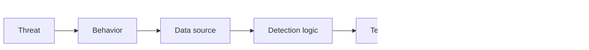

# Threat Detection Patterns

## When to use this skill

- Writing new detection rules for SIEM
- Tuning existing rules for false positives
- Mapping detections to MITRE ATT&CK
- Designing detection coverage strategy
- Building behavioral analytics

## Detection Engineering Process



## Detection Categories

### 1. Signature-based (known bad)
- Specific IOCs (hashes, IPs, domains)
- Known malware patterns
- Known exploit signatures
- **Pros:** Low false positive, fast
- **Cons:** Easy to evade, reactive

### 2. Behavioral
- Patterns of malicious activity
- TTPs (Tactics, Techniques, Procedures)
- Multi-event sequences
- **Pros:** Catches unknown malware, harder to evade
- **Cons:** More false positives, complex

### 3. Anomaly-based
- Statistical deviations
- ML-based scoring
- Peer comparison
- **Pros:** Catches truly novel attacks
- **Cons:** Many false positives, hard to triage

## MITRE ATT&CK Coverage

```
Tactic                Common detections
─────────────────────────────────────────────
Initial Access        Suspicious email, malicious links/attachments
Execution             PowerShell encoded, scripting from Office
Persistence           New scheduled tasks, registry Run keys
Privilege Escalation  Token theft, UAC bypass
Defense Evasion       Log clear, AV disable, alternate data streams
Credential Access     LSASS access, Mimikatz behaviors
Discovery             Network scan, account enum
Lateral Movement      WMI, PsExec, remote services
Collection            Keylogger, screenshot, audio capture
Command and Control   DNS tunneling, encrypted, rare destinations
Exfiltration          Large outbound, compressed archives
Impact                Mass file modification, encryption
```

## Detection Examples (Splunk SPL)

### Suspicious PowerShell

```spl
index=edr EventCode=4688
| eval is_encoded=if(match(CommandLine, "-[eE][nN][cC]"), 1, 0)
| eval is_long=if(len(CommandLine) > 500, 1, 0)
| eval is_downloaded=if(match(CommandLine, "(?i)(IEX|invoke-expression|downloadstring|downloadfile)"), 1, 0)
| where is_encoded=1 OR is_long=1 OR is_downloaded=1
| stats count by Computer, User, CommandLine
| where count >= 1
```

### LSASS Access (Credential Theft)

```spl
index=edr EventCode=10
| where TargetImage="*\\lsass.exe"
| where SourceImage NOT IN (
    "*\\System32\\svchost.exe",
    "*\\System32\\wininit.exe",
    "*\\Windows Defender\\MsMpEng.exe"
)
| stats count by Computer, SourceImage, User
```

### Unusual Logon Patterns

```spl
# After-hours admin logon
index=auth EventCode=4624 LogonType=2
| where hour_of_day < 6 OR hour_of_day > 22
| where User_Type="admin"
| stats count by Computer, User, src_ip
```

### Brute Force

```spl
index=auth EventCode=4625
| stats count by src_ip, target_user, _time
| where count > 10
| where window=10minutes
```

### Beaconing (C2)

```spl
# Find regular periodic outbound
index=netflow
| stats list(_time) as times count as connections by src_ip dest_ip dest_port
| eval intervals=mvmap(times, _time - prev_time)
| eval std_dev=stdev(intervals)
| where std_dev < 5 AND connections > 100
| eval beaconing=1
```

### Unusual Process Trees

```spl
# Word spawning powershell
index=edr EventCode=4688
| where ParentImage="*\\winword.exe"
| where Image="*\\powershell.exe"
```

## Sigma Rules (Vendor-Agnostic)

```yaml
title: PowerShell Encoded Command
id: 12345-67890-abcdef
status: stable
description: Detects encoded PowerShell commands
references:
  - https://attack.mitre.org/techniques/T1059/001/
tags:
  - attack.execution
  - attack.t1059.001
logsource:
  category: process_creation
  product: windows
detection:
  selection:
    Image|endswith: '\powershell.exe'
    CommandLine|contains:
      - ' -enc '
      - ' -EncodedCommand '
  condition: selection
falsepositives:
  - Legitimate admin scripts
level: medium
```

## False Positive Reduction

### Strategies

1. **Allowlist** — Known-good signers, paths
2. **Frequency** — Suppress repetitive same alerts
3. **Combine** — Multiple signals required
4. **Context** — Privileged accounts, sensitive systems

### Tuning Process

```python
# Track FP rate per rule
fp_rate = false_positives / total_alerts

if fp_rate > 0.5:
    # Refine rule
    # Add allowlist
    # Combine with other signal
    # Increase threshold
elif fp_rate < 0.05:
    # Possibly miss-tuned (catching too little)
    # Or rule is excellent

# Target: 5-20% FP rate per rule
```

## Behavioral Baselines

```python
# Per-user baseline
def compute_baseline(user_id, days=30):
    history = get_logon_events(user_id, days)

    return {
        'typical_hours': histogram_of_hours(history),
        'typical_sources': set_of_ips(history),
        'typical_target_systems': set_of_systems(history),
        'logon_frequency': events_per_day_distribution(history),
    }

# Detect anomalies
def is_anomalous(event, baseline):
    score = 0

    if event.hour not in baseline.typical_hours:
        score += 1
    if event.src_ip not in baseline.typical_sources:
        score += 1
    if event.target not in baseline.typical_target_systems:
        score += 1

    return score >= 2
```

## Common Pitfalls

- ❌ **Too generic** — flags legitimate activity constantly
- ❌ **Too specific** — misses variations
- ❌ **No threshold** — single event triggers
- ❌ **No suppression** — alert fatigue
- ❌ **No tuning** — drift over time
- ❌ **No context** — admin doing admin things flags

## Reference

- [MITRE ATT&CK](https://attack.mitre.org/)
- [Sigma Rules Repository](https://github.com/SigmaHQ/sigma)
- [Atomic Red Team](https://github.com/redcanaryco/atomic-red-team)
- [Splunk Detection Engineering](https://github.com/splunk/security_content)
- [CISA Cyber Resource Hub](https://www.cisa.gov/cyber-resource-hub)
