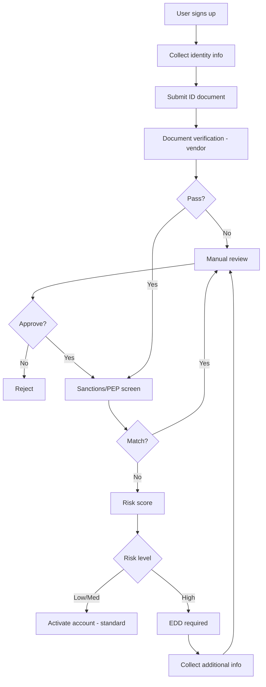

# KYC / AML Implementation Patterns

## When to use this skill

- Onboarding customers in financial products
- Building transaction monitoring
- Implementing sanctions/PEP screening
- Designing suspicious activity workflow
- Choosing KYC vendors (Sumsub, Jumio, Onfido, etc.)
- Building risk-based customer due diligence

## The 5 Pillars of AML Program

```
1. ✅ Internal controls (policies, procedures)
2. ✅ Designated compliance officer
3. ✅ Ongoing training
4. ✅ Independent audit
5. ✅ Customer Due Diligence (CDD)
```

This skill focuses on engineering implementation of #5.

## Customer Due Diligence (CDD) Tiers

### Tier 1: Customer Identification Program (CIP) — All customers

**Required for everyone:**
- Full legal name
- Date of birth
- Address
- ID number (national ID, passport)
- ID document verification

### Tier 2: Enhanced Due Diligence (EDD) — High-risk customers

**Required for:**
- Politically Exposed Persons (PEP)
- High-risk jurisdictions (FATF grey/black list)
- High net-worth individuals
- Cash-intensive businesses
- Sanctions list matches (after investigation)

**Additional:**
- Source of funds documentation
- Source of wealth (for high-net-worth)
- Beneficial ownership for entities
- Higher monitoring threshold

### Tier 3: Ongoing Monitoring — Everyone

**Continuous:**
- Sanctions list rescreening (daily)
- PEP list rescreening (weekly)
- Transaction monitoring (real-time)
- Adverse media (monthly)

## Onboarding Flow Pattern



## Vendor Selection

| Vendor | Best for | Coverage |
|--------|----------|----------|
| **Sumsub** | Global, comprehensive | 220+ countries |
| **Jumio** | Mature, enterprise | Global |
| **Onfido** | UK/EU focus, dev-friendly | Global, EU strong |
| **Veriff** | Real-time video, modern | Global |
| **Trulioo** | Many data sources | Global |
| **Persona** | Customizable workflows | Global, US strong |
| **AuthBridge** | India, SEA | Asia focus |

**Choose based on:**
- Geographic coverage of YOUR customers
- Available ID types (national ID specific to country)
- Integration ease
- Cost per check (often $1-5)
- Manual review SLA

## Sanctions Screening

### Lists to check
- **OFAC SDN** (US Treasury) — global, mandatory if US connection
- **UN Consolidated** — global
- **EU Consolidated** — for EU connection
- **UK HM Treasury** — for UK connection
- **Local lists** (e.g., AMLO Thailand sanctions)

### Matching strategy

```typescript
// Use fuzzy matching with thresholds
// Don't rely on exact match (names spelling varies)

const match = await sanctionsApi.screen({
  name: customer.fullName,
  dob: customer.dateOfBirth,
  nationality: customer.nationality,
  threshold: 0.85, // 0-1 score
});

if (match.score > 0.95) {
  // Likely match — auto-block + escalate
  await escalate(match);
} else if (match.score > 0.85) {
  // Possible match — manual review
  await queueForReview(match);
}
```

### Anti-patterns
- ❌ Exact match only (misses 80% of real hits)
- ❌ One-time check only (lists update daily)
- ❌ Blocking on every fuzzy match (false positive flood)
- ❌ Manual lists in spreadsheets (use API services)

## PEP (Politically Exposed Persons)

Categories:
- **Domestic PEPs** — local government officials
- **Foreign PEPs** — foreign government officials
- **International organization PEPs** — UN, IMF, etc.
- **Family/Close associates** — extends to relatives

**Implementation:**
- Use commercial database (Refinitiv, Dow Jones, ComplyAdvantage)
- Auto-screen on onboarding
- Rescreen monthly
- PEP = EDD required (not auto-reject)
- Document approval at appropriate seniority

## Transaction Monitoring Rules

### Rule categories

**Velocity rules:**
- Cumulative volume per period
- Transaction count per period
- Sudden spike from baseline

**Threshold rules:**
- Single transaction > $10,000 (US CTR)
- Aggregated transactions just under threshold (structuring)

**Pattern rules:**
- Round amounts ($1000, $5000, $10000)
- Repeated small transactions (smurfing)
- Geographic risk (high-risk jurisdiction)
- Time patterns (always at 3am)

**Behavioral rules:**
- Deviation from customer baseline
- Activity inconsistent with stated purpose
- New connections (sudden many counterparties)

### Implementation tiers

```
Tier 1: Static rules
  - Fast, deterministic
  - Easy to explain
  - Use for hard limits

Tier 2: Statistical models
  - Anomaly detection
  - Per-customer baseline
  - Catches subtle patterns

Tier 3: ML models
  - Network analysis
  - Embedding-based similarity
  - Hardest to explain
```

## Suspicious Activity Report (SAR) Workflow

```
1. Alert fires (rule or model)
   ↓
2. Investigator reviews (within 5 days)
   ↓
3. Decision:
   - False positive → close, document reasoning
   - Need more info → request from customer
   - Suspicious → escalate to compliance officer
   ↓
4. Compliance officer reviews
   ↓
5. If reportable: file SAR within regulatory deadline
   - Thailand (AMLO): within 7 days of decision
   - US (FinCEN): within 30 days of detection
   ↓
6. Continue customer relationship per legal advice
   (often: continue normally, don't tip off)
```

## Data Retention

| Data | Retention | Reason |
|------|-----------|--------|
| KYC documents | 5 years post-relationship | AML regulations |
| Sanctions screening results | 5 years | Audit trail |
| SARs | 5 years | Regulatory |
| Transaction monitoring alerts | 5 years | Audit |
| Customer communications | 5 years | Dispute resolution |

> ⚠️ Conflicts with GDPR "right to erasure"? AML obligations usually override.

## Risk-Based Approach

Don't treat all customers equally:

```typescript
function calculateRiskScore(customer: Customer): RiskLevel {
  let score = 0;

  // Geography
  if (highRiskJurisdictions.includes(customer.country)) score += 30;

  // Customer type
  if (customer.type === 'business') score += 10;
  if (customer.industry === 'crypto') score += 20;
  if (customer.industry === 'cash-intensive') score += 15;

  // Politics
  if (customer.isPEP) score += 25;

  // Sanctions proximity
  if (customer.sanctionsMatchScore > 0.7) score += 40;

  if (score < 20) return 'LOW';
  if (score < 50) return 'MEDIUM';
  return 'HIGH';
}

// Adjust monitoring frequency, transaction limits, etc. by risk level
```

## Common Pitfalls

- ❌ **One-time checks** — must be ongoing
- ❌ **Treating low-risk = no monitoring**
- ❌ **Over-reliance on vendor** — you're still responsible
- ❌ **Alert fatigue** — too many false positives → real ones missed
- ❌ **No documentation** — regulator: "show me your reasoning"
- ❌ **Mixing fraud + AML** — different goals, different rules
- ❌ **Auto-block on PEP** — PEP ≠ criminal, requires EDD

## Quality Targets

- False positive rate < 5% (after tuning)
- Alert resolution time < 5 days median
- SAR filing within regulatory deadline 100%
- Quarterly rule review + tuning
- Annual program independent audit

## Reference

- [FATF Recommendations](https://www.fatf-gafi.org/)
- [AMLO Thailand](https://www.amlo.go.th/)
- [FinCEN US](https://www.fincen.gov/)
- [Wolfsberg Group standards](https://www.wolfsberg-principles.com/)
- [OFAC SDN List](https://sanctionssearch.ofac.treas.gov/)
