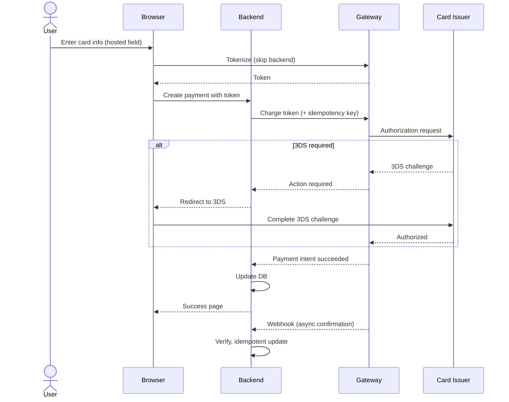

# Payment Gateway Integration Patterns

## When to use this skill

- Adding payments to a new product
- Migrating gateways
- Implementing 3D Secure / SCA
- Building reliable webhook processing
- Handling multi-currency payments
- Implementing recurring billing / subscriptions

## Gateway Selection (Detailed)

### Comparison Matrix

| Gateway | Card | Wallets | Local TH | Local SEA | Settlement | Best for |
|---------|:----:|:-------:|:--------:|:---------:|:----------:|----------|
| **Stripe** | ✅ Excellent | Apple/Google | 🟡 PromptPay | 🟡 Some | T+2-7 | Global, SaaS, subscriptions |
| **Adyen** | ✅ Excellent | All major | ✅ | ✅ | T+1 | Enterprise, global retail |
| **Omise** | ✅ | ✅ TH-specific | ✅ Comprehensive | 🟡 | T+1 | Thailand-first |
| **2C2P** | ✅ | ✅ | ✅ | ✅ SEA-strong | T+1-2 | SEA regional |
| **Braintree** | ✅ | PayPal+ | 🟡 | 🟡 | T+2 | PayPal users |
| **Razorpay** | ✅ | UPI | ❌ | 🟡 | T+2 | India |
| **Square** | ✅ | Cash App | ❌ | ❌ | T+1 | US/CA in-person |

## Card Payment Flow (Generic)



## Critical Patterns

### Pattern 1: Use Idempotency Keys ALWAYS

```typescript
// Generate ONCE per business operation, reuse on retry
const idempotencyKey = `order_${orderId}_charge_v1`;

const paymentIntent = await stripe.paymentIntents.create({
  amount: orderTotal,
  currency: 'thb',
  payment_method: paymentMethodId,
  confirm: true,
}, {
  idempotencyKey: idempotencyKey, // ← prevents double-charge
});

// On retry, gateway returns same payment intent
```

### Pattern 2: Handle 3D Secure / SCA

```typescript
// Strong Customer Authentication required in EU/UK
// Many TH banks also enforce 3DS

const paymentIntent = await stripe.paymentIntents.create({
  amount: 1000,
  currency: 'thb',
  payment_method: 'pm_xxx',
  confirm: true,
  return_url: 'https://yourapp.com/payment-return',
});

if (paymentIntent.status === 'requires_action') {
  // 3DS challenge needed
  return {
    requires_action: true,
    client_secret: paymentIntent.client_secret,
    next_action: paymentIntent.next_action,
  };
  // Frontend uses Stripe.js to handle the challenge
}
```

### Pattern 3: Reliable Webhook Processing

```typescript
// 1. Receive webhook
app.post('/webhooks/stripe', express.raw({ type: 'application/json' }), async (req, res) => {
  try {
    // 2. Verify signature (CRITICAL)
    const event = stripe.webhooks.constructEvent(
      req.body,
      req.headers['stripe-signature']!,
      process.env.STRIPE_WEBHOOK_SECRET!
    );

    // 3. Idempotency check
    const existing = await db.webhookEvents.findById(event.id);
    if (existing) {
      return res.json({ received: true, duplicate: true });
    }

    // 4. Store raw event FIRST
    await db.webhookEvents.create({
      id: event.id,
      type: event.type,
      payload: event,
      status: 'PENDING',
    });

    // 5. Ack within 5s
    res.json({ received: true });

    // 6. Process async
    await queue.enqueue('process-webhook', { eventId: event.id });
  } catch (err) {
    if (err instanceof stripe.errors.StripeSignatureVerificationError) {
      return res.status(400).send('Invalid signature');
    }
    log.error('Webhook error', err);
    res.status(500).send('Error');
  }
});

// Worker (separate):
async function processWebhook(eventId: string) {
  const evt = await db.webhookEvents.findById(eventId);

  try {
    switch (evt.type) {
      case 'payment_intent.succeeded':
        await handlePaymentSucceeded(evt.payload.data.object);
        break;
      case 'payment_intent.payment_failed':
        await handlePaymentFailed(evt.payload.data.object);
        break;
      case 'charge.refunded':
        await handleRefund(evt.payload.data.object);
        break;
      // ... other handlers
    }

    await db.webhookEvents.update(eventId, { status: 'PROCESSED' });
  } catch (err) {
    await db.webhookEvents.update(eventId, {
      status: 'FAILED',
      error: err.message,
      attempts: { increment: 1 },
    });
    throw err; // re-throw for retry
  }
}
```

### Pattern 4: Verify Webhook with API (Belt + Suspenders)

```typescript
// Webhook says payment succeeded — but verify via API
async function handlePaymentSucceeded(eventPayload: any) {
  // Don't trust webhook payload alone
  const intent = await stripe.paymentIntents.retrieve(eventPayload.id);

  if (intent.status !== 'succeeded') {
    log.warn('Webhook claimed success but API disagrees', { id: intent.id });
    return; // Don't take action
  }

  // Now we can safely update our DB
  await db.payments.update(intent.metadata.orderId, {
    status: 'PAID',
    paidAt: new Date(intent.created * 1000),
  });
}
```

### Pattern 5: Subscription Billing

```typescript
// Initial setup
const customer = await stripe.customers.create({
  email: user.email,
  metadata: { userId: user.id },
});

const subscription = await stripe.subscriptions.create({
  customer: customer.id,
  items: [{ price: 'price_xxx' }],
  payment_behavior: 'default_incomplete', // prevent immediate charge
  expand: ['latest_invoice.payment_intent'],
});

// Handle webhooks:
// - invoice.paid → activate features
// - invoice.payment_failed → dunning flow
// - customer.subscription.updated → sync state
// - customer.subscription.deleted → revoke access
```

## Retry Strategy

```typescript
// Webhook retries — gateway will retry, so:
// - Don't fail fast
// - Be idempotent
// - Log everything

// Manual retries (e.g., failed authorization):
const retryDelays = [0, 60_000, 300_000, 3_600_000]; // 0s, 1min, 5min, 1hr

async function retryPayment(paymentId: string, attempt: number = 0) {
  if (attempt >= retryDelays.length) {
    await markAsFailed(paymentId);
    return;
  }

  await sleep(retryDelays[attempt]);

  try {
    await chargePayment(paymentId);
  } catch (err) {
    if (isRetryable(err)) {
      await retryPayment(paymentId, attempt + 1);
    } else {
      await markAsFailed(paymentId);
    }
  }
}
```

## Multi-Currency Handling

```typescript
// Always store currency with amount
interface Money {
  amount: bigint;        // integer (cents/satoshis)
  currency: string;      // ISO 4217 code
}

// Never assume USD
// Never mix currencies in calculations
// Always use FX rate at transaction time

// Display formatting (per locale):
function format(money: Money, locale: string): string {
  return new Intl.NumberFormat(locale, {
    style: 'currency',
    currency: money.currency,
  }).format(Number(money.amount) / 100);
}
```

## Settlement Reconciliation

```typescript
// Daily job
async function reconcileSettlement(date: Date) {
  // 1. Pull settlement report from gateway
  const settlement = await stripe.balanceTransactions.list({
    created: { gte: startOfDay(date), lte: endOfDay(date) },
  });

  // 2. Sum gateway's view
  const gatewayTotal = settlement.data
    .filter((t) => t.type === 'payout')
    .reduce((sum, t) => sum + t.amount, 0);

  // 3. Sum our DB
  const ourTotal = await db.payments.sumPaidOnDate(date);

  // 4. Compare
  if (gatewayTotal !== ourTotal) {
    await alerts.fire({
      severity: 'P1',
      title: 'Settlement reconciliation mismatch',
      data: { date, gatewayTotal, ourTotal, diff: gatewayTotal - ourTotal },
    });
  }

  // 5. Match to bank deposit
  const bankDeposit = await bankApi.getDeposit(date);
  if (gatewayTotal !== bankDeposit.amount) {
    // Gateway → Bank mismatch
    await alerts.fire({ severity: 'P2', title: 'Bank deposit mismatch' });
  }
}
```

## Refund Edge Cases

```typescript
// 1. Refund must equal or be less than captured amount
// 2. Cannot refund a refund
// 3. Some methods can't be refunded (e.g., PromptPay QR — manual process)
// 4. Refund timing varies by method
//    - Card: 5-10 business days for customer to see
//    - Bank transfer: 1-3 days
//    - Wallet: usually instant

// Partial refund pattern:
async function refundPayment(paymentId: string, amountCents?: bigint) {
  const payment = await db.payments.findById(paymentId);

  const refundAmount = amountCents ?? (payment.amount - payment.refunded);

  if (refundAmount <= 0n) throw new Error('Already fully refunded');
  if (refundAmount > payment.amount - payment.refunded) {
    throw new Error('Refund exceeds available');
  }

  const refund = await stripe.refunds.create({
    payment_intent: payment.gatewayId,
    amount: Number(refundAmount),
  }, {
    idempotencyKey: `refund_${paymentId}_${Date.now()}`,
  });

  await db.payments.update(paymentId, {
    refunded: payment.refunded + refundAmount,
    status: refundAmount === payment.amount ? 'REFUNDED' : 'PARTIALLY_REFUNDED',
  });
}
```

## Common Pitfalls

- ❌ **Trust webhook order** — they don't come in order
- ❌ **Trust webhook amount** — verify via API
- ❌ **No idempotency** — network glitch = double charge
- ❌ **Process webhook inline** — gateway retries = duplicates
- ❌ **Store card numbers** — even encrypted, it's still in scope
- ❌ **Skip 3DS** — high decline rate in EU
- ❌ **Hard-code currency** — breaks when expanding
- ❌ **Sync state from gateway only on demand** — drift accumulates
- ❌ **Mix gateway IDs with internal IDs** — use both, separately
- ❌ **No reconciliation** — small drift → big monthly loss

## Reference

- [Stripe Webhooks](https://stripe.com/docs/webhooks)
- [Adyen Webhooks](https://docs.adyen.com/development-resources/webhooks)
- [Omise Webhooks](https://www.omise.co/webhooks)
- [PCI-DSS Tokenization](https://www.pcisecuritystandards.org/)
- [3D Secure 2.0 Spec](https://www.emvco.com/emv-technologies/3d-secure/)
