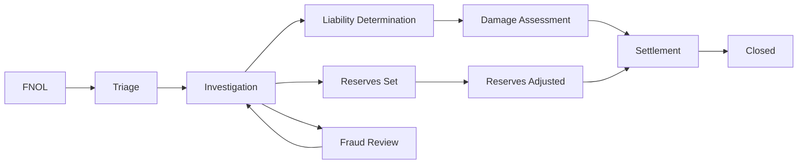

# Claims Workflow Patterns

## When to use this skill

- Building claims system
- Improving claims cycle time
- Implementing fraud detection
- Designing claim triage
- Reserves automation

## Claim Lifecycle



## FNOL Patterns

### Pattern: Progressive Information Capture

```typescript
// Don't ask 50 questions upfront
// Get critical info, then expand

const FNOL_STAGES = {
  stage1_critical: {
    fields: ['policy_id', 'date_of_loss', 'description_brief', 'injuries_present'],
    triggers: ['create_claim', 'set_initial_reserve', 'route']
  },
  stage2_details: {
    fields: ['parties_involved', 'witnesses', 'photos', 'police_report'],
    triggers: ['enrich_claim']
  },
  stage3_documentation: {
    fields: ['repair_estimates', 'medical_records', 'lost_income_docs'],
    triggers: ['ready_for_review']
  },
};
```

### Pattern: Multi-channel FNOL

```
Sources:
- Mobile app
- Web portal
- Phone (manual or IVR)
- Email
- API (embedded insurance)
- Agent intake

All flow to same processing system
Track source for analytics
```

## Triage Logic

```typescript
interface TriageResult {
  routing: 'auto_settle' | 'standard_review' | 'senior_adjuster' | 'siu_fraud';
  initial_reserve: Money;
  priority: 'high' | 'normal' | 'low';
  flags: string[];
}

async function triage(claim: Claim): Promise<TriageResult> {
  const flags: string[] = [];

  // Severity
  const estimatedSeverity = await estimateSeverity(claim);

  // Auto-settle simple claims
  if (estimatedSeverity < AUTO_SETTLE_THRESHOLD
      && !claim.has_injuries
      && !claim.has_litigation_indicators) {
    return {
      routing: 'auto_settle',
      initial_reserve: estimatedSeverity * 1.1,
      priority: 'normal',
      flags,
    };
  }

  // Fraud screening
  const fraudScore = await assessFraudRisk(claim);
  if (fraudScore > FRAUD_THRESHOLD) {
    flags.push('FRAUD_RISK');
    return {
      routing: 'siu_fraud',
      initial_reserve: estimatedSeverity * 1.2,  // conservative
      priority: 'high',
      flags,
    };
  }

  // High value or complex
  if (estimatedSeverity > HIGH_VALUE
      || claim.injuries.severity === 'major'
      || claim.has_subrogation_potential) {
    flags.push('COMPLEX');
    return {
      routing: 'senior_adjuster',
      initial_reserve: estimatedSeverity * 1.15,
      priority: 'high',
      flags,
    };
  }

  return {
    routing: 'standard_review',
    initial_reserve: estimatedSeverity * 1.1,
    priority: 'normal',
    flags,
  };
}
```

## Fraud Detection Patterns

### Multi-layer detection

```python
# Layer 1: Rules
def rule_based_fraud(claim):
    flags = []

    # Common indicators
    if claim.loss_date - claim.policy_effective_date < timedelta(days=30):
        flags.append('NEW_POLICY')
    if claim.amount > claim.policy.limit * 0.7:
        flags.append('NEAR_LIMIT')
    if claim.applicant.recent_claims > 2:
        flags.append('FREQUENT_CLAIMS')
    if loss_at_odd_time(claim):
        flags.append('UNUSUAL_TIME')

    return flags

# Layer 2: ML scoring
def ml_fraud_score(claim):
    features = extract_features(claim)
    return ml_model.predict_proba(features)[0][1]

# Layer 3: Network analysis (rings)
def network_red_flags(claim):
    # Same repair shop + same expert + same medical provider repeatedly?
    # Same parties involved across claims?
    return detect_anomalies(claim, network_graph)

# Combine
def overall_fraud_risk(claim):
    rule_flags = rule_based_fraud(claim)
    ml_score = ml_fraud_score(claim)
    network_flags = network_red_flags(claim)

    overall = ml_score
    if rule_flags:
        overall += 0.1 * len(rule_flags)
    if network_flags:
        overall += 0.2

    return min(overall, 1.0)
```

## Reserves Patterns

### Initial reserve estimation

```python
def initial_reserve(claim):
    # By line of business + severity tier
    base = product.reserves_table[claim.severity_tier]

    # Adjust for known factors
    if claim.injuries.severity == 'major':
        base *= 1.5
    if claim.has_litigation_history(claim.policyholder):
        base *= 1.3
    if claim.state in HIGH_LIABILITY_STATES:
        base *= 1.2

    return base
```

### Case reserves vs IBNR

```
Case reserves: claim-specific, for known claims
IBNR: portfolio-level, for unknown claims + IBNER

Total Loss = Sum of Case Reserves + IBNR
```

### Reserve development tracking

```python
def track_reserve_development(claim):
    # Every change tracked
    history = db.reserves.history(claim.id)

    # Calculate adverse vs favorable
    initial = history[0].amount
    current = history[-1].amount
    development_factor = current / initial

    # Flag if significant
    if development_factor > 1.5:
        alert('SIGNIFICANT_ADVERSE_DEVELOPMENT', claim)
```

## Settlement Calculation

```python
def calculate_settlement(claim):
    # 1. Damages valuation
    damages = sum([
        property_damage(claim),
        medical_costs(claim),
        lost_wages(claim),
        pain_and_suffering(claim),  # subjective
        other_economic(claim),
    ])

    # 2. Apply liability percentage (for partial fault)
    insurer_share = damages * claim.liability_percentage

    # 3. Apply policy
    covered = min(insurer_share, claim.policy.limit)
    covered -= claim.policy.deductible

    # 4. Subtract recoverable amounts (subrogation, salvage)
    net = covered - claim.recoveries

    return {
        'gross_damages': damages,
        'insurer_share': insurer_share,
        'after_policy_terms': covered,
        'net_settlement': net,
    }
```

## Subrogation

```python
# Recover from at-fault third parties
def evaluate_subrogation_potential(claim):
    if not claim.third_party_at_fault:
        return None

    # Estimate recovery
    estimated = claim.paid * claim.subrogation_probability

    if estimated > MINIMUM_PURSUIT_AMOUNT:
        return {
            'pursue': True,
            'estimated_recovery': estimated,
            'priority': prioritize(estimated, claim),
        }
    return None
```

## Repair Network Integration

```typescript
// Direct repair program (DRP) for auto
async function assignRepairShop(claim) {
  const nearbyShops = await findShops({
    near: claim.location,
    network: 'preferred',
    capabilities: requiredFor(claim.vehicle),
  });

  // Customer choice from approved network
  return {
    options: nearbyShops,
    estimated_repair_time: calculateAvgTimeAtNetwork(nearbyShops),
    direct_billing: true,
  };
}

// Workflow with shop
async function processRepairCompletion(claim, shop) {
  // Shop uploads completion + photos
  // System validates against estimate
  // Auto-pay if within tolerance
  // Adjust + pay if minor variance
  // Manual review if significant variance
}
```

## Customer Communication

```typescript
// Set expectations throughout
const TOUCH_POINTS = [
  { trigger: 'FNOL_received', template: 'claim_received', within: '1 hour' },
  { trigger: 'adjuster_assigned', template: 'adjuster_intro', within: '24 hours' },
  { trigger: 'inspection_scheduled', template: 'inspection_appointment', within: '48 hours' },
  { trigger: 'liability_determined', template: 'coverage_decision', when: 'as available' },
  { trigger: 'settlement_offered', template: 'settlement_offer', when: 'on offer' },
  { trigger: 'payment_issued', template: 'payment_notice', within: '1 hour of issue' },
];
```

## Common Pitfalls

- ❌ Manual triage of every claim (use rules)
- ❌ No initial reserves (mismanages capital)
- ❌ Same fraud model for every line
- ❌ No subrogation pursuit (leaving money)
- ❌ Black box fraud denial (regulatory)
- ❌ Slow customer communication

## Reference

- [Coalition Against Insurance Fraud](https://insurancefraud.org/)
- [NAIC Claims Handling](https://content.naic.org/)
- [Insurance Information Institute](https://www.iii.org/)
- [Verisk ClaimSearch (fraud detection)](https://www.verisk.com/insurance/products/claimsearch/)
