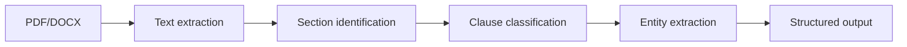

# Contract Parsing Patterns

## When to use this skill

- Building contract intelligence system
- Extracting clauses for review
- Building searchable contract database
- AI-assisted contract analysis

## Document → Structure Pipeline



## Text Extraction

```python
# PDF
import pdfplumber

with pdfplumber.open('contract.pdf') as pdf:
    text = ''
    for page in pdf.pages:
        text += page.extract_text() + '\n'

# DOCX
from docx import Document
doc = Document('contract.docx')
text = '\n'.join([p.text for p in doc.paragraphs])

# Scanned PDFs: OCR with Tesseract
import pytesseract
from pdf2image import convert_from_path

images = convert_from_path('scanned.pdf')
text = '\n'.join([pytesseract.image_to_string(img) for img in images])
```

## Section Identification

```python
import re

# Heuristics
SECTION_PATTERNS = [
    r'^\d+\.\s+[A-Z]',           # "1. INDEMNIFICATION"
    r'^[IVX]+\.\s+[A-Z]',        # "IV. PAYMENT"
    r'^Article\s+\d+',           # "Article 5"
    r'^Section\s+\d+',           # "Section 3"
    r'^[A-Z][A-Z\s]{3,}$',       # "CONFIDENTIALITY"
]

def find_sections(text):
    sections = []
    lines = text.split('\n')

    current_section = {'title': None, 'content': []}
    for line in lines:
        if any(re.match(p, line.strip()) for p in SECTION_PATTERNS):
            if current_section['title']:
                sections.append(current_section)
            current_section = {'title': line.strip(), 'content': []}
        else:
            current_section['content'].append(line)

    sections.append(current_section)
    return sections
```

## Clause Classification

### Approach 1: Rule-Based

```python
CLAUSE_KEYWORDS = {
    'indemnification': ['indemnify', 'indemnification', 'hold harmless'],
    'limitation_of_liability': ['limitation of liability', 'liability cap', 'consequential damages'],
    'confidentiality': ['confidential information', 'non-disclosure', 'proprietary'],
    'termination': ['termination', 'terminate', 'expiration'],
    'governing_law': ['governing law', 'governed by', 'jurisdiction'],
}

def classify_clause(text):
    text_lower = text.lower()
    for clause_type, keywords in CLAUSE_KEYWORDS.items():
        if any(kw in text_lower for kw in keywords):
            return clause_type
    return 'other'
```

### Approach 2: ML Classification

```python
from transformers import pipeline

# Use legal-domain models like:
# - nlpaueb/legal-bert-base-uncased
# - lex-glue benchmark models

classifier = pipeline(
    'text-classification',
    model='your-finetuned-legal-classifier',
)

def classify_clauses(clauses):
    return [classifier(c.text)[0] for c in clauses]
```

### Approach 3: LLM Extraction

```python
async def llm_extract_clauses(contract_text):
    response = await llm.complete(
        system="""You extract clauses from contracts.
        Return JSON array of clauses with:
        - type (from controlled list)
        - text (exact quote)
        - location (paragraph number)
        - parties_mentioned
        - dates_mentioned
        - values_mentioned

        Controlled clause types: ..."""
    )

    return json.loads(response)
```

## Entity Extraction

### Party Extraction

```python
# Heuristics: parties usually defined upfront
PARTY_PATTERNS = [
    r'(?P<name>[A-Z][\w\s,\.]+), a (?P<entity_type>[\w\s]+(?:LLC|Inc\.|Corporation|Company|GmbH|Ltd\.)), having',
    r'between (?P<name>[\w\s,\.]+) \("(?P<short_name>[^"]+)"\)',
]

def extract_parties(text):
    parties = []
    for pattern in PARTY_PATTERNS:
        for match in re.finditer(pattern, text):
            parties.append({
                'name': match.group('name'),
                'entity_type': match.groupdict().get('entity_type'),
                'short_name': match.groupdict().get('short_name'),
            })
    return parties
```

### Date Extraction

```python
import dateparser

DATE_PATTERNS = [
    r'\d{1,2}/\d{1,2}/\d{2,4}',
    r'\d{1,2}-[A-Z][a-z]{2,8}-\d{4}',
    r'[A-Z][a-z]{2,8}\s+\d{1,2},\s+\d{4}',
    r'\d{1,2}(?:st|nd|rd|th)?\s+day\s+of\s+[A-Z][a-z]+\s+\d{4}',
]

def extract_dates(text):
    dates = []
    for pattern in DATE_PATTERNS:
        for match in re.finditer(pattern, text):
            parsed = dateparser.parse(match.group())
            if parsed:
                dates.append({
                    'raw': match.group(),
                    'parsed': parsed,
                    'context': text[max(0, match.start()-50):match.end()+50],
                })
    return dates
```

### Money Extraction

```python
MONEY_PATTERN = r'(\$|USD|EUR|GBP|THB)\s*([\d,]+(?:\.\d{2})?)\s*(million|thousand|billion)?'

def extract_money(text):
    amounts = []
    for match in re.finditer(MONEY_PATTERN, text):
        currency = match.group(1)
        amount = float(match.group(2).replace(',', ''))
        multiplier = match.group(3)

        if multiplier == 'thousand':
            amount *= 1_000
        elif multiplier == 'million':
            amount *= 1_000_000
        elif multiplier == 'billion':
            amount *= 1_000_000_000

        amounts.append({
            'currency': currency,
            'amount': amount,
            'context': text[max(0, match.start()-50):match.end()+50],
        })
    return amounts
```

## Risk Pattern Detection

```python
RISK_RULES = {
    'auto_renewal_short_notice': {
        'pattern': r'auto(?:matically)?\s+renew.*?(\d+)\s+days?\s+notice',
        'severity': 'medium',
        'check': lambda m: int(m.group(1)) < 30,
        'message': 'Auto-renewal with less than 30 days notice'
    },
    'unlimited_indemnity': {
        'pattern': r'indemnif.*(?:without limit|unlimited|no cap)',
        'severity': 'high',
        'message': 'Unlimited indemnification obligation'
    },
    'broad_termination_for_convenience': {
        'pattern': r'terminat.*(?:any reason|sole discretion|convenience)',
        'severity': 'medium',
        'message': 'Termination for convenience by counter-party'
    },
}

def detect_risks(text):
    risks = []
    for risk_id, rule in RISK_RULES.items():
        for match in re.finditer(rule['pattern'], text, re.IGNORECASE):
            if 'check' in rule and not rule['check'](match):
                continue
            risks.append({
                'id': risk_id,
                'severity': rule['severity'],
                'message': rule['message'],
                'context': text[max(0, match.start()-100):match.end()+100],
            })
    return risks
```

## LLM-Assisted Review

```python
async def review_contract(text, focus_areas=None):
    prompt = f"""Review this contract for issues.

Focus areas: {focus_areas or 'all'}

For each issue found, return JSON:
{{
  "issue_type": "indemnity|liability|term|other",
  "severity": "high|medium|low",
  "exact_quote": "the problematic text",
  "explanation": "why this is concerning",
  "suggested_revision": "alternative language" (optional)
}}

ONLY flag actual issues. Do NOT make up content.
"""

    response = await llm.complete(system=prompt, user=text)
    issues = json.loads(response)

    # Verify quotes match actual text (catch hallucinations)
    return [i for i in issues if i['exact_quote'] in text]
```

## Output Schema

```python
@dataclass
class ParsedContract:
    document_hash: str
    parties: List[Party]
    effective_date: Optional[date]
    term: Optional[str]
    governing_law: Optional[str]
    clauses: List[Clause]
    key_dates: List[Date]
    monetary_values: List[Money]
    risks_identified: List[Risk]
    ai_summary: Optional[str]
    confidence_scores: Dict[str, float]
```

## Common Pitfalls

- ❌ Pure regex without context (false positives)
- ❌ ML without legal-domain training
- ❌ LLM without quote verification (hallucinations)
- ❌ One-language model for international contracts
- ❌ No human review for high-stakes use

## Reference

- [CUAD Dataset](https://www.atticusprojectai.org/cuad)
- [LegalBench Benchmark](https://hazyresearch.stanford.edu/legalbench/)
- [Legal-BERT](https://huggingface.co/nlpaueb/legal-bert-base-uncased)
- [spaCy Legal](https://spacy.io/)
- [Lex Machina (litigation analytics)](https://lexmachina.com/)
