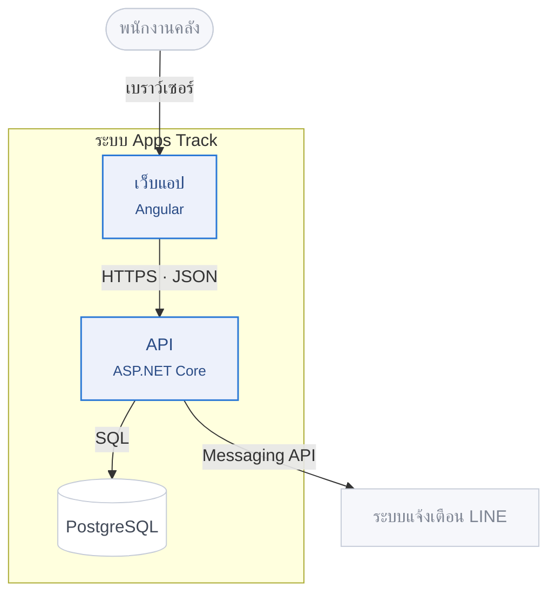
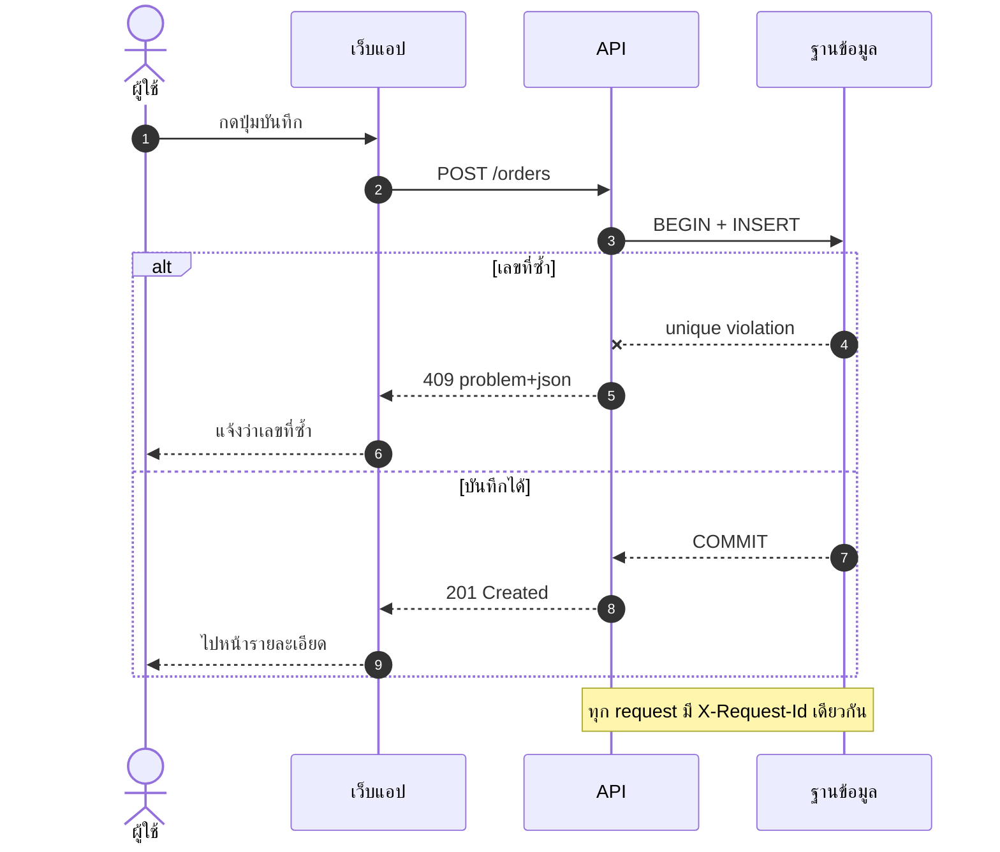
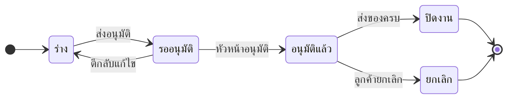
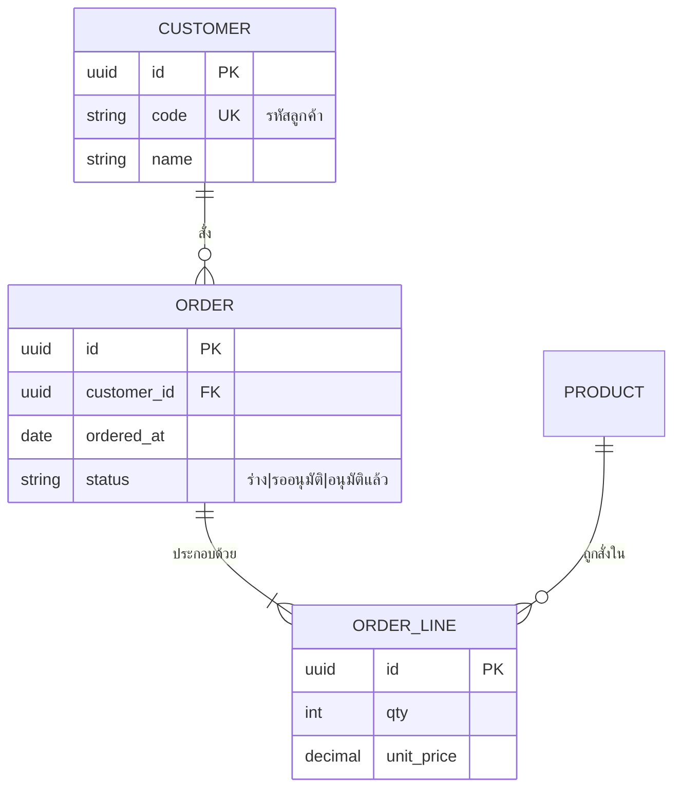
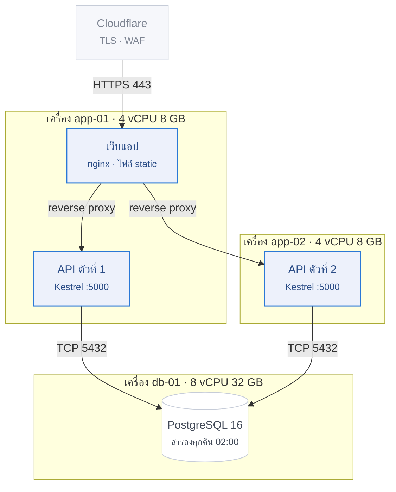

# ธีม Mermaid และตัวอย่างที่เรนเดอร์แล้ว

> ✅ ทุกไดอะแกรมในไฟล์นี้ **เรนเดอร์ออกมาเป็นภาพจริงแล้วเปิดดูด้วยตา**
> ด้วย `@mermaid-js/mermaid-cli` 11.17.0 — ไม่ใช่แค่ตรวจไวยากรณ์

---

## บรรทัดธีม

วางไว้**บรรทัดแรกสุด**ของทุกไดอะแกรม (คัดลอกทั้งบรรทัด ห้ามขึ้นบรรทัดใหม่กลางทาง):

```
%%{init: {'theme':'base','fontFamily':'Tahoma, Arial, sans-serif','themeVariables':{'fontSize':'13px','primaryColor':'#FFFFFF','primaryTextColor':'#333B4A','primaryBorderColor':'#C6CCD8','lineColor':'#8A93A3','secondaryColor':'#EDF1FB','tertiaryColor':'#F6F7FB','clusterBkg':'#F8F9FC','clusterBorder':'#E4E7EE','edgeLabelBackground':'#FFFFFF','actorBkg':'#FFFFFF','actorBorder':'#C6CCD8','actorTextColor':'#333B4A','signalColor':'#8A93A3','signalTextColor':'#414957','noteBkgColor':'#FFF8E1','noteBorderColor':'#E8D48B','labelBoxBkgColor':'#EDF1FB','labelBoxBorderColor':'#C6CCD8','altBackground':'#F8F9FC'},'flowchart':{'curve':'basis','nodeSpacing':40,'rankSpacing':50},'sequence':{'mirrorActors':false,'actorMargin':60}}}%%
```

### สิ่งที่ค่าแต่ละตัวคุม

| ค่า | คุมอะไร |
|---|---|
| `fontFamily` (**นอก** `themeVariables`) | ฟอนต์ทั้งรูป |
| `primaryColor` · `primaryBorderColor` | พื้นและเส้นขอบกล่องเริ่มต้น |
| `lineColor` | เส้นเชื่อม |
| `clusterBkg` · `clusterBorder` | กรอบ `subgraph` |
| `edgeLabelBackground` | พื้นหลังป้ายบนเส้น — ถ้าไม่ตั้ง ป้ายจะโปร่งแล้วเส้นทะลุตัวอักษร |
| `actorBkg` · `actorBorder` · `signalColor` | เฉพาะ sequence diagram |
| `noteBkgColor` · `noteBorderColor` | กล่อง `Note` สีเหลืองอ่อน |

### ⚠️ `fontFamily` ต้องอยู่นอก `themeVariables`

ทดสอบแล้วกับ Mermaid 11 — ใส่ผิดที่จะถูกเมินเงียบ ๆ ไม่มี error:

```js
// ❌ ถูกเมิน → ได้ฟอนต์เริ่มต้น "trebuchet ms",verdana,arial,sans-serif
{'themeVariables': {'fontFamily': 'Tahoma, Arial, sans-serif'}}

// ✅ ได้ font-family:Tahoma,Arial,sans-serif ใน SVG จริง
{'fontFamily': 'Tahoma, Arial, sans-serif', 'themeVariables': {...}}
```

ตรวจเองได้: เรนเดอร์เป็น `.svg` แล้ว `grep font-family` ดู

### คลาสสี

วางต่อจากบรรทัดแรกของ flowchart:

```
classDef focus fill:#EDF1FB,stroke:#2A78D6,stroke-width:1.5px,color:#2A4C86
classDef ext   fill:#F6F7FB,stroke:#C6CCD8,color:#7D8492
classDef store fill:#FFFFFF,stroke:#C6CCD8,color:#414957
```

ใช้ด้วย `:::focus` ต่อท้ายชื่อกล่อง — `api["API"]:::focus`

> ตัวอย่างข้างล่างนี้**ตัดบรรทัดธีมออกให้อ่านง่าย** — เวลาคัดลอกไปใช้จริง
> ต้องเติมบรรทัดธีมข้างบนกลับเข้าไปเป็นบรรทัดแรกเสมอ

---

## 1 · C4 ระดับ 2 — Container

ตอบคำถาม *"ข้างในระบบมีอะไรบ้าง แต่ละตัวคุยกันด้วยอะไร"*



จุดที่ตั้งใจทำ: ระบบของเราเป็น `focus` · คนและระบบภายนอกเป็น `ext` ·
ฐานข้อมูลเป็น `store` และป้ายบนเส้นบอก**โพรโทคอล** ไม่ใช่แค่ว่า "ใช้"

---

## 2 · Sequence

ตอบคำถาม *"กดปุ่มนี้แล้วเกิดอะไรขึ้นบ้าง ตามลำดับ"*



จุดที่ตั้งใจทำ:

- `autonumber` ให้เลขลำดับอัตโนมัติ — อ้างอิงในเอกสารได้ว่า "ขั้นที่ 5"
- `alt` / `else` แยกทางสำเร็จกับทางล้มเหลว **ในรูปเดียว**
  ใช้ได้เมื่อมี 2 ทาง — ถ้ามี 4 ทางให้แยกรูป
- `--x` คือส่งแล้วล้มเหลว · `-->>` คือตอบกลับ · `->>` คือเรียกไป
- `mirrorActors: false` ในธีม ตัดแถวชื่อซ้ำที่ก้นรูปออก

---

## 3 · State

ตอบคำถาม *"เอกสารนี้เปลี่ยนสถานะยังไงได้บ้าง"*



จุดที่ตั้งใจทำ: **ทุกลูกศรมีชื่อเหตุการณ์ที่ทำให้เปลี่ยนสถานะ**
สถานะที่ไม่มีทางออก (นอกจาก `[*]`) ต้องตั้งใจจริง ๆ ไม่ใช่ลืมวาด

---

## 4 · Entity Relationship

ตอบคำถาม *"ตารางไหนเชื่อมกับตารางไหน"*



จุดที่ตั้งใจทำ:

- ชื่อตาราง/ฟิลด์เป็นภาษาอังกฤษตรงกับฐานข้อมูลจริง คำอธิบายเป็นไทยได้
- `PK` `FK` `UK` บอกชนิดคีย์
- ตารางที่ไม่ใช่ประเด็นของรูปนี้ ใส่แค่ชื่อไม่ต้องแจกแจงฟิลด์ (ดู `PRODUCT`)
- สัญลักษณ์: `||--o{` คือหนึ่งต่อศูนย์หรือมากกว่า · `||--|{` คือหนึ่งต่อหนึ่งหรือมากกว่า

---

## 5 · Deployment

ตอบคำถาม *"ของจริงรันอยู่บนเครื่องอะไร กี่ตัว"*



จุดที่ตั้งใจทำ: `subgraph` คือ**เครื่อง** และชื่อ subgraph บอกสเปกเครื่อง ·
ป้ายบนเส้นบอก**พอร์ต** — ข้อมูลที่คนทำ firewall ต้องการพอดี

---

## เรนเดอร์

```bash
npm i -g @mermaid-js/mermaid-cli
mmdc -i diagram.mmd -o diagram.png -b white -s 2      # -s 2 = ความละเอียด 2 เท่า
mmdc -i diagram.mmd -o diagram.svg -b white           # svg สำหรับฝังในเอกสาร
```

บนเครื่องที่ Chrome ของ puppeteer หาไม่เจอ (เซิร์ฟเวอร์ · คอนเทนเนอร์) ให้ชี้ที่อยู่เอง:

```bash
echo '{"executablePath":"/path/to/chrome","args":["--no-sandbox"]}' > pptr.json
mmdc -i diagram.mmd -o diagram.png -p pptr.json
```

**แล้วเปิดไฟล์ภาพดูด้วยตา** — ขั้นตอนนี้คือทั้งหมดของเรื่อง
